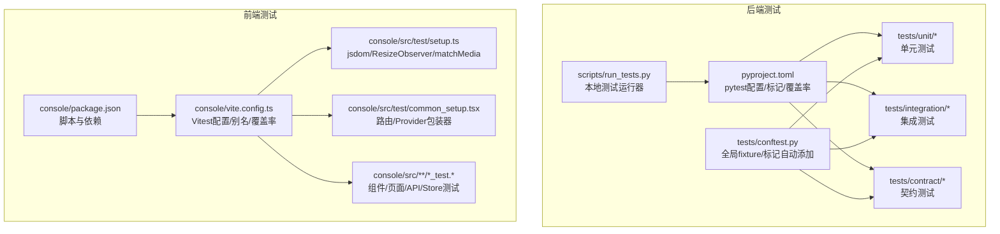
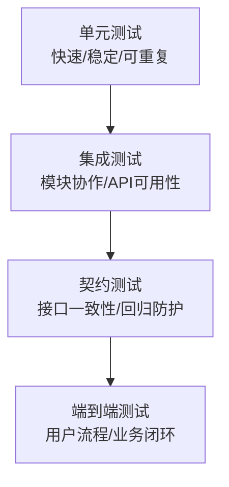
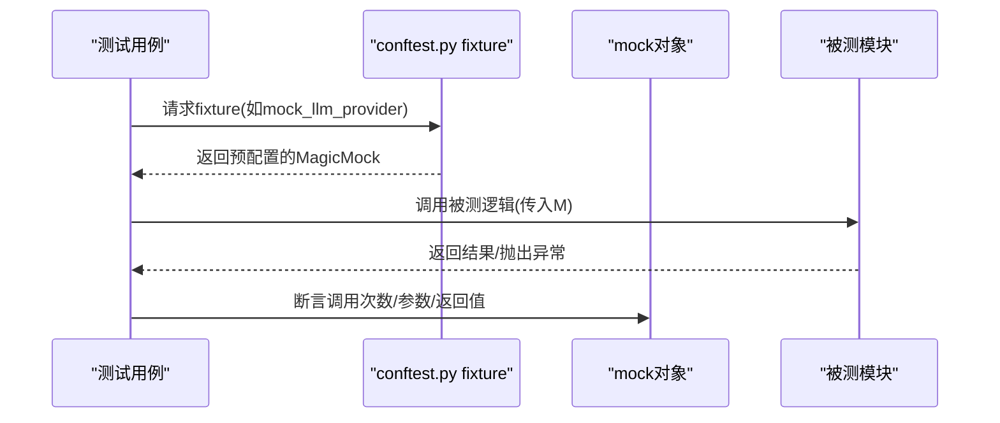
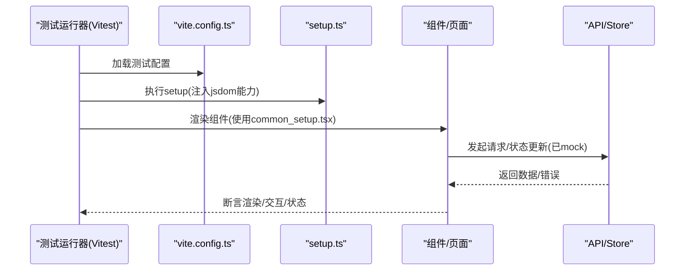
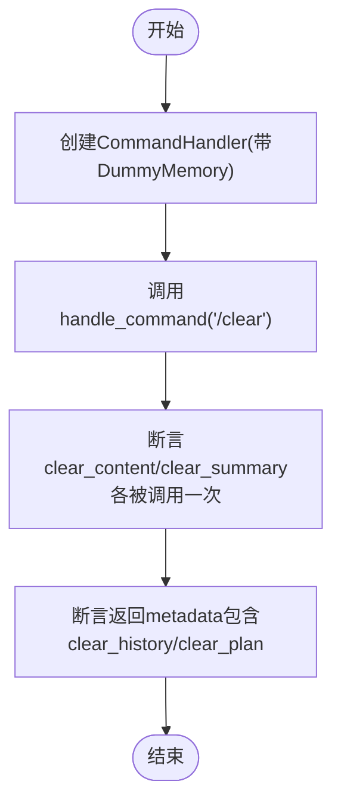
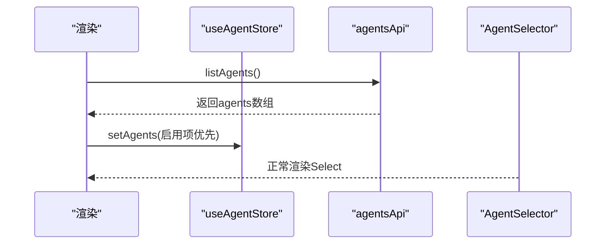
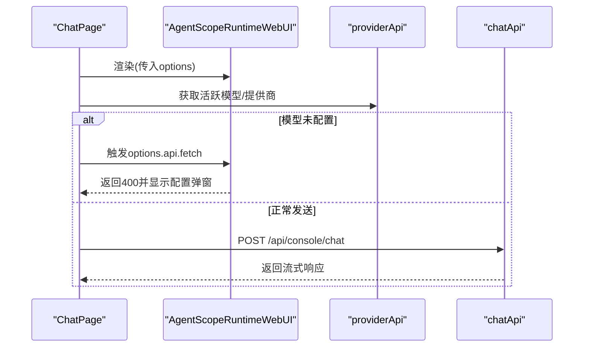
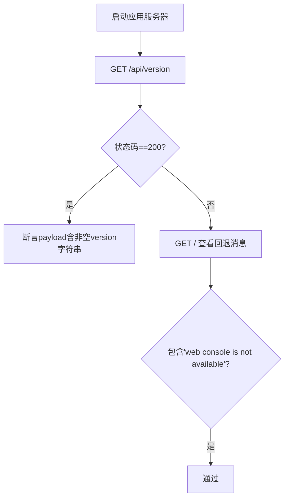
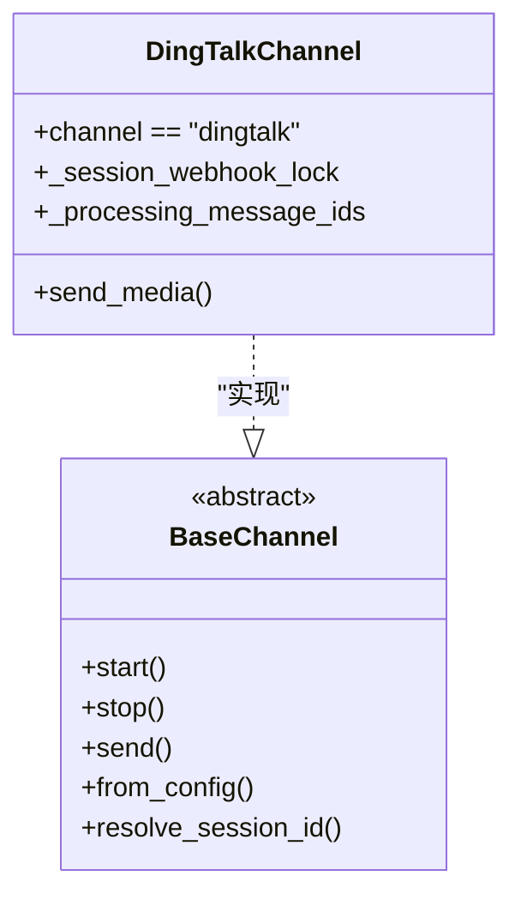
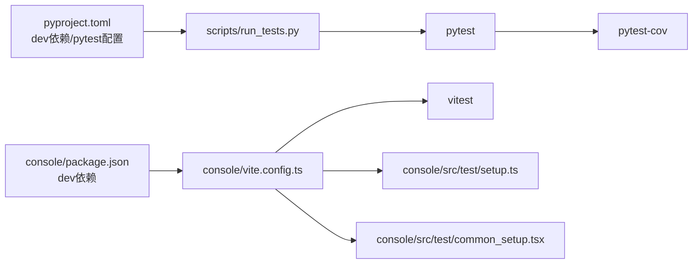

# 测试策略

<cite>
**本文引用的文件**
- [tests/conftest.py](file://tests/conftest.py)
- [scripts/run_tests.py](file://scripts/run_tests.py)
- [pyproject.toml](file://pyproject.toml)
- [console/package.json](file://console/package.json)
- [console/vite.config.ts](file://console/vite.config.ts)
- [console/src/test/setup.ts](file://console/src/test/setup.ts)
- [console/src/test/common_setup.tsx](file://console/src/test/common_setup.tsx)
- [console/src/api/modules/auth.test.ts](file://console/src/api/modules/auth.test.ts)
- [console/src/stores/agentStore.test.ts](file://console/src/stores/agentStore.test.ts)
- [console/src/components/AgentSelector/AgentSelector.test.tsx](file://console/src/components/AgentSelector/AgentSelector.test.tsx)
- [console/src/pages/Chat/ChatPage.test.tsx](file://console/src/pages/Chat/ChatPage.test.tsx)
- [tests/unit/agents/test_command_handler.py](file://tests/unit/agents/test_command_handler.py)
- [tests/integration/test_app_startup.py](file://tests/integration/test_app_startup.py)
- [tests/contract/channels/test_dingtalk_contract.py](file://tests/contract/channels/test_dingtalk_contract.py)
</cite>

## 目录
1. [引言](#引言)
2. [项目结构](#项目结构)
3. [核心组件](#核心组件)
4. [架构总览](#架构总览)
5. [详细组件分析](#详细组件分析)
6. [依赖分析](#依赖分析)
7. [性能考虑](#性能考虑)
8. [故障排查指南](#故障排查指南)
9. [结论](#结论)
10. [附录](#附录)

## 引言
本测试策略文档面向QwenPaw项目，系统化阐述测试金字塔结构（单元测试、集成测试、端到端测试）在Python后端与React前端的落地方式；明确测试框架配置、测试数据准备与模拟对象使用；给出新功能测试编写指南、覆盖率要求与报告生成；并覆盖测试环境搭建、持续集成中的测试执行与结果分析，帮助开发者编写高质量、可维护的测试代码。

## 项目结构
QwenPaw采用“双栈”测试布局：
- 后端（Python）：pytest + pytest-asyncio + pytest-cov，按层级划分unit/integration/contract目录，统一通过conftest.py提供全局fixture与标记。
- 前端（React/Vite/Vitest）：Vitest + jsdom，通过vite.config.ts集中配置测试环境、别名与覆盖率；console/src/test/setup.ts统一注入浏览器环境能力。

**图表来源**
- [pyproject.toml:116-127](file://pyproject.toml#L116-L127)
- [scripts/run_tests.py:148-173](file://scripts/run_tests.py#L148-L173)
- [tests/conftest.py:410-431](file://tests/conftest.py#L410-L431)
- [console/package.json:6-20](file://console/package.json#L6-L20)
- [console/vite.config.ts:50-95](file://console/vite.config.ts#L50-L95)
- [console/src/test/setup.ts:1-27](file://console/src/test/setup.ts#L1-L27)
- [console/src/test/common_setup.tsx:1-38](file://console/src/test/common_setup.tsx#L1-L38)

**章节来源**
- [pyproject.toml:116-127](file://pyproject.toml#L116-L127)
- [scripts/run_tests.py:148-173](file://scripts/run_tests.py#L148-L173)
- [tests/conftest.py:410-431](file://tests/conftest.py#L410-L431)
- [console/package.json:6-20](file://console/package.json#L6-L20)
- [console/vite.config.ts:50-95](file://console/vite.config.ts#L50-L95)
- [console/src/test/setup.ts:1-27](file://console/src/test/setup.ts#L1-L27)
- [console/src/test/common_setup.tsx:1-38](file://console/src/test/common_setup.tsx#L1-L38)

## 核心组件
- 测试框架与标记
  - 后端：pytest + asyncio_mode=auto；自定义标记unit/integration/contract/slow；测试路径tests。
  - 前端：Vitest + jsdom；全局setup注入matchMedia/ResizeObserver；别名映射第三方大包以避免内存问题。
- 全局fixture与隔离环境
  - tests/conftest.py提供temp_workspace、temp_copaw_home、mock_llm_provider、mock_channel、mock_process_handler等，确保测试隔离与可重复性。
- 覆盖率与报告
  - 后端：pytest-cov，源码范围src/qwenpaw，HTML+terminal缺失行报告，fail_under=30。
  - 前端：Vitest v8 provider，HTML/文本/LCOV报告，第一阶段阈值未强制。
- 本地测试运行器
  - scripts/run_tests.py支持按子目录运行单元测试、集成测试、并行执行、覆盖率生成。

**章节来源**
- [pyproject.toml:116-127](file://pyproject.toml#L116-L127)
- [pyproject.toml:129-152](file://pyproject.toml#L129-L152)
- [tests/conftest.py:41-118](file://tests/conftest.py#L41-L118)
- [tests/conftest.py:125-240](file://tests/conftest.py#L125-L240)
- [tests/conftest.py:316-395](file://tests/conftest.py#L316-L395)
- [scripts/run_tests.py:76-173](file://scripts/run_tests.py#L76-L173)
- [console/vite.config.ts:50-95](file://console/vite.config.ts#L50-L95)
- [console/src/test/setup.ts:1-27](file://console/src/test/setup.ts#L1-L27)

## 架构总览
测试金字塔在QwenPaw中的分层与职责：
- 单元测试（unit）
  - 面向函数/类/模块级逻辑，快速、稳定、可重复；使用mock减少外部依赖。
  - 示例：agents命令处理、provider接口实现、工具函数等。
- 集成测试（integration）
  - 关注模块间协作、API启动与基本可用性、配置加载等。
  - 示例：应用启动、版本接口、控制台入口回退。
- 端到端测试（e2e）
  - 模拟真实用户流程，验证完整业务闭环（当前仓库未发现e2e目录，建议后续补充）。
- 契约测试（contract）
  - 确保特定实现满足抽象接口契约，防止破坏性变更。
  - 示例：通道实现满足基类契约。

[此图为概念性架构示意，无需图表来源]

## 详细组件分析

### 后端测试：pytest配置与全局fixture
- 配置要点
  - 自动标记：基于路径自动为unit/integration/contract添加标记。
  - 环境隔离：临时工作空间、COPAW_HOME、清理敏感变量。
  - 常用mock：LLM提供者、通道、进程处理器、最小配置。
- 使用示例
  - 在单元测试中直接注入mock_llm_provider或temp_copaw_home，避免真实网络调用与文件污染。
  - 在契约测试中通过create_instance构造具体实现并断言其满足基类契约。

**图表来源**
- [tests/conftest.py:125-175](file://tests/conftest.py#L125-L175)
- [tests/conftest.py:178-240](file://tests/conftest.py#L178-L240)
- [tests/conftest.py:316-342](file://tests/conftest.py#L316-L342)

**章节来源**
- [tests/conftest.py:41-118](file://tests/conftest.py#L41-L118)
- [tests/conftest.py:125-175](file://tests/conftest.py#L125-L175)
- [tests/conftest.py:178-240](file://tests/conftest.py#L178-L240)
- [tests/conftest.py:316-395](file://tests/conftest.py#L316-L395)

### 前端测试：Vitest配置与组件测试
- 配置要点
  - 环境：jsdom；全局setup注入matchMedia与ResizeObserver。
  - 别名与内联：对大体积包进行别名或内联控制，避免内存溢出与挂起。
  - 覆盖率：v8 provider，HTML/文本/LCOV报告，包含src/**/*.{ts,tsx}。
- 组件测试模式
  - 使用common_setup.tsx包装App/MemoryRouter，保证路由与主题上下文可用。
  - 大量vi.mock对第三方库与内部模块进行隔离，聚焦组件行为验证。

**图表来源**
- [console/vite.config.ts:50-95](file://console/vite.config.ts#L50-L95)
- [console/src/test/setup.ts:1-27](file://console/src/test/setup.ts#L1-L27)
- [console/src/test/common_setup.tsx:1-38](file://console/src/test/common_setup.tsx#L1-L38)

**章节来源**
- [console/package.json:6-20](file://console/package.json#L6-L20)
- [console/vite.config.ts:50-95](file://console/vite.config.ts#L50-L95)
- [console/src/test/setup.ts:1-27](file://console/src/test/setup.ts#L1-L27)
- [console/src/test/common_setup.tsx:1-38](file://console/src/test/common_setup.tsx#L1-L38)

### 新功能测试编写指南
- 后端（Python）
  - 选择合适层级：优先单元测试，必要时扩展集成/契约测试。
  - 使用conftest.py提供的fixture：mock_llm_provider、mock_channel、minimal_config等。
  - 断言清晰：关注输入输出、异常路径、副作用（如文件写入）。
- 前端（React/Vitest）
  - 保持最小mock：仅对关键依赖进行vi.mock，避免过度隔离导致测试脆弱。
  - 使用renderWithProviders与screen查询，验证渲染与交互。
  - 对异步行为使用waitFor或act包裹，确保DOM稳定后再断言。

**章节来源**
- [tests/conftest.py:125-175](file://tests/conftest.py#L125-L175)
- [console/src/test/common_setup.tsx:1-38](file://console/src/test/common_setup.tsx#L1-L38)

### 测试覆盖率要求与报告
- 后端
  - 覆盖率源码范围：src/qwenpaw；忽略tests与缓存；fail_under=30。
  - 报告类型：HTML与terminal缺失行报告。
- 前端
  - 覆盖率源码范围：src/**/*.{ts,tsx}；排除测试文件与类型声明。
  - 报告类型：文本、HTML、JSON、LCOV；第一阶段不强制阈值，后续可提升。

**章节来源**
- [pyproject.toml:129-152](file://pyproject.toml#L129-L152)
- [console/vite.config.ts:82-94](file://console/vite.config.ts#L82-L94)

### 测试环境搭建与CI执行
- 本地执行
  - 使用scripts/run_tests.py：支持运行全部、指定unit子目录、集成测试、并行执行、覆盖率生成。
- CI建议
  - 安装开发依赖后，按模块分别执行pytest与vitest，并合并覆盖率报告。
  - 将htmlcov与前端coverage报告上传为Artifacts。

**章节来源**
- [scripts/run_tests.py:175-277](file://scripts/run_tests.py#L175-L277)
- [pyproject.toml:84-91](file://pyproject.toml#L84-L91)
- [console/package.json:6-20](file://console/package.json#L6-L20)

### 典型测试用例解析

#### 后端单元测试：命令处理器
- 目标：验证命令处理逻辑与内存操作。
- 方法：使用DummyMemory模拟依赖，断言调用次数与返回metadata。

**图表来源**
- [tests/unit/agents/test_command_handler.py:23-33](file://tests/unit/agents/test_command_handler.py#L23-L33)

**章节来源**
- [tests/unit/agents/test_command_handler.py:1-33](file://tests/unit/agents/test_command_handler.py#L1-L33)

#### 前端组件测试：AgentSelector
- 目标：验证挂载时拉取列表、启用项优先排序、失败时容错。
- 方法：vi.mock agentsApi与useAgentStore，断言调用与渲染。

**图表来源**
- [console/src/components/AgentSelector/AgentSelector.test.tsx:50-61](file://console/src/components/AgentSelector/AgentSelector.test.tsx#L50-L61)

**章节来源**
- [console/src/components/AgentSelector/AgentSelector.test.tsx:1-81](file://console/src/components/AgentSelector/AgentSelector.test.tsx#L1-L81)

#### 前端页面测试：ChatPage
- 目标：验证模型未配置时弹窗提示、正常发送消息、文件上传限制与成功路径。
- 方法：捕获AgentScopeRuntimeWebUI options，直接调用options.api.fetch与attachments.customRequest。

**图表来源**
- [console/src/pages/Chat/ChatPage.test.tsx:223-294](file://console/src/pages/Chat/ChatPage.test.tsx#L223-L294)

**章节来源**
- [console/src/pages/Chat/ChatPage.test.tsx:1-365](file://console/src/pages/Chat/ChatPage.test.tsx#L1-L365)

#### 集成测试：应用启动与控制台入口
- 目标：验证API版本接口可用、控制台入口回退策略。
- 方法：通过app_server.api_request发起HTTP请求并断言响应。

**图表来源**
- [tests/integration/test_app_startup.py:6-36](file://tests/integration/test_app_startup.py#L6-L36)

**章节来源**
- [tests/integration/test_app_startup.py:1-36](file://tests/integration/test_app_startup.py#L1-L36)

#### 契约测试：通道实现一致性
- 目标：确保DingTalkChannel满足BaseChannel契约，防止破坏性变更。
- 方法：断言抽象方法存在、会话管理、配置属性、线程安全与去重机制。

**图表来源**
- [tests/contract/channels/test_dingtalk_contract.py:28-107](file://tests/contract/channels/test_dingtalk_contract.py#L28-L107)

**章节来源**
- [tests/contract/channels/test_dingtalk_contract.py:1-187](file://tests/contract/channels/test_dingtalk_contract.py#L1-L187)

## 依赖分析
- 后端依赖
  - pytest、pytest-asyncio、pytest-cov、hypothesis等；通过pyproject.toml统一管理。
  - 运行器scripts/run_tests.py封装pytest调用，支持并行与覆盖率。
- 前端依赖
  - vitest、@testing-library/react、jsdom等；vite.config.ts集中配置测试环境与覆盖率。
  - console/src/test/setup.ts注入浏览器环境能力，common_setup.tsx提供路由与Provider包装。

**图表来源**
- [pyproject.toml:84-91](file://pyproject.toml#L84-L91)
- [scripts/run_tests.py:148-173](file://scripts/run_tests.py#L148-L173)
- [console/package.json:51-76](file://console/package.json#L51-L76)
- [console/vite.config.ts:50-95](file://console/vite.config.ts#L50-L95)
- [console/src/test/setup.ts:1-27](file://console/src/test/setup.ts#L1-L27)
- [console/src/test/common_setup.tsx:1-38](file://console/src/test/common_setup.tsx#L1-L38)

**章节来源**
- [pyproject.toml:84-91](file://pyproject.toml#L84-L91)
- [scripts/run_tests.py:148-173](file://scripts/run_tests.py#L148-L173)
- [console/package.json:51-76](file://console/package.json#L51-L76)
- [console/vite.config.ts:50-95](file://console/vite.config.ts#L50-L95)
- [console/src/test/setup.ts:1-27](file://console/src/test/setup.ts#L1-L27)
- [console/src/test/common_setup.tsx:1-38](file://console/src/test/common_setup.tsx#L1-L38)

## 性能考虑
- 并行执行
  - 后端：scripts/run_tests.py支持pytest-xdist并行；建议在CI中合理设置并发度。
  - 前端：Vitest默认单进程，可通过插件或外部并行策略优化。
- 内存与稳定性
  - 前端通过vite.config.ts对大包进行别名或内联，避免内存溢出；同时注入ResizeObserver与matchMedia，减少环境差异。
- 覆盖率与速度权衡
  - 前端第一阶段不强制阈值，建议逐步提升；后端fail_under=30，后续可提高以保障质量。

[本节为通用指导，无需章节来源]

## 故障排查指南
- 常见问题
  - 前端测试报错：检查console/src/test/setup.ts是否正确注入matchMedia/ResizeObserver；确认vite.config.ts别名与内联规则。
  - 契约测试失败：核对实现类是否实现所有抽象方法，特别是会话管理与线程安全字段。
  - 集成测试超时：检查app_server初始化与日志输出，定位阻塞点。
- 调试建议
  - 使用pytest -v -s或vitest --reporter=verbose获取更详细输出。
  - 在conftest.py中增加临时日志或断点，验证fixture状态。

**章节来源**
- [console/src/test/setup.ts:1-27](file://console/src/test/setup.ts#L1-L27)
- [console/vite.config.ts:50-95](file://console/vite.config.ts#L50-L95)
- [tests/contract/channels/test_dingtalk_contract.py:132-168](file://tests/contract/channels/test_dingtalk_contract.py#L132-L168)

## 结论
QwenPaw的测试体系以pytest与Vitest为核心，结合全局fixture与严格的配置，实现了从单元到契约的完整覆盖。建议后续补充端到端测试目录与用例，完善用户旅程验证；同时逐步提升覆盖率阈值，确保代码质量与可维护性。

## 附录
- 快速参考
  - 后端运行：python scripts/run_tests.py -a -c（全量+覆盖率）
  - 前端运行：npm run test:run 或 npm run test:coverage
  - 前端并行：可在CI中使用Vitest多进程或外部并行策略（需额外配置）

[本节为通用指导，无需章节来源]