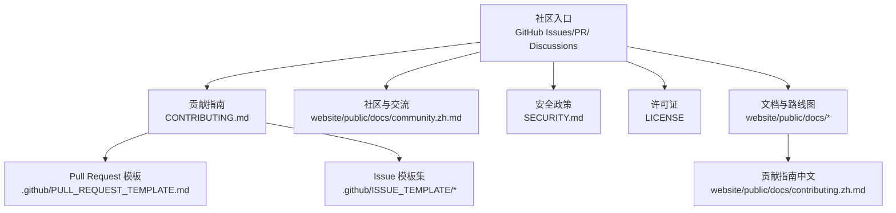
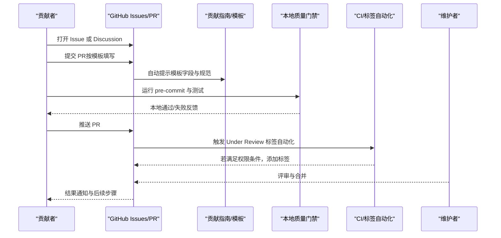
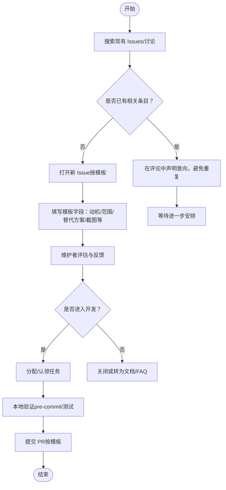
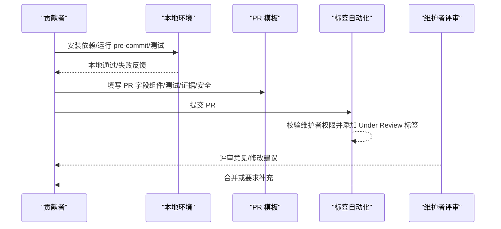
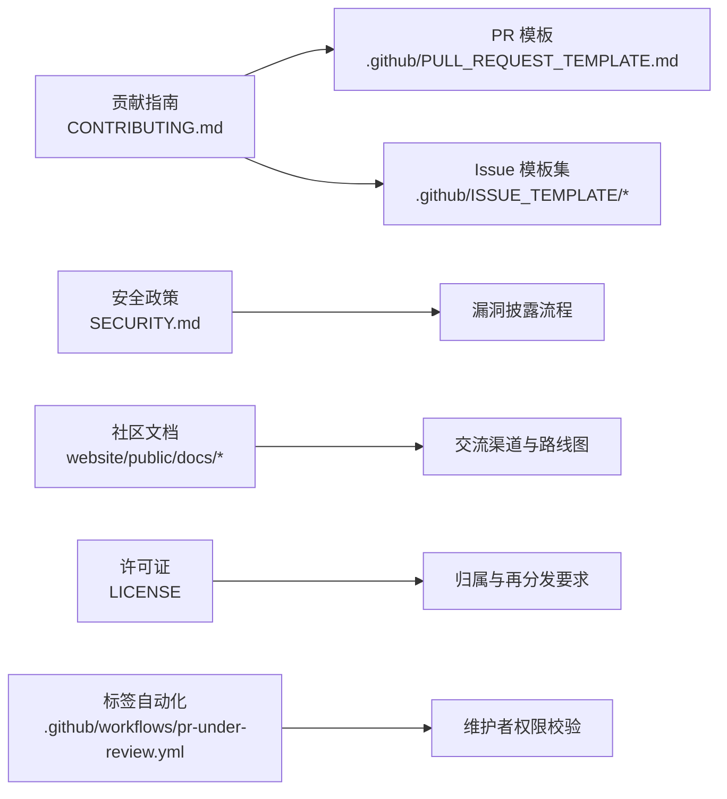

# 社区参与

<cite>
**本文引用的文件**
- [CONTRIBUTING.md](file://CONTRIBUTING.md)
- [README.md](file://README.md)
- [SECURITY.md](file://SECURITY.md)
- [LICENSE](file://LICENSE)
- [.github/PULL_REQUEST_TEMPLATE.md](file://.github/PULL_REQUEST_TEMPLATE.md)
- [.github/ISSUE_TEMPLATE/1-question.md](file://.github/ISSUE_TEMPLATE/1-question.md)
- [.github/ISSUE_TEMPLATE/2-feature_request.md](file://.github/ISSUE_TEMPLATE/2-feature_request.md)
- [.github/ISSUE_TEMPLATE/4-bug_report.md](file://.github/ISSUE_TEMPLATE/4-bug_report.md)
- [.github/ISSUE_TEMPLATE/config.yml](file://.github/ISSUE_TEMPLATE/config.yml)
- [website/public/docs/community.zh.md](file://website/public/docs/community.zh.md)
- [website/public/docs/contributing.zh.md](file://website/public/docs/contributing.zh.md)
- [pyproject.toml](file://pyproject.toml)
- [.github/workflows/pr-under-review.yml](file://.github/workflows/pr-under-review.yml)
</cite>

## 目录
1. [简介](#简介)
2. [项目结构](#项目结构)
3. [核心组件](#核心组件)
4. [架构总览](#架构总览)
5. [详细组件分析](#详细组件分析)
6. [依赖分析](#依赖分析)
7. [性能考虑](#性能考虑)
8. [故障排查指南](#故障排查指南)
9. [结论](#结论)
10. [附录](#附录)

## 简介
本指南面向所有希望参与 QwenPaw 社区的用户与贡献者，系统阐述社区行为准则、交流规范与协作方式；详解问题报告、功能请求与代码贡献的参与流程；说明社区资源利用、学习资料获取与技术支持渠道；介绍社区活动参与、技术分享与知识传播路径；明确开源协议、版权与许可注意事项；并解释如何成为项目维护者、获得贡献者权限以及参与决策过程。

## 项目结构
QwenPaw 是一个以“个人 AI 助手”为核心定位的开源项目，围绕多通道接入、技能扩展、本地/云端模型支持、安全与可运维能力构建。社区协作主要依托 GitHub Issues/PR、GitHub Discussions、官方文档与多语言社区渠道（Discord、钉钉、X/Twitter）展开。

图表来源
- [CONTRIBUTING.md](file://CONTRIBUTING.md)
- [SECURITY.md](file://SECURITY.md)
- [LICENSE](file://LICENSE)
- [.github/PULL_REQUEST_TEMPLATE.md](file://.github/PULL_REQUEST_TEMPLATE.md)
- [.github/ISSUE_TEMPLATE/1-question.md](file://.github/ISSUE_TEMPLATE/1-question.md)
- [.github/ISSUE_TEMPLATE/2-feature_request.md](file://.github/ISSUE_TEMPLATE/2-feature_request.md)
- [.github/ISSUE_TEMPLATE/4-bug_report.md](file://.github/ISSUE_TEMPLATE/4-bug_report.md)
- [website/public/docs/community.zh.md](file://website/public/docs/community.zh.md)
- [website/public/docs/contributing.zh.md](file://website/public/docs/contributing.zh.md)

章节来源
- [README.md](file://README.md)
- [CONTRIBUTING.md](file://CONTRIBUTING.md)
- [website/public/docs/community.zh.md](file://website/public/docs/community.zh.md)

## 核心组件
- 行为与协作规范
  - 遵循“友善、尊重、建设性”的社区文化，遵守贡献守则中的“做/不做”清单。
  - 大改动需先在 Issues 中讨论，避免重复劳动与方向偏差。
- 交流与沟通渠道
  - GitHub Discussions：技术讨论、想法分享、投票与意见征集。
  - GitHub Issues：Bug 报告、功能请求、文档改进。
  - 社区频道：Discord、钉钉群、X/Twitter。
- 贡献与评审流程
  - 提交信息与 PR 标题遵循约定式提交规范。
  - 本地质量门禁：安装开发依赖、安装并运行 pre-commit、执行测试。
  - PR 模板与审查标签自动化辅助（Under Review 标签自动添加）。
- 安全与合规
  - 私密漏洞披露通过阿里安全响应中心（ASRC）进行。
  - 明确信任边界、受控技能范围与部署假设，避免误报与越权场景。
- 开源许可与版权
  - 采用 Apache License 2.0，遵循许可证条款与归属要求。

章节来源
- [CONTRIBUTING.md](file://CONTRIBUTING.md)
- [.github/PULL_REQUEST_TEMPLATE.md](file://.github/PULL_REQUEST_TEMPLATE.md)
- [.github/ISSUE_TEMPLATE/config.yml](file://.github/ISSUE_TEMPLATE/config.yml)
- [SECURITY.md](file://SECURITY.md)
- [LICENSE](file://LICENSE)

## 架构总览
社区协作的总体流程如下：从需求发现（Issues/讨论）到方案设计（Issues/PR），再到本地验证（pre-commit/测试），最后进入评审与合并（PR 模板、标签自动化、维护者权限校验）。

图表来源
- [CONTRIBUTING.md](file://CONTRIBUTING.md)
- [.github/PULL_REQUEST_TEMPLATE.md](file://.github/PULL_REQUEST_TEMPLATE.md)
- [.github/ISSUE_TEMPLATE/1-question.md](file://.github/ISSUE_TEMPLATE/1-question.md)
- [.github/ISSUE_TEMPLATE/2-feature_request.md](file://.github/ISSUE_TEMPLATE/2-feature_request.md)
- [.github/ISSUE_TEMPLATE/4-bug_report.md](file://.github/ISSUE_TEMPLATE/4-bug_report.md)
- [.github/workflows/pr-under-review.yml](file://.github/workflows/pr-under-review.yml)

## 详细组件分析

### 问题报告与功能请求流程
- 适用场景
  - Bug 报告：使用 Bug 模板，提供版本、环境、复现步骤、日志截图等。
  - 功能请求：使用 Feature Request 模板，说明动机、影响范围、替代方案与期望。
  - 一般咨询：使用 Question 模板，或优先在 GitHub Discussions 展开讨论。
- 建议前置动作
  - 在 Issues 中搜索是否已有类似条目，避免重复。
  - 对大型改动，先开 Issue 讨论方案与兼容性。
- 模板字段与自动化
  - Issue 模板包含标题标签、组件影响范围、上下文与附加信息等字段，便于维护者快速分类与跟进。
  - GitHub Discussions 作为开放式讨论入口，适合收集反馈与形成共识。

图表来源
- [.github/ISSUE_TEMPLATE/1-question.md](file://.github/ISSUE_TEMPLATE/1-question.md)
- [.github/ISSUE_TEMPLATE/2-feature_request.md](file://.github/ISSUE_TEMPLATE/2-feature_request.md)
- [.github/ISSUE_TEMPLATE/4-bug_report.md](file://.github/ISSUE_TEMPLATE/4-bug_report.md)
- [.github/ISSUE_TEMPLATE/config.yml](file://.github/ISSUE_TEMPLATE/config.yml)

章节来源
- [.github/ISSUE_TEMPLATE/1-question.md](file://.github/ISSUE_TEMPLATE/1-question.md)
- [.github/ISSUE_TEMPLATE/2-feature_request.md](file://.github/ISSUE_TEMPLATE/2-feature_request.md)
- [.github/ISSUE_TEMPLATE/4-bug_report.md](file://.github/ISSUE_TEMPLATE/4-bug_report.md)
- [.github/ISSUE_TEMPLATE/config.yml](file://.github/ISSUE_TEMPLATE/config.yml)

### 代码贡献与评审流程
- 贡献类型与范围
  - 新增模型/模型提供商、新增通道、基础技能、平台支持、MCP 支持、文档与修复等。
- 本地质量门禁
  - 安装开发依赖、安装并运行 pre-commit、执行测试，确保通过后再提交 PR。
  - 前端变更需在 console/website 目录运行格式化工具。
- 提交与 PR 规范
  - 提交信息与 PR 标题遵循约定式提交规范，类型与作用域清晰。
  - PR 模板包含组件影响范围、测试方法、本地验证证据、安全考虑等字段。
- 自动化标签
  - 维护者（具备 admin/maintain/write 权限）的评论或评审将触发 Under Review 标签自动化，提升评审可见性。

图表来源
- [CONTRIBUTING.md](file://CONTRIBUTING.md)
- [.github/PULL_REQUEST_TEMPLATE.md](file://.github/PULL_REQUEST_TEMPLATE.md)
- [.github/workflows/pr-under-review.yml](file://.github/workflows/pr-under-review.yml)

章节来源
- [CONTRIBUTING.md](file://CONTRIBUTING.md)
- [.github/PULL_REQUEST_TEMPLATE.md](file://.github/PULL_REQUEST_TEMPLATE.md)
- [.github/workflows/pr-under-review.yml](file://.github/workflows/pr-under-review.yml)

### 社区资源与学习资料
- 官方文档与教程
  - 官网文档与多语言版本（中文、日文、俄文）覆盖安装、配置、模型、通道、技能、插件、MCP、内存、上下文、命令、心跳、多智能体、配置与工作目录、CLI、FAQ 等主题。
- 社区与交流
  - Discord、X/Twitter、钉钉群等渠道用于提问、经验分享、功能建议与获取动态。
  - 开发者群组（钉钉/私有 Discord）用于技术实现细节、任务认领、测试与路线图讨论。
- 路线图与贡献切入点
  - 路线图中标注“征集中”的领域（如新通道、模型提供商、技能、MCP、展示/交互优化）是良好的贡献起点。

章节来源
- [README.md](file://README.md)
- [website/public/docs/community.zh.md](file://website/public/docs/community.zh.md)
- [website/public/docs/contributing.zh.md](file://website/public/docs/contributing.zh.md)

### 技术支持与安全披露
- 技术支持渠道
  - GitHub Issues（按模板）、GitHub Discussions、Discord、钉钉群、X/Twitter。
- 安全披露
  - 私密漏洞通过阿里安全响应中心（ASRC）披露，需包含标题、严重性、影响、受影响组件、复现步骤、影响演示、环境、修复建议等。
  - 明确信任边界与受控技能范围，避免将“仅本地授权操作”误判为远程越权。
  - 不设悬赏与预算，鼓励直接提交可复现报告或修复 PR。

章节来源
- [SECURITY.md](file://SECURITY.md)
- [README.md](file://README.md)

### 开源协议与版权许可
- 许可证
  - 项目采用 Apache License 2.0，允许商用、再分发与修改，但需保留版权与许可证声明，并在修改文件上标注变更。
- 归属与通知
  - 再分发需附带 LICENSE 文件与 NOTICE（如有）；衍生作品需在 NOTICE 中包含相应归属信息。
- 贡献者授权
  - 通过提交贡献即默认同意以 Apache 2.0 授权分发。

章节来源
- [LICENSE](file://LICENSE)
- [pyproject.toml](file://pyproject.toml)

### 成为维护者与参与决策
- 权限与角色
  - 维护者权限由仓库设置决定（admin/maintain/write），标签自动化脚本基于该权限级别判断是否添加 Under Review 标签。
- 参与决策
  - 重大变更与设计敏感改动应在 Issues 中先行讨论，形成共识后再进入开发与评审阶段。
  - 路线图与“征集中”领域为社区协作提供明确方向，贡献者可据此认领任务或提出方案。

章节来源
- [.github/workflows/pr-under-review.yml](file://.github/workflows/pr-under-review.yml)
- [CONTRIBUTING.md](file://CONTRIBUTING.md)

## 依赖分析
社区协作流程与工具链的依赖关系如下：

图表来源
- [CONTRIBUTING.md](file://CONTRIBUTING.md)
- [.github/PULL_REQUEST_TEMPLATE.md](file://.github/PULL_REQUEST_TEMPLATE.md)
- [.github/ISSUE_TEMPLATE/1-question.md](file://.github/ISSUE_TEMPLATE/1-question.md)
- [.github/ISSUE_TEMPLATE/2-feature_request.md](file://.github/ISSUE_TEMPLATE/2-feature_request.md)
- [.github/ISSUE_TEMPLATE/4-bug_report.md](file://.github/ISSUE_TEMPLATE/4-bug_report.md)
- [SECURITY.md](file://SECURITY.md)
- [LICENSE](file://LICENSE)
- [.github/workflows/pr-under-review.yml](file://.github/workflows/pr-under-review.yml)
- [website/public/docs/community.zh.md](file://website/public/docs/community.zh.md)
- [website/public/docs/contributing.zh.md](file://website/public/docs/contributing.zh.md)

章节来源
- [CONTRIBUTING.md](file://CONTRIBUTING.md)
- [.github/PULL_REQUEST_TEMPLATE.md](file://.github/PULL_REQUEST_TEMPLATE.md)
- [.github/ISSUE_TEMPLATE/config.yml](file://.github/ISSUE_TEMPLATE/config.yml)
- [SECURITY.md](file://SECURITY.md)
- [LICENSE](file://LICENSE)
- [.github/workflows/pr-under-review.yml](file://.github/workflows/pr-under-review.yml)
- [website/public/docs/community.zh.md](file://website/public/docs/community.zh.md)
- [website/public/docs/contributing.zh.md](file://website/public/docs/contributing.zh.md)

## 性能考虑
- 本地质量门禁优先：pre-commit 与测试先行，减少 CI 失败与反复迭代成本。
- 前端格式化：涉及 console/website 的变更需提前格式化，降低评审摩擦。
- 文档同步：新增或变更用户可见行为时同步更新网站文档，减少后期维护成本。

## 故障排查指南
- 常见问题定位
  - 本地检查未通过：确认已安装开发依赖、pre-commit 已安装并完成全部文件检查、测试通过。
  - PR 被阻塞：检查 pre-commit 是否自动修复并需要再次运行；确认模板字段填写完整。
  - 评审无进展：确认 Under Review 标签是否因权限不足未添加；在 Discussion 中寻求维护者关注。
- 安全问题
  - 漏洞披露：严格按安全政策要求准备材料并通过 ASRC 私密渠道提交。
  - 误报识别：明确信任边界与受控技能范围，避免将本地授权行为误判为越权。

章节来源
- [CONTRIBUTING.md](file://CONTRIBUTING.md)
- [.github/PULL_REQUEST_TEMPLATE.md](file://.github/PULL_REQUEST_TEMPLATE.md)
- [.github/workflows/pr-under-review.yml](file://.github/workflows/pr-under-review.yml)
- [SECURITY.md](file://SECURITY.md)

## 结论
QwenPaw 社区以开放、协作与安全为核心，通过完善的模板与自动化工具链保障贡献质量与效率。建议贡献者遵循约定式提交、完成本地质量门禁、在 Issues/PR 中充分沟通并在 Discussion 中沉淀共识。安全问题坚持私密披露与最小化影响原则。在 Apache 2.0 许可下，贡献者与使用者共享成果、共担责任，共同推动项目演进。

## 附录
- 快速链接
  - 贡献指南：[CONTRIBUTING.md](file://CONTRIBUTING.md)
  - 安全政策：[SECURITY.md](file://SECURITY.md)
  - 许可证：[LICENSE](file://LICENSE)
  - 社区与交流（中文）：[community.zh.md](file://website/public/docs/community.zh.md)
  - 贡献指南（中文）：[contributing.zh.md](file://website/public/docs/contributing.zh.md)
  - PR 模板：[PULL_REQUEST_TEMPLATE.md](file://.github/PULL_REQUEST_TEMPLATE.md)
  - Issue 模板集：[ISSUE_TEMPLATE/*](file://.github/ISSUE_TEMPLATE/)
  - 标签自动化工作流：[pr-under-review.yml](file://.github/workflows/pr-under-review.yml)