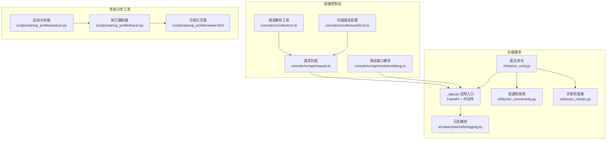
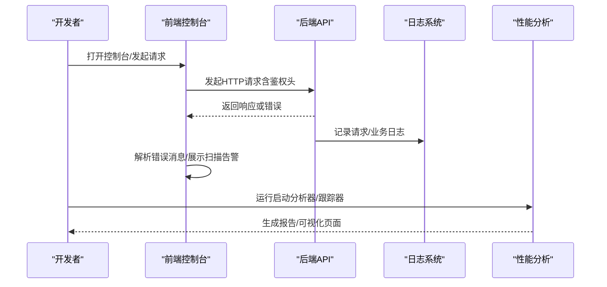
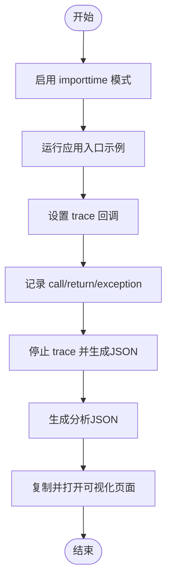
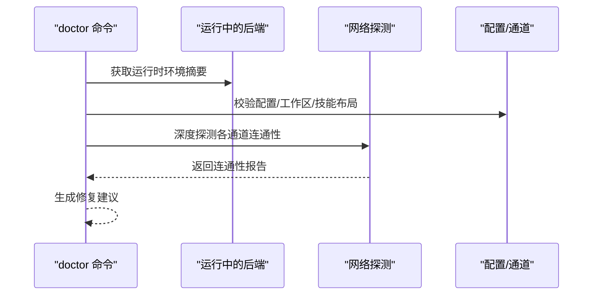
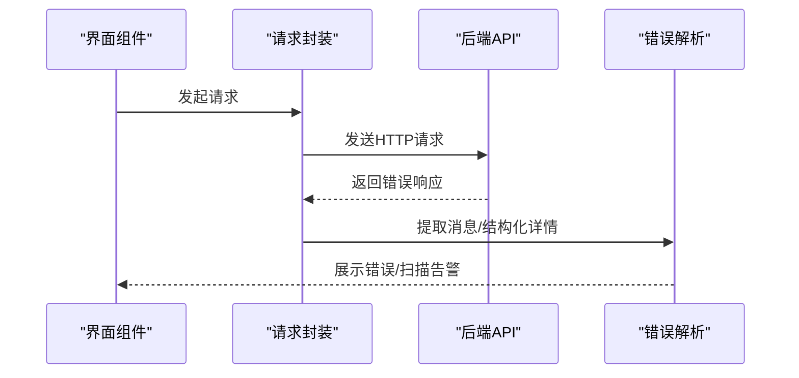
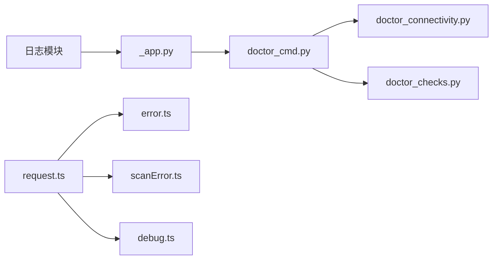

# 调试与性能分析

<cite>
**本文引用的文件**
- [src/qwenpaw/utils/logging.py](file://src/qwenpaw/utils/logging.py)
- [src/qwenpaw/app/_app.py](file://src/qwenpaw/app/_app.py)
- [console/src/api/modules/debug.ts](file://console/src/api/modules/debug.ts)
- [console/src/api/request.ts](file://console/src/api/request.ts)
- [console/src/utils/error.ts](file://console/src/utils/error.ts)
- [console/src/utils/scanError.ts](file://console/src/utils/scanError.ts)
- [scripts/startup_profile/analyze.py](file://scripts/startup_profile/analyze.py)
- [scripts/startup_profile/tracer.py](file://scripts/startup_profile/tracer.py)
- [scripts/startup_profile/viewer.html](file://scripts/startup_profile/viewer.html)
- [src/qwenpaw/cli/doctor_cmd.py](file://src/qwenpaw/cli/doctor_cmd.py)
- [src/qwenpaw/cli/doctor_connectivity.py](file://src/qwenpaw/cli/doctor_connectivity.py)
- [src/qwenpaw/cli/doctor_checks.py](file://src/qwenpaw/cli/doctor_checks.py)
</cite>

## 目录
1. [简介](#简介)
2. [项目结构](#项目结构)
3. [核心组件](#核心组件)
4. [架构总览](#架构总览)
5. [详细组件分析](#详细组件分析)
6. [依赖分析](#依赖分析)
7. [性能考量](#性能考量)
8. [故障排查指南](#故障排查指南)
9. [结论](#结论)
10. [附录](#附录)

## 简介
本指南面向QwenPaw开发者与运维人员，提供从开发到生产的全链路调试与性能分析方法。内容覆盖：
- 开发环境调试技巧（断点、变量检查、日志级别）
- 日志系统使用、错误追踪与异常处理调试策略
- 性能分析工具（启动耗时、函数调用跟踪）与CPU/内存瓶颈定位
- 前端调试（网络请求、错误解析、扫描告警）、异步任务调试
- 生产环境问题排查、性能监控与优化建议
- 常见问题案例与解决方案

## 项目结构
QwenPaw由Python后端FastAPI服务与React前端控制台组成，调试与性能分析能力分布于：
- 后端：日志、启动诊断、网络连通性探测、运行时健康信息
- 前端：请求封装、错误解析、安全扫描错误展示
- 工具脚本：启动性能分析与可视化

图表来源
- [src/qwenpaw/app/_app.py:1-200](file://src/qwenpaw/app/_app.py#L1-L200)
- [src/qwenpaw/utils/logging.py:1-226](file://src/qwenpaw/utils/logging.py#L1-L226)
- [console/src/api/request.ts:1-105](file://console/src/api/request.ts#L1-L105)
- [console/src/api/modules/debug.ts:1-18](file://console/src/api/modules/debug.ts#L1-L18)
- [console/src/utils/error.ts:1-25](file://console/src/utils/error.ts#L1-L25)
- [console/src/utils/scanError.ts:1-173](file://console/src/utils/scanError.ts#L1-L173)
- [scripts/startup_profile/analyze.py:1-323](file://scripts/startup_profile/analyze.py#L1-L323)
- [scripts/startup_profile/tracer.py:1-224](file://scripts/startup_profile/tracer.py#L1-L224)
- [scripts/startup_profile/viewer.html:736-1112](file://scripts/startup_profile/viewer.html#L736-L1112)

章节来源
- [src/qwenpaw/app/_app.py:1-200](file://src/qwenpaw/app/_app.py#L1-L200)
- [src/qwenpaw/utils/logging.py:1-226](file://src/qwenpaw/utils/logging.py#L1-L226)
- [console/src/api/request.ts:1-105](file://console/src/api/request.ts#L1-L105)
- [console/src/api/modules/debug.ts:1-18](file://console/src/api/modules/debug.ts#L1-L18)
- [console/src/utils/error.ts:1-25](file://console/src/utils/error.ts#L1-L25)
- [console/src/utils/scanError.ts:1-173](file://console/src/utils/scanError.ts#L1-L173)
- [scripts/startup_profile/analyze.py:1-323](file://scripts/startup_profile/analyze.py#L1-L323)
- [scripts/startup_profile/tracer.py:1-224](file://scripts/startup_profile/tracer.py#L1-L224)
- [scripts/startup_profile/viewer.html:736-1112](file://scripts/startup_profile/viewer.html#L736-L1112)

## 核心组件
- 后端日志系统：统一命名空间、彩色终端输出、安全轮转文件处理器、访问日志过滤
- 启动性能分析：导入耗时采集与解析、执行轨迹采集与可视化
- 医生命令（doctor）：环境、配置、通道连通性、工作区可写性等自检与修复建议
- 前端请求与错误处理：统一错误消息提取、认证失败重定向、扫描错误弹窗
- 调试接口：获取后端日志片段，辅助定位问题

章节来源
- [src/qwenpaw/utils/logging.py:154-226](file://src/qwenpaw/utils/logging.py#L154-L226)
- [scripts/startup_profile/analyze.py:180-323](file://scripts/startup_profile/analyze.py#L180-L323)
- [scripts/startup_profile/tracer.py:198-224](file://scripts/startup_profile/tracer.py#L198-L224)
- [src/qwenpaw/cli/doctor_cmd.py:377-800](file://src/qwenpaw/cli/doctor_cmd.py#L377-L800)
- [console/src/api/request.ts:60-105](file://console/src/api/request.ts#L60-L105)
- [console/src/utils/error.ts:1-25](file://console/src/utils/error.ts#L1-L25)
- [console/src/utils/scanError.ts:132-173](file://console/src/utils/scanError.ts#L132-L173)
- [console/src/api/modules/debug.ts:12-17](file://console/src/api/modules/debug.ts#L12-L17)

## 架构总览
后端通过FastAPI提供REST接口，前端通过统一请求封装与后端交互；日志模块在应用启动时初始化，支持标准输出与文件输出；性能分析工具独立运行，生成JSON并由HTML可视化页面渲染。

图表来源
- [src/qwenpaw/app/_app.py:1-200](file://src/qwenpaw/app/_app.py#L1-L200)
- [src/qwenpaw/utils/logging.py:154-226](file://src/qwenpaw/utils/logging.py#L154-L226)
- [console/src/api/request.ts:60-105](file://console/src/api/request.ts#L60-L105)
- [console/src/utils/error.ts:1-25](file://console/src/utils/error.ts#L1-L25)
- [console/src/utils/scanError.ts:132-173](file://console/src/utils/scanError.ts#L132-L173)
- [scripts/startup_profile/analyze.py:180-323](file://scripts/startup_profile/analyze.py#L180-L323)
- [scripts/startup_profile/tracer.py:198-224](file://scripts/startup_profile/tracer.py#L198-L224)

## 详细组件分析

### 后端日志系统
- 功能要点
  - 设置根日志器级别，抑制第三方包噪音，仅输出项目命名空间日志
  - 彩色终端格式化器，自动去除路径前缀，便于快速定位
  - 安全轮转文件处理器，兼容Windows文件锁场景
  - 访问日志过滤器，按路径子串屏蔽特定uvicorn访问日志
  - 支持添加文件处理器，自动创建目录并避免重复句柄

- 调试建议
  - 使用环境变量调整日志级别，结合彩色输出快速识别错误等级
  - 在守护进程场景添加文件处理器，避免日志丢失
  - 对高频访问接口使用过滤器降低噪声

章节来源
- [src/qwenpaw/utils/logging.py:154-226](file://src/qwenpaw/utils/logging.py#L154-L226)

### 启动性能分析器与执行跟踪器
- 启动分析器
  - 通过Python importtime收集导入耗时，解析出QwenPaw与第三方模块耗时
  - 可选执行轨迹采集，统计函数累计耗时与调用顺序
  - 输出JSON并复制HTML报告，内置HTTP服务器与浏览器打开

- 执行跟踪器
  - 使用sys.settrace拦截函数调用/返回/异常事件
  - 生成包含进入时间、退出时间、持续时间、调用深度、父函数等的完整序列
  - 导出元数据、函数耗时与执行顺序，供可视化页面渲染

- 可视化页面
  - 展示导入耗时Top模块、函数耗时Top列表、调用时序图
  - 提供颜色分级（快/中/慢）与详情面板

图表来源
- [scripts/startup_profile/analyze.py:18-87](file://scripts/startup_profile/analyze.py#L18-L87)
- [scripts/startup_profile/tracer.py:30-155](file://scripts/startup_profile/tracer.py#L30-L155)
- [scripts/startup_profile/viewer.html:736-1112](file://scripts/startup_profile/viewer.html#L736-L1112)

章节来源
- [scripts/startup_profile/analyze.py:180-323](file://scripts/startup_profile/analyze.py#L180-L323)
- [scripts/startup_profile/tracer.py:198-224](file://scripts/startup_profile/tracer.py#L198-L224)

### 医生命令（doctor）与连通性探测
- 医生命令
  - 环境摘要、配置校验、代理/网络环境提示
  - 代理/网络连通性（可选深度探测）
  - 工作区可写性、技能布局、浏览器自动化、安全基线、内存嵌入等检查
  - 提供修复建议与保守修复计划（带备份）

- 连通性探测
  - 针对已启用通道进行TCP/HTTP探测，汇总不可达或错误原因
  - 支持自定义通道覆盖doctor_connectivity_notes

图表来源
- [src/qwenpaw/cli/doctor_cmd.py:377-800](file://src/qwenpaw/cli/doctor_cmd.py#L377-L800)
- [src/qwenpaw/cli/doctor_connectivity.py:248-331](file://src/qwenpaw/cli/doctor_connectivity.py#L248-L331)
- [src/qwenpaw/cli/doctor_checks.py:90-184](file://src/qwenpaw/cli/doctor_checks.py#L90-L184)

章节来源
- [src/qwenpaw/cli/doctor_cmd.py:377-800](file://src/qwenpaw/cli/doctor_cmd.py#L377-L800)
- [src/qwenpaw/cli/doctor_connectivity.py:248-331](file://src/qwenpaw/cli/doctor_connectivity.py#L248-L331)
- [src/qwenpaw/cli/doctor_checks.py:90-184](file://src/qwenpaw/cli/doctor_checks.py#L90-L184)

### 前端请求封装与错误处理
- 请求封装
  - 统一构建请求头（含鉴权），自动设置Content-Type
  - 处理非2xx响应，优先从JSON payload提取message/detail/error
  - 401时清理令牌并跳转登录页

- 错误解析与扫描错误
  - 提取结构化错误详情，支持“ - ”分隔的原始体
  - 安全扫描错误解析与弹窗展示，限制列表长度，保留完整历史

图表来源
- [console/src/api/request.ts:60-105](file://console/src/api/request.ts#L60-L105)
- [console/src/utils/error.ts:1-25](file://console/src/utils/error.ts#L1-L25)
- [console/src/utils/scanError.ts:132-173](file://console/src/utils/scanError.ts#L132-L173)

章节来源
- [console/src/api/request.ts:60-105](file://console/src/api/request.ts#L60-L105)
- [console/src/utils/error.ts:1-25](file://console/src/utils/error.ts#L1-L25)
- [console/src/utils/scanError.ts:132-173](file://console/src/utils/scanError.ts#L132-L173)

### 调试接口：后端日志拉取
- 接口定义
  - getBackendLogs：按行数拉取后端日志片段，包含路径、存在性、更新时间、大小与内容
- 使用场景
  - 控制台内直接查看最近日志，辅助定位异常发生前后上下文

章节来源
- [console/src/api/modules/debug.ts:12-17](file://console/src/api/modules/debug.ts#L12-L17)

## 依赖分析
- 后端日志依赖Python标准库与logging.handlers，确保跨平台稳定性
- 医生命令依赖httpx、socket、配置模型与通道注册表，形成自检闭环
- 前端请求封装依赖浏览器fetch与鉴权头构建，错误解析与扫描错误处理依赖i18n与UI组件

图表来源
- [src/qwenpaw/utils/logging.py:1-226](file://src/qwenpaw/utils/logging.py#L1-L226)
- [src/qwenpaw/app/_app.py:1-200](file://src/qwenpaw/app/_app.py#L1-L200)
- [src/qwenpaw/cli/doctor_cmd.py:1-1069](file://src/qwenpaw/cli/doctor_cmd.py#L1-L1069)
- [src/qwenpaw/cli/doctor_connectivity.py:1-331](file://src/qwenpaw/cli/doctor_connectivity.py#L1-L331)
- [src/qwenpaw/cli/doctor_checks.py:1-200](file://src/qwenpaw/cli/doctor_checks.py#L1-L200)
- [console/src/api/request.ts:1-105](file://console/src/api/request.ts#L1-L105)
- [console/src/utils/error.ts:1-25](file://console/src/utils/error.ts#L1-L25)
- [console/src/utils/scanError.ts:1-173](file://console/src/utils/scanError.ts#L1-L173)
- [console/src/api/modules/debug.ts:1-18](file://console/src/api/modules/debug.ts#L1-L18)

## 性能考量
- 启动阶段
  - 使用启动分析器识别导入耗时Top模块，优先优化大模块或延迟加载
  - 关注第三方库占比，必要时拆分依赖或采用条件导入
- 运行阶段
  - 利用执行跟踪器定位热点函数，结合可视化页面的调用时序图分析调用链
  - 对高耗时函数进行缓存、批处理或异步化改造
- 日志与I/O
  - 启用文件处理器并合理设置轮转大小与备份数，避免磁盘压力
  - 对高频访问接口使用日志过滤器减少噪声

章节来源
- [scripts/startup_profile/analyze.py:180-323](file://scripts/startup_profile/analyze.py#L180-L323)
- [scripts/startup_profile/tracer.py:198-224](file://scripts/startup_profile/tracer.py#L198-L224)
- [src/qwenpaw/utils/logging.py:191-226](file://src/qwenpaw/utils/logging.py#L191-L226)

## 故障排查指南
- 开发环境调试
  - 断点与变量检查：在IDE中设置断点，结合日志输出观察变量变化
  - 日志级别：临时提升日志级别，捕获更详细上下文
- 错误追踪与异常处理
  - 前端：使用错误解析工具提取结构化详情，结合后端日志定位异常栈
  - 后端：启用文件处理器，配合调试接口拉取最近日志
- 网络与通道问题
  - 使用医生命令的连通性探测，确认目标主机/端口可达与API可用性
  - 对自定义通道实现doctor_connectivity_notes，补充特定探测逻辑
- 异步任务调试
  - 关注任务注册与注销流程，确保在异常/取消时正确清理
  - 结合日志与可视化页面，核对调用深度与耗时

章节来源
- [console/src/api/request.ts:60-105](file://console/src/api/request.ts#L60-L105)
- [console/src/utils/error.ts:1-25](file://console/src/utils/error.ts#L1-L25)
- [console/src/utils/scanError.ts:132-173](file://console/src/utils/scanError.ts#L132-L173)
- [src/qwenpaw/app/_app.py:128-194](file://src/qwenpaw/app/_app.py#L128-L194)
- [src/qwenpaw/cli/doctor_connectivity.py:248-331](file://src/qwenpaw/cli/doctor_connectivity.py#L248-L331)

## 结论
通过日志系统、启动性能分析、执行跟踪、医生命令与前端错误处理的协同，QwenPaw提供了从开发到生产的完整调试与性能分析能力。建议在日常开发中：
- 将日志级别与文件处理器纳入常规配置
- 定期运行启动分析器与执行跟踪器，建立性能基线
- 使用医生命令进行周期性健康检查
- 借助前端错误解析与扫描告警，快速定位问题根因

## 附录
- 常见问题与建议
  - 启动缓慢：优先优化导入耗时Top模块，拆分依赖或延迟加载
  - 日志过大：调整轮转参数，启用访问日志过滤器
  - 通道不可达：使用连通性探测定位网络/认证问题
  - 前端报错难定位：启用结构化错误解析，结合后端日志与调试接口