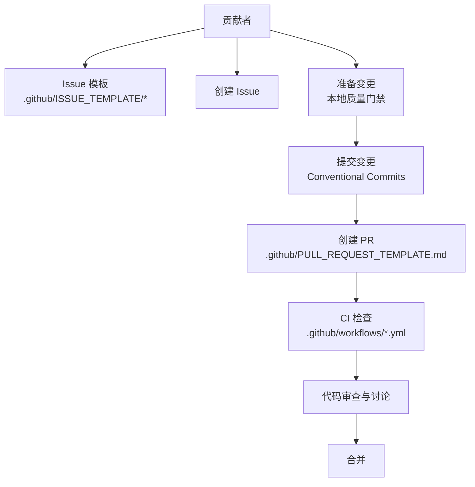
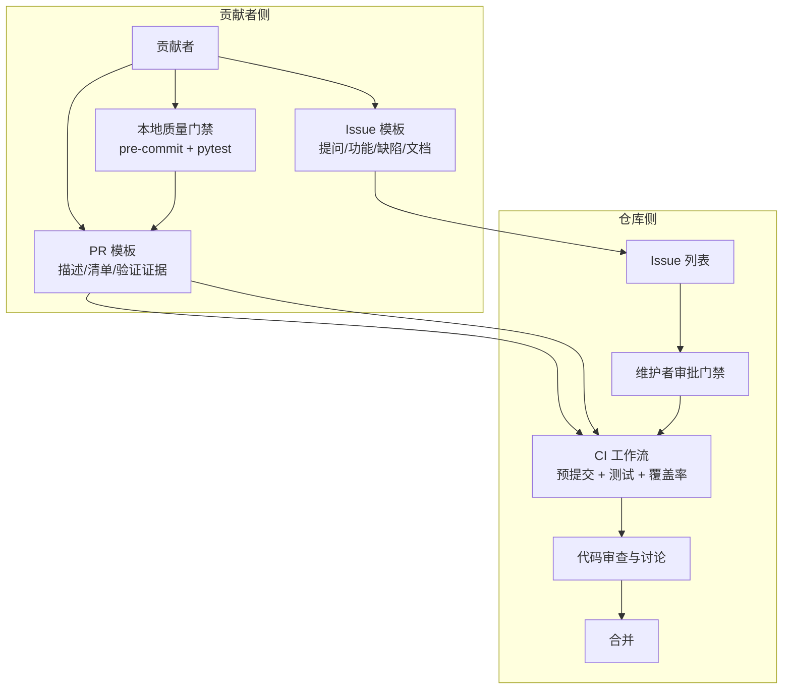
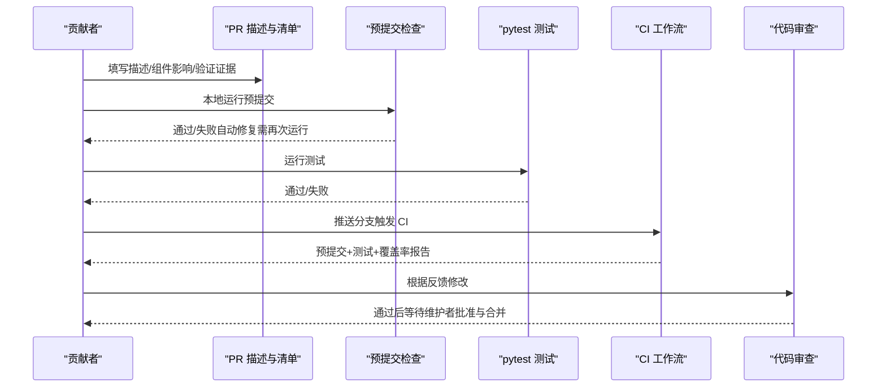
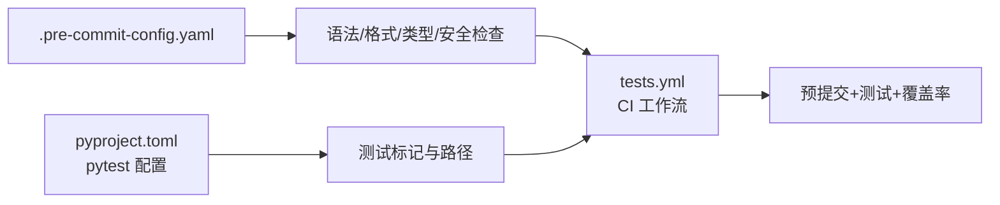

# 贡献流程

<cite>
**本文引用的文件**
- [CONTRIBUTING.md](file://CONTRIBUTING.md)
- [.github/PULL_REQUEST_TEMPLATE.md](file://.github/PULL_REQUEST_TEMPLATE.md)
- [.github/ISSUE_TEMPLATE/1-question.md](file://.github/ISSUE_TEMPLATE/1-question.md)
- [.github/ISSUE_TEMPLATE/2-feature_request.md](file://.github/ISSUE_TEMPLATE/2-feature_request.md)
- [.github/ISSUE_TEMPLATE/4-bug_report.md](file://.github/ISSUE_TEMPLATE/4-bug_report.md)
- [.github/ISSUE_TEMPLATE/3-documentation.md](file://.github/ISSUE_TEMPLATE/3-documentation.md)
- [.github/workflows/tests.yml](file://.github/workflows/tests.yml)
- [.github/workflows/pre-commit.yml](file://.github/workflows/pre-commit.yml)
- [.pre-commit-config.yaml](file://.pre-commit-config.yaml)
- [pyproject.toml](file://pyproject.toml)
- [README.md](file://README.md)
</cite>

## 目录
1. [简介](#简介)
2. [项目结构](#项目结构)
3. [核心组件](#核心组件)
4. [架构总览](#架构总览)
5. [详细组件分析](#详细组件分析)
6. [依赖分析](#依赖分析)
7. [性能考虑](#性能考虑)
8. [故障排查指南](#故障排查指南)
9. [结论](#结论)
10. [附录](#附录)

## 简介
本指南面向所有希望参与 QwenPaw 开源协作的贡献者，覆盖从“发现问题”到“代码合并”的完整流程：Issue 创建、PR 提交与审查、分支与版本策略、提交信息与 PR 描述规范、不同类型贡献的最佳实践（Bug 修复、新增功能、文档改进）、社区沟通渠道、持续集成检查、代码质量门禁与合并条件等。目标是帮助贡献者以最小摩擦达成高质量交付。

## 项目结构
QwenPaw 是一个前后端分离、多语言混合的工程：后端 Python（主包与 CLI）、前端 Console（React/Vite）与网站文档（website），以及大量测试与脚本。贡献流程的关键入口与规则主要由以下位置定义：
- 贡献指南与规范：CONTRIBUTING.md
- PR 模板：.github/PULL_REQUEST_TEMPLATE.md
- Issue 模板：.github/ISSUE_TEMPLATE 下的多个模板
- CI 工作流：.github/workflows/*.yml
- 本地质量门禁：.pre-commit-config.yaml
- 测试与覆盖率：pyproject.toml 中的 pytest 配置与标记
- 项目总览与贡献入口：README.md

图示来源
- [CONTRIBUTING.md:15-236](file://CONTRIBUTING.md#L15-L236)
- [.github/PULL_REQUEST_TEMPLATE.md:1-62](file://.github/PULL_REQUEST_TEMPLATE.md#L1-L62)
- [.github/workflows/tests.yml:1-252](file://.github/workflows/tests.yml#L1-L252)
- [.pre-commit-config.yaml:1-121](file://.pre-commit-config.yaml#L1-L121)

章节来源
- [CONTRIBUTING.md:15-236](file://CONTRIBUTING.md#L15-L236)
- [.github/ISSUE_TEMPLATE/1-question.md:1-24](file://.github/ISSUE_TEMPLATE/1-question.md#L1-L24)
- [.github/ISSUE_TEMPLATE/2-feature_request.md:1-44](file://.github/ISSUE_TEMPLATE/2-feature_request.md#L1-L44)
- [.github/ISSUE_TEMPLATE/4-bug_report.md:1-63](file://.github/ISSUE_TEMPLATE/4-bug_report.md#L1-L63)
- [.github/ISSUE_TEMPLATE/3-documentation.md:1-37](file://.github/ISSUE_TEMPLATE/3-documentation.md#L1-L37)
- [.github/workflows/tests.yml:1-252](file://.github/workflows/tests.yml#L1-L252)
- [.github/workflows/pre-commit.yml:1-41](file://.github/workflows/pre-commit.yml#L1-L41)
- [.pre-commit-config.yaml:1-121](file://.pre-commit-config.yaml#L1-L121)
- [pyproject.toml:116-152](file://pyproject.toml#L116-L152)
- [README.md:469-478](file://README.md#L469-L478)

## 核心组件
- Issue 与需求管理
  - 使用 Issue 模板进行分类：提问/讨论、功能请求、缺陷报告、文档问题。
  - 在开始实现前先开 Issue 并在评论中声明认领，避免重复劳动。
- 提交信息与 PR 标题
  - 遵循约定式提交（Conventional Commits），类型涵盖 feat、fix、docs、test、refactor、chore、perf、style、build、revert 等。
  - PR 标题格式与提交信息一致，scope 必须小写且简洁。
- 本地质量门禁（必须通过）
  - 安装开发依赖与预提交钩子，运行全量检查；若自动修复，请提交后再跑一次直至通过。
  - 前端变更需在 console/ 与 website/ 目录下执行格式化。
- 测试与覆盖率
  - pytest 运行单元与集成测试；覆盖率报告生成与 PR 评论可选。
- CI 与合并条件
  - CI 包含预提交检查、单元/集成测试、覆盖率报告与汇总；需要维护者批准门禁通过后才可合并。

章节来源
- [CONTRIBUTING.md:23-86](file://CONTRIBUTING.md#L23-L86)
- [.github/PULL_REQUEST_TEMPLATE.md:1-62](file://.github/PULL_REQUEST_TEMPLATE.md#L1-L62)
- [.github/workflows/pre-commit.yml:1-41](file://.github/workflows/pre-commit.yml#L1-L41)
- [.github/workflows/tests.yml:1-252](file://.github/workflows/tests.yml#L1-L252)
- [pyproject.toml:116-152](file://pyproject.toml#L116-L152)

## 架构总览
下图展示贡献流程在仓库中的关键交互点：贡献者通过 Issue/PR 模板发起需求与变更，本地执行质量门禁，PR 触发 CI，最终由维护者完成审查与合并。

图示来源
- [.github/ISSUE_TEMPLATE/1-question.md:1-24](file://.github/ISSUE_TEMPLATE/1-question.md#L1-L24)
- [.github/ISSUE_TEMPLATE/2-feature_request.md:1-44](file://.github/ISSUE_TEMPLATE/2-feature_request.md#L1-L44)
- [.github/ISSUE_TEMPLATE/4-bug_report.md:1-63](file://.github/ISSUE_TEMPLATE/4-bug_report.md#L1-L63)
- [.github/ISSUE_TEMPLATE/3-documentation.md:1-37](file://.github/ISSUE_TEMPLATE/3-documentation.md#L1-L37)
- [.github/PULL_REQUEST_TEMPLATE.md:1-62](file://.github/PULL_REQUEST_TEMPLATE.md#L1-L62)
- [.github/workflows/pre-commit.yml:1-41](file://.github/workflows/pre-commit.yml#L1-L41)
- [.github/workflows/tests.yml:1-252](file://.github/workflows/tests.yml#L1-L252)

## 详细组件分析

### Issue 创建与问题反馈
- 适用场景
  - 提问/讨论：优先使用 Discussions，模板用于可能导向缺陷或功能变更的问题。
  - 功能请求：明确动机、影响范围、替代方案与贡献意愿。
  - 缺陷报告：提供版本、环境、复现步骤、实际/期望结果、日志截图。
  - 文档问题：指出缺失、过时、错字、链接失效、翻译问题等。
- 最佳实践
  - 在开 Issue 前搜索现有 Issue/Projects/路线图，避免重复。
  - 认领已有开放 Issue 时请在评论中声明，便于协调。
  - 提供足够上下文（版本、平台、安装方式、Python 版本等）。

章节来源
- [CONTRIBUTING.md:15-23](file://CONTRIBUTING.md#L15-L23)
- [.github/ISSUE_TEMPLATE/1-question.md:1-24](file://.github/ISSUE_TEMPLATE/1-question.md#L1-L24)
- [.github/ISSUE_TEMPLATE/2-feature_request.md:1-44](file://.github/ISSUE_TEMPLATE/2-feature_request.md#L1-L44)
- [.github/ISSUE_TEMPLATE/4-bug_report.md:1-63](file://.github/ISSUE_TEMPLATE/4-bug_report.md#L1-L63)
- [.github/ISSUE_TEMPLATE/3-documentation.md:1-37](file://.github/ISSUE_TEMPLATE/3-documentation.md#L1-L37)

### PR 提交与审查流程
- PR 描述规范
  - 明确变更目的与相关 Issue/PR。
  - 安全注意事项（如通道鉴权、环境变量处理）。
  - 组件影响勾选（核心/前端/通道/技能/CLI/文档/测试/CI/脚本等）。
  - 清单项：本地已通过预提交与测试、文档更新、Ready for review。
  - 通道变更额外要求：运行通道检查脚本、具备契约测试、覆盖 19 个契约点。
- 本地验证证据
  - 展示预提交与测试输出摘要，确保可复现。
- 审查要点
  - 是否满足质量门禁（预提交通过、测试通过、覆盖率达标）。
  - 是否遵循提交信息与 PR 标题规范。
  - 是否更新了用户可见行为对应的文档。
  - 是否存在破坏性变更或未迁移说明。

图示来源
- [.github/PULL_REQUEST_TEMPLATE.md:1-62](file://.github/PULL_REQUEST_TEMPLATE.md#L1-L62)
- [.github/workflows/pre-commit.yml:1-41](file://.github/workflows/pre-commit.yml#L1-L41)
- [.github/workflows/tests.yml:1-252](file://.github/workflows/tests.yml#L1-L252)

章节来源
- [.github/PULL_REQUEST_TEMPLATE.md:1-62](file://.github/PULL_REQUEST_TEMPLATE.md#L1-L62)

### 分支管理策略与版本发布
- 分支策略
  - CI 在 main/master/dev/develop 分支上运行测试；建议基于 dev/develop 进行功能开发，再合并回主干。
- 版本与发布
  - 项目使用 Python 包版本动态注入；发布流程由 CI 工作流负责（如 PyPI 发布、Docker 发布、网站部署、桌面应用发布等）。
- 合并条件
  - 预提交检查通过、测试通过、覆盖率报告生成、审查通过、维护者批准门禁通过。

章节来源
- [.github/workflows/tests.yml:3-21](file://.github/workflows/tests.yml#L3-L21)
- [pyproject.toml:116-152](file://pyproject.toml#L116-L152)

### 提交信息格式与 PR 描述规范
- 提交信息格式
  - 类型(scope): 主题
  - 类型：feat、fix、docs、style、refactor、perf、test、chore、build、revert
  - 示例参考贡献指南中的命令行示例。
- PR 标题格式
  - 与提交信息一致，scope 小写，描述简洁。
- 前端格式化
  - 若涉及 console 或 website 目录，提交前执行格式化命令。

章节来源
- [CONTRIBUTING.md:23-86](file://CONTRIBUTING.md#L23-L86)

### 不同类型贡献的最佳实践
- 新增模型/模型提供商
  - 兼容 OpenAI chat.completions 或 Anthropic messages 接口；推荐支持 /model/list。
  - 至少包含一个可测模型，提供连接测试与聊天截图；更新文档与能力标签。
- 新增通道
  - 实现 BaseChannel 子类，遵循统一消息契约 content_parts；注册内置通道并在 Console/CLI 中可用。
- 新增基础技能
  - 目录结构包含 SKILL.md（front matter 包含 name/description/metadata）、可选 references/scripts。
  - 描述应清晰、具体、包含触发关键词，并给出使用场景与示例。
- 平台支持（Windows/Linux/macOS）
  - 兼容性修复、安装与启动链路、平台特定特性（带运行时检查或可选依赖）。
- 其他贡献
  - MCP 支持、文档改进、Bug 修复与重构、示例与工作流、任何对用户有用的功能。

章节来源
- [CONTRIBUTING.md:89-206](file://CONTRIBUTING.md#L89-L206)

### 社区交流与问题反馈渠道
- 讨论区：GitHub Discussions
- 缺陷与功能：GitHub Issues
- 社区：钉钉群（见 README）与 Discord

章节来源
- [CONTRIBUTING.md:229-236](file://CONTRIBUTING.md#L229-L236)
- [README.md:493-498](file://README.md#L493-L498)

## 依赖分析
- 本地质量门禁工具链
  - 预提交钩子：语法检查、格式化（black/flake8）、类型检查（mypy）、私钥检测、YAML/JSON/XML/文档头检查、前端格式化（prettier）。
- 测试与覆盖率
  - pytest 标记：unit、contract、integration 等；覆盖率阈值与报告目录配置。
- CI 任务
  - 预提交检查、多平台多 Python 版本的单元/集成测试、覆盖率报告与 PR 评论、测试汇总。

图示来源
- [.pre-commit-config.yaml:1-121](file://.pre-commit-config.yaml#L1-L121)
- [pyproject.toml:116-152](file://pyproject.toml#L116-L152)
- [.github/workflows/tests.yml:1-252](file://.github/workflows/tests.yml#L1-L252)

章节来源
- [.pre-commit-config.yaml:1-121](file://.pre-commit-config.yaml#L1-L121)
- [pyproject.toml:116-152](file://pyproject.toml#L116-L152)
- [.github/workflows/tests.yml:1-252](file://.github/workflows/tests.yml#L1-L252)

## 性能考虑
- 本地质量门禁与测试应在开发机快速迭代，避免在 CI 上反复失败导致资源浪费。
- 前端构建内存限制已在 CI 中设置，本地开发也建议关注内存占用。
- 大型 PR 审查成本高，建议拆分为更小的 PR，减少审查负担与回归风险。

## 故障排查指南
- 预提交失败
  - 本地运行预提交全量检查，按提示修复；若自动修复，请提交后再跑一次直到通过。
- 测试失败
  - 本地运行 pytest，定位失败用例；补充或修正测试；确保与变更相关的契约测试通过（特别是通道相关）。
- CI 合并受阻
  - 确保预提交与测试均通过；查看覆盖率报告；根据审查意见修改；必要时重新触发 CI。
- 文档未更新
  - 用户可见行为变更需同步更新 website/public/docs/ 下对应文档。

章节来源
- [CONTRIBUTING.md:68-86](file://CONTRIBUTING.md#L68-L86)
- [.github/PULL_REQUEST_TEMPLATE.md:29-62](file://.github/PULL_REQUEST_TEMPLATE.md#L29-L62)
- [.github/workflows/pre-commit.yml:33-41](file://.github/workflows/pre-commit.yml#L33-L41)
- [.github/workflows/tests.yml:227-252](file://.github/workflows/tests.yml#L227-L252)

## 结论
QwenPaw 的贡献流程强调“先沟通、后实现”，通过标准化的 Issue/PR 模板、严格的本地质量门禁与 CI 检查、清晰的提交信息与 PR 描述规范，确保贡献的可追踪性与可维护性。遵循本指南，贡献者可以高效地推进从问题发现到代码合并的全过程。

## 附录
- 快速对照清单
  - 已在 Issue 中登记并认领（或新开 Issue）。
  - 本地通过预提交与测试，必要时执行前端格式化。
  - PR 描述完整、清单勾选齐全、验证证据清晰。
  - 通道变更满足契约测试与检查脚本要求。
  - 文档随用户可见行为同步更新。
  - CI 通过、审查通过、维护者批准门禁通过后方可合并。