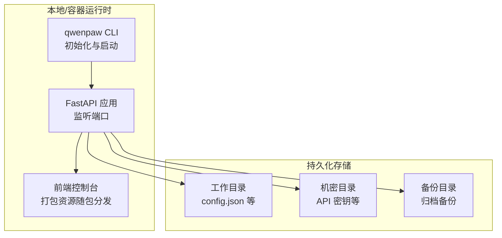
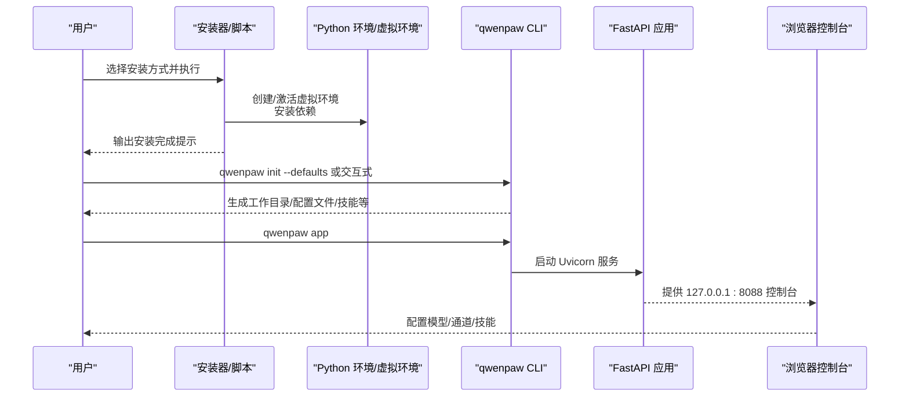

# 快速开始

<cite>
**本文引用的文件**
- [README.md](file://README.md)
- [pyproject.toml](file://pyproject.toml)
- [setup.py](file://setup.py)
- [scripts/install.sh](file://scripts/install.sh)
- [scripts/install.bat](file://scripts/install.bat)
- [scripts/install.ps1](file://scripts/install.ps1)
- [deploy/Dockerfile](file://deploy/Dockerfile)
- [deploy/entrypoint.sh](file://deploy/entrypoint.sh)
- [scripts/docker_build.sh](file://scripts/docker_build.sh)
- [scripts/README.md](file://scripts/README.md)
- [scripts/pack/desktop.nsi](file://scripts/pack/desktop.nsi)
- [src/qwenpaw/__version__.py](file://src/qwenpaw/__version__.py)
- [src/qwenpaw/cli/init_cmd.py](file://src/qwenpaw/cli/init_cmd.py)
- [src/qwenpaw/cli/app_cmd.py](file://src/qwenpaw/cli/app_cmd.py)
</cite>

## 目录
1. [简介](#简介)
2. [项目结构](#项目结构)
3. [核心组件](#核心组件)
4. [架构总览](#架构总览)
5. [详细组件分析](#详细组件分析)
6. [依赖分析](#依赖分析)
7. [性能考虑](#性能考虑)
8. [故障排除指南](#故障排除指南)
9. [结论](#结论)
10. [附录](#附录)

## 简介
本指南面向首次接触 QwenPaw 的用户，帮助你在最短时间内完成安装与首次配置，并启动应用进行体验。文档覆盖以下安装方式与场景：
- 使用 pip 安装（适合已有 Python 环境的用户）
- 脚本安装（无需手动准备 Python，自动下载 uv 并创建虚拟环境）
- Docker 部署（适合在容器中运行，便于迁移与隔离）
- 桌面应用安装（无需命令行，双击即可运行）

同时，我们将详细说明首次配置流程，包括初始化工作目录、配置模型提供商与 API 密钥、启用技能与环境变量等关键步骤；并提供常见安装问题的解决方案。

## 项目结构
QwenPaw 采用“Python 后端 + 前端控制台”的架构。后端通过 CLI 提供初始化与启动能力，前端控制台通过打包资源随包分发，Docker 镜像在构建阶段预编译前端并在运行时挂载持久化数据卷。

图示来源
- [deploy/Dockerfile:1-105](file://deploy/Dockerfile#L1-L105)
- [deploy/entrypoint.sh:1-21](file://deploy/entrypoint.sh#L1-L21)
- [src/qwenpaw/cli/app_cmd.py:15-112](file://src/qwenpaw/cli/app_cmd.py#L15-L112)

章节来源
- [deploy/Dockerfile:1-105](file://deploy/Dockerfile#L1-L105)
- [deploy/entrypoint.sh:1-21](file://deploy/entrypoint.sh#L1-L21)
- [src/qwenpaw/cli/app_cmd.py:15-112](file://src/qwenpaw/cli/app_cmd.py#L15-L112)

## 核心组件
- CLI 子命令
  - 初始化：生成工作目录、配置心跳、语言、音频模式、通道、LLM 提供商与模型、技能、环境变量、复制文档等。
  - 启动：基于 Uvicorn 启动 FastAPI 应用，默认监听 127.0.0.1:8088。
- 安装器
  - macOS/Linux：自动检测/安装 uv，创建虚拟环境，安装包并生成包装器脚本，自动更新 PATH。
  - Windows：支持 CMD 与 PowerShell 两种安装脚本，自动处理执行策略、PATH 注册表更新、uv 获取与安装。
- Docker 镜像
  - 多阶段构建：先构建前端，再安装 Python 包；运行时通过 supervisord 管理进程，入口脚本负责首次初始化与端口替换。
- 桌面应用
  - NSIS 安装器定义安装目录、快捷方式与卸载项；首次运行时初始化 Python 环境与依赖加载。

章节来源
- [src/qwenpaw/cli/init_cmd.py:119-523](file://src/qwenpaw/cli/init_cmd.py#L119-L523)
- [src/qwenpaw/cli/app_cmd.py:15-112](file://src/qwenpaw/cli/app_cmd.py#L15-L112)
- [scripts/install.sh:1-368](file://scripts/install.sh#L1-L368)
- [scripts/install.bat:1-557](file://scripts/install.bat#L1-L557)
- [scripts/install.ps1:1-477](file://scripts/install.ps1#L1-L477)
- [deploy/Dockerfile:1-105](file://deploy/Dockerfile#L1-L105)
- [deploy/entrypoint.sh:1-21](file://deploy/entrypoint.sh#L1-L21)
- [scripts/pack/desktop.nsi:1-57](file://scripts/pack/desktop.nsi#L1-L57)

## 架构总览
下图展示了从安装到首次启动的关键流程，涵盖不同安装方式与配置步骤：

图示来源
- [scripts/install.sh:284-368](file://scripts/install.sh#L284-L368)
- [scripts/install.bat:469-557](file://scripts/install.bat#L469-L557)
- [scripts/install.ps1:333-477](file://scripts/install.ps1#L333-L477)
- [src/qwenpaw/cli/init_cmd.py:138-523](file://src/qwenpaw/cli/init_cmd.py#L138-L523)
- [src/qwenpaw/cli/app_cmd.py:55-112](file://src/qwenpaw/cli/app_cmd.py#L55-L112)

## 详细组件分析

### 方式一：pip 安装
适用场景
- 已具备 Python 环境且希望最小化依赖管理。
- 开发者或高级用户偏好手动控制 Python 版本与虚拟环境。

前置条件
- Python 版本要求：>=3.10,<3.14（来自项目元数据）。
- 推荐使用虚拟环境隔离依赖。

安装步骤
- 安装包：使用 pip 安装 qwenpaw。
- 初始化：执行初始化命令，生成工作目录与默认配置。
- 启动：启动应用，打开浏览器访问控制台。

首次配置要点
- 在控制台中配置模型提供商与 API 密钥。
- 如需通道（如钉钉、飞书、微信等），在控制台“设置”中开启相应通道。
- 可根据需要启用技能池中的技能或自定义技能。

注意事项
- 若网络受限，可参考脚本安装方式自动下载 uv 并安装依赖。
- 初次启动可能需要等待前端资源加载完成。

章节来源
- [README.md:120-131](file://README.md#L120-L131)
- [pyproject.toml:6-49](file://pyproject.toml#L6-L49)

### 方式二：脚本安装（macOS/Linux/Windows）
适用场景
- 不想手动准备 Python 环境，希望一键安装。
- macOS/Linux 使用 install.sh；Windows 使用 install.bat 或 install.ps1。

前置条件
- macOS/Linux：网络可访问外部源（脚本内置镜像选择逻辑）。
- Windows：PowerShell 可执行策略允许脚本运行；必要时按提示调整执行策略。

安装步骤
- macOS/Linux：
  - 执行 curl 命令下载安装脚本并运行。
  - 脚本自动检测/安装 uv，创建虚拟环境，安装包并生成包装器脚本。
  - 自动更新 shell 配置文件以追加 PATH。
- Windows（CMD）：
  - 下载 install.bat 并执行。
  - 支持版本指定、从源码安装、额外可选依赖等参数。
- Windows（PowerShell）：
  - 通过 iwr + iex 执行 install.ps1。
  - 自动处理执行策略、注册表更新 PATH、下载 uv 等。

首次配置要点
- 安装完成后，使用包装器脚本运行 qwenpaw init 与 qwenpaw app。
- 在控制台中完成模型与通道配置。

Windows 企业版特殊注意
- Constrained Language Mode 可能导致自动更新 PATH 失败或无法下载 uv。
- 按脚本中的提示手动添加路径或重新运行脚本。

章节来源
- [README.md:136-189](file://README.md#L136-L189)
- [scripts/install.sh:1-368](file://scripts/install.sh#L1-L368)
- [scripts/install.bat:1-557](file://scripts/install.bat#L1-L557)
- [scripts/install.ps1:1-477](file://scripts/install.ps1#L1-L477)
- [README.md:160-182](file://README.md#L160-L182)

### 方式三：Docker 部署
适用场景
- 希望在容器中运行，便于迁移、隔离与多环境部署。
- 需要持久化配置、机密与备份。

前置条件
- 已安装 Docker。
- 准备三个命名卷用于持久化：工作目录、机密目录、备份目录。

安装步骤
- 拉取镜像：从官方仓库拉取最新稳定镜像。
- 运行容器：映射端口 8088，挂载三个卷。
- 传入环境变量：如 API 密钥可通过 -e 或 --env-file 注入。
- 连接宿主机服务（如 Ollama/LM Studio）：使用 host.docker.internal 或 host 网络模式。

首次配置要点
- 首次启动时，入口脚本会在工作目录缺失 config.json 时自动执行初始化。
- 在控制台中配置模型提供商与 API 密钥。

Dockerfile 与入口脚本说明
- 多阶段构建：先构建前端，再安装 Python 包。
- 入口脚本：替换 supervisord 配置中的端口，自动初始化并启动 supervisord。

章节来源
- [README.md:232-276](file://README.md#L232-L276)
- [deploy/Dockerfile:1-105](file://deploy/Dockerfile#L1-L105)
- [deploy/entrypoint.sh:1-21](file://deploy/entrypoint.sh#L1-L21)
- [scripts/docker_build.sh:1-32](file://scripts/docker_build.sh#L1-L32)
- [scripts/README.md:21-29](file://scripts/README.md#L21-L29)

### 方式四：桌面应用安装（Beta）
适用场景
- 不熟悉命令行，希望零配置启动。
- 支持 Windows 10+ 与 macOS 14+。

安装步骤
- 从 GitHub Releases 下载对应平台安装包。
- 双击安装，首次启动可能需要 10-60 秒初始化 Python 环境与依赖。
- 自动打开浏览器访问控制台。

macOS 安全提示
- 若出现“无法验证开发者”提示，可通过右键打开或系统设置中允许。

章节来源
- [README.md:291-333](file://README.md#L291-L333)
- [scripts/pack/desktop.nsi:1-57](file://scripts/pack/desktop.nsi#L1-L57)
- [README.md:317-331](file://README.md#L317-L331)

### 首次配置全流程（初始化与启动）
初始化流程（qwenpaw init）
- 安全提示：阅读并接受安全声明。
- 采集遥测（可选）：匿名收集安装方式、操作系统、Python 版本等信息。
- 默认工作空间：确保默认代理与 QA 代理工作空间存在。
- 技能池：初始化技能池并将技能同步至工作空间。
- 配置文件：生成/更新 config.json，包含心跳间隔、目标、活跃时段、工具详情显示、语言、音频模式、转录提供者类型等。
- 通道配置：可交互地启用与配置通道。
- LLM 提供商与模型：交互式配置或跳过（若已存在活动模型）。
- 技能：可选择全部、自定义或跳过。
- 环境变量：可交互地配置工具所需的额外密钥。
- 文档文件：根据语言复制相关 Markdown 文件。
- 心跳查询：生成/更新 HEARTBEAT.md。

启动流程（qwenpaw app）
- 设置日志级别与隐藏访问日志路径。
- 记录上次使用的 host/port。
- 启动 Uvicorn 服务，默认监听 127.0.0.1:8088。
- 浏览器打开控制台，完成模型与通道配置。

章节来源
- [src/qwenpaw/cli/init_cmd.py:119-523](file://src/qwenpaw/cli/init_cmd.py#L119-L523)
- [src/qwenpaw/cli/app_cmd.py:15-112](file://src/qwenpaw/cli/app_cmd.py#L15-L112)
- [README.md:118-131](file://README.md#L118-L131)

### 关键配置项说明
- API 密钥配置
  - 控制台设置：在“设置 → 模型”中选择提供商并填写 API 密钥。
  - 初始化配置：运行 qwenpaw init 时可交互配置提供商与密钥。
  - 环境变量：可在 shell 或工作目录 .env 中设置（如 DashScope API 密钥）。
- 本地模型设置
  - llama.cpp：在控制台点击“下载 Llama.cpp”，随后在“设置 → 模型”中启用本地模型。
  - Ollama/LM Studio：在控制台“设置 → 模型”中将 Base URL 指向服务地址（容器内使用 host.docker.internal）。
- 通道配置
  - 在“设置 → 通道”中启用所需通道，并按指引完成通道侧的配置。
- 环境变量与工具密钥
  - 在“设置 → 环境变量”中配置工具所需的额外密钥（如网络搜索等）。

章节来源
- [README.md:336-349](file://README.md#L336-L349)
- [README.md:249-273](file://README.md#L249-L273)
- [src/qwenpaw/cli/init_cmd.py:424-433](file://src/qwenpaw/cli/init_cmd.py#L424-L433)

## 依赖分析
- Python 版本与包管理
  - Python 版本范围：>=3.10,<3.14。
  - 包管理：使用 setuptools 动态版本，setuptools 打包，包含前端静态资源。
- 运行时依赖
  - Web 服务器：Uvicorn。
  - 异步任务调度：APScheduler。
  - 渠道 SDK：钉钉、飞书、Telegram、Discord、MQTT 等。
  - 多媒体与浏览器：Playwright、PyWebView。
  - 加密与密钥：Cryptography、Keyring。
  - YAML/JSON：PyYAML、JSON Repair。
- 可选依赖
  - 本地模型：Hugging Face Hub。
  - 语音：OpenAI Whisper。
  - SIP/语音：pyVoIP、LiveKit 等。

章节来源
- [pyproject.toml:1-152](file://pyproject.toml#L1-L152)
- [setup.py:1-5](file://setup.py#L1-L5)

## 性能考虑
- 容器运行
  - 使用系统 Chromium 并禁用下载浏览器，减少启动时间与资源占用。
  - 通过环境变量指示容器运行，优化浏览器行为。
- 日志与访问控制
  - 可隐藏特定路径的访问日志，降低日志噪声。
  - 调试/追踪模式下输出初始化耗时，便于定位性能瓶颈。
- 首次启动
  - 桌面应用与脚本安装首次启动可能较慢，属正常现象（环境初始化与依赖加载）。

章节来源
- [deploy/Dockerfile:74-79](file://deploy/Dockerfile#L74-L79)
- [src/qwenpaw/cli/app_cmd.py:92-111](file://src/qwenpaw/cli/app_cmd.py#L92-L111)

## 故障排除指南
- Windows 执行策略限制
  - 现象：PowerShell 无法执行脚本。
  - 解决：将执行策略设为 RemoteSigned 或手动安装 uv 后重试。
- Constrained Language Mode（Windows 企业版 LTSC）
  - 现象：自动更新 PATH 失败、无法下载 uv。
  - 解决：按脚本提示手动添加路径，或在注册表中更新 PATH。
- Docker 宿主机服务连接
  - 现象：容器内 localhost 指向容器自身。
  - 解决：使用 host.docker.internal 或 host 网络模式。
- 端口冲突
  - 现象：端口 8088 被占用。
  - 解决：通过环境变量或运行参数修改端口。
- 首次启动未生成配置
  - 现象：工作目录缺少 config.json。
  - 解决：容器入口脚本会自动初始化；也可手动执行 qwenpaw init。

章节来源
- [scripts/install.ps1:68-83](file://scripts/install.ps1#L68-L83)
- [scripts/install.bat:162-181](file://scripts/install.bat#L162-L181)
- [README.md:249-273](file://README.md#L249-L273)
- [deploy/entrypoint.sh:6-14](file://deploy/entrypoint.sh#L6-L14)
- [src/qwenpaw/cli/app_cmd.py:15-54](file://src/qwenpaw/cli/app_cmd.py#L15-L54)

## 结论
通过上述安装方式与配置流程，你可以在几分钟内完成 QwenPaw 的安装与首次配置，并在浏览器控制台中完成模型与通道设置。建议优先使用脚本安装或 Docker 部署以获得更稳定的初始体验；如需本地模型，可在控制台中启用并下载所需后端资源。遇到问题时，可参考本指南的故障排除部分或查看项目文档与 FAQ 页面。

## 附录
- 版本信息
  - 当前版本：参见版本文件。
- 安装方式对照
  - pip：适合已有 Python 环境。
  - 脚本安装：自动处理 uv 与虚拟环境。
  - Docker：容器化部署，便于迁移与隔离。
  - 桌面应用：零配置启动，适合非技术用户。

章节来源
- [src/qwenpaw/__version__.py:1-3](file://src/qwenpaw/__version__.py#L1-L3)
- [README.md:118-131](file://README.md#L118-L131)
- [scripts/README.md:21-29](file://scripts/README.md#L21-L29)