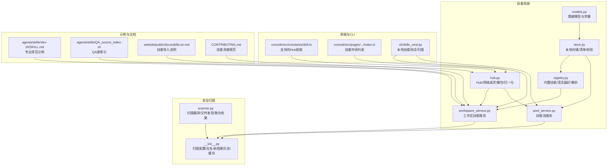
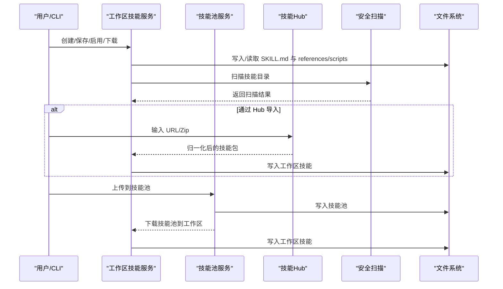
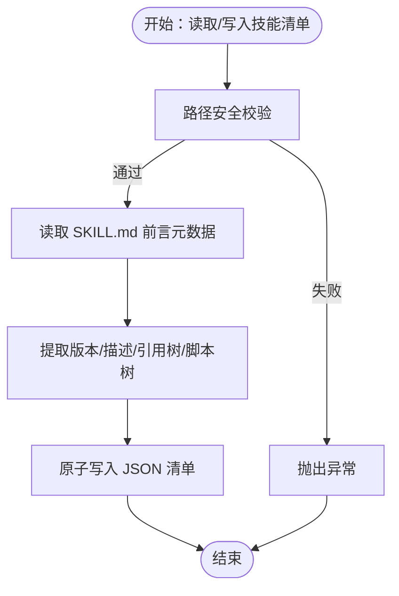
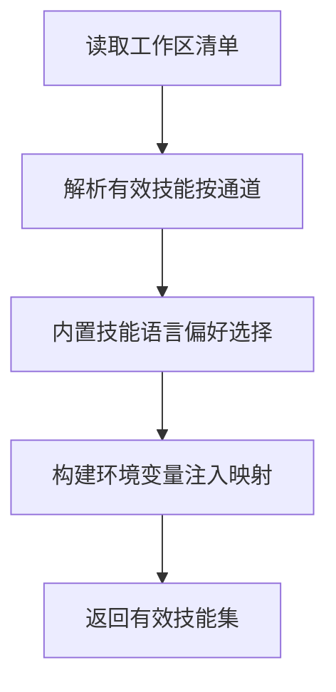
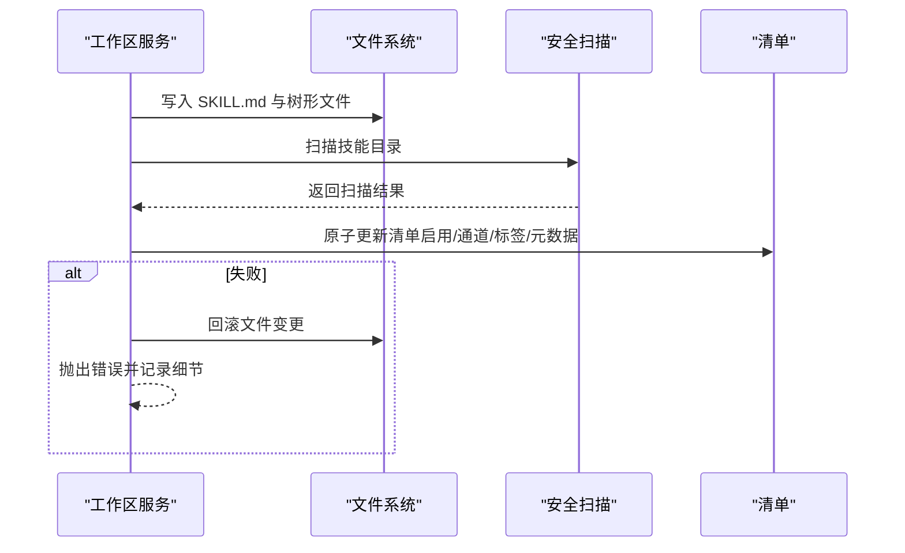
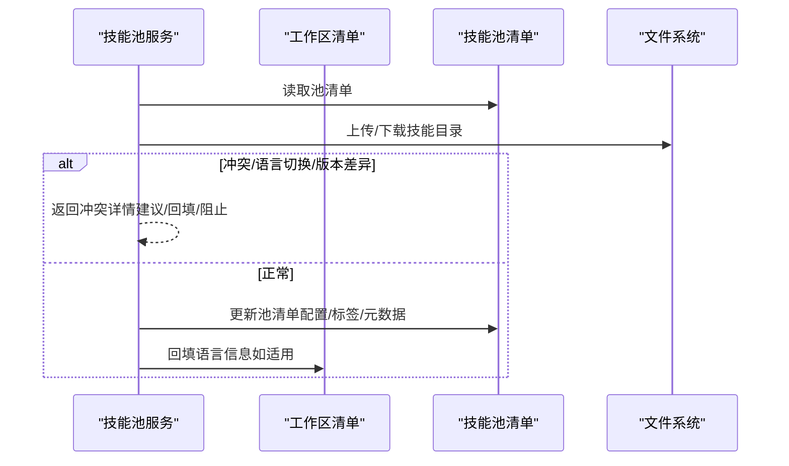
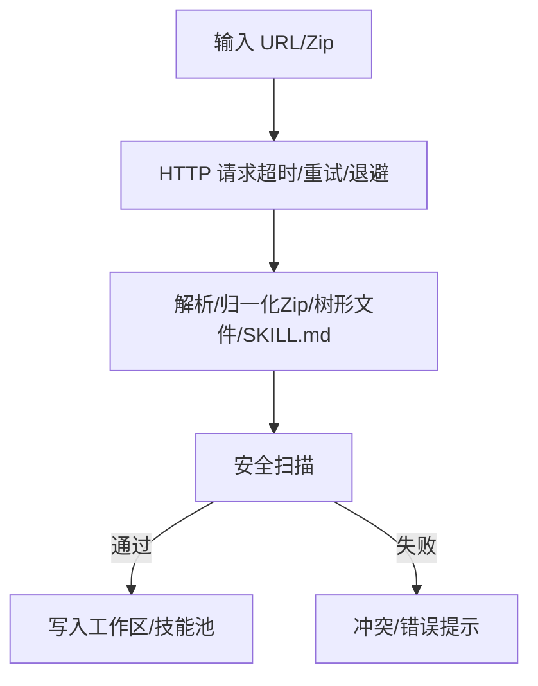
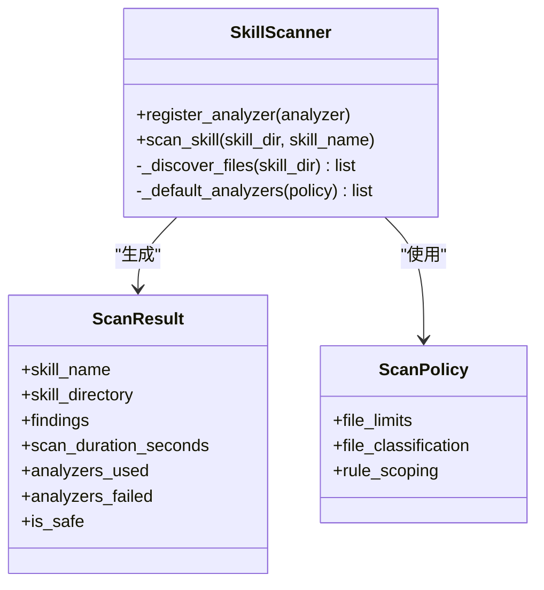
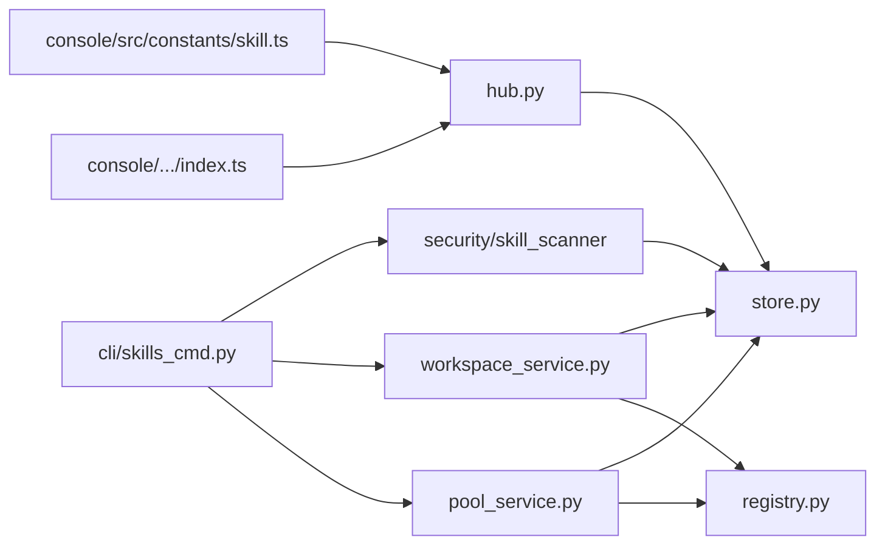

# 专业领域技能

<cite>
**本文引用的文件**
- [src/qwenpaw/agents/skill_system/__init__.py](file://src/qwenpaw/agents/skill_system/__init__.py)
- [src/qwenpaw/agents/skill_system/hub.py](file://src/qwenpaw/agents/skill_system/hub.py)
- [src/qwenpaw/agents/skill_system/models.py](file://src/qwenpaw/agents/skill_system/models.py)
- [src/qwenpaw/agents/skill_system/registry.py](file://src/qwenpaw/agents/skill_system/registry.py)
- [src/qwenpaw/agents/skill_system/store.py](file://src/qwenpaw/agents/skill_system/store.py)
- [src/qwenpaw/agents/skill_system/workspace_service.py](file://src/qwenpaw/agents/skill_system/workspace_service.py)
- [src/qwenpaw/agents/skill_system/pool_service.py](file://src/qwenpaw/agents/skill_system/pool_service.py)
- [src/qwenpaw/security/skill_scanner/__init__.py](file://src/qwenpaw/security/skill_scanner/__init__.py)
- [src/qwenpaw/security/skill_scanner/scanner.py](file://src/qwenpaw/security/skill_scanner/scanner.py)
- [src/qwenpaw/agents/skills/xlsx-zh/SKILL.md](file://src/qwenpaw/agents/skills/xlsx-zh/SKILL.md)
- [src/qwenpaw/agents/skills/QA_source_index-zh/SKILL.md](file://src/qwenpaw/agents/skills/QA_source_index-zh/SKILL.md)
- [src/qwenpaw/agents/skills/QA_source_index-en/SKILL.md](file://src/qwenpaw/agents/skills/QA_source_index-en/SKILL.md)
- [console/src/constants/skill.ts](file://console/src/constants/skill.ts)
- [console/src/pages/Agent/Skills/components/index.ts](file://console/src/pages/Agent/Skills/components/index.ts)
- [src/qwenpaw/cli/skills_cmd.py](file://src/qwenpaw/cli/skills_cmd.py)
- [CONTRIBUTING.md](file://CONTRIBUTING.md)
- [website/public/docs/skills.en.md](file://website/public/docs/skills.en.md)
</cite>

## 目录
1. [引言](#引言)
2. [项目结构](#项目结构)
3. [核心组件](#核心组件)
4. [架构总览](#架构总览)
5. [详细组件分析](#详细组件分析)
6. [依赖分析](#依赖分析)
7. [性能考虑](#性能考虑)
8. [故障排查指南](#故障排查指南)
9. [结论](#结论)
10. [附录](#附录)

## 引言
本文件面向“QwenPaw 的专业领域技能”主题，系统化阐述其在多专业领域的知识组织、术语理解、规则遵循与质量保障机制。QwenPaw 将“技能”作为可复用、可治理、可共享的专业能力载体，通过“工作区技能（Workspace Skills）”与“共享技能池（Skill Pool）”双轨管理，结合“技能中心/Hub”的生态导入能力，形成覆盖文档、表格、浏览器、自动化等通用场景，并可扩展到医疗、法律、金融等专业领域的技能体系。

本文件重点说明：
- 术语理解与规则遵循：通过 SKILL.md 前言元数据与正文规范，确保技能在特定领域的表达一致性与可执行性
- 质量保证机制：安全扫描、白名单、阻断历史、缓存与并发控制
- 数据格式与标准规范：技能目录结构、manifest、frontmatter、版本与语言策略
- 处理流程：创建、导入、启用、下载、上传、重命名/编辑、冲突检测与回滚
- 准确性验证、权威性评估与时效性检查：基于内容哈希、版本号、内置语言偏好与内置技能版本映射
- 高级能力：技能 Hub 导入、技能市场支持、CLI 测试与安全扫描、工作区与技能池的双向同步

## 项目结构
QwenPaw 的专业领域技能由以下层次构成：
- 技能系统（Skill System）：定义技能生命周期、存储、清单、注册与解析
- 安全扫描（Security Scanner）：对技能进行安全扫描与阻断/告警
- 技能 Hub/市场（Hub/Martket）：支持从社区 Hub、URL、Zip 包导入技能
- 工作区与技能池服务：提供工作区技能与共享技能池的 CRUD、启用/禁用、通道路由、配置持久化
- 示例与文档：内置技能示例（如 xlsx）、QA 源索引技能、文档与贡献指南

图表来源
- [src/qwenpaw/agents/skill_system/models.py:1-77](file://src/qwenpaw/agents/skill_system/models.py#L1-L77)
- [src/qwenpaw/agents/skill_system/store.py:1-852](file://src/qwenpaw/agents/skill_system/store.py#L1-L852)
- [src/qwenpaw/agents/skill_system/registry.py:1-800](file://src/qwenpaw/agents/skill_system/registry.py#L1-L800)
- [src/qwenpaw/agents/skill_system/workspace_service.py:1-718](file://src/qwenpaw/agents/skill_system/workspace_service.py#L1-L718)
- [src/qwenpaw/agents/skill_system/pool_service.py:1-866](file://src/qwenpaw/agents/skill_system/pool_service.py#L1-L866)
- [src/qwenpaw/agents/skill_system/hub.py:1-800](file://src/qwenpaw/agents/skill_system/hub.py#L1-L800)
- [src/qwenpaw/security/skill_scanner/scanner.py:1-319](file://src/qwenpaw/security/skill_scanner/scanner.py#L1-L319)
- [src/qwenpaw/security/skill_scanner/__init__.py:1-514](file://src/qwenpaw/security/skill_scanner/__init__.py#L1-L514)
- [console/src/constants/skill.ts:1-20](file://console/src/constants/skill.ts#L1-L20)
- [console/src/pages/Agent/Skills/components/index.ts:36-89](file://console/src/pages/Agent/Skills/components/index.ts#L36-L89)
- [src/qwenpaw/cli/skills_cmd.py:127-158](file://src/qwenpaw/cli/skills_cmd.py#L127-L158)
- [src/qwenpaw/agents/skills/xlsx-zh/SKILL.md:17-40](file://src/qwenpaw/agents/skills/xlsx-zh/SKILL.md#L17-L40)
- [src/qwenpaw/agents/skills/QA_source_index-zh/SKILL.md:22-41](file://src/qwenpaw/agents/skills/QA_source_index-zh/SKILL.md#L22-L41)
- [src/qwenpaw/agents/skills/QA_source_index-en/SKILL.md:43-52](file://src/qwenpaw/agents/skills/QA_source_index-en/SKILL.md#L43-L52)
- [website/public/docs/skills.en.md:73-124](file://website/public/docs/skills.en.md#L73-L124)
- [CONTRIBUTING.md:134-175](file://CONTRIBUTING.md#L134-L175)

章节来源
- [src/qwenpaw/agents/skill_system/__init__.py:1-41](file://src/qwenpaw/agents/skill_system/__init__.py#L1-L41)

## 核心组件
- 数据模型与常量（models.py）
  - 统一技能信息结构（名称、描述、版本、内容、来源、引用与脚本树、表情符号）
  - 技能需求声明（二进制/环境变量）
  - 内置技能身份与变体（名称、语言、来源名、路径、描述、版本文本）
  - 通道路由集合（用于技能在不同渠道生效）

- 存储与清单（store.py）
  - 技能目录复制、路径安全校验、目录树遍历
  - 前言元数据读取与回退、版本提取
  - JSON 原子写入、跨进程锁、变更缓存
  - 技能导入/导出（Zip 解包、树形文件写入）、冲突建议
  - 技能内容校验（SKILL.md 前言必填项）

- 注册与解析（registry.py）
  - 内置技能语言偏好（en/zh）、镜像选择与迁移
  - 内置技能变体解析、版本映射、语言切换检测
  - 环境变量注入（基于技能配置与 require_envs）
  - 有效技能解析（按通道过滤）

- 工作区技能服务（workspace_service.py）
  - 创建/保存/重命名/删除、启用/禁用、通道设置、标签设置
  - Zip 导入、安全扫描、冲突检测与回滚
  - 文件读取（references/scripts 子树）

- 技能池服务（pool_service.py）
  - 共享技能池 CRUD、上传/下载、冲突检测与语言回填
  - 预览模式、覆盖策略、配置与标签同步

- 技能 Hub（hub.py）
  - Hub 基础 URL、搜索/详情/版本/文件路径构建
  - HTTP 请求封装（超时/重试/退避/取消）、响应体大小限制
  - Zip/树形文件归一化、SKILL.md 提取、冲突提示

- 安全扫描（security/skill_scanner）
  - 扫描器编排、文件发现、分析器注册、去重、结果聚合
  - 白名单、阻断历史、内容哈希、缓存与并发控制
  - 阻断/警告模式、超时控制

章节来源
- [src/qwenpaw/agents/skill_system/models.py:1-77](file://src/qwenpaw/agents/skill_system/models.py#L1-L77)
- [src/qwenpaw/agents/skill_system/store.py:1-852](file://src/qwenpaw/agents/skill_system/store.py#L1-L852)
- [src/qwenpaw/agents/skill_system/registry.py:1-800](file://src/qwenpaw/agents/skill_system/registry.py#L1-L800)
- [src/qwenpaw/agents/skill_system/workspace_service.py:1-718](file://src/qwenpaw/agents/skill_system/workspace_service.py#L1-L718)
- [src/qwenpaw/agents/skill_system/pool_service.py:1-866](file://src/qwenpaw/agents/skill_system/pool_service.py#L1-L866)
- [src/qwenpaw/agents/skill_system/hub.py:1-800](file://src/qwenpaw/agents/skill_system/hub.py#L1-L800)
- [src/qwenpaw/security/skill_scanner/scanner.py:1-319](file://src/qwenpaw/security/skill_scanner/scanner.py#L1-L319)
- [src/qwenpaw/security/skill_scanner/__init__.py:1-514](file://src/qwenpaw/security/skill_scanner/__init__.py#L1-L514)

## 架构总览
下图展示了“工作区技能”与“技能池”的双向同步、Hub 导入、安全扫描与前端/CLI 的交互关系。

图表来源
- [src/qwenpaw/agents/skill_system/workspace_service.py:1-718](file://src/qwenpaw/agents/skill_system/workspace_service.py#L1-L718)
- [src/qwenpaw/agents/skill_system/pool_service.py:1-866](file://src/qwenpaw/agents/skill_system/pool_service.py#L1-L866)
- [src/qwenpaw/agents/skill_system/hub.py:1-800](file://src/qwenpaw/agents/skill_system/hub.py#L1-L800)
- [src/qwenpaw/security/skill_scanner/__init__.py:1-514](file://src/qwenpaw/security/skill_scanner/__init__.py#L1-L514)

## 详细组件分析

### 组件A：技能数据模型与清单（models/store）
- 数据模型
  - SkillInfo：稳定运行时标识（不随 frontmatter 变更），包含内容、引用树、脚本树、表情符号
  - SkillRequirements：声明二进制与环境变量依赖
  - 内置技能身份与变体：名称、语言、来源名、路径、描述、版本文本
- 清单与存储
  - 原子 JSON 写入、跨进程锁、mtime 缓存
  - 路径安全校验（禁止 NUL、路径分隔符、越界）
  - Zip 解包与树形文件写入、冲突建议生成
  - 前言元数据读取与版本提取、技能内容校验

图表来源
- [src/qwenpaw/agents/skill_system/models.py:1-77](file://src/qwenpaw/agents/skill_system/models.py#L1-L77)
- [src/qwenpaw/agents/skill_system/store.py:1-852](file://src/qwenpaw/agents/skill_system/store.py#L1-L852)

章节来源
- [src/qwenpaw/agents/skill_system/models.py:1-77](file://src/qwenpaw/agents/skill_system/models.py#L1-L77)
- [src/qwenpaw/agents/skill_system/store.py:1-852](file://src/qwenpaw/agents/skill_system/store.py#L1-L852)

### 组件B：注册与语言偏好（registry）
- 内置技能语言偏好：根据 UI 语言与显式设置选择 en/zh
- 内置技能变体解析：按名称与语言选择最优变体，支持语言切换检测与迁移
- 环境变量注入：基于 require_envs 与技能配置生成环境变量，避免冲突
- 有效技能解析：按通道过滤，支持 console/聊天/频道路由

图表来源
- [src/qwenpaw/agents/skill_system/registry.py:1-800](file://src/qwenpaw/agents/skill_system/registry.py#L1-L800)

章节来源
- [src/qwenpaw/agents/skill_system/registry.py:1-800](file://src/qwenpaw/agents/skill_system/registry.py#L1-L800)

### 组件C：工作区技能服务（workspace_service）
- 生命周期：创建、保存（原地/重命名）、删除、启用/禁用、通道设置、标签设置
- Zip 导入：冲突检测、扫描、批量导入、启用
- 文件读取：仅允许 references/scripts 子树内的受控访问
- 回滚与错误处理：文件创建后清单更新失败的回滚与清理

图表来源
- [src/qwenpaw/agents/skill_system/workspace_service.py:1-718](file://src/qwenpaw/agents/skill_system/workspace_service.py#L1-L718)
- [src/qwenpaw/security/skill_scanner/__init__.py:1-514](file://src/qwenpaw/security/skill_scanner/__init__.py#L1-L514)

章节来源
- [src/qwenpaw/agents/skill_system/workspace_service.py:1-718](file://src/qwenpaw/agents/skill_system/workspace_service.py#L1-L718)

### 组件D：技能池服务（pool_service）
- 共享技能池 CRUD、上传/下载、预览模式、覆盖策略
- 冲突检测：内置/自定义、语言切换、版本升级提示
- 语言回填：将池中的内置语言信息回填至工作区
- 配置与标签同步：上传/下载时保留配置与标签

图表来源
- [src/qwenpaw/agents/skill_system/pool_service.py:1-866](file://src/qwenpaw/agents/skill_system/pool_service.py#L1-L866)

章节来源
- [src/qwenpaw/agents/skill_system/pool_service.py:1-866](file://src/qwenpaw/agents/skill_system/pool_service.py#L1-L866)

### 组件E：技能 Hub 与导入（hub）
- 支持的 Hub 前缀：clawhub、skills.sh、skillsmp、lobehub、GitHub 等
- 网络请求：超时/重试/退避/取消；响应体大小限制；速率限制与错误提示
- 归一化：Zip/树形文件提取、SKILL.md 合并、references/scripts 树构建
- 冲突提示：重复名称、非法路径、Zip 安全校验

图表来源
- [src/qwenpaw/agents/skill_system/hub.py:1-800](file://src/qwenpaw/agents/skill_system/hub.py#L1-L800)
- [console/src/constants/skill.ts:1-20](file://console/src/constants/skill.ts#L1-L20)
- [console/src/pages/Agent/Skills/components/index.ts:36-89](file://console/src/pages/Agent/Skills/components/index.ts#L36-L89)

章节来源
- [src/qwenpaw/agents/skill_system/hub.py:1-800](file://src/qwenpaw/agents/skill_system/hub.py#L1-L800)
- [console/src/constants/skill.ts:1-20](file://console/src/constants/skill.ts#L1-L20)
- [console/src/pages/Agent/Skills/components/index.ts:36-89](file://console/src/pages/Agent/Skills/components/index.ts#L36-L89)

### 组件F：安全扫描（scanner）
- 扫描器：文件发现（排除扩展、大文件、数量上限）、分析器注册与执行、去重、聚合
- 配置：扫描模式（block/warn/off）、超时、白名单、阻断历史、缓存
- 结果：最大严重级别、查找位置、内容哈希、记录持久化

图表来源
- [src/qwenpaw/security/skill_scanner/scanner.py:1-319](file://src/qwenpaw/security/skill_scanner/scanner.py#L1-L319)
- [src/qwenpaw/security/skill_scanner/__init__.py:1-514](file://src/qwenpaw/security/skill_scanner/__init__.py#L1-L514)

章节来源
- [src/qwenpaw/security/skill_scanner/scanner.py:1-319](file://src/qwenpaw/security/skill_scanner/scanner.py#L1-L319)
- [src/qwenpaw/security/skill_scanner/__init__.py:1-514](file://src/qwenpaw/security/skill_scanner/__init__.py#L1-L514)

### 组件G：专业领域示例与规范
- Excel/XLSX 专业规范：颜色编码、字体、公式零错误、模板保留与更新
- QA 源索引：主题/关键词到文档与源码入口的映射，约定与注意事项
- 技能贡献：目录结构、frontmatter、触发关键词、示例与最佳实践

章节来源
- [src/qwenpaw/agents/skills/xlsx-zh/SKILL.md:17-40](file://src/qwenpaw/agents/skills/xlsx-zh/SKILL.md#L17-L40)
- [src/qwenpaw/agents/skills/QA_source_index-zh/SKILL.md:22-41](file://src/qwenpaw/agents/skills/QA_source_index-zh/SKILL.md#L22-L41)
- [src/qwenpaw/agents/skills/QA_source_index-en/SKILL.md:43-52](file://src/qwenpaw/agents/skills/QA_source_index-en/SKILL.md#L43-L52)
- [CONTRIBUTING.md:134-175](file://CONTRIBUTING.md#L134-L175)

## 依赖分析
- 组件耦合
  - workspace_service 与 pool_service 共同依赖 store 与 registry，实现工作区与技能池的统一元数据与路径安全
  - hub 与 store 协作完成 Zip/树形文件归一化与冲突建议
  - scanner 与 store 协作完成扫描前置的文件发现与内容哈希
- 外部集成
  - 技能 Hub 前缀与市场列表由前端常量与页面组件维护
  - CLI 提供本地技能测试与扫描入口

图表来源
- [src/qwenpaw/agents/skill_system/workspace_service.py:1-718](file://src/qwenpaw/agents/skill_system/workspace_service.py#L1-L718)
- [src/qwenpaw/agents/skill_system/pool_service.py:1-866](file://src/qwenpaw/agents/skill_system/pool_service.py#L1-L866)
- [src/qwenpaw/agents/skill_system/store.py:1-852](file://src/qwenpaw/agents/skill_system/store.py#L1-L852)
- [src/qwenpaw/agents/skill_system/registry.py:1-800](file://src/qwenpaw/agents/skill_system/registry.py#L1-L800)
- [src/qwenpaw/agents/skill_system/hub.py:1-800](file://src/qwenpaw/agents/skill_system/hub.py#L1-L800)
- [src/qwenpaw/security/skill_scanner/__init__.py:1-514](file://src/qwenpaw/security/skill_scanner/__init__.py#L1-L514)
- [src/qwenpaw/cli/skills_cmd.py:127-158](file://src/qwenpaw/cli/skills_cmd.py#L127-L158)
- [console/src/constants/skill.ts:1-20](file://console/src/constants/skill.ts#L1-L20)
- [console/src/pages/Agent/Skills/components/index.ts:36-89](file://console/src/pages/Agent/Skills/components/index.ts#L36-L89)

章节来源
- [src/qwenpaw/agents/skill_system/workspace_service.py:1-718](file://src/qwenpaw/agents/skill_system/workspace_service.py#L1-L718)
- [src/qwenpaw/agents/skill_system/pool_service.py:1-866](file://src/qwenpaw/agents/skill_system/pool_service.py#L1-L866)
- [src/qwenpaw/agents/skill_system/store.py:1-852](file://src/qwenpaw/agents/skill_system/store.py#L1-L852)
- [src/qwenpaw/agents/skill_system/registry.py:1-800](file://src/qwenpaw/agents/skill_system/registry.py#L1-L800)
- [src/qwenpaw/agents/skill_system/hub.py:1-800](file://src/qwenpaw/agents/skill_system/hub.py#L1-L800)
- [src/qwenpaw/security/skill_scanner/__init__.py:1-514](file://src/qwenpaw/security/skill_scanner/__init__.py#L1-L514)
- [src/qwenpaw/cli/skills_cmd.py:127-158](file://src/qwenpaw/cli/skills_cmd.py#L127-L158)
- [console/src/constants/skill.ts:1-20](file://console/src/constants/skill.ts#L1-L20)
- [console/src/pages/Agent/Skills/components/index.ts:36-89](file://console/src/pages/Agent/Skills/components/index.ts#L36-L89)

## 性能考虑
- 文件发现与扫描
  - 使用 mtime 缓存与 LRU 缓存减少重复扫描开销
  - 并发线程池限制为单线程，避免过度竞争
- 清单写入
  - 原子写入与跨进程锁降低竞态风险，但可能带来序列化写入延迟
- HTTP 请求
  - 可配置超时/重试/退避，避免长时间阻塞
- Zip 解包
  - 限制压缩包大小与条目数，防止内存与 CPU 泄漏

## 故障排查指南
- 安全扫描阻断
  - 检查扫描模式（block/warn/off）、白名单、阻断历史与内容哈希
  - 使用 CLI 进行本地测试与扫描，定位具体文件与严重级别
- 路径与权限
  - 确认技能目录未包含非法路径、符号链接与越界访问
  - 检查文件系统权限与磁盘空间
- 清单损坏
  - 使用原子写入与默认值回退；必要时手动修复 JSON 或重建清单
- Hub 导入失败
  - 检查 URL 前缀是否受支持、网络连通性、速率限制与响应体大小
- 冲突与重命名
  - 使用冲突建议生成的重命名；必要时启用覆盖策略

章节来源
- [src/qwenpaw/security/skill_scanner/__init__.py:1-514](file://src/qwenpaw/security/skill_scanner/__init__.py#L1-L514)
- [src/qwenpaw/cli/skills_cmd.py:127-158](file://src/qwenpaw/cli/skills_cmd.py#L127-L158)
- [src/qwenpaw/agents/skill_system/store.py:1-852](file://src/qwenpaw/agents/skill_system/store.py#L1-L852)
- [src/qwenpaw/agents/skill_system/hub.py:1-800](file://src/qwenpaw/agents/skill_system/hub.py#L1-L800)

## 结论
QwenPaw 的专业领域技能体系通过“结构化的技能目录 + 前言元数据 + 清单与路径安全 + 安全扫描 + Hub 生态 + 工作区/技能池双向同步”，实现了在多专业领域的可复用、可治理与可扩展的能力平台。内置技能与专业规范示例（如 Excel/XLSX）为医疗、法律、金融等专业场景提供了可借鉴的表达方式与质量保障路径。通过严格的冲突检测、语言偏好与版本管理、白名单与阻断历史，系统在保证安全性的同时，兼顾了灵活性与可维护性。

## 附录
- 技能导入与使用参考
  - 技能导入说明与内置技能列表：[website/public/docs/skills.en.md:73-124](file://website/public/docs/skills.en.md#L73-L124)
  - 技能贡献规范与最佳实践：[CONTRIBUTING.md:134-175](file://CONTRIBUTING.md#L134-L175)
- 技术参考
  - 技能系统导出接口：[src/qwenpaw/agents/skill_system/__init__.py:1-41](file://src/qwenpaw/agents/skill_system/__init__.py#L1-L41)
  - 技能 Hub 支持的 URL 前缀：[console/src/constants/skill.ts:1-20](file://console/src/constants/skill.ts#L1-L20)
  - 技能市场列表：[console/src/pages/Agent/Skills/components/index.ts:36-89](file://console/src/pages/Agent/Skills/components/index.ts#L36-L89)