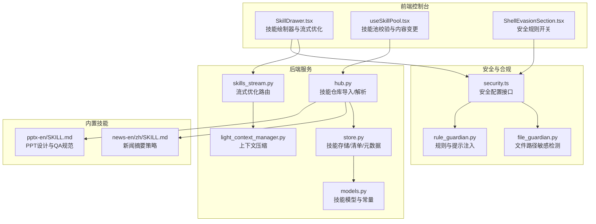
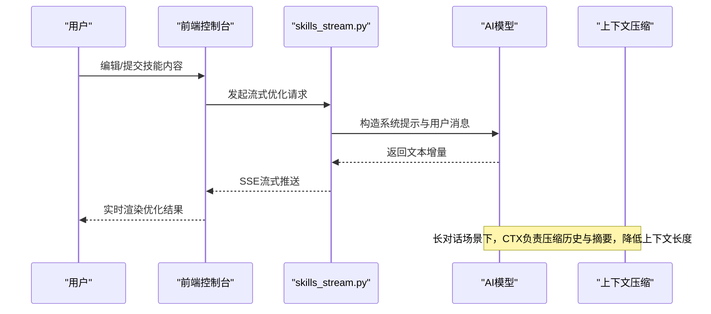
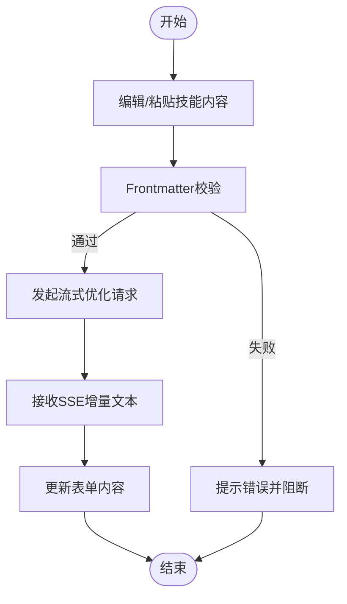
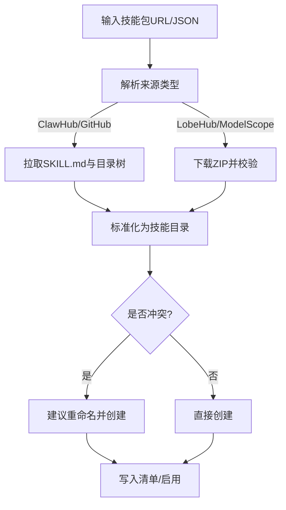
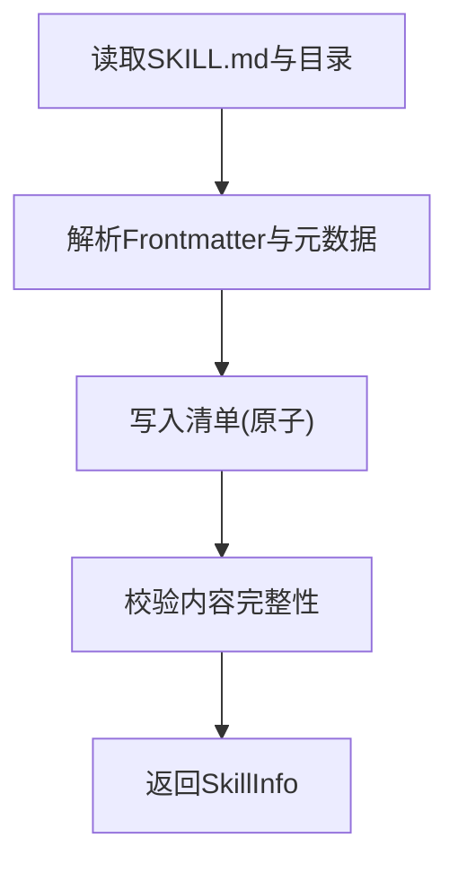
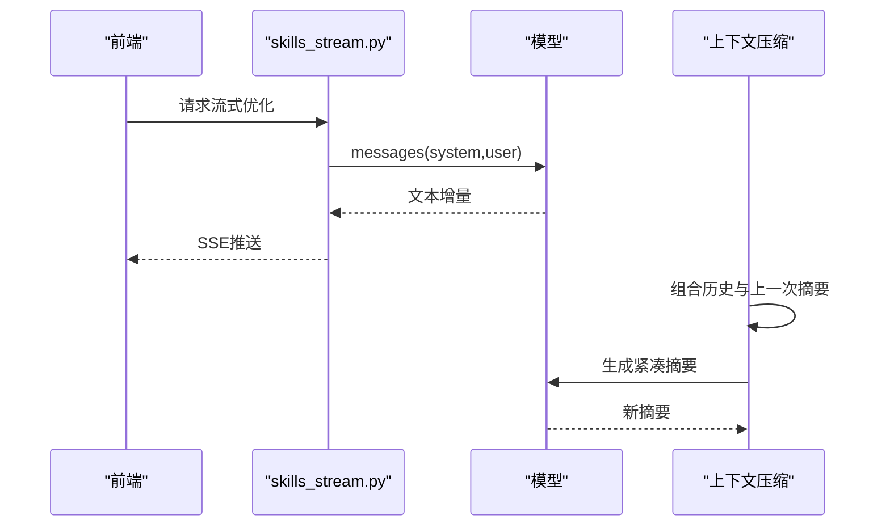
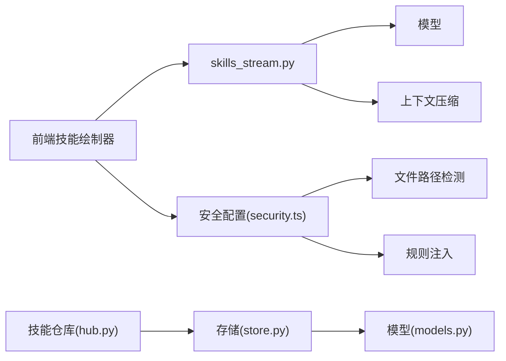

# 内容生成技能

<cite>
**本文引用的文件**
- [console/src/pages/Agent/Skills/components/SkillDrawer.tsx](file://console/src/pages/Agent/Skills/components/SkillDrawer.tsx)
- [console/src/pages/Settings/SkillPool/useSkillPool.tsx](file://console/src/pages/Settings/SkillPool/useSkillPool.tsx)
- [console/src/api/modules/security.ts](file://console/src/api/modules/security.ts)
- [console/src/pages/Settings/Security/components/ShellEvasionSection.tsx](file://console/src/pages/Settings/Security/components/ShellEvasionSection.tsx)
- [src/qwenpaw/app/routers/skills_stream.py](file://src/qwenpaw/app/routers/skills_stream.py)
- [src/qwenpaw/agents/skill_system/hub.py](file://src/qwenpaw/agents/skill_system/hub.py)
- [src/qwenpaw/agents/skill_system/store.py](file://src/qwenpaw/agents/skill_system/store.py)
- [src/qwenpaw/agents/skill_system/models.py](file://src/qwenpaw/agents/skill_system/models.py)
- [src/qwenpaw/agents/skills/news-en/SKILL.md](file://src/qwenpaw/agents/skills/news-en/SKILL.md)
- [src/qwenpaw/agents/skills/news-zh/SKILL.md](file://src/qwenpaw/agents/skills/news-zh/SKILL.md)
- [src/qwenpaw/agents/skills/pptx-en/SKILL.md](file://src/qwenpaw/agents/skills/pptx-en/SKILL.md)
- [src/qwenpaw/agents/context/light_context_manager.py](file://src/qwenpaw/agents/context/light_context_manager.py)
- [src/qwenpaw/security/tool_guard/guardians/file_guardian.py](file://src/qwenpaw/security/tool_guard/guardians/file_guardian.py)
- [src/qwenpaw/security/tool_guard/guardians/rule_guardian.py](file://src/qwenpaw/security/tool_guard/guardians/rule_guardian.py)
- [website/public/docs/skills.zh.md](file://website/public/docs/skills.zh.md)
- [console/src/pages/Control/CronJobs/components/templates.ts](file://console/src/pages/Control/CronJobs/components/templates.ts)
- [website/src/pages/Home/components/WorksForYou.tsx](file://website/src/pages/Home/components/WorksForYou.tsx)
- [website/src/pages/Home/components/WhatYouCanDo.tsx](file://website/src/pages/Home/components/WhatYouCanDo.tsx)
</cite>

## 目录
1. [简介](#简介)
2. [项目结构](#项目结构)
3. [核心组件](#核心组件)
4. [架构总览](#架构总览)
5. [详细组件分析](#详细组件分析)
6. [依赖分析](#依赖分析)
7. [性能考虑](#性能考虑)
8. [故障排查指南](#故障排查指南)
9. [结论](#结论)
10. [附录](#附录)

## 简介
本文件系统化梳理 QwenPaw 的“内容生成技能”，覆盖文本生成、内容创作与信息整理能力，阐述不同内容类型的生成策略（新闻摘要、写作指导、创意内容），并深入解析内容质量控制、风格一致性与主题相关性的技术实现。同时，文档涵盖内容去重、敏感信息过滤与合规检查机制，以及批量内容生成、模板定制与个性化推荐等高级功能，并结合营销文案、学习材料与创意工作的典型应用场景，帮助读者全面理解与高效使用该能力。

## 项目结构
围绕内容生成技能，系统在后端提供技能仓库、导入与流式优化能力，在前端提供技能绘制器与安全配置界面，并通过上下文压缩与工具守卫保障生成质量与安全。

图示来源
- [console/src/pages/Agent/Skills/components/SkillDrawer.tsx:75-233](file://console/src/pages/Agent/Skills/components/SkillDrawer.tsx#L75-L233)
- [console/src/pages/Settings/SkillPool/useSkillPool.tsx:346-372](file://console/src/pages/Settings/SkillPool/useSkillPool.tsx#L346-L372)
- [console/src/pages/Settings/Security/components/ShellEvasionSection.tsx:1-44](file://console/src/pages/Settings/Security/components/ShellEvasionSection.tsx#L1-L44)
- [src/qwenpaw/app/routers/skills_stream.py:177-211](file://src/qwenpaw/app/routers/skills_stream.py#L177-L211)
- [src/qwenpaw/agents/skill_system/hub.py:1633-1736](file://src/qwenpaw/agents/skill_system/hub.py#L1633-L1736)
- [src/qwenpaw/agents/skill_system/store.py:659-732](file://src/qwenpaw/agents/skill_system/store.py#L659-L732)
- [src/qwenpaw/agents/skill_system/models.py:45-77](file://src/qwenpaw/agents/skill_system/models.py#L45-L77)
- [src/qwenpaw/agents/context/light_context_manager.py:481-519](file://src/qwenpaw/agents/context/light_context_manager.py#L481-L519)
- [src/qwenpaw/security/tool_guard/guardians/file_guardian.py:426-465](file://src/qwenpaw/security/tool_guard/guardians/file_guardian.py#L426-L465)
- [src/qwenpaw/security/tool_guard/guardians/rule_guardian.py:707-734](file://src/qwenpaw/security/tool_guard/guardians/rule_guardian.py#L707-L734)
- [src/qwenpaw/agents/skills/news-en/SKILL.md:1-48](file://src/qwenpaw/agents/skills/news-en/SKILL.md#L1-L48)
- [src/qwenpaw/agents/skills/pptx-en/SKILL.md:136-221](file://src/qwenpaw/agents/skills/pptx-en/SKILL.md#L136-L221)

章节来源
- [console/src/pages/Agent/Skills/components/SkillDrawer.tsx:75-233](file://console/src/pages/Agent/Skills/components/SkillDrawer.tsx#L75-L233)
- [src/qwenpaw/agents/skill_system/hub.py:1633-1736](file://src/qwenpaw/agents/skill_system/hub.py#L1633-L1736)
- [src/qwenpaw/agents/skill_system/store.py:659-732](file://src/qwenpaw/agents/skill_system/store.py#L659-L732)

## 核心组件
- 技能绘制器与流式优化：提供技能内容的前端编辑、验证与流式优化能力，支持语言切换与中断控制。
- 技能仓库与导入：统一解析多种来源（Hub、GitHub、ModelScope、LobeHub 等）的技能包，标准化为本地技能目录。
- 技能存储与清单：维护工作区与技能池的清单、元数据与冲突处理，确保命名与版本一致性。
- 流式优化路由：基于模型对话接口，将用户输入转换为增量文本流，实现“优化”体验。
- 上下文压缩：在长对话中压缩历史与摘要，降低上下文长度，提升生成稳定性。
- 安全与合规：文件路径敏感检测、规则注入与提示、Shell 溯源规避检测，保障生成过程安全可控。

章节来源
- [console/src/pages/Agent/Skills/components/SkillDrawer.tsx:188-233](file://console/src/pages/Agent/Skills/components/SkillDrawer.tsx#L188-L233)
- [src/qwenpaw/app/routers/skills_stream.py:177-211](file://src/qwenpaw/app/routers/skills_stream.py#L177-L211)
- [src/qwenpaw/agents/context/light_context_manager.py:481-519](file://src/qwenpaw/agents/context/light_context_manager.py#L481-L519)
- [src/qwenpaw/security/tool_guard/guardians/file_guardian.py:426-465](file://src/qwenpaw/security/tool_guard/guardians/file_guardian.py#L426-L465)
- [src/qwenpaw/security/tool_guard/guardians/rule_guardian.py:707-734](file://src/qwenpaw/security/tool_guard/guardians/rule_guardian.py#L707-L734)

## 架构总览
内容生成技能的端到端流程如下：

图示来源
- [src/qwenpaw/app/routers/skills_stream.py:177-211](file://src/qwenpaw/app/routers/skills_stream.py#L177-L211)
- [src/qwenpaw/agents/context/light_context_manager.py:481-519](file://src/qwenpaw/agents/context/light_context_manager.py#L481-L519)

## 详细组件分析

### 组件A：技能绘制器与流式优化
- 功能要点
  - 内容校验：基于 Frontmatter 校验名称与描述必填，避免无效技能。
  - 流式优化：调用后端流式接口，支持中止与错误处理，实时渲染优化结果。
  - 语言支持：根据当前语言环境选择系统提示，保证优化提示语一致。
- 关键流程

图示来源
- [console/src/pages/Agent/Skills/components/SkillDrawer.tsx:93-114](file://console/src/pages/Agent/Skills/components/SkillDrawer.tsx#L93-L114)
- [console/src/pages/Agent/Skills/components/SkillDrawer.tsx:188-233](file://console/src/pages/Agent/Skills/components/SkillDrawer.tsx#L188-L233)

章节来源
- [console/src/pages/Agent/Skills/components/SkillDrawer.tsx:93-114](file://console/src/pages/Agent/Skills/components/SkillDrawer.tsx#L93-L114)
- [console/src/pages/Agent/Skills/components/SkillDrawer.tsx:188-233](file://console/src/pages/Agent/Skills/components/SkillDrawer.tsx#L188-L233)

### 组件B：技能仓库导入与解析
- 功能要点
  - 多源支持：支持 ClawHub、GitHub、LobeHub、ModelScope、skills.sh、skillsmp 等。
  - 规范化：统一提取 SKILL.md、references/scripts 子树与额外文件，生成可安装包。
  - 冲突处理：当同名技能存在时，提供重命名建议，避免覆盖。
- 关键流程

图示来源
- [src/qwenpaw/agents/skill_system/hub.py:1605-1630](file://src/qwenpaw/agents/skill_system/hub.py#L1605-L1630)
- [src/qwenpaw/agents/skill_system/hub.py:1633-1736](file://src/qwenpaw/agents/skill_system/hub.py#L1633-L1736)
- [src/qwenpaw/agents/skill_system/store.py:748-771](file://src/qwenpaw/agents/skill_system/store.py#L748-L771)

章节来源
- [src/qwenpaw/agents/skill_system/hub.py:1605-1630](file://src/qwenpaw/agents/skill_system/hub.py#L1605-L1630)
- [src/qwenpaw/agents/skill_system/hub.py:1633-1736](file://src/qwenpaw/agents/skill_system/hub.py#L1633-L1736)
- [src/qwenpaw/agents/skill_system/store.py:748-771](file://src/qwenpaw/agents/skill_system/store.py#L748-L771)

### 组件C：技能存储与清单
- 功能要点
  - 清单读写：提供工作区与技能池清单的原子写入与缓存，避免并发冲突。
  - 元数据构建：从 SKILL.md 解析描述、版本、emoji、requirement 等。
  - 冲突建议：生成时间戳后缀的建议名称，减少命名冲突。
- 关键流程

图示来源
- [src/qwenpaw/agents/skill_system/store.py:688-732](file://src/qwenpaw/agents/skill_system/store.py#L688-L732)
- [src/qwenpaw/agents/skill_system/store.py:555-580](file://src/qwenpaw/agents/skill_system/store.py#L555-L580)
- [src/qwenpaw/agents/skill_system/models.py:45-77](file://src/qwenpaw/agents/skill_system/models.py#L45-L77)

章节来源
- [src/qwenpaw/agents/skill_system/store.py:688-732](file://src/qwenpaw/agents/skill_system/store.py#L688-L732)
- [src/qwenpaw/agents/skill_system/store.py:555-580](file://src/qwenpaw/agents/skill_system/store.py#L555-L580)
- [src/qwenpaw/agents/skill_system/models.py:45-77](file://src/qwenpaw/agents/skill_system/models.py#L45-L77)

### 组件D：流式优化与上下文压缩
- 功能要点
  - 流式优化：后端根据语言选择系统提示，构造 messages 并逐块返回文本增量。
  - 上下文压缩：在长对话中，将历史与先前摘要合并，生成新的紧凑摘要，降低 token 消耗。
- 关键流程

图示来源
- [src/qwenpaw/app/routers/skills_stream.py:177-211](file://src/qwenpaw/app/routers/skills_stream.py#L177-L211)
- [src/qwenpaw/agents/context/light_context_manager.py:481-519](file://src/qwenpaw/agents/context/light_context_manager.py#L481-L519)

章节来源
- [src/qwenpaw/app/routers/skills_stream.py:177-211](file://src/qwenpaw/app/routers/skills_stream.py#L177-L211)
- [src/qwenpaw/agents/context/light_context_manager.py:481-519](file://src/qwenpaw/agents/context/light_context_manager.py#L481-L519)

### 组件E：内容质量控制与风格一致性
- 质量控制
  - 内容 QA：PPTX 技能提供内容与视觉 QA 指南，建议使用子代理复核与图像化检查。
  - 视觉规范：间距、对比度、布局一致性等设计约束，避免 AI 生成幻觉。
- 风格一致性
  - 系统提示语言切换：前端传入当前语言，后端按语言选择系统提示，确保风格与术语一致。
  - 上下文压缩：通过摘要保留关键信息，减少风格漂移。
- 主题相关性
  - 新闻技能：按类别（政治、财经、社会、国际、科技、体育、娱乐）定向抓取与摘要，确保主题聚焦。

章节来源
- [src/qwenpaw/agents/skills/pptx-en/SKILL.md:136-221](file://src/qwenpaw/agents/skills/pptx-en/SKILL.md#L136-L221)
- [src/qwenpaw/app/routers/skills_stream.py:196-204](file://src/qwenpaw/app/routers/skills_stream.py#L196-L204)
- [src/qwenpaw/agents/skills/news-en/SKILL.md:13-41](file://src/qwenpaw/agents/skills/news-en/SKILL.md#L13-L41)

### 组件F：敏感信息过滤与合规检查
- 文件路径敏感检测：扫描工具调用参数中的字符串，识别潜在敏感路径，阻止危险操作。
- 规则注入与提示：在不确定时提示拒绝，附加自定义提醒，增强安全意识。
- Shell 溯源规避检测：针对命令替换、混淆标志、反斜杠转义等规避手段进行检查。

章节来源
- [src/qwenpaw/security/tool_guard/guardians/file_guardian.py:426-465](file://src/qwenpaw/security/tool_guard/guardians/file_guardian.py#L426-L465)
- [src/qwenpaw/security/tool_guard/guardians/rule_guardian.py:707-734](file://src/qwenpaw/security/tool_guard/guardians/rule_guardian.py#L707-L734)
- [console/src/pages/Settings/Security/components/ShellEvasionSection.tsx:1-44](file://console/src/pages/Settings/Security/components/ShellEvasionSection.tsx#L1-L44)
- [console/src/api/modules/security.ts:1-51](file://console/src/api/modules/security.ts#L1-L51)

### 组件G：批量内容生成、模板定制与个性化推荐
- 批量生成：通过定时任务模板，周期性触发内容生成（如每日科技新闻摘要、周末放松提醒）。
- 模板定制：内置模板定义任务类型、提示词与调度频率，支持文本与代理两类任务。
- 个性化推荐：结合用户偏好与上下文，动态调整生成策略与输出格式。

章节来源
- [console/src/pages/Control/CronJobs/components/templates.ts:181-215](file://console/src/pages/Control/CronJobs/components/templates.ts#L181-L215)
- [console/src/pages/Control/CronJobs/components/templates.ts:38-151](file://console/src/pages/Control/CronJobs/components/templates.ts#L38-L151)

### 应用场景
- 营销文案：利用模板与上下文压缩，生成符合品牌风格的文案摘要与创意方向。
- 学习材料：新闻摘要与写作指导技能，帮助整理知识点与生成讲义。
- 创意工作：PPTX 设计规范与 QA 流程，确保生成内容的视觉一致性与专业度。

章节来源
- [website/public/docs/skills.zh.md:68-116](file://website/public/docs/skills.zh.md#L68-L116)
- [src/qwenpaw/agents/skills/news-en/SKILL.md:1-48](file://src/qwenpaw/agents/skills/news-en/SKILL.md#L1-L48)
- [src/qwenpaw/agents/skills/pptx-en/SKILL.md:136-221](file://src/qwenpaw/agents/skills/pptx-en/SKILL.md#L136-L221)
- [website/src/pages/Home/components/WorksForYou.tsx:45-137](file://website/src/pages/Home/components/WorksForYou.tsx#L45-L137)
- [website/src/pages/Home/components/WhatYouCanDo.tsx:1-41](file://website/src/pages/Home/components/WhatYouCanDo.tsx#L1-L41)

## 依赖分析
- 组件耦合
  - 前端技能绘制器依赖后端流式优化路由与安全配置接口。
  - 技能仓库与存储模块相互依赖：仓库负责导入，存储负责清单与元数据。
  - 上下文压缩与模型交互紧密，影响生成稳定性与成本。
- 外部依赖
  - 多源 Hub 与 Git 仓库解析，依赖网络与鉴权（如 GITHUB_TOKEN）。
  - 安全模块依赖规则与提示注入，防止滥用与规避行为。

图示来源
- [src/qwenpaw/agents/skill_system/hub.py:1633-1736](file://src/qwenpaw/agents/skill_system/hub.py#L1633-L1736)
- [src/qwenpaw/agents/skill_system/store.py:659-732](file://src/qwenpaw/agents/skill_system/store.py#L659-L732)
- [src/qwenpaw/agents/skill_system/models.py:45-77](file://src/qwenpaw/agents/skill_system/models.py#L45-L77)
- [src/qwenpaw/app/routers/skills_stream.py:177-211](file://src/qwenpaw/app/routers/skills_stream.py#L177-L211)
- [console/src/api/modules/security.ts:1-51](file://console/src/api/modules/security.ts#L1-L51)

## 性能考虑
- 流式传输：SSE 增量推送显著改善用户体验，降低等待时间。
- 上下文压缩：在长对话中减少 token 使用，提高响应速度与稳定性。
- 清单原子写入：避免并发写冲突，减少 I/O 开销。
- 多源缓存：对 GitHub 等接口设置 TTL 缓存，降低重复请求成本。

## 故障排查指南
- 技能导入失败
  - 检查 URL 格式与来源支持范围，确认 SKILL.md 是否存在。
  - 若出现冲突，使用建议重命名并重新导入。
- 流式优化无响应
  - 确认模型配置与网络连通性；检查前端中止逻辑与信号处理。
- 安全拦截告警
  - 检查工具参数中的敏感路径与 Shell 溯源规避特征，按提示修正或禁用风险项。
- 定时任务未执行
  - 核对模板任务类型与调度频率，确认任务请求体与会话参数正确。

章节来源
- [src/qwenpaw/agents/skill_system/hub.py:1605-1630](file://src/qwenpaw/agents/skill_system/hub.py#L1605-L1630)
- [src/qwenpaw/agents/skill_system/store.py:748-771](file://src/qwenpaw/agents/skill_system/store.py#L748-L771)
- [src/qwenpaw/app/routers/skills_stream.py:177-211](file://src/qwenpaw/app/routers/skills_stream.py#L177-L211)
- [console/src/pages/Settings/Security/components/ShellEvasionSection.tsx:1-44](file://console/src/pages/Settings/Security/components/ShellEvasionSection.tsx#L1-L44)

## 结论
QwenPaw 的内容生成技能通过“技能仓库 + 流式优化 + 上下文压缩 + 安全合规”的完整链路，实现了高质量、可定制、可扩展的内容生成能力。内置新闻摘要、写作指导与创意设计规范，辅以批量生成与模板化调度，能够广泛应用于营销、教育与创意领域。建议在实际使用中结合安全规则与上下文压缩策略，持续优化生成质量与稳定性。

## 附录
- 内置技能概览（节选）
  - 新闻技能：支持多类别新闻抓取与摘要，强调权威来源与时间排序。
  - PPTX 技能：提供设计规范与 QA 流程，确保视觉一致性与内容完整性。
- 相关文档
  - 技能池与内置技能说明：见官网文档。

章节来源
- [website/public/docs/skills.zh.md:68-116](file://website/public/docs/skills.zh.md#L68-L116)
- [src/qwenpaw/agents/skills/news-en/SKILL.md:1-48](file://src/qwenpaw/agents/skills/news-en/SKILL.md#L1-L48)
- [src/qwenpaw/agents/skills/pptx-en/SKILL.md:136-221](file://src/qwenpaw/agents/skills/pptx-en/SKILL.md#L136-L221)