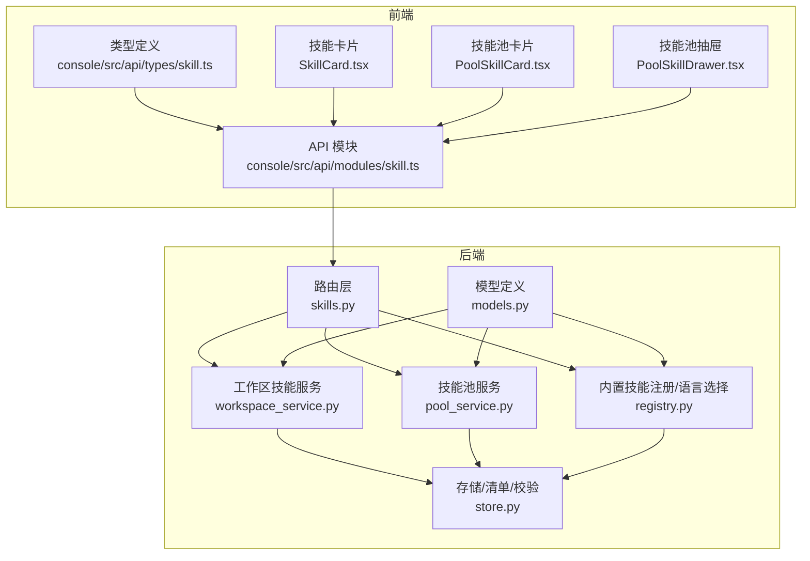
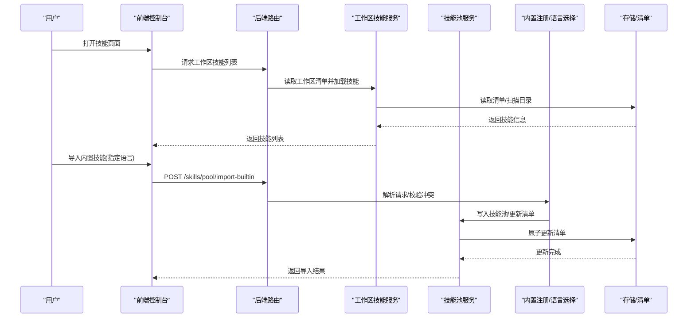
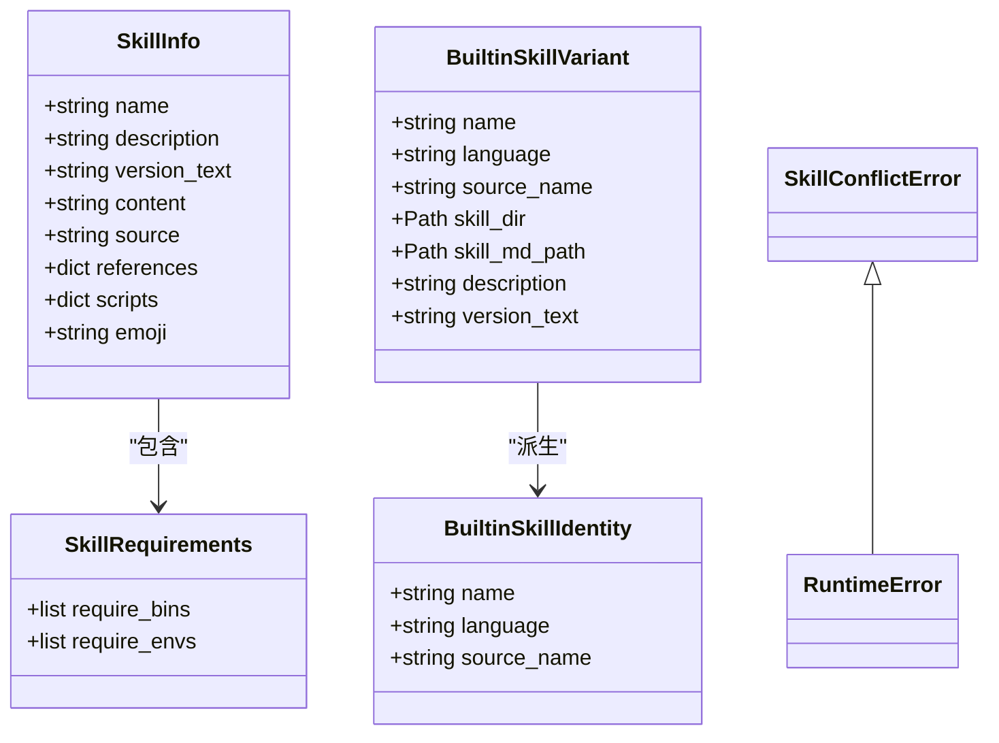
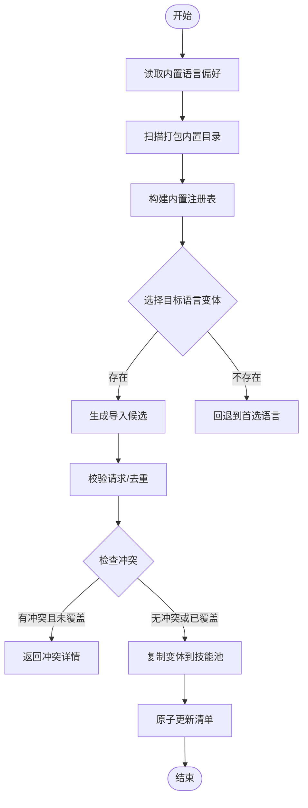
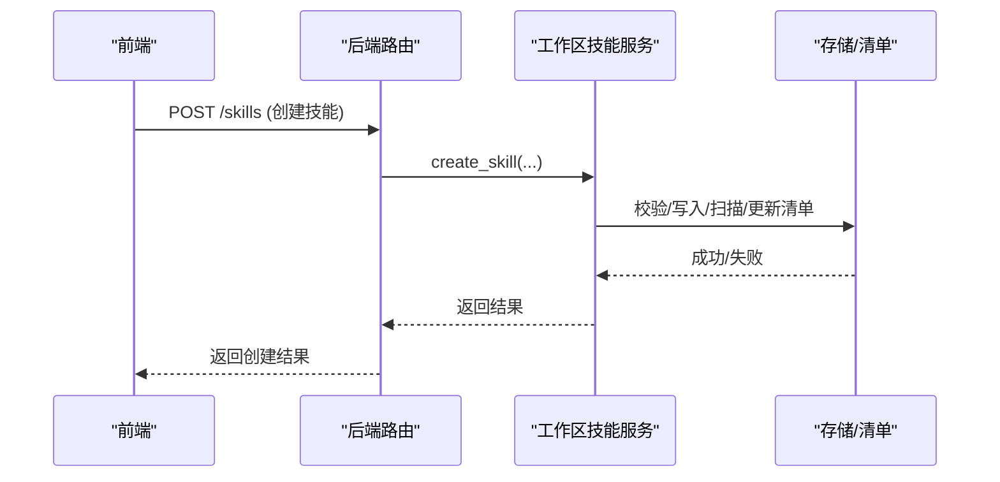
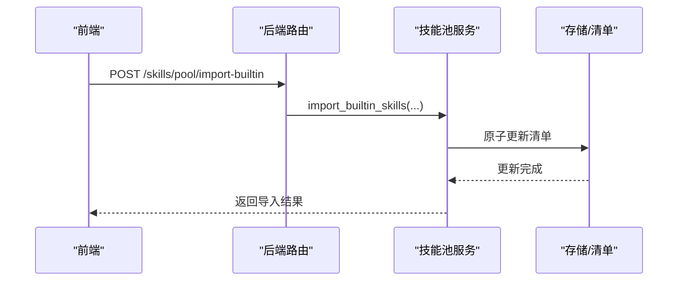
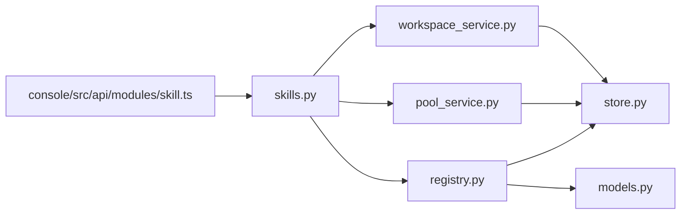

# 内置技能详解

<cite>
**本文引用的文件列表**
- [src/qwenpaw/agents/skill_system/__init__.py](file://src/qwenpaw/agents/skill_system/__init__.py)
- [src/qwenpaw/agents/skill_system/models.py](file://src/qwenpaw/agents/skill_system/models.py)
- [src/qwenpaw/agents/skill_system/registry.py](file://src/qwenpaw/agents/skill_system/registry.py)
- [src/qwenpaw/agents/skill_system/store.py](file://src/qwenpaw/agents/skill_system/store.py)
- [src/qwenpaw/agents/skill_system/pool_service.py](file://src/qwenpaw/agents/skill_system/pool_service.py)
- [src/qwenpaw/agents/skill_system/workspace_service.py](file://src/qwenpaw/agents/skill_system/workspace_service.py)
- [src/qwenpaw/app/routers/skills.py](file://src/qwenpaw/app/routers/skills.py)
- [src/qwenpaw/agents/skills/__init__.py](file://src/qwenpaw/agents/skills/__init__.py)
- [console/src/api/modules/skill.ts](file://console/src/api/modules/skill.ts)
- [console/src/api/types/skill.ts](file://console/src/api/types/skill.ts)
- [console/src/pages/Agent/Skills/components/SkillCard.tsx](file://console/src/pages/Agent/Skills/components/SkillCard.tsx)
- [console/src/pages/Settings/SkillPool/components/PoolSkillCard.tsx](file://console/src/pages/Settings/SkillPool/components/PoolSkillCard.tsx)
- [console/src/pages/Settings/SkillPool/components/PoolSkillDrawer.tsx](file://console/src/pages/Settings/SkillPool/components/PoolSkillDrawer.tsx)
</cite>

## 目录
1. [简介](#简介)
2. [项目结构](#项目结构)
3. [核心组件](#核心组件)
4. [架构总览](#架构总览)
5. [详细组件分析](#详细组件分析)
6. [依赖关系分析](#依赖关系分析)
7. [性能与资源](#性能与资源)
8. [故障排除指南](#故障排除指南)
9. [结论](#结论)
10. [附录：内置技能清单与使用示例](#附录内置技能清单与使用示例)

## 简介
本文件面向使用者与开发者，系统性梳理 QwenPaw 的内置技能体系，覆盖以下主题：
- 内置技能的来源、版本与语言偏好管理
- 技能的导入、同步、启用/禁用、配置与下载到工作区
- 技能内容规范（frontmatter、脚本与引用目录）
- 运行时解析与环境变量注入机制
- 国际化与多语言支持策略
- 性能与并发注意事项
- 常见问题与排障建议
- 使用示例与最佳实践

## 项目结构
QwenPaw 的技能系统由“工作区技能服务”“共享技能池服务”“内置技能注册与语言选择”“存储与清单”四部分组成，并通过后端路由与前端控制台进行统一管理。

图表来源
- [src/qwenpaw/app/routers/skills.py](file://src/qwenpaw/app/routers/skills.py)
- [src/qwenpaw/agents/skill_system/workspace_service.py](file://src/qwenpaw/agents/skill_system/workspace_service.py)
- [src/qwenpaw/agents/skill_system/pool_service.py](file://src/qwenpaw/agents/skill_system/pool_service.py)
- [src/qwenpaw/agents/skill_system/registry.py](file://src/qwenpaw/agents/skill_system/registry.py)
- [src/qwenpaw/agents/skill_system/store.py](file://src/qwenpaw/agents/skill_system/store.py)
- [src/qwenpaw/agents/skill_system/models.py](file://src/qwenpaw/agents/skill_system/models.py)
- [console/src/api/modules/skill.ts](file://console/src/api/modules/skill.ts)
- [console/src/api/types/skill.ts](file://console/src/api/types/skill.ts)
- [console/src/pages/Agent/Skills/components/SkillCard.tsx](file://console/src/pages/Agent/Skills/components/SkillCard.tsx)
- [console/src/pages/Settings/SkillPool/components/PoolSkillCard.tsx](file://console/src/pages/Settings/SkillPool/components/PoolSkillCard.tsx)
- [console/src/pages/Settings/SkillPool/components/PoolSkillDrawer.tsx](file://console/src/pages/Settings/SkillPool/components/PoolSkillDrawer.tsx)

章节来源
- [src/qwenpaw/agents/skill_system/__init__.py](file://src/qwenpaw/agents/skill_system/__init__.py)
- [src/qwenpaw/agents/skill_system/models.py](file://src/qwenpaw/agents/skill_system/models.py)
- [src/qwenpaw/agents/skill_system/registry.py](file://src/qwenpaw/agents/skill_system/registry.py)
- [src/qwenpaw/agents/skill_system/store.py](file://src/qwenpaw/agents/skill_system/store.py)
- [src/qwenpaw/agents/skill_system/pool_service.py](file://src/qwenpaw/agents/skill_system/pool_service.py)
- [src/qwenpaw/agents/skill_system/workspace_service.py](file://src/qwenpaw/agents/skill_system/workspace_service.py)
- [src/qwenpaw/app/routers/skills.py](file://src/qwenpaw/app/routers/skills.py)
- [console/src/api/modules/skill.ts](file://console/src/api/modules/skill.ts)
- [console/src/api/types/skill.ts](file://console/src/api/types/skill.ts)
- [console/src/pages/Agent/Skills/components/SkillCard.tsx](file://console/src/pages/Agent/Skills/components/SkillCard.tsx)
- [console/src/pages/Settings/SkillPool/components/PoolSkillCard.tsx](file://console/src/pages/Settings/SkillPool/components/PoolSkillCard.tsx)
- [console/src/pages/Settings/SkillPool/components/PoolSkillDrawer.tsx](file://console/src/pages/Settings/SkillPool/components/PoolSkillDrawer.tsx)

## 核心组件
- 模型与常量：定义技能元数据、要求、冲突错误等基础类型。
- 注册与语言选择：内置技能目录扫描、变体选择、语言偏好、升级提示。
- 存储与清单：清单读写、原子更新、路径安全、内容校验、文件树构建。
- 工作区技能服务：工作区内技能的创建、编辑、启用/禁用、通道绑定、文件读取。
- 技能池服务：共享技能池的创建、导入、删除、上传/下载、语言回填与冲突处理。
- 路由器：对外暴露技能 API，包括工作区技能、技能池、内置技能导入等。
- 前端 API 与 UI：类型定义、调用封装、卡片展示与抽屉交互。

章节来源
- [src/qwenpaw/agents/skill_system/models.py](file://src/qwenpaw/agents/skill_system/models.py)
- [src/qwenpaw/agents/skill_system/registry.py](file://src/qwenpaw/agents/skill_system/registry.py)
- [src/qwenpaw/agents/skill_system/store.py](file://src/qwenpaw/agents/skill_system/store.py)
- [src/qwenpaw/agents/skill_system/workspace_service.py](file://src/qwenpaw/agents/skill_system/workspace_service.py)
- [src/qwenpaw/agents/skill_system/pool_service.py](file://src/qwenpaw/agents/skill_system/pool_service.py)
- [src/qwenpaw/app/routers/skills.py](file://src/qwenpaw/app/routers/skills.py)
- [console/src/api/modules/skill.ts](file://console/src/api/modules/skill.ts)
- [console/src/api/types/skill.ts](file://console/src/api/types/skill.ts)

## 架构总览
技能系统围绕“工作区技能”和“技能池”两条主线展开：
- 工作区技能：用户在工作区内创建/编辑技能，决定是否启用、作用于哪些通道、保存配置。
- 技能池：存放可复用的内置技能或自定义技能，支持从内置源批量导入、按语言变体切换、版本对比与升级。

图表来源
- [src/qwenpaw/app/routers/skills.py](file://src/qwenpaw/app/routers/skills.py)
- [src/qwenpaw/agents/skill_system/workspace_service.py](file://src/qwenpaw/agents/skill_system/workspace_service.py)
- [src/qwenpaw/agents/skill_system/pool_service.py](file://src/qwenpaw/agents/skill_system/pool_service.py)
- [src/qwenpaw/agents/skill_system/registry.py](file://src/qwenpaw/agents/skill_system/registry.py)
- [src/qwenpaw/agents/skill_system/store.py](file://src/qwenpaw/agents/skill_system/store.py)

## 详细组件分析

### 组件一：模型与常量（models.py）
- 定义技能信息结构（名称、描述、版本、内容、来源、引用、脚本、表情符号）。
- 定义技能需求（二进制依赖、环境变量）。
- 定义内置技能身份与变体（名称、语言、源名、路径、描述、版本文本）。
- 定义冲突错误类型。

图表来源
- [src/qwenpaw/agents/skill_system/models.py](file://src/qwenpaw/agents/skill_system/models.py)

章节来源
- [src/qwenpaw/agents/skill_system/models.py](file://src/qwenpaw/agents/skill_system/models.py)

### 组件二：内置技能注册与语言选择（registry.py）
- 内置技能语言偏好：根据设置与 UI 语言自动选择 en/zh。
- 扫描打包内置目录，构建内置技能注册表，按语言选择变体。
- 计算内置技能版本映射，生成导入候选与冲突提示。
- 提供导入内置技能流程（含冲突校验、覆盖策略、清单更新）。

图表来源
- [src/qwenpaw/agents/skill_system/registry.py](file://src/qwenpaw/agents/skill_system/registry.py)

章节来源
- [src/qwenpaw/agents/skill_system/registry.py](file://src/qwenpaw/agents/skill_system/registry.py)

### 组件三：存储与清单（store.py）
- 路径与安全：技能池与工作区目录定位；规范化与路径安全校验；忽略平台无关文件。
- 清单读写：跨进程文件锁、原子写入、mtime 缓存；默认清单模板。
- 元数据构建：从 SKILL.md frontmatter 解析名称、描述、版本、emoji、requirements。
- 内容校验：校验 frontmatter 必填字段；扫描目录安全检查。
- ZIP 处理：解压校验、大小限制、路径安全、软链接拒绝。

章节来源
- [src/qwenpaw/agents/skill_system/store.py](file://src/qwenpaw/agents/skill_system/store.py)

### 组件四：工作区技能服务（workspace_service.py）
- 列出工作区内可用技能与全部技能。
- 创建/编辑/重命名/删除技能；启用/禁用；设置通道范围与标签。
- 从 ZIP 导入技能；读取技能内的 references/scripts 文件。
- 与注册模块协作，解析有效技能集合（结合通道与启用状态）。

图表来源
- [src/qwenpaw/agents/skill_system/workspace_service.py](file://src/qwenpaw/agents/skill_system/workspace_service.py)
- [src/qwenpaw/app/routers/skills.py](file://src/qwenpaw/app/routers/skills.py)

章节来源
- [src/qwenpaw/agents/skill_system/workspace_service.py](file://src/qwenpaw/agents/skill_system/workspace_service.py)
- [src/qwenpaw/app/routers/skills.py](file://src/qwenpaw/app/routers/skills.py)

### 组件五：技能池服务（pool_service.py）
- 列出池内技能；创建/导入/删除技能；重命名/保存；上传至工作区；从池下载到工作区。
- 下载时的语言冲突检测与回填；版本对比与升级提示；保护字段与配置持久化。

图表来源
- [src/qwenpaw/agents/skill_system/pool_service.py](file://src/qwenpaw/agents/skill_system/pool_service.py)
- [src/qwenpaw/app/routers/skills.py](file://src/qwenpaw/app/routers/skills.py)

章节来源
- [src/qwenpaw/agents/skill_system/pool_service.py](file://src/qwenpaw/agents/skill_system/pool_service.py)
- [src/qwenpaw/app/routers/skills.py](file://src/qwenpaw/app/routers/skills.py)

### 组件六：路由与前端集成（skills.py、console API）
- 后端路由提供工作区技能 CRUD、技能池操作、内置技能导入与通知接口。
- 前端 API 封装常用请求（如获取内置导入候选、导入选中内置、更新内置语言等），类型定义清晰，UI 组件负责展示与交互。

章节来源
- [src/qwenpaw/app/routers/skills.py](file://src/qwenpaw/app/routers/skills.py)
- [console/src/api/modules/skill.ts](file://console/src/api/modules/skill.ts)
- [console/src/api/types/skill.ts](file://console/src/api/types/skill.ts)
- [console/src/pages/Agent/Skills/components/SkillCard.tsx](file://console/src/pages/Agent/Skills/components/SkillCard.tsx)
- [console/src/pages/Settings/SkillPool/components/PoolSkillCard.tsx](file://console/src/pages/Settings/SkillPool/components/PoolSkillCard.tsx)
- [console/src/pages/Settings/SkillPool/components/PoolSkillDrawer.tsx](file://console/src/pages/Settings/SkillPool/components/PoolSkillDrawer.tsx)

## 依赖关系分析
- 组件耦合度：工作区/技能池服务均依赖存储模块进行清单与文件操作；注册模块依赖存储与模型；路由器作为入口聚合各服务。
- 外部依赖：文件系统、JSON 原子写入、跨进程锁、网络（内置源）。
- 可能的循环依赖：当前文件组织以“服务—存储—模型—注册”分层，未见循环导入迹象。

图表来源
- [src/qwenpaw/agents/skill_system/workspace_service.py](file://src/qwenpaw/agents/skill_system/workspace_service.py)
- [src/qwenpaw/agents/skill_system/pool_service.py](file://src/qwenpaw/agents/skill_system/pool_service.py)
- [src/qwenpaw/agents/skill_system/registry.py](file://src/qwenpaw/agents/skill_system/registry.py)
- [src/qwenpaw/agents/skill_system/store.py](file://src/qwenpaw/agents/skill_system/store.py)
- [src/qwenpaw/agents/skill_system/models.py](file://src/qwenpaw/agents/skill_system/models.py)
- [src/qwenpaw/app/routers/skills.py](file://src/qwenpaw/app/routers/skills.py)
- [console/src/api/modules/skill.ts](file://console/src/api/modules/skill.ts)

章节来源
- [src/qwenpaw/agents/skill_system/workspace_service.py](file://src/qwenpaw/agents/skill_system/workspace_service.py)
- [src/qwenpaw/agents/skill_system/pool_service.py](file://src/qwenpaw/agents/skill_system/pool_service.py)
- [src/qwenpaw/agents/skill_system/registry.py](file://src/qwenpaw/agents/skill_system/registry.py)
- [src/qwenpaw/agents/skill_system/store.py](file://src/qwenpaw/agents/skill_system/store.py)
- [src/qwenpaw/agents/skill_system/models.py](file://src/qwenpaw/agents/skill_system/models.py)
- [src/qwenpaw/app/routers/skills.py](file://src/qwenpaw/app/routers/skills.py)
- [console/src/api/modules/skill.ts](file://console/src/api/modules/skill.ts)

## 性能与资源
- 清单读写：采用跨进程文件锁与原子写入，避免并发冲突；对工作区清单使用 mtime 缓存减少频繁 IO。
- ZIP 解压：限制最大未压缩体积，校验路径安全性，拒绝软链接，防止异常占用与安全风险。
- 文件扫描：对技能目录进行安全扫描，确保内容合规；对内置技能变体选择采用缓存与 LRU。
- 网络访问：内置源导入具备超时、重试、退避策略与速率限制提示，必要时可配置环境变量调整行为。

[本节为通用性能讨论，不直接分析具体文件]

## 故障排除指南
- 导入内置技能冲突
  - 现象：返回冲突列表，包含语言切换或版本过期提示。
  - 处理：确认目标语言与当前版本；必要时覆盖冲突或手动重命名。
- 技能启用失败
  - 现象：启用时报扫描失败。
  - 处理：检查技能目录内容是否符合安全扫描要求，修复后再启用。
- 清单更新失败
  - 现象：文件已写入但清单更新失败，可能触发回滚清理。
  - 处理：查看日志与清理细节，确认磁盘空间与权限。
- 网络导入失败
  - 现象：Hub 返回 429/5xx 或速率限制。
  - 处理：设置认证令牌或稍后重试；检查超时与重试配置。

章节来源
- [src/qwenpaw/agents/skill_system/pool_service.py](file://src/qwenpaw/agents/skill_system/pool_service.py)
- [src/qwenpaw/agents/skill_system/workspace_service.py](file://src/qwenpaw/agents/skill_system/workspace_service.py)
- [src/qwenpaw/agents/skill_system/registry.py](file://src/qwenpaw/agents/skill_system/registry.py)
- [src/qwenpaw/agents/skill_system/store.py](file://src/qwenpaw/agents/skill_system/store.py)

## 结论
QwenPaw 的内置技能系统通过“工作区技能 + 技能池”的双轨设计，实现了可复用、可管理、可扩展的技能生态。内置技能语言偏好与变体选择提升了多语言体验；严格的清单与文件安全机制保障了稳定性；前后端协同提供了直观的管理界面。建议在团队内统一技能命名与 frontmatter 规范，合理使用通道与标签，定期同步内置技能版本，以获得最佳使用体验。

[本节为总结性内容，不直接分析具体文件]

## 附录：内置技能清单与使用示例

### 内置技能清单（按目录前缀分类）
- 文档类：docx、pdf、pptx、xlsx
- 浏览器类：browser_cdp、browser_visible
- 通讯类：channel_message、dingtalk_channel
- 协作类：multi_agent_collaboration
- 计划与引导：make_plan、guidance
- 新闻与资讯：news
- 文件与索引：file_reader、QA_source_index
- 语音与计划：cron
- 本地化与参考：himalaya

章节来源
- [src/qwenpaw/agents/skills/__init__.py](file://src/qwenpaw/agents/skills/__init__.py)

### 使用示例与最佳实践
- 在工作区创建技能
  - 步骤：通过前端导入或后端接口创建，填写 frontmatter 名称与描述，必要时添加 references/scripts。
  - 注意：frontmatter 必须包含非空名称与描述；启用前会进行安全扫描。
- 从技能池导入内置技能
  - 步骤：选择技能与语言，确认冲突，执行导入；导入后可在工作区启用。
  - 注意：内置技能版本与语言变更会触发升级提示或语言切换冲突。
- 配置与环境变量注入
  - 步骤：在工作区为技能配置 require_envs 中声明的键；运行时会注入对应环境变量。
  - 注意：未提供的必填项会记录警告；完整配置可通过 JSON 变量访问。
- 通道与标签管理
  - 步骤：设置技能生效的通道范围（如 console、discord 等），为技能打标签便于检索。
  - 注意：通道“all”表示全局生效；标签用于工作区侧分类管理。

章节来源
- [src/qwenpaw/app/routers/skills.py](file://src/qwenpaw/app/routers/skills.py)
- [src/qwenpaw/agents/skill_system/workspace_service.py](file://src/qwenpaw/agents/skill_system/workspace_service.py)
- [src/qwenpaw/agents/skill_system/pool_service.py](file://src/qwenpaw/agents/skill_system/pool_service.py)
- [src/qwenpaw/agents/skill_system/registry.py](file://src/qwenpaw/agents/skill_system/registry.py)
- [console/src/api/modules/skill.ts](file://console/src/api/modules/skill.ts)
- [console/src/pages/Agent/Skills/components/SkillCard.tsx](file://console/src/pages/Agent/Skills/components/SkillCard.tsx)
- [console/src/pages/Settings/SkillPool/components/PoolSkillCard.tsx](file://console/src/pages/Settings/SkillPool/components/PoolSkillCard.tsx)
- [console/src/pages/Settings/SkillPool/components/PoolSkillDrawer.tsx](file://console/src/pages/Settings/SkillPool/components/PoolSkillDrawer.tsx)