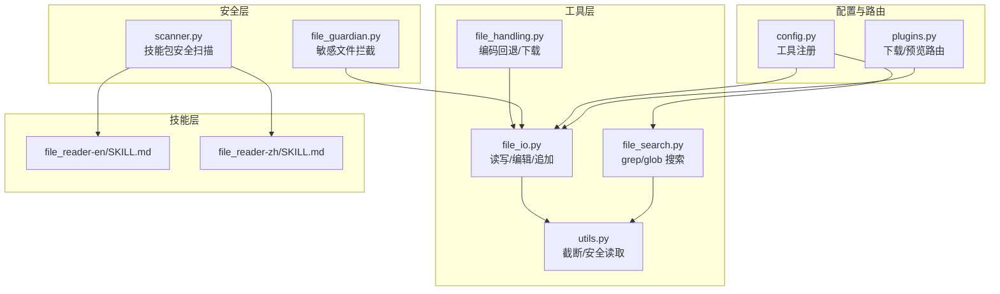
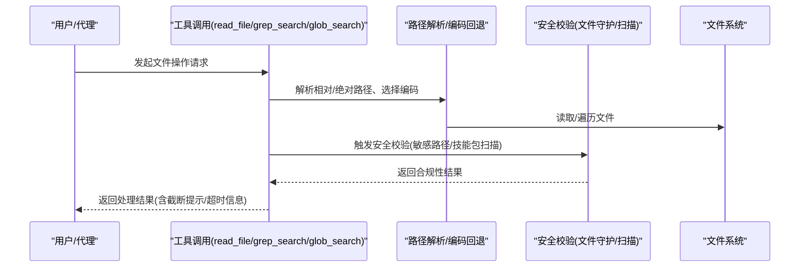
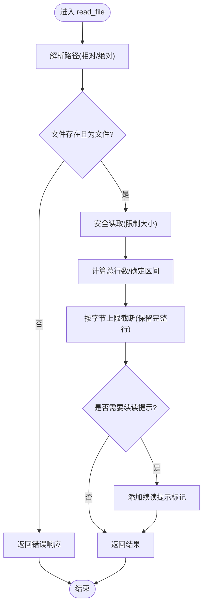
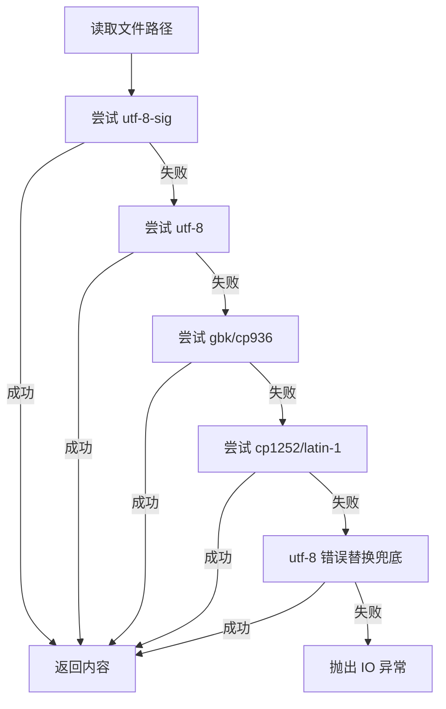
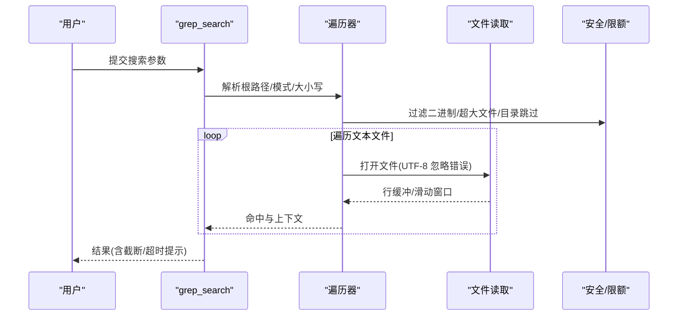
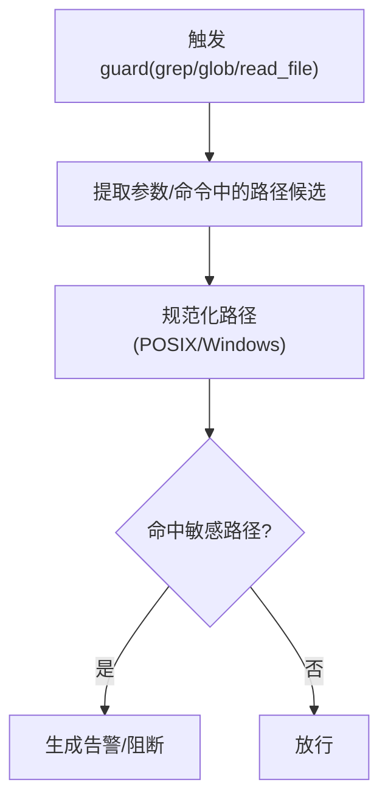
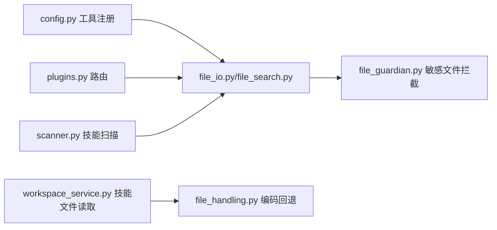

# 文件系统技能

<cite>
**本文引用的文件**
- [src/qwenpaw/agents/tools/file_io.py](file://src/qwenpaw/agents/tools/file_io.py)
- [src/qwenpaw/agents/tools/file_search.py](file://src/qwenpaw/agents/tools/file_search.py)
- [src/qwenpaw/agents/tools/utils.py](file://src/qwenpaw/agents/tools/utils.py)
- [src/qwenpaw/agents/utils/file_handling.py](file://src/qwenpaw/agents/utils/file_handling.py)
- [src/qwenpaw/agents/skill_system/workspace_service.py](file://src/qwenpaw/agents/skill_system/workspace_service.py)
- [src/qwenpaw/security/tool_guard/guardians/file_guardian.py](file://src/qwenpaw/security/tool_guard/guardians/file_guardian.py)
- [src/qwenpaw/security/skill_scanner/scanner.py](file://src/qwenpaw/security/skill_scanner/scanner.py)
- [src/qwenpaw/config/config.py](file://src/qwenpaw/config/config.py)
- [src/qwenpaw/app/routers/plugins.py](file://src/qwenpaw/app/routers/plugins.py)
- [src/qwenpaw/agents/skills/file_reader-en/SKILL.md](file://src/qwenpaw/agents/skills/file_reader-en/SKILL.md)
- [src/qwenpaw/agents/skills/file_reader-zh/SKILL.md](file://src/qwenpaw/agents/skills/file_reader-zh/SKILL.md)
</cite>

## 目录
1. [简介](#简介)
2. [项目结构](#项目结构)
3. [核心组件](#核心组件)
4. [架构总览](#架构总览)
5. [详细组件分析](#详细组件分析)
6. [依赖分析](#依赖分析)
7. [性能考虑](#性能考虑)
8. [故障排查指南](#故障排查指南)
9. [结论](#结论)
10. [附录](#附录)

## 简介
本文件系统技能文档面向 QwenPaw 的“文件系统”能力，覆盖文件读取、搜索与处理的完整链路，包括：
- 文件类型识别与内容提取：基于扩展名与启发式判断，结合多编码回退读取与智能截断。
- 编码检测与兼容：跨平台编码兼容策略，确保不同编辑器生成的文本文件可稳定读取。
- 权限控制与安全扫描：路径白/黑名单、敏感文件拦截、技能包安全扫描与规则化治理。
- 大文件处理与流式优化：内存保护、分块读取、截断续读与超时控制。
- 高级搜索与索引：内容检索（grep）、文件发现（glob）、上下文输出与结果截断。
- 应用场景与最佳实践：数据采集、内容分析与文档管理。

## 项目结构
围绕文件系统技能的关键模块分布如下：
- 工具层：文件读写与编辑、搜索与匹配、通用工具（截断、安全读取）。
- 安全层：文件路径守护、技能扫描器。
- 技能层：内置文件读取技能说明与使用指引。
- 配置与路由：工具注册、下载与预览路由的安全边界。

**图表来源**
- [src/qwenpaw/agents/tools/file_io.py:1-396](file://src/qwenpaw/agents/tools/file_io.py#L1-L396)
- [src/qwenpaw/agents/tools/file_search.py:1-629](file://src/qwenpaw/agents/tools/file_search.py#L1-L629)
- [src/qwenpaw/agents/tools/utils.py:1-242](file://src/qwenpaw/agents/tools/utils.py#L1-L242)
- [src/qwenpaw/agents/utils/file_handling.py:1-357](file://src/qwenpaw/agents/utils/file_handling.py#L1-L357)
- [src/qwenpaw/security/tool_guard/guardians/file_guardian.py:1-501](file://src/qwenpaw/security/tool_guard/guardians/file_guardian.py#L1-L501)
- [src/qwenpaw/security/skill_scanner/scanner.py:1-319](file://src/qwenpaw/security/skill_scanner/scanner.py#L1-L319)
- [src/qwenpaw/config/config.py:1372-1414](file://src/qwenpaw/config/config.py#L1372-L1414)
- [src/qwenpaw/app/routers/plugins.py:850-892](file://src/qwenpaw/app/routers/plugins.py#L850-L892)
- [src/qwenpaw/agents/skills/file_reader-en/SKILL.md:1-59](file://src/qwenpaw/agents/skills/file_reader-en/SKILL.md#L1-L59)
- [src/qwenpaw/agents/skills/file_reader-zh/SKILL.md:1-59](file://src/qwenpaw/agents/skills/file_reader-zh/SKILL.md#L1-L59)

**章节来源**
- [src/qwenpaw/agents/tools/file_io.py:1-396](file://src/qwenpaw/agents/tools/file_io.py#L1-L396)
- [src/qwenpaw/agents/tools/file_search.py:1-629](file://src/qwenpaw/agents/tools/file_search.py#L1-L629)
- [src/qwenpaw/agents/tools/utils.py:1-242](file://src/qwenpaw/agents/tools/utils.py#L1-L242)
- [src/qwenpaw/agents/utils/file_handling.py:1-357](file://src/qwenpaw/agents/utils/file_handling.py#L1-L357)
- [src/qwenpaw/security/tool_guard/guardians/file_guardian.py:1-501](file://src/qwenpaw/security/tool_guard/guardians/file_guardian.py#L1-L501)
- [src/qwenpaw/security/skill_scanner/scanner.py:1-319](file://src/qwenpaw/security/skill_scanner/scanner.py#L1-L319)
- [src/qwenpaw/config/config.py:1372-1414](file://src/qwenpaw/config/config.py#L1372-L1414)
- [src/qwenpaw/app/routers/plugins.py:850-892](file://src/qwenpaw/app/routers/plugins.py#L850-L892)
- [src/qwenpaw/agents/skills/file_reader-en/SKILL.md:1-59](file://src/qwenpaw/agents/skills/file_reader-en/SKILL.md#L1-L59)
- [src/qwenpaw/agents/skills/file_reader-zh/SKILL.md:1-59](file://src/qwenpaw/agents/skills/file_reader-zh/SKILL.md#L1-L59)

## 核心组件
- 文件读取工具（read_file）：支持相对/绝对路径解析、行区间读取、智能截断与续读提示。
- 文件写入/编辑/追加工具：统一编码策略（CSV/TSV/TXT 使用带 BOM 的 UTF-8），异常安全返回。
- 内容搜索工具（grep_search）：递归遍历、正则/字面量匹配、上下文输出、超时与限额控制。
- 文件发现工具（glob_search）：glob 模式匹配、目录扫描、结果截断与超时控制。
- 安全读取与编码回退：多编码尝试与最终回退策略，保障跨平台兼容。
- 敏感文件拦截：基于配置的敏感路径白/黑名单与路径规范化校验。
- 技能包安全扫描：文件发现、分析器聚合、重复项去重与策略化限制。
- 工具注册与路由安全：工具启用开关、下载/预览路由的路径校验与媒体类型推断。

**章节来源**
- [src/qwenpaw/agents/tools/file_io.py:66-206](file://src/qwenpaw/agents/tools/file_io.py#L66-L206)
- [src/qwenpaw/agents/tools/file_io.py:208-396](file://src/qwenpaw/agents/tools/file_io.py#L208-L396)
- [src/qwenpaw/agents/tools/file_search.py:478-577](file://src/qwenpaw/agents/tools/file_search.py#L478-L577)
- [src/qwenpaw/agents/tools/file_search.py:579-629](file://src/qwenpaw/agents/tools/file_search.py#L579-L629)
- [src/qwenpaw/agents/tools/utils.py:25-242](file://src/qwenpaw/agents/tools/utils.py#L25-L242)
- [src/qwenpaw/agents/utils/file_handling.py:31-103](file://src/qwenpaw/agents/utils/file_handling.py#L31-L103)
- [src/qwenpaw/security/tool_guard/guardians/file_guardian.py:301-501](file://src/qwenpaw/security/tool_guard/guardians/file_guardian.py#L301-L501)
- [src/qwenpaw/security/skill_scanner/scanner.py:76-319](file://src/qwenpaw/security/skill_scanner/scanner.py#L76-L319)
- [src/qwenpaw/config/config.py:1372-1414](file://src/qwenpaw/config/config.py#L1372-L1414)
- [src/qwenpaw/app/routers/plugins.py:850-892](file://src/qwenpaw/app/routers/plugins.py#L850-L892)

## 架构总览
文件系统技能的整体流程从“工具调用”开始，经“路径解析与安全校验”，到“内容读取/搜索/处理”，再到“结果返回与安全提示”。安全层贯穿始终，既保证对敏感路径的阻断，也通过扫描器对技能包进行合规治理。

**图表来源**
- [src/qwenpaw/agents/tools/file_io.py:23-63](file://src/qwenpaw/agents/tools/file_io.py#L23-L63)
- [src/qwenpaw/agents/tools/utils.py:210-242](file://src/qwenpaw/agents/tools/utils.py#L210-L242)
- [src/qwenpaw/agents/utils/file_handling.py:31-103](file://src/qwenpaw/agents/utils/file_handling.py#L31-L103)
- [src/qwenpaw/security/tool_guard/guardians/file_guardian.py:449-501](file://src/qwenpaw/security/tool_guard/guardians/file_guardian.py#L449-L501)
- [src/qwenpaw/security/skill_scanner/scanner.py:148-242](file://src/qwenpaw/security/skill_scanner/scanner.py#L148-L242)

## 详细组件分析

### 文件读取与内容提取
- 路径解析：相对路径基于当前工作区或工作目录解析，支持绝对路径直接使用。
- 编码策略：根据文件扩展名决定是否使用带 BOM 的 UTF-8（如 CSV/TSV/TXT），其余默认 UTF-8。
- 安全读取：异步安全读取，限制最大读取字节数，避免大文件导致内存压力。
- 智能截断：按字节上限截断，保留完整行，附加续读提示，支持多次续读。
- 错误处理：对不存在/非文件、参数非法、读取异常等进行统一错误返回。

**图表来源**
- [src/qwenpaw/agents/tools/file_io.py:66-206](file://src/qwenpaw/agents/tools/file_io.py#L66-L206)
- [src/qwenpaw/agents/tools/utils.py:154-207](file://src/qwenpaw/agents/tools/utils.py#L154-L207)
- [src/qwenpaw/agents/tools/utils.py:210-242](file://src/qwenpaw/agents/tools/utils.py#L210-L242)

**章节来源**
- [src/qwenpaw/agents/tools/file_io.py:23-63](file://src/qwenpaw/agents/tools/file_io.py#L23-L63)
- [src/qwenpaw/agents/tools/file_io.py:66-206](file://src/qwenpaw/agents/tools/file_io.py#L66-L206)
- [src/qwenpaw/agents/tools/utils.py:154-207](file://src/qwenpaw/agents/tools/utils.py#L154-L207)
- [src/qwenpaw/agents/tools/utils.py:210-242](file://src/qwenpaw/agents/tools/utils.py#L210-L242)

### 编码检测与跨平台兼容
- 多编码尝试：优先尝试带 BOM 的 UTF-8，再尝试 UTF-8、GBK/CP936、CP1252/Latin-1，最后以 UTF-8 错误替换兜底。
- 下载与保存：远程下载失败时回退至 curl/wget/urllib，并在头部探测失败时通过魔数推断真实扩展名。
- 本地空文件与路径校验：对空文件抛出运行时异常，对本地路径进行存在性与类型校验。

**图表来源**
- [src/qwenpaw/agents/utils/file_handling.py:31-103](file://src/qwenpaw/agents/utils/file_handling.py#L31-L103)
- [src/qwenpaw/agents/utils/file_handling.py:287-357](file://src/qwenpaw/agents/utils/file_handling.py#L287-L357)

**章节来源**
- [src/qwenpaw/agents/utils/file_handling.py:31-103](file://src/qwenpaw/agents/utils/file_handling.py#L31-L103)
- [src/qwenpaw/agents/utils/file_handling.py:287-357](file://src/qwenpaw/agents/utils/file_handling.py#L287-L357)

### 文件搜索与匹配
- grep 搜索：支持正则/字面量、大小写、上下文行数、文件名过滤；遍历受限、超时控制、输出字符上限与匹配条目上限。
- glob 搜索：glob 模式匹配，支持目录扫描与结果截断；超时控制。
- 上下文输出：命中前后固定数量上下文行，批量拼接并受字符上限约束。

**图表来源**
- [src/qwenpaw/agents/tools/file_search.py:478-577](file://src/qwenpaw/agents/tools/file_search.py#L478-L577)
- [src/qwenpaw/agents/tools/file_search.py:274-435](file://src/qwenpaw/agents/tools/file_search.py#L274-L435)

**章节来源**
- [src/qwenpaw/agents/tools/file_search.py:478-577](file://src/qwenpaw/agents/tools/file_search.py#L478-L577)
- [src/qwenpaw/agents/tools/file_search.py:579-629](file://src/qwenpaw/agents/tools/file_search.py#L579-L629)

### 权限控制与安全扫描
- 敏感文件拦截：针对已知文件工具参数与 shell 命令字符串提取路径，进行规范化与前缀匹配，命中即阻断并生成高危告警。
- 技能包安全扫描：遍历技能目录，按策略跳过扩展名与大小限制，加载分析器聚合结果，支持去重与失败记录。

**图表来源**
- [src/qwenpaw/security/tool_guard/guardians/file_guardian.py:449-501](file://src/qwenpaw/security/tool_guard/guardians/file_guardian.py#L449-L501)
- [src/qwenpaw/security/skill_scanner/scanner.py:148-242](file://src/qwenpaw/security/skill_scanner/scanner.py#L148-L242)

**章节来源**
- [src/qwenpaw/security/tool_guard/guardians/file_guardian.py:301-501](file://src/qwenpaw/security/tool_guard/guardians/file_guardian.py#L301-L501)
- [src/qwenpaw/security/skill_scanner/scanner.py:76-319](file://src/qwenpaw/security/skill_scanner/scanner.py#L76-L319)

### 大文件处理、流式读取与内存优化
- 最大读取字节数：限制单次读取上限，避免内存峰值过高。
- 异步安全读取：使用异步文件句柄与统计接口，按需读取指定字节数。
- 截断策略：按字节上限截断，保留完整行，附加续读提示，便于分页读取。
- 超时与限额：搜索与发现工具设置超时与匹配/输出上限，防止长时间占用。

**章节来源**
- [src/qwenpaw/agents/tools/utils.py:18-242](file://src/qwenpaw/agents/tools/utils.py#L18-L242)
- [src/qwenpaw/agents/tools/utils.py:210-242](file://src/qwenpaw/agents/tools/utils.py#L210-L242)
- [src/qwenpaw/agents/tools/file_search.py:97-103](file://src/qwenpaw/agents/tools/file_search.py#L97-L103)

### 文件类型识别与内容提取机制
- 类型识别：通过扩展名集合快速排除二进制与大文件，仅对文本文件进行内容读取。
- MIME 探测：在下载场景中，优先通过 HTTP 头部 Content-Type 推断扩展名，失败时通过魔数判定。
- 技能范围：文件读取技能明确仅处理文本类文件，PDF/Office/图片/音视频由其他技能处理。

**章节来源**
- [src/qwenpaw/agents/tools/file_search.py:26-103](file://src/qwenpaw/agents/tools/file_search.py#L26-L103)
- [src/qwenpaw/agents/utils/file_handling.py:196-244](file://src/qwenpaw/agents/utils/file_handling.py#L196-L244)
- [src/qwenpaw/agents/skills/file_reader-en/SKILL.md:14-59](file://src/qwenpaw/agents/skills/file_reader-en/SKILL.md#L14-L59)
- [src/qwenpaw/agents/skills/file_reader-zh/SKILL.md:14-59](file://src/qwenpaw/agents/skills/file_reader-zh/SKILL.md#L14-L59)

### 文件搜索、索引建立与模糊匹配
- 模糊匹配：grep 支持正则/字面量两种模式，大小写可选，上下文行数可配。
- 文件发现：glob 支持通配符与递归模式，结果排序与截断。
- 索引建议：对于高频检索场景，可在外部构建轻量索引（如基于文件名/内容的倒排），但当前工具未内置持久化索引。

**章节来源**
- [src/qwenpaw/agents/tools/file_search.py:478-577](file://src/qwenpaw/agents/tools/file_search.py#L478-L577)
- [src/qwenpaw/agents/tools/file_search.py:579-629](file://src/qwenpaw/agents/tools/file_search.py#L579-L629)

### 文件技能在数据采集、内容分析与文档管理中的应用
- 数据采集：通过下载工具与路径解析，安全地将远端资源落地到工作区；结合编码回退读取，提升跨平台兼容性。
- 内容分析：利用 grep 搜索与上下文输出，快速定位关键信息；对大型日志采用尾窗策略，聚焦近期异常。
- 文档管理：通过 read_file 读取 Markdown/JSON/YAML 等文档，结合编辑工具进行自动化更新；通过 glob 搜索定位目标文件。

**章节来源**
- [src/qwenpaw/agents/utils/file_handling.py:287-357](file://src/qwenpaw/agents/utils/file_handling.py#L287-L357)
- [src/qwenpaw/agents/tools/file_io.py:66-206](file://src/qwenpaw/agents/tools/file_io.py#L66-L206)
- [src/qwenpaw/agents/tools/file_search.py:478-577](file://src/qwenpaw/agents/tools/file_search.py#L478-L577)

## 依赖分析
- 工具注册：工具启用状态在配置中集中声明，确保运行期可见与可控。
- 路由安全：下载与预览路由对路径进行相对性校验与媒体类型推断，避免越权访问与错误类型。
- 技能文件读取：工作区服务对技能包内的受限目录进行白名单校验，防止路径穿越与越权读取。

**图表来源**
- [src/qwenpaw/config/config.py:1372-1414](file://src/qwenpaw/config/config.py#L1372-L1414)
- [src/qwenpaw/app/routers/plugins.py:850-892](file://src/qwenpaw/app/routers/plugins.py#L850-L892)
- [src/qwenpaw/agents/skill_system/workspace_service.py:687-718](file://src/qwenpaw/agents/skill_system/workspace_service.py#L687-L718)
- [src/qwenpaw/agents/utils/file_handling.py:31-103](file://src/qwenpaw/agents/utils/file_handling.py#L31-L103)
- [src/qwenpaw/security/tool_guard/guardians/file_guardian.py:449-501](file://src/qwenpaw/security/tool_guard/guardians/file_guardian.py#L449-L501)
- [src/qwenpaw/security/skill_scanner/scanner.py:148-242](file://src/qwenpaw/security/skill_scanner/scanner.py#L148-L242)

**章节来源**
- [src/qwenpaw/config/config.py:1372-1414](file://src/qwenpaw/config/config.py#L1372-L1414)
- [src/qwenpaw/app/routers/plugins.py:850-892](file://src/qwenpaw/app/routers/plugins.py#L850-L892)
- [src/qwenpaw/agents/skill_system/workspace_service.py:687-718](file://src/qwenpaw/agents/skill_system/workspace_service.py#L687-L718)

## 性能考虑
- I/O 与内存：通过最大读取字节数与异步读取降低内存峰值；对超大文件采用截断与续读策略。
- 搜索效率：限制扫描文件数量与输出字符数，设置超时阈值，避免长时间阻塞。
- 编码兼容：多编码尝试与错误替换兜底，减少因编码问题导致的失败重试成本。
- 路由安全：对下载/预览路径进行严格校验，避免无效请求与潜在攻击面扩大。

[本节为通用指导，无需特定文件引用]

## 故障排查指南
- 读取失败：检查路径是否存在、是否为文件、是否被安全策略拦截；关注截断提示与续读参数。
- 编码乱码：确认文件实际编码，必要时手动指定或调整编码策略；查看回退日志。
- 搜索无结果：缩小搜索范围、调整大小写、使用更精确的模式；注意超时与限额提示。
- 敏感文件被阻断：检查安全配置中的敏感路径列表，必要时调整或临时放行。
- 技能扫描告警：根据扫描结果修正可疑内容或调整策略；关注重复项与失败分析。

**章节来源**
- [src/qwenpaw/agents/tools/file_io.py:114-132](file://src/qwenpaw/agents/tools/file_io.py#L114-L132)
- [src/qwenpaw/agents/tools/utils.py:210-242](file://src/qwenpaw/agents/tools/utils.py#L210-L242)
- [src/qwenpaw/agents/tools/file_search.py:536-576](file://src/qwenpaw/agents/tools/file_search.py#L536-L576)
- [src/qwenpaw/security/tool_guard/guardians/file_guardian.py:449-501](file://src/qwenpaw/security/tool_guard/guardians/file_guardian.py#L449-L501)
- [src/qwenpaw/security/skill_scanner/scanner.py:194-242](file://src/qwenpaw/security/skill_scanner/scanner.py#L194-L242)

## 结论
QwenPaw 的文件系统技能以“安全、稳健、高效”为核心设计原则：通过严格的路径解析与安全校验，结合多编码回退与智能截断，满足跨平台文本文件读取需求；借助 grep/glob 实现高效的内容与文件发现；配合技能包安全扫描与敏感文件拦截，构建端到端的安全防线。在大文件与海量数据场景下，通过内存保护与超时控制，确保系统稳定性与用户体验。

[本节为总结性内容，无需特定文件引用]

## 附录
- 工具注册：确认 read_file/write_file/edit_file/grep_search/glob_search 等工具处于启用状态。
- 路由安全：下载与预览路由对路径进行相对性校验，避免越权访问。
- 技能范围：文件读取技能仅处理文本类文件，其他类型由专门技能处理。

**章节来源**
- [src/qwenpaw/config/config.py:1372-1414](file://src/qwenpaw/config/config.py#L1372-L1414)
- [src/qwenpaw/app/routers/plugins.py:850-892](file://src/qwenpaw/app/routers/plugins.py#L850-L892)
- [src/qwenpaw/agents/skills/file_reader-en/SKILL.md:1-59](file://src/qwenpaw/agents/skills/file_reader-en/SKILL.md#L1-L59)
- [src/qwenpaw/agents/skills/file_reader-zh/SKILL.md:1-59](file://src/qwenpaw/agents/skills/file_reader-zh/SKILL.md#L1-L59)