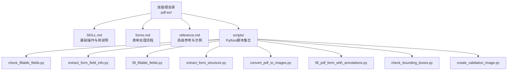
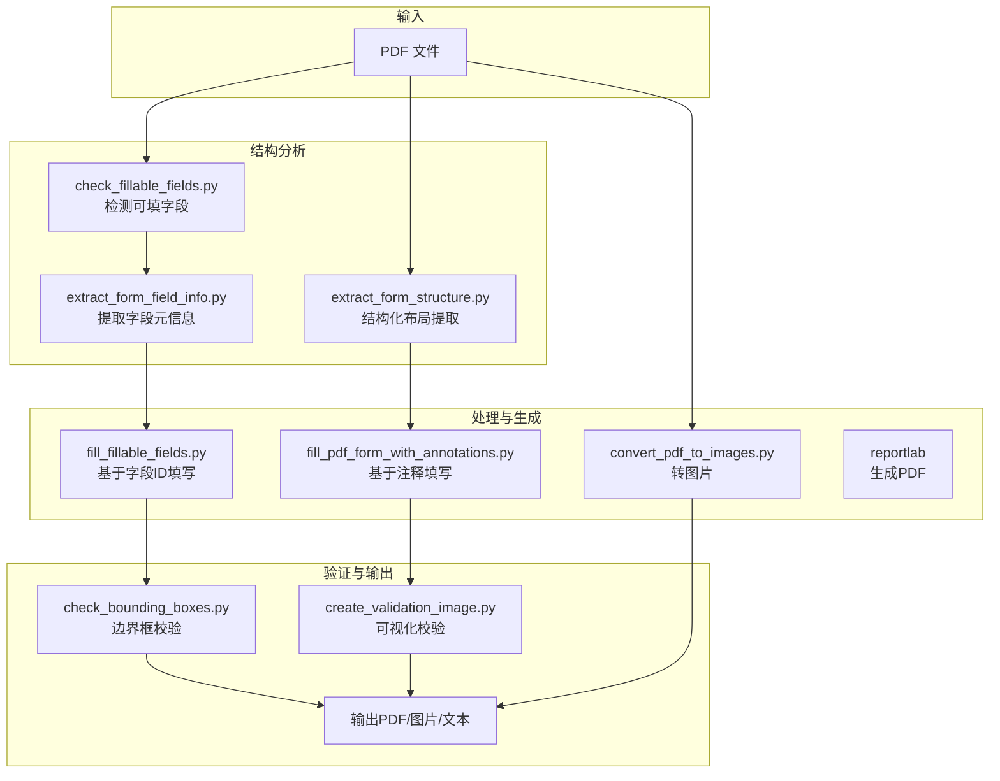
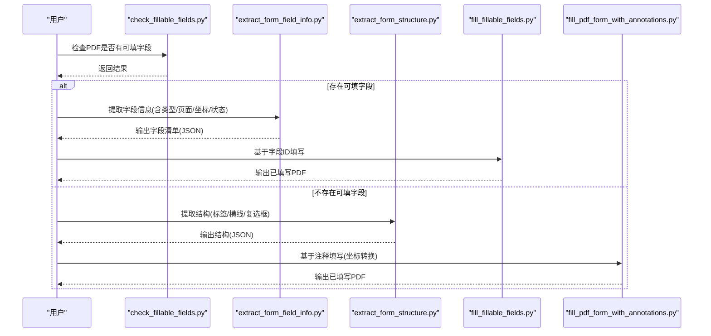
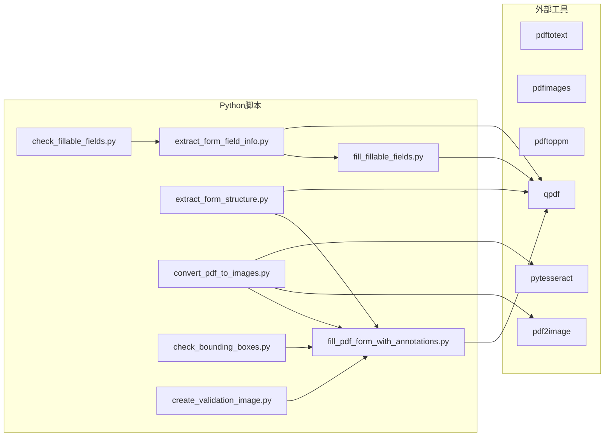

# PDF文档处理技能

<cite>
**本文引用的文件**
- [README.md](file://README.md)
- [pdf-en/SKILL.md](file://src/qwenpaw/agents/skills/pdf-en/SKILL.md)
- [pdf-en/forms.md](file://src/qwenpaw/agents/skills/pdf-en/forms.md)
- [pdf-en/reference.md](file://src/qwenpaw/agents/skills/pdf-en/reference.md)
- [pdf-zh/SKILL.md](file://src/qwenpaw/agents/skills/pdf-zh/SKILL.md)
- [pdf-en/scripts/check_fillable_fields.py](file://src/qwenpaw/agents/skills/pdf-en/scripts/check_fillable_fields.py)
- [pdf-en/scripts/extract_form_field_info.py](file://src/qwenpaw/agents/skills/pdf-en/scripts/extract_form_field_info.py)
- [pdf-en/scripts/fill_fillable_fields.py](file://src/qwenpaw/agents/skills/pdf-en/scripts/fill_fillable_fields.py)
- [pdf-en/scripts/extract_form_structure.py](file://src/qwenpaw/agents/skills/pdf-en/scripts/extract_form_structure.py)
- [pdf-en/scripts/convert_pdf_to_images.py](file://src/qwenpaw/agents/skills/pdf-en/scripts/convert_pdf_to_images.py)
- [pdf-en/scripts/fill_pdf_form_with_annotations.py](file://src/qwenpaw/agents/skills/pdf-en/scripts/fill_pdf_form_with_annotations.py)
- [pdf-en/scripts/check_bounding_boxes.py](file://src/qwenpaw/agents/skills/pdf-en/scripts/check_bounding_boxes.py)
- [pdf-en/scripts/create_validation_image.py](file://src/qwenpaw/agents/skills/pdf-en/scripts/create_validation_image.py)
</cite>

## 目录
1. [简介](#简介)
2. [项目结构](#项目结构)
3. [核心组件](#核心组件)
4. [架构总览](#架构总览)
5. [详细组件分析](#详细组件分析)
6. [依赖关系分析](#依赖关系分析)
7. [性能考量](#性能考量)
8. [故障排查指南](#故障排查指南)
9. [结论](#结论)
10. [附录](#附录)

## 简介
本文件系统化梳理 QwenPaw 的 PDF 文档处理技能，覆盖 PDF 解析、提取、编辑与生成、表单处理（字段提取、填写、注释管理）、安全处理（加密/解密、权限控制）、格式转换与批量自动化工作流，并结合实际脚本路径与流程图，帮助读者快速掌握从基础到进阶的 PDF 处理能力。

## 项目结构
PDF 技能位于技能目录中，英文与中文两套文档与脚本并行维护，核心由“指南文档 + 表单处理文档 + 高级参考 + 脚本集合”构成。脚本以 Python 为主，配合 poppler-utils（pdftotext、pdfimages、pdftoppm、qpdf）等命令行工具完成底层操作。

图表来源
- [pdf-en/SKILL.md:1-330](file://src/qwenpaw/agents/skills/pdf-en/SKILL.md#L1-L330)
- [pdf-en/forms.md:1-299](file://src/qwenpaw/agents/skills/pdf-en/forms.md#L1-L299)
- [pdf-en/reference.md:1-612](file://src/qwenpaw/agents/skills/pdf-en/reference.md#L1-L612)

章节来源
- [pdf-en/SKILL.md:1-330](file://src/qwenpaw/agents/skills/pdf-en/SKILL.md#L1-L330)
- [pdf-zh/SKILL.md:1-330](file://src/qwenpaw/agents/skills/pdf-zh/SKILL.md#L1-L330)

## 核心组件
- 基础 PDF 操作库：pypdf（读取、写入、合并、拆分、旋转、加水印、加密、注释）
- 结构化文本与表格提取：pdfplumber（按布局提取文本、表格、坐标）
- PDF 生成：reportlab（Canvas/Platypus 生成报告、表格）
- 命令行工具：pdftotext（纯文本/保留布局）、pdfimages（提取嵌入图片）、pdftoppm（转图片）、qpdf（合并/拆分/旋转/修复/优化/加密）
- JavaScript 生态（参考）：pdf-lib、pdfjs-dist（浏览器端渲染与注释提取）

章节来源
- [pdf-en/SKILL.md:15-26](file://src/qwenpaw/agents/skills/pdf-en/SKILL.md#L15-L26)
- [pdf-en/reference.md:5-16](file://src/qwenpaw/agents/skills/pdf-en/reference.md#L5-L16)

## 架构总览
下图展示了 PDF 技能的总体处理链路：从输入 PDF 到结构化信息抽取、表单字段识别与填写、注释标注、再到输出 PDF 或图片/文本等中间产物。

图表来源
- [pdf-en/scripts/check_fillable_fields.py:1-12](file://src/qwenpaw/agents/skills/pdf-en/scripts/check_fillable_fields.py#L1-L12)
- [pdf-en/scripts/extract_form_field_info.py:1-123](file://src/qwenpaw/agents/skills/pdf-en/scripts/extract_form_field_info.py#L1-L123)
- [pdf-en/scripts/extract_form_structure.py:1-116](file://src/qwenpaw/agents/skills/pdf-en/scripts/extract_form_structure.py#L1-L116)
- [pdf-en/scripts/fill_fillable_fields.py:1-99](file://src/qwenpaw/agents/skills/pdf-en/scripts/fill_fillable_fields.py#L1-L99)
- [pdf-en/scripts/fill_pdf_form_with_annotations.py:1-108](file://src/qwenpaw/agents/skills/pdf-en/scripts/fill_pdf_form_with_annotations.py#L1-L108)
- [pdf-en/scripts/convert_pdf_to_images.py:1-34](file://src/qwenpaw/agents/skills/pdf-en/scripts/convert_pdf_to_images.py#L1-L34)
- [pdf-en/scripts/check_bounding_boxes.py:1-66](file://src/qwenpaw/agents/skills/pdf-en/scripts/check_bounding_boxes.py#L1-L66)
- [pdf-en/scripts/create_validation_image.py:1-38](file://src/qwenpaw/agents/skills/pdf-en/scripts/create_validation_image.py#L1-L38)

## 详细组件分析

### 1) PDF 对象模型与基础操作
- pypdf 提供 PdfReader/PdfWriter，支持读取元数据、遍历页面、合并/拆分/旋转、加水印、加密、注释管理等。
- 常见操作：读取页数、逐页提取文本、合并多份 PDF、按页导出、旋转页面、设置用户/拥有者密码、追加注释。

章节来源
- [pdf-en/SKILL.md:30-92](file://src/qwenpaw/agents/skills/pdf-en/SKILL.md#L30-L92)

### 2) 页面内容提取与文本识别
- pdfplumber：按布局提取文本、表格；支持精确坐标（chars、with_bbox）；适合结构化数据抽取。
- 命令行：pdftotext 支持纯文本与保留布局两种模式；-bbox-layout 可输出带坐标 XML，便于后续结构化处理。
- 扫描版 PDF：pdf2image + pytesseract 先转图片再 OCR，实现可搜索 PDF。

章节来源
- [pdf-en/SKILL.md:94-134](file://src/qwenpaw/agents/skills/pdf-en/SKILL.md#L94-L134)
- [pdf-en/reference.md:269-287](file://src/qwenpaw/agents/skills/pdf-en/reference.md#L269-L287)
- [pdf-en/reference.md:589-601](file://src/qwenpaw/agents/skills/pdf-en/reference.md#L589-L601)

### 3) 图像处理与提取
- pdfimages：提取嵌入图片，支持原格式与质量参数；可列出信息而不提取。
- 转图片：pdftoppm 支持 PNG/JPEG、分辨率与范围选择；convert_pdf_to_images.py 封装了 pdf2image 的常用参数与缩放逻辑。

章节来源
- [pdf-en/SKILL.md:286-292](file://src/qwenpaw/agents/skills/pdf-en/SKILL.md#L286-L292)
- [pdf-en/reference.md:289-299](file://src/qwenpaw/agents/skills/pdf-en/reference.md#L289-L299)
- [pdf-en/reference.md:277-287](file://src/qwenpaw/agents/skills/pdf-en/reference.md#L277-L287)
- [pdf-en/scripts/convert_pdf_to_images.py:1-34](file://src/qwenpaw/agents/skills/pdf-en/scripts/convert_pdf_to_images.py#L1-L34)

### 4) 表单处理：字段提取与填写
- 字段检测：先判断是否存在可填字段，再决定走“基于字段ID填写”还是“基于注释填写”。
- 可填字段：提取字段类型、页面、坐标、状态值（复选框/单选组/下拉）；按字段ID填写并校验值合法性。
- 非可填字段：通过 pdfplumber 提取文字标签、横线（行边界）、小矩形（复选框）等结构信息，推导字段区域，再以 FreeText 注释形式填写。

图表来源
- [pdf-en/scripts/check_fillable_fields.py:1-12](file://src/qwenpaw/agents/skills/pdf-en/scripts/check_fillable_fields.py#L1-L12)
- [pdf-en/scripts/extract_form_field_info.py:1-123](file://src/qwenpaw/agents/skills/pdf-en/scripts/extract_form_field_info.py#L1-L123)
- [pdf-en/scripts/fill_fillable_fields.py:1-99](file://src/qwenpaw/agents/skills/pdf-en/scripts/fill_fillable_fields.py#L1-L99)
- [pdf-en/scripts/extract_form_structure.py:1-116](file://src/qwenpaw/agents/skills/pdf-en/scripts/extract_form_structure.py#L1-L116)
- [pdf-en/scripts/fill_pdf_form_with_annotations.py:1-108](file://src/qwenpaw/agents/skills/pdf-en/scripts/fill_pdf_form_with_annotations.py#L1-L108)

章节来源
- [pdf-en/forms.md:1-299](file://src/qwenpaw/agents/skills/pdf-en/forms.md#L1-L299)

### 5) 注释管理与坐标系统
- 坐标转换：PDF 坐标系以左下为原点，向上增长；图像坐标系以左上为原点，向下增长。脚本提供双向转换函数，确保注释落在正确位置。
- 注释类型：FreeText 注释用于文本输入区域；脚本自动根据字段配置生成注释并附加到目标页。

章节来源
- [pdf-en/scripts/fill_pdf_form_with_annotations.py:10-31](file://src/qwenpaw/agents/skills/pdf-en/scripts/fill_pdf_form_with_annotations.py#L10-L31)

### 6) 安全处理：加密/解密与权限控制
- pypdf：设置用户密码/拥有者密码，控制打印、修改、复制、注释等权限。
- qpdf：命令行层面支持加密、解密、检查结构、修复损坏、线性化优化等。
- 建议：优先使用命令行 qpdf 进行批量修复与权限设置，再用 pypdf 进行细粒度注释与字段操作。

章节来源
- [pdf-en/SKILL.md:294-309](file://src/qwenpaw/agents/skills/pdf-en/SKILL.md#L294-L309)
- [pdf-en/reference.md:331-341](file://src/qwenpaw/agents/skills/pdf-en/reference.md#L331-L341)

### 7) 转换与生成：PDF 到其他格式
- PDF 到文本：pdftotext（纯文本/保留布局）、pdfplumber（结构化文本/表格）。
- PDF 到图片：pdfimages、pdftoppm、pdf2image。
- 生成 PDF：reportlab（Canvas/Platypus）；pdf-lib（JavaScript）用于前端/Node 环境。

章节来源
- [pdf-en/SKILL.md:206-244](file://src/qwenpaw/agents/skills/pdf-en/SKILL.md#L206-L244)
- [pdf-en/reference.md:46-168](file://src/qwenpaw/agents/skills/pdf-en/reference.md#L46-L168)

### 8) 批量处理与自动化工作流
- 批量合并/拆分/提取文本：循环遍历目录，调用 pypdf 或 qpdf；异常捕获与日志记录。
- 分片处理大文件：按页数分块写入临时文件，降低内存压力。
- 自动化建议：将上述脚本串联为流水线，结合定时任务或外部调度器执行。

章节来源
- [pdf-en/reference.md:463-507](file://src/qwenpaw/agents/skills/pdf-en/reference.md#L463-L507)
- [pdf-en/reference.md:549-565](file://src/qwenpaw/agents/skills/pdf-en/reference.md#L549-L565)

## 依赖关系分析
- 脚本间耦合：字段提取与填写存在强关联（字段ID一致性校验）；注释填写依赖结构提取或图像坐标转换。
- 外部依赖：poppler-utils（pdftotext/pdfimages/pdftoppm/qpdf）、pdf2image/pytesseract（OCR）、pypdf/pdfplumber/reportlab/pdf-lib/pdfjs-dist。

图表来源
- [pdf-en/scripts/check_fillable_fields.py:1-12](file://src/qwenpaw/agents/skills/pdf-en/scripts/check_fillable_fields.py#L1-L12)
- [pdf-en/scripts/extract_form_field_info.py:1-123](file://src/qwenpaw/agents/skills/pdf-en/scripts/extract_form_field_info.py#L1-L123)
- [pdf-en/scripts/fill_fillable_fields.py:1-99](file://src/qwenpaw/agents/skills/pdf-en/scripts/fill_fillable_fields.py#L1-L99)
- [pdf-en/scripts/extract_form_structure.py:1-116](file://src/qwenpaw/agents/skills/pdf-en/scripts/extract_form_structure.py#L1-L116)
- [pdf-en/scripts/fill_pdf_form_with_annotations.py:1-108](file://src/qwenpaw/agents/skills/pdf-en/scripts/fill_pdf_form_with_annotations.py#L1-L108)
- [pdf-en/scripts/convert_pdf_to_images.py:1-34](file://src/qwenpaw/agents/skills/pdf-en/scripts/convert_pdf_to_images.py#L1-L34)
- [pdf-en/scripts/check_bounding_boxes.py:1-66](file://src/qwenpaw/agents/skills/pdf-en/scripts/check_bounding_boxes.py#L1-L66)
- [pdf-en/scripts/create_validation_image.py:1-38](file://src/qwenpaw/agents/skills/pdf-en/scripts/create_validation_image.py#L1-L38)

## 性能考量
- 大文件处理：优先使用 qpdf 分页拆分；pypdfium2 流式渲染更快；pdfplumber 适合结构化提取。
- 内存管理：分块写入、避免一次性加载整份 PDF；高分辨率转图片前先评估尺寸。
- 文本提取：pdftotext -bbox-layout 最快；复杂表格用 pdfplumber 并开启调试图。
- 图片提取：pdfimages 更快；仅在需要时提高分辨率。

章节来源
- [pdf-en/reference.md:528-565](file://src/qwenpaw/agents/skills/pdf-en/reference.md#L528-L565)

## 故障排查指南
- 加密 PDF：先尝试 pypdf 解密；若失败，使用 qpdf --decrypt 或 --show-encryption 检查加密状态。
- 文本提取异常：扫描版 PDF 使用 OCR 流程；确认 poppler 版本与 pdftotext 参数。
- 注释错位：核对坐标系统（PDF vs 图像）与转换函数；用 create_validation_image.py 可视化校验。
- 边界框冲突：check_bounding_boxes.py 会提示交叠与高度不足问题，按提示修正。

章节来源
- [pdf-en/reference.md:567-601](file://src/qwenpaw/agents/skills/pdf-en/reference.md#L567-L601)
- [pdf-en/scripts/check_bounding_boxes.py:15-56](file://src/qwenpaw/agents/skills/pdf-en/scripts/check_bounding_boxes.py#L15-L56)
- [pdf-en/scripts/create_validation_image.py:9-26](file://src/qwenpaw/agents/skills/pdf-en/scripts/create_validation_image.py#L9-L26)

## 结论
QwenPaw 的 PDF 技能以 pypdf 为核心，结合 pdfplumber、reportlab 与 poppler-utils，形成从结构化提取、表单填写到注释标注与安全控制的完整能力谱。通过脚本化的流程设计与严格的坐标转换、边界框校验机制，既保证了准确性，也便于自动化与批量处理。

## 附录
- 快速参考（任务-工具-命令/代码）：见 SKILL.md 快速参考表格。
- 高级参考（pypdfium2、pdf-lib、pdfjs-dist、命令行高级特性）：见 reference.md。
- 表单处理步骤与坐标策略：见 forms.md。

章节来源
- [pdf-en/SKILL.md:311-330](file://src/qwenpaw/agents/skills/pdf-en/SKILL.md#L311-L330)
- [pdf-en/reference.md:1-612](file://src/qwenpaw/agents/skills/pdf-en/reference.md#L1-L612)
- [pdf-en/forms.md:1-299](file://src/qwenpaw/agents/skills/pdf-en/forms.md#L1-L299)