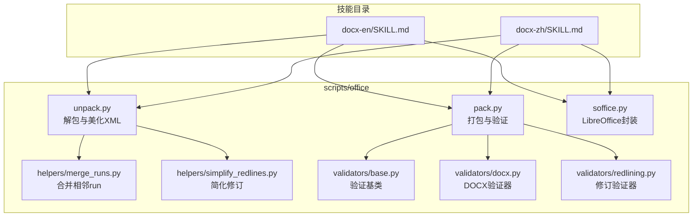
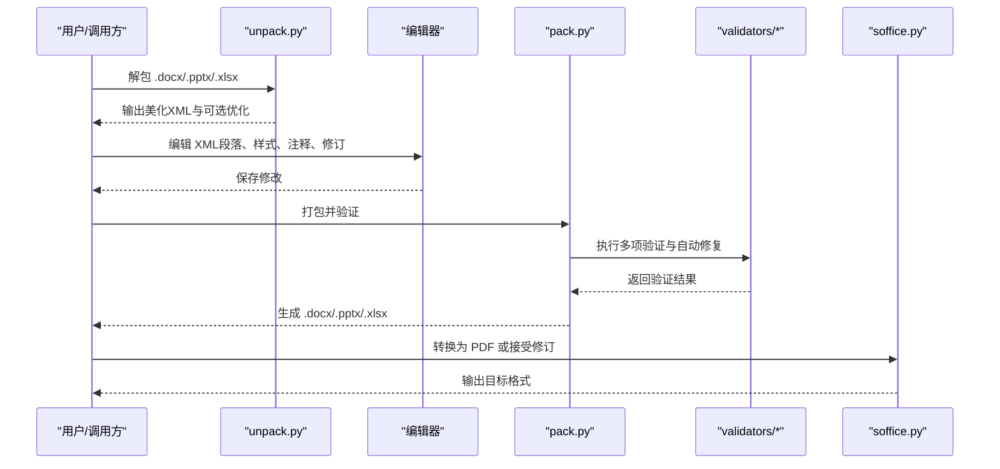
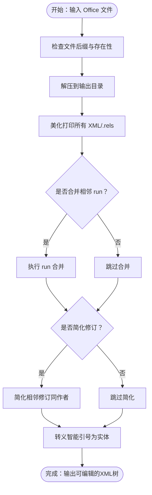
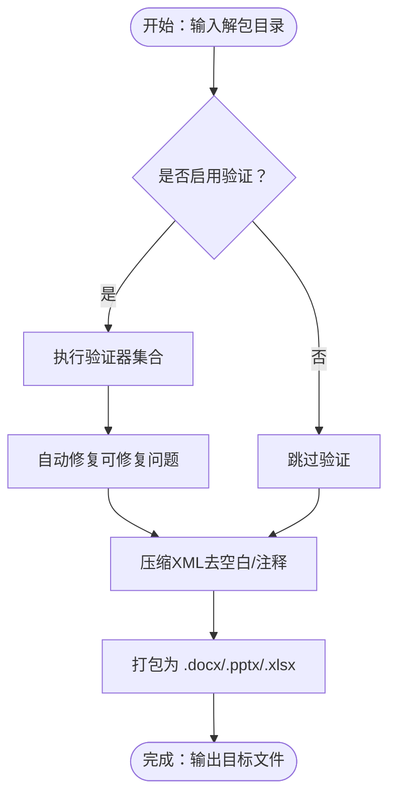
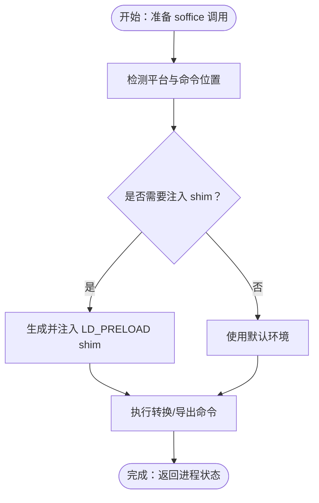
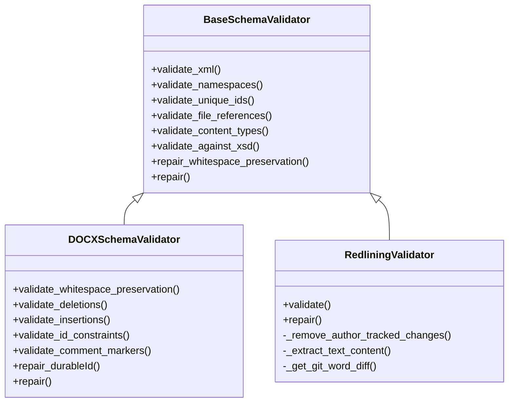
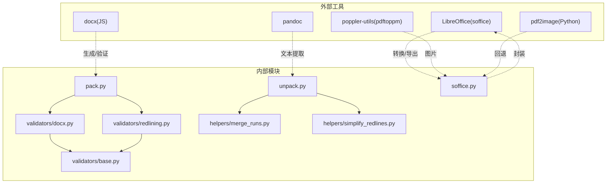

# Word文档处理技能

<cite>
**本文档引用的文件**
- [SKILL.md（英语）](file://src/qwenpaw/agents/skills/docx-en/SKILL.md)
- [SKILL.md（中文）](file://src/qwenpaw/agents/skills/docx-zh/SKILL.md)
- [unpack.py](file://src/qwenpaw/agents/skills/docx-en/scripts/office/unpack.py)
- [pack.py](file://src/qwenpaw/agents/skills/docx-en/scripts/office/pack.py)
- [soffice.py](file://src/qwenpaw/agents/skills/docx-en/scripts/office/soffice.py)
- [merge_runs.py](file://src/qwenpaw/agents/skills/docx-en/scripts/office/helpers/merge_runs.py)
- [simplify_redlines.py](file://src/qwenpaw/agents/skills/docx-en/scripts/office/helpers/simplify_redlines.py)
- [docx.py（验证器，英语）](file://src/qwenpaw/agents/skills/docx-en/scripts/office/validators/docx.py)
- [docx.py（验证器，中文）](file://src/qwenpaw/agents/skills/docx-zh/scripts/office/validators/docx.py)
- [base.py（验证器基类）](file://src/qwenpaw/agents/skills/docx-en/scripts/office/validators/base.py)
- [redlining.py（修订验证器）](file://src/qwenpaw/agents/skills/docx-en/scripts/office/validators/redlining.py)
</cite>

## 目录
1. [简介](#简介)
2. [项目结构](#项目结构)
3. [核心组件](#核心组件)
4. [架构总览](#架构总览)
5. [详细组件分析](#详细组件分析)
6. [依赖分析](#依赖分析)
7. [性能考虑](#性能考虑)
8. [故障排查指南](#故障排查指南)
9. [结论](#结论)
10. [附录](#附录)

## 简介
本技能面向QwenPaw平台，提供完整的Word文档（.docx）读取、解析、编辑与生成能力，严格遵循Office Open XML（OOXML）标准，覆盖文档结构解析、样式与段落格式化、注释与评论管理、修订跟踪、打包解包、Schema验证、模板处理、中英文双语支持与本地化、安全处理与兼容性保障、错误恢复机制等。通过命令行工具链与Python脚本，实现从创建到发布的全生命周期文档工程化处理。

## 项目结构
该技能位于技能目录下的docx-en与docx-zh两个语言版本，分别提供英文与中文的使用说明与流程指引。核心实现集中在scripts/office目录下的解包、打包、验证与辅助工具模块，配合LibreOffice soffice进行格式转换与PDF导出。

图示来源
- [SKILL.md（英语）:1-488](file://src/qwenpaw/agents/skills/docx-en/SKILL.md#L1-L488)
- [SKILL.md（中文）:1-488](file://src/qwenpaw/agents/skills/docx-zh/SKILL.md#L1-L488)
- [unpack.py:1-133](file://src/qwenpaw/agents/skills/docx-en/scripts/office/unpack.py#L1-L133)
- [pack.py:1-160](file://src/qwenpaw/agents/skills/docx-en/scripts/office/pack.py#L1-L160)
- [soffice.py:1-221](file://src/qwenpaw/agents/skills/docx-en/scripts/office/soffice.py#L1-L221)
- [merge_runs.py:1-200](file://src/qwenpaw/agents/skills/docx-en/scripts/office/helpers/merge_runs.py#L1-L200)
- [simplify_redlines.py:1-198](file://src/qwenpaw/agents/skills/docx-en/scripts/office/helpers/simplify_redlines.py#L1-L198)
- [base.py（验证器基类）:1-848](file://src/qwenpaw/agents/skills/docx-en/scripts/office/validators/base.py#L1-L848)
- [docx.py（验证器，英语）:1-448](file://src/qwenpaw/agents/skills/docx-en/scripts/office/validators/docx.py#L1-L448)
- [redlining.py（修订验证器）:1-248](file://src/qwenpaw/agents/skills/docx-en/scripts/office/validators/redlining.py#L1-L248)

章节来源
- [SKILL.md（英语）:1-488](file://src/qwenpaw/agents/skills/docx-en/SKILL.md#L1-L488)
- [SKILL.md（中文）:1-488](file://src/qwenpaw/agents/skills/docx-zh/SKILL.md#L1-L488)

## 核心组件
- 解包与美化：将ZIP归档解压为可编辑的XML树，美化输出并进行智能引号转义，支持可选的run合并与修订简化。
- 打包与验证：对编辑后的XML进行压缩与打包，执行多维度验证（XML语法、命名空间、唯一ID、关系引用、内容类型、XSD、空白保留、修订约束等），并自动修复可修复问题。
- LibreOffice集成：提供跨平台soffice调用封装，适配受限环境（如禁用AF_UNIX socket的沙箱VM），支持headless转换与PDF导出。
- 辅助工具：针对docx的run合并与相邻修订简化，提升编辑体验与一致性。
- 验证器体系：基于基类扩展的DOCX专用验证器与修订验证器，结合原文件对比，识别新增错误与不合规点。

章节来源
- [unpack.py:1-133](file://src/qwenpaw/agents/skills/docx-en/scripts/office/unpack.py#L1-L133)
- [pack.py:1-160](file://src/qwenpaw/agents/skills/docx-en/scripts/office/pack.py#L1-L160)
- [soffice.py:1-221](file://src/qwenpaw/agents/skills/docx-en/scripts/office/soffice.py#L1-L221)
- [merge_runs.py:1-200](file://src/qwenpaw/agents/skills/docx-en/scripts/office/helpers/merge_runs.py#L1-L200)
- [simplify_redlines.py:1-198](file://src/qwenpaw/agents/skills/docx-en/scripts/office/helpers/simplify_redlines.py#L1-L198)
- [base.py（验证器基类）:1-848](file://src/qwenpaw/agents/skills/docx-en/scripts/office/validators/base.py#L1-L848)
- [docx.py（验证器，英语）:1-448](file://src/qwenpaw/agents/skills/docx-en/scripts/office/validators/docx.py#L1-L448)
- [redlining.py（修订验证器）:1-248](file://src/qwenpaw/agents/skills/docx-en/scripts/office/validators/redlining.py#L1-L248)

## 架构总览
整体流程分为“读取/分析”、“创建/编辑”、“转换/导出”三大阶段，贯穿解包、编辑、验证与打包的闭环。

图示来源
- [unpack.py:1-133](file://src/qwenpaw/agents/skills/docx-en/scripts/office/unpack.py#L1-L133)
- [pack.py:1-160](file://src/qwenpaw/agents/skills/docx-en/scripts/office/pack.py#L1-L160)
- [soffice.py:1-221](file://src/qwenpaw/agents/skills/docx-en/scripts/office/soffice.py#L1-L221)
- [docx.py（验证器，英语）:1-448](file://src/qwenpaw/agents/skills/docx-en/scripts/office/validators/docx.py#L1-L448)
- [redlining.py（修订验证器）:1-248](file://src/qwenpaw/agents/skills/docx-en/scripts/office/validators/redlining.py#L1-L248)

## 详细组件分析

### 解包与XML美化（unpack.py）
- 功能要点
  - ZIP解包、XML美化打印、智能引号转义（&#x2018;/&#x2019;/&#x201C;/&#x201D;）、可选run合并与修订简化。
  - 支持.docx/.pptx/.xlsx三类文件，统一处理XML与.rels关系文件。
- 关键行为
  - 对所有XML与.rels文件执行美化打印，便于人工审阅与编辑。
  - 针对docx，可选择关闭run合并与修订简化，以保留更细粒度的结构。
  - 智能引号替换确保在编辑后仍能正确保留专业排版引号实体。

图示来源
- [unpack.py:1-133](file://src/qwenpaw/agents/skills/docx-en/scripts/office/unpack.py#L1-L133)
- [merge_runs.py:1-200](file://src/qwenpaw/agents/skills/docx-en/scripts/office/helpers/merge_runs.py#L1-L200)
- [simplify_redlines.py:1-198](file://src/qwenpaw/agents/skills/docx-en/scripts/office/helpers/simplify_redlines.py#L1-L198)

章节来源
- [unpack.py:1-133](file://src/qwenpaw/agents/skills/docx-en/scripts/office/unpack.py#L1-L133)
- [merge_runs.py:1-200](file://src/qwenpaw/agents/skills/docx-en/scripts/office/helpers/merge_runs.py#L1-L200)
- [simplify_redlines.py:1-198](file://src/qwenpaw/agents/skills/docx-en/scripts/office/helpers/simplify_redlines.py#L1-L198)

### 打包与验证（pack.py）
- 功能要点
  - 压缩XML（去除多余空白与注释）、打包为ZIP归档、生成最终Office文件。
  - 可选验证：对docx执行DOCXSchemaValidator与RedliningValidator，自动修复可修复问题并输出统计。
- 关键行为
  - 临时复制解包目录，逐文件压缩XML，避免污染源文件。
  - 针对不同后缀选择验证器组合，如docx同时进行架构与修订验证。
  - 自动修复策略：空白保留修复、durableId修复等。

图示来源
- [pack.py:1-160](file://src/qwenpaw/agents/skills/docx-en/scripts/office/pack.py#L1-L160)
- [docx.py（验证器，英语）:1-448](file://src/qwenpaw/agents/skills/docx-en/scripts/office/validators/docx.py#L1-L448)
- [redlining.py（修订验证器）:1-248](file://src/qwenpaw/agents/skills/docx-en/scripts/office/validators/redlining.py#L1-L248)

章节来源
- [pack.py:1-160](file://src/qwenpaw/agents/skills/docx-en/scripts/office/pack.py#L1-L160)

### LibreOffice封装（soffice.py）
- 功能要点
  - 跨平台定位soffice命令，Linux下设置headless渲染参数，必要时通过LD_PRELOAD注入socket shim以绕过AF_UNIX限制。
  - 提供直接运行与环境注入两种使用方式，便于在受限环境中执行转换与PDF导出。
- 关键行为
  - 检测AF_UNIX可用性，动态决定是否注入shim。
  - 支持Windows与Linux常见安装路径探测，回退至PATH。

图示来源
- [soffice.py:1-221](file://src/qwenpaw/agents/skills/docx-en/scripts/office/soffice.py#L1-L221)

章节来源
- [soffice.py:1-221](file://src/qwenpaw/agents/skills/docx-en/scripts/office/soffice.py#L1-L221)

### 验证器体系（validators）
- 基类（base.py）
  - 提供通用验证框架：XML语法、命名空间声明、唯一ID、关系引用、内容类型、XSD校验、空白保留、MC Ignorable清理等。
  - 支持与原文件对比，过滤历史错误，仅报告新增错误。
- DOCX专用（docx.py）
  - 针对docx补充：空白保留、删除/插入元素约束、paraId/durableId约束、注释标记成对性等。
  - 提供自动修复：durableId重生成等。
- 修订验证（redlining.py）
  - 以作者为维度，移除该作者的修订标记后对比文本，确保修订模式正确且内容一致。
  - 若差异存在，尝试生成word-diff以辅助定位问题。

图示来源
- [base.py（验证器基类）:1-848](file://src/qwenpaw/agents/skills/docx-en/scripts/office/validators/base.py#L1-L848)
- [docx.py（验证器，英语）:1-448](file://src/qwenpaw/agents/skills/docx-en/scripts/office/validators/docx.py#L1-L448)
- [redlining.py（修订验证器）:1-248](file://src/qwenpaw/agents/skills/docx-en/scripts/office/validators/redlining.py#L1-L248)

章节来源
- [base.py（验证器基类）:1-848](file://src/qwenpaw/agents/skills/docx-en/scripts/office/validators/base.py#L1-L848)
- [docx.py（验证器，英语）:1-448](file://src/qwenpaw/agents/skills/docx-en/scripts/office/validators/docx.py#L1-L448)
- [redlining.py（修订验证器）:1-248](file://src/qwenpaw/agents/skills/docx-en/scripts/office/validators/redlining.py#L1-L248)

### 辅助工具（helpers）
- run合并（merge_runs.py）
  - 合并相邻且格式相同的<w:r>，移除proofErr与rsid属性，减少冗余，提升可读性。
- 修订简化（simplify_redlines.py）
  - 合并同一作者相邻的<w:ins>/<w:del>，仅在完全相邻且无文本节点时才合并，降低复杂度。

章节来源
- [merge_runs.py:1-200](file://src/qwenpaw/agents/skills/docx-en/scripts/office/helpers/merge_runs.py#L1-L200)
- [simplify_redlines.py:1-198](file://src/qwenpaw/agents/skills/docx-en/scripts/office/helpers/simplify_redlines.py#L1-L198)

## 依赖分析
- 外部依赖
  - docx（JavaScript库）：用于生成新文档与验证（技能说明）。
  - LibreOffice（soffice）：.doc/.docx转换、修订接受、PDF导出。
  - pandoc：文本提取（含修订）。
  - poppler-utils（pdftoppm）：文档转图片工作流。
  - pdf2image：当pdftoppm不可用时的Python回退方案。
- 内部依赖
  - 解包/打包脚本依赖验证器模块与辅助工具。
  - 验证器依赖lxml与defusedxml，确保XML解析安全与高效。
  - soffice封装依赖平台特性检测与动态注入。

图示来源
- [SKILL.md（英语）:15-22](file://src/qwenpaw/agents/skills/docx-en/SKILL.md#L15-L22)
- [unpack.py:1-133](file://src/qwenpaw/agents/skills/docx-en/scripts/office/unpack.py#L1-L133)
- [pack.py:1-160](file://src/qwenpaw/agents/skills/docx-en/scripts/office/pack.py#L1-L160)
- [soffice.py:1-221](file://src/qwenpaw/agents/skills/docx-en/scripts/office/soffice.py#L1-L221)
- [docx.py（验证器，英语）:1-448](file://src/qwenpaw/agents/skills/docx-en/scripts/office/validators/docx.py#L1-L448)
- [redlining.py（修订验证器）:1-248](file://src/qwenpaw/agents/skills/docx-en/scripts/office/validators/redlining.py#L1-L248)

章节来源
- [SKILL.md（英语）:15-22](file://src/qwenpaw/agents/skills/docx-en/SKILL.md#L15-L22)

## 性能考虑
- 解包阶段
  - XML美化与智能引号转义为O(n)扫描，对大文档建议开启批量处理与分步验证。
  - run合并与修订简化在内存中操作DOM，注意控制文档复杂度与元素数量。
- 打包阶段
  - 压缩XML时逐文件处理，I/O瓶颈主要来自磁盘吞吐；建议使用SSD与合适的临时目录。
  - 验证器在大型文档上可能成为耗时环节，可按需关闭或选择性验证。
- 外部工具
  - LibreOffice转换与PDF导出为CPU密集型，建议在资源充足的环境中执行。
  - poppler-utils较轻量，若不可用则使用pdf2image作为回退，但可能影响速度。

## 故障排查指南
- XML语法错误
  - 现象：验证失败，提示某XML文件语法错误。
  - 处理：检查对应文件是否被意外修改，确认命名空间声明完整，必要时回滚到解包前状态。
- 命名空间与ID冲突
  - 现象：唯一ID重复或命名空间未声明。
  - 处理：使用验证器输出的行号定位，修正重复ID或补全命名空间声明。
- 关系引用与内容类型
  - 现象：提示关系ID不存在或媒体扩展未声明。
  - 处理：核对.rels与[Content_Types].xml，确保所有引用文件均被声明。
- 空白保留与修订约束
  - 现象：删除元素内出现<w:t>或空白未保留。
  - 处理：根据验证器提示修复，确保删除块内使用<w:delText>与<w:delInstrText>，并在首尾文本节点添加xml:space="preserve"。
- LibreOffice环境问题
  - 现象：AF_UNIX socket不可用导致soffice阻塞。
  - 处理：使用提供的封装自动注入shim，或调整容器网络与权限设置。
- 修订验证失败
  - 现象：作者修订后文本不一致。
  - 处理：按修订验证器建议的模式修正，确保删除嵌套在插入内或在删除后追加插入恢复原文。

章节来源
- [base.py（验证器基类）:143-197](file://src/qwenpaw/agents/skills/docx-en/scripts/office/validators/base.py#L143-L197)
- [docx.py（验证器，英语）:67-162](file://src/qwenpaw/agents/skills/docx-en/scripts/office/validators/docx.py#L67-L162)
- [redlining.py（修订验证器）:25-102](file://src/qwenpaw/agents/skills/docx-en/scripts/office/validators/redlining.py#L25-L102)
- [soffice.py:78-103](file://src/qwenpaw/agents/skills/docx-en/scripts/office/soffice.py#L78-L103)

## 结论
本技能以严格的OOXML标准为基础，结合自动化解包、编辑、验证与打包流程，提供了从创建到发布的完整Word文档工程化能力。通过多层验证与自动修复，显著提升了文档质量与兼容性；通过LibreOffice封装与外部工具链，实现了跨平台与多样化输出。建议在生产环境中结合CI/CD流水线，对关键文档执行自动验证与回归测试，确保长期稳定性与一致性。

## 附录
- 中英文双语支持
  - 技能说明文档提供docx-en与docx-zh两套语言版本，涵盖前置依赖、快速参考、创建与编辑流程、XML参考与注意事项等。
- 本地化处理
  - 智能引号转义与空白保留策略确保多语言文本在编辑后仍符合规范。
- 安全处理
  - 使用defusedxml解析XML，避免XXE等风险；验证器过滤无关命名空间与清理模板标签，降低攻击面。
- 兼容性与错误恢复
  - durableId自动修复、空白保留修复、关系引用校验与XSD对比，确保生成文件在主流平台与软件中稳定打开。

章节来源
- [SKILL.md（英语）:1-488](file://src/qwenpaw/agents/skills/docx-en/SKILL.md#L1-L488)
- [SKILL.md（中文）:1-488](file://src/qwenpaw/agents/skills/docx-zh/SKILL.md#L1-L488)