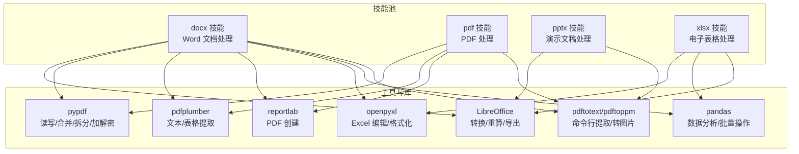
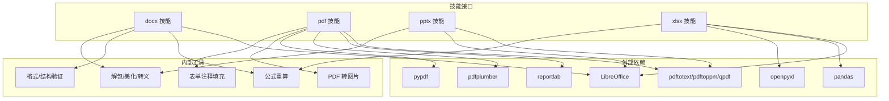
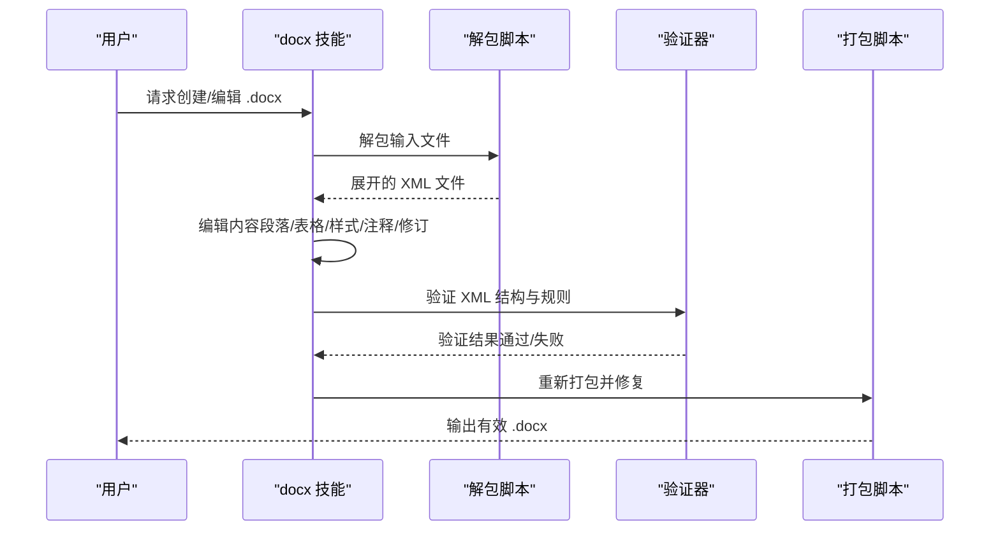
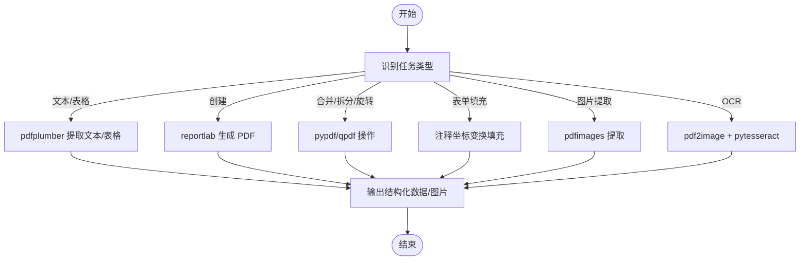
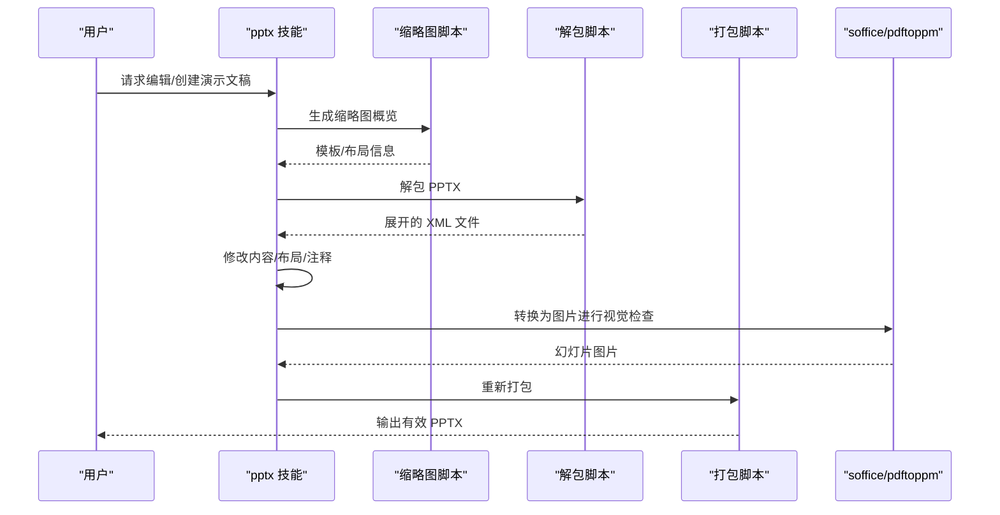
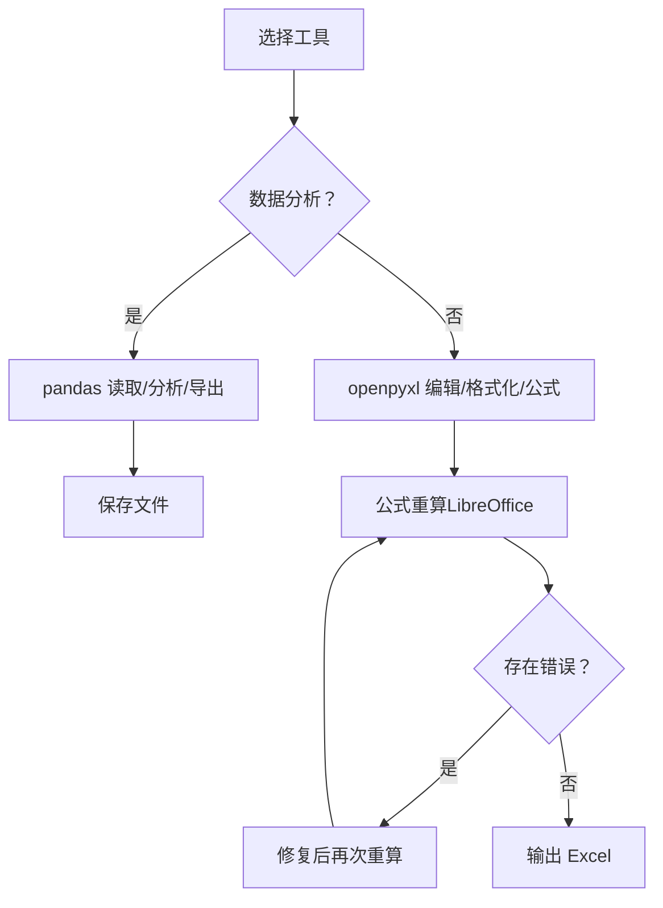
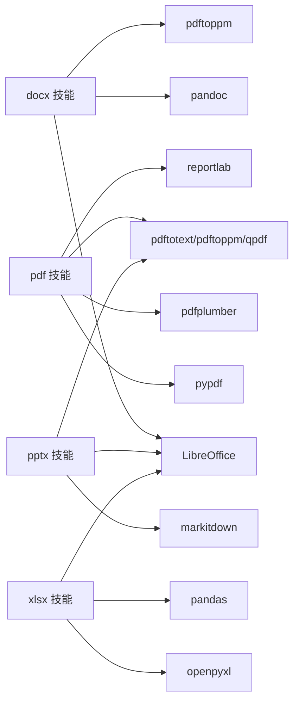

# 文档处理技能

<cite>
**本文引用的文件**
- [docx 英文技能说明](file://src/qwenpaw/agents/skills/docx-en/SKILL.md)
- [pdf 英文技能说明](file://src/qwenpaw/agents/skills/pdf-en/SKILL.md)
- [pptx 英文技能说明](file://src/qwenpaw/agents/skills/pptx-en/SKILL.md)
- [xlsx 英文技能说明](file://src/qwenpaw/agents/skills/xlsx-en/SKILL.md)
- [docx 验证器](file://src/qwenpaw/agents/skills/docx-en/scripts/office/validators/docx.py)
- [pdf 表单填充脚本](file://src/qwenpaw/agents/skills/pdf-en/scripts/fill_pdf_form_with_annotations.py)
- [pdf 图片转换脚本](file://src/qwenpaw/agents/skills/pdf-en/scripts/convert_pdf_to_images.py)
- [xlsx 公式重算脚本](file://src/qwenpaw/agents/skills/xlsx-en/scripts/recalc.py)
- [docx 解包脚本](file://src/qwenpaw/agents/skills/docx-en/scripts/office/unpack.py)
- [pptx 解包脚本](file://src/qwenpaw/agents/skills/pptx-en/scripts/office/unpack.py)
- [技能总览（中文）](file://website/public/docs/skills.zh.md)
- [技能总览（英文）](file://website/public/docs/skills.en.md)
</cite>

## 目录
1. [简介](#简介)
2. [项目结构](#项目结构)
3. [核心组件](#核心组件)
4. [架构总览](#架构总览)
5. [详细组件分析](#详细组件分析)
6. [依赖关系分析](#依赖关系分析)
7. [性能考量](#性能考量)
8. [故障排查指南](#故障排查指南)
9. [结论](#结论)
10. [附录](#附录)

## 简介
本文件系统性梳理 QwenPaw 中的文档处理技能，覆盖 Word（.docx）、PDF、PowerPoint（.pptx）、Excel（.xlsx/.xlsm/.csv/.tsv）四大办公文档类型。内容包括：
- 读取、编辑、转换与生成的完整流程
- 各格式的特殊处理逻辑（表格、图表、注释、批注、公式、表单）
- 安全处理、格式校验与错误恢复机制
- 批量处理、模板使用与自动化工作流最佳实践
- 实际业务场景应用与性能优化建议

## 项目结构
文档处理技能以“内置技能”形式分布在技能池中，每种格式对应一个技能目录，内含：
- 技能说明文档（SKILL.md），描述能力边界、前置条件、工作流与注意事项
- Python 脚本与工具链，支撑解包/打包、验证、公式重算、表单填充、图片转换等
- 与外部工具的集成（LibreOffice、pypdf、pdfplumber、reportlab、openpyxl、pandas 等）

**图表来源**
- [docx 英文技能说明:15-22](file://src/qwenpaw/agents/skills/docx-en/SKILL.md#L15-L22)
- [pdf 英文技能说明:15-22](file://src/qwenpaw/agents/skills/pdf-en/SKILL.md#L15-L22)
- [pptx 英文技能说明:15-23](file://src/qwenpaw/agents/skills/pptx-en/SKILL.md#L15-L23)
- [xlsx 英文技能说明:78-84](file://src/qwenpaw/agents/skills/xlsx-en/SKILL.md#L78-L84)

**章节来源**
- [docx 英文技能说明:1-488](file://src/qwenpaw/agents/skills/docx-en/SKILL.md#L1-L488)
- [pdf 英文技能说明:1-330](file://src/qwenpaw/agents/skills/pdf-en/SKILL.md#L1-L330)
- [pptx 英文技能说明:1-240](file://src/qwenpaw/agents/skills/pptx-en/SKILL.md#L1-L240)
- [xlsx 英文技能说明:1-306](file://src/qwenpaw/agents/skills/xlsx-en/SKILL.md#L1-L306)
- [技能总览（中文）:73-116](file://website/public/docs/skills.zh.md#L73-L116)
- [技能总览（英文）:73-124](file://website/public/docs/skills.en.md#L73-L124)

## 核心组件
- Word（docx）：支持创建、读取、编辑、转换为图片、接受修订、注释管理、目录生成、样式与表格渲染、XML 解包/打包与自动修复
- PDF（pdf）：支持读取/提取文本/表格、合并/拆分、旋转、加水印、创建、表单填写（基于注释坐标变换）、OCR（扫描件）、图片提取
- PowerPoint（pptx）：支持内容读取、模板可视化、从零创建、设计要点、图像化检查与质量保证
- Excel（xlsx/xlsm/csv/tsv）：支持读取/分析、创建/编辑、公式构建与重算、颜色与格式标准、跨表引用与错误检测

**章节来源**
- [docx 英文技能说明:15-301](file://src/qwenpaw/agents/skills/docx-en/SKILL.md#L15-L301)
- [pdf 英文技能说明:15-329](file://src/qwenpaw/agents/skills/pdf-en/SKILL.md#L15-L329)
- [pptx 英文技能说明:15-240](file://src/qwenpaw/agents/skills/pptx-en/SKILL.md#L15-L240)
- [xlsx 英文技能说明:78-306](file://src/qwenpaw/agents/skills/xlsx-en/SKILL.md#L78-L306)

## 架构总览
文档处理技能采用“技能 + 工具链 + 外部依赖”的分层架构：
- 技能层：以 SKILL.md 描述能力范围与流程
- 工具层：Python 脚本实现具体操作（解包/打包、验证、重算、填充）
- 依赖层：第三方库与命令行工具（LibreOffice、pypdf、pdfplumber、reportlab、openpyxl、pandas、poppler-utils）

**图表来源**
- [docx 英文技能说明:15-301](file://src/qwenpaw/agents/skills/docx-en/SKILL.md#L15-L301)
- [pdf 英文技能说明:15-329](file://src/qwenpaw/agents/skills/pdf-en/SKILL.md#L15-L329)
- [pptx 英文技能说明:15-240](file://src/qwenpaw/agents/skills/pptx-en/SKILL.md#L15-L240)
- [xlsx 英文技能说明:78-306](file://src/qwenpaw/agents/skills/xlsx-en/SKILL.md#L78-L306)

## 详细组件分析

### Word（docx）处理
- 读取与分析：支持通过 pandoc 提取带修订标记的文本，或直接解包查看原始 XML
- 创建新文档：使用 docx-js 生成 .docx，随后进行验证；注意页面尺寸与字体设置
- 编辑现有文档：解包 → 编辑 XML → 重新打包 → 自动修复与验证
- 修订与注释：支持插入/删除修订、接受修订、添加评论与引用标记
- 表格与样式：强调 DXA 单位宽度、单元格内外边距、清除背景着色、标题级别与目录生成
- 图像：要求显式指定类型与替代文本，避免无效 XML
- 错误恢复：自动修复 durableId、空格保留、插入/删除标签合规性

**图表来源**
- [docx 英文技能说明:304-360](file://src/qwenpaw/agents/skills/docx-en/SKILL.md#L304-L360)
- [docx 验证器:25-65](file://src/qwenpaw/agents/skills/docx-en/scripts/office/validators/docx.py#L25-L65)
- [docx 解包脚本:34-74](file://src/qwenpaw/agents/skills/docx-en/scripts/office/unpack.py#L34-L74)

**章节来源**
- [docx 英文技能说明:44-67](file://src/qwenpaw/agents/skills/docx-en/SKILL.md#L44-L67)
- [docx 英文技能说明:71-127](file://src/qwenpaw/agents/skills/docx-en/SKILL.md#L71-L127)
- [docx 英文技能说明:188-247](file://src/qwenpaw/agents/skills/docx-en/SKILL.md#L188-L247)
- [docx 英文技能说明:304-360](file://src/qwenpaw/agents/skills/docx-en/SKILL.md#L304-L360)
- [docx 验证器:67-111](file://src/qwenpaw/agents/skills/docx-en/scripts/office/validators/docx.py#L67-L111)
- [docx 验证器:113-162](file://src/qwenpaw/agents/skills/docx-en/scripts/office/validators/docx.py#L113-L162)
- [docx 验证器:203-242](file://src/qwenpaw/agents/skills/docx-en/scripts/office/validators/docx.py#L203-L242)
- [docx 验证器:299-385](file://src/qwenpaw/agents/skills/docx-en/scripts/office/validators/docx.py#L299-L385)

### PDF 处理
- 基础操作：合并、拆分、旋转、元数据提取、加解密
- 文本与表格：pdfplumber 提取布局文本与表格，可结合 pandas 组合为结构化数据
- 创建与水印：reportlab 生成 PDF，叠加水印页
- 表单处理：基于注释坐标变换填充字段，兼容图像坐标与 PDF 坐标系
- 图片提取与 OCR：pdfimages 提取图片；扫描件先转图像再 OCR
- 命令行工具：qpdf、pdftotext、pdftoppm

**图表来源**
- [pdf 英文技能说明:43-329](file://src/qwenpaw/agents/skills/pdf-en/SKILL.md#L43-L329)
- [pdf 表单填充脚本:33-96](file://src/qwenpaw/agents/skills/pdf-en/scripts/fill_pdf_form_with_annotations.py#L33-L96)
- [pdf 图片转换脚本:9-24](file://src/qwenpaw/agents/skills/pdf-en/scripts/convert_pdf_to_images.py#L9-L24)

**章节来源**
- [pdf 英文技能说明:43-134](file://src/qwenpaw/agents/skills/pdf-en/SKILL.md#L43-L134)
- [pdf 英文技能说明:136-202](file://src/qwenpaw/agents/skills/pdf-en/SKILL.md#L136-L202)
- [pdf 英文技能说明:204-244](file://src/qwenpaw/agents/skills/pdf-en/SKILL.md#L204-L244)
- [pdf 英文技能说明:246-292](file://src/qwenpaw/agents/skills/pdf-en/SKILL.md#L246-L292)
- [pdf 表单填充脚本:10-31](file://src/qwenpaw/agents/skills/pdf-en/scripts/fill_pdf_form_with_annotations.py#L10-L31)
- [pdf 图片转换脚本:1-34](file://src/qwenpaw/agents/skills/pdf-en/scripts/convert_pdf_to_images.py#L1-L34)

### PowerPoint（pptx）处理
- 内容读取：使用 markitdown 提取文本，缩略图概览幻灯片结构
- 编辑流程：模板缩略图分析 → 解包 → 滑块/内容/布局修改 → 清理 → 重新打包
- 设计要点：配色、字体、版式、间距、避免常见错误
- 质量保证：图像化对比检查、QA 循环（生成 → 转图片 → 检视 → 修复 → 再验证）

**图表来源**
- [pptx 英文技能说明:35-56](file://src/qwenpaw/agents/skills/pptx-en/SKILL.md#L35-L56)
- [pptx 英文技能说明:157-220](file://src/qwenpaw/agents/skills/pptx-en/SKILL.md#L157-L220)
- [pptx 解包脚本:34-74](file://src/qwenpaw/agents/skills/pptx-en/scripts/office/unpack.py#L34-L74)

**章节来源**
- [pptx 英文技能说明:35-56](file://src/qwenpaw/agents/skills/pptx-en/SKILL.md#L35-L56)
- [pptx 英文技能说明:157-220](file://src/qwenpaw/agents/skills/pptx-en/SKILL.md#L157-L220)
- [pptx 英文技能说明:223-240](file://src/qwenpaw/agents/skills/pptx-en/SKILL.md#L223-L240)
- [pptx 解包脚本:1-133](file://src/qwenpaw/agents/skills/pptx-en/scripts/office/unpack.py#L1-L133)

### Excel（xlsx/xlsm/csv/tsv）处理
- 数据分析：pandas 读取/统计/筛选/导出
- 创建/编辑：openpyxl 添加数据、公式、格式、列宽
- 公式重算：通过 LibreOffice 宏自动计算并扫描错误（#REF!/#DIV/0!/…）
- 规范与标准：字体、颜色编码、数值格式、注释与数据来源标注
- 最佳实践：优先使用公式而非硬编码值；多工作表链接；跨表引用格式正确

**图表来源**
- [xlsx 英文技能说明:90-164](file://src/qwenpaw/agents/skills/xlsx-en/SKILL.md#L90-L164)
- [xlsx 公式重算脚本:80-186](file://src/qwenpaw/agents/skills/xlsx-en/scripts/recalc.py#L80-L186)

**章节来源**
- [xlsx 英文技能说明:90-164](file://src/qwenpaw/agents/skills/xlsx-en/SKILL.md#L90-L164)
- [xlsx 英文技能说明:221-240](file://src/qwenpaw/agents/skills/xlsx-en/SKILL.md#L221-L240)
- [xlsx 英文技能说明:241-277](file://src/qwenpaw/agents/skills/xlsx-en/SKILL.md#L241-L277)
- [xlsx 公式重算脚本:1-210](file://src/qwenpaw/agents/skills/xlsx-en/scripts/recalc.py#L1-L210)

## 依赖关系分析
- docx：依赖 LibreOffice（转换/接受修订/导出）、pandoc（文本提取）、pdftoppm（文档转图片）
- pdf：依赖 pypdf、pdfplumber、reportlab、pdftotext/pdftoppm、qpdf
- pptx：依赖 markitdown（内容提取）、LibreOffice（PPT→PDF）、pdftoppm（图片化检查）
- xlsx：依赖 openpyxl、pandas、LibreOffice（公式重算）

**图表来源**
- [docx 英文技能说明:15-22](file://src/qwenpaw/agents/skills/docx-en/SKILL.md#L15-L22)
- [pdf 英文技能说明:15-22](file://src/qwenpaw/agents/skills/pdf-en/SKILL.md#L15-L22)
- [pptx 英文技能说明:15-23](file://src/qwenpaw/agents/skills/pptx-en/SKILL.md#L15-L23)
- [xlsx 英文技能说明:78-84](file://src/qwenpaw/agents/skills/xlsx-en/SKILL.md#L78-L84)

**章节来源**
- [docx 英文技能说明:15-22](file://src/qwenpaw/agents/skills/docx-en/SKILL.md#L15-L22)
- [pdf 英文技能说明:15-22](file://src/qwenpaw/agents/skills/pdf-en/SKILL.md#L15-L22)
- [pptx 英文技能说明:15-23](file://src/qwenpaw/agents/skills/pptx-en/SKILL.md#L15-L23)
- [xlsx 英文技能说明:78-84](file://src/qwenpaw/agents/skills/xlsx-en/SKILL.md#L78-L84)

## 性能考量
- 批量处理
  - 使用命令行工具（qpdf、pdftotext、pdftoppm）进行并行化与流水线化，减少 Python 循环开销
  - 对大文件优先采用只读/只写模式（openpyxl read_only/write_only）
- 内存与 CPU
  - PDF 图片转换时限制最大分辨率，避免高 DPI 引起的内存峰值
  - pandas 分块读取与按需列选择，降低内存占用
- 重算与验证
  - 公式重算使用超时保护，避免长时间阻塞
  - 验证器分步执行，尽早发现并修复问题，减少重复工作
- 平台差异
  - Windows 环境下确保 PATH 中依赖可用；macOS/Linux 上注意 gtimeout 与 timeout 的差异

[本节为通用指导，无需特定文件引用]

## 故障排查指南
- docx
  - 验证失败：检查空格保留、插入/删除标签位置、注释标记配对、ID 约束（durableId/paraId）
  - 修订与注释：确认修订块替换完整、注释引用与范围标记成对出现
  - 图片与表格：确保类型参数、宽度单位（DXA）、单元格内外边距与着色类型
- pdf
  - 表单注释坐标：确认图像坐标与 PDF 坐标系转换正确，字体/字号/颜色一致
  - OCR：扫描件先转图像再 OCR，注意 DPI 与语言模型
  - 合并与拆分：使用 qpdf 作为后备方案，pypdf 为主
- pptx
  - 质量检查：生成图片后进行视觉对比，关注重叠、溢出、低对比度、间距不均
  - 模板残留：grep 检测占位符，修正后再声明成功
- xlsx
  - 公式错误：#REF!/#DIV/0!/#VALUE!/#NAME? 等，逐项定位并修复
  - 重算失败：检查 LibreOffice 宏是否正确安装与初始化

**章节来源**
- [docx 验证器:67-111](file://src/qwenpaw/agents/skills/docx-en/scripts/office/validators/docx.py#L67-L111)
- [docx 验证器:113-162](file://src/qwenpaw/agents/skills/docx-en/scripts/office/validators/docx.py#L113-L162)
- [docx 验证器:203-242](file://src/qwenpaw/agents/skills/docx-en/scripts/office/validators/docx.py#L203-L242)
- [docx 验证器:299-385](file://src/qwenpaw/agents/skills/docx-en/scripts/office/validators/docx.py#L299-L385)
- [pdf 表单填充脚本:10-31](file://src/qwenpaw/agents/skills/pdf-en/scripts/fill_pdf_form_with_annotations.py#L10-L31)
- [xlsx 公式重算脚本:80-186](file://src/qwenpaw/agents/skills/xlsx-en/scripts/recalc.py#L80-L186)
- [pptx 英文技能说明:157-220](file://src/qwenpaw/agents/skills/pptx-en/SKILL.md#L157-L220)

## 结论
QwenPaw 的文档处理技能以“技能 + 工具链 + 外部依赖”的方式实现了对 Word、PDF、PowerPoint、Excel 的全栈支持。通过严格的格式校验、自动修复与质量保证流程，确保输出文档在不同平台与软件间保持一致性与可读性。配合批量处理与模板化工作流，可在企业级场景中高效完成文档自动化任务。

[本节为总结，无需特定文件引用]

## 附录
- 技能导入与管理
  - 支持从内置仓库导入、从 URL 导入、上传 ZIP、从工作区同步到技能池
  - 更新内置技能以保持与打包版本一致
- 最佳实践清单
  - 优先使用公式而非硬编码值（xlsx）
  - 使用 DXA 单位与一致的字体（docx/pptx）
  - 严格遵循插入/删除与注释标记规范（docx）
  - 图片转存前限制分辨率（pdf）
  - 质量保证采用“生成图片 + 视觉检查”的 QA 循环（pptx）

**章节来源**
- [技能总览（中文）:105-124](file://website/public/docs/skills.zh.md#L105-L124)
- [技能总览（英文）:107-124](file://website/public/docs/skills.en.md#L107-L124)