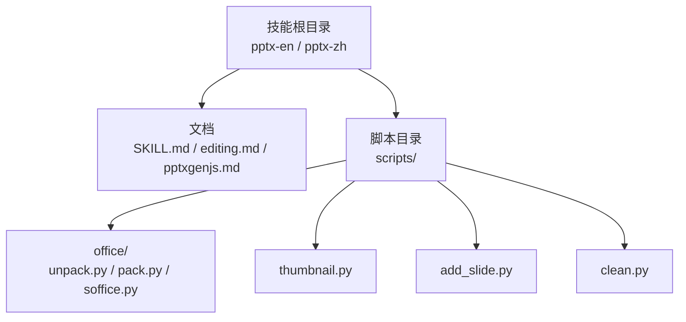
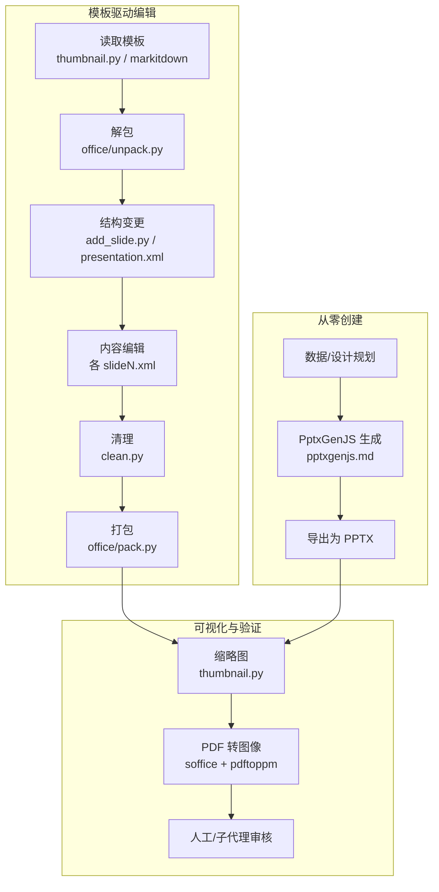
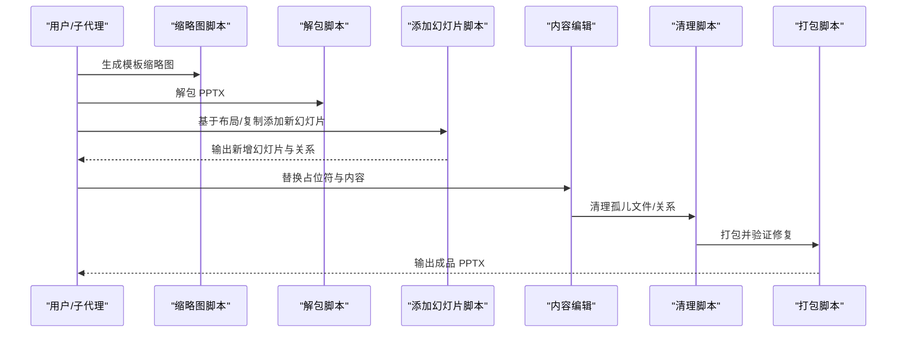
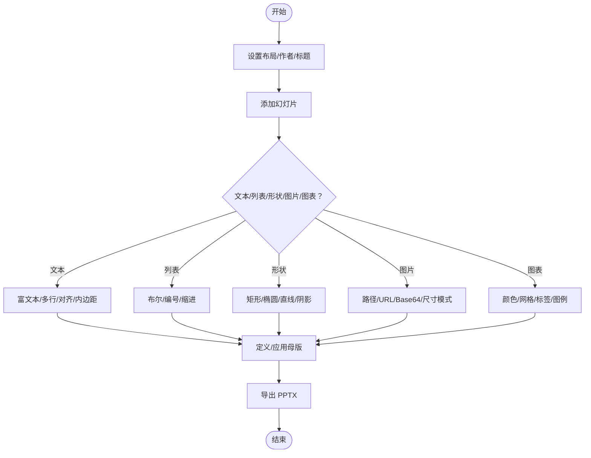
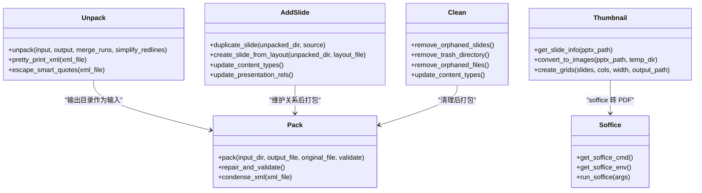
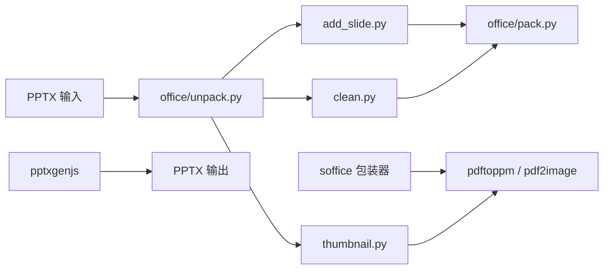

# 演示文稿处理技能

<cite>
**本文档引用的文件**
- [SKILL.md（英文）](file://src/qwenpaw/agents/skills/pptx-en/SKILL.md)
- [SKILL.md（中文）](file://src/qwenpaw/agents/skills/pptx-zh/SKILL.md)
- [编辑指南（英文）](file://src/qwenpaw/agents/skills/pptx-en/editing.md)
- [编辑指南（中文）](file://src/qwenpaw/agents/skills/pptx-zh/editing.md)
- [PptxGenJS 教程（英文）](file://src/qwenpaw/agents/skills/pptx-en/pptxgenjs.md)
- [PptxGenJS 教程（中文）](file://src/qwenpaw/agents/skills/pptx-zh/pptxgenjs.md)
- [添加幻灯片脚本](file://src/qwenpaw/agents/skills/pptx-en/scripts/add_slide.py)
- [清理脚本](file://src/qwenpaw/agents/skills/pptx-en/scripts/clean.py)
- [缩略图脚本](file://src/qwenpaw/agents/skills/pptx-en/scripts/thumbnail.py)
- [解包脚本](file://src/qwenpaw/agents/skills/pptx-en/scripts/office/unpack.py)
- [打包脚本](file://src/qwenpaw/agents/skills/pptx-en/scripts/office/pack.py)
- [LibreOffice 包装器](file://src/qwenpaw/agents/skills/pptx-en/scripts/office/soffice.py)
</cite>

## 目录
1. [简介](#简介)
2. [项目结构](#项目结构)
3. [核心组件](#核心组件)
4. [架构总览](#架构总览)
5. [详细组件分析](#详细组件分析)
6. [依赖关系分析](#依赖关系分析)
7. [性能考量](#性能考量)
8. [故障排查指南](#故障排查指南)
9. [结论](#结论)
10. [附录](#附录)

## 简介
本技能面向 PowerPoint PPTX 的全流程处理，涵盖解析、内容提取、样式应用、重新生成、图表与媒体插入、母版与布局管理、以及从零创建演示文稿。技能基于 Office Open XML（OOXML）规范，通过脚本化的方式对 PPTX 进行解包、编辑、清理与打包，并结合 PptxGenJS 实现程序化创建。同时提供 PPT 到 PDF 的转换能力，支持批量与自动化演示制作。

## 项目结构
该技能位于 agents/skills/pptx 目录下，包含英文与中文两套文档与脚本，核心目录如下：
- 文档：SKILL.md、editing.md、pptxgenjs.md
- 脚本：scripts/office/unpack.py、scripts/office/pack.py、scripts/thumbnail.py、scripts/add_slide.py、scripts/clean.py、scripts/office/soffice.py

**图表来源**
- [SKILL.md（英文）:1-240](file://src/qwenpaw/agents/skills/pptx-en/SKILL.md#L1-L240)
- [SKILL.md（中文）:1-239](file://src/qwenpaw/agents/skills/pptx-zh/SKILL.md#L1-L239)
- [解包脚本:1-133](file://src/qwenpaw/agents/skills/pptx-en/scripts/office/unpack.py#L1-L133)
- [打包脚本:1-160](file://src/qwenpaw/agents/skills/pptx-en/scripts/office/pack.py#L1-L160)
- [缩略图脚本:1-307](file://src/qwenpaw/agents/skills/pptx-en/scripts/thumbnail.py#L1-L307)
- [添加幻灯片脚本:1-196](file://src/qwenpaw/agents/skills/pptx-en/scripts/add_slide.py#L1-L196)
- [清理脚本:1-287](file://src/qwenpaw/agents/skills/pptx-en/scripts/clean.py#L1-L287)
- [LibreOffice 包装器:1-219](file://src/qwenpaw/agents/skills/pptx-en/scripts/office/soffice.py#L1-L219)

**章节来源**
- [SKILL.md（英文）:1-240](file://src/qwenpaw/agents/skills/pptx-en/SKILL.md#L1-L240)
- [SKILL.md（中文）:1-239](file://src/qwenpaw/agents/skills/pptx-zh/SKILL.md#L1-L239)

## 核心组件
- 文档与指南
  - SKILL.md：技能概述、前置依赖、快速参考、设计建议、质量检查与转换为图片的流程。
  - editing.md：基于模板的编辑工作流、脚本清单、幻灯片操作、内容编辑规则与常见陷阱。
  - pptxgenjs.md：使用 PptxGenJS 从零创建演示文稿，涵盖布局、文本、列表、形状、图片、图标、表格、图表、母版与常见问题。
- 脚本工具
  - 解包/打包：对 PPTX 进行解包、美化 XML、智能引号转义、打包与验证修复。
  - 缩略图：将 PPTX 转 PDF 后再转图像，生成幻灯片网格缩略图，便于模板分析。
  - 添加幻灯片：基于布局或复制现有幻灯片生成新幻灯片，维护关系与 Content_Types。
  - 清理：移除未引用的幻灯片、媒体、主题、备注、关系文件及 Content_Types 条目。
  - LibreOffice 包装器：跨平台运行 soffice，自动处理 AF_UNIX 套接字受限环境。

**章节来源**
- [编辑指南（英文）:1-210](file://src/qwenpaw/agents/skills/pptx-en/editing.md#L1-L210)
- [编辑指南（中文）:1-210](file://src/qwenpaw/agents/skills/pptx-zh/editing.md#L1-L210)
- [PptxGenJS 教程（英文）:1-421](file://src/qwenpaw/agents/skills/pptx-en/pptxgenjs.md#L1-L421)
- [PptxGenJS 教程（中文）:1-421](file://src/qwenpaw/agents/skills/pptx-zh/pptxgenjs.md#L1-L421)

## 架构总览
整体处理流程分为两类：模板驱动编辑与从零创建。二者均以 Office Open XML 为核心，通过解包、编辑、清理、打包闭环完成。

**图表来源**
- [缩略图脚本:1-307](file://src/qwenpaw/agents/skills/pptx-en/scripts/thumbnail.py#L1-L307)
- [LibreOffice 包装器:1-219](file://src/qwenpaw/agents/skills/pptx-en/scripts/office/soffice.py#L1-L219)
- [添加幻灯片脚本:1-196](file://src/qwenpaw/agents/skills/pptx-en/scripts/add_slide.py#L1-L196)
- [清理脚本:1-287](file://src/qwenpaw/agents/skills/pptx-en/scripts/clean.py#L1-L287)
- [解包脚本:1-133](file://src/qwenpaw/agents/skills/pptx-en/scripts/office/unpack.py#L1-L133)
- [打包脚本:1-160](file://src/qwenpaw/agents/skills/pptx-en/scripts/office/pack.py#L1-L160)
- [PptxGenJS 教程（英文）:1-421](file://src/qwenpaw/agents/skills/pptx-en/pptxgenjs.md#L1-L421)

## 详细组件分析

### 组件一：模板驱动编辑工作流
- 模板分析：使用缩略图与文本提取快速识别布局、占位符与结构。
- 结构变更：通过 add_slide.py 添加/复制幻灯片，维护 presentation.xml 中的 sldIdLst 与关系。
- 内容编辑：逐个 slideN.xml 替换占位符，遵循格式规则与常见陷阱规避。
- 清理与打包：清理孤儿文件与关系，美化 XML 并验证修复后重新打包。

**图表来源**
- [缩略图脚本:1-307](file://src/qwenpaw/agents/skills/pptx-en/scripts/thumbnail.py#L1-L307)
- [解包脚本:1-133](file://src/qwenpaw/agents/skills/pptx-en/scripts/office/unpack.py#L1-L133)
- [添加幻灯片脚本:1-196](file://src/qwenpaw/agents/skills/pptx-en/scripts/add_slide.py#L1-L196)
- [清理脚本:1-287](file://src/qwenpaw/agents/skills/pptx-en/scripts/clean.py#L1-L287)
- [打包脚本:1-160](file://src/qwenpaw/agents/skills/pptx-en/scripts/office/pack.py#L1-L160)

**章节来源**
- [编辑指南（英文）:7-115](file://src/qwenpaw/agents/skills/pptx-en/editing.md#L7-L115)
- [编辑指南（中文）:7-115](file://src/qwenpaw/agents/skills/pptx-zh/editing.md#L7-L115)

### 组件二：从零创建演示文稿（PptxGenJS）
- 基本结构：设置布局、作者、标题，添加幻灯片与文本。
- 文本与格式：富文本数组、多行文本、字符间距、对齐与内边距。
- 列表与项目符号：统一使用布尔/编号配置，避免 Unicode 项目符号。
- 形状与阴影：矩形、椭圆、直线、圆角矩形与阴影参数范围。
- 图片与图标：支持文件/URL/Base64，尺寸模式（contain/cover/crop），图标生成与栅格化。
- 表格与图表：表格样式与合并单元格，图表颜色、网格线、数据标签与图例。
- 母版与布局：定义母版并应用到标题页等。
- 常见问题：颜色格式、透明度、项目符号、换行、阴影角度与负偏移、圆角矩形与装饰叠加、对象复用等。

**图表来源**
- [PptxGenJS 教程（英文）:1-421](file://src/qwenpaw/agents/skills/pptx-en/pptxgenjs.md#L1-L421)
- [PptxGenJS 教程（中文）:1-421](file://src/qwenpaw/agents/skills/pptx-zh/pptxgenjs.md#L1-L421)

**章节来源**
- [PptxGenJS 教程（英文）:1-421](file://src/qwenpaw/agents/skills/pptx-en/pptxgenjs.md#L1-L421)
- [PptxGenJS 教程（中文）:1-421](file://src/qwenpaw/agents/skills/pptx-zh/pptxgenjs.md#L1-L421)

### 组件三：Office Open XML（PPTX）处理细节
- 解包与美化：ZIP 解压、XML 美化、智能引号转实体。
- 打包与验证：XML 压缩、自动修复、Schema 校验。
- 关系与内容类型：维护 presentation.xml.rels 与 [Content_Types].xml。
- 幻灯片顺序：presentation.xml 中的 sldIdLst 控制顺序。
- 缩略图生成：PDF 转图像（优先 pdftoppm，回退 pdf2image），生成网格图。

**图表来源**
- [解包脚本:1-133](file://src/qwenpaw/agents/skills/pptx-en/scripts/office/unpack.py#L1-L133)
- [打包脚本:1-160](file://src/qwenpaw/agents/skills/pptx-en/scripts/office/pack.py#L1-L160)
- [缩略图脚本:1-307](file://src/qwenpaw/agents/skills/pptx-en/scripts/thumbnail.py#L1-L307)
- [添加幻灯片脚本:1-196](file://src/qwenpaw/agents/skills/pptx-en/scripts/add_slide.py#L1-L196)
- [清理脚本:1-287](file://src/qwenpaw/agents/skills/pptx-en/scripts/clean.py#L1-L287)
- [LibreOffice 包装器:1-219](file://src/qwenpaw/agents/skills/pptx-en/scripts/office/soffice.py#L1-L219)

**章节来源**
- [解包脚本:34-79](file://src/qwenpaw/agents/skills/pptx-en/scripts/office/unpack.py#L34-L79)
- [打包脚本:24-66](file://src/qwenpaw/agents/skills/pptx-en/scripts/office/pack.py#L24-L66)
- [缩略图脚本:95-118](file://src/qwenpaw/agents/skills/pptx-en/scripts/thumbnail.py#L95-L118)
- [添加幻灯片脚本:33-87](file://src/qwenpaw/agents/skills/pptx-en/scripts/add_slide.py#L33-L87)
- [清理脚本:27-88](file://src/qwenpaw/agents/skills/pptx-en/scripts/clean.py#L27-L88)
- [LibreOffice 包装器:67-69](file://src/qwenpaw/agents/skills/pptx-en/scripts/office/soffice.py#L67-L69)

### 组件四：图表生成、媒体插入与母版模板
- 图表：支持柱状、折线、饼图等，可配置颜色、网格线、数据标签与图例位置。
- 媒体：图片支持本地路径、URL、Base64；尺寸模式包含 contain/cover/crop；支持旋转、翻转、透明度与超链接。
- 图标：通过 react-icons 生成 SVG，sharp 转 PNG，再嵌入幻灯片。
- 母版：定义 slide master，设置占位符与背景，应用到标题页等。
- 动画：技能文档未直接涉及动画效果处理，建议通过模板或外部工具保留/迁移。

**章节来源**
- [PptxGenJS 教程（英文）:287-362](file://src/qwenpaw/agents/skills/pptx-en/pptxgenjs.md#L287-L362)
- [PptxGenJS 教程（中文）:287-362](file://src/qwenpaw/agents/skills/pptx-zh/pptxgenjs.md#L287-L362)

### 组件五：幻灯片编辑、内容修改与布局调整
- 布局选择：根据内容类型匹配布局（多栏、图片+文本、全出血、引用、统计突出）。
- 内容替换：逐段落替换，保持段落属性与行间距，避免将多项内容拼接为单一字符串。
- 常见陷阱：模板槽位与源项目数不一致时需整组删除；长文本替换可能导致溢出，需测试视觉效果。
- 格式规则：标题/副标题/行内标签加粗；使用布尔/编号项目符号；XML 实体处理智能引号。

**章节来源**
- [编辑指南（英文）:18-187](file://src/qwenpaw/agents/skills/pptx-en/editing.md#L18-L187)
- [编辑指南（中文）:18-187](file://src/qwenpaw/agents/skills/pptx-zh/editing.md#L18-L187)

### 组件六：PPT 到 PDF 与批量处理、自动化
- PPT 到 PDF：通过 soffice 包装器调用 LibreOffice，支持 headless 转换。
- 图像转换：优先 pdftoppm（150 DPI），Windows 或缺失时回退 pdf2image。
- 批量与自动化：缩略图网格、按需重渲染特定幻灯片、验证循环（生成→转图像→检查→修复→再验证）。

**章节来源**
- [SKILL.md（英文）:223-239](file://src/qwenpaw/agents/skills/pptx-en/SKILL.md#L223-L239)
- [SKILL.md（中文）:223-239](file://src/qwenpaw/agents/skills/pptx-zh/SKILL.md#L223-L239)
- [缩略图脚本:158-210](file://src/qwenpaw/agents/skills/pptx-en/scripts/thumbnail.py#L158-L210)
- [LibreOffice 包装器:67-69](file://src/qwenpaw/agents/skills/pptx-en/scripts/office/soffice.py#L67-L69)

## 依赖关系分析
- 外部依赖
  - markitdown[pptx]：文本提取
  - Pillow：缩略图网格生成
  - pptxgenjs：从零创建 PPTX
  - LibreOffice（soffice）：PPTX 转 PDF
  - poppler-utils（pdftoppm）：PDF 转图像
  - pdf2image：跨平台回退方案
- 内部依赖
  - office/unpack.py 与 office/pack.py 互为解包/打包闭环
  - add_slide.py 与 clean.py 与 pack.py 协同维护关系与内容类型
  - thumbnail.py 依赖 soffice 与 pdftoppm/pdf2image

**图表来源**
- [解包脚本:1-133](file://src/qwenpaw/agents/skills/pptx-en/scripts/office/unpack.py#L1-L133)
- [打包脚本:1-160](file://src/qwenpaw/agents/skills/pptx-en/scripts/office/pack.py#L1-L160)
- [添加幻灯片脚本:1-196](file://src/qwenpaw/agents/skills/pptx-en/scripts/add_slide.py#L1-L196)
- [清理脚本:1-287](file://src/qwenpaw/agents/skills/pptx-en/scripts/clean.py#L1-L287)
- [缩略图脚本:1-307](file://src/qwenpaw/agents/skills/pptx-en/scripts/thumbnail.py#L1-L307)
- [LibreOffice 包装器:1-219](file://src/qwenpaw/agents/skills/pptx-en/scripts/office/soffice.py#L1-L219)
- [PptxGenJS 教程（英文）:1-17](file://src/qwenpaw/agents/skills/pptx-en/pptxgenjs.md#L1-L17)

**章节来源**
- [SKILL.md（英文）:15-23](file://src/qwenpaw/agents/skills/pptx-en/SKILL.md#L15-L23)
- [SKILL.md（中文）:15-23](file://src/qwenpaw/agents/skills/pptx-zh/SKILL.md#L15-L23)

## 性能考量
- 解包/打包阶段：XML 美化与压缩会增加 CPU 开销，建议在必要时启用验证与修复。
- 图像转换：pdftoppm 速度较快，Windows 回退 pdf2image 时注意内存占用。
- 幻灯片数量：缩略图网格按列数限制，超过阈值自动分页，避免单图过大。
- 关系维护：add_slide.py 与 clean.py 保证关系与内容类型一致性，减少后续验证失败概率。

## 故障排查指南
- LibreOffice 套接字受限（Linux）：使用 soffice 包装器自动注入 LD_PRELOAD shim。
- pdftoppm 缺失：安装 poppler 或安装 pdf2image 作为回退。
- XML 解析错误：使用 defusedxml.minidom，避免命名空间破坏。
- 文件损坏风险：遵循 PptxGenJS 常见问题清单，避免错误颜色格式、负阴影偏移、圆角矩形叠加装饰等。
- 模板适配问题：源内容少于模板时整组删除多余元素，避免残留孤立视觉元素。

**章节来源**
- [LibreOffice 包装器:76-100](file://src/qwenpaw/agents/skills/pptx-en/scripts/office/soffice.py#L76-L100)
- [缩略图脚本:176-204](file://src/qwenpaw/agents/skills/pptx-en/scripts/thumbnail.py#L176-L204)
- [PptxGenJS 教程（英文）:366-411](file://src/qwenpaw/agents/skills/pptx-en/pptxgenjs.md#L366-L411)
- [编辑指南（英文）:144-157](file://src/qwenpaw/agents/skills/pptx-en/editing.md#L144-L157)

## 结论
该技能以 Office Open XML 为基础，结合模板驱动编辑与从零创建两条路径，提供完整的 PPTX 处理能力。通过解包/编辑/清理/打包闭环与 PptxGenJS 程序化生成，配合缩略图与 PDF 转图像的可视化验证，能够高效完成演示文稿的解析、修改、样式应用与自动化生产。建议在复杂场景中采用“验证循环”策略，确保内容与视觉质量。

## 附录
- 快速参考
  - 读取/分析：markitdown 文本提取、缩略图网格
  - 编辑/创建：模板工作流、PptxGenJS 从零创建
  - 转换：soffice 转 PDF，pdftoppm 或 pdf2image 转图像
- 设计建议与质量检查：遵循文档中的配色、字体、间距与避免事项，执行内容与视觉双重 QA。