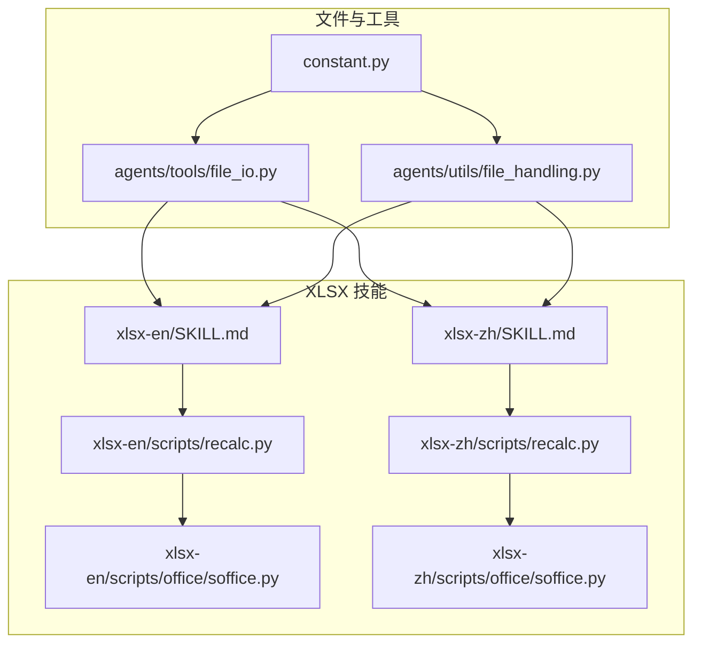
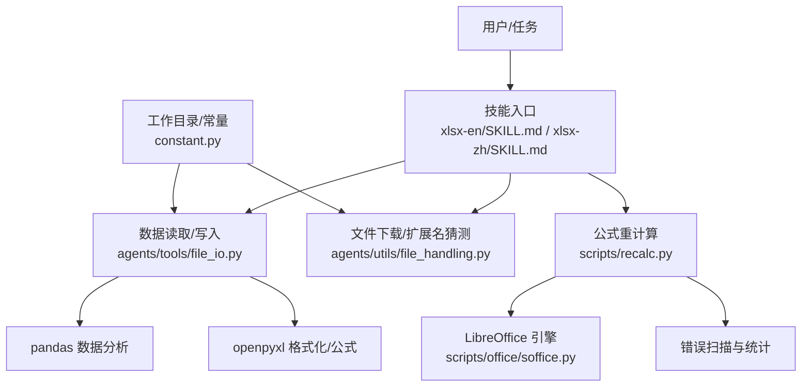
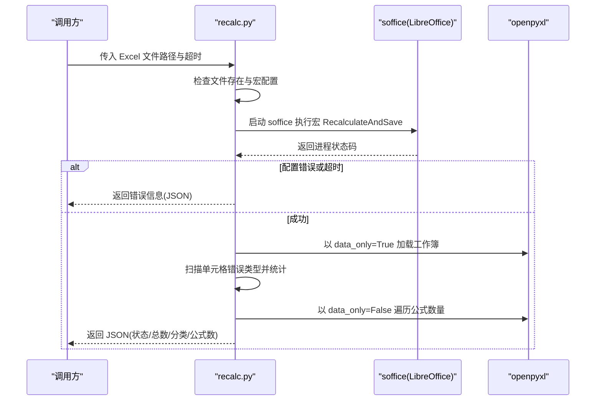
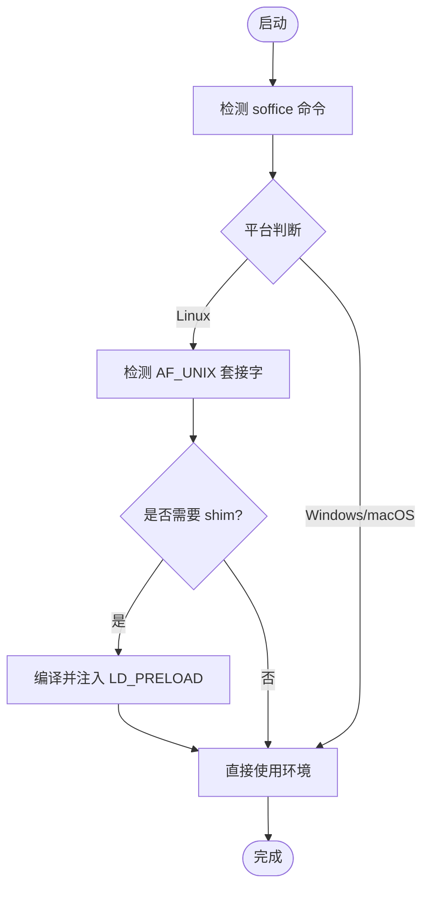
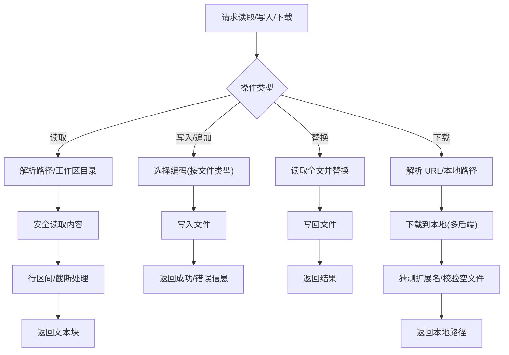
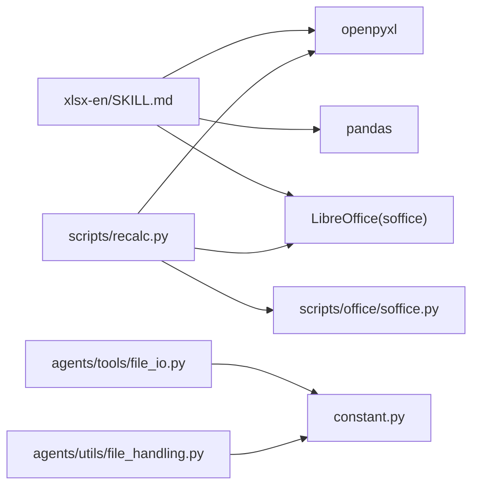

# 电子表格处理技能

<cite>
**本文引用的文件**
- [xlsx-en/SKILL.md](file://src/qwenpaw/agents/skills/xlsx-en/SKILL.md)
- [xlsx-zh/SKILL.md](file://src/qwenpaw/agents/skills/xlsx-zh/SKILL.md)
- [xlsx-en/scripts/recalc.py](file://src/qwenpaw/agents/skills/xlsx-en/scripts/recalc.py)
- [xlsx-zh/scripts/recalc.py](file://src/qwenpaw/agents/skills/xlsx-zh/scripts/recalc.py)
- [xlsx-en/scripts/office/soffice.py](file://src/qwenpaw/agents/skills/xlsx-en/scripts/office/soffice.py)
- [xlsx-zh/scripts/office/soffice.py](file://src/qwenpaw/agents/skills/xlsx-zh/scripts/office/soffice.py)
- [file_io.py](file://src/qwenpaw/agents/tools/file_io.py)
- [file_handling.py](file://src/qwenpaw/agents/utils/file_handling.py)
- [constant.py](file://src/qwenpaw/constant.py)
</cite>

## 目录
1. [简介](#简介)
2. [项目结构](#项目结构)
3. [核心组件](#核心组件)
4. [架构总览](#架构总览)
5. [详细组件分析](#详细组件分析)
6. [依赖关系分析](#依赖关系分析)
7. [性能考虑](#性能考虑)
8. [故障排查指南](#故障排查指南)
9. [结论](#结论)
10. [附录](#附录)

## 简介
本文件面向“QwenPaw”的电子表格处理技能，系统性阐述基于 XLSX 的工作簿解析、工作表操作、公式计算与数据提取能力，结合 Office Open XML 在 XLSX 中的实现要点，覆盖单元格数据类型、行列操作、条件格式处理、表格结构与图表生成、数据透视表技术细节，以及数据导入导出、批量处理与自动化报表生成的实现方案。同时给出公式重计算、宏处理与数据验证的流程说明，并提供数据分析、报表生成与数据转换的应用案例与最佳实践。

## 项目结构
XLSX 技能位于内置技能目录下，包含英文与中文两套技能说明文档，配套公式重计算脚本与 LibreOffice 辅助模块。文件组织如下：
- 技能说明：xlsx-en/SKILL.md、xlsx-zh/SKILL.md
- 公式重计算脚本：xlsx-en/scripts/recalc.py、xlsx-zh/scripts/recalc.py
- LibreOffice 辅助：xlsx-en/scripts/office/soffice.py、xlsx-zh/scripts/office/soffice.py
- 文件读写与下载工具：agents/tools/file_io.py、agents/utils/file_handling.py
- 工作目录与常量：constant.py

**图表来源**
- [xlsx-en/SKILL.md:1-306](file://src/qwenpaw/agents/skills/xlsx-en/SKILL.md#L1-L306)
- [xlsx-zh/SKILL.md:1-307](file://src/qwenpaw/agents/skills/xlsx-zh/SKILL.md#L1-L307)
- [xlsx-en/scripts/recalc.py:1-210](file://src/qwenpaw/agents/skills/xlsx-en/scripts/recalc.py#L1-L210)
- [xlsx-zh/scripts/recalc.py:1-210](file://src/qwenpaw/agents/skills/xlsx-zh/scripts/recalc.py#L1-L210)
- [xlsx-en/scripts/office/soffice.py:1-219](file://src/qwenpaw/agents/skills/xlsx-en/scripts/office/soffice.py#L1-L219)
- [xlsx-zh/scripts/office/soffice.py:1-219](file://src/qwenpaw/agents/skills/xlsx-zh/scripts/office/soffice.py#L1-L219)
- [file_io.py:1-396](file://src/qwenpaw/agents/tools/file_io.py#L1-L396)
- [file_handling.py:1-357](file://src/qwenpaw/agents/utils/file_handling.py#L1-L357)
- [constant.py:1-368](file://src/qwenpaw/constant.py#L1-L368)

**章节来源**
- [xlsx-en/SKILL.md:1-120](file://src/qwenpaw/agents/skills/xlsx-en/SKILL.md#L1-L120)
- [xlsx-zh/SKILL.md:1-120](file://src/qwenpaw/agents/skills/xlsx-zh/SKILL.md#L1-L120)

## 核心组件
- 技能说明文档：定义输出规范、财务建模颜色与格式标准、公式构建规则、前置条件与工作流，强调使用 openpyxl/pandas 的组合策略与 LibreOffice 公式重计算。
- 公式重计算脚本：封装 LibreOffice 宏调用，扫描并统计 Excel 错误类型，返回 JSON 结果，支持超时控制与平台差异处理。
- LibreOffice 辅助模块：检测并适配沙箱环境中 AF_UNIX 套接字受限问题，按需注入 LD_PRELOAD shim，保障 soffice 可用性。
- 文件工具：提供安全读取、写入、追加与替换文本的能力，自动选择编码（CSV/TSV/TXT 使用带 BOM 的 UTF-8），并处理相对路径解析与工作区目录。
- 文件下载工具：支持从 URL 或本地路径下载文件，自动猜测扩展名，处理空文件与下载失败回退。
- 常量与工作目录：统一管理工作区根目录、媒体目录、备份目录等，确保文件 IO 一致性。

**章节来源**
- [xlsx-en/SKILL.md:13-88](file://src/qwenpaw/agents/skills/xlsx-en/SKILL.md#L13-L88)
- [xlsx-zh/SKILL.md:13-88](file://src/qwenpaw/agents/skills/xlsx-zh/SKILL.md#L13-L88)
- [xlsx-en/scripts/recalc.py:1-210](file://src/qwenpaw/agents/skills/xlsx-en/scripts/recalc.py#L1-L210)
- [xlsx-zh/scripts/recalc.py:1-210](file://src/qwenpaw/agents/skills/xlsx-zh/scripts/recalc.py#L1-L210)
- [xlsx-en/scripts/office/soffice.py:1-219](file://src/qwenpaw/agents/skills/xlsx-en/scripts/office/soffice.py#L1-L219)
- [xlsx-zh/scripts/office/soffice.py:1-219](file://src/qwenpaw/agents/skills/xlsx-zh/scripts/office/soffice.py#L1-L219)
- [file_io.py:1-396](file://src/qwenpaw/agents/tools/file_io.py#L1-L396)
- [file_handling.py:1-357](file://src/qwenpaw/agents/utils/file_handling.py#L1-L357)
- [constant.py:89-136](file://src/qwenpaw/constant.py#L89-L136)

## 架构总览
XLSX 技能围绕“数据读取/写入 + 公式重计算 + 格式化/批处理”展开，形成如下闭环：
- 数据层：pandas 用于数据分析与批量导出；openpyxl 用于公式与格式化。
- 计算层：LibreOffice 作为外部引擎执行公式重计算，脚本负责宏部署、调用与错误扫描。
- 工具层：文件 IO 与下载工具保证跨平台兼容与安全访问。
- 配置层：统一工作区目录与常量，确保路径解析与编码策略一致。

**图表来源**
- [xlsx-en/SKILL.md:72-110](file://src/qwenpaw/agents/skills/xlsx-en/SKILL.md#L72-L110)
- [xlsx-zh/SKILL.md:72-110](file://src/qwenpaw/agents/skills/xlsx-zh/SKILL.md#L72-L110)
- [xlsx-en/scripts/recalc.py:80-187](file://src/qwenpaw/agents/skills/xlsx-en/scripts/recalc.py#L80-L187)
- [xlsx-zh/scripts/recalc.py:80-187](file://src/qwenpaw/agents/skills/xlsx-zh/scripts/recalc.py#L80-L187)
- [xlsx-en/scripts/office/soffice.py:26-101](file://src/qwenpaw/agents/skills/xlsx-en/scripts/office/soffice.py#L26-L101)
- [xlsx-zh/scripts/office/soffice.py:26-101](file://src/qwenpaw/agents/skills/xlsx-zh/scripts/office/soffice.py#L26-L101)
- [file_io.py:23-64](file://src/qwenpaw/agents/tools/file_io.py#L23-L64)
- [file_handling.py:105-154](file://src/qwenpaw/agents/utils/file_handling.py#L105-L154)
- [constant.py:89-136](file://src/qwenpaw/constant.py#L89-L136)

## 详细组件分析

### 组件一：公式重计算流程（recalc.py）
职责与流程：
- 校验文件存在性与宏配置状态。
- 构造 LibreOffice 命令（含 headless、norestore、宏脚本参数），按平台注入超时控制。
- 执行重计算并捕获返回码，区分超时与配置错误。
- 以 data_only=True 读取工作簿，扫描单元格值中的 Excel 错误标记，统计总数与分类。
- 统计公式数量（以“=”开头的字符串），汇总到最终 JSON。

**图表来源**
- [xlsx-en/scripts/recalc.py:80-187](file://src/qwenpaw/agents/skills/xlsx-en/scripts/recalc.py#L80-L187)
- [xlsx-zh/scripts/recalc.py:80-187](file://src/qwenpaw/agents/skills/xlsx-zh/scripts/recalc.py#L80-L187)

**章节来源**
- [xlsx-en/scripts/recalc.py:1-210](file://src/qwenpaw/agents/skills/xlsx-en/scripts/recalc.py#L1-L210)
- [xlsx-zh/scripts/recalc.py:1-210](file://src/qwenpaw/agents/skills/xlsx-zh/scripts/recalc.py#L1-L210)

### 组件二：LibreOffice 套接字适配（soffice.py）
职责与流程：
- 检测当前平台的 soffice 命令路径，Windows 下兼容 .com/.exe。
- 在 Linux 平台检测 AF_UNIX 套接字是否可用，若不可用则编译并注入 LD_PRELOAD shim，使 LibreOffice 通过 socketpair 通信。
- 提供 get_soffice_env/get_soffice_cmd/run_soffice 接口，便于外部脚本复用。

**图表来源**
- [xlsx-en/scripts/office/soffice.py:26-101](file://src/qwenpaw/agents/skills/xlsx-en/scripts/office/soffice.py#L26-L101)
- [xlsx-zh/scripts/office/soffice.py:26-101](file://src/qwenpaw/agents/skills/xlsx-zh/scripts/office/soffice.py#L26-L101)

**章节来源**
- [xlsx-en/scripts/office/soffice.py:1-219](file://src/qwenpaw/agents/skills/xlsx-en/scripts/office/soffice.py#L1-L219)
- [xlsx-zh/scripts/office/soffice.py:1-219](file://src/qwenpaw/agents/skills/xlsx-zh/scripts/office/soffice.py#L1-L219)

### 组件三：文件读写与下载工具
职责与流程：
- 文件读取：解析相对路径至工作区目录，支持行区间读取与智能截断，自动选择编码（CSV/TSV/TXT 使用 UTF-8-BOM）。
- 文件写入/追加：根据文件类型选择编码，确保跨平台兼容。
- 文本替换：全量替换旧文本为新文本，失败时返回错误信息。
- 下载工具：支持本地路径、URL 下载，自动猜测扩展名（HEAD 请求或魔数），处理空文件与下载失败回退。

**图表来源**
- [file_io.py:23-254](file://src/qwenpaw/agents/tools/file_io.py#L23-L254)
- [file_handling.py:105-357](file://src/qwenpaw/agents/utils/file_handling.py#L105-L357)
- [constant.py:89-136](file://src/qwenpaw/constant.py#L89-L136)

**章节来源**
- [file_io.py:1-396](file://src/qwenpaw/agents/tools/file_io.py#L1-L396)
- [file_handling.py:1-357](file://src/qwenpaw/agents/utils/file_handling.py#L1-L357)
- [constant.py:89-136](file://src/qwenpaw/constant.py#L89-L136)

### 组件四：技能说明与最佳实践
- 输出规范：统一字体、零公式错误、保留既有模板风格。
- 财务建模：颜色编码标准（假设/链接/外部链接）、数字格式（年份、货币、百分比、倍数、负数）、公式构建规则（假设集中、避免硬编码、防止循环引用）。
- 工作流：pandas 用于数据与批量处理，openpyxl 用于公式与格式；创建/加载/修改/保存后必须进行公式重计算；验证并修复错误。
- 最佳实践：openpyxl 单元格索引 1 基；data_only=True 仅读取计算值；大文件使用 read_only/write_only；pandas 指定 dtype/usecols/parse_dates。

**章节来源**
- [xlsx-en/SKILL.md:13-306](file://src/qwenpaw/agents/skills/xlsx-en/SKILL.md#L13-L306)
- [xlsx-zh/SKILL.md:13-307](file://src/qwenpaw/agents/skills/xlsx-zh/SKILL.md#L13-L307)

## 依赖关系分析
- 技能说明依赖 openpyxl/pandas/LibreOffice，recalc.py 依赖 office.soffice 与 openpyxl。
- 文件工具依赖工作区常量与路径解析，确保跨平台兼容。
- LibreOffice 适配模块在 Linux 平台通过 LD_PRELOAD shim 解决 AF_UNIX 套接字限制问题。

**图表来源**
- [xlsx-en/SKILL.md:78-88](file://src/qwenpaw/agents/skills/xlsx-en/SKILL.md#L78-L88)
- [xlsx-en/scripts/recalc.py:13-15](file://src/qwenpaw/agents/skills/xlsx-en/scripts/recalc.py#L13-L15)
- [xlsx-en/scripts/office/soffice.py:17-23](file://src/qwenpaw/agents/skills/xlsx-en/scripts/office/soffice.py#L17-L23)
- [file_io.py:16-20](file://src/qwenpaw/agents/tools/file_io.py#L16-L20)
- [file_handling.py:25-26](file://src/qwenpaw/agents/utils/file_handling.py#L25-L26)
- [constant.py:89-136](file://src/qwenpaw/constant.py#L89-L136)

**章节来源**
- [xlsx-en/SKILL.md:78-88](file://src/qwenpaw/agents/skills/xlsx-en/SKILL.md#L78-L88)
- [xlsx-en/scripts/recalc.py:13-15](file://src/qwenpaw/agents/skills/xlsx-en/scripts/recalc.py#L13-L15)
- [xlsx-en/scripts/office/soffice.py:17-23](file://src/qwenpaw/agents/skills/xlsx-en/scripts/office/soffice.py#L17-L23)
- [file_io.py:16-20](file://src/qwenpaw/agents/tools/file_io.py#L16-L20)
- [file_handling.py:25-26](file://src/qwenpaw/agents/utils/file_handling.py#L25-L26)
- [constant.py:89-136](file://src/qwenpaw/constant.py#L89-L136)

## 性能考虑
- 大文件处理：优先使用 openpyxl 的 read_only/write_only 模式，减少内存占用；pandas 读取时限定列与日期解析，避免类型推断开销。
- 公式重计算：合理设置超时时间，避免长时间阻塞；仅在必要时进行重计算，批量任务中合并多次重计算。
- 文件 IO：统一编码策略与路径解析，减少重复 I/O 与异常处理成本；下载时优先使用 wget/curl，失败回退 urllib。

[本节为通用指导，无需特定文件引用]

## 故障排查指南
常见问题与定位建议：
- LibreOffice 未配置或宏未就绪：检查 scripts/recalc.py 的宏部署逻辑与返回码；确认 office.soffice 的 soffice 命令与环境变量。
- 公式错误：使用 scripts/recalc.py 的 JSON 输出定位错误类型与位置；优先修复 #REF!/#DIV/0!/#VALUE! 等基础错误。
- 跨平台兼容：Linux 套接字受限时启用 LD_PRELOAD shim；Windows/macOS 直接使用 PATH 命令。
- 文件编码：CSV/TSV/TXT 使用 UTF-8-BOM；pandas 读取时显式指定 dtype/usecols/parse_dates。
- 空文件/下载失败：file_handling 下载工具会抛出明确异常；检查 URL/网络与 HEAD 请求支持。

**章节来源**
- [xlsx-en/scripts/recalc.py:86-124](file://src/qwenpaw/agents/skills/xlsx-en/scripts/recalc.py#L86-L124)
- [xlsx-zh/scripts/recalc.py:86-124](file://src/qwenpaw/agents/skills/xlsx-zh/scripts/recalc.py#L86-L124)
- [xlsx-en/scripts/office/soffice.py:55-101](file://src/qwenpaw/agents/skills/xlsx-en/scripts/office/soffice.py#L55-L101)
- [xlsx-zh/scripts/office/soffice.py:55-101](file://src/qwenpaw/agents/skills/xlsx-zh/scripts/office/soffice.py#L55-L101)
- [file_io.py:42-64](file://src/qwenpaw/agents/tools/file_io.py#L42-L64)
- [file_handling.py:156-194](file://src/qwenpaw/agents/utils/file_handling.py#L156-L194)

## 结论
XLSX 技能通过“pandas + openpyxl + LibreOffice”的组合，实现了从数据解析、公式计算到格式化的全流程电子表格处理能力。配合文件工具与工作区常量，确保跨平台兼容与安全性。遵循技能说明中的颜色与格式标准、公式构建规则与验证清单，可在财务建模与自动化报表场景中获得高质量交付。

[本节为总结，无需特定文件引用]

## 附录
- 应用场景示例（概念性说明，不对应具体代码）：
  - 数据分析与报表生成：使用 pandas 进行清洗与统计，openpyxl 生成模板与图表，LibreOffice 重计算。
  - 数据转换：将 CSV/TSV 导入 Excel，批量调整格式与公式，导出为 XLSX。
  - 条件格式与数据透视：在 openpyxl 中设置条件格式规则，结合 LibreOffice 渲染；或通过 pandas 生成透视表后写入工作表。
  - 宏与数据验证：通过 LibreOffice 宏扩展与数据验证规则，确保输入质量与一致性。

[本节为概念性内容，无需特定文件引用]