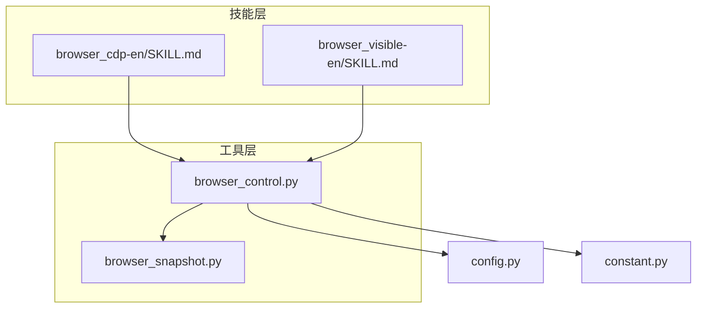
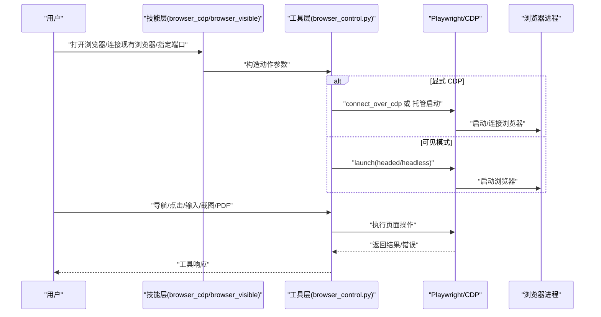
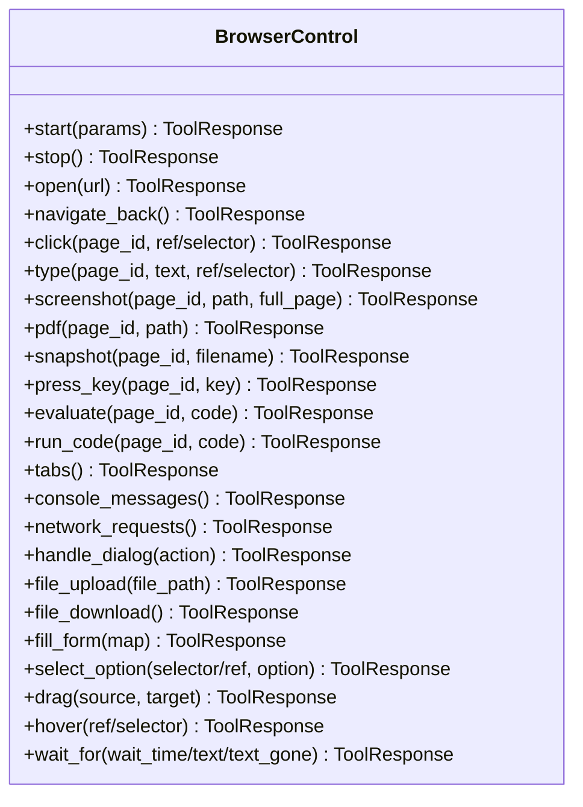
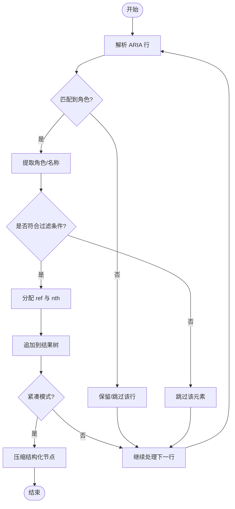
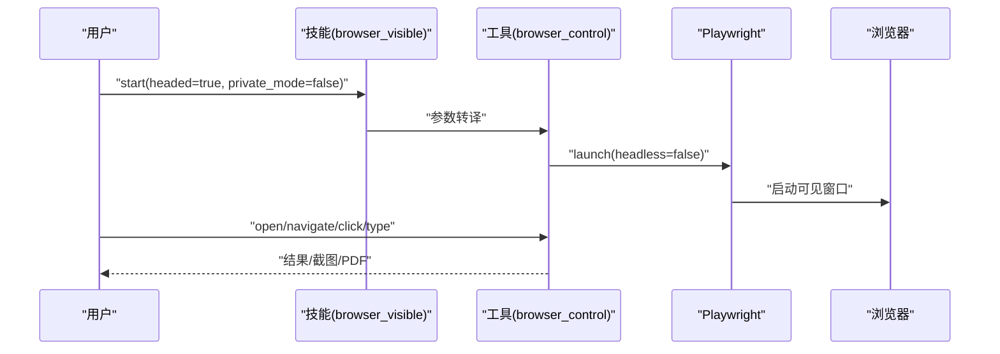
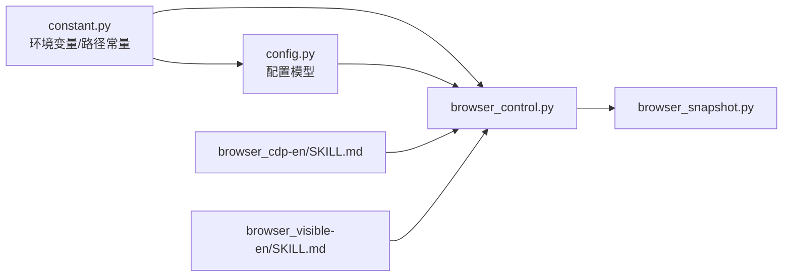

# 浏览器操作技能

<cite>
**本文引用的文件**
- [browser_control.py](file://src/qwenpaw/agents/tools/browser_control.py)
- [browser_snapshot.py](file://src/qwenpaw/agents/tools/browser_snapshot.py)
- [browser_cdp-en/SKILL.md](file://src/qwenpaw/agents/skills/browser_cdp-en/SKILL.md)
- [browser_visible-en/SKILL.md](file://src/qwenpaw/agents/skills/browser_visible-en/SKILL.md)
- [config.py](file://src/qwenpaw/config/config.py)
- [constant.py](file://src/qwenpaw/constant.py)
</cite>

## 目录
1. [简介](#简介)
2. [项目结构](#项目结构)
3. [核心组件](#核心组件)
4. [架构总览](#架构总览)
5. [详细组件分析](#详细组件分析)
6. [依赖关系分析](#依赖关系分析)
7. [性能考量](#性能考量)
8. [故障排查指南](#故障排查指南)
9. [结论](#结论)
10. [附录](#附录)

## 简介
本文件系统化阐述 QwenPaw 的浏览器操作技能，覆盖两类模式：CDP（Chrome DevTools Protocol）与可见浏览器（headless/headed）。内容包括：
- 模式对比与适用场景
- 自动化能力清单（导航、元素交互、截图、PDF、下载、对话框处理等）
- 配置项、权限与安全注意事项
- 实战场景与示例路径指引

## 项目结构
浏览器技能由工具层与技能层协同实现：
- 工具层：基于 Playwright 的统一浏览器控制工具，支持同步/异步模式、CDP 连接、下载行为配置、空闲回收等
- 技能层：面向用户的两套技能文档，分别聚焦“显式 CDP 使用”和“可见浏览器启动模式”

图表来源
- [browser_control.py:1-120](file://src/qwenpaw/agents/tools/browser_control.py#L1-L120)
- [browser_snapshot.py:1-60](file://src/qwenpaw/agents/tools/browser_snapshot.py#L1-L60)
- [browser_cdp-en/SKILL.md:1-35](file://src/qwenpaw/agents/skills/browser_cdp-en/SKILL.md#L1-L35)
- [browser_visible-en/SKILL.md:1-25](file://src/qwenpaw/agents/skills/browser_visible-en/SKILL.md#L1-L25)
- [config.py:1-120](file://src/qwenpaw/config/config.py#L1-L120)
- [constant.py:210-230](file://src/qwenpaw/constant.py#L210-L230)

章节来源
- [browser_control.py:1-120](file://src/qwenpaw/agents/tools/browser_control.py#L1-L120)
- [browser_snapshot.py:1-60](file://src/qwenpaw/agents/tools/browser_snapshot.py#L1-L60)
- [browser_cdp-en/SKILL.md:1-35](file://src/qwenpaw/agents/skills/browser_cdp-en/SKILL.md#L1-L35)
- [browser_visible-en/SKILL.md:1-25](file://src/qwenpaw/agents/skills/browser_visible-en/SKILL.md#L1-L25)
- [config.py:1-120](file://src/qwenpaw/config/config.py#L1-L120)
- [constant.py:210-230](file://src/qwenpaw/constant.py#L210-L230)

## 核心组件
- 统一浏览器控制工具
  - 支持同步/异步 Playwright 模式，自动选择策略以适配平台与开发模式
  - 提供 CDP 管理：托管启动、外部连接、端口扫描、空闲回收
  - 页面上下文管理：多页签、监听控制台/网络/对话框/文件选择器
  - 输出路径解析、下载行为配置、可移植的用户数据目录
- 角色快照与引用构建
  - 基于 ARIA 快照生成可交互角色树与引用映射，支持去重与 nth 优化
- 技能文档
  - browser_cdp：强调显式 CDP 场景（端口扫描、连接现有浏览器、固定端口、共享实例）
  - browser_visible：强调窗口可见性与私有模式（Playwright 管理 vs CDP）

章节来源
- [browser_control.py:190-320](file://src/qwenpaw/agents/tools/browser_control.py#L190-L320)
- [browser_snapshot.py:180-249](file://src/qwenpaw/agents/tools/browser_snapshot.py#L180-L249)
- [browser_cdp-en/SKILL.md:13-35](file://src/qwenpaw/agents/skills/browser_cdp-en/SKILL.md#L13-L35)
- [browser_visible-en/SKILL.md:11-25](file://src/qwenpaw/agents/skills/browser_visible-en/SKILL.md#L11-L25)

## 架构总览
浏览器控制采用“工具层 + 技能层”的分层设计：
- 技能层负责意图识别与参数决策（是否显式 CDP、是否可见窗口、是否私有模式）
- 工具层负责具体执行（启动/停止、页面操作、截图/PDF、下载、等待、键盘事件等）

图表来源
- [browser_control.py:549-625](file://src/qwenpaw/agents/tools/browser_control.py#L549-L625)
- [browser_control.py:1160-1192](file://src/qwenpaw/agents/tools/browser_control.py#L1160-L1192)
- [browser_cdp-en/SKILL.md:107-131](file://src/qwenpaw/agents/skills/browser_cdp-en/SKILL.md#L107-L131)
- [browser_visible-en/SKILL.md:13-23](file://src/qwenpaw/agents/skills/browser_visible-en/SKILL.md#L13-L23)

## 详细组件分析

### 组件A：浏览器控制工具（browser_control.py）
- 关键职责
  - 生命周期管理：start/stop、空闲 watchdog、进程清理
  - CDP 管理：托管启动、外部连接、端口扫描、下载行为配置
  - 页面操作：导航、前进后退、点击、输入、悬停、拖拽、键盘、等待、滚动、PDF、截图
  - 监听与状态：控制台日志、网络请求、对话框、文件选择器
  - 路径与输出：工作区隔离、输出目录解析、下载路径配置
- 设计要点
  - 模式自适应：Windows + 开发热重载时使用同步 Playwright；其他平台优先异步
  - 安全与合规：可插拔可信任浏览器二进制校验、下载大小限制、容器/平台参数注入
  - 稳健性：异常捕获、资源释放、进程终止、超时等待

图表来源
- [browser_control.py:1680-1750](file://src/qwenpaw/agents/tools/browser_control.py#L1680-L1750)
- [browser_control.py:3660-3760](file://src/qwenpaw/agents/tools/browser_control.py#L3660-L3760)

章节来源
- [browser_control.py:190-320](file://src/qwenpaw/agents/tools/browser_control.py#L190-L320)
- [browser_control.py:549-625](file://src/qwenpaw/agents/tools/browser_control.py#L549-L625)
- [browser_control.py:1160-1192](file://src/qwenpaw/agents/tools/browser_control.py#L1160-L1192)
- [browser_control.py:1680-1750](file://src/qwenpaw/agents/tools/browser_control.py#L1680-L1750)
- [browser_control.py:3660-3760](file://src/qwenpaw/agents/tools/browser_control.py#L3660-L3760)

### 组件B：角色快照与引用（browser_snapshot.py）
- 功能概述
  - 将 Playwright 的 aria_snapshot 结果转换为带引用的角色树
  - 仅保留可交互元素与必要内容节点，支持紧凑模式与最大深度过滤
  - 自动生成 ref 与 nth，避免重复引用时的冗余 nth
- 复杂度与性能
  - 时间复杂度近似 O(N)，N 为行数；空间开销与输出树规模线性相关
  - 通过紧凑模式减少结构化节点输出，降低后续解析成本

图表来源
- [browser_snapshot.py:135-249](file://src/qwenpaw/agents/tools/browser_snapshot.py#L135-L249)

章节来源
- [browser_snapshot.py:1-60](file://src/qwenpaw/agents/tools/browser_snapshot.py#L1-L60)
- [browser_snapshot.py:180-249](file://src/qwenpaw/agents/tools/browser_snapshot.py#L180-L249)

### 组件C：技能层（browser_cdp 与 browser_visible）
- browser_cdp
  - 适用场景：显式 CDP 端口扫描、连接现有浏览器、固定调试端口、共享浏览器实例
  - 关键约束：每个工作区仅允许一个浏览器实例；显式端口需保证未被占用
  - 停止行为：托管启动的浏览器会终止进程；外部连接仅断开不关闭外部浏览器
- browser_visible
  - 适用场景：需要可见窗口或私有模式（Playwright 管理）
  - 参数独立：headed 与 private_mode 可自由组合
  - 平台限制：可见模式需要图形环境，服务器/无头环境可能不可用

图表来源
- [browser_visible-en/SKILL.md:27-45](file://src/qwenpaw/agents/skills/browser_visible-en/SKILL.md#L27-L45)
- [browser_control.py:1160-1192](file://src/qwenpaw/agents/tools/browser_control.py#L1160-L1192)

章节来源
- [browser_cdp-en/SKILL.md:37-53](file://src/qwenpaw/agents/skills/browser_cdp-en/SKILL.md#L37-L53)
- [browser_cdp-en/SKILL.md:148-183](file://src/qwenpaw/agents/skills/browser_cdp-en/SKILL.md#L148-L183)
- [browser_visible-en/SKILL.md:27-45](file://src/qwenpaw/agents/skills/browser_visible-en/SKILL.md#L27-L45)
- [browser_visible-en/SKILL.md:57-66](file://src/qwenpaw/agents/skills/browser_visible-en/SKILL.md#L57-L66)

## 依赖关系分析
- 工具层依赖
  - Playwright 异步/同步 API 导入与安装提示
  - 系统默认浏览器探测与可信任二进制校验
  - 工作区目录与输出路径解析
  - 容器/平台参数注入（沙箱、共享内存、GPU 禁用等）
- 技能层依赖
  - 对工具层能力的封装与参数决策
  - 对用户意图的识别与风险提示（敏感数据暴露）

图表来源
- [constant.py:210-230](file://src/qwenpaw/constant.py#L210-L230)
- [config.py:1-120](file://src/qwenpaw/config/config.py#L1-L120)
- [browser_control.py:357-412](file://src/qwenpaw/agents/tools/browser_control.py#L357-L412)
- [browser_snapshot.py:1-60](file://src/qwenpaw/agents/tools/browser_snapshot.py#L1-L60)
- [browser_cdp-en/SKILL.md:13-35](file://src/qwenpaw/agents/skills/browser_cdp-en/SKILL.md#L13-L35)
- [browser_visible-en/SKILL.md:11-25](file://src/qwenpaw/agents/skills/browser_visible-en/SKILL.md#L11-L25)

章节来源
- [constant.py:210-230](file://src/qwenpaw/constant.py#L210-L230)
- [config.py:1-120](file://src/qwenpaw/config/config.py#L1-L120)
- [browser_control.py:357-412](file://src/qwenpaw/agents/tools/browser_control.py#L357-L412)
- [browser_snapshot.py:1-60](file://src/qwenpaw/agents/tools/browser_snapshot.py#L1-L60)
- [browser_cdp-en/SKILL.md:13-35](file://src/qwenpaw/agents/skills/browser_cdp-en/SKILL.md#L13-L35)
- [browser_visible-en/SKILL.md:11-25](file://src/qwenpaw/agents/skills/browser_visible-en/SKILL.md#L11-L25)

## 性能考量
- 模式选择
  - 异步 Playwright 在多数平台具备更好并发与资源利用效率；Windows + 热重载时回退同步以规避平台限制
- 空闲回收
  - 默认空闲超时约 10 分钟，后台任务定期检查并停止闲置浏览器，释放渲染进程
- 下载与输出
  - 下载行为通过 CDP 配置集中管理；输出路径统一解析到工作区目录，避免跨工作区冲突
- 网络与监听
  - 控制台日志、网络请求、对话框与文件选择器监听按页面聚合，避免全局扫描带来的开销

章节来源
- [browser_control.py:157-189](file://src/qwenpaw/agents/tools/browser_control.py#L157-L189)
- [browser_control.py:247-320](file://src/qwenpaw/agents/tools/browser_control.py#L247-L320)
- [browser_control.py:124-155](file://src/qwenpaw/agents/tools/browser_control.py#L124-L155)
- [browser_control.py:115-122](file://src/qwenpaw/agents/tools/browser_control.py#L115-L122)

## 故障排查指南
- 启动失败
  - 缺少 Playwright：根据导入异常提示安装并初始化驱动
  - 可信二进制校验失败：确保 executable_path 包含受信关键字且文件存在
  - 端口占用：显式指定端口时若被占用会立即报错；请更换端口或停止旧进程
- CDP 连接问题
  - 端口未就绪：等待端口可达后再连接；超时会抛出明确错误
  - 外部连接：stop 仅断开连接，不关闭外部浏览器进程
- 可见模式限制
  - 无图形环境：可见模式无法在服务器/无头环境运行
  - 切换模式：已运行的浏览器需先 stop 再以新参数重新 start
- 下载与输出
  - 直链下载大小限制：超过阈值的直链下载会被拒绝，建议改用下载完成回调或本地文件
  - 输出路径：相对路径解析到工作区下的 browser 目录，注意权限与磁盘空间

章节来源
- [browser_control.py:384-412](file://src/qwenpaw/agents/tools/browser_control.py#L384-L412)
- [browser_control.py:66-81](file://src/qwenpaw/agents/tools/browser_control.py#L66-L81)
- [browser_control.py:1020-1036](file://src/qwenpaw/agents/tools/browser_control.py#L1020-L1036)
- [browser_control.py:530-547](file://src/qwenpaw/agents/tools/browser_control.py#L530-L547)
- [browser_control.py:124-155](file://src/qwenpaw/agents/tools/browser_control.py#L124-L155)
- [browser_visible-en/SKILL.md:57-66](file://src/qwenpaw/agents/skills/browser_visible-en/SKILL.md#L57-L66)

## 结论
- CDP 模式适合需要显式控制、共享浏览器或连接既有会话的场景，强调端口管理与安全边界
- 可见模式适合需要人工观察或私有模式（Playwright 管理）的场景，强调窗口可见性与启动参数
- 工具层提供统一的页面操作与状态管理，结合技能层的意图识别，形成从“用户意图”到“浏览器动作”的完整闭环

## 附录

### 实际使用场景与示例路径
- 场景1：连接现有 Chrome（外部 CDP）
  - 示例路径：[browser_cdp-en/SKILL.md:85-104](file://src/qwenpaw/agents/skills/browser_cdp-en/SKILL.md#L85-L104)
- 场景2：扫描本地 CDP 端口
  - 示例路径：[browser_cdp-en/SKILL.md:57-82](file://src/qwenpaw/agents/skills/browser_cdp-en/SKILL.md#L57-L82)
- 场景3：固定调试端口启动浏览器
  - 示例路径：[browser_cdp-en/SKILL.md:107-131](file://src/qwenpaw/agents/skills/browser_cdp-en/SKILL.md#L107-L131)
- 场景4：可见窗口 + 私有模式
  - 示例路径：[browser_visible-en/SKILL.md:27-45](file://src/qwenpaw/agents/skills/browser_visible-en/SKILL.md#L27-L45)

### 配置选项与环境变量
- Playwright 可执行路径
  - 环境变量：PLAYWRIGHT_CHROMIUM_EXECUTABLE_PATH
  - 作用：容器内指定 Chromium 路径
  - 参考：[constant.py:211-213](file://src/qwenpaw/constant.py#L211-L213)
- 默认使用系统浏览器
  - 环境变量：QWENPAW_BROWSER_USE_DEFAULT
  - 作用：优先使用系统默认浏览器（如可用）
  - 参考：[browser_control.py:433-436](file://src/qwenpaw/agents/tools/browser_control.py#L433-L436)
- 开发热重载模式
  - 环境变量：QWENPAW_RELOAD_MODE
  - 作用：Windows 下强制同步 Playwright 以兼容热重载
  - 参考：[browser_control.py:160-162](file://src/qwenpaw/agents/tools/browser_control.py#L160-L162)
- 工作区目录
  - 环境变量：QWENPAW_WORKING_DIR
  - 作用：浏览器输出、用户数据等路径的基础
  - 参考：[constant.py:93-101](file://src/qwenpaw/constant.py#L93-L101)

### 权限与安全
- 可信二进制校验：仅接受包含受信关键字的浏览器二进制，防止误用非目标浏览器
  - 参考：[browser_control.py:66-81](file://src/qwenpaw/agents/tools/browser_control.py#L66-L81)
- 下载安全：直链下载大小限制，避免大文件误触发
  - 参考：[browser_control.py:44-45](file://src/qwenpaw/agents/tools/browser_control.py#L44-L45)
- CDP 风险提示：显式 CDP 使用前应告知敏感数据暴露风险
  - 参考：[browser_cdp-en/SKILL.md:27-29](file://src/qwenpaw/agents/skills/browser_cdp-en/SKILL.md#L27-L29)