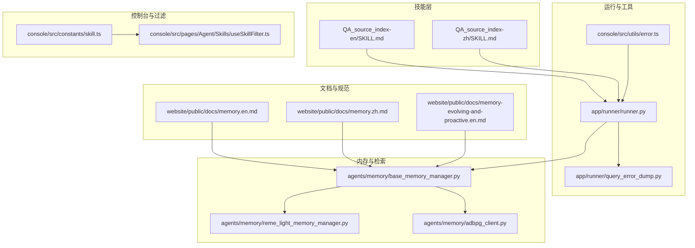
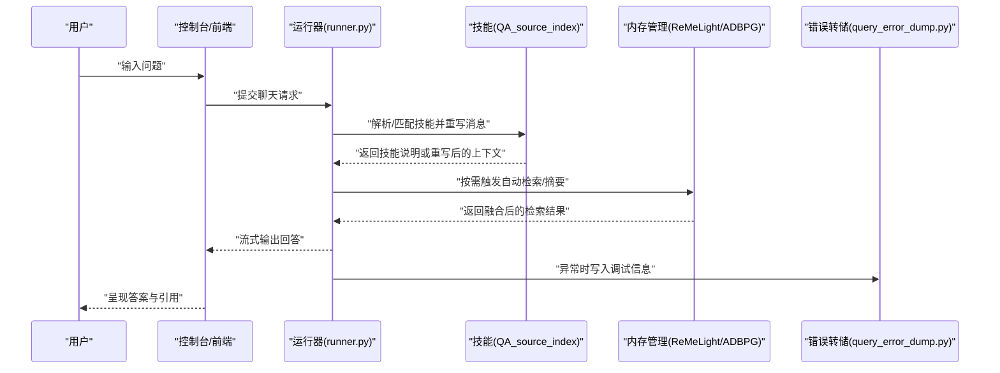
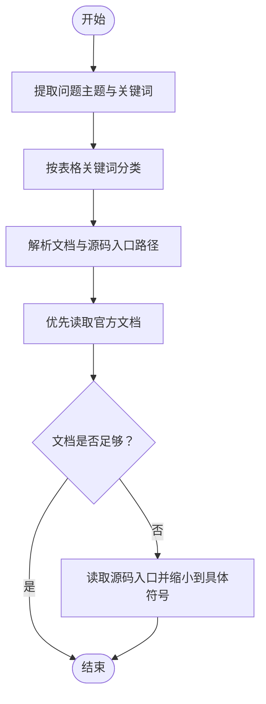
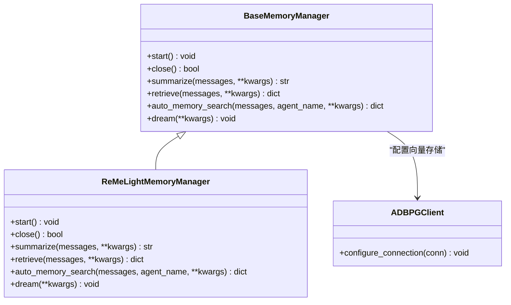
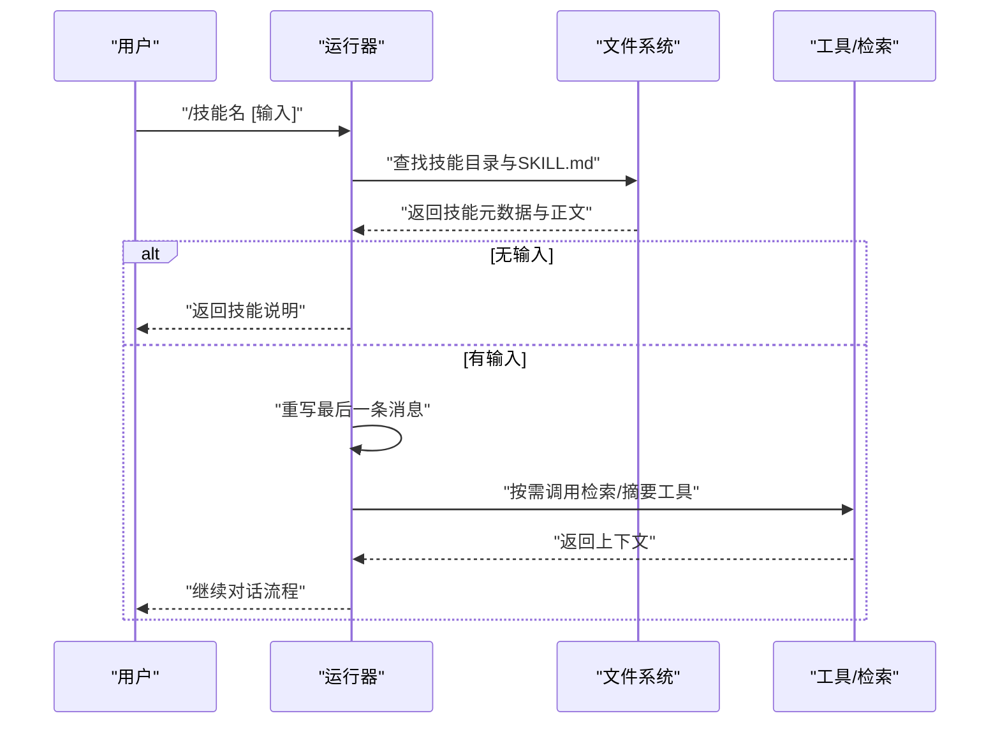
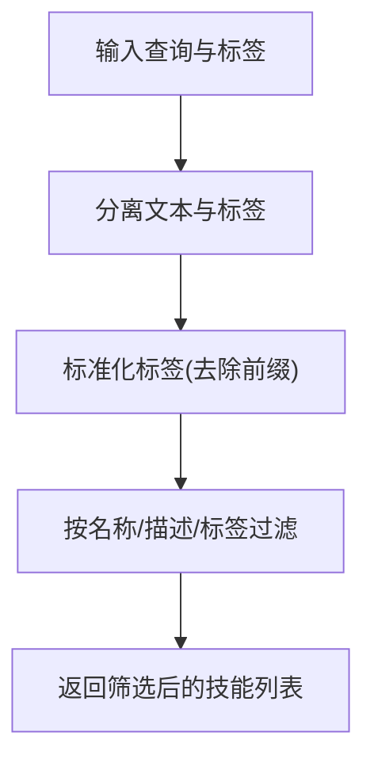
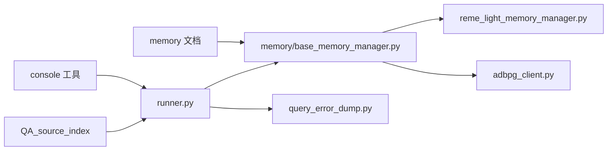
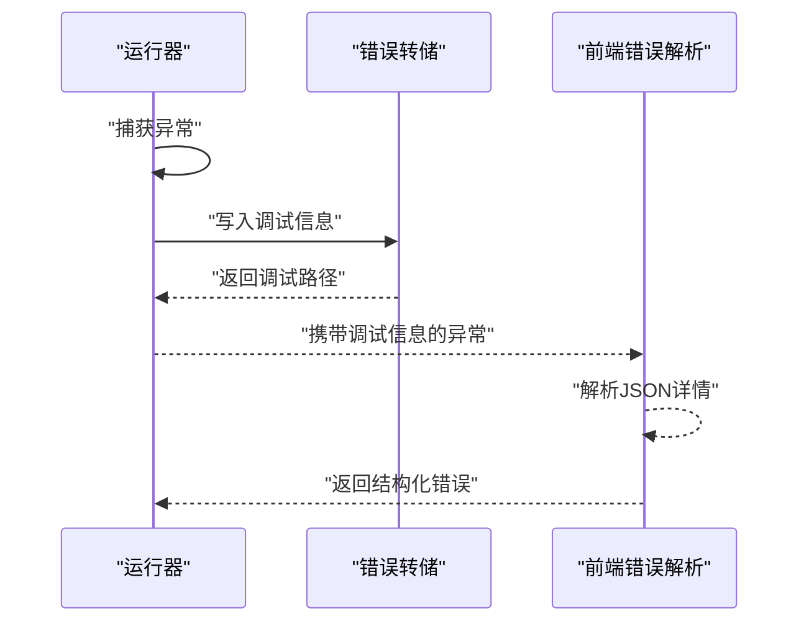

# 知识问答技能

<cite>
**本文引用的文件**
- [src/qwenpaw/agents/skills/QA_source_index-en/SKILL.md](file://src/qwenpaw/agents/skills/QA_source_index-en/SKILL.md)
- [src/qwenpaw/agents/skills/QA_source_index-zh/SKILL.md](file://src/qwenpaw/agents/skills/QA_source_index-zh/SKILL.md)
- [src/qwenpaw/agents/memory/base_memory_manager.py](file://src/qwenpaw/agents/memory/base_memory_manager.py)
- [src/qwenpaw/agents/memory/reme_light_memory_manager.py](file://src/qwenpaw/agents/memory/reme_light_memory_manager.py)
- [src/qwenpaw/agents/memory/adbpg_client.py](file://src/qwenpaw/agents/memory/adbpg_client.py)
- [src/qwenpaw/app/runner/runner.py](file://src/qwenpaw/app/runner/runner.py)
- [src/qwenpaw/cli/doctor_checks.py](file://src/qwenpaw/cli/doctor_checks.py)
- [console/src/constants/skill.ts](file://console/src/constants/skill.ts)
- [console/src/pages/Agent/Skills/useSkillFilter.ts](file://console/src/pages/Agent/Skills/useSkillFilter.ts)
- [console/src/utils/error.ts](file://console/src/utils/error.ts)
- [website/public/docs/memory.en.md](file://website/public/docs/memory.en.md)
- [website/public/docs/memory.zh.md](file://website/public/docs/memory.zh.md)
- [website/public/docs/memory-evolving-and-proactive.en.md](file://website/public/docs/memory-evolving-and-proactive.en.md)
- [website/public/docs/api-tutorial.en.md](file://website/public/docs/api-tutorial.en.md)
- [src/qwenpaw/app/runner/query_error_dump.py](file://src/qwenpaw/app/runner/query_error_dump.py)
</cite>

## 目录
1. [简介](#简介)
2. [项目结构](#项目结构)
3. [核心组件](#核心组件)
4. [架构总览](#架构总览)
5. [组件详解](#组件详解)
6. [依赖关系分析](#依赖关系分析)
7. [性能考量](#性能考量)
8. [故障排查指南](#故障排查指南)
9. [结论](#结论)
10. [附录](#附录)

## 简介
本文件面向QwenPaw的知识问答技能，系统化阐述问答系统的构建与查询能力，重点覆盖以下方面：
- 知识索引的建立、维护与优化机制
- 语义搜索、相似度计算与答案排序的实现思路
- 多源知识融合、事实核查与引用标注的技术要点
- 问答质量评估、置信度计算与错误处理策略
- 在智能客服、文档检索与学习辅助等场景的应用与性能优化

## 项目结构
围绕“知识问答技能”的关键代码与文档分布如下：
- 技能定义与调用：位于 agents/skills 下的 QA_source_index-en 与 QA_source_index-zh，描述如何将用户问题映射到官方文档与源码入口，辅助内置QA Agent快速定位资料。
- 内存与检索：agents/memory 提供内存管理抽象与多种实现（如 ReMeLight），支撑语义检索、混合检索与文件级知识维护。
- 运行器与错误处理：app/runner 提供消息处理、技能调用与错误转储，保障问答流程稳定与可观测性。
- 控制台与过滤：console 提供技能过滤、URL前缀支持与错误解析工具，提升技能发现与排障效率。
- 文档与规范：website/public/docs 提供内存检索、混合融合、进化与主动记忆等技术文档。

**图示来源**
- [src/qwenpaw/agents/skills/QA_source_index-en/SKILL.md:1-52](file://src/qwenpaw/agents/skills/QA_source_index-en/SKILL.md#L1-L52)
- [src/qwenpaw/agents/skills/QA_source_index-zh/SKILL.md:1-52](file://src/qwenpaw/agents/skills/QA_source_index-zh/SKILL.md#L1-L52)
- [src/qwenpaw/app/runner/runner.py:215-277](file://src/qwenpaw/app/runner/runner.py#L215-L277)
- [src/qwenpaw/agents/memory/base_memory_manager.py:1-330](file://src/qwenpaw/agents/memory/base_memory_manager.py#L1-L330)
- [src/qwenpaw/agents/memory/reme_light_memory_manager.py:49-95](file://src/qwenpaw/agents/memory/reme_light_memory_manager.py#L49-L95)
- [src/qwenpaw/agents/memory/adbpg_client.py:374-419](file://src/qwenpaw/agents/memory/adbpg_client.py#L374-L419)
- [console/src/constants/skill.ts:1-20](file://console/src/constants/skill.ts#L1-L20)
- [console/src/pages/Agent/Skills/useSkillFilter.ts:1-49](file://console/src/pages/Agent/Skills/useSkillFilter.ts#L1-L49)
- [website/public/docs/memory.en.md:26-37](file://website/public/docs/memory.en.md#L26-L37)
- [website/public/docs/memory.zh.md:122-145](file://website/public/docs/memory.zh.md#L122-L145)
- [website/public/docs/memory-evolving-and-proactive.en.md:218-228](file://website/public/docs/memory-evolving-and-proactive.en.md#L218-L228)

**章节来源**
- [src/qwenpaw/agents/skills/QA_source_index-en/SKILL.md:1-52](file://src/qwenpaw/agents/skills/QA_source_index-en/SKILL.md#L1-L52)
- [src/qwenpaw/agents/skills/QA_source_index-zh/SKILL.md:1-52](file://src/qwenpaw/agents/skills/QA_source_index-zh/SKILL.md#L1-L52)
- [website/public/docs/memory.en.md:26-37](file://website/public/docs/memory.en.md#L26-L37)

## 核心组件
- 知识索引技能（QA_source_index）
  - 将用户问题的主题与关键词映射到官方文档路径与源码入口，指导QA Agent优先读取高命中路径，减少盲目搜索。
  - 支持中英文版本，提供主题分类、约定与注意事项，强调“先读文档、再读源码”的顺序。
- 内存与检索（Memory Manager）
  - 抽象基类定义生命周期与接口，包括启动、关闭、摘要、检索、自动检索与自动记忆等。
  - ReMeLight 实现提供轻量级检索与后台优化；ADBPG 客户端负责向量嵌入与向量存储配置。
  - 文档说明了向量语义检索、BM25全文检索与混合融合的评分与权重策略。
- 运行器与错误处理
  - 技能调用解析与重写消息，支持“/技能名”触发与信息查询。
  - 错误转储与调试路径生成，便于定位异常。
- 控制台与过滤
  - 技能URL前缀白名单与标签过滤钩子，提升技能发现与筛选效率。
  - 错误解析工具支持从错误消息中提取结构化详情。

**章节来源**
- [src/qwenpaw/agents/skills/QA_source_index-en/SKILL.md:1-52](file://src/qwenpaw/agents/skills/QA_source_index-en/SKILL.md#L1-L52)
- [src/qwenpaw/agents/skills/QA_source_index-zh/SKILL.md:1-52](file://src/qwenpaw/agents/skills/QA_source_index-zh/SKILL.md#L1-L52)
- [src/qwenpaw/agents/memory/base_memory_manager.py:18-181](file://src/qwenpaw/agents/memory/base_memory_manager.py#L18-L181)
- [src/qwenpaw/agents/memory/reme_light_memory_manager.py:49-95](file://src/qwenpaw/agents/memory/reme_light_memory_manager.py#L49-L95)
- [src/qwenpaw/agents/memory/adbpg_client.py:374-419](file://src/qwenpaw/agents/memory/adbpg_client.py#L374-L419)
- [website/public/docs/memory.en.md:100-159](file://website/public/docs/memory.en.md#L100-L159)
- [website/public/docs/memory.zh.md:122-145](file://website/public/docs/memory.zh.md#L122-L145)
- [src/qwenpaw/app/runner/runner.py:215-277](file://src/qwenpaw/app/runner/runner.py#L215-L277)
- [console/src/constants/skill.ts:1-20](file://console/src/constants/skill.ts#L1-L20)
- [console/src/pages/Agent/Skills/useSkillFilter.ts:1-49](file://console/src/pages/Agent/Skills/useSkillFilter.ts#L1-L49)
- [console/src/utils/error.ts:1-24](file://console/src/utils/error.ts#L1-L24)

## 架构总览
问答系统由“技能层-运行器-内存检索-控制台”四层协同构成，形成“问题解析→知识定位→检索融合→答案生成→输出与追踪”的闭环。

**图示来源**
- [src/qwenpaw/app/runner/runner.py:215-277](file://src/qwenpaw/app/runner/runner.py#L215-L277)
- [src/qwenpaw/agents/skills/QA_source_index-en/SKILL.md:1-52](file://src/qwenpaw/agents/skills/QA_source_index-en/SKILL.md#L1-L52)
- [src/qwenpaw/agents/memory/base_memory_manager.py:95-149](file://src/qwenpaw/agents/memory/base_memory_manager.py#L95-L149)
- [src/qwenpaw/app/runner/query_error_dump.py](file://src/qwenpaw/app/runner/query_error_dump.py)

## 组件详解

### 知识索引技能（QA_source_index）
- 功能定位
  - 将用户问题的主题与关键词映射到官方文档与源码入口，帮助QA Agent优先打开最可能包含答案的路径。
  - 提供中英文两套说明，强调“先读文档、再读源码”的顺序与约定。
- 使用流程
  - 提取主题→按关键词分类→打开1–2个首选路径→必要时进一步缩小到具体符号。
- 输出形态
  - 技能说明消息（不含答案内容），引导后续工具读取与验证。

**图示来源**
- [src/qwenpaw/agents/skills/QA_source_index-en/SKILL.md:13-21](file://src/qwenpaw/agents/skills/QA_source_index-en/SKILL.md#L13-L21)
- [src/qwenpaw/agents/skills/QA_source_index-zh/SKILL.md:13-21](file://src/qwenpaw/agents/skills/QA_source_index-zh/SKILL.md#L13-L21)

**章节来源**
- [src/qwenpaw/agents/skills/QA_source_index-en/SKILL.md:1-52](file://src/qwenpaw/agents/skills/QA_source_index-en/SKILL.md#L1-L52)
- [src/qwenpaw/agents/skills/QA_source_index-zh/SKILL.md:1-52](file://src/qwenpaw/agents/skills/QA_source_index-zh/SKILL.md#L1-L52)

### 内存与检索（Memory Manager）
- 生命周期与职责
  - start/close：初始化与资源释放
  - summarize/auto_memory/dream：摘要、周期性记忆抽取与后台优化
  - memory_search/auto_memory_search/retrieve：检索与自动检索
- 检索策略（基于文档说明）
  - 向量语义检索：通过余弦相似度衡量语义距离
  - BM25全文检索：基于词频统计，适合精确关键词命中
  - 混合检索融合：独立打分后加权合并，向量权重默认0.7，BM25权重默认0.3
- 后端选择与配置
  - 自动检测：Windows优先local，其他平台优先chroma，失败回退local
  - 环境变量控制：FTS开关、存储后端、超时、连接池等

**图示来源**
- [src/qwenpaw/agents/memory/base_memory_manager.py:18-181](file://src/qwenpaw/agents/memory/base_memory_manager.py#L18-L181)
- [src/qwenpaw/agents/memory/reme_light_memory_manager.py:77-95](file://src/qwenpaw/agents/memory/reme_light_memory_manager.py#L77-L95)
- [src/qwenpaw/agents/memory/adbpg_client.py:374-419](file://src/qwenpaw/agents/memory/adbpg_client.py#L374-L419)

**章节来源**
- [src/qwenpaw/agents/memory/base_memory_manager.py:18-181](file://src/qwenpaw/agents/memory/base_memory_manager.py#L18-L181)
- [src/qwenpaw/agents/memory/reme_light_memory_manager.py:49-95](file://src/qwenpaw/agents/memory/reme_light_memory_manager.py#L49-L95)
- [src/qwenpaw/agents/memory/adbpg_client.py:374-419](file://src/qwenpaw/agents/memory/adbpg_client.py#L374-L419)
- [website/public/docs/memory.en.md:100-159](file://website/public/docs/memory.en.md#L100-L159)
- [website/public/docs/memory.zh.md:122-145](file://website/public/docs/memory.zh.md#L122-L145)

### 运行器与技能调用
- 技能调用解析
  - 识别“/技能名”形式的指令，加载技能目录下的SKILL.md，支持仅输入“/技能名”查看技能信息，或带输入重写消息。
- 错误处理与调试
  - 捕获异常并写入查询错误转储，附加调试路径提示，便于定位问题。

**图示来源**
- [src/qwenpaw/app/runner/runner.py:215-277](file://src/qwenpaw/app/runner/runner.py#L215-L277)
- [src/qwenpaw/app/runner/query_error_dump.py](file://src/qwenpaw/app/runner/query_error_dump.py)

**章节来源**
- [src/qwenpaw/app/runner/runner.py:215-277](file://src/qwenpaw/app/runner/runner.py#L215-L277)

### 控制台与技能过滤
- 技能URL前缀白名单：支持从外部技能市场导入技能，统一前缀校验。
- 标签过滤钩子：支持“tag:”前缀筛选，按名称/描述/标签组合过滤技能列表。
- 错误解析工具：从错误消息中解析JSON详情，辅助诊断。

**图示来源**
- [console/src/constants/skill.ts:1-20](file://console/src/constants/skill.ts#L1-L20)
- [console/src/pages/Agent/Skills/useSkillFilter.ts:10-49](file://console/src/pages/Agent/Skills/useSkillFilter.ts#L10-L49)
- [console/src/utils/error.ts:1-24](file://console/src/utils/error.ts#L1-L24)

**章节来源**
- [console/src/constants/skill.ts:1-20](file://console/src/constants/skill.ts#L1-L20)
- [console/src/pages/Agent/Skills/useSkillFilter.ts:1-49](file://console/src/pages/Agent/Skills/useSkillFilter.ts#L1-L49)
- [console/src/utils/error.ts:1-24](file://console/src/utils/error.ts#L1-L24)

## 依赖关系分析
- 技能依赖于运行器的消息处理与工具调用链，运行器负责解析指令与重写消息。
- 内存管理器作为检索与摘要的基础设施，被运行器按需调用。
- 控制台提供技能发现与过滤能力，间接影响问答系统的可用性与易用性。
- 文档与规范为检索融合与内存演进提供理论与实践依据。

**图示来源**
- [src/qwenpaw/app/runner/runner.py:215-277](file://src/qwenpaw/app/runner/runner.py#L215-L277)
- [src/qwenpaw/agents/memory/base_memory_manager.py:18-181](file://src/qwenpaw/agents/memory/base_memory_manager.py#L18-L181)
- [src/qwenpaw/agents/memory/reme_light_memory_manager.py:77-95](file://src/qwenpaw/agents/memory/reme_light_memory_manager.py#L77-L95)
- [src/qwenpaw/agents/memory/adbpg_client.py:374-419](file://src/qwenpaw/agents/memory/adbpg_client.py#L374-L419)
- [console/src/constants/skill.ts:1-20](file://console/src/constants/skill.ts#L1-L20)
- [website/public/docs/memory.en.md:100-159](file://website/public/docs/memory.en.md#L100-L159)

**章节来源**
- [src/qwenpaw/app/runner/runner.py:215-277](file://src/qwenpaw/app/runner/runner.py#L215-L277)
- [src/qwenpaw/agents/memory/base_memory_manager.py:18-181](file://src/qwenpaw/agents/memory/base_memory_manager.py#L18-L181)
- [website/public/docs/memory.en.md:100-159](file://website/public/docs/memory.en.md#L100-L159)

## 性能考量
- 检索融合参数
  - 向量权重与BM25权重默认0.7与0.3，可通过环境变量调整；候选池倍增系数与上限可配置，平衡召回与性能。
- 存储后端选择
  - 自动检测优先本地存储，避免向量后端不稳定导致的崩溃；SQLite版本过低会影响向量功能，建议升级至3.35以上。
- 超时与连接池
  - 搜索超时、最小/最大连接数等参数可调，避免高并发下的阻塞与资源耗尽。
- 启动与诊断
  - 医生检查脚本可检测SQLite版本与磁盘空间，提前规避潜在问题。

**章节来源**
- [website/public/docs/memory.en.md:269-371](file://website/public/docs/memory.en.md#L269-L371)
- [src/qwenpaw/cli/doctor_checks.py:193-245](file://src/qwenpaw/cli/doctor_checks.py#L193-L245)
- [src/qwenpaw/agents/memory/reme_light_memory_manager.py:49-95](file://src/qwenpaw/agents/memory/reme_light_memory_manager.py#L49-L95)

## 故障排查指南
- 错误转储与调试
  - 运行器捕获异常后写入查询错误转储，生成调试路径并在异常对象中附加细节，便于定位。
- 前端错误解析
  - 控制台错误解析工具尝试从错误消息中解析JSON详情，提升排障效率。
- 常见问题
  - 向量检索失败：检查SQLite版本与磁盘空间；确认FTS开关与后端配置。
  - 技能无法加载：确认“/技能名”格式正确，技能目录存在SKILL.md。

**图示来源**
- [src/qwenpaw/app/runner/runner.py:801-835](file://src/qwenpaw/app/runner/runner.py#L801-L835)
- [src/qwenpaw/app/runner/query_error_dump.py](file://src/qwenpaw/app/runner/query_error_dump.py)
- [console/src/utils/error.ts:1-24](file://console/src/utils/error.ts#L1-L24)

**章节来源**
- [src/qwenpaw/app/runner/runner.py:801-835](file://src/qwenpaw/app/runner/runner.py#L801-L835)
- [console/src/utils/error.ts:1-24](file://console/src/utils/error.ts#L1-L24)

## 结论
QwenPaw的知识问答技能通过“主题映射+检索融合+工具验证”的闭环，实现了从问题到答案的高效转化。技能层提供明确的知识入口指引，内存层提供语义与全文检索能力，运行器与控制台确保流程稳定与可观测。结合文档规范与性能参数，可在智能客服、文档检索与学习辅助等场景获得稳定可靠的问答体验。

## 附录
- API调用示例（控制台聊天接口）
  - 提供Python与JavaScript示例，演示登录、鉴权与流式响应处理，便于集成与测试。

**章节来源**
- [website/public/docs/api-tutorial.en.md:386-575](file://website/public/docs/api-tutorial.en.md#L386-L575)