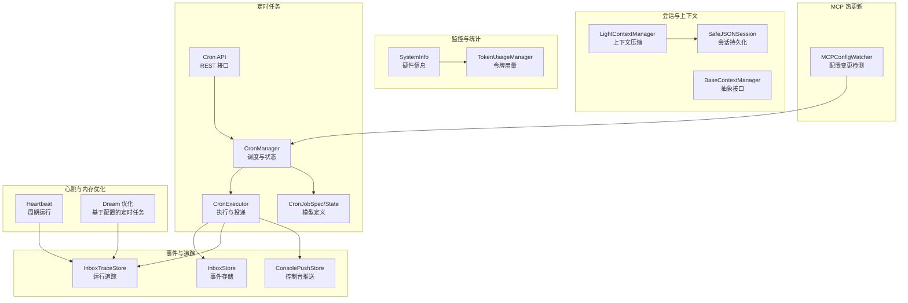
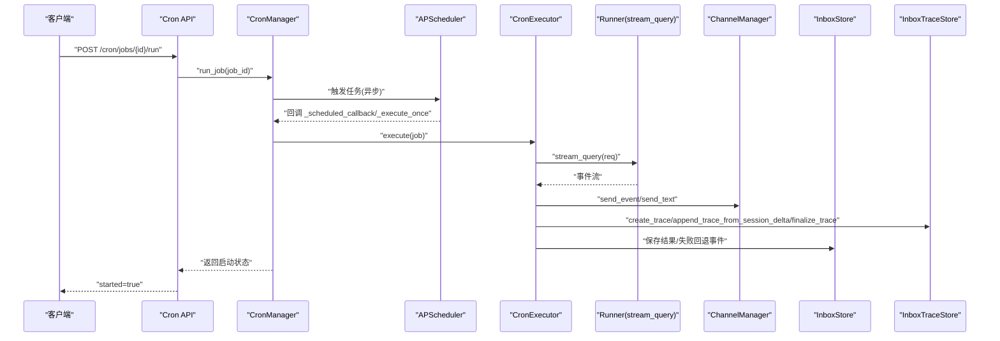
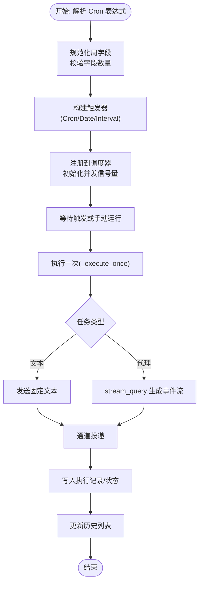
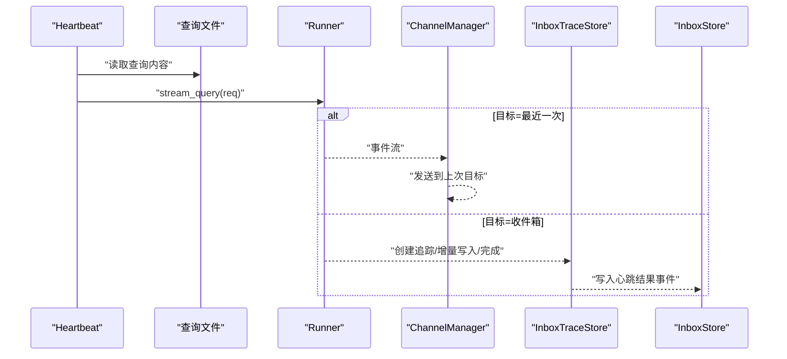
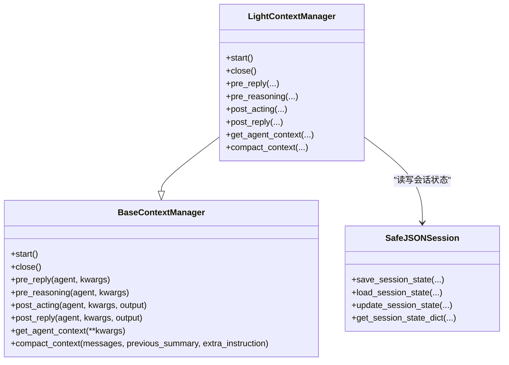
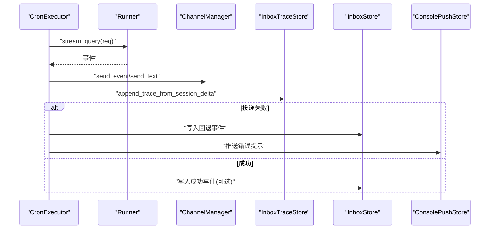
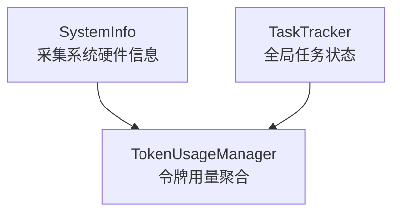
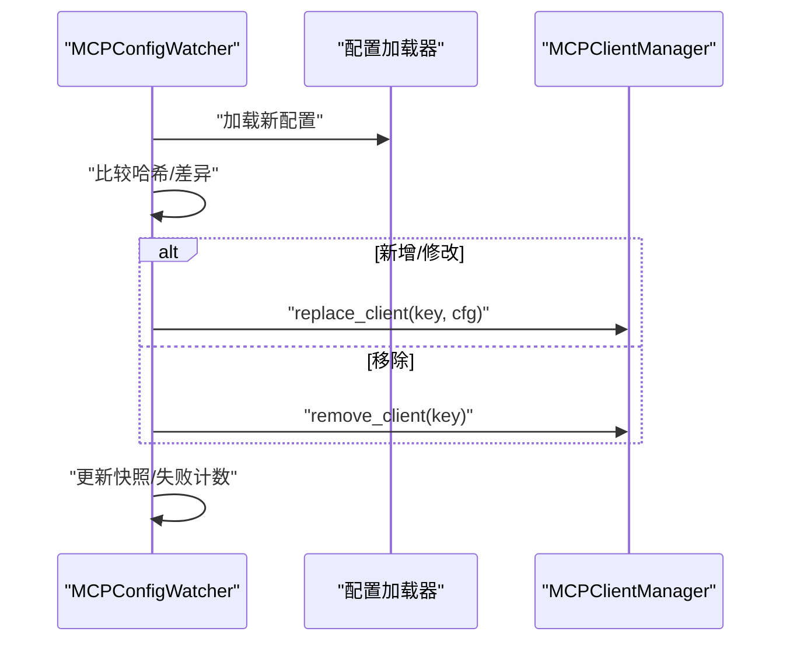
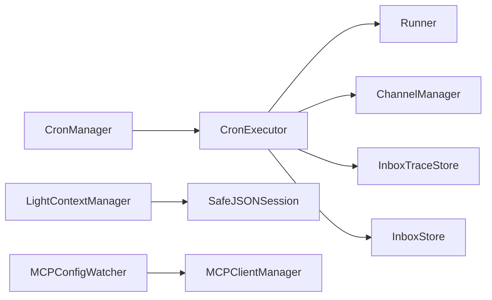

# 系统操作技能

<cite>
**本文引用的文件**
- [src/qwenpaw/app/crons/models.py](file://src/qwenpaw/app/crons/models.py)
- [src/qwenpaw/app/crons/manager.py](file://src/qwenpaw/app/crons/manager.py)
- [src/qwenpaw/app/crons/executor.py](file://src/qwenpaw/app/crons/executor.py)
- [src/qwenpaw/app/crons/api.py](file://src/qwenpaw/app/crons/api.py)
- [src/qwenpaw/app/crons/heartbeat.py](file://src/qwenpaw/app/crons/heartbeat.py)
- [src/qwenpaw/app/runner/session.py](file://src/qwenpaw/app/runner/session.py)
- [src/qwenpaw/app/runner/task_tracker.py](file://src/qwenpaw/app/runner/task_tracker.py)
- [src/qwenpaw/agents/context/base_context_manager.py](file://src/qwenpaw/agents/context/base_context_manager.py)
- [src/qwenpaw/agents/context/light_context_manager.py](file://src/qwenpaw/agents/context/light_context_manager.py)
- [src/qwenpaw/app/inbox_store.py](file://src/qwenpaw/app/inbox_store.py)
- [src/qwenpaw/app/inbox_trace_store.py](file://src/qwenpaw/app/inbox_trace_store.py)
- [src/qwenpaw/app/console_push_store.py](file://src/qwenpaw/app/console_push_store.py)
- [src/qwenpaw/utils/system_info.py](file://src/qwenpaw/utils/system_info.py)
- [src/qwenpaw/token_usage/manager.py](file://src/qwenpaw/token_usage/manager.py)
- [src/qwenpaw/app/mcp/watcher.py](file://src/qwenpaw/app/mcp/watcher.py)
</cite>

## 目录
1. [简介](#简介)
2. [项目结构](#项目结构)
3. [核心组件](#核心组件)
4. [架构总览](#架构总览)
5. [详细组件分析](#详细组件分析)
6. [依赖分析](#依赖分析)
7. [性能考量](#性能考量)
8. [故障排查指南](#故障排查指南)
9. [结论](#结论)
10. [附录](#附录)

## 简介
本文件系统性阐述 QwenPaw 的“系统操作技能”，聚焦三大能力域：定时任务与调度、系统监控与可观测性、以及代理间通信与会话持久化。内容覆盖 Cron 表达式解析与调度、任务并发与超时控制、上下文压缩与会话状态管理、消息投递与回退通知、心跳与内存优化、MCP 配置热更新、以及令牌用量统计与系统硬件信息采集等。文档以代码为依据，结合可视化图示与流程图，帮助读者快速理解并安全地在生产环境中使用这些能力。

## 项目结构
围绕系统操作技能的关键模块分布如下：
- 定时任务与调度：crons 模块（模型、管理器、执行器、API）
- 心跳与内存优化：heartbeat 模块
- 会话与上下文：runner.session、agents.context.*（抽象基类与轻量实现）
- 事件与追踪：inbox_store、inbox_trace_store、console_push_store
- 监控与统计：utils.system_info、token_usage.manager
- MCP 配置热更新：app/mcp/watcher

图表来源
- [src/qwenpaw/app/crons/manager.py:42-146](file://src/qwenpaw/app/crons/manager.py#L42-L146)
- [src/qwenpaw/app/crons/executor.py:20-216](file://src/qwenpaw/app/crons/executor.py#L20-L216)
- [src/qwenpaw/app/crons/models.py:58-276](file://src/qwenpaw/app/crons/models.py#L58-L276)
- [src/qwenpaw/app/crons/api.py:19-190](file://src/qwenpaw/app/crons/api.py#L19-L190)
- [src/qwenpaw/app/crons/heartbeat.py:169-379](file://src/qwenpaw/app/crons/heartbeat.py#L169-L379)
- [src/qwenpaw/app/runner/session.py:196-469](file://src/qwenpaw/app/runner/session.py#L196-L469)
- [src/qwenpaw/agents/context/base_context_manager.py:15-267](file://src/qwenpaw/agents/context/base_context_manager.py#L15-L267)
- [src/qwenpaw/agents/context/light_context_manager.py:47-800](file://src/qwenpaw/agents/context/light_context_manager.py#L47-L800)
- [src/qwenpaw/app/inbox_store.py:36-157](file://src/qwenpaw/app/inbox_store.py#L36-L157)
- [src/qwenpaw/app/inbox_trace_store.py:64-205](file://src/qwenpaw/app/inbox_trace_store.py#L64-L205)
- [src/qwenpaw/app/console_push_store.py:22-97](file://src/qwenpaw/app/console_push_store.py#L22-L97)
- [src/qwenpaw/utils/system_info.py:135-253](file://src/qwenpaw/utils/system_info.py#L135-L253)
- [src/qwenpaw/token_usage/manager.py:61-285](file://src/qwenpaw/token_usage/manager.py#L61-L285)
- [src/qwenpaw/app/mcp/watcher.py:24-332](file://src/qwenpaw/app/mcp/watcher.py#L24-L332)

章节来源
- [src/qwenpaw/app/crons/models.py:58-276](file://src/qwenpaw/app/crons/models.py#L58-L276)
- [src/qwenpaw/app/crons/manager.py:42-146](file://src/qwenpaw/app/crons/manager.py#L42-L146)
- [src/qwenpaw/app/crons/executor.py:20-216](file://src/qwenpaw/app/crons/executor.py#L20-L216)
- [src/qwenpaw/app/crons/api.py:19-190](file://src/qwenpaw/app/crons/api.py#L19-L190)
- [src/qwenpaw/app/crons/heartbeat.py:169-379](file://src/qwenpaw/app/crons/heartbeat.py#L169-L379)
- [src/qwenpaw/app/runner/session.py:196-469](file://src/qwenpaw/app/runner/session.py#L196-L469)
- [src/qwenpaw/agents/context/base_context_manager.py:15-267](file://src/qwenpaw/agents/context/base_context_manager.py#L15-L267)
- [src/qwenpaw/agents/context/light_context_manager.py:47-800](file://src/qwenpaw/agents/context/light_context_manager.py#L47-L800)
- [src/qwenpaw/app/inbox_store.py:36-157](file://src/qwenpaw/app/inbox_store.py#L36-L157)
- [src/qwenpaw/app/inbox_trace_store.py:64-205](file://src/qwenpaw/app/inbox_trace_store.py#L64-L205)
- [src/qwenpaw/app/console_push_store.py:22-97](file://src/qwenpaw/app/console_push_store.py#L22-L97)
- [src/qwenpaw/utils/system_info.py:135-253](file://src/qwenpaw/utils/system_info.py#L135-L253)
- [src/qwenpaw/token_usage/manager.py:61-285](file://src/qwenpaw/token_usage/manager.py#L61-L285)
- [src/qwenpaw/app/mcp/watcher.py:24-332](file://src/qwenpaw/app/mcp/watcher.py#L24-L332)

## 核心组件
- 定时任务与调度
  - CronJobSpec/CronExecutionRecord/CronJobState：定义任务规格、执行记录与状态
  - CronManager：注册/启停、触发、并发与超时控制、历史记录与状态维护
  - CronExecutor：按任务类型执行文本或代理请求，并通过通道投递结果
  - Cron API：提供任务 CRUD、暂停/恢复、手动触发、查询状态与历史
- 心跳与内存优化
  - Heartbeat：按配置周期读取查询文件并运行，支持目标分发与结果入 Inbox
  - Dream 任务：基于配置的周期性内存优化
- 会话与上下文
  - SafeJSONSession：跨平台安全的会话文件命名与异步读写
  - BaseContextManager/LightContextManager：上下文窗口检查、工具输出裁剪、摘要压缩
- 事件与追踪
  - InboxStore：事件队列（限流、去重、标记已读）
  - InboxTraceStore：运行追踪（事件增量、完成态、错误）
  - ConsolePushStore：控制台推送（限时、限长）
- 监控与统计
  - SystemInfo：系统硬件信息采集
  - TokenUsageManager：令牌用量聚合与查询
- MCP 配置热更新
  - MCPConfigWatcher：独立配置变更检测与客户端热重载

章节来源
- [src/qwenpaw/app/crons/models.py:58-276](file://src/qwenpaw/app/crons/models.py#L58-L276)
- [src/qwenpaw/app/crons/manager.py:42-146](file://src/qwenpaw/app/crons/manager.py#L42-L146)
- [src/qwenpaw/app/crons/executor.py:20-216](file://src/qwenpaw/app/crons/executor.py#L20-L216)
- [src/qwenpaw/app/crons/api.py:19-190](file://src/qwenpaw/app/crons/api.py#L19-L190)
- [src/qwenpaw/app/crons/heartbeat.py:169-379](file://src/qwenpaw/app/crons/heartbeat.py#L169-L379)
- [src/qwenpaw/app/runner/session.py:196-469](file://src/qwenpaw/app/runner/session.py#L196-L469)
- [src/qwenpaw/agents/context/base_context_manager.py:15-267](file://src/qwenpaw/agents/context/base_context_manager.py#L15-L267)
- [src/qwenpaw/agents/context/light_context_manager.py:47-800](file://src/qwenpaw/agents/context/light_context_manager.py#L47-L800)
- [src/qwenpaw/app/inbox_store.py:36-157](file://src/qwenpaw/app/inbox_store.py#L36-L157)
- [src/qwenpaw/app/inbox_trace_store.py:64-205](file://src/qwenpaw/app/inbox_trace_store.py#L64-L205)
- [src/qwenpaw/app/console_push_store.py:22-97](file://src/qwenpaw/app/console_push_store.py#L22-L97)
- [src/qwenpaw/utils/system_info.py:135-253](file://src/qwenpaw/utils/system_info.py#L135-L253)
- [src/qwenpaw/token_usage/manager.py:61-285](file://src/qwenpaw/token_usage/manager.py#L61-L285)
- [src/qwenpaw/app/mcp/watcher.py:24-332](file://src/qwenpaw/app/mcp/watcher.py#L24-L332)

## 架构总览
下图展示定时任务从 API 到调度、执行、投递与追踪的端到端流程。

图表来源
- [src/qwenpaw/app/crons/api.py:159-167](file://src/qwenpaw/app/crons/api.py#L159-L167)
- [src/qwenpaw/app/crons/manager.py:451-631](file://src/qwenpaw/app/crons/manager.py#L451-L631)
- [src/qwenpaw/app/crons/executor.py:26-216](file://src/qwenpaw/app/crons/executor.py#L26-L216)
- [src/qwenpaw/app/inbox_store.py:36-67](file://src/qwenpaw/app/inbox_store.py#L36-L67)
- [src/qwenpaw/app/inbox_trace_store.py:64-186](file://src/qwenpaw/app/inbox_trace_store.py#L64-L186)

## 详细组件分析

### 定时任务与调度（Cron）
- Cron 表达式解析与规范化
  - 支持 5 字段标准格式；对周字段进行 crontab 数字到英文缩写的转换，确保与 APScheduler 的 ISO 周数约定一致
  - 对 4/3 字段组合进行自动归一化，兼容常见简写
- 任务规格与运行参数
  - 支持一次性与周期性任务；可配置最大并发、超时秒数、错失宽限期、是否共享会话
  - 任务类型分为“文本”和“代理”，分别走固定文本投递或代理推理流
- 调度与并发控制
  - 使用 AsyncIOScheduler；每个任务拥有独立信号量控制并发
  - 错过触发的宽限期由 misfire_grace_seconds 控制
- 执行与投递
  - 文本任务直接发送；代理任务通过 Runner 的流式接口生成事件，逐条投递给通道
  - 投递失败时记录 delivery_error 并写入 Inbox 回退事件
- 历史与状态
  - 记录每次执行的状态、时间戳、错误信息；限制历史长度
  - 提供状态查询与历史查询 API

图表来源
- [src/qwenpaw/app/crons/models.py:68-148](file://src/qwenpaw/app/crons/models.py#L68-L148)
- [src/qwenpaw/app/crons/manager.py:376-428](file://src/qwenpaw/app/crons/manager.py#L376-L428)
- [src/qwenpaw/app/crons/manager.py:499-631](file://src/qwenpaw/app/crons/manager.py#L499-L631)
- [src/qwenpaw/app/crons/executor.py:26-216](file://src/qwenpaw/app/crons/executor.py#L26-L216)

章节来源
- [src/qwenpaw/app/crons/models.py:58-276](file://src/qwenpaw/app/crons/models.py#L58-L276)
- [src/qwenpaw/app/crons/manager.py:42-146](file://src/qwenpaw/app/crons/manager.py#L42-L146)
- [src/qwenpaw/app/crons/executor.py:20-216](file://src/qwenpaw/app/crons/executor.py#L20-L216)
- [src/qwenpaw/app/crons/api.py:19-190](file://src/qwenpaw/app/crons/api.py#L19-L190)

### 心跳与内存优化
- 心跳机制
  - 从工作区加载查询文件，按配置的间隔运行；支持“最近一次分发”和“收件箱”两种目标
  - 运行过程通过 InboxTraceStore 记录增量消息，最终写入 Inbox 事件
  - 支持活跃时段检查，避免非工作时间运行
- 内存优化（Dream）
  - 基于配置的周期性任务，调用记忆管理器执行优化

图表来源
- [src/qwenpaw/app/crons/heartbeat.py:169-379](file://src/qwenpaw/app/crons/heartbeat.py#L169-L379)
- [src/qwenpaw/app/inbox_trace_store.py:64-186](file://src/qwenpaw/app/inbox_trace_store.py#L64-L186)
- [src/qwenpaw/app/inbox_store.py:36-67](file://src/qwenpaw/app/inbox_store.py#L36-L67)

章节来源
- [src/qwenpaw/app/crons/heartbeat.py:169-379](file://src/qwenpaw/app/crons/heartbeat.py#L169-L379)

### 代理对话上下文管理与会话持久化
- 上下文管理
  - BaseContextManager 定义生命周期钩子（pre_reasoning/post_acting/post_reply）与上下文对象获取
  - LightContextManager 实现上下文检查、工具输出裁剪、摘要压缩与清理
- 会话持久化
  - SafeJSONSession 提供跨平台安全的文件名与异步读写，支持迁移旧版会话文件
  - 会话状态包含 agent/memory 等模块，用于上下文压缩与检索

图表来源
- [src/qwenpaw/agents/context/base_context_manager.py:15-267](file://src/qwenpaw/agents/context/base_context_manager.py#L15-L267)
- [src/qwenpaw/agents/context/light_context_manager.py:47-800](file://src/qwenpaw/agents/context/light_context_manager.py#L47-L800)
- [src/qwenpaw/app/runner/session.py:196-469](file://src/qwenpaw/app/runner/session.py#L196-L469)

章节来源
- [src/qwenpaw/agents/context/base_context_manager.py:15-267](file://src/qwenpaw/agents/context/base_context_manager.py#L15-L267)
- [src/qwenpaw/agents/context/light_context_manager.py:47-800](file://src/qwenpaw/agents/context/light_context_manager.py#L47-L800)
- [src/qwenpaw/app/runner/session.py:196-469](file://src/qwenpaw/app/runner/session.py#L196-L469)

### 代理间通信与会话追踪
- 事件与追踪
  - InboxStore：统一事件存储，支持过滤、分页、标记已读
  - InboxTraceStore：按 run_id 维度记录事件流、状态与错误，支持增量对比
  - ConsolePushStore：控制台推送（带过期与容量限制）
- 通道投递
  - CronExecutor 在代理任务中将事件逐条发送至指定通道；文本任务直接发送纯文本

图表来源
- [src/qwenpaw/app/crons/executor.py:26-216](file://src/qwenpaw/app/crons/executor.py#L26-L216)
- [src/qwenpaw/app/inbox_trace_store.py:150-171](file://src/qwenpaw/app/inbox_trace_store.py#L150-L171)
- [src/qwenpaw/app/inbox_store.py:36-67](file://src/qwenpaw/app/inbox_store.py#L36-L67)
- [src/qwenpaw/app/console_push_store.py:22-97](file://src/qwenpaw/app/console_push_store.py#L22-L97)

章节来源
- [src/qwenpaw/app/inbox_store.py:36-157](file://src/qwenpaw/app/inbox_store.py#L36-L157)
- [src/qwenpaw/app/inbox_trace_store.py:64-205](file://src/qwenpaw/app/inbox_trace_store.py#L64-L205)
- [src/qwenpaw/app/console_push_store.py:22-97](file://src/qwenpaw/app/console_push_store.py#L22-L97)
- [src/qwenpaw/app/crons/executor.py:26-216](file://src/qwenpaw/app/crons/executor.py#L26-L216)

### 系统监控与性能统计
- 硬件信息采集
  - 获取操作系统、架构、CUDA 版本、内存与显存大小等信息，便于本地模型与资源评估
- 令牌用量统计
  - TokenUsageManager 提供缓冲区聚合、后台刷新、按日期/模型/供应商汇总查询
- 全局任务状态
  - TaskTracker 提供运行/空闲状态、活动任务列表、全局最后运行/完成时间

图表来源
- [src/qwenpaw/utils/system_info.py:135-253](file://src/qwenpaw/utils/system_info.py#L135-L253)
- [src/qwenpaw/token_usage/manager.py:61-285](file://src/qwenpaw/token_usage/manager.py#L61-L285)
- [src/qwenpaw/app/runner/task_tracker.py:37-350](file://src/qwenpaw/app/runner/task_tracker.py#L37-L350)

章节来源
- [src/qwenpaw/utils/system_info.py:135-253](file://src/qwenpaw/utils/system_info.py#L135-L253)
- [src/qwenpaw/token_usage/manager.py:61-285](file://src/qwenpaw/token_usage/manager.py#L61-L285)
- [src/qwenpaw/app/runner/task_tracker.py:37-350](file://src/qwenpaw/app/runner/task_tracker.py#L37-L350)

### MCP 配置热更新
- 独立的 MCPConfigWatcher，支持轮询检测配置变更，区分新增/修改/移除客户端，带失败重试与防抖
- 与 MCPClientManager 协作，实现客户端的替换与移除

图表来源
- [src/qwenpaw/app/mcp/watcher.py:140-332](file://src/qwenpaw/app/mcp/watcher.py#L140-L332)

章节来源
- [src/qwenpaw/app/mcp/watcher.py:24-332](file://src/qwenpaw/app/mcp/watcher.py#L24-L332)

## 依赖分析
- 组件耦合
  - CronManager 依赖 CronExecutor、仓库接口、通道管理器与 Runner
  - CronExecutor 依赖 Runner 与 ChannelManager，同时使用 InboxTraceStore 与 InboxStore
  - 上下文管理器与会话持久化解耦于具体实现，通过注册表扩展
- 外部依赖
  - APScheduler 作为调度引擎
  - 异步文件 I/O（aiofiles）保障会话读写不阻塞事件循环
- 循环依赖
  - 未发现直接循环导入；各模块职责清晰，通过接口与依赖注入降低耦合

图表来源
- [src/qwenpaw/app/crons/manager.py:42-146](file://src/qwenpaw/app/crons/manager.py#L42-L146)
- [src/qwenpaw/app/crons/executor.py:20-216](file://src/qwenpaw/app/crons/executor.py#L20-L216)
- [src/qwenpaw/agents/context/light_context_manager.py:47-800](file://src/qwenpaw/agents/context/light_context_manager.py#L47-L800)
- [src/qwenpaw/app/mcp/watcher.py:24-332](file://src/qwenpaw/app/mcp/watcher.py#L24-L332)

章节来源
- [src/qwenpaw/app/crons/manager.py:42-146](file://src/qwenpaw/app/crons/manager.py#L42-L146)
- [src/qwenpaw/app/crons/executor.py:20-216](file://src/qwenpaw/app/crons/executor.py#L20-L216)
- [src/qwenpaw/agents/context/light_context_manager.py:47-800](file://src/qwenpaw/agents/context/light_context_manager.py#L47-L800)
- [src/qwenpaw/app/mcp/watcher.py:24-332](file://src/qwenpaw/app/mcp/watcher.py#L24-L332)

## 性能考量
- 并发与限流
  - 每个 CronJobSpec 自带 max_concurrency 信号量，避免资源争用
  - 任务超时由 timeout_seconds 控制，防止长时间占用
- I/O 与序列化
  - 会话读写采用异步文件 I/O，减少阻塞
  - 事件与追踪采用 JSON 序列化，必要时进行可序列化转换
- 资源回收
  - 上下文压缩与工具输出裁剪降低内存压力
  - 过期工具结果文件清理，避免磁盘膨胀
- 统计与观测
  - 令牌用量聚合与系统信息采集，辅助容量规划与性能回归

## 故障排查指南
- Cron 任务失败
  - 查看 CronExecutionRecord 中的 status 与 error 字段
  - 若 delivery_status 为 failed，检查通道投递异常与 ConsolePushStore 的错误提示
  - 参考路径：[src/qwenpaw/app/crons/manager.py:519-631](file://src/qwenpaw/app/crons/manager.py#L519-L631)、[src/qwenpaw/app/crons/executor.py:123-216](file://src/qwenpaw/app/crons/executor.py#L123-L216)
- 心跳与内存优化异常
  - 检查 InboxStore 中的心跳事件与错误回退事件
  - 核对活跃时段配置与查询文件是否存在
  - 参考路径：[src/qwenpaw/app/crons/heartbeat.py:169-379](file://src/qwenpaw/app/crons/heartbeat.py#L169-L379)、[src/qwenpaw/app/inbox_store.py:36-157](file://src/qwenpaw/app/inbox_store.py#L36-L157)
- 会话读写问题
  - SafeJSONSession 提供 JSON 解析容错与文件迁移逻辑
  - 参考路径：[src/qwenpaw/app/runner/session.py:25-346](file://src/qwenpaw/app/runner/session.py#L25-L346)
- 上下文压缩失败
  - LightContextManager 的压缩失败会返回原因，必要时调整阈值或禁用压缩
  - 参考路径：[src/qwenpaw/agents/context/light_context_manager.py:555-602](file://src/qwenpaw/agents/context/light_context_manager.py#L555-L602)
- MCP 客户端重载失败
  - 观察 MCPConfigWatcher 的失败计数与日志，修复配置后再次修改以触发重试
  - 参考路径：[src/qwenpaw/app/mcp/watcher.py:282-332](file://src/qwenpaw/app/mcp/watcher.py#L282-L332)

章节来源
- [src/qwenpaw/app/crons/manager.py:519-631](file://src/qwenpaw/app/crons/manager.py#L519-L631)
- [src/qwenpaw/app/crons/executor.py:123-216](file://src/qwenpaw/app/crons/executor.py#L123-L216)
- [src/qwenpaw/app/crons/heartbeat.py:169-379](file://src/qwenpaw/app/crons/heartbeat.py#L169-L379)
- [src/qwenpaw/app/inbox_store.py:36-157](file://src/qwenpaw/app/inbox_store.py#L36-L157)
- [src/qwenpaw/app/runner/session.py:25-346](file://src/qwenpaw/app/runner/session.py#L25-L346)
- [src/qwenpaw/agents/context/light_context_manager.py:555-602](file://src/qwenpaw/agents/context/light_context_manager.py#L555-L602)
- [src/qwenpaw/app/mcp/watcher.py:282-332](file://src/qwenpaw/app/mcp/watcher.py#L282-L332)

## 结论
QwenPaw 的系统操作技能以“可配置、可观测、可扩展”为核心设计原则：通过标准化的 Cron 规格与调度器实现稳定的自动化执行；借助上下文压缩与会话持久化保障长对话的稳定性；通过事件与追踪体系提供完整的可观测性；配合令牌用量与系统信息采集，形成闭环的性能监控。MCP 热更新进一步增强了系统的动态适应能力。上述能力可广泛应用于自动化运维、监控告警与智能对话场景，建议在生产环境结合并发与超时策略、资源清理与告警联动使用。

## 附录
- 最佳实践
  - 为关键 Cron 任务设置合理的 max_concurrency 与 timeout_seconds
  - 启用 share_session 以保持上下文连贯，或在隔离场景关闭共享
  - 定期清理过期工具结果文件与 Inbox 事件，控制存储增长
  - 使用 TokenUsageManager 与 SystemInfo 辅助容量规划与成本控制
  - 将 MCP 客户端变更纳入配置版本管理，结合 MCPConfigWatcher 的失败计数进行灰度发布