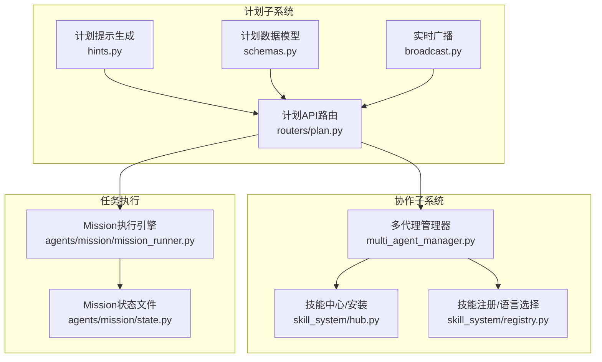
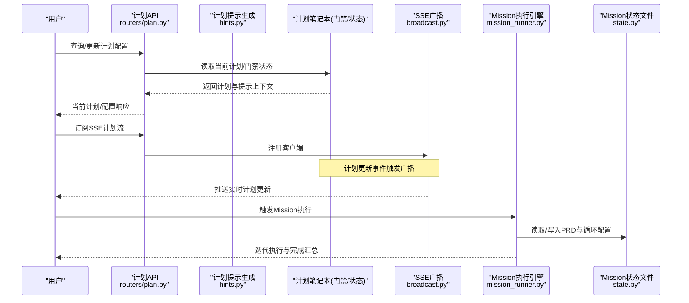
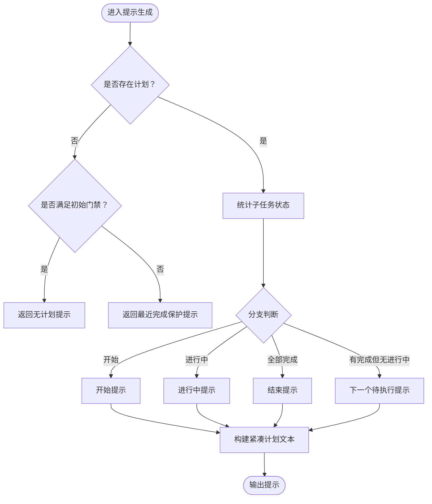
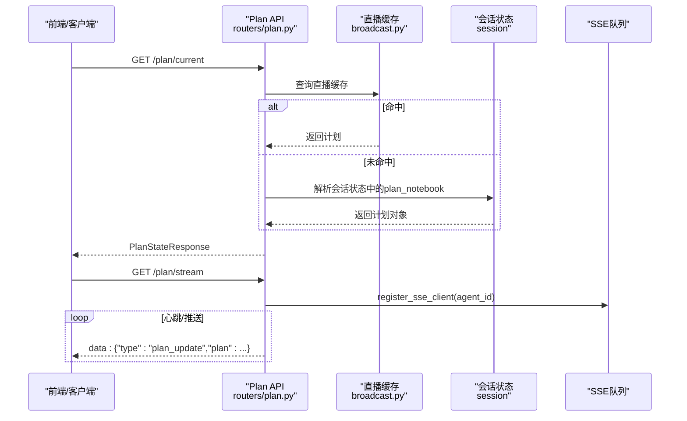
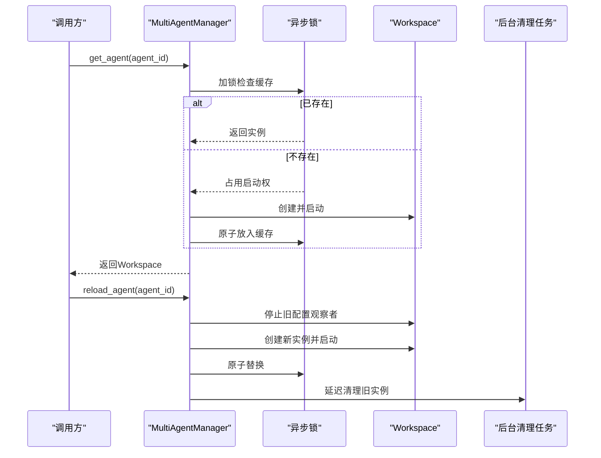
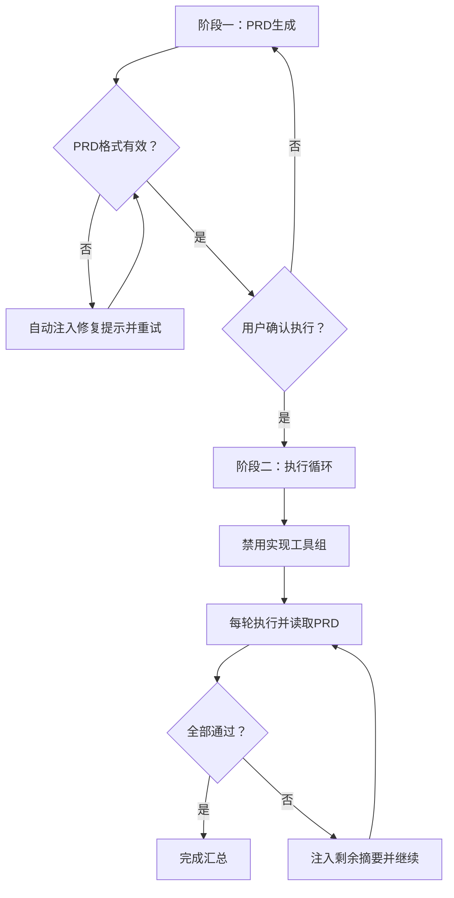
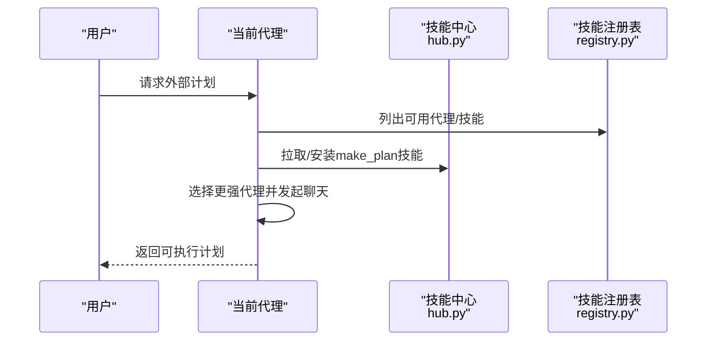
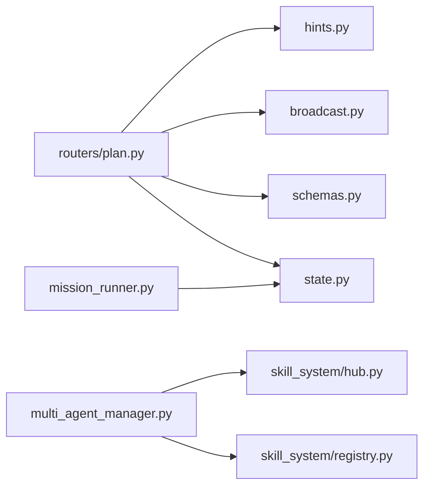

# 计划制定与协作技能

<cite>
**本文档引用的文件**
- [src/qwenpaw/plan/__init__.py](file://src/qwenpaw/plan/__init__.py)
- [src/qwenpaw/plan/schemas.py](file://src/qwenpaw/plan/schemas.py)
- [src/qwenpaw/plan/broadcast.py](file://src/qwenpaw/plan/broadcast.py)
- [src/qwenpaw/plan/hints.py](file://src/qwenpaw/plan/hints.py)
- [src/qwenpaw/app/routers/plan.py](file://src/qwenpaw/app/routers/plan.py)
- [src/qwenpaw/app/multi_agent_manager.py](file://src/qwenpaw/app/multi_agent_manager.py)
- [src/qwenpaw/agents/mission/mission_runner.py](file://src/qwenpaw/agents/mission/mission_runner.py)
- [src/qwenpaw/agents/mission/state.py](file://src/qwenpaw/agents/mission/state.py)
- [src/qwenpaw/agents/skills/make_plan-en/SKILL.md](file://src/qwenpaw/agents/skills/make_plan-en/SKILL.md)
- [src/qwenpaw/agents/skill_system/hub.py](file://src/qwenpaw/agents/skill_system/hub.py)
- [src/qwenpaw/agents/skill_system/registry.py](file://src/qwenpaw/agents/skill_system/registry.py)
</cite>

## 目录
1. [简介](#简介)
2. [项目结构](#项目结构)
3. [核心组件](#核心组件)
4. [架构总览](#架构总览)
5. [详细组件分析](#详细组件分析)
6. [依赖分析](#依赖分析)
7. [性能考虑](#性能考虑)
8. [故障排查指南](#故障排查指南)
9. [结论](#结论)
10. [附录](#附录)

## 简介
本文件面向QwenPaw的“计划制定与协作技能”，系统性阐述以下能力：
- 任务规划：从需求到可执行计划的分解、状态管理与执行跟踪
- 多代理协作：跨智能体的任务委派、进度同步与冲突处理
- 计划制定算法：提示注入、门禁控制、自动继续抑制与上下文压缩
- 协作机制：沟通协议、决策流程、资源调度与风险管理
- 实战案例：项目管理、工作流自动化与团队协作的应用模式

## 项目结构
围绕计划与协作的关键模块分布如下：
- 计划子系统：计划提示生成、实时广播、API接口与数据模型
- 协作子系统：多代理管理、技能系统与外部协作能力
- 任务执行：Mission模式（PRD驱动的迭代执行）与会话状态持久化

图表来源
- [src/qwenpaw/plan/hints.py:1-361](file://src/qwenpaw/plan/hints.py#L1-L361)
- [src/qwenpaw/plan/schemas.py:1-67](file://src/qwenpaw/plan/schemas.py#L1-L67)
- [src/qwenpaw/plan/broadcast.py:1-113](file://src/qwenpaw/plan/broadcast.py#L1-L113)
- [src/qwenpaw/app/routers/plan.py:1-177](file://src/qwenpaw/app/routers/plan.py#L1-L177)
- [src/qwenpaw/app/multi_agent_manager.py:1-537](file://src/qwenpaw/app/multi_agent_manager.py#L1-L537)
- [src/qwenpaw/agents/skill_system/hub.py:1-800](file://src/qwenpaw/agents/skill_system/hub.py#L1-L800)
- [src/qwenpaw/agents/skill_system/registry.py:1-800](file://src/qwenpaw/agents/skill_system/registry.py#L1-L800)
- [src/qwenpaw/agents/mission/mission_runner.py:1-626](file://src/qwenpaw/agents/mission/mission_runner.py#L1-L626)
- [src/qwenpaw/agents/mission/state.py:1-280](file://src/qwenpaw/agents/mission/state.py#L1-L280)

章节来源
- [src/qwenpaw/plan/__init__.py:1-19](file://src/qwenpaw/plan/__init__.py#L1-L19)
- [src/qwenpaw/app/routers/plan.py:1-177](file://src/qwenpaw/app/routers/plan.py#L1-L177)

## 核心组件
- 计划提示生成器（SimplePlanToHint）
  - 基于AgentScope默认提示扩展，增加用户确认门禁、仅显示必要上下文、限制变更窗口等
  - 提供“开始/进行中/结束/无计划”等分支提示，确保ReAct循环持续推进
- 计划数据模型与API
  - Pydantic模型定义计划与子任务的状态、Outcome与时间戳
  - 提供当前计划查询、配置开关与SSE实时推送
- 实时广播与缓存
  - 全局队列维护订阅者，内存缓存保证API在会话文件写入前也可读取最新计划
- 多代理管理
  - 懒加载、零停机热重载、并发启动、后台清理未完成任务
- Mission模式
  - PRD生成与验证、执行阶段工具组隔离、迭代控制与完成判定
- 技能系统
  - 技能中心下载/安装、语言偏好与变体选择、环境变量注入

章节来源
- [src/qwenpaw/plan/hints.py:1-361](file://src/qwenpaw/plan/hints.py#L1-L361)
- [src/qwenpaw/plan/schemas.py:1-67](file://src/qwenpaw/plan/schemas.py#L1-L67)
- [src/qwenpaw/plan/broadcast.py:1-113](file://src/qwenpaw/plan/broadcast.py#L1-L113)
- [src/qwenpaw/app/routers/plan.py:1-177](file://src/qwenpaw/app/routers/plan.py#L1-L177)
- [src/qwenpaw/app/multi_agent_manager.py:1-537](file://src/qwenpaw/app/multi_agent_manager.py#L1-L537)
- [src/qwenpaw/agents/mission/mission_runner.py:1-626](file://src/qwenpaw/agents/mission/mission_runner.py#L1-L626)
- [src/qwenpaw/agents/mission/state.py:1-280](file://src/qwenpaw/agents/mission/state.py#L1-L280)
- [src/qwenpaw/agents/skill_system/hub.py:1-800](file://src/qwenpaw/agents/skill_system/hub.py#L1-L800)
- [src/qwenpaw/agents/skill_system/registry.py:1-800](file://src/qwenpaw/agents/skill_system/registry.py#L1-L800)

## 架构总览
下图展示从用户请求到计划执行与协作的端到端流程。

图表来源
- [src/qwenpaw/app/routers/plan.py:1-177](file://src/qwenpaw/app/routers/plan.py#L1-L177)
- [src/qwenpaw/plan/hints.py:1-361](file://src/qwenpaw/plan/hints.py#L1-L361)
- [src/qwenpaw/plan/broadcast.py:1-113](file://src/qwenpaw/plan/broadcast.py#L1-L113)
- [src/qwenpaw/agents/mission/mission_runner.py:1-626](file://src/qwenpaw/agents/mission/mission_runner.py#L1-L626)
- [src/qwenpaw/agents/mission/state.py:1-280](file://src/qwenpaw/agents/mission/state.py#L1-L280)

## 详细组件分析

### 组件A：计划提示生成与门禁控制
- 关键特性
  - 用户确认门禁：创建/修订计划后必须等待用户确认，期间仅允许计划管理工具
  - 自动继续抑制：在计划突变或刚完成时抑制自动继续，避免上下文漂移
  - 上下文压缩：提示中省略已完成子任务的Outcome，保持每轮上下文稳定
  - 分支提示：根据计划状态（无计划/开始/进行中/结束/无进行中）选择不同提示模板
- 算法要点
  - 状态计数：统计todo/in_progress/done/abandoned数量与首个进行中索引
  - 语言一致性：强制与用户最近消息语言一致
  - 门禁检查：在工具调用前校验是否处于“等待确认”或“初始门禁”阶段
- 复杂度
  - 状态扫描O(n)，提示拼接线性于输出长度；整体O(n)

图表来源
- [src/qwenpaw/plan/hints.py:174-334](file://src/qwenpaw/plan/hints.py#L174-L334)

章节来源
- [src/qwenpaw/plan/hints.py:1-361](file://src/qwenpaw/plan/hints.py#L1-L361)

### 组件B：计划API与实时广播
- 能力概览
  - 获取当前计划：优先命中内存直播缓存，否则回退到会话状态文件解析
  - 配置开关：启用/禁用计划模式
  - SSE流：注册/注销客户端，心跳保活，推送类型化payload
- 数据模型
  - 计划与子任务状态、Outcome、时间戳统一由Pydantic模型约束
- 广播机制
  - 全局字典维护agent_id到队列集合映射
  - 写满丢弃策略，日志告警，避免阻塞

图表来源
- [src/qwenpaw/app/routers/plan.py:69-177](file://src/qwenpaw/app/routers/plan.py#L69-L177)
- [src/qwenpaw/plan/broadcast.py:24-113](file://src/qwenpaw/plan/broadcast.py#L24-L113)
- [src/qwenpaw/plan/schemas.py:10-67](file://src/qwenpaw/plan/schemas.py#L10-L67)

章节来源
- [src/qwenpaw/app/routers/plan.py:1-177](file://src/qwenpaw/app/routers/plan.py#L1-L177)
- [src/qwenpaw/plan/broadcast.py:1-113](file://src/qwenpaw/plan/broadcast.py#L1-L113)
- [src/qwenpaw/plan/schemas.py:1-67](file://src/qwenpaw/plan/schemas.py#L1-L67)

### 组件C：多代理协作与管理
- 能力概览
  - 懒加载：首次访问才创建与启动Workspace
  - 零停机热重载：新实例全启动后原子替换旧实例，后台清理未完成任务
  - 并发启动：并行初始化多个代理，细粒度锁降低阻塞
  - 并行清理：延迟清理策略，保障Streaming/长连接不中断
- 关键流程
  - get_agent：并发去重、快速路径命中、慢启动创建
  - reload_agent：停止旧配置观察者、加载新配置、创建新实例、原子替换、优雅停止旧实例
  - stop_all：取消清理任务、逐个停止代理

图表来源
- [src/qwenpaw/app/multi_agent_manager.py:42-382](file://src/qwenpaw/app/multi_agent_manager.py#L42-L382)

章节来源
- [src/qwenpaw/app/multi_agent_manager.py:1-537](file://src/qwenpaw/app/multi_agent_manager.py#L1-L537)

### 组件D：Mission模式与执行跟踪
- 阶段一：PRD生成与用户确认
  - 代理生成PRD，若格式错误自动注入修复提示并最多尝试N次
  - 用户确认后进入阶段二
- 阶段二：执行循环与工具组隔离
  - 禁用实现类工具组，控制器仅负责委派与监督
  - 每轮结束后读取PRD，检查所有故事是否通过，否则注入继续消息
  - 达到最大迭代次数时给出总结
- 状态文件
  - loop_config.json：环境元数据（git分支、会话ID等）
  - prd.json：用户故事列表与通过标记
  - progress.txt：迭代日志
  - task.md：原始任务描述

图表来源
- [src/qwenpaw/agents/mission/mission_runner.py:302-626](file://src/qwenpaw/agents/mission/mission_runner.py#L302-L626)
- [src/qwenpaw/agents/mission/state.py:134-280](file://src/qwenpaw/agents/mission/state.py#L134-L280)

章节来源
- [src/qwenpaw/agents/mission/mission_runner.py:1-626](file://src/qwenpaw/agents/mission/mission_runner.py#L1-L626)
- [src/qwenpaw/agents/mission/state.py:1-280](file://src/qwenpaw/agents/mission/state.py#L1-L280)

### 组件E：外部计划请求与协作技能
- 外部计划请求（make_plan技能）
  - 目标：向更强代理请求“可执行步骤”的计划，而非直接外包执行
  - 规则：步骤需清晰、可验证、按顺序排列；接收方仅输出计划，不执行
- 技能系统
  - 技能中心：支持从Hub拉取/安装技能，带版本与文件树解析
  - 注册表：内置技能语言选择、冲突检测与迁移兼容
  - 环境注入：按技能需求注入环境变量，便于运行期配置

图表来源
- [src/qwenpaw/agents/skills/make_plan-en/SKILL.md:1-84](file://src/qwenpaw/agents/skills/make_plan-en/SKILL.md#L1-L84)
- [src/qwenpaw/agents/skill_system/hub.py:1-800](file://src/qwenpaw/agents/skill_system/hub.py#L1-L800)
- [src/qwenpaw/agents/skill_system/registry.py:1-800](file://src/qwenpaw/agents/skill_system/registry.py#L1-L800)

章节来源
- [src/qwenpaw/agents/skills/make_plan-en/SKILL.md:1-84](file://src/qwenpaw/agents/skills/make_plan-en/SKILL.md#L1-L84)
- [src/qwenpaw/agents/skill_system/hub.py:1-800](file://src/qwenpaw/agents/skill_system/hub.py#L1-L800)
- [src/qwenpaw/agents/skill_system/registry.py:1-800](file://src/qwenpaw/agents/skill_system/registry.py#L1-L800)

## 依赖分析
- 组件耦合
  - 计划API依赖提示生成器与广播模块，同时读取会话状态以保证一致性
  - 多代理管理器与Mission执行引擎解耦，前者专注生命周期与并发，后者专注任务执行
  - 技能系统为协作提供基础能力，与计划API无直接耦合，通过工具调用间接参与
- 外部依赖
  - FastAPI/Starlette用于API与SSE
  - asyncio用于异步队列与并发
  - Git探测用于Mission上下文信息

图表来源
- [src/qwenpaw/app/routers/plan.py:1-177](file://src/qwenpaw/app/routers/plan.py#L1-L177)
- [src/qwenpaw/plan/hints.py:1-361](file://src/qwenpaw/plan/hints.py#L1-L361)
- [src/qwenpaw/plan/broadcast.py:1-113](file://src/qwenpaw/plan/broadcast.py#L1-L113)
- [src/qwenpaw/plan/schemas.py:1-67](file://src/qwenpaw/plan/schemas.py#L1-L67)
- [src/qwenpaw/agents/mission/state.py:1-280](file://src/qwenpaw/agents/mission/state.py#L1-L280)
- [src/qwenpaw/app/multi_agent_manager.py:1-537](file://src/qwenpaw/app/multi_agent_manager.py#L1-L537)
- [src/qwenpaw/agents/skill_system/hub.py:1-800](file://src/qwenpaw/agents/skill_system/hub.py#L1-L800)
- [src/qwenpaw/agents/skill_system/registry.py:1-800](file://src/qwenpaw/agents/skill_system/registry.py#L1-L800)
- [src/qwenpaw/agents/mission/mission_runner.py:1-626](file://src/qwenpaw/agents/mission/mission_runner.py#L1-L626)

章节来源
- [src/qwenpaw/app/routers/plan.py:1-177](file://src/qwenpaw/app/routers/plan.py#L1-L177)
- [src/qwenpaw/app/multi_agent_manager.py:1-537](file://src/qwenpaw/app/multi_agent_manager.py#L1-L537)

## 性能考虑
- 计划提示生成
  - 状态扫描与字符串拼接线性成本低；建议控制子任务数量与描述长度以维持上下文稳定
- 广播与SSE
  - 队列满丢弃避免阻塞；心跳保活减少空闲连接开销
- 多代理管理
  - 懒加载与并行启动显著降低冷启动时间；原子替换与延迟清理保障高可用
- Mission执行
  - 工具组隔离减少误操作风险；最大迭代次数防止无限循环

## 故障排查指南
- 计划API返回空
  - 检查直播缓存是否命中；若未命中，确认会话状态中是否存在plan_notebook与current_plan
- SSE无更新
  - 确认客户端已注册且未断开；查看队列是否被丢弃（满队列警告）
- Mission执行异常
  - PRD格式错误：检查required字段与schema；系统会自动注入修复提示
  - 工具不可用：阶段二已禁用实现工具组，需通过委派方式完成
- 多代理重载失败
  - 查看后台清理任务状态；确保新实例成功启动后再释放旧实例

章节来源
- [src/qwenpaw/app/routers/plan.py:69-177](file://src/qwenpaw/app/routers/plan.py#L69-L177)
- [src/qwenpaw/plan/broadcast.py:101-113](file://src/qwenpaw/plan/broadcast.py#L101-L113)
- [src/qwenpaw/agents/mission/mission_runner.py:299-468](file://src/qwenpaw/agents/mission/mission_runner.py#L299-L468)
- [src/qwenpaw/app/multi_agent_manager.py:384-408](file://src/qwenpaw/app/multi_agent_manager.py#L384-L408)

## 结论
QwenPaw的计划制定与协作技能通过“提示门禁+上下文压缩+实时广播+零停机管理+Mission迭代”的组合，实现了：
- 可解释、可追踪的计划生命周期管理
- 高可靠、低侵入的多代理协作与资源调度
- 面向复杂任务的分阶段执行与风险管理
在项目管理、工作流自动化与团队协作中具备广泛适用性与扩展潜力。

## 附录
- 实际应用案例建议
  - 项目管理：以Mission模式驱动PRD落地，结合计划API可视化跟踪
  - 工作流自动化：利用make_plan技能请求专家代理生成可执行步骤，再由当前代理执行
  - 团队协作：通过多代理管理器实现跨角色Agent编排，SSE实现实时进度同步