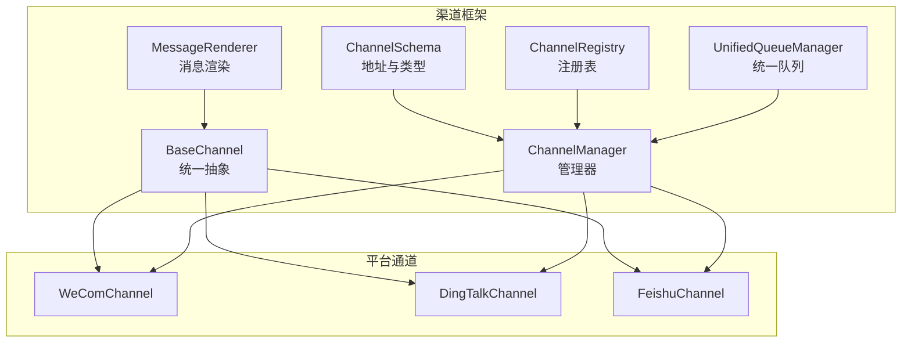
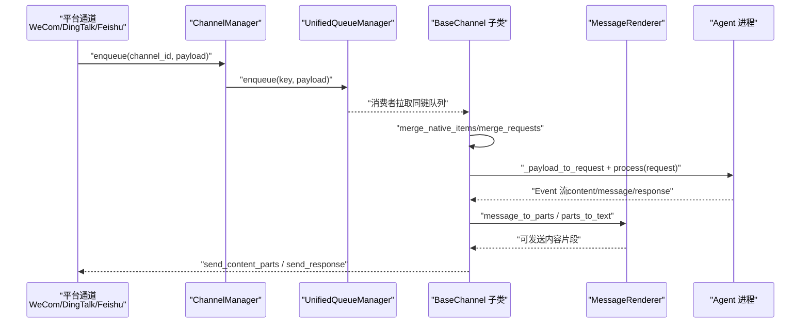
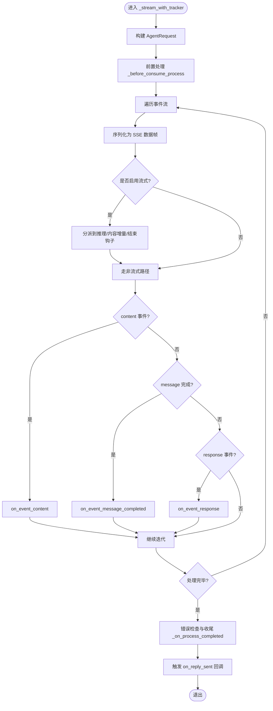
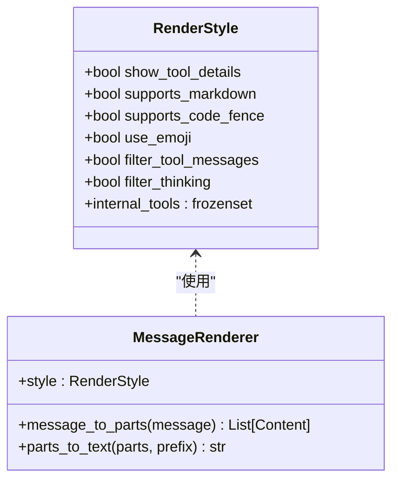
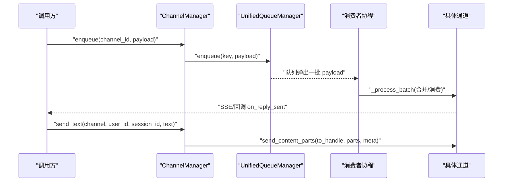
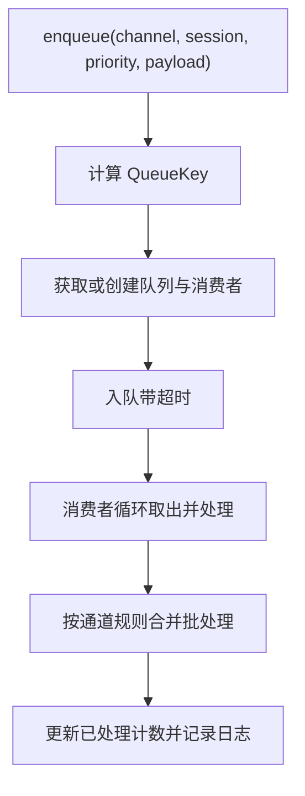
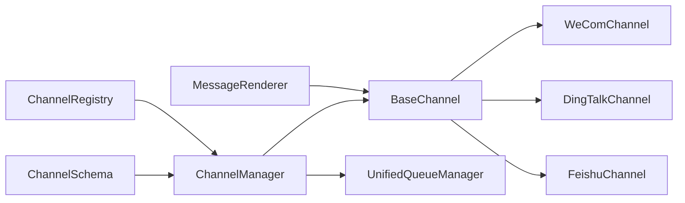

# 通信渠道技能

<cite>
**本文引用的文件**
- [src/qwenpaw/app/channels/__init__.py](file://src/qwenpaw/app/channels/__init__.py)
- [src/qwenpaw/app/channels/base.py](file://src/qwenpaw/app/channels/base.py)
- [src/qwenpaw/app/channels/manager.py](file://src/qwenpaw/app/channels/manager.py)
- [src/qwenpaw/app/channels/schema.py](file://src/qwenpaw/app/channels/schema.py)
- [src/qwenpaw/app/channels/renderer.py](file://src/qwenpaw/app/channels/renderer.py)
- [src/qwenpaw/app/channels/registry.py](file://src/qwenpaw/app/channels/registry.py)
- [src/qwenpaw/app/channels/unified_queue_manager.py](file://src/qwenpaw/app/channels/unified_queue_manager.py)
- [src/qwenpaw/app/channels/wecom/channel.py](file://src/qwenpaw/app/channels/wecom/channel.py)
- [src/qwenpaw/app/channels/dingtalk/channel.py](file://src/qwenpaw/app/channels/dingtalk/channel.py)
- [src/qwenpaw/app/channels/feishu/channel.py](file://src/qwenpaw/app/channels/feishu/channel.py)
</cite>

## 目录
1. [简介](#简介)
2. [项目结构](#项目结构)
3. [核心组件](#核心组件)
4. [架构总览](#架构总览)
5. [详细组件分析](#详细组件分析)
6. [依赖分析](#依赖分析)
7. [性能考量](#性能考量)
8. [故障排查指南](#故障排查指南)
9. [结论](#结论)
10. [附录](#附录)

## 简介
本文件系统性阐述 QwenPaw 的“通信渠道技能”，覆盖消息发送、接收与处理的全链路能力，重点说明企业微信（WeCom）、钉钉（DingTalk）、飞书（Feishu）等主流 IM 平台的集成方式；解释消息格式转换、富文本渲染与多媒体内容处理；给出渠道认证、权限管理与安全配置要点；并展示消息路由、批量合并、统一队列与定时任务的实现方法，以及多渠道协同与自动化消息处理的应用场景。

## 项目结构
通信渠道子系统位于 src/qwenpaw/app/channels 下，采用“基类 + 多平台通道 + 统一管理器 + 渲染器 + 队列管理”的分层设计：
- 基类与协议：定义统一的消息模型、渲染风格、流式回调与消费接口
- 通道实现：按平台拆分目录，如 wecom、dingtalk、feishu 等
- 注册表与懒加载：内置通道注册与自定义通道发现
- 统一队列管理：基于会话与优先级的动态队列与消费者
- 管理器：负责通道生命周期、入队、路由、健康检查与重启

图表来源
- [src/qwenpaw/app/channels/base.py](file://src/qwenpaw/app/channels/base.py)
- [src/qwenpaw/app/channels/renderer.py](file://src/qwenpaw/app/channels/renderer.py)
- [src/qwenpaw/app/channels/schema.py](file://src/qwenpaw/app/channels/schema.py)
- [src/qwenpaw/app/channels/registry.py](file://src/qwenpaw/app/channels/registry.py)
- [src/qwenpaw/app/channels/unified_queue_manager.py](file://src/qwenpaw/app/channels/unified_queue_manager.py)
- [src/qwenpaw/app/channels/manager.py](file://src/qwenpaw/app/channels/manager.py)
- [src/qwenpaw/app/channels/wecom/channel.py](file://src/qwenpaw/app/channels/wecom/channel.py)
- [src/qwenpaw/app/channels/dingtalk/channel.py](file://src/qwenpaw/app/channels/dingtalk/channel.py)
- [src/qwenpaw/app/channels/feishu/channel.py](file://src/qwenpaw/app/channels/feishu/channel.py)

章节来源
- [src/qwenpaw/app/channels/__init__.py](file://src/qwenpaw/app/channels/__init__.py)
- [src/qwenpaw/app/channels/registry.py](file://src/qwenpaw/app/channels/registry.py)

## 核心组件
- BaseChannel：统一抽象，定义消息请求/响应处理、流式事件分发、内容合并、去重与防抖、会话提取、工作区注入等通用能力
- MessageRenderer：将运行时消息对象转换为可发送的内容片段（文本、图片、音频、视频、文件、拒绝），支持样式控制与工具调用输出渲染
- ChannelManager：通道生命周期管理、统一入队、路由与批处理、健康检查、重启、替换通道、主动发送
- UnifiedQueueManager：基于（渠道、会话、优先级）三元键的动态队列与消费者，支持并发隔离与自动清理
- ChannelRegistry：内置通道注册与自定义通道发现，支持模块级路由钩子注册
- ChannelSchema：渠道类型标识、统一路由地址（kind:id:extra）

章节来源
- [src/qwenpaw/app/channels/base.py](file://src/qwenpaw/app/channels/base.py)
- [src/qwenpaw/app/channels/renderer.py](file://src/qwenpaw/app/channels/renderer.py)
- [src/qwenpaw/app/channels/manager.py](file://src/qwenpaw/app/channels/manager.py)
- [src/qwenpaw/app/channels/unified_queue_manager.py](file://src/qwenpaw/app/channels/unified_queue_manager.py)
- [src/qwenpaw/app/channels/schema.py](file://src/qwenpaw/app/channels/schema.py)
- [src/qwenpaw/app/channels/registry.py](file://src/qwenpaw/app/channels/registry.py)

## 架构总览
下图展示了从“收到平台消息”到“渲染并发送”的端到端流程，以及统一队列与管理器如何协调多通道并发与批处理。

图表来源
- [src/qwenpaw/app/channels/manager.py](file://src/qwenpaw/app/channels/manager.py)
- [src/qwenpaw/app/channels/unified_queue_manager.py](file://src/qwenpaw/app/channels/unified_queue_manager.py)
- [src/qwenpaw/app/channels/base.py](file://src/qwenpaw/app/channels/base.py)
- [src/qwenpaw/app/channels/renderer.py](file://src/qwenpaw/app/channels/renderer.py)

## 详细组件分析

### 基类与消息处理（BaseChannel）
- 统一事件流：支持“推理中/内容增量/消息完成”等事件类型，结合流式钩子与非流式路径
- 内容合并：对同一会话的多个原生负载进行合并（content_parts 合并、meta 聚合）
- 去重与防抖：基于消息 ID 与时间窗口的去重，以及“无文本先缓存、有文本再合并”的策略
- 权限与会话：支持私聊/群聊策略、白名单/黑名单、@ 机器人要求
- 工作区注入：与聊天与任务跟踪器协作，支持取消与幂等

图表来源
- [src/qwenpaw/app/channels/base.py](file://src/qwenpaw/app/channels/base.py)

章节来源
- [src/qwenpaw/app/channels/base.py](file://src/qwenpaw/app/channels/base.py)

### 消息渲染（MessageRenderer）
- 输入：运行时消息对象（含文本、数据块、工具调用/输出等）
- 输出：可发送的内容片段列表（Text/Image/Audio/Video/File/Refusal）
- 特性：支持 Markdown、代码围栏、Emoji、过滤工具消息/思考内容、内部工具媒体透传控制

图表来源
- [src/qwenpaw/app/channels/renderer.py](file://src/qwenpaw/app/channels/renderer.py)

章节来源
- [src/qwenpaw/app/channels/renderer.py](file://src/qwenpaw/app/channels/renderer.py)

### 通道管理（ChannelManager）
- 生命周期：from_env/from_config 创建通道实例，start_all 启动统一队列与各通道
- 入队与路由：根据查询词提取优先级，按（渠道, 会话, 优先级）入队
- 批处理：对同一键的队列进行批量合并（原生负载合并或请求合并）
- 主动发送：send_text/send_event 将纯文本或事件转为内容片段发送
- 健康检查与重启：get_channel_health/restart_channel 支持单通道健康状态与热重启

图表来源
- [src/qwenpaw/app/channels/manager.py](file://src/qwenpaw/app/channels/manager.py)
- [src/qwenpaw/app/channels/unified_queue_manager.py](file://src/qwenpaw/app/channels/unified_queue_manager.py)

章节来源
- [src/qwenpaw/app/channels/manager.py](file://src/qwenpaw/app/channels/manager.py)
- [src/qwenpaw/app/channels/unified_queue_manager.py](file://src/qwenpaw/app/channels/unified_queue_manager.py)

### 统一队列管理（UnifiedQueueManager）
- 键模型：QueueKey=(channel_id, session_id, priority_level)
- 动态消费者：首次入队即创建消费者任务，空闲自动清理
- 并发隔离：不同会话与优先级可并行；同键严格串行
- 超时保护：入队等待超时与异常记录

图表来源
- [src/qwenpaw/app/channels/unified_queue_manager.py](file://src/qwenpaw/app/channels/unified_queue_manager.py)

章节来源
- [src/qwenpaw/app/channels/unified_queue_manager.py](file://src/qwenpaw/app/channels/unified_queue_manager.py)

### 通道注册与发现（ChannelRegistry）
- 内置通道映射：imessage、discord、dingtalk、feishu、qq、telegram、mattermost、mqtt、console、matrix、voice、sip、wecom、xiaoyi、wechat、onebot
- 自定义通道：扫描 CUSTOM_CHANNELS_DIR，导入模块并注册实现类
- 路由钩子：允许自定义通道在模块级注册 /api 前缀路由

章节来源
- [src/qwenpaw/app/channels/registry.py](file://src/qwenpaw/app/channels/registry.py)

### 企业微信（WeCom）集成
- 接收：通过 aibot WebSocket SDK 接收消息，使用 reply_stream 实现流式回复
- 发送：支持文本、图片、语音、文件与混合消息；媒体上传采用分片长连接
- 会话：单聊/群聊 session_id 规范化；去重与“🤔 Thinking...”保活
- 安全：消息 ID 去重缓存、媒体目录与压缩策略

章节来源
- [src/qwenpaw/app/channels/wecom/channel.py](file://src/qwenpaw/app/channels/wecom/channel.py)

### 钉钉（DingTalk）集成
- 接收：Stream 回调为请求-应答模式；若存在 sessionWebhook 则可通过 Webhook 多次推送
- 发送：Markdown 或卡片模板；支持 AI 卡片状态机与预刷新令牌
- 会话：短会话 ID 与会话 Webhook 存储；群聊/私聊策略与 @ 机器人要求
- 媒体：本地文件路径解析与后缀推断

章节来源
- [src/qwenpaw/app/channels/dingtalk/channel.py](file://src/qwenpaw/app/channels/dingtalk/channel.py)

### 飞书（Feishu）集成
- 接收：WebSocket 长连事件；Open API 发送
- 发送：文本、图片、文件；交互式内容分块构建
- 会话：chat_id/open_id 规范化；消息去重与昵称缓存
- 安全：加密密钥、校验令牌配置项

章节来源
- [src/qwenpaw/app/channels/feishu/channel.py](file://src/qwenpaw/app/channels/feishu/channel.py)

## 依赖分析
- 组件耦合
  - BaseChannel 与 MessageRenderer 弱耦合：渲染器仅依赖运行时内容类型
  - ChannelManager 与 UnifiedQueueManager 强耦合：前者负责入队与路由，后者负责消费者与清理
  - 各平台通道仅依赖 BaseChannel 抽象，便于扩展
- 外部依赖
  - WeCom：aibot WebSocket SDK
  - DingTalk：dingtalk_stream、OpenAPI 客户端
  - 飞书：lark-oapi（可选依赖，兼容 setuptools 变更）
- 循环依赖
  - 未见直接循环导入；注册表延迟加载内置通道，避免 CLI 启动阻塞

图表来源
- [src/qwenpaw/app/channels/base.py](file://src/qwenpaw/app/channels/base.py)
- [src/qwenpaw/app/channels/renderer.py](file://src/qwenpaw/app/channels/renderer.py)
- [src/qwenpaw/app/channels/manager.py](file://src/qwenpaw/app/channels/manager.py)
- [src/qwenpaw/app/channels/unified_queue_manager.py](file://src/qwenpaw/app/channels/unified_queue_manager.py)
- [src/qwenpaw/app/channels/registry.py](file://src/qwenpaw/app/channels/registry.py)
- [src/qwenpaw/app/channels/schema.py](file://src/qwenpaw/app/channels/schema.py)

章节来源
- [src/qwenpaw/app/channels/registry.py](file://src/qwenpaw/app/channels/registry.py)
- [src/qwenpaw/app/channels/manager.py](file://src/qwenpaw/app/channels/manager.py)

## 性能考量
- 队列与并发
  - 使用（渠道, 会话, 优先级）三元键隔离，避免全局阻塞
  - 动态消费者按需创建，减少固定线程池开销
- 批量合并
  - 对同一会话的快速消息进行合并，降低下游压力
- 超时与清理
  - 入队等待超时与空闲队列清理，防止内存泄漏
- 渲染与媒体
  - 渲染器按需生成文本/媒体片段，避免冗余传输
  - WeCom 图片压缩与分片上传，优化大文件传输

## 故障排查指南
- 通道不可用
  - 检查 ChannelManager.get_channel_health 获取状态
  - 使用 restart_channel 重启单通道
- 入队失败
  - 查看队列满/超时日志；确认队列最大长度与清理间隔配置
- 渲染异常
  - 确认 RenderStyle 配置（过滤工具消息/思考内容）
- 平台集成问题
  - WeCom：检查 bot_id/secret、媒体目录、去重缓存大小
  - 钉钉：核对 client_id/secret、机器人编码、卡片模板
  - 飞书：核对 app_id/app_secret、加密与校验令牌

章节来源
- [src/qwenpaw/app/channels/manager.py](file://src/qwenpaw/app/channels/manager.py)
- [src/qwenpaw/app/channels/unified_queue_manager.py](file://src/qwenpaw/app/channels/unified_queue_manager.py)
- [src/qwenpaw/app/channels/renderer.py](file://src/qwenpaw/app/channels/renderer.py)
- [src/qwenpaw/app/channels/wecom/channel.py](file://src/qwenpaw/app/channels/wecom/channel.py)
- [src/qwenpaw/app/channels/dingtalk/channel.py](file://src/qwenpaw/app/channels/dingtalk/channel.py)
- [src/qwenpaw/app/channels/feishu/channel.py](file://src/qwenpaw/app/channels/feishu/channel.py)

## 结论
QwenPaw 的通信渠道技能以“统一抽象 + 渲染器 + 统一队列 + 管理器”为核心，实现了跨平台消息的标准化处理与高效并发。通过内置与自定义通道注册、权限与安全配置、消息格式转换与富文本渲染、以及主动发送与定时任务支持，系统能够稳定支撑企业微信、钉钉、飞书等多渠道协同与自动化消息处理。

## 附录
- 渠道类型与路由
  - 内置类型：imessage、discord、dingtalk、feishu、qq、telegram、mattermost、mqtt、console、matrix、voice、sip、wecom、xiaoyi、wechat、onebot
  - 路由地址：kind:id:extra，统一 to_handle 生成
- 主动发送与定时任务
  - ChannelManager 提供 send_text/send_event，支持按会话与用户目标发送
  - 结合统一队列与命令优先级，实现高优任务优先处理

章节来源
- [src/qwenpaw/app/channels/schema.py](file://src/qwenpaw/app/channels/schema.py)
- [src/qwenpaw/app/channels/manager.py](file://src/qwenpaw/app/channels/manager.py)