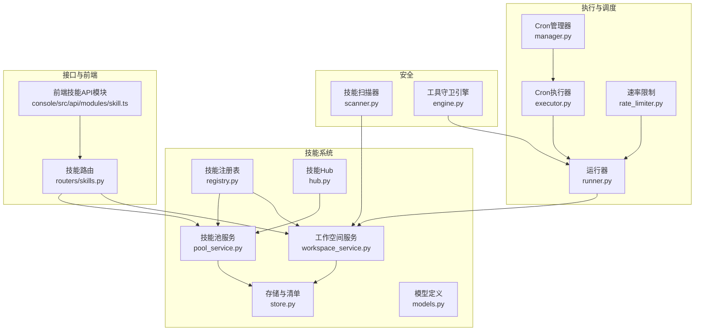
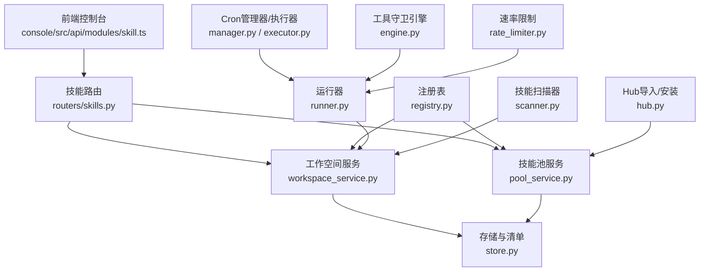
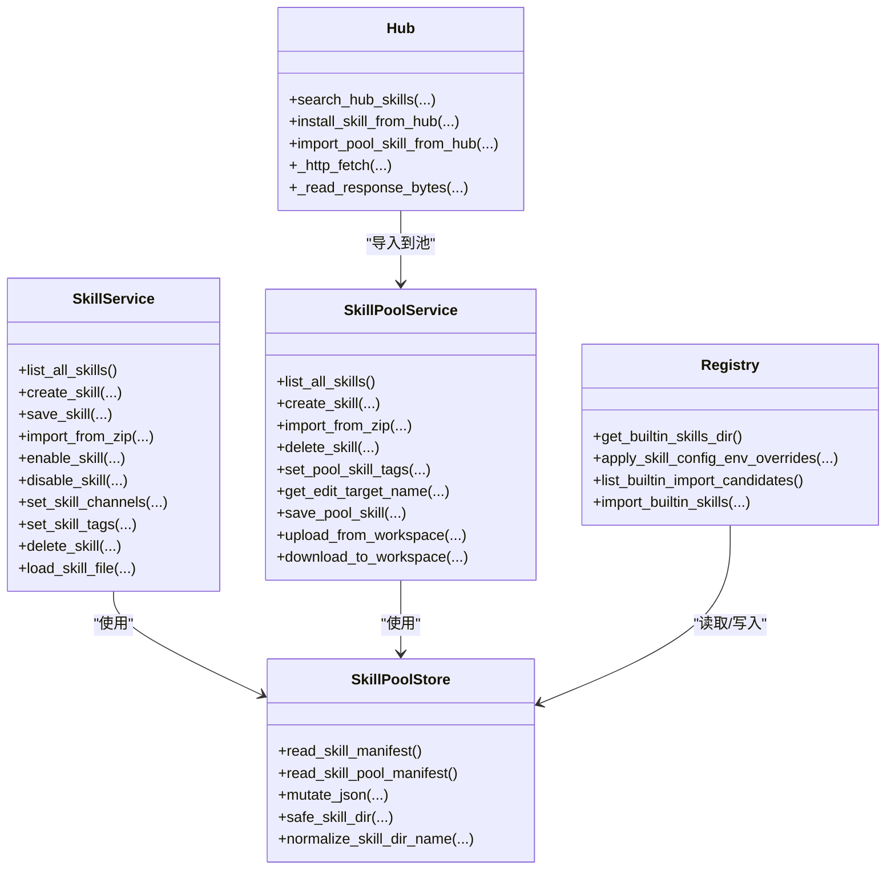
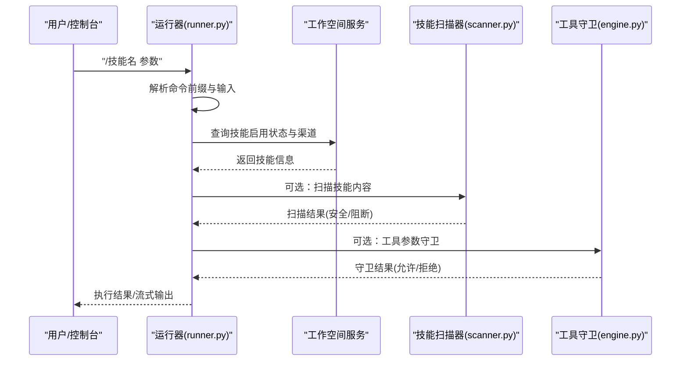
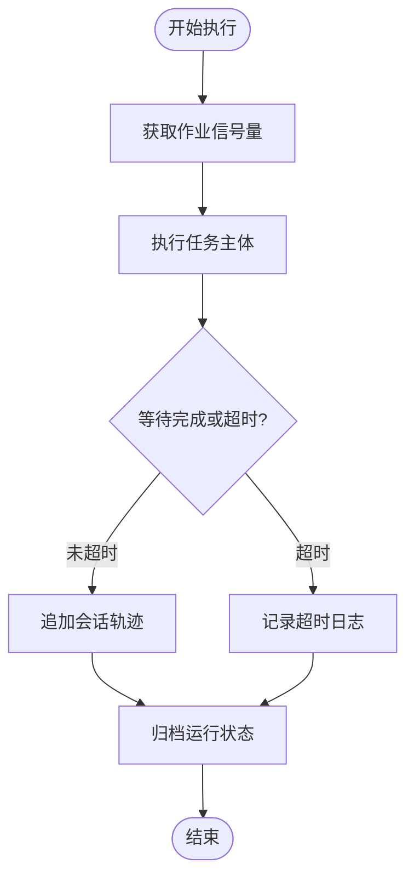
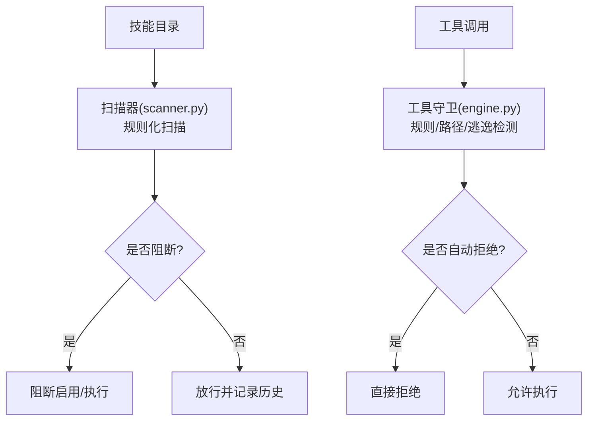
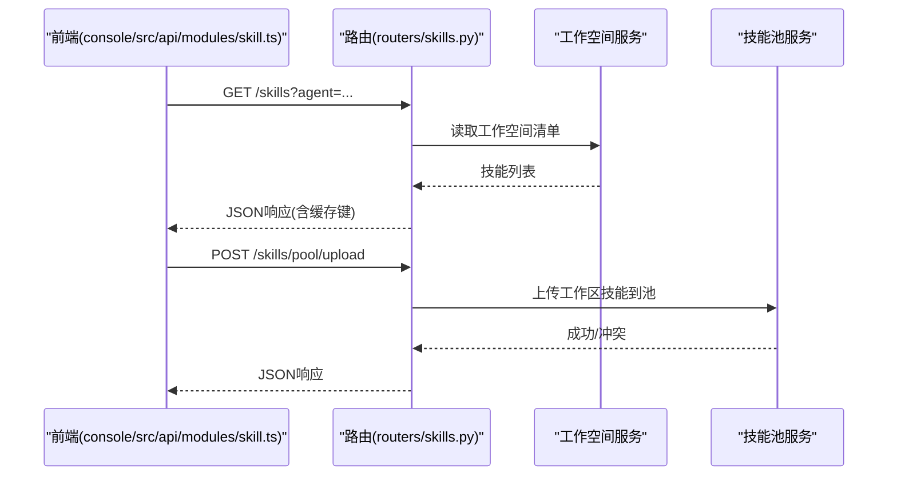
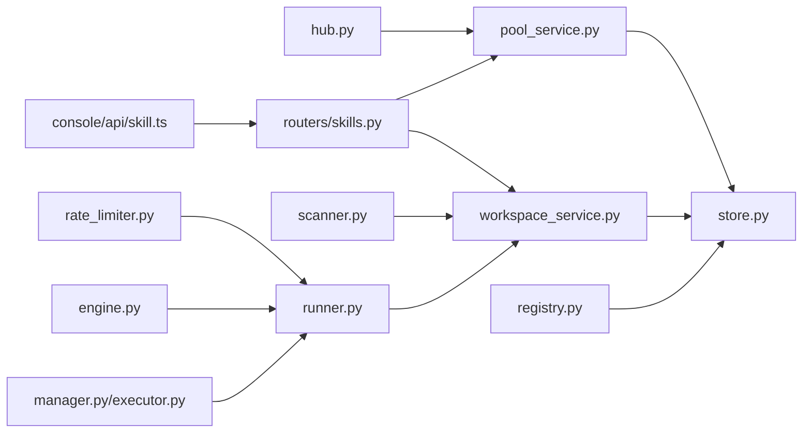

# 技能执行引擎

<cite>
**本文档引用的文件**
- [src/qwenpaw/agents/skill_system/hub.py](file://src/qwenpaw/agents/skill_system/hub.py)
- [src/qwenpaw/agents/skill_system/registry.py](file://src/qwenpaw/agents/skill_system/registry.py)
- [src/qwenpaw/agents/skill_system/pool_service.py](file://src/qwenpaw/agents/skill_system/pool_service.py)
- [src/qwenpaw/agents/skill_system/workspace_service.py](file://src/qwenpaw/agents/skill_system/workspace_service.py)
- [src/qwenpaw/agents/skill_system/store.py](file://src/qwenpaw/agents/skill_system/store.py)
- [src/qwenpaw/agents/skill_system/models.py](file://src/qwenpaw/agents/skill_system/models.py)
- [src/qwenpaw/app/routers/skills.py](file://src/qwenpaw/app/routers/skills.py)
- [src/qwenpaw/app/crons/manager.py](file://src/qwenpaw/app/crons/manager.py)
- [src/qwenpaw/app/crons/executor.py](file://src/qwenpaw/app/crons/executor.py)
- [src/qwenpaw/app/runner/runner.py](file://src/qwenpaw/app/runner/runner.py)
- [src/qwenpaw/security/skill_scanner/scanner.py](file://src/qwenpaw/security/skill_scanner/scanner.py)
- [src/qwenpaw/security/tool_guard/engine.py](file://src/qwenpaw/security/tool_guard/engine.py)
- [src/qwenpaw/providers/rate_limiter.py](file://src/qwenpaw/providers/rate_limiter.py)
- [src/qwenpaw/exceptions.py](file://src/qwenpaw/exceptions.py)
- [console/src/api/modules/skill.ts](file://console/src/api/modules/skill.ts)
- [SECURITY.md](file://SECURITY.md)
- [website/public/docs/skills.en.md](file://website/public/docs/skills.en.md)
</cite>

## 目录
1. [简介](#简介)
2. [项目结构](#项目结构)
3. [核心组件](#核心组件)
4. [架构总览](#架构总览)
5. [详细组件分析](#详细组件分析)
6. [依赖分析](#依赖分析)
7. [性能考虑](#性能考虑)
8. [故障排查指南](#故障排查指南)
9. [结论](#结论)
10. [附录](#附录)

## 简介
本文件为 QwenPaw 的“技能执行引擎”提供全面技术文档，聚焦于技能生命周期管理、调度机制与执行上下文、并发控制、错误与超时处理、安全检查与权限控制、资源限制、性能监控与日志、以及优化策略（缓存与负载均衡）。文档面向开发者与运维人员，既提供代码级细节，也提供概念性理解。

## 项目结构
技能系统围绕“工作空间技能”和“共享技能池”两条主线展开：工作空间内的技能由工作空间服务管理；共享技能池用于内置技能同步、跨工作空间复用与版本管理；技能注册表负责语言偏好、内置技能映射与运行时解析；技能 Hub 提供从外部源导入与安装能力；安全扫描器与工具守卫在启用时对技能与工具调用进行安全校验；调度器支持定时任务与超时控制；前端通过 API 模块与后端交互并提供缓存与标签功能。

**图表来源**
- [src/qwenpaw/agents/skill_system/workspace_service.py:40-718](file://src/qwenpaw/agents/skill_system/workspace_service.py#L40-L718)
- [src/qwenpaw/agents/skill_system/pool_service.py:45-800](file://src/qwenpaw/agents/skill_system/pool_service.py#L45-L800)
- [src/qwenpaw/agents/skill_system/registry.py:1-800](file://src/qwenpaw/agents/skill_system/registry.py#L1-L800)
- [src/qwenpaw/agents/skill_system/hub.py:1-800](file://src/qwenpaw/agents/skill_system/hub.py#L1-L800)
- [src/qwenpaw/agents/skill_system/store.py:1-800](file://src/qwenpaw/agents/skill_system/store.py#L1-L800)
- [src/qwenpaw/app/runner/runner.py:175-213](file://src/qwenpaw/app/runner/runner.py#L175-L213)
- [src/qwenpaw/app/crons/manager.py:42-146](file://src/qwenpaw/app/crons/manager.py#L42-L146)
- [src/qwenpaw/app/crons/executor.py:145-181](file://src/qwenpaw/app/crons/executor.py#L145-L181)
- [src/qwenpaw/providers/rate_limiter.py:103-136](file://src/qwenpaw/providers/rate_limiter.py#L103-L136)
- [src/qwenpaw/security/skill_scanner/scanner.py:76-319](file://src/qwenpaw/security/skill_scanner/scanner.py#L76-L319)
- [src/qwenpaw/security/tool_guard/engine.py:54-269](file://src/qwenpaw/security/tool_guard/engine.py#L54-L269)
- [src/qwenpaw/app/routers/skills.py:26-1492](file://src/qwenpaw/app/routers/skills.py#L26-L1492)
- [console/src/api/modules/skill.ts:1-435](file://console/src/api/modules/skill.ts#L1-L435)

**章节来源**
- [src/qwenpaw/agents/skill_system/workspace_service.py:40-718](file://src/qwenpaw/agents/skill_system/workspace_service.py#L40-L718)
- [src/qwenpaw/agents/skill_system/pool_service.py:45-800](file://src/qwenpaw/agents/skill_system/pool_service.py#L45-L800)
- [src/qwenpaw/agents/skill_system/registry.py:1-800](file://src/qwenpaw/agents/skill_system/registry.py#L1-L800)
- [src/qwenpaw/agents/skill_system/hub.py:1-800](file://src/qwenpaw/agents/skill_system/hub.py#L1-L800)
- [src/qwenpaw/agents/skill_system/store.py:1-800](file://src/qwenpaw/agents/skill_system/store.py#L1-L800)
- [src/qwenpaw/app/routers/skills.py:26-1492](file://src/qwenpaw/app/routers/skills.py#L26-L1492)

## 核心组件
- 工作空间技能服务：负责工作空间内技能的创建、编辑、启用/禁用、渠道绑定、配置持久化与文件读取。
- 技能池服务：负责共享技能池的创建、导入、删除、上传/下载、标签与元数据维护。
- 注册表与清单：内置技能语言选择、包内内置映射、工作空间清单协调、环境变量注入。
- 技能Hub：从外部源拉取、解包、校验与安装技能，支持取消检查、重试与超时控制。
- 执行与调度：运行器解析命令前缀、Cron 管理器与执行器负责定时任务、超时与状态追踪。
- 安全：技能扫描器与工具守卫引擎，提供规则化扫描与工具调用前置拦截。
- 前端API：提供技能列表、导入、启用/禁用、标签与配置等操作，并内置缓存与失效机制。

**章节来源**
- [src/qwenpaw/agents/skill_system/workspace_service.py:40-718](file://src/qwenpaw/agents/skill_system/workspace_service.py#L40-L718)
- [src/qwenpaw/agents/skill_system/pool_service.py:45-800](file://src/qwenpaw/agents/skill_system/pool_service.py#L45-L800)
- [src/qwenpaw/agents/skill_system/registry.py:1-800](file://src/qwenpaw/agents/skill_system/registry.py#L1-L800)
- [src/qwenpaw/agents/skill_system/hub.py:1-800](file://src/qwenpaw/agents/skill_system/hub.py#L1-L800)
- [src/qwenpaw/app/runner/runner.py:175-213](file://src/qwenpaw/app/runner/runner.py#L175-L213)
- [src/qwenpaw/app/crons/manager.py:42-146](file://src/qwenpaw/app/crons/manager.py#L42-L146)
- [src/qwenpaw/app/crons/executor.py:145-181](file://src/qwenpaw/app/crons/executor.py#L145-L181)
- [src/qwenpaw/security/skill_scanner/scanner.py:76-319](file://src/qwenpaw/security/skill_scanner/scanner.py#L76-L319)
- [src/qwenpaw/security/tool_guard/engine.py:54-269](file://src/qwenpaw/security/tool_guard/engine.py#L54-L269)
- [console/src/api/modules/skill.ts:1-435](file://console/src/api/modules/skill.ts#L1-L435)

## 架构总览
技能执行引擎以“工作空间-技能池-注册表-Hub”的分层结构组织，结合“执行器-调度器-安全-前端API”的支撑体系，形成可扩展、可审计、可治理的技能生命周期闭环。

**图表来源**
- [src/qwenpaw/app/routers/skills.py:26-1492](file://src/qwenpaw/app/routers/skills.py#L26-L1492)
- [src/qwenpaw/agents/skill_system/workspace_service.py:40-718](file://src/qwenpaw/agents/skill_system/workspace_service.py#L40-L718)
- [src/qwenpaw/agents/skill_system/pool_service.py:45-800](file://src/qwenpaw/agents/skill_system/pool_service.py#L45-L800)
- [src/qwenpaw/agents/skill_system/registry.py:1-800](file://src/qwenpaw/agents/skill_system/registry.py#L1-L800)
- [src/qwenpaw/agents/skill_system/hub.py:1-800](file://src/qwenpaw/agents/skill_system/hub.py#L1-L800)
- [src/qwenpaw/app/runner/runner.py:175-213](file://src/qwenpaw/app/runner/runner.py#L175-L213)
- [src/qwenpaw/app/crons/manager.py:42-146](file://src/qwenpaw/app/crons/manager.py#L42-L146)
- [src/qwenpaw/app/crons/executor.py:145-181](file://src/qwenpaw/app/crons/executor.py#L145-L181)
- [src/qwenpaw/security/skill_scanner/scanner.py:76-319](file://src/qwenpaw/security/skill_scanner/scanner.py#L76-L319)
- [src/qwenpaw/security/tool_guard/engine.py:54-269](file://src/qwenpaw/security/tool_guard/engine.py#L54-L269)
- [src/qwenpaw/providers/rate_limiter.py:103-136](file://src/qwenpaw/providers/rate_limiter.py#L103-L136)
- [console/src/api/modules/skill.ts:1-435](file://console/src/api/modules/skill.ts#L1-L435)

## 详细组件分析

### 技能生命周期与存储
- 存储与清单：提供跨进程原子写入、文件锁、缓存与路径安全校验，确保多进程/多实例下清单一致性。
- 工作空间技能：支持创建、编辑（含重命名）、启用/禁用、渠道绑定、标签与配置持久化。
- 技能池：支持创建、导入ZIP、删除、上传/下载、标签与元数据维护；内置语言字段回填与冲突检测。
- 注册表：内置技能语言偏好、包内内置映射、运行时解析与环境变量注入；提供内置导入候选与冲突提示。
- Hub：支持从外部源拉取、解包、校验、冲突建议与取消检查；具备重试、超时与速率限制感知。

**图表来源**
- [src/qwenpaw/agents/skill_system/workspace_service.py:40-718](file://src/qwenpaw/agents/skill_system/workspace_service.py#L40-L718)
- [src/qwenpaw/agents/skill_system/pool_service.py:45-800](file://src/qwenpaw/agents/skill_system/pool_service.py#L45-L800)
- [src/qwenpaw/agents/skill_system/store.py:1-800](file://src/qwenpaw/agents/skill_system/store.py#L1-L800)
- [src/qwenpaw/agents/skill_system/registry.py:1-800](file://src/qwenpaw/agents/skill_system/registry.py#L1-L800)
- [src/qwenpaw/agents/skill_system/hub.py:1-800](file://src/qwenpaw/agents/skill_system/hub.py#L1-L800)

**章节来源**
- [src/qwenpaw/agents/skill_system/store.py:249-320](file://src/qwenpaw/agents/skill_system/store.py#L249-L320)
- [src/qwenpaw/agents/skill_system/workspace_service.py:97-400](file://src/qwenpaw/agents/skill_system/workspace_service.py#L97-L400)
- [src/qwenpaw/agents/skill_system/pool_service.py:70-325](file://src/qwenpaw/agents/skill_system/pool_service.py#L70-L325)
- [src/qwenpaw/agents/skill_system/registry.py:342-387](file://src/qwenpaw/agents/skill_system/registry.py#L342-L387)
- [src/qwenpaw/agents/skill_system/hub.py:300-430](file://src/qwenpaw/agents/skill_system/hub.py#L300-L430)

### 执行上下文、参数传递与结果处理
- 命令前缀解析：运行器支持“/技能名 输入”与“/[技能名] 输入”两种形式，自动注入技能上下文。
- 渠道路由：工作空间服务维护技能启用状态与渠道范围，按通道过滤有效技能。
- 配置注入：注册表在每次请求中将技能配置注入环境变量，支持按需覆盖与并发安全计数。
- 结果处理：Cron 执行器在超时或成功后追加会话轨迹、归档运行状态并返回统一结果结构。

**图表来源**
- [src/qwenpaw/app/runner/runner.py:175-213](file://src/qwenpaw/app/runner/runner.py#L175-L213)
- [src/qwenpaw/agents/skill_system/workspace_service.py:490-562](file://src/qwenpaw/agents/skill_system/workspace_service.py#L490-L562)
- [src/qwenpaw/security/skill_scanner/scanner.py:148-242](file://src/qwenpaw/security/skill_scanner/scanner.py#L148-L242)
- [src/qwenpaw/security/tool_guard/engine.py:200-257](file://src/qwenpaw/security/tool_guard/engine.py#L200-L257)

**章节来源**
- [src/qwenpaw/app/runner/runner.py:175-213](file://src/qwenpaw/app/runner/runner.py#L175-L213)
- [src/qwenpaw/agents/skill_system/workspace_service.py:490-562](file://src/qwenpaw/agents/skill_system/workspace_service.py#L490-L562)
- [src/qwenpaw/agents/skill_system/registry.py:342-387](file://src/qwenpaw/agents/skill_system/registry.py#L342-L387)
- [src/qwenpaw/app/crons/executor.py:145-181](file://src/qwenpaw/app/crons/executor.py#L145-L181)

### 并发控制、错误处理与超时管理
- 并发控制：Cron 管理器为每个作业维护独立信号量，限制最大并发；速率限制器提供 QPM 滑动窗口与并发信号量双重保护。
- 错误处理：统一异常类型（如技能管理错误、通道错误、代理状态错误）便于上层捕获与降级；Hub 导入过程支持取消检查与重试退避。
- 超时管理：Cron 执行器对单次执行设置超时上限，超时后记录状态并清理资源。

**图表来源**
- [src/qwenpaw/app/crons/manager.py:508-517](file://src/qwenpaw/app/crons/manager.py#L508-L517)
- [src/qwenpaw/app/crons/executor.py:145-181](file://src/qwenpaw/app/crons/executor.py#L145-L181)
- [src/qwenpaw/providers/rate_limiter.py:103-136](file://src/qwenpaw/providers/rate_limiter.py#L103-L136)

**章节来源**
- [src/qwenpaw/app/crons/manager.py:42-146](file://src/qwenpaw/app/crons/manager.py#L42-L146)
- [src/qwenpaw/app/crons/executor.py:145-181](file://src/qwenpaw/app/crons/executor.py#L145-L181)
- [src/qwenpaw/providers/rate_limiter.py:103-136](file://src/qwenpaw/providers/rate_limiter.py#L103-L136)
- [src/qwenpaw/exceptions.py:54-104](file://src/qwenpaw/exceptions.py#L54-L104)

### 安全检查、权限验证与资源限制
- 技能信任边界：技能以同进程方式加载与执行，具备与运行时相同的系统权限；仅安装可信技能并按需启用。
- 技能扫描：默认启用模式下的规则化扫描，支持策略化规则、去重、白名单与历史记录；扫描失败可阻断启用。
- 工具守卫：对工具调用参数进行规则化检查，支持自动拒绝、拒绝工具集与受保护工具集；可动态重载规则。
- 资源限制：ZIP 导入大小限制、文件数量与大小上限、跳过扩展白名单、路径安全性校验、符号链接跳过。

**图表来源**
- [SECURITY.md:135-141](file://SECURITY.md#L135-L141)
- [src/qwenpaw/security/skill_scanner/scanner.py:76-319](file://src/qwenpaw/security/skill_scanner/scanner.py#L76-L319)
- [src/qwenpaw/security/tool_guard/engine.py:54-269](file://src/qwenpaw/security/tool_guard/engine.py#L54-L269)

**章节来源**
- [SECURITY.md:120-141](file://SECURITY.md#L120-L141)
- [src/qwenpaw/security/skill_scanner/scanner.py:76-319](file://src/qwenpaw/security/skill_scanner/scanner.py#L76-L319)
- [src/qwenpaw/security/tool_guard/engine.py:54-269](file://src/qwenpaw/security/tool_guard/engine.py#L54-L269)

### 性能监控、日志与调试
- 日志：扫描器与守卫引擎记录扫描耗时、分析器使用情况、失败原因；Cron 执行器记录超时与最终状态。
- 缓存：前端 API 模块提供内存缓存与 TTL；存储层提供基于 mtime 的清单缓存；扫描器提供目录 mtime 到结果的缓存。
- 调试：CLI doctor 命令检查技能布局一致性、通道连通性与 MCP 客户端状态；后端提供阻断历史查询与清理。

**章节来源**
- [console/src/api/modules/skill.ts:17-435](file://console/src/api/modules/skill.ts#L17-L435)
- [src/qwenpaw/agents/skill_system/store.py:632-671](file://src/qwenpaw/agents/skill_system/store.py#L632-L671)
- [src/qwenpaw/security/skill_scanner/__init__.py:356-403](file://src/qwenpaw/security/skill_scanner/__init__.py#L356-L403)
- [src/qwenpaw/cli/doctor_checks.py:1050-1078](file://src/qwenpaw/cli/doctor_checks.py#L1050-L1078)
- [src/qwenpaw/app/routers/config.py:811-850](file://src/qwenpaw/app/routers/config.py#L811-L850)

### API 接口与使用示例
- 技能管理：创建、导入、启用/禁用、渠道设置、标签与配置更新；批量启用/禁用；池内删除与下载。
- Hub 集成：搜索、安装、从 Hub 导入池内技能；支持取消检查与重试。
- 前端缓存：列表接口带缓存与失效；导入接口支持参数化查询与表单提交。

**图表来源**
- [src/qwenpaw/app/routers/skills.py:26-1492](file://src/qwenpaw/app/routers/skills.py#L26-L1492)
- [console/src/api/modules/skill.ts:117-128](file://console/src/api/modules/skill.ts#L117-L128)
- [src/qwenpaw/agents/skill_system/workspace_service.py:555-624](file://src/qwenpaw/agents/skill_system/workspace_service.py#L555-L624)
- [src/qwenpaw/agents/skill_system/pool_service.py:555-624](file://src/qwenpaw/agents/skill_system/pool_service.py#L555-L624)

**章节来源**
- [src/qwenpaw/app/routers/skills.py:26-1492](file://src/qwenpaw/app/routers/skills.py#L26-L1492)
- [console/src/api/modules/skill.ts:1-435](file://console/src/api/modules/skill.ts#L1-L435)

## 依赖分析
- 组件耦合：工作空间服务与技能池服务均依赖存储模块；注册表贯穿两者，提供语言与内置映射；Hub 依赖池服务进行导入；执行链路依赖运行器、Cron 执行器与安全组件。
- 外部依赖：HTTP 请求（Hub）、文件系统（ZIP/清单/扫描）、环境变量注入、速率限制器。
- 循环依赖：未发现循环导入；各模块职责清晰，通过服务类聚合逻辑。

**图表来源**
- [src/qwenpaw/agents/skill_system/workspace_service.py:1-718](file://src/qwenpaw/agents/skill_system/workspace_service.py#L1-L718)
- [src/qwenpaw/agents/skill_system/pool_service.py:1-800](file://src/qwenpaw/agents/skill_system/pool_service.py#L1-L800)
- [src/qwenpaw/agents/skill_system/store.py:1-800](file://src/qwenpaw/agents/skill_system/store.py#L1-L800)
- [src/qwenpaw/agents/skill_system/registry.py:1-800](file://src/qwenpaw/agents/skill_system/registry.py#L1-L800)
- [src/qwenpaw/agents/skill_system/hub.py:1-800](file://src/qwenpaw/agents/skill_system/hub.py#L1-L800)
- [src/qwenpaw/app/runner/runner.py:175-213](file://src/qwenpaw/app/runner/runner.py#L175-L213)
- [src/qwenpaw/app/crons/manager.py:42-146](file://src/qwenpaw/app/crons/manager.py#L42-L146)
- [src/qwenpaw/app/crons/executor.py:145-181](file://src/qwenpaw/app/crons/executor.py#L145-L181)
- [src/qwenpaw/security/skill_scanner/scanner.py:76-319](file://src/qwenpaw/security/skill_scanner/scanner.py#L76-L319)
- [src/qwenpaw/security/tool_guard/engine.py:54-269](file://src/qwenpaw/security/tool_guard/engine.py#L54-L269)
- [src/qwenpaw/providers/rate_limiter.py:103-136](file://src/qwenpaw/providers/rate_limiter.py#L103-L136)
- [src/qwenpaw/app/routers/skills.py:26-1492](file://src/qwenpaw/app/routers/skills.py#L26-L1492)
- [console/src/api/modules/skill.ts:1-435](file://console/src/api/modules/skill.ts#L1-L435)

**章节来源**
- [src/qwenpaw/agents/skill_system/workspace_service.py:1-718](file://src/qwenpaw/agents/skill_system/workspace_service.py#L1-L718)
- [src/qwenpaw/agents/skill_system/pool_service.py:1-800](file://src/qwenpaw/agents/skill_system/pool_service.py#L1-L800)
- [src/qwenpaw/agents/skill_system/store.py:1-800](file://src/qwenpaw/agents/skill_system/store.py#L1-L800)
- [src/qwenpaw/app/routers/skills.py:26-1492](file://src/qwenpaw/app/routers/skills.py#L26-L1492)

## 性能考虑
- 缓存策略
  - 清单缓存：基于 mtime 的读取缓存，减少频繁磁盘访问。
  - 扫描缓存：目录 mtime 到扫描结果的缓存，避免重复扫描。
  - 前端缓存：30 秒 TTL 的内存缓存，降低重复请求开销。
- I/O 与并发
  - 文件锁与原子写入保障并发一致性，避免竞态。
  - 信号量限制 Cron 作业并发，防止资源争用。
- 资源限制
  - ZIP 解压大小与条目数限制、跳过扩展白名单、大文件忽略策略。
  - 速率限制器的 QPM 滑动窗口与并发信号量，平滑突发流量。
- 调度与超时
  - Cron 作业超时控制，超时即刻记录并清理，避免僵尸任务。

**章节来源**
- [src/qwenpaw/agents/skill_system/store.py:632-671](file://src/qwenpaw/agents/skill_system/store.py#L632-L671)
- [src/qwenpaw/security/skill_scanner/__init__.py:356-403](file://src/qwenpaw/security/skill_scanner/__init__.py#L356-L403)
- [console/src/api/modules/skill.ts:17-435](file://console/src/api/modules/skill.ts#L17-L435)
- [src/qwenpaw/app/crons/manager.py:508-517](file://src/qwenpaw/app/crons/manager.py#L508-L517)
- [src/qwenpaw/app/crons/executor.py:145-181](file://src/qwenpaw/app/crons/executor.py#L145-L181)
- [src/qwenpaw/agents/skill_system/store.py:401-422](file://src/qwenpaw/agents/skill_system/store.py#L401-L422)
- [src/qwenpaw/providers/rate_limiter.py:103-136](file://src/qwenpaw/providers/rate_limiter.py#L103-L136)

## 故障排查指南
- 技能布局不一致：CLI doctor 检查 skill.json 中启用但目录缺失的情况。
- 扫描阻断：查看阻断历史与扫描详情，确认严重级别与违规规则；必要时加入白名单。
- 工具调用拒绝：检查工具守卫规则与自动拒绝规则，确认是否命中路径/逃逸/规则。
- Cron 超时：检查作业超时阈值、并发信号量与资源占用；查看执行器日志定位瓶颈。
- Hub 导入失败：关注重试次数、超时与速率限制；检查取消检查回调与响应体长度。

**章节来源**
- [src/qwenpaw/cli/doctor_checks.py:1050-1078](file://src/qwenpaw/cli/doctor_checks.py#L1050-L1078)
- [src/qwenpaw/app/routers/config.py:811-850](file://src/qwenpaw/app/routers/config.py#L811-L850)
- [src/qwenpaw/security/tool_guard/engine.py:177-188](file://src/qwenpaw/security/tool_guard/engine.py#L177-L188)
- [src/qwenpaw/app/crons/executor.py:145-181](file://src/qwenpaw/app/crons/executor.py#L145-L181)
- [src/qwenpaw/agents/skill_system/hub.py:300-430](file://src/qwenpaw/agents/skill_system/hub.py#L300-L430)

## 结论
QwenPaw 的技能执行引擎以“工作空间-技能池-注册表-Hub”为核心，结合“执行器-调度器-安全-前端API”，构建了可扩展、可审计、可治理的技能生命周期管理框架。通过并发控制、超时管理、安全扫描与工具守卫，系统在保证灵活性的同时强化了安全性与稳定性。建议在生产环境中启用扫描与守卫、合理配置并发与超时、利用缓存与限流策略提升整体性能与可靠性。

## 附录
- 内置技能参考：参见官方文档中的内置技能列表与用途说明。
- 安全边界说明：技能以同进程方式执行，具备与运行时相同的系统权限；仅安装可信技能并限制启用范围。

**章节来源**
- [website/public/docs/skills.en.md:73-124](file://website/public/docs/skills.en.md#L73-L124)
- [SECURITY.md:135-141](file://SECURITY.md#L135-L141)