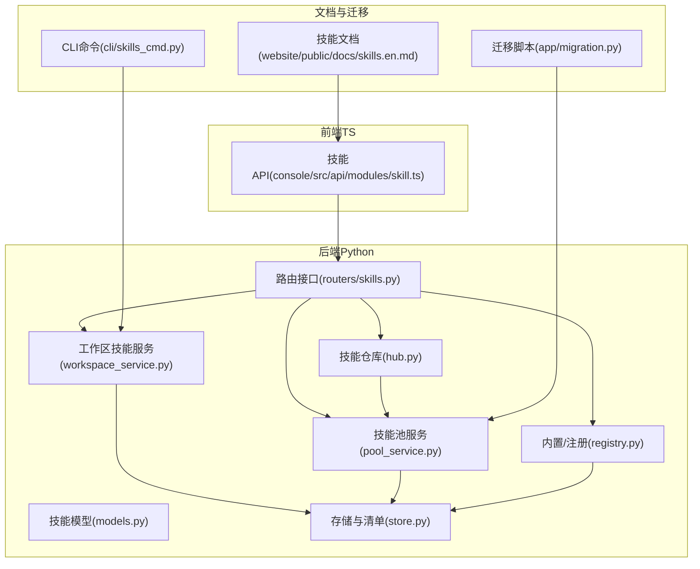
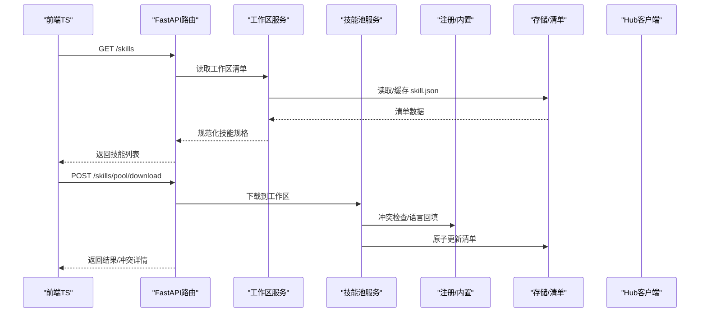
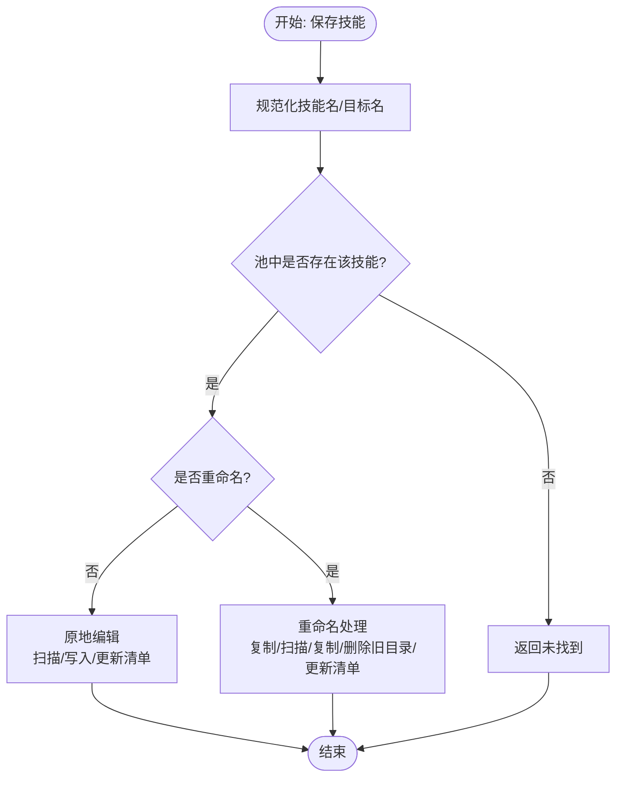
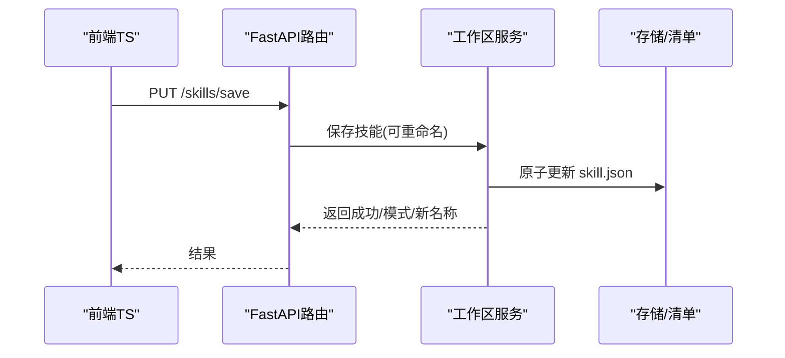
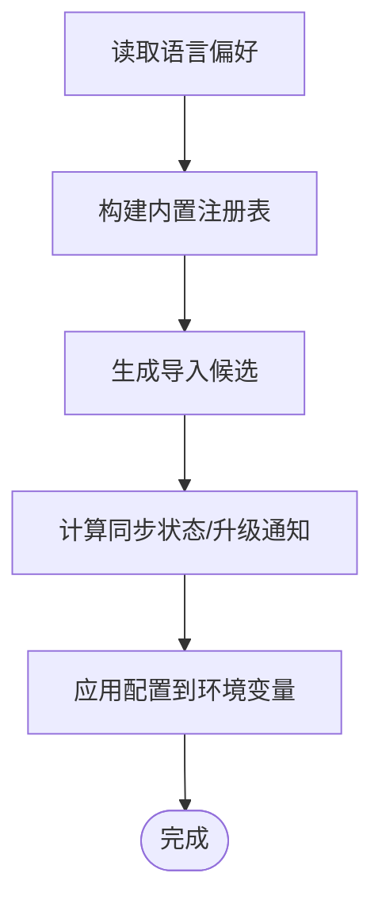
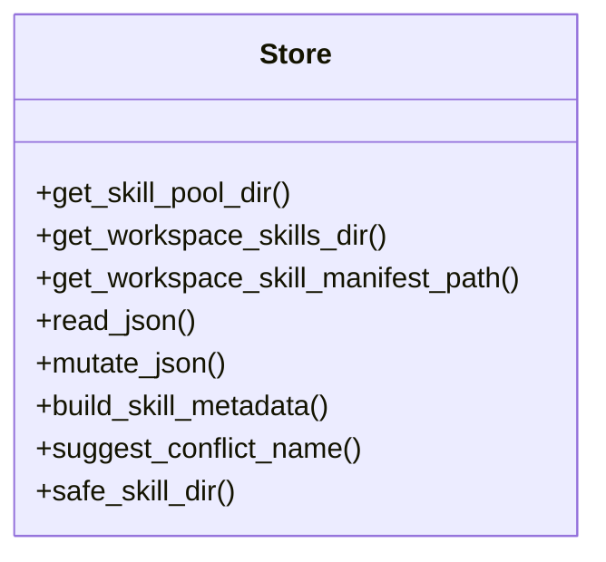
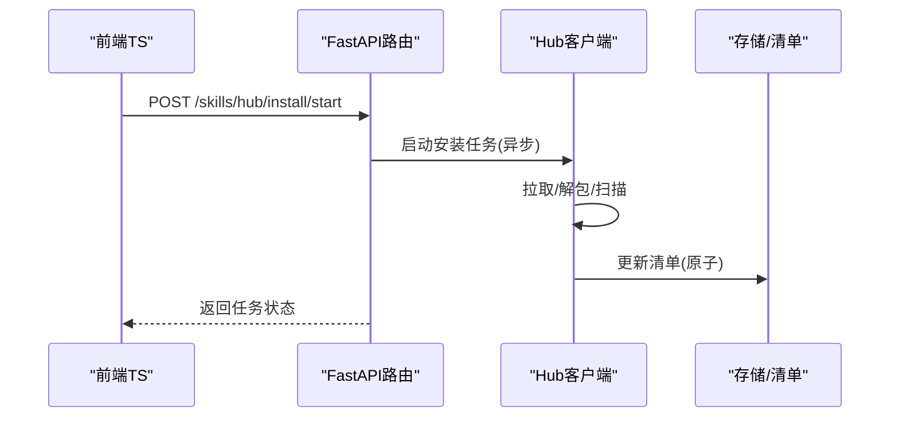
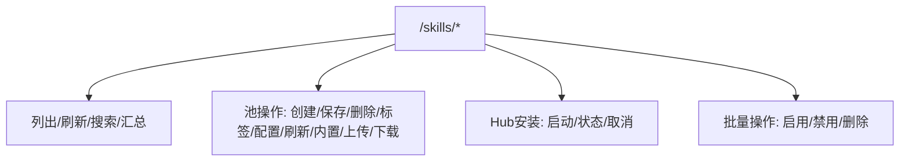
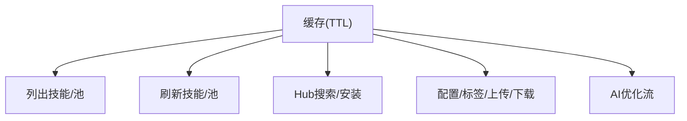
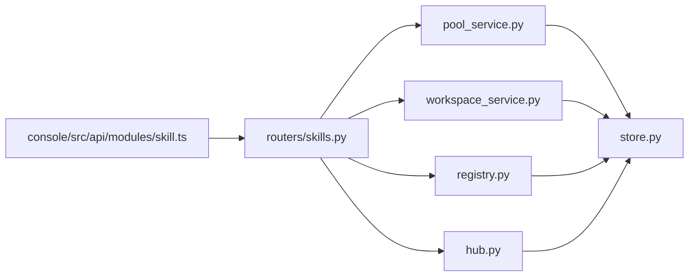

# 技能池管理

<cite>
**本文引用的文件**
- [src/qwenpaw/agents/skill_system/pool_service.py](file://src/qwenpaw/agents/skill_system/pool_service.py)
- [src/qwenpaw/agents/skill_system/workspace_service.py](file://src/qwenpaw/agents/skill_system/workspace_service.py)
- [src/qwenpaw/agents/skill_system/registry.py](file://src/qwenpaw/agents/skill_system/registry.py)
- [src/qwenpaw/agents/skill_system/store.py](file://src/qwenpaw/agents/skill_system/store.py)
- [src/qwenpaw/agents/skill_system/hub.py](file://src/qwenpaw/agents/skill_system/hub.py)
- [src/qwenpaw/agents/skill_system/models.py](file://src/qwenpaw/agents/skill_system/models.py)
- [src/qwenpaw/app/routers/skills.py](file://src/qwenpaw/app/routers/skills.py)
- [console/src/api/modules/skill.ts](file://console/src/api/modules/skill.ts)
- [website/public/docs/skills.en.md](file://website/public/docs/skills.en.md)
- [src/qwenpaw/app/migration.py](file://src/qwenpaw/app/migration.py)
- [src/qwenpaw/cli/skills_cmd.py](file://src/qwenpaw/cli/skills_cmd.py)
</cite>

## 目录
1. [简介](#简介)
2. [项目结构](#项目结构)
3. [核心组件](#核心组件)
4. [架构总览](#架构总览)
5. [详细组件分析](#详细组件分析)
6. [依赖关系分析](#依赖关系分析)
7. [性能考量](#性能考量)
8. [故障排除指南](#故障排除指南)
9. [结论](#结论)
10. [附录：API 参考与使用示例](#附录api-参考与使用示例)

## 简介
本技术文档围绕 QwenPaw 的“技能池管理”能力，系统阐述技能池服务的架构设计、技能注册机制、技能清单管理、初始化流程、冲突检测与解决、清单读取/解析/同步、目录结构与存储策略、配置管理与环境变量覆盖、版本控制，以及维护、性能优化与故障排除的最佳实践，并提供完整的 API 参考与使用示例。

## 项目结构
技能池管理涉及后端 Python 服务层（技能系统）、FastAPI 路由层（对外 API）、前端 TypeScript 客户端模块（缓存与调用），以及文档与迁移脚本等辅助模块。

图示来源
- [src/qwenpaw/agents/skill_system/models.py:45-77](file://src/qwenpaw/agents/skill_system/models.py#L45-L77)
- [src/qwenpaw/agents/skill_system/store.py:56-101](file://src/qwenpaw/agents/skill_system/store.py#L56-L101)
- [src/qwenpaw/agents/skill_system/workspace_service.py:40-58](file://src/qwenpaw/agents/skill_system/workspace_service.py#L40-L58)
- [src/qwenpaw/agents/skill_system/pool_service.py:45-66](file://src/qwenpaw/agents/skill_system/pool_service.py#L45-L66)
- [src/qwenpaw/agents/skill_system/registry.py:1-120](file://src/qwenpaw/agents/skill_system/registry.py#L1-L120)
- [src/qwenpaw/agents/skill_system/hub.py:1-120](file://src/qwenpaw/agents/skill_system/hub.py#L1-L120)
- [src/qwenpaw/app/routers/skills.py:69-120](file://src/qwenpaw/app/routers/skills.py#L69-L120)
- [console/src/api/modules/skill.ts:1-64](file://console/src/api/modules/skill.ts#L1-L64)
- [website/public/docs/skills.en.md:1-56](file://website/public/docs/skills.en.md#L1-L56)
- [src/qwenpaw/app/migration.py:339-377](file://src/qwenpaw/app/migration.py#L339-L377)
- [src/qwenpaw/cli/skills_cmd.py:242-281](file://src/qwenpaw/cli/skills_cmd.py#L242-L281)

章节来源
- [website/public/docs/skills.en.md:1-56](file://website/public/docs/skills.en.md#L1-L56)

## 核心组件
- 技能模型与需求定义：统一技能信息结构、渠道路由常量、技能需求字段。
- 存储与清单：路径解析、文件锁与原子写入、清单读取与缓存、元数据构建、冲突建议与规范化。
- 工作区技能服务：工作区范围内的技能生命周期（创建/编辑/导入/启用/禁用/删除/文件读取）。
- 技能池服务：共享技能池的生命周期（创建/导入ZIP/上传/下载/删除/标签/保存）。
- 内置/注册：内置技能语言偏好、包内内置发现与变体选择、导入候选构建、语言切换与版本同步状态。
- 技能仓库：Hub 搜索、安装任务、取消、HTTP 重试与超时、文件提取与安全校验。
- 路由接口：对外 API，暴露技能列表、刷新、Hub 搜索/安装、池操作、配置与标签管理。
- 前端 API：TS 封装，含缓存失效策略与请求封装。
- 迁移与 CLI：历史技能迁移、批量启用/禁用/删除等 CLI 能力。

章节来源
- [src/qwenpaw/agents/skill_system/models.py:13-77](file://src/qwenpaw/agents/skill_system/models.py#L13-L77)
- [src/qwenpaw/agents/skill_system/store.py:56-101](file://src/qwenpaw/agents/skill_system/store.py#L56-L101)
- [src/qwenpaw/agents/skill_system/workspace_service.py:40-96](file://src/qwenpaw/agents/skill_system/workspace_service.py#L40-L96)
- [src/qwenpaw/agents/skill_system/pool_service.py:45-82](file://src/qwenpaw/agents/skill_system/pool_service.py#L45-L82)
- [src/qwenpaw/agents/skill_system/registry.py:77-120](file://src/qwenpaw/agents/skill_system/registry.py#L77-L120)
- [src/qwenpaw/agents/skill_system/hub.py:96-165](file://src/qwenpaw/agents/skill_system/hub.py#L96-L165)
- [src/qwenpaw/app/routers/skills.py:69-120](file://src/qwenpaw/app/routers/skills.py#L69-L120)
- [console/src/api/modules/skill.ts:17-64](file://console/src/api/modules/skill.ts#L17-L64)

## 架构总览
技能池管理采用分层架构：
- 表现层：前端 TS 模块通过 HTTP 调用后端 FastAPI 接口。
- 控制层：FastAPI 路由根据请求参数选择工作区或技能池服务，调用注册与存储模块。
- 服务层：工作区/技能池服务负责业务逻辑；内置注册负责语言与版本同步；Hub 负责外部仓库交互。
- 数据层：存储模块提供跨进程文件锁、原子写入、清单缓存与元数据构建。

图示来源
- [src/qwenpaw/app/routers/skills.py:513-580](file://src/qwenpaw/app/routers/skills.py#L513-L580)
- [src/qwenpaw/agents/skill_system/workspace_service.py:66-96](file://src/qwenpaw/agents/skill_system/workspace_service.py#L66-L96)
- [src/qwenpaw/agents/skill_system/pool_service.py:743-790](file://src/qwenpaw/agents/skill_system/pool_service.py#L743-L790)
- [src/qwenpaw/agents/skill_system/registry.py:393-452](file://src/qwenpaw/agents/skill_system/registry.py#L393-L452)
- [src/qwenpaw/agents/skill_system/store.py:269-320](file://src/qwenpaw/agents/skill_system/store.py#L269-L320)
- [src/qwenpaw/agents/skill_system/hub.py:300-430](file://src/qwenpaw/agents/skill_system/hub.py#L300-L430)

## 详细组件分析

### 技能池服务（SkillPoolService）
职责与能力：
- 列出池中所有技能
- 创建/导入 ZIP/从工作区上传到池/从池下载到工作区
- 删除、设置标签、保存（支持原地编辑与重命名）
- 冲突检测与解决（名称冲突、语言切换、版本升级）

关键流程与要点：
- 创建技能：内容校验、规范化目录名、扫描与复制、原子更新池清单。
- 导入 ZIP：解压校验、重命名映射、冲突检测、扫描与复制、原子更新。
- 上传/下载：冲突检查（内置版本/语言一致性）、必要时回填语言、原子更新。
- 保存：支持原地编辑与重命名，保持元数据与配置一致。

图示来源
- [src/qwenpaw/agents/skill_system/pool_service.py:370-554](file://src/qwenpaw/agents/skill_system/pool_service.py#L370-L554)

章节来源
- [src/qwenpaw/agents/skill_system/pool_service.py:70-82](file://src/qwenpaw/agents/skill_system/pool_service.py#L70-L82)
- [src/qwenpaw/agents/skill_system/pool_service.py:157-264](file://src/qwenpaw/agents/skill_system/pool_service.py#L157-L264)
- [src/qwenpaw/agents/skill_system/pool_service.py:555-624](file://src/qwenpaw/agents/skill_system/pool_service.py#L555-L624)
- [src/qwenpaw/agents/skill_system/pool_service.py:743-800](file://src/qwenpaw/agents/skill_system/pool_service.py#L743-L800)

### 工作区技能服务（SkillService）
职责与能力：
- 列出可用技能（基于运行时解析）
- 创建/编辑/导入 ZIP/启用/禁用/删除/读取文件
- 设置通道范围与标签，持久化配置

关键流程与要点：
- 创建：内容校验、扫描、复制、原子更新工作区清单。
- 编辑/重命名：原地编辑或复制重命名，保留配置与标签。
- 启用/禁用：扫描策略确保合规后再变更状态。
- 文件读取：路径安全校验，仅允许 references/scripts 子树。

图示来源
- [src/qwenpaw/agents/skill_system/workspace_service.py:197-333](file://src/qwenpaw/agents/skill_system/workspace_service.py#L197-L333)
- [src/qwenpaw/app/routers/skills.py:796-865](file://src/qwenpaw/app/routers/skills.py#L796-L865)

章节来源
- [src/qwenpaw/agents/skill_system/workspace_service.py:66-96](file://src/qwenpaw/agents/skill_system/workspace_service.py#L66-L96)
- [src/qwenpaw/agents/skill_system/workspace_service.py:197-333](file://src/qwenpaw/agents/skill_system/workspace_service.py#L197-L333)
- [src/qwenpaw/agents/skill_system/workspace_service.py:334-400](file://src/qwenpaw/agents/skill_system/workspace_service.py#L334-L400)
- [src/qwenpaw/agents/skill_system/workspace_service.py:490-562](file://src/qwenpaw/agents/skill_system/workspace_service.py#L490-L562)

### 内置/注册（Registry）
职责与能力：
- 内置技能语言偏好与缓存
- 包内内置发现、变体选择、语言规范
- 构建导入候选、内置同步状态与升级通知
- 应用技能配置到环境变量（按需注入）

关键流程与要点：
- 语言偏好：从设置/UI语言推断，支持缓存。
- 导入候选：结合池状态与变体，输出多语言规格与状态。
- 同步状态：比较池中版本与包内版本，生成“已同步/过期/冲突”等状态。
- 配置注入：将技能配置映射为环境变量，支持按需覆盖。

图示来源
- [src/qwenpaw/agents/skill_system/registry.py:77-120](file://src/qwenpaw/agents/skill_system/registry.py#L77-L120)
- [src/qwenpaw/agents/skill_system/registry.py:554-575](file://src/qwenpaw/agents/skill_system/registry.py#L554-L575)
- [src/qwenpaw/agents/skill_system/registry.py:794-800](file://src/qwenpaw/agents/skill_system/registry.py#L794-L800)

章节来源
- [src/qwenpaw/agents/skill_system/registry.py:77-120](file://src/qwenpaw/agents/skill_system/registry.py#L77-L120)
- [src/qwenpaw/agents/skill_system/registry.py:554-575](file://src/qwenpaw/agents/skill_system/registry.py#L554-L575)
- [src/qwenpaw/agents/skill_system/registry.py:342-387](file://src/qwenpaw/agents/skill_system/registry.py#L342-L387)

### 存储与清单（Store）
职责与能力：
- 路径解析：技能池目录、工作区技能目录、清单路径
- 文件锁与原子写：跨进程互斥、临时文件写入、版本号递增
- 清单缓存：基于 mtime 的缓存与失效
- 元数据构建：从 SKILL.md 提取 frontmatter、版本、要求、更新时间
- 冲突建议：时间戳后缀重命名建议
- 安全校验：ZIP 解压安全、路径安全、扫描策略

图示来源
- [src/qwenpaw/agents/skill_system/store.py:56-101](file://src/qwenpaw/agents/skill_system/store.py#L56-L101)
- [src/qwenpaw/agents/skill_system/store.py:269-320](file://src/qwenpaw/agents/skill_system/store.py#L269-L320)
- [src/qwenpaw/agents/skill_system/store.py:555-580](file://src/qwenpaw/agents/skill_system/store.py#L555-L580)
- [src/qwenpaw/agents/skill_system/store.py:590-625](file://src/qwenpaw/agents/skill_system/store.py#L590-L625)
- [src/qwenpaw/agents/skill_system/store.py:445-476](file://src/qwenpaw/agents/skill_system/store.py#L445-L476)

章节来源
- [src/qwenpaw/agents/skill_system/store.py:56-101](file://src/qwenpaw/agents/skill_system/store.py#L56-L101)
- [src/qwenpaw/agents/skill_system/store.py:269-320](file://src/qwenpaw/agents/skill_system/store.py#L269-L320)
- [src/qwenpaw/agents/skill_system/store.py:555-580](file://src/qwenpaw/agents/skill_system/store.py#L555-L580)
- [src/qwenpaw/agents/skill_system/store.py:590-625](file://src/qwenpaw/agents/skill_system/store.py#L590-L625)

### 技能仓库（Hub）
职责与能力：
- Hub 搜索、版本解析、文件拉取
- ZIP/Bundle 正规化、内容提取、错误消息提取
- HTTP 请求与重试、超时与退避、速率限制处理
- 取消检查、任务状态管理

图示来源
- [src/qwenpaw/agents/skill_system/hub.py:300-430](file://src/qwenpaw/agents/skill_system/hub.py#L300-L430)
- [src/qwenpaw/app/routers/skills.py:427-511](file://src/qwenpaw/app/routers/skills.py#L427-L511)

章节来源
- [src/qwenpaw/agents/skill_system/hub.py:96-165](file://src/qwenpaw/agents/skill_system/hub.py#L96-L165)
- [src/qwenpaw/agents/skill_system/hub.py:582-729](file://src/qwenpaw/agents/skill_system/hub.py#L582-L729)
- [src/qwenpaw/app/routers/skills.py:657-715](file://src/qwenpaw/app/routers/skills.py#L657-L715)

### 路由接口（Skills Router）
职责与能力：
- 技能列表、刷新、搜索 Hub、工作区汇总
- 池操作：创建/保存/删除/标签/配置/刷新/内置源/升级通知/上传/下载
- Hub 安装任务：启动/查询/取消
- 批量启用/禁用/删除

图示来源
- [src/qwenpaw/app/routers/skills.py:608-655](file://src/qwenpaw/app/routers/skills.py#L608-L655)
- [src/qwenpaw/app/routers/skills.py:717-759](file://src/qwenpaw/app/routers/skills.py#L717-L759)
- [src/qwenpaw/app/routers/skills.py:657-715](file://src/qwenpaw/app/routers/skills.py#L657-L715)

章节来源
- [src/qwenpaw/app/routers/skills.py:608-655](file://src/qwenpaw/app/routers/skills.py#L608-L655)
- [src/qwenpaw/app/routers/skills.py:717-759](file://src/qwenpaw/app/routers/skills.py#L717-L759)
- [src/qwenpaw/app/routers/skills.py:796-865](file://src/qwenpaw/app/routers/skills.py#L796-L865)
- [src/qwenpaw/app/routers/skills.py:867-930](file://src/qwenpaw/app/routers/skills.py#L867-L930)

### 前端 API（Console Skill Module）
职责与能力：
- 缓存策略：基于 TTL 的内存缓存与失效
- 统一封装：技能列表、刷新、Hub 搜索、池操作、配置与标签、流式优化
- 错误处理：结构化错误响应

图示来源
- [console/src/api/modules/skill.ts:17-64](file://console/src/api/modules/skill.ts#L17-L64)
- [console/src/api/modules/skill.ts:118-178](file://console/src/api/modules/skill.ts#L118-L178)
- [console/src/api/modules/skill.ts:335-381](file://console/src/api/modules/skill.ts#L335-L381)
- [console/src/api/modules/skill.ts:495-556](file://console/src/api/modules/skill.ts#L495-L556)

章节来源
- [console/src/api/modules/skill.ts:17-64](file://console/src/api/modules/skill.ts#L17-L64)
- [console/src/api/modules/skill.ts:118-178](file://console/src/api/modules/skill.ts#L118-L178)
- [console/src/api/modules/skill.ts:335-381](file://console/src/api/modules/skill.ts#L335-L381)
- [console/src/api/modules/skill.ts:495-556](file://console/src/api/modules/skill.ts#L495-L556)

## 依赖关系分析
- 路由依赖：routers/skills.py 依赖技能系统各模块（pool_service、workspace_service、registry、store、hub）。
- 服务依赖：pool_service/workspace_service 依赖 store 与 registry。
- 注册依赖：registry 依赖 store 与 models。
- Hub 依赖：hub 依赖 registry 与 store。
- 前端依赖：console/src/api/modules/skill.ts 依赖后端路由。

图示来源
- [src/qwenpaw/app/routers/skills.py:26-65](file://src/qwenpaw/app/routers/skills.py#L26-L65)
- [src/qwenpaw/agents/skill_system/pool_service.py:14-43](file://src/qwenpaw/agents/skill_system/pool_service.py#L14-L43)
- [src/qwenpaw/agents/skill_system/workspace_service.py:13-38](file://src/qwenpaw/agents/skill_system/workspace_service.py#L13-L38)
- [src/qwenpaw/agents/skill_system/registry.py:23-44](file://src/qwenpaw/agents/skill_system/registry.py#L23-L44)
- [src/qwenpaw/agents/skill_system/hub.py:26-33](file://src/qwenpaw/agents/skill_system/hub.py#L26-L33)
- [console/src/api/modules/skill.ts:1-12](file://console/src/api/modules/skill.ts#L1-L12)

章节来源
- [src/qwenpaw/app/routers/skills.py:26-65](file://src/qwenpaw/app/routers/skills.py#L26-L65)
- [src/qwenpaw/agents/skill_system/pool_service.py:14-43](file://src/qwenpaw/agents/skill_system/pool_service.py#L14-L43)
- [src/qwenpaw/agents/skill_system/workspace_service.py:13-38](file://src/qwenpaw/agents/skill_system/workspace_service.py#L13-L38)
- [src/qwenpaw/agents/skill_system/registry.py:23-44](file://src/qwenpaw/agents/skill_system/registry.py#L23-L44)
- [src/qwenpaw/agents/skill_system/hub.py:26-33](file://src/qwenpaw/agents/skill_system/hub.py#L26-L33)
- [console/src/api/modules/skill.ts:1-12](file://console/src/api/modules/skill.ts#L1-L12)

## 性能考量
- 清单缓存：基于 mtime 的缓存减少磁盘读取与 JSON 解析开销。
- 原子写入：跨进程文件锁与临时文件写入，避免并发写入导致的数据损坏。
- ZIP 安全与大小限制：解压前校验路径与符号链接，限制 ZIP 总大小与条目数。
- HTTP 重试与退避：对临时错误进行指数退避重试，降低 Hub 访问抖动。
- 扫描策略：在启用/保存前执行安全扫描，避免后续运行时风险。
- 前端缓存：30 秒 TTL 的内存缓存，减少重复请求。

章节来源
- [src/qwenpaw/agents/skill_system/store.py:632-671](file://src/qwenpaw/agents/skill_system/store.py#L632-L671)
- [src/qwenpaw/agents/skill_system/store.py:401-422](file://src/qwenpaw/agents/skill_system/store.py#L401-L422)
- [src/qwenpaw/agents/skill_system/hub.py:161-165](file://src/qwenpaw/agents/skill_system/hub.py#L161-L165)
- [src/qwenpaw/agents/skill_system/hub.py:300-430](file://src/qwenpaw/agents/skill_system/hub.py#L300-L430)
- [console/src/api/modules/skill.ts:17-33](file://console/src/api/modules/skill.ts#L17-L33)

## 故障排除指南
常见问题与处理：
- 扫描失败（422）：返回结构化扫描结果，包含严重级别与发现项，前端可据此提示用户。
- 冲突与重命名：返回冲突原因与建议的新名称，支持覆盖开关。
- Hub 安装取消：清理已导入但未启用的技能，恢复状态。
- 清单损坏：读取时自动回退默认值并记录警告。
- 语言切换冲突：池中内置技能与工作区现有版本/语言不一致时，阻断并提示。

章节来源
- [src/qwenpaw/app/routers/skills.py:75-116](file://src/qwenpaw/app/routers/skills.py#L75-L116)
- [src/qwenpaw/agents/skill_system/pool_service.py:626-723](file://src/qwenpaw/agents/skill_system/pool_service.py#L626-L723)
- [src/qwenpaw/app/routers/skills.py:427-511](file://src/qwenpaw/app/routers/skills.py#L427-L511)
- [src/qwenpaw/agents/skill_system/store.py:269-282](file://src/qwenpaw/agents/skill_system/store.py#L269-L282)

## 结论
QwenPaw 的技能池管理以清晰的分层架构与强健的存储/清单机制为基础，结合内置注册与 Hub 仓库，实现了从创建、导入、同步到运行时解析的完整闭环。通过冲突检测、语言与版本同步、配置注入与安全扫描，系统在灵活性与安全性之间取得平衡。前端缓存与后端原子写入进一步提升了用户体验与数据一致性。

## 附录：API 参考与使用示例

### 技能池管理 API
- 获取技能池技能列表
  - 方法：GET
  - 路径：/skills/pool
  - 响应：PoolSkillSpec[]
- 刷新技能池
  - 方法：POST
  - 路径：/skills/pool/refresh
  - 响应：PoolSkillSpec[]
- 获取内置候选
  - 方法：GET
  - 路径：/skills/pool/builtin-sources
  - 响应：BuiltinImportSpec[]
- 获取内置升级通知
  - 方法：GET
  - 路径：/skills/pool/builtin-notice
  - 响应：BuiltinUpdateNotice
- 从 Hub 安装到池
  - 方法：POST
  - 路径：/skills/pool/import
  - 请求体：HubInstallRequest
  - 响应：安装结果
- 上传工作区技能到池
  - 方法：POST
  - 路径：/skills/pool/upload
  - 请求体：UploadToPoolRequest
  - 响应：上传结果
- 从池下载到工作区
  - 方法：POST
  - 路径：/skills/pool/download
  - 请求体：DownloadFromPoolRequest
  - 响应：下载结果/冲突详情
- 创建池技能
  - 方法：POST
  - 路径：/skills/pool/create
  - 请求体：CreateSkillRequest
  - 响应：{ created: boolean, name: string }
- 保存池技能
  - 方法：PUT
  - 路径：/skills/pool/save
  - 请求体：SavePoolSkillRequest
  - 响应：{ success: boolean, mode: string, name: string }
- 删除池技能
  - 方法：DELETE
  - 路径：/skills/pool/{skill_name}
  - 响应：{ deleted: boolean }
- 获取/更新/删除池技能配置
  - GET：/skills/pool/{skill_name}/config
  - PUT：/skills/pool/{skill_name}/config
  - DELETE：/skills/pool/{skill_name}/config
- 设置池技能标签
  - PUT：/skills/pool/{skill_name}/tags
  - 响应：{ updated: boolean, tags: string[] }

章节来源
- [src/qwenpaw/app/routers/skills.py:717-759](file://src/qwenpaw/app/routers/skills.py#L717-L759)
- [src/qwenpaw/app/routers/skills.py:761-865](file://src/qwenpaw/app/routers/skills.py#L761-L865)
- [src/qwenpaw/app/routers/skills.py:867-930](file://src/qwenpaw/app/routers/skills.py#L867-L930)
- [src/qwenpaw/app/routers/skills.py:1156-1211](file://src/qwenpaw/app/routers/skills.py#L1156-L1211)

### 工作区技能 API
- 获取技能列表/刷新
  - GET /skills
  - POST /skills/refresh
- 创建/保存/启用/禁用/删除
  - POST /skills
  - PUT /skills/save
  - POST /skills/{name}/enable
  - POST /skills/{name}/disable
  - DELETE /skills/{name}
- 批量操作
  - POST /skills/batch-enable
  - POST /skills/batch-disable
  - POST /skills/batch-delete
- 上传 ZIP
  - POST /skills/upload
- 获取/更新/删除配置
  - GET /skills/{name}/config
  - PUT /skills/{name}/config
  - DELETE /skills/{name}/config
- 设置标签与通道
  - PUT /skills/{name}/tags
  - PUT /skills/{name}/channels

章节来源
- [src/qwenpaw/app/routers/skills.py:608-655](file://src/qwenpaw/app/routers/skills.py#L608-L655)
- [src/qwenpaw/app/routers/skills.py:761-865](file://src/qwenpaw/app/routers/skills.py#L761-L865)
- [src/qwenpaw/app/routers/skills.py:931-1010](file://src/qwenpaw/app/routers/skills.py#L931-L1010)
- [src/qwenpaw/app/routers/skills.py:1011-1155](file://src/qwenpaw/app/routers/skills.py#L1011-L1155)

### Hub 安装任务 API
- 启动安装
  - POST /skills/hub/install/start
  - 响应：HubInstallTask
- 查询状态
  - GET /skills/hub/install/status/{task_id}
- 取消安装
  - POST /skills/hub/install/cancel/{task_id}

章节来源
- [src/qwenpaw/app/routers/skills.py:657-715](file://src/qwenpaw/app/routers/skills.py#L657-L715)
- [src/qwenpaw/app/routers/skills.py:686-715](file://src/qwenpaw/app/routers/skills.py#L686-L715)

### 前端调用示例（TS）
- 列出技能池技能
  - skillApi.listSkillPoolSkills()
- 刷新技能池
  - skillApi.refreshSkillPool()
- Hub 搜索
  - skillApi.searchHubSkills(query, limit)
- 上传 ZIP 到工作区
  - skillApi.uploadSkill(file, { enable, target_name, rename_map })
- 上传 ZIP 到池
  - skillApi.uploadSkillPoolZip(file, { target_name, rename_map })
- 流式优化
  - skillApi.streamOptimizeSkill(content, onChunk, signal, language)

章节来源
- [console/src/api/modules/skill.ts:140-178](file://console/src/api/modules/skill.ts#L140-L178)
- [console/src/api/modules/skill.ts:179-183](file://console/src/api/modules/skill.ts#L179-L183)
- [console/src/api/modules/skill.ts:558-593](file://console/src/api/modules/skill.ts#L558-L593)
- [console/src/api/modules/skill.ts:495-556](file://console/src/api/modules/skill.ts#L495-L556)

### 目录结构与存储策略
- 技能池目录：$WORKING_DIR/skill_pool/
  - skill.json：池清单
  - 每个技能目录包含 SKILL.md 与可选 references/scripts
- 工作区技能目录：$WORKING_DIR/workspaces/{agent_id}/skills/
  - skill.json：工作区清单
  - 技能目录同上
- 迁移策略：历史技能迁移至池与工作区，保证兼容性

章节来源
- [website/public/docs/skills.en.md:20-51](file://website/public/docs/skills.en.md#L20-L51)
- [src/qwenpaw/app/migration.py:339-377](file://src/qwenpaw/app/migration.py#L339-L377)

### 配置管理与环境变量覆盖
- 技能配置注入：按需将配置键映射为环境变量，同时提供完整 JSON 变量
- 作用域：按通道与工作区生效，避免全局污染
- CLI 批量启用/禁用/删除：配合批量操作 API 使用

章节来源
- [src/qwenpaw/agents/skill_system/registry.py:259-301](file://src/qwenpaw/agents/skill_system/registry.py#L259-L301)
- [src/qwenpaw/agents/skill_system/registry.py:342-387](file://src/qwenpaw/agents/skill_system/registry.py#L342-L387)
- [src/qwenpaw/cli/skills_cmd.py:242-281](file://src/qwenpaw/cli/skills_cmd.py#L242-L281)