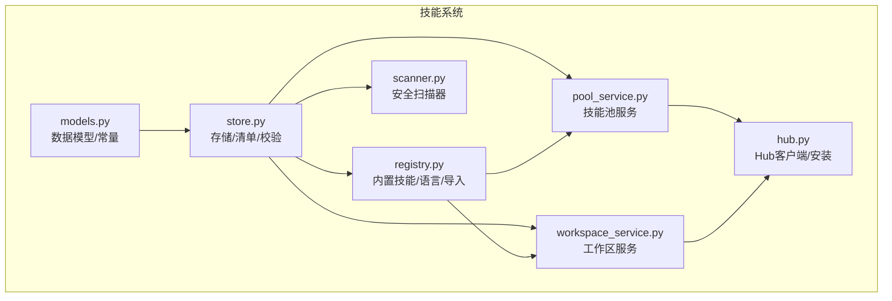
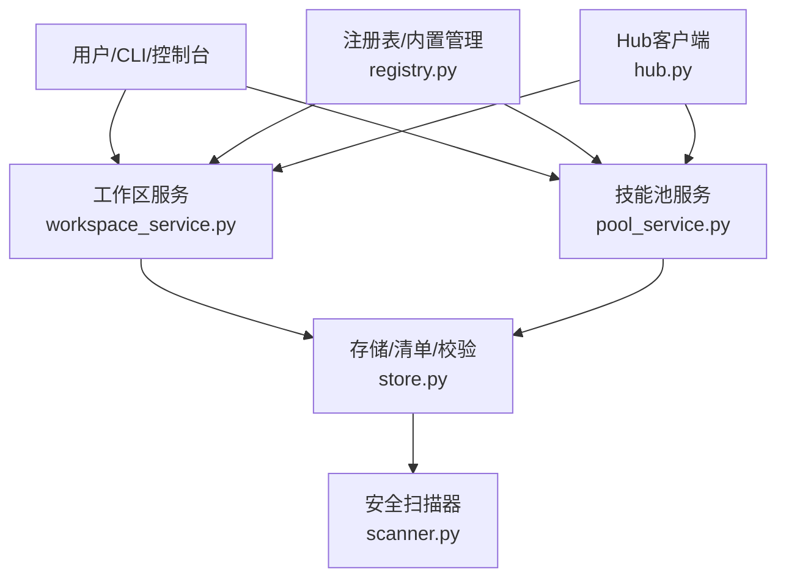
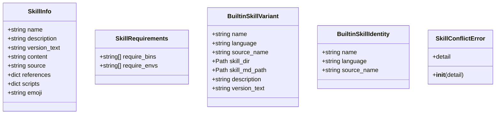
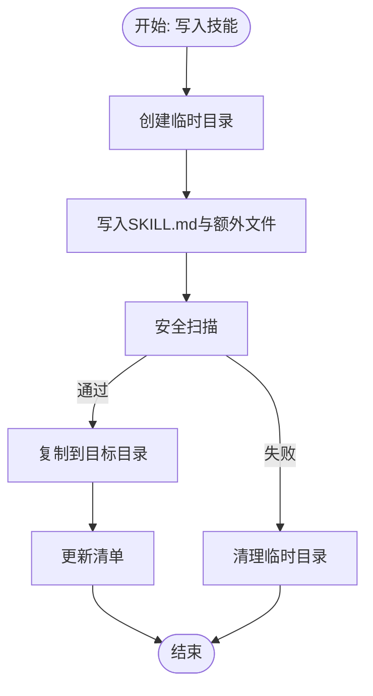
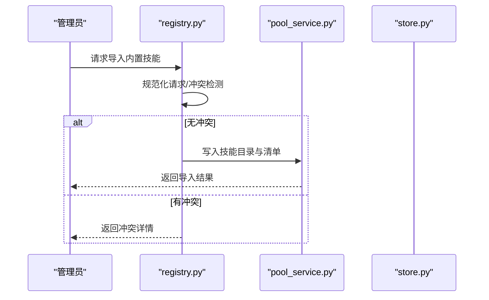
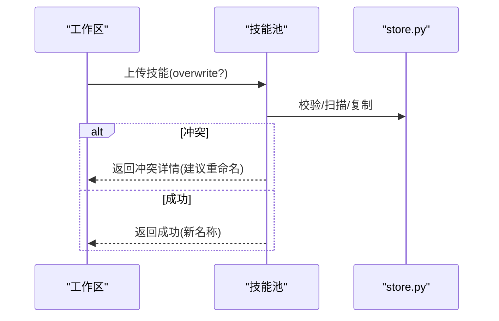
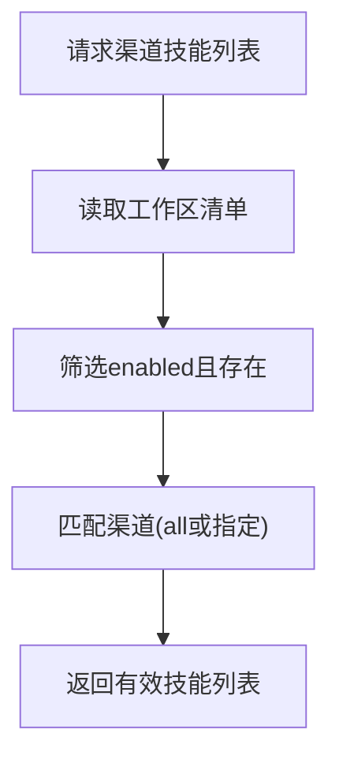
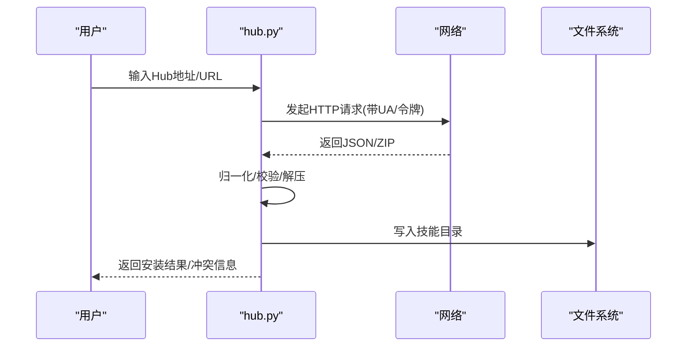
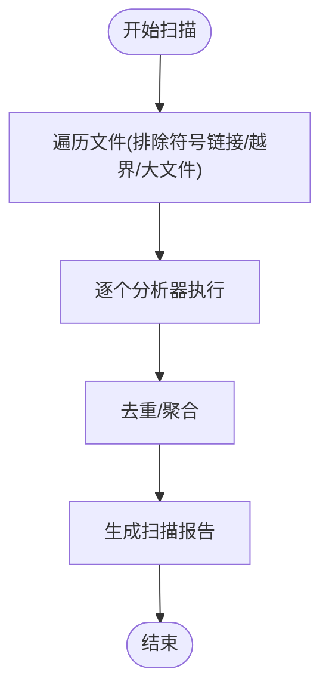
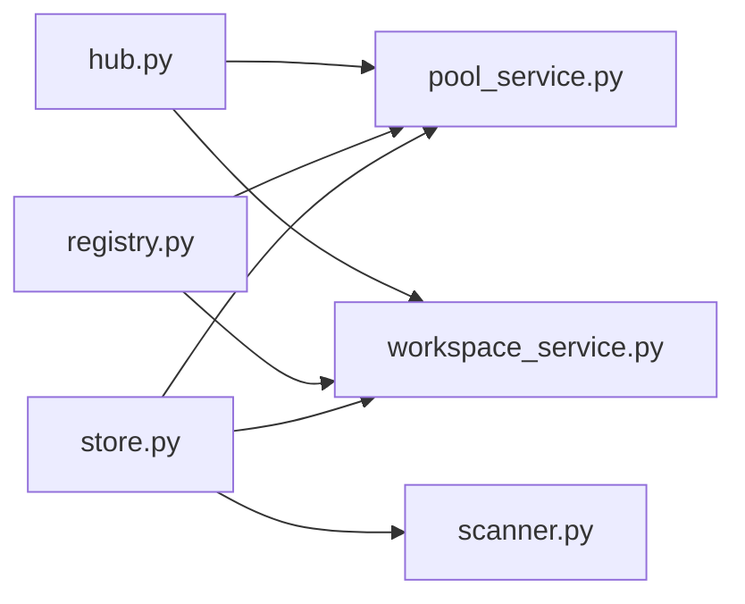

# 技能系统

<cite>
**本文引用的文件**
- [src/qwenpaw/agents/skill_system/__init__.py](file://src/qwenpaw/agents/skill_system/__init__.py)
- [src/qwenpaw/agents/skill_system/models.py](file://src/qwenpaw/agents/skill_system/models.py)
- [src/qwenpaw/agents/skill_system/store.py](file://src/qwenpaw/agents/skill_system/store.py)
- [src/qwenpaw/agents/skill_system/registry.py](file://src/qwenpaw/agents/skill_system/registry.py)
- [src/qwenpaw/agents/skill_system/pool_service.py](file://src/qwenpaw/agents/skill_system/pool_service.py)
- [src/qwenpaw/agents/skill_system/workspace_service.py](file://src/qwenpaw/agents/skill_system/workspace_service.py)
- [src/qwenpaw/agents/skill_system/hub.py](file://src/qwenpaw/agents/skill_system/hub.py)
- [src/qwenpaw/security/skill_scanner/scanner.py](file://src/qwenpaw/security/skill_scanner/scanner.py)
- [src/qwenpaw/agents/skills/README.md](file://src/qwenpaw/agents/skills/README.md)
</cite>

## 目录
1. [简介](#简介)
2. [项目结构](#项目结构)
3. [核心组件](#核心组件)
4. [架构总览](#架构总览)
5. [详细组件分析](#详细组件分析)
6. [依赖关系分析](#依赖关系分析)
7. [性能考虑](#性能考虑)
8. [故障排查指南](#故障排查指南)
9. [结论](#结论)
10. [附录](#附录)

## 简介
本技术文档面向QwenPaw的技能系统，系统性阐述技能池管理、技能执行引擎与技能开发框架的设计原理与实现细节。文档覆盖以下主题：
- 技能池（共享）与工作区（Workspace）双层生命周期管理
- 内置技能的发现、语言偏好与版本同步策略
- 技能导入、导出、冲突检测与回滚保障
- 技能安全扫描与环境变量注入机制
- 技能注册、依赖管理与版本控制
- 自定义技能开发流程、测试调试与发布分享
- 性能优化与错误处理最佳实践

## 项目结构
技能系统位于Python包src/qwenpaw/agents/skill_system下，采用分层设计：
- models：技能数据模型与常量
- store：本地存储、清单读写、路径与校验工具
- registry：内置技能注册表、语言偏好、导入与同步
- pool_service：技能池服务（共享）
- workspace_service：工作区技能服务（私有）
- hub：技能仓库（Hub）客户端与安装辅助
- 安全扫描：基于PatternAnalyzer的安全扫描器

图表来源
- [src/qwenpaw/agents/skill_system/models.py:1-77](file://src/qwenpaw/agents/skill_system/models.py#L1-L77)
- [src/qwenpaw/agents/skill_system/store.py:1-852](file://src/qwenpaw/agents/skill_system/store.py#L1-L852)
- [src/qwenpaw/agents/skill_system/registry.py:1-1426](file://src/qwenpaw/agents/skill_system/registry.py#L1-L1426)
- [src/qwenpaw/agents/skill_system/pool_service.py:1-866](file://src/qwenpaw/agents/skill_system/pool_service.py#L1-L866)
- [src/qwenpaw/agents/skill_system/workspace_service.py:1-718](file://src/qwenpaw/agents/skill_system/workspace_service.py#L1-L718)
- [src/qwenpaw/agents/skill_system/hub.py:1-1736](file://src/qwenpaw/agents/skill_system/hub.py#L1-L1736)
- [src/qwenpaw/security/skill_scanner/scanner.py:1-319](file://src/qwenpaw/security/skill_scanner/scanner.py#L1-L319)

章节来源
- [src/qwenpaw/agents/skill_system/__init__.py:1-41](file://src/qwenpaw/agents/skill_system/__init__.py#L1-L41)

## 核心组件
- 数据模型与常量
  - SkillInfo：工作区或Hub技能详情（稳定运行时标识name、描述、版本、内容、来源、引用与脚本树等）
  - SkillRequirements：系统管理的技能依赖声明（二进制可执行与环境变量）
  - SkillConflictError：可重命名冲突异常
  - ALL_SKILL_ROUTING_CHANNELS：支持的路由通道列表
- 存储与清单
  - 路径获取：技能池目录、工作区技能目录、清单路径
  - 清单读写：跨进程原子写入、缓存与锁
  - 元数据构建：从SKILL.md解析frontmatter并生成manifest条目
  - 冲突建议：时间戳后缀重命名建议
  - ZIP导入：解压校验、路径安全、树形文件写入
  - 扫描：调用安全扫描器对技能目录进行扫描
- 注册与内置技能
  - 语言偏好：根据UI语言与设置选择内置技能语言
  - 内置注册表：打包内置技能变体（多语言）、版本提取
  - 导入内置：规范化请求、冲突检测、批量导入
  - 同步状态：比较池内内置与打包内置的版本差异
- 技能池服务
  - 列表、创建、导入ZIP、删除、标签设置、编辑/重命名保存、上传到池、下载到工作区、冲突检查与语言回填
- 工作区服务
  - 列表、可用技能（按渠道解析有效技能）、创建、导入ZIP、启用/禁用、渠道范围设置、标签设置、删除、文件读取
- Hub客户端
  - 多源URL解析（ClawHub、LobeHub、skills.sh、SkillsMP、ModelScope、GitHub）、HTTP重试退避、响应大小限制、ZIP包解析、冲突提示
- 安全扫描
  - 文件发现（跳过符号链接、越界路径、大文件、扩展白名单）、默认PatternAnalyzer、聚合结果与去重

章节来源
- [src/qwenpaw/agents/skill_system/models.py:1-77](file://src/qwenpaw/agents/skill_system/models.py#L1-L77)
- [src/qwenpaw/agents/skill_system/store.py:1-852](file://src/qwenpaw/agents/skill_system/store.py#L1-L852)
- [src/qwenpaw/agents/skill_system/registry.py:1-1426](file://src/qwenpaw/agents/skill_system/registry.py#L1-L1426)
- [src/qwenpaw/agents/skill_system/pool_service.py:1-866](file://src/qwenpaw/agents/skill_system/pool_service.py#L1-L866)
- [src/qwenpaw/agents/skill_system/workspace_service.py:1-718](file://src/qwenpaw/agents/skill_system/workspace_service.py#L1-L718)
- [src/qwenpaw/agents/skill_system/hub.py:1-1736](file://src/qwenpaw/agents/skill_system/hub.py#L1-L1736)
- [src/qwenpaw/security/skill_scanner/scanner.py:1-319](file://src/qwenpaw/security/skill_scanner/scanner.py#L1-L319)

## 架构总览
技能系统围绕“技能池（共享）—工作区（私有）—Hub（外部生态）”三层结构组织，通过清单与文件系统保持一致性，结合安全扫描与环境变量注入保障运行时安全与可配置性。

图表来源
- [src/qwenpaw/agents/skill_system/hub.py:1-1736](file://src/qwenpaw/agents/skill_system/hub.py#L1-L1736)
- [src/qwenpaw/agents/skill_system/registry.py:1-1426](file://src/qwenpaw/agents/skill_system/registry.py#L1-L1426)
- [src/qwenpaw/agents/skill_system/pool_service.py:1-866](file://src/qwenpaw/agents/skill_system/pool_service.py#L1-L866)
- [src/qwenpaw/agents/skill_system/workspace_service.py:1-718](file://src/qwenpaw/agents/skill_system/workspace_service.py#L1-L718)
- [src/qwenpaw/agents/skill_system/store.py:1-852](file://src/qwenpaw/agents/skill_system/store.py#L1-L852)
- [src/qwenpaw/security/skill_scanner/scanner.py:1-319](file://src/qwenpaw/security/skill_scanner/scanner.py#L1-L319)

## 详细组件分析

### 模型与数据结构
- SkillInfo：稳定运行时标识name用于API与同步；content来自SKILL.md；references与scripts以树形结构返回
- SkillRequirements：支持require_bins与require_envs两类系统依赖
- 冲突异常：SkillConflictError携带detail，便于UI提示与重命名建议

图表来源
- [src/qwenpaw/agents/skill_system/models.py:1-77](file://src/qwenpaw/agents/skill_system/models.py#L1-L77)

章节来源
- [src/qwenpaw/agents/skill_system/models.py:1-77](file://src/qwenpaw/agents/skill_system/models.py#L1-L77)

### 存储与清单（store）
- 路径与目录
  - 技能池目录：WORKING_DIR/skill_pool
  - 工作区技能目录：workspace_dir/skills（兼容旧版workspace_dir/skill）
  - 清单路径：skill.json
- 原子写入与跨进程锁
  - read_json/write_json_atomic/mutate_json：带锁的读写与版本号递增
  - mtime缓存：减少重复读取
- 元数据构建
  - 从SKILL.md解析frontmatter，提取name/description/version/emoji/requirements
  - classify_pool_skill_source：区分builtin/customized来源
- ZIP导入与安全
  - 解压校验、路径安全检查（禁止NUL、绝对路径、越界）、symlink拒绝
  - 树形文件写入references/scripts
- 扫描与暂存
  - scan_skill_dir_or_raise：调用安全扫描器
  - staged_skill_dir：临时目录写入，失败自动清理

图表来源
- [src/qwenpaw/agents/skill_system/store.py:748-852](file://src/qwenpaw/agents/skill_system/store.py#L748-L852)

章节来源
- [src/qwenpaw/agents/skill_system/store.py:1-852](file://src/qwenpaw/agents/skill_system/store.py#L1-L852)

### 注册与内置技能（registry）
- 语言偏好
  - 优先从settings.json读取builtin_skill_language，否则根据UI语言推断
- 内置注册表
  - 扫描打包内置目录，按name/language构建变体
  - 提供版本映射与语言选择逻辑
- 导入内置
  - 规范化导入请求、冲突检测（未知/不支持/语言切换/版本差异）
  - 批量导入并写入清单，保留config/tags
- 同步状态与更新通知
  - 对比池内builtin与打包内置版本，生成added/missing/updated/removed变更集
  - fingerprint指纹用于UI增量提示

图表来源
- [src/qwenpaw/agents/skill_system/registry.py:657-791](file://src/qwenpaw/agents/skill_system/registry.py#L657-L791)
- [src/qwenpaw/agents/skill_system/pool_service.py:157-264](file://src/qwenpaw/agents/skill_system/pool_service.py#L157-L264)

章节来源
- [src/qwenpaw/agents/skill_system/registry.py:1-1426](file://src/qwenpaw/agents/skill_system/registry.py#L1-L1426)

### 技能池服务（pool_service）
- 能力概览
  - 列出池中所有技能
  - 创建/导入ZIP/删除技能
  - 设置标签、编辑/重命名保存
  - 上传到池（从工作区）、下载到工作区（含冲突检查与语言回填）
- 冲突与回滚
  - 写入失败时回滚文件并抛出详细错误
  - 下载前检查语言切换/版本升级/同名冲突

图表来源
- [src/qwenpaw/agents/skill_system/pool_service.py:555-624](file://src/qwenpaw/agents/skill_system/pool_service.py#L555-L624)

章节来源
- [src/qwenpaw/agents/skill_system/pool_service.py:1-866](file://src/qwenpaw/agents/skill_system/pool_service.py#L1-L866)

### 工作区服务（workspace_service）
- 能力概览
  - 列出工作区内所有技能与可用技能（按渠道解析有效技能）
  - 创建/导入ZIP/启用/禁用/设置渠道/设置标签/删除
  - 读取references/scripts下的文件
- 运行时解析
  - resolve_effective_skills：按渠道过滤enabled且存在的技能

图表来源
- [src/qwenpaw/agents/skill_system/workspace_service.py:78-95](file://src/qwenpaw/agents/skill_system/workspace_service.py#L78-L95)
- [src/qwenpaw/agents/skill_system/registry.py:1109-1125](file://src/qwenpaw/agents/skill_system/registry.py#L1109-L1125)

章节来源
- [src/qwenpaw/agents/skill_system/workspace_service.py:1-718](file://src/qwenpaw/agents/skill_system/workspace_service.py#L1-L718)
- [src/qwenpaw/agents/skill_system/registry.py:1109-1125](file://src/qwenpaw/agents/skill_system/registry.py#L1109-L1125)

### Hub客户端与安装（hub）
- 多源支持
  - 支持ClawHub、LobeHub、skills.sh、SkillsMP、ModelScope、GitHub等多种入口
- 安全与可靠性
  - HTTP超时/重试/退避、响应大小限制、ZIP条目数量限制、速率限制处理
  - 取消检查（contextvar）支持用户取消导入
- 包装与归一化
  - 将不同源的响应统一为{name, files}结构，自动提取SKILL.md与references/scripts

图表来源
- [src/qwenpaw/agents/skill_system/hub.py:1579-1736](file://src/qwenpaw/agents/skill_system/hub.py#L1579-L1736)

章节来源
- [src/qwenpaw/agents/skill_system/hub.py:1-1736](file://src/qwenpaw/agents/skill_system/hub.py#L1-L1736)

### 安全扫描（scanner）
- 文件发现策略
  - 遍历技能目录，跳过符号链接、越界路径、大文件、扩展白名单
- 分析器
  - 默认PatternAnalyzer（正则签名），可扩展注册其他分析器
- 结果聚合
  - 去重、记录使用分析器与失败项、统计扫描耗时

图表来源
- [src/qwenpaw/security/skill_scanner/scanner.py:148-242](file://src/qwenpaw/security/skill_scanner/scanner.py#L148-L242)

章节来源
- [src/qwenpaw/security/skill_scanner/scanner.py:1-319](file://src/qwenpaw/security/skill_scanner/scanner.py#L1-L319)

## 依赖关系分析
- 组件耦合
  - pool_service/workspace_service均依赖store（路径、清单、校验、扫描）
  - registry负责内置技能语言与版本管理，被pool/workspace共同使用
  - hub独立于store但最终写入文件系统
- 外部依赖
  - frontmatter/yaml：SKILL.md解析
  - urllib/HTTP：Hub网络访问
  - fcntl/msvcrt：跨进程文件锁
  - 安全扫描器：PatternAnalyzer

图表来源
- [src/qwenpaw/agents/skill_system/store.py:1-852](file://src/qwenpaw/agents/skill_system/store.py#L1-L852)
- [src/qwenpaw/agents/skill_system/pool_service.py:1-866](file://src/qwenpaw/agents/skill_system/pool_service.py#L1-L866)
- [src/qwenpaw/agents/skill_system/workspace_service.py:1-718](file://src/qwenpaw/agents/skill_system/workspace_service.py#L1-L718)
- [src/qwenpaw/agents/skill_system/registry.py:1-1426](file://src/qwenpaw/agents/skill_system/registry.py#L1-L1426)
- [src/qwenpaw/agents/skill_system/hub.py:1-1736](file://src/qwenpaw/agents/skill_system/hub.py#L1-L1736)
- [src/qwenpaw/security/skill_scanner/scanner.py:1-319](file://src/qwenpaw/security/skill_scanner/scanner.py#L1-L319)

章节来源
- [src/qwenpaw/agents/skill_system/store.py:1-852](file://src/qwenpaw/agents/skill_system/store.py#L1-L852)
- [src/qwenpaw/agents/skill_system/registry.py:1-1426](file://src/qwenpaw/agents/skill_system/registry.py#L1-L1426)
- [src/qwenpaw/agents/skill_system/pool_service.py:1-866](file://src/qwenpaw/agents/skill_system/pool_service.py#L1-L866)
- [src/qwenpaw/agents/skill_system/workspace_service.py:1-718](file://src/qwenpaw/agents/skill_system/workspace_service.py#L1-L718)
- [src/qwenpaw/agents/skill_system/hub.py:1-1736](file://src/qwenpaw/agents/skill_system/hub.py#L1-L1736)
- [src/qwenpaw/security/skill_scanner/scanner.py:1-319](file://src/qwenpaw/security/skill_scanner/scanner.py#L1-L319)

## 性能考虑
- 清单缓存与原子写入
  - mtime缓存减少重复读取；mutate_json+锁保证并发一致性
- 文件扫描与限制
  - 默认最大文件数与单文件大小限制，避免内存与I/O压力
  - 扩展白名单与跳过规则减少无效扫描
- Hub导入
  - HTTP重试退避、响应大小限制、ZIP条目上限，防止DoS与资源耗尽
- 语言与版本选择
  - 缓存内置技能语言偏好与注册表，减少重复计算

[本节为通用指导，无需特定文件引用]

## 故障排查指南
- 清单损坏
  - read_json在解析失败时会回退到默认值并警告，必要时手动修复或重建
- 写入失败回滚
  - 创建/保存过程中若清单更新失败，会尝试回滚文件并抛出SkillsError，包含详细details
- ZIP导入失败
  - 不是zip、无有效技能、路径越界、过大、包含符号链接都会触发错误
- Hub导入失败
  - URL格式错误、429/5xx、速率限制、ZIP过大/条目过多、找不到SKILL.md
- 扫描失败
  - 分析器异常会被记录并继续其他分析器；最终结果仍会返回

章节来源
- [src/qwenpaw/agents/skill_system/store.py:279-320](file://src/qwenpaw/agents/skill_system/store.py#L279-L320)
- [src/qwenpaw/agents/skill_system/pool_service.py:123-155](file://src/qwenpaw/agents/skill_system/pool_service.py#L123-L155)
- [src/qwenpaw/agents/skill_system/workspace_service.py:155-195](file://src/qwenpaw/agents/skill_system/workspace_service.py#L155-L195)
- [src/qwenpaw/agents/skill_system/hub.py:300-430](file://src/qwenpaw/agents/skill_system/hub.py#L300-L430)
- [src/qwenpaw/security/skill_scanner/scanner.py:200-242](file://src/qwenpaw/security/skill_scanner/scanner.py#L200-L242)

## 结论
QwenPaw的技能系统通过清晰的分层设计实现了“共享技能池—工作区私有技能—Hub生态”的闭环：以清单与文件系统为核心，结合内置技能语言与版本管理、严格的路径与ZIP安全校验、以及可扩展的安全扫描器，确保了技能的可移植性、安全性与可维护性。开发者可基于此框架快速创建、导入、发布与管理技能，并通过环境变量注入与渠道路由实现灵活的运行时配置。

[本节为总结，无需特定文件引用]

## 附录

### 内置技能功能特性与使用
- 内置技能语言偏好：根据UI语言或设置自动选择en/zh
- 版本同步：对比打包内置与池内版本，提供更新通知与一键升级
- 语言切换：当同一技能存在多语言变体时，支持切换语言并进行冲突检测

章节来源
- [src/qwenpaw/agents/skill_system/registry.py:77-114](file://src/qwenpaw/agents/skill_system/registry.py#L77-L114)
- [src/qwenpaw/agents/skill_system/registry.py:1137-1206](file://src/qwenpaw/agents/skill_system/registry.py#L1137-L1206)
- [src/qwenpaw/agents/skill_system/registry.py:1358-1426](file://src/qwenpaw/agents/skill_system/registry.py#L1358-L1426)

### 技能开发框架与自定义技能开发指南
- 技能模板
  - 必须包含SKILL.md，其中包含非空name与description
  - 可选metadata（如version、emoji）、references与scripts目录
- 开发流程
  - 在工作区创建技能：create_skill
  - 导入ZIP：import_from_zip（支持target_name与rename_map）
  - 启用/禁用与渠道设置：enable_skill/set_skill_channels
  - 保存/重命名：save_skill（支持config覆盖）
- 测试与调试
  - 使用scan_skill_dir_or_raise进行扫描
  - staged_skill_dir进行临时写入，失败自动清理
- 发布与分享
  - 上传到技能池：upload_from_workspace
  - 从Hub导入：hub客户端支持多种入口
  - 下载到其他工作区：download_to_workspace（含冲突检查）

章节来源
- [src/qwenpaw/agents/skill_system/workspace_service.py:97-195](file://src/qwenpaw/agents/skill_system/workspace_service.py#L97-L195)
- [src/qwenpaw/agents/skill_system/workspace_service.py:401-489](file://src/qwenpaw/agents/skill_system/workspace_service.py#L401-L489)
- [src/qwenpaw/agents/skill_system/workspace_service.py:490-561](file://src/qwenpaw/agents/skill_system/workspace_service.py#L490-L561)
- [src/qwenpaw/agents/skill_system/store.py:837-852](file://src/qwenpaw/agents/skill_system/store.py#L837-L852)
- [src/qwenpaw/agents/skill_system/pool_service.py:555-624](file://src/qwenpaw/agents/skill_system/pool_service.py#L555-L624)
- [src/qwenpaw/agents/skill_system/hub.py:1579-1736](file://src/qwenpaw/agents/skill_system/hub.py#L1579-L1736)

### 技能注册机制、依赖管理与版本控制
- 注册机制
  - reconcile_pool_manifest/reconcile_workspace_manifest：扫描文件系统并重建元数据
  - resolve_effective_skills：按渠道解析有效技能
- 依赖管理
  - SkillRequirements：require_bins与require_envs
  - apply_skill_config_env_overrides：将配置注入环境变量（仅在resolve期间生效）
- 版本控制
  - extract_version：从frontmatter.metadata或顶层version提取版本文本
  - get_pool_builtin_sync_status：内置技能版本同步状态

章节来源
- [src/qwenpaw/agents/skill_system/registry.py:964-1066](file://src/qwenpaw/agents/skill_system/registry.py#L964-L1066)
- [src/qwenpaw/agents/skill_system/registry.py:1109-1125](file://src/qwenpaw/agents/skill_system/registry.py#L1109-L1125)
- [src/qwenpaw/agents/skill_system/registry.py:343-387](file://src/qwenpaw/agents/skill_system/registry.py#L343-L387)
- [src/qwenpaw/agents/skill_system/store.py:194-204](file://src/qwenpaw/agents/skill_system/store.py#L194-L204)
- [src/qwenpaw/agents/skill_system/registry.py:1137-1206](file://src/qwenpaw/agents/skill_system/registry.py#L1137-L1206)

### 技能安全扫描、性能优化与错误处理最佳实践
- 安全扫描
  - 使用SkillScanner，配置ScanPolicy与跳过扩展
  - 默认PatternAnalyzer，可注册更多分析器
- 性能优化
  - 控制最大文件数与单文件大小
  - 使用缓存与mmap-like策略（mtime缓存）
- 错误处理
  - 所有写入操作均提供回滚与详细错误信息
  - Hub导入支持取消、重试与速率限制处理

章节来源
- [src/qwenpaw/security/skill_scanner/scanner.py:1-319](file://src/qwenpaw/security/skill_scanner/scanner.py#L1-L319)
- [src/qwenpaw/agents/skill_system/store.py:632-671](file://src/qwenpaw/agents/skill_system/store.py#L632-L671)
- [src/qwenpaw/agents/skill_system/hub.py:300-430](file://src/qwenpaw/agents/skill_system/hub.py#L300-L430)