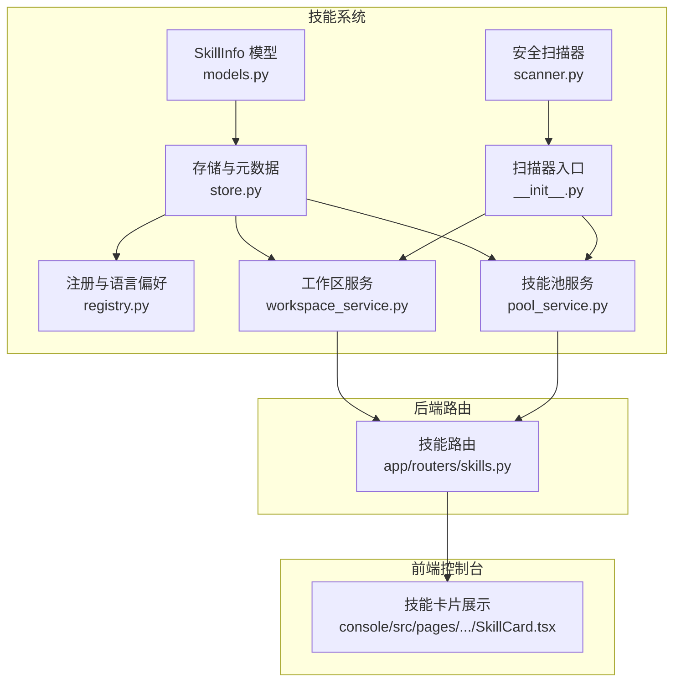
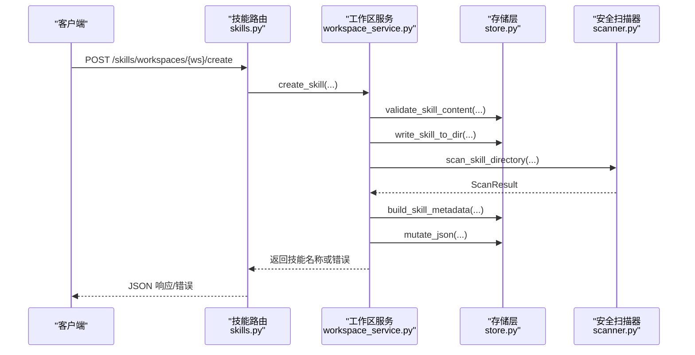
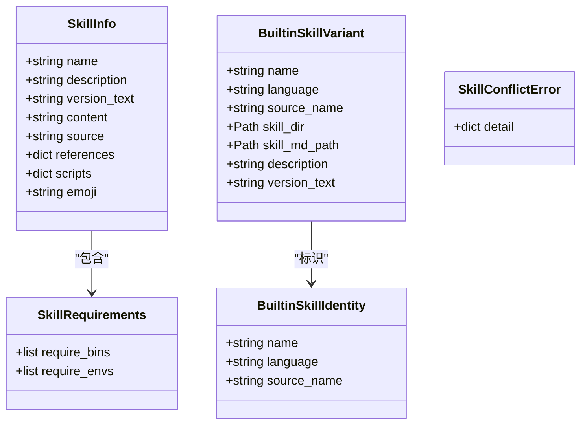
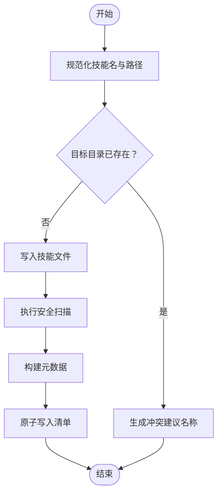
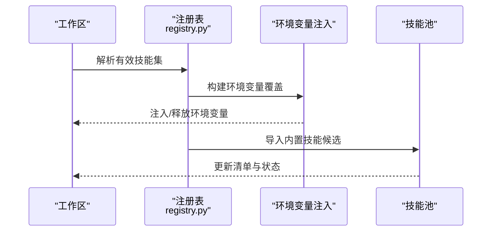
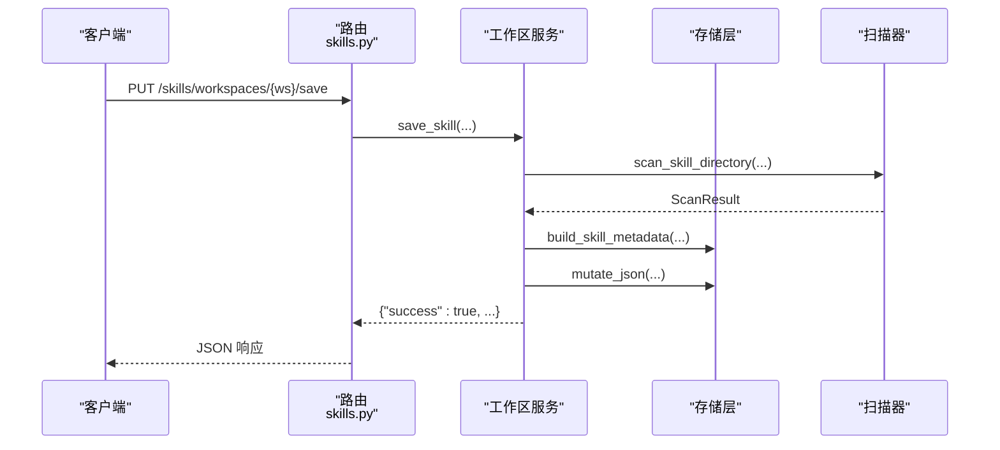
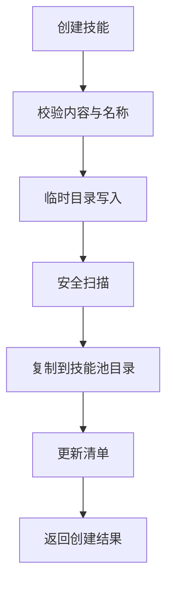
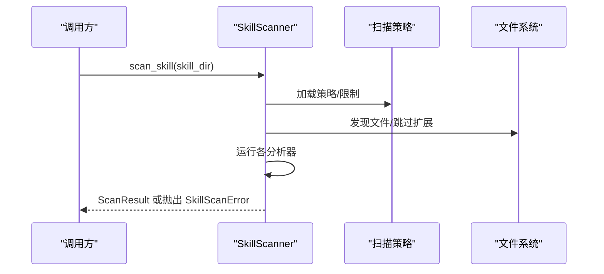
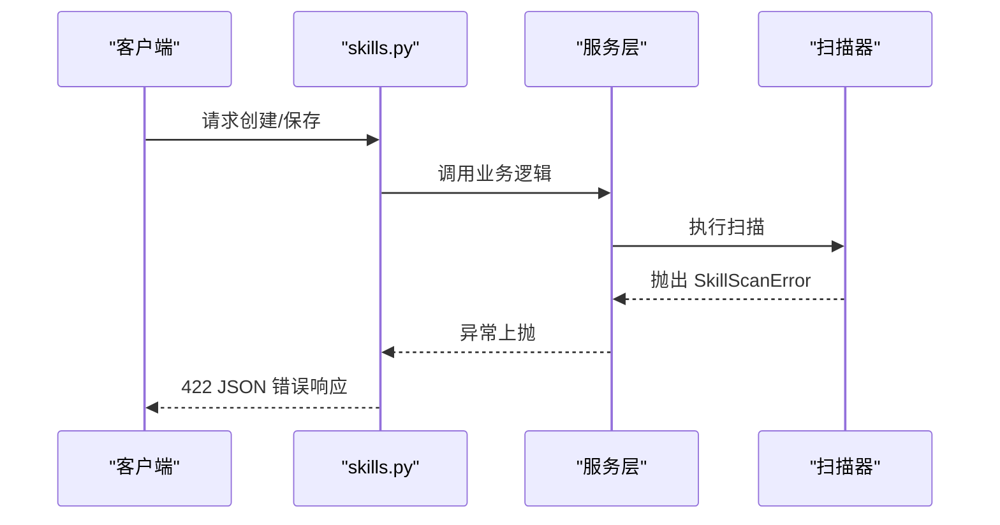
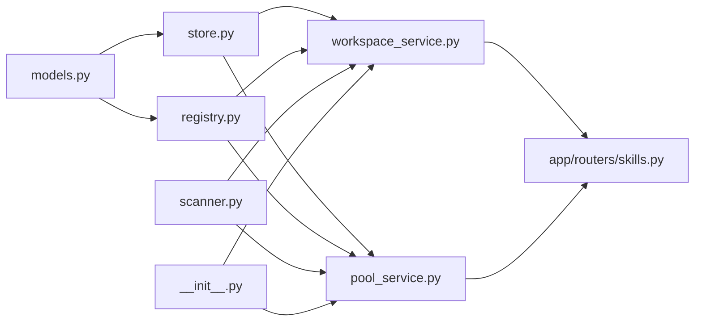

# 技能代码结构规范

<cite>
**本文档引用的文件**
- [src/qwenpaw/agents/skill_system/models.py](file://src/qwenpaw/agents/skill_system/models.py)
- [src/qwenpaw/agents/skill_system/store.py](file://src/qwenpaw/agents/skill_system/store.py)
- [src/qwenpaw/agents/skill_system/registry.py](file://src/qwenpaw/agents/skill_system/registry.py)
- [src/qwenpaw/agents/skill_system/workspace_service.py](file://src/qwenpaw/agents/skill_system/workspace_service.py)
- [src/qwenpaw/agents/skill_system/pool_service.py](file://src/qwenpaw/agents/skill_system/pool_service.py)
- [src/qwenpaw/app/routers/skills.py](file://src/qwenpaw/app/routers/skills.py)
- [src/qwenpaw/security/skill_scanner/scanner.py](file://src/qwenpaw/security/skill_scanner/scanner.py)
- [src/qwenpaw/security/skill_scanner/__init__.py](file://src/qwenpaw/security/skill_scanner/__init__.py)
- [src/qwenpaw/agents/tools/utils.py](file://src/qwenpaw/agents/tools/utils.py)
- [src/qwenpaw/agents/skills/browser_cdp-en/SKILL.md](file://src/qwenpaw/agents/skills/browser_cdp-en/SKILL.md)
- [src/qwenpaw/agents/skills/chat_with_agent-en/SKILL.md](file://src/qwenpaw/agents/skills/chat_with_agent-en/SKILL.md)
- [src/qwenpaw/agents/skill_system/hub.py](file://src/qwenpaw/agents/skill_system/hub.py)
- [src/qwenpaw/agents/utils/setup_utils.py](file://src/qwenpaw/agents/utils/setup_utils.py)
</cite>

## 目录
1. [简介](#简介)
2. [项目结构](#项目结构)
3. [核心组件](#核心组件)
4. [架构总览](#架构总览)
5. [详细组件分析](#详细组件分析)
6. [依赖分析](#依赖分析)
7. [性能考虑](#性能考虑)
8. [故障排查指南](#故障排查指南)
9. [结论](#结论)
10. [附录](#附录)

## 简介
本规范文档面向QwenPaw技能（Skill）开发与集成，系统性阐述技能代码的标准组织结构、参数处理、返回值格式与错误处理机制；明确技能接口规范（输入参数校验、输出格式标准化、异常处理约定）；给出命名规范、注释标准与文档编写要求；并总结并发处理、异步调用与资源管理的最佳实践，以及安全编码规范与性能优化技巧。同时提供代码质量检查、静态分析与自动化测试的实施建议。

## 项目结构
QwenPaw的技能体系由“工作区技能”和“技能池”两部分组成，并通过统一的存储层、注册表与扫描器保障一致性与安全性。前端控制台提供可视化操作入口，后端FastAPI路由提供REST API。

**图表来源**
- [src/qwenpaw/agents/skill_system/models.py:45-77](file://src/qwenpaw/agents/skill_system/models.py#L45-L77)
- [src/qwenpaw/agents/skill_system/store.py:56-101](file://src/qwenpaw/agents/skill_system/store.py#L56-L101)
- [src/qwenpaw/agents/skill_system/registry.py:64-114](file://src/qwenpaw/agents/skill_system/registry.py#L64-L114)
- [src/qwenpaw/agents/skill_system/workspace_service.py:40-96](file://src/qwenpaw/agents/skill_system/workspace_service.py#L40-L96)
- [src/qwenpaw/agents/skill_system/pool_service.py:83-121](file://src/qwenpaw/agents/skill_system/pool_service.py#L83-L121)
- [src/qwenpaw/security/skill_scanner/scanner.py:76-147](file://src/qwenpaw/security/skill_scanner/scanner.py#L76-L147)
- [src/qwenpaw/security/skill_scanner/__init__.py:424-513](file://src/qwenpaw/security/skill_scanner/__init__.py#L424-L513)
- [src/qwenpaw/app/routers/skills.py:69-124](file://src/qwenpaw/app/routers/skills.py#L69-L124)

**章节来源**
- [src/qwenpaw/agents/skill_system/models.py:1-77](file://src/qwenpaw/agents/skill_system/models.py#L1-L77)
- [src/qwenpaw/agents/skill_system/store.py:1-101](file://src/qwenpaw/agents/skill_system/store.py#L1-L101)
- [src/qwenpaw/app/routers/skills.py:1-124](file://src/qwenpaw/app/routers/skills.py#L1-L124)

## 核心组件
- 模型与常量：定义技能信息、内置技能变体、冲突错误等基础类型。
- 存储与元数据：提供路径解析、目录复制、清单读写、原子写入、冲突名建议、内容校验等能力。
- 注册与语言偏好：内置技能语言选择、缓存、环境变量注入、导入候选构建等。
- 工作区服务：工作区内技能生命周期管理（创建、保存、导入、启用/禁用、通道设置、标签、删除、文件读取）。
- 技能池服务：共享技能池的创建、保存、删除、配置读写等。
- 安全扫描器：对技能包进行文件发现、规则扫描、结果聚合与阻断策略。
- 路由层：对外暴露技能相关API，统一错误响应与扫描失败处理。

**章节来源**
- [src/qwenpaw/agents/skill_system/models.py:45-77](file://src/qwenpaw/agents/skill_system/models.py#L45-L77)
- [src/qwenpaw/agents/skill_system/store.py:56-101](file://src/qwenpaw/agents/skill_system/store.py#L56-L101)
- [src/qwenpaw/agents/skill_system/registry.py:64-114](file://src/qwenpaw/agents/skill_system/registry.py#L64-L114)
- [src/qwenpaw/agents/skill_system/workspace_service.py:40-96](file://src/qwenpaw/agents/skill_system/workspace_service.py#L40-L96)
- [src/qwenpaw/agents/skill_system/pool_service.py:83-121](file://src/qwenpaw/agents/skill_system/pool_service.py#L83-L121)
- [src/qwenpaw/security/skill_scanner/scanner.py:76-147](file://src/qwenpaw/security/skill_scanner/scanner.py#L76-L147)
- [src/qwenpaw/app/routers/skills.py:69-124](file://src/qwenpaw/app/routers/skills.py#L69-L124)

## 架构总览
技能系统采用分层设计：模型层（数据结构）、存储层（文件系统与清单）、服务层（业务逻辑）、路由层（API网关），并通过安全扫描器贯穿创建/导入流程，确保合规与安全。

**图表来源**
- [src/qwenpaw/app/routers/skills.py:842-864](file://src/qwenpaw/app/routers/skills.py#L842-L864)
- [src/qwenpaw/agents/skill_system/workspace_service.py:97-195](file://src/qwenpaw/agents/skill_system/workspace_service.py#L97-L195)
- [src/qwenpaw/agents/skill_system/store.py:773-792](file://src/qwenpaw/agents/skill_system/store.py#L773-L792)
- [src/qwenpaw/security/skill_scanner/__init__.py:424-513](file://src/qwenpaw/security/skill_scanner/__init__.py#L424-L513)

## 详细组件分析

### 组件A：技能模型与接口规范
- 数据模型
  - SkillInfo：描述技能基本信息（名称、描述、版本、内容、来源、引用、脚本、表情符号）。
  - BuiltinSkillVariant/BuiltinSkillIdentity：内置技能标识与变体信息。
  - SkillRequirements：声明技能运行所需的二进制与环境变量。
  - SkillConflictError：导入/保存时的可重命名冲突错误。
- 接口规范
  - 输入参数验证：名称与描述必须非空；路径规范化与安全校验；清单字段归一化。
  - 输出格式标准化：统一返回字典结构，包含状态码、消息与必要字段；扫描失败返回结构化错误载荷。
  - 异常处理约定：捕获并转换为HTTP异常或结构化错误响应；保留原始细节以便前端展示。

**图表来源**
- [src/qwenpaw/agents/skill_system/models.py:45-77](file://src/qwenpaw/agents/skill_system/models.py#L45-L77)

**章节来源**
- [src/qwenpaw/agents/skill_system/models.py:45-77](file://src/qwenpaw/agents/skill_system/models.py#L45-L77)

### 组件B：存储与元数据（路径、清单、原子写入）
- 路径与安全
  - 规范化技能目录名与安全路径解析，防止路径穿越与非法字符。
  - 目录复制时过滤常见系统文件，保证跨平台一致性。
- 清单与原子写入
  - 提供跨进程文件锁与原子写入，避免竞态条件。
  - 支持默认清单模板、条目归一化、内置/自定义来源分类。
- 内容校验与导入
  - 校验SKILL.md前言字段；支持ZIP解压与树形文件写入；冲突名建议。
- 元数据构建
  - 从实际文件派生元数据，包含版本、更新时间、需求等。

**图表来源**
- [src/qwenpaw/agents/skill_system/store.py:445-476](file://src/qwenpaw/agents/skill_system/store.py#L445-L476)
- [src/qwenpaw/agents/skill_system/store.py:773-792](file://src/qwenpaw/agents/skill_system/store.py#L773-L792)
- [src/qwenpaw/agents/skill_system/store.py:555-579](file://src/qwenpaw/agents/skill_system/store.py#L555-L579)
- [src/qwenpaw/agents/skill_system/store.py:284-320](file://src/qwenpaw/agents/skill_system/store.py#L284-L320)

**章节来源**
- [src/qwenpaw/agents/skill_system/store.py:445-594](file://src/qwenpaw/agents/skill_system/store.py#L445-L594)
- [src/qwenpaw/agents/skill_system/store.py:555-579](file://src/qwenpaw/agents/skill_system/store.py#L555-L579)
- [src/qwenpaw/agents/skill_system/store.py:284-320](file://src/qwenpaw/agents/skill_system/store.py#L284-L320)

### 组件C：注册与环境注入（语言偏好、环境变量）
- 语言偏好与缓存：根据设置与UI语言推断内置技能语言偏好，带线程安全缓存。
- 环境变量注入：将技能配置映射为环境变量，按需注入并释放，避免冲突。
- 内置技能导入：构建导入候选、校验请求、收集冲突、执行复制与清单更新。

**图表来源**
- [src/qwenpaw/agents/skill_system/registry.py:342-387](file://src/qwenpaw/agents/skill_system/registry.py#L342-L387)
- [src/qwenpaw/agents/skill_system/registry.py:657-791](file://src/qwenpaw/agents/skill_system/registry.py#L657-L791)

**章节来源**
- [src/qwenpaw/agents/skill_system/registry.py:64-114](file://src/qwenpaw/agents/skill_system/registry.py#L64-L114)
- [src/qwenpaw/agents/skill_system/registry.py:342-387](file://src/qwenpaw/agents/skill_system/registry.py#L342-L387)
- [src/qwenpaw/agents/skill_system/registry.py:657-791](file://src/qwenpaw/agents/skill_system/registry.py#L657-L791)

### 组件D：工作区服务（生命周期管理）
- 创建/保存/导入：支持原地编辑、重命名保存、ZIP批量导入、启用/禁用、通道与标签设置、删除与文件读取。
- 扫描与回滚：创建/保存过程中若清单更新失败，自动清理文件并抛出错误。
- 配置持久化：通过原子写入保持清单一致性。

**图表来源**
- [src/qwenpaw/app/routers/skills.py:867-893](file://src/qwenpaw/app/routers/skills.py#L867-L893)
- [src/qwenpaw/agents/skill_system/workspace_service.py:197-333](file://src/qwenpaw/agents/skill_system/workspace_service.py#L197-L333)
- [src/qwenpaw/security/skill_scanner/__init__.py:424-513](file://src/qwenpaw/security/skill_scanner/__init__.py#L424-L513)

**章节来源**
- [src/qwenpaw/agents/skill_system/workspace_service.py:97-195](file://src/qwenpaw/agents/skill_system/workspace_service.py#L97-L195)
- [src/qwenpaw/agents/skill_system/workspace_service.py:197-333](file://src/qwenpaw/agents/skill_system/workspace_service.py#L197-L333)
- [src/qwenpaw/agents/skill_system/workspace_service.py:401-489](file://src/qwenpaw/agents/skill_system/workspace_service.py#L401-L489)

### 组件E：技能池服务（共享技能）
- 创建/保存/删除/配置读写：统一使用清单与原子写入，确保并发安全。
- 冲突处理：当同名技能已存在时返回None或建议重命名。

**图表来源**
- [src/qwenpaw/agents/skill_system/pool_service.py:83-121](file://src/qwenpaw/agents/skill_system/pool_service.py#L83-L121)
- [src/qwenpaw/agents/skill_system/store.py:773-792](file://src/qwenpaw/agents/skill_system/store.py#L773-L792)

**章节来源**
- [src/qwenpaw/agents/skill_system/pool_service.py:83-121](file://src/qwenpaw/agents/skill_system/pool_service.py#L83-L121)

### 组件F：安全扫描器（阻断与缓存）
- 扫描流程：文件发现、多分析器运行、去重、聚合结果、记录日志。
- 阻断策略：根据最大严重级别决定是否抛出SkillScanError；支持缓存与超时。
- 错误响应：统一将扫描错误转为422 JSON响应，包含严重级别与具体发现列表。

**图表来源**
- [src/qwenpaw/security/skill_scanner/scanner.py:148-242](file://src/qwenpaw/security/skill_scanner/scanner.py#L148-L242)
- [src/qwenpaw/security/skill_scanner/__init__.py:424-513](file://src/qwenpaw/security/skill_scanner/__init__.py#L424-L513)

**章节来源**
- [src/qwenpaw/security/skill_scanner/scanner.py:76-147](file://src/qwenpaw/security/skill_scanner/scanner.py#L76-L147)
- [src/qwenpaw/security/skill_scanner/__init__.py:424-513](file://src/qwenpaw/security/skill_scanner/__init__.py#L424-L513)

### 组件G：API路由与错误处理
- 统一错误响应：扫描失败返回422 JSON，包含类型、严重级别与发现列表；其他错误映射为HTTP异常。
- 结构化载荷：_scan_error_payload/_scan_error_response保证前后端一致的错误格式。

**图表来源**
- [src/qwenpaw/app/routers/skills.py:75-115](file://src/qwenpaw/app/routers/skills.py#L75-L115)
- [src/qwenpaw/app/routers/skills.py:842-864](file://src/qwenpaw/app/routers/skills.py#L842-L864)

**章节来源**
- [src/qwenpaw/app/routers/skills.py:75-115](file://src/qwenpaw/app/routers/skills.py#L75-L115)
- [src/qwenpaw/app/routers/skills.py:842-864](file://src/qwenpaw/app/routers/skills.py#L842-L864)

### 组件H：并发处理、异步调用与资源管理最佳实践
- 并发与锁
  - 使用跨进程文件锁与原子写入，避免清单竞态。
  - 线程安全缓存（语言偏好、内置技能注册表）。
- 异步与I/O
  - 文件读取使用异步文件库，带内存保护与Unicode容错。
  - 扫描在独立线程池中执行，支持超时控制。
- 资源管理
  - 临时目录与清理：创建/保存流程中使用上下文管理器与临时目录，失败时回滚。
  - 环境变量注入采用计数方式，确保释放不遗漏。

**章节来源**
- [src/qwenpaw/agents/skill_system/store.py:249-267](file://src/qwenpaw/agents/skill_system/store.py#L249-L267)
- [src/qwenpaw/agents/skill_system/store.py:284-320](file://src/qwenpaw/agents/skill_system/store.py#L284-L320)
- [src/qwenpaw/agents/tools/utils.py:210-242](file://src/qwenpaw/agents/tools/utils.py#L210-L242)
- [src/qwenpaw/security/skill_scanner/__init__.py:480-497](file://src/qwenpaw/security/skill_scanner/__init__.py#L480-L497)

### 组件I：安全编码规范与性能优化
- 安全
  - 路径安全：严格规范化与相对路径校验，拒绝绝对路径与路径穿越。
  - ZIP安全：限制大小、禁止软链接、校验解压路径。
  - 扫描阻断：基于严重级别与策略决定是否阻断。
- 性能
  - 缓存：扫描结果与清单按mtime缓存；语言偏好与注册表缓存。
  - I/O优化：异步读取、按字节截断与续读提示，避免大文件全量加载。
  - 限流与超时：扫描器限制文件数量与单文件大小，支持超时取消。

**章节来源**
- [src/qwenpaw/agents/skill_system/store.py:401-443](file://src/qwenpaw/agents/skill_system/store.py#L401-L443)
- [src/qwenpaw/agents/skill_system/store.py:424-443](file://src/qwenpaw/agents/skill_system/store.py#L424-L443)
- [src/qwenpaw/security/skill_scanner/__init__.py:356-390](file://src/qwenpaw/security/skill_scanner/__init__.py#L356-L390)
- [src/qwenpaw/agents/tools/utils.py:154-208](file://src/qwenpaw/agents/tools/utils.py#L154-L208)

### 组件J：命名规范、注释标准与文档编写要求
- 命名规范
  - 技能目录名：仅允许字母数字与连字符，去除空白与路径分隔符。
  - 环境变量：基于技能名的大写化与下划线替换，统一前缀。
- 注释标准
  - 类与方法：清晰描述职责、参数、返回值与异常。
  - 复杂逻辑：提供流程图或伪代码注释，标注边界条件与性能考量。
- 文档编写
  - SKILL.md：包含name、description、metadata（版本、表情符号、requires）与使用场景。
  - 示例：参考浏览器CDP与聊天代理技能文档，提供最小调用示例与注意事项。

**章节来源**
- [src/qwenpaw/agents/skill_system/store.py:445-458](file://src/qwenpaw/agents/skill_system/store.py#L445-L458)
- [src/qwenpaw/agents/skill_system/registry.py:249-256](file://src/qwenpaw/agents/skill_system/registry.py#L249-L256)
- [src/qwenpaw/agents/skills/browser_cdp-en/SKILL.md:1-205](file://src/qwenpaw/agents/skills/browser_cdp-en/SKILL.md#L1-L205)
- [src/qwenpaw/agents/skills/chat_with_agent-en/SKILL.md:1-118](file://src/qwenpaw/agents/skills/chat_with_agent-en/SKILL.md#L1-L118)

### 组件K：代码质量检查、静态分析与自动化测试
- 静态分析
  - Python：使用类型注解与pydantic模型；flake8与pylint检查；mypy类型检查。
  - 前端：ESLint/Prettier；TypeScript类型约束。
- 自动化测试
  - 后端：单元测试覆盖模型、存储、服务与路由；集成测试覆盖扫描与API。
  - 前端：组件测试与国际化文案校验。
- 流水线
  - GitHub Actions工作流：代码风格检查、单元测试、集成测试与打包。

**章节来源**
- [src/qwenpaw/agents/skill_system/models.py:1-10](file://src/qwenpaw/agents/skill_system/models.py#L1-L10)
- [src/qwenpaw/agents/skill_system/store.py:1-28](file://src/qwenpaw/agents/skill_system/store.py#L1-L28)
- [src/qwenpaw/agents/skill_system/workspace_service.py:1-38](file://src/qwenpaw/agents/skill_system/workspace_service.py#L1-L38)

## 依赖分析

**图表来源**
- [src/qwenpaw/agents/skill_system/models.py:4-41](file://src/qwenpaw/agents/skill_system/models.py#L4-L41)
- [src/qwenpaw/agents/skill_system/store.py:1-28](file://src/qwenpaw/agents/skill_system/store.py#L1-L28)
- [src/qwenpaw/agents/skill_system/registry.py:1-44](file://src/qwenpaw/agents/skill_system/registry.py#L1-L44)
- [src/qwenpaw/agents/skill_system/workspace_service.py:1-38](file://src/qwenpaw/agents/skill_system/workspace_service.py#L1-L38)
- [src/qwenpaw/agents/skill_system/pool_service.py:1-10](file://src/qwenpaw/agents/skill_system/pool_service.py#L1-L10)
- [src/qwenpaw/security/skill_scanner/scanner.py:1-28](file://src/qwenpaw/security/skill_scanner/scanner.py#L1-L28)
- [src/qwenpaw/security/skill_scanner/__init__.py:1-20](file://src/qwenpaw/security/skill_scanner/__init__.py#L1-L20)
- [src/qwenpaw/app/routers/skills.py:1-66](file://src/qwenpaw/app/routers/skills.py#L1-L66)

**章节来源**
- [src/qwenpaw/agents/skill_system/__init__.py:1-41](file://src/qwenpaw/agents/skill_system/__init__.py#L1-L41)

## 性能考虑
- I/O与缓存
  - 清单与文件按mtime缓存，减少重复读取。
  - 扫描结果缓存与LRU淘汰，避免重复扫描。
- 并发与锁
  - 原子写入与文件锁降低写竞争风险。
  - 线程池扫描避免阻塞主线程。
- 资源限制
  - 扫描器限制文件数量与单文件大小，ZIP解压限制与路径校验防止资源滥用。

[本节为通用指导，无需特定文件引用]

## 故障排查指南
- 扫描失败
  - 检查扫描器返回的严重级别与具体发现列表；根据策略调整或修复问题。
  - 若阻断模式开启，需修复后再提交。
- 清单写入失败
  - 查看回滚日志与清理错误详情，确认文件系统权限与磁盘空间。
- 路由错误
  - 统一422 JSON错误载荷包含详细原因与建议名称；根据提示重试或改名。

**章节来源**
- [src/qwenpaw/app/routers/skills.py:75-115](file://src/qwenpaw/app/routers/skills.py#L75-L115)
- [src/qwenpaw/agents/skill_system/workspace_service.py:161-194](file://src/qwenpaw/agents/skill_system/workspace_service.py#L161-L194)
- [src/qwenpaw/security/skill_scanner/__init__.py:402-422](file://src/qwenpaw/security/skill_scanner/__init__.py#L402-L422)

## 结论
本规范文档从模型、存储、服务、路由与安全五个层面系统化定义了QwenPaw技能代码的结构与行为准则，明确了输入验证、输出格式、异常处理与并发安全等关键点，并提供了命名、注释与文档编写的最佳实践与质量保障方法。遵循此规范可显著提升技能开发的一致性、安全性与可维护性。

[本节为总结性内容，无需特定文件引用]

## 附录
- 示例技能文档
  - 浏览器CDP技能：提供端口扫描、连接现有浏览器、固定端口启动等场景说明。
  - 聊天代理技能：明确何时使用、决策规则、使用流程与最小调用示例。
- 模板与初始化
  - 模板Markdown文件复制与语言回退策略，便于工作区初始化与多语言支持。

**章节来源**
- [src/qwenpaw/agents/skills/browser_cdp-en/SKILL.md:1-205](file://src/qwenpaw/agents/skills/browser_cdp-en/SKILL.md#L1-L205)
- [src/qwenpaw/agents/skills/chat_with_agent-en/SKILL.md:1-118](file://src/qwenpaw/agents/skills/chat_with_agent-en/SKILL.md#L1-L118)
- [src/qwenpaw/agents/utils/setup_utils.py:30-97](file://src/qwenpaw/agents/utils/setup_utils.py#L30-L97)
- [src/qwenpaw/agents/utils/setup_utils.py:183-224](file://src/qwenpaw/agents/utils/setup_utils.py#L183-L224)