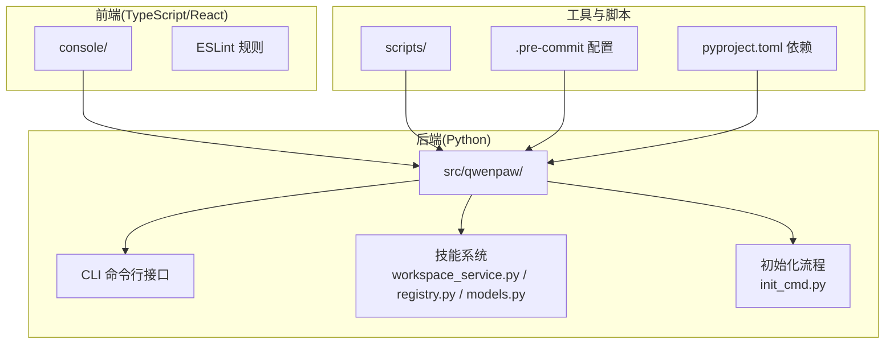
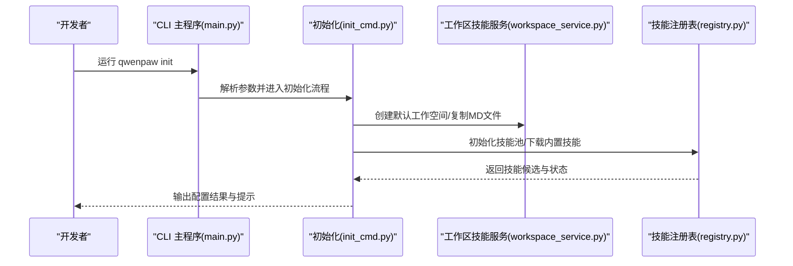
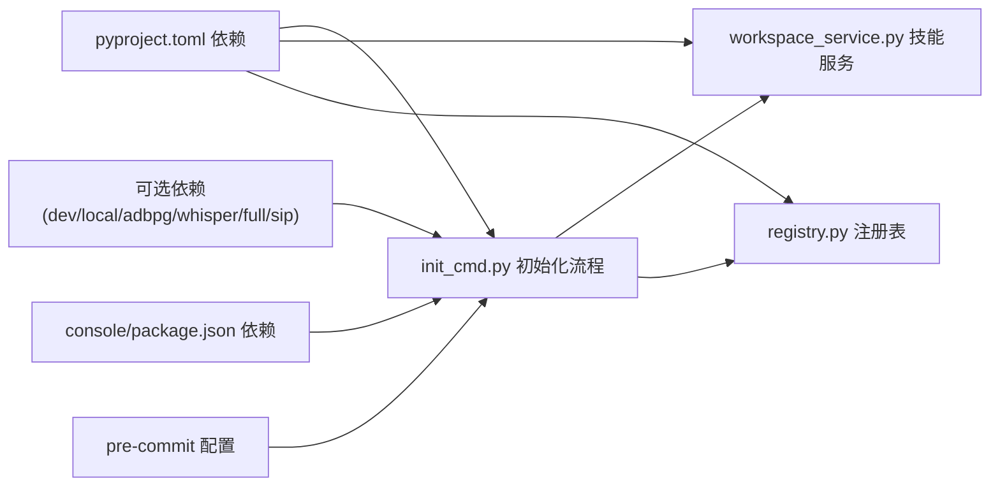

# 技能开发环境搭建

<cite>
**本文档引用的文件**
- [README.md](file://README.md)
- [pyproject.toml](file://pyproject.toml)
- [setup.py](file://setup.py)
- [console/package.json](file://console/package.json)
- [src/qwenpaw/__init__.py](file://src/qwenpaw/__init__.py)
- [scripts/README.md](file://scripts/README.md)
- [CONTRIBUTING.md](file://CONTRIBUTING.md)
- [src/qwenpaw/cli/main.py](file://src/qwenpaw/cli/main.py)
- [src/qwenpaw/cli/init_cmd.py](file://src/qwenpaw/cli/init_cmd.py)
- [src/qwenpaw/agents/skill_system/workspace_service.py](file://src/qwenpaw/agents/skill_system/workspace_service.py)
- [src/qwenpaw/agents/skill_system/models.py](file://src/qwenpaw/agents/skill_system/models.py)
- [src/qwenpaw/agents/skill_system/registry.py](file://src/qwenpaw/agents/skill_system/registry.py)
- [console/eslint.config.js](file://console/eslint.config.js)
- [.pre-commit-config.yaml](file://.pre-commit-config.yaml)
</cite>

## 目录
1. [引言](#引言)
2. [项目结构](#项目结构)
3. [核心组件](#核心组件)
4. [架构总览](#架构总览)
5. [详细组件分析](#详细组件分析)
6. [依赖关系分析](#依赖关系分析)
7. [性能考虑](#性能考虑)
8. [故障排除指南](#故障排除指南)
9. [结论](#结论)
10. [附录](#附录)

## 引言
本指南面向希望在本地搭建 QwenPaw 技能开发环境的开发者，覆盖系统要求、Python 版本与依赖管理、技能开发目录结构、工作空间配置、开发工具链、技能模板获取与使用、IDE 配置、调试与代码格式化、环境验证与常见问题排查，以及性能优化建议与最佳实践。通过遵循本指南，您可以在本地高效地创建、测试与发布自定义技能。

## 项目结构
QwenPaw 采用前后端分离与多模块组织方式：
- 后端（Python）：核心业务逻辑、技能系统、通道适配、CLI 等位于 src/qwenpaw 下。
- 前端（TypeScript/React）：控制台界面位于 console/，构建产物打包到后端包内。
- 脚本与部署：scripts/ 提供构建、测试、打包脚本；deploy/ 提供容器化相关配置。
- 插件与工具：plugins/ 提供可复用的工具插件与示例。
- 文档与网站：website/ 提供文档站点源码。

图表来源
- [src/qwenpaw/cli/main.py:95-147](file://src/qwenpaw/cli/main.py#L95-L147)
- [src/qwenpaw/cli/init_cmd.py:119-142](file://src/qwenpaw/cli/init_cmd.py#L119-L142)
- [src/qwenpaw/agents/skill_system/workspace_service.py:40-57](file://src/qwenpaw/agents/skill_system/workspace_service.py#L40-L57)
- [src/qwenpaw/agents/skill_system/registry.py:1-50](file://src/qwenpaw/agents/skill_system/registry.py#L1-L50)
- [console/eslint.config.js:1-29](file://console/eslint.config.js#L1-L29)
- [pyproject.toml:1-74](file://pyproject.toml#L1-L74)

章节来源
- [README.md:444-466](file://README.md#L444-L466)
- [scripts/README.md:1-53](file://scripts/README.md#L1-L53)

## 核心组件
- Python 版本与依赖管理
  - Python 版本要求：>=3.10,<3.14
  - 依赖声明与可选依赖：见 pyproject.toml
  - 开发依赖：pytest、pytest-asyncio、pre-commit、coverage 等
- 前端依赖与构建
  - 前端包管理：console/package.json
  - 构建脚本：npm run build、预览等
- CLI 与初始化
  - CLI 分组与延迟加载：src/qwenpaw/cli/main.py
  - 初始化流程：src/qwenpaw/cli/init_cmd.py（工作空间、技能池、配置、心跳等）
- 技能系统
  - 工作区技能生命周期：src/qwenpaw/agents/skill_system/workspace_service.py
  - 技能注册与语言选择：src/qwenpaw/agents/skill_system/registry.py
  - 技能数据模型：src/qwenpaw/agents/skill_system/models.py

章节来源
- [pyproject.toml:6-49](file://pyproject.toml#L6-L49)
- [pyproject.toml:84-114](file://pyproject.toml#L84-L114)
- [console/package.json:1-79](file://console/package.json#L1-L79)
- [src/qwenpaw/cli/main.py:58-93](file://src/qwenpaw/cli/main.py#L58-L93)
- [src/qwenpaw/cli/init_cmd.py:119-142](file://src/qwenpaw/cli/init_cmd.py#L119-L142)
- [src/qwenpaw/agents/skill_system/workspace_service.py:40-57](file://src/qwenpaw/agents/skill_system/workspace_service.py#L40-L57)
- [src/qwenpaw/agents/skill_system/registry.py:177-193](file://src/qwenpaw/agents/skill_system/registry.py#L177-L193)
- [src/qwenpaw/agents/skill_system/models.py:45-77](file://src/qwenpaw/agents/skill_system/models.py#L45-L77)

## 架构总览
下图展示从命令行到技能系统的调用链路，以及初始化流程如何建立工作空间与技能池。

图表来源
- [src/qwenpaw/cli/main.py:95-147](file://src/qwenpaw/cli/main.py#L95-L147)
- [src/qwenpaw/cli/init_cmd.py:119-142](file://src/qwenpaw/cli/init_cmd.py#L119-L142)
- [src/qwenpaw/agents/skill_system/workspace_service.py:66-95](file://src/qwenpaw/agents/skill_system/workspace_service.py#L66-L95)
- [src/qwenpaw/agents/skill_system/registry.py:554-574](file://src/qwenpaw/agents/skill_system/registry.py#L554-L574)

## 详细组件分析

### 系统要求与安装路径
- Python 版本：3.10 ≤ 版本 < 3.14
- 推荐安装方式
  - 从源码安装：先构建前端，再安装 Python 包
  - 使用脚本安装：自动处理 uv、虚拟环境与依赖
  - Docker 容器运行：镜像标签 latest/pre
- 前端构建：console 目录下执行 npm ci 与 npm run build，产物复制至后端包

章节来源
- [README.md:6-9](file://README.md#L6-L9)
- [README.md:444-466](file://README.md#L444-L466)
- [README.md:232-276](file://README.md#L232-L276)

### Python 版本兼容性与依赖管理
- 核心依赖：agentscope、httpx、apscheduler、playwright、transformers、pyyaml、openai 等
- 可选依赖：dev（测试与质量）、local（HuggingFace Hub）、adbpg（PostgreSQL）、whisper（语音转写）、full（组合别名）
- 依赖安装建议
  - 开发环境：pip install -e ".[dev,full]"
  - 仅本地模型：pip install -e ".[local]"
  - SIP 语音功能：pip install -e ".[sip,sip-livekit]"

章节来源
- [pyproject.toml:6-49](file://pyproject.toml#L6-L49)
- [pyproject.toml:84-114](file://pyproject.toml#L84-L114)

### 技能开发目录结构
- 内置技能目录：src/qwenpaw/agents/skills/<skill_name>/
- 工作区技能目录：工作空间根目录/workspaces/<workspace_id>/skills/<skill_name>/
- 技能内容规范
  - 必需：SKILL.md（包含 YAML front matter 的描述与元数据）
  - 可选：references/、scripts/、其他资源文件
- 技能清单与元数据
  - 工作区 manifest：workspaces/<workspace_id>/skill.json
  - 技能元数据：名称、描述、版本、来源、需求、更新时间等

章节来源
- [CONTRIBUTING.md:134-147](file://CONTRIBUTING.md#L134-L147)
- [src/qwenpaw/agents/skill_system/models.py:45-77](file://src/qwenpaw/agents/skill_system/models.py#L45-L77)
- [src/qwenpaw/agents/skill_system/workspace_service.py:66-95](file://src/qwenpaw/agents/skill_system/workspace_service.py#L66-L95)

### 工作空间配置与初始化
- 初始化流程要点
  - 安全提示确认、遥测收集（可选）
  - 默认工作空间与 QA Agent 初始化
  - 技能池初始化与迁移
  - 配置项：心跳间隔、目标、活跃时段、语言、音频模式、转录提供商
  - 渠道与环境变量交互式配置
  - MD 文件复制与语言切换
  - HEARTBEAT.md 生成与编辑
- CLI 入口与延迟加载
  - CLI Group 支持延迟加载子命令，提升启动性能

章节来源
- [src/qwenpaw/cli/init_cmd.py:119-142](file://src/qwenpaw/cli/init_cmd.py#L119-L142)
- [src/qwenpaw/cli/init_cmd.py:157-173](file://src/qwenpaw/cli/init_cmd.py#L157-L173)
- [src/qwenpaw/cli/init_cmd.py:215-333](file://src/qwenpaw/cli/init_cmd.py#L215-L333)
- [src/qwenpaw/cli/init_cmd.py:335-360](file://src/qwenpaw/cli/init_cmd.py#L335-L360)
- [src/qwenpaw/cli/init_cmd.py:361-423](file://src/qwenpaw/cli/init_cmd.py#L361-L423)
- [src/qwenpaw/cli/init_cmd.py:424-482](file://src/qwenpaw/cli/init_cmd.py#L424-L482)
- [src/qwenpaw/cli/init_cmd.py:483-521](file://src/qwenpaw/cli/init_cmd.py#L483-L521)
- [src/qwenpaw/cli/main.py:58-93](file://src/qwenpaw/cli/main.py#L58-L93)

### 技能模板获取与使用
- 内置技能模板
  - 位于 src/qwenpaw/agents/skills/<skill_name>/，包含英文与中文变体
  - 通过技能池导入或直接复制到工作区
- 自定义模板创建
  - 在工作区 skills/ 下创建新目录，编写 SKILL.md 与可选资源
  - 使用 workspace_service 提供的创建/保存/启用/禁用/删除能力
- 技能导入与冲突处理
  - 支持 ZIP 导入，自动扫描与重命名冲突
  - 通过 registry 管理内置语言偏好与版本

章节来源
- [CONTRIBUTING.md:134-147](file://CONTRIBUTING.md#L134-L147)
- [src/qwenpaw/agents/skill_system/workspace_service.py:97-196](file://src/qwenpaw/agents/skill_system/workspace_service.py#L97-L196)
- [src/qwenpaw/agents/skill_system/workspace_service.py:401-489](file://src/qwenpaw/agents/skill_system/workspace_service.py#L401-L489)
- [src/qwenpaw/agents/skill_system/registry.py:177-193](file://src/qwenpaw/agents/skill_system/registry.py#L177-L193)
- [src/qwenpaw/agents/skill_system/registry.py:554-574](file://src/qwenpaw/agents/skill_system/registry.py#L554-L574)

### IDE 配置、调试工具与代码格式化
- Python 代码风格与静态检查
  - Black（行宽 79）、Flake8、Pylint（忽略规则定制）
  - mypy（类型检查，排除特定文件）
  - pre-commit 钩子：语法检查、YAML/JSON/XML/Docstring、私钥检测、尾随空白、添加逗号、Prettier
- 前端代码规范
  - ESLint + TypeScript ESLint，React Hooks 规则
  - Prettier 格式化
- 调试与测试
  - pytest（异步模式、标记、覆盖率）
  - Vitest（前端单元测试与覆盖率）

章节来源
- [.pre-commit-config.yaml:1-121](file://.pre-commit-config.yaml#L1-L121)
- [console/eslint.config.js:1-29](file://console/eslint.config.js#L1-L29)
- [pyproject.toml:116-152](file://pyproject.toml#L116-L152)
- [console/package.json:6-20](file://console/package.json#L6-L20)

### 技能开发工具链设置
- 前端构建与预览
  - console/package.json 提供 dev/build/test/lint/format 等脚本
- 测试与覆盖率
  - scripts/run_tests.py 支持全量/单元/集成测试与并行执行
- 轮子构建
  - scripts/wheel_build.sh：构建前端 → 复制 dist 到后端 → 打包 wheel

章节来源
- [console/package.json:6-20](file://console/package.json#L6-L20)
- [scripts/README.md:30-53](file://scripts/README.md#L30-L53)

### 技能开发验证方法
- 初始化验证
  - 运行 qwenpaw init --defaults，检查工作空间、技能池、配置文件、MD 文件与 HEARTBEAT.md 是否生成
- 技能可用性验证
  - 使用 workspace_service.list_all_skills()/list_available_skills() 获取技能列表
  - 通过 registry.resolve_effective_skills() 校验运行时解析
- 日志与启动时间
  - 包初始化与 CLI 延迟加载记录，便于定位启动性能问题

章节来源
- [src/qwenpaw/cli/init_cmd.py:215-333](file://src/qwenpaw/cli/init_cmd.py#L215-L333)
- [src/qwenpaw/agents/skill_system/workspace_service.py:66-95](file://src/qwenpaw/agents/skill_system/workspace_service.py#L66-L95)
- [src/qwenpaw/agents/skill_system/registry.py:820-840](file://src/qwenpaw/agents/skill_system/registry.py#L820-L840)
- [src/qwenpaw/__init__.py:22-32](file://src/qwenpaw/__init__.py#L22-L32)
- [src/qwenpaw/cli/main.py:25-56](file://src/qwenpaw/cli/main.py#L25-L56)

## 依赖关系分析

图表来源
- [pyproject.toml:6-49](file://pyproject.toml#L6-L49)
- [pyproject.toml:84-114](file://pyproject.toml#L84-L114)
- [console/package.json:21-76](file://console/package.json#L21-L76)
- [.pre-commit-config.yaml:1-121](file://.pre-commit-config.yaml#L1-L121)
- [src/qwenpaw/cli/init_cmd.py:119-142](file://src/qwenpaw/cli/init_cmd.py#L119-L142)
- [src/qwenpaw/agents/skill_system/workspace_service.py:40-57](file://src/qwenpaw/agents/skill_system/workspace_service.py#L40-L57)
- [src/qwenpaw/agents/skill_system/registry.py:177-193](file://src/qwenpaw/agents/skill_system/registry.py#L177-L193)

章节来源
- [pyproject.toml:6-49](file://pyproject.toml#L6-L49)
- [pyproject.toml:84-114](file://pyproject.toml#L84-L114)
- [console/package.json:21-76](file://console/package.json#L21-L76)
- [.pre-commit-config.yaml:1-121](file://.pre-commit-config.yaml#L1-L121)

## 性能考虑
- 启动性能
  - CLI 使用延迟加载子命令，减少初始导入开销
  - 包初始化阶段记录耗时，便于定位瓶颈
- 前端构建
  - 使用 Vite 构建，生产模式优化与缓存策略
- 依赖精简
  - 按需安装可选依赖，避免不必要的包体积与安装时间
- 测试并行
  - 使用 pytest-xdist 并行执行测试，缩短回归周期

章节来源
- [src/qwenpaw/cli/main.py:58-93](file://src/qwenpaw/cli/main.py#L58-L93)
- [src/qwenpaw/__init__.py:22-32](file://src/qwenpaw/__init__.py#L22-L32)
- [scripts/README.md:48-50](file://scripts/README.md#L48-L50)
- [console/package.json:8-19](file://console/package.json#L8-L19)

## 故障排除指南
- 初始化失败
  - 确认 Python 版本满足 3.10 ≤ 版本 < 3.14
  - 检查网络与 uv 安装状态，必要时手动安装并重试
  - 使用 --defaults 跳过交互，快速生成基础配置
- 技能冲突
  - 导入 ZIP 或重命名时出现冲突，根据提示选择重命名或覆盖
  - 使用 workspace_service.suggest_conflict_name() 获取建议名称
- 依赖问题
  - 缺少可选依赖导致功能异常，按需安装对应 extras（如 whisper、sip）
  - 使用 pre-commit 修复格式与静态检查问题
- 前端构建错误
  - 清理 node_modules 与缓存，重新执行 npm ci 与构建
- 权限与安全
  - 遵循安全提示，限制渠道与用户范围，最小权限原则

章节来源
- [README.md:160-182](file://README.md#L160-L182)
- [src/qwenpaw/agents/skill_system/workspace_service.py:233-241](file://src/qwenpaw/agents/skill_system/workspace_service.py#L233-L241)
- [src/qwenpaw/cli/init_cmd.py:157-173](file://src/qwenpaw/cli/init_cmd.py#L157-L173)
- [.pre-commit-config.yaml:1-121](file://.pre-commit-config.yaml#L1-L121)

## 结论
通过本指南，您可以完成 QwenPaw 技能开发环境的搭建与配置，掌握技能模板的获取与使用、工作空间的初始化与管理、开发工具链的设置与验证，并具备常见问题的排查能力。建议在开发过程中持续关注依赖版本、代码风格与测试覆盖率，以确保技能的质量与稳定性。

## 附录
- 快速开始步骤
  - 安装 Python 3.10–3.13，克隆仓库
  - 在 console/ 执行 npm ci 与 npm run build
  - 将构建产物复制到 src/qwenpaw/console/
  - pip install -e ".[dev,full]"
  - 运行 qwenpaw init --defaults
  - 启动 qwenpaw app，打开浏览器访问控制台
- 相关参考
  - 官方文档与安装说明：README.md
  - 贡献指南与技能规范：CONTRIBUTING.md
  - 脚本与构建说明：scripts/README.md

章节来源
- [README.md:444-466](file://README.md#L444-L466)
- [CONTRIBUTING.md:68-86](file://CONTRIBUTING.md#L68-L86)
- [scripts/README.md:1-53](file://scripts/README.md#L1-L53)