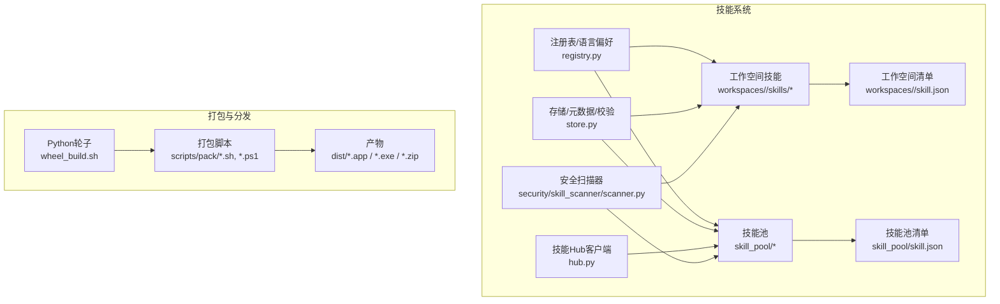
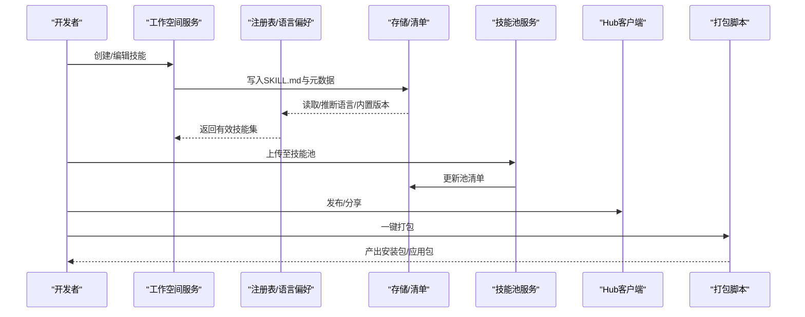
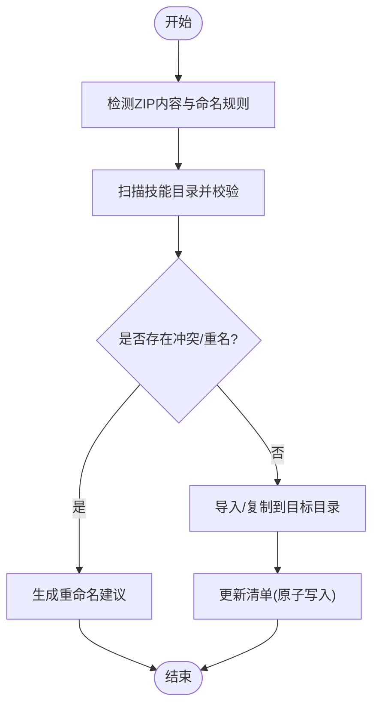
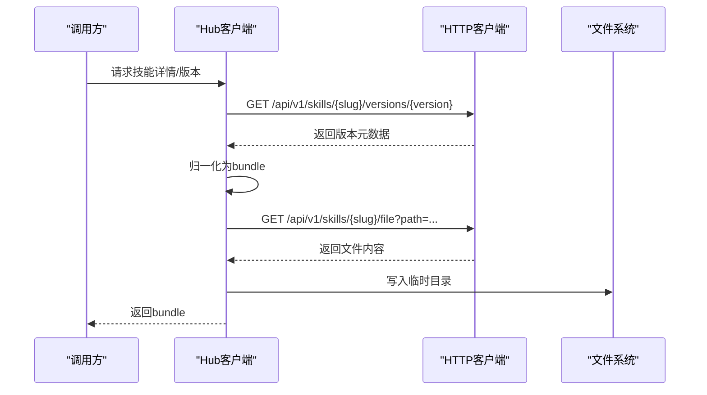
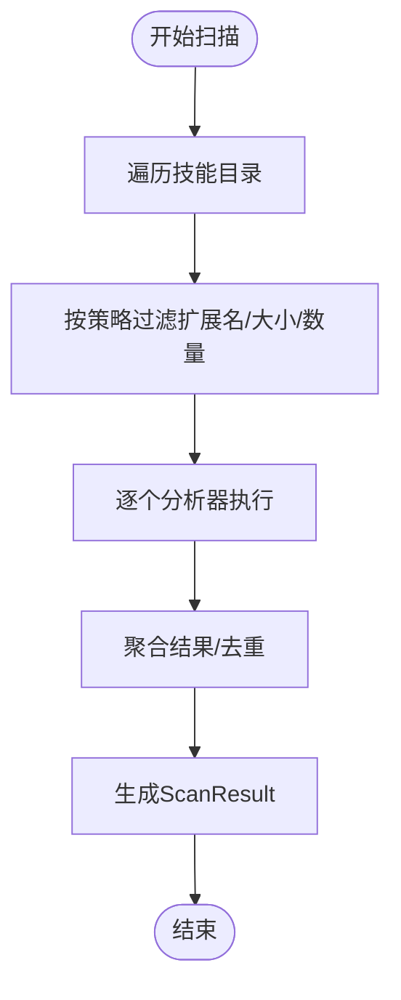
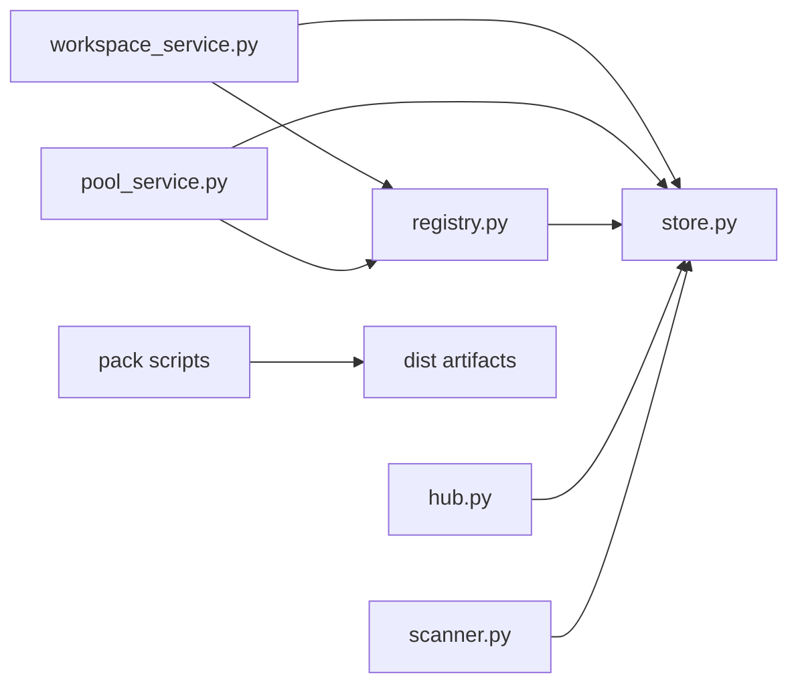

# 技能打包与分发

<cite>
**本文引用的文件**
- [src/qwenpaw/agents/skill_system/__init__.py](file://src/qwenpaw/agents/skill_system/__init__.py)
- [src/qwenpaw/agents/skill_system/hub.py](file://src/qwenpaw/agents/skill_system/hub.py)
- [src/qwenpaw/agents/skill_system/models.py](file://src/qwenpaw/agents/skill_system/models.py)
- [src/qwenpaw/agents/skill_system/pool_service.py](file://src/qwenpaw/agents/skill_system/pool_service.py)
- [src/qwenpaw/agents/skill_system/registry.py](file://src/qwenpaw/agents/skill_system/registry.py)
- [src/qwenpaw/agents/skill_system/store.py](file://src/qwenpaw/agents/skill_system/store.py)
- [src/qwenpaw/agents/skill_system/workspace_service.py](file://src/qwenpaw/agents/skill_system/workspace_service.py)
- [src/qwenpaw/security/skill_scanner/scanner.py](file://src/qwenpaw/security/skill_scanner/scanner.py)
- [scripts/pack/README.md](file://scripts/pack/README.md)
- [scripts/pack/README_zh.md](file://scripts/pack/README_zh.md)
- [src/qwenpaw/agents/skills/docx-en/SKILL.md](file://src/qwenpaw/agents/skills/docx-en/SKILL.md)
- [src/qwenpaw/agents/skills/pdf-en/SKILL.md](file://src/qwenpaw/agents/skills/pdf-en/SKILL.md)
</cite>

## 目录
1. [简介](#简介)
2. [项目结构](#项目结构)
3. [核心组件](#核心组件)
4. [架构总览](#架构总览)
5. [详细组件分析](#详细组件分析)
6. [依赖分析](#依赖分析)
7. [性能考虑](#性能考虑)
8. [故障排查指南](#故障排查指南)
9. [结论](#结论)
10. [附录](#附录)

## 简介
本文件面向QwenPaw的“技能打包与分发”，系统性阐述技能的文件组织、清单（manifest）规范、依赖收集与校验、压缩打包、本地/共享/市场三种分发方式、版本管理策略、安全校验与完整性保障、以及自动化与CI/CD集成建议。目标是帮助开发者与运维人员建立标准化、可审计、可复现的技能生命周期管理。

## 项目结构
QwenPaw的技能系统围绕“工作空间技能”和“技能池”两大存储域展开，并通过注册表、清单与扫描器实现统一的发现、解析、导入与分发能力。打包侧则由桌面打包脚本负责将应用与前端资源一并产出可分发的安装包或应用包。

图示来源
- [src/qwenpaw/agents/skill_system/workspace_service.py:40-95](file://src/qwenpaw/agents/skill_system/workspace_service.py#L40-L95)
- [src/qwenpaw/agents/skill_system/pool_service.py:45-120](file://src/qwenpaw/agents/skill_system/pool_service.py#L45-L120)
- [src/qwenpaw/agents/skill_system/registry.py:59-114](file://src/qwenpaw/agents/skill_system/registry.py#L59-L114)
- [src/qwenpaw/agents/skill_system/store.py:56-101](file://src/qwenpaw/agents/skill_system/store.py#L56-L101)
- [src/qwenpaw/agents/skill_system/hub.py:190-227](file://src/qwenpaw/agents/skill_system/hub.py#L190-L227)
- [src/qwenpaw/security/skill_scanner/scanner.py:76-147](file://src/qwenpaw/security/skill_scanner/scanner.py#L76-L147)
- [scripts/pack/README.md:1-93](file://scripts/pack/README.md#L1-L93)

章节来源
- [src/qwenpaw/agents/skill_system/__init__.py:1-41](file://src/qwenpaw/agents/skill_system/__init__.py#L1-41)
- [src/qwenpaw/agents/skill_system/workspace_service.py:40-95](file://src/qwenpaw/agents/skill_system/workspace_service.py#L40-L95)
- [src/qwenpaw/agents/skill_system/pool_service.py:45-120](file://src/qwenpaw/agents/skill_system/pool_service.py#L45-L120)
- [src/qwenpaw/agents/skill_system/registry.py:59-114](file://src/qwenpaw/agents/skill_system/registry.py#L59-L114)
- [src/qwenpaw/agents/skill_system/store.py:56-101](file://src/qwenpaw/agents/skill_system/store.py#L56-L101)
- [src/qwenpaw/agents/skill_system/hub.py:190-227](file://src/qwenpaw/agents/skill_system/hub.py#L190-L227)
- [src/qwenpaw/security/skill_scanner/scanner.py:76-147](file://src/qwenpaw/security/skill_scanner/scanner.py#L76-L147)
- [scripts/pack/README.md:1-93](file://scripts/pack/README.md#L1-L93)

## 核心组件
- 技能模型与常量：定义技能信息、需求、路由通道等基础数据结构。
- 工作空间服务：管理单工作空间内的技能创建、编辑、启用/禁用、渠道绑定、配置持久化与导入导出。
- 技能池服务：管理全局共享技能池，支持导入导出、内置同步、版本与语言选择、冲突检测与回滚。
- 注册表与语言偏好：内置技能识别、语言选择、导入候选构建、环境变量注入。
- 存储与清单：路径解析、清单读写、原子更新、元数据提取、目录复制与校验。
- Hub客户端：远程Hub搜索、详情、版本、文件下载与内容归一化，支持取消与重试。
- 安全扫描器：对技能包进行文件发现、分析器遍历、结果聚合与去重，支持策略与阈值。
- 打包脚本：基于wheel与conda-pack的一键打包，生成桌面安装包或应用包。

章节来源
- [src/qwenpaw/agents/skill_system/models.py:45-77](file://src/qwenpaw/agents/skill_system/models.py#L45-L77)
- [src/qwenpaw/agents/skill_system/workspace_service.py:40-195](file://src/qwenpaw/agents/skill_system/workspace_service.py#L40-L195)
- [src/qwenpaw/agents/skill_system/pool_service.py:45-325](file://src/qwenpaw/agents/skill_system/pool_service.py#L45-L325)
- [src/qwenpaw/agents/skill_system/registry.py:59-114](file://src/qwenpaw/agents/skill_system/registry.py#L59-L114)
- [src/qwenpaw/agents/skill_system/store.py:56-101](file://src/qwenpaw/agents/skill_system/store.py#L56-L101)
- [src/qwenpaw/agents/skill_system/hub.py:190-227](file://src/qwenpaw/agents/skill_system/hub.py#L190-L227)
- [src/qwenpaw/security/skill_scanner/scanner.py:76-147](file://src/qwenpaw/security/skill_scanner/scanner.py#L76-L147)
- [scripts/pack/README.md:23-44](file://scripts/pack/README.md#L23-L44)

## 架构总览
技能生命周期从“工作空间”开始，经“注册表/语言偏好”解析，通过“存储/清单”落盘，必要时进入“技能池”共享，最终可通过“Hub客户端”发布到Hub或通过“打包脚本”产出分发包。

图示来源
- [src/qwenpaw/agents/skill_system/workspace_service.py:97-195](file://src/qwenpaw/agents/skill_system/workspace_service.py#L97-L195)
- [src/qwenpaw/agents/skill_system/registry.py:554-574](file://src/qwenpaw/agents/skill_system/registry.py#L554-L574)
- [src/qwenpaw/agents/skill_system/store.py:555-579](file://src/qwenpaw/agents/skill_system/store.py#L555-L579)
- [src/qwenpaw/agents/skill_system/pool_service.py:555-623](file://src/qwenpaw/agents/skill_system/pool_service.py#L555-L623)
- [src/qwenpaw/agents/skill_system/hub.py:582-666](file://src/qwenpaw/agents/skill_system/hub.py#L582-L666)
- [scripts/pack/README.md:23-44](file://scripts/pack/README.md#L23-L44)

## 详细组件分析

### 技能清单（manifest）与元数据
- 工作空间清单：记录每个技能的启用状态、渠道范围、来源（内置/自定义）、配置、需求与更新时间等。
- 技能池清单：记录共享技能的来源、版本文本、保护标记、标签与更新时间等。
- 元数据提取：从SKILL.md的frontmatter中抽取名称、描述、版本、emoji、依赖等字段，并写入清单。
- 清单默认值与版本：提供工作空间与技能池清单的默认模式与版本号递增策略，确保跨进程原子更新。

章节来源
- [src/qwenpaw/agents/skill_system/store.py:327-341](file://src/qwenpaw/agents/skill_system/store.py#L327-L341)
- [src/qwenpaw/agents/skill_system/store.py:555-579](file://src/qwenpaw/agents/skill_system/store.py#L555-L579)
- [src/qwenpaw/agents/skill_system/workspace_service.py:126-153](file://src/qwenpaw/agents/skill_system/workspace_service.py#L126-L153)
- [src/qwenpaw/agents/skill_system/pool_service.py:112-129](file://src/qwenpaw/agents/skill_system/pool_service.py#L112-L129)

### 技能文件组织与依赖声明
- 文件组织：技能目录下必须包含SKILL.md作为入口，可选references/与scripts/目录存放辅助文件与脚本。
- 依赖声明：支持在metadata命名空间下声明系统依赖（如二进制、环境变量），并在运行时注入环境变量。
- 版本与语言：内置技能通过语言变体目录区分en/zh，版本文本来自frontmatter metadata。

章节来源
- [src/qwenpaw/agents/skill_system/models.py:64-77](file://src/qwenpaw/agents/skill_system/models.py#L64-L77)
- [src/qwenpaw/agents/skill_system/registry.py:195-211](file://src/qwenpaw/agents/skill_system/registry.py#L195-L211)
- [src/qwenpaw/agents/skill_system/store.py:513-553](file://src/qwenpaw/agents/skill_system/store.py#L513-L553)
- [src/qwenpaw/agents/skills/docx-en/SKILL.md:1-20](file://src/qwenpaw/agents/skills/docx-en/SKILL.md#L1-L20)
- [src/qwenpaw/agents/skills/pdf-en/SKILL.md:1-10](file://src/qwenpaw/agents/skills/pdf-en/SKILL.md#L1-L10)

### 技能导入与导出流程
- 工作空间导入：支持从ZIP批量导入技能，自动扫描与冲突检测，成功后调用注册表重建工作空间清单。
- 技能池导入：支持从ZIP批量导入，冲突检测与重命名建议，完成后更新技能池清单。
- 下载/上传：支持从技能池下载到工作空间，或从工作空间上传到技能池，内置语言切换与版本比较逻辑。

图示来源
- [src/qwenpaw/agents/skill_system/workspace_service.py:401-489](file://src/qwenpaw/agents/skill_system/workspace_service.py#L401-L489)
- [src/qwenpaw/agents/skill_system/pool_service.py:157-264](file://src/qwenpaw/agents/skill_system/pool_service.py#L157-L264)
- [src/qwenpaw/agents/skill_system/store.py:794-800](file://src/qwenpaw/agents/skill_system/store.py#L794-L800)

章节来源
- [src/qwenpaw/agents/skill_system/workspace_service.py:401-489](file://src/qwenpaw/agents/skill_system/workspace_service.py#L401-L489)
- [src/qwenpaw/agents/skill_system/pool_service.py:157-264](file://src/qwenpaw/agents/skill_system/pool_service.py#L157-L264)
- [src/qwenpaw/agents/skill_system/store.py:794-800](file://src/qwenpaw/agents/skill_system/store.py#L794-L800)

### 技能Hub分发与版本管理
- Hub交互：支持搜索、详情、版本查询与文件下载，自动归一化payload为bundle格式。
- 版本选择：优先使用请求版本，其次取最新版本，最后回退到文件列表中的SKILL.md。
- 语言与版本对比：下载前检查语言切换与版本升级场景，避免不兼容变更。
- 取消与重试：支持取消检查、超时与指数回退，提升网络失败场景的鲁棒性。

图示来源
- [src/qwenpaw/agents/skill_system/hub.py:582-666](file://src/qwenpaw/agents/skill_system/hub.py#L582-L666)
- [src/qwenpaw/agents/skill_system/hub.py:299-430](file://src/qwenpaw/agents/skill_system/hub.py#L299-L430)

章节来源
- [src/qwenpaw/agents/skill_system/hub.py:190-227](file://src/qwenpaw/agents/skill_system/hub.py#L190-L227)
- [src/qwenpaw/agents/skill_system/hub.py:582-666](file://src/qwenpaw/agents/skill_system/hub.py#L582-L666)
- [src/qwenpaw/agents/skill_system/hub.py:299-430](file://src/qwenpaw/agents/skill_system/hub.py#L299-L430)

### 安全扫描与完整性校验
- 扫描范围：遍历技能目录，跳过策略/默认白名单扩展名，限制最大文件数与单文件大小。
- 分析器集合：默认加载PatternAnalyzer，支持动态注册其他分析器。
- 结果聚合：去重、记录分析器使用情况与失败项，输出ScanResult。
- 技能扫描：在导入/保存/下载前后调用扫描器，拒绝高风险包。

图示来源
- [src/qwenpaw/security/skill_scanner/scanner.py:148-242](file://src/qwenpaw/security/skill_scanner/scanner.py#L148-L242)
- [src/qwenpaw/security/skill_scanner/scanner.py:248-299](file://src/qwenpaw/security/skill_scanner/scanner.py#L248-L299)

章节来源
- [src/qwenpaw/security/skill_scanner/scanner.py:76-147](file://src/qwenpaw/security/skill_scanner/scanner.py#L76-L147)
- [src/qwenpaw/security/skill_scanner/scanner.py:148-242](file://src/qwenpaw/security/skill_scanner/scanner.py#L148-L242)

### 打包与分发自动化
- 一键打包：先构建wheel（含前端），再用conda-pack生成独立环境，最后生成NSIS安装包（Windows）或.app（macOS）。
- CI集成：GitHub Actions在发布或手动触发时执行打包并上传制品。
- 运行与调试：提供终端启动与日志定位方法，macOS Gatekeeper处理指引。

章节来源
- [scripts/pack/README.md:23-44](file://scripts/pack/README.md#L23-L44)
- [scripts/pack/README.md:74-82](file://scripts/pack/README.md#L74-L82)
- [scripts/pack/README_zh.md:22-41](file://scripts/pack/README_zh.md#L22-L41)
- [scripts/pack/README_zh.md:61-70](file://scripts/pack/README_zh.md#L61-L70)

## 依赖分析
- 组件耦合
  - 工作空间服务与技能池服务均依赖存储模块进行清单读写与原子更新。
  - 注册表依赖存储模块解析frontmatter与内置技能目录。
  - Hub客户端依赖HTTP工具与清单/存储模块进行远端拉取与本地落盘。
  - 安全扫描器独立于业务逻辑，仅依赖文件系统与策略配置。
- 外部依赖
  - 打包脚本依赖conda、NSIS（Windows）、Node.js/npm等系统工具。
  - 技能依赖声明通过环境变量注入，运行期由注册表模块完成。

图示来源
- [src/qwenpaw/agents/skill_system/workspace_service.py:18-37](file://src/qwenpaw/agents/skill_system/workspace_service.py#L18-L37)
- [src/qwenpaw/agents/skill_system/pool_service.py:14-42](file://src/qwenpaw/agents/skill_system/pool_service.py#L14-L42)
- [src/qwenpaw/agents/skill_system/registry.py:23-43](file://src/qwenpaw/agents/skill_system/registry.py#L23-L43)
- [src/qwenpaw/agents/skill_system/hub.py:23-32](file://src/qwenpaw/agents/skill_system/hub.py#L23-L32)
- [src/qwenpaw/security/skill_scanner/scanner.py:24-27](file://src/qwenpaw/security/skill_scanner/scanner.py#L24-L27)
- [scripts/pack/README.md:1-21](file://scripts/pack/README.md#L1-L21)

章节来源
- [src/qwenpaw/agents/skill_system/workspace_service.py:18-37](file://src/qwenpaw/agents/skill_system/workspace_service.py#L18-L37)
- [src/qwenpaw/agents/skill_system/pool_service.py:14-42](file://src/qwenpaw/agents/skill_system/pool_service.py#L14-L42)
- [src/qwenpaw/agents/skill_system/registry.py:23-43](file://src/qwenpaw/agents/skill_system/registry.py#L23-L43)
- [src/qwenpaw/agents/skill_system/hub.py:23-32](file://src/qwenpaw/agents/skill_system/hub.py#L23-L32)
- [src/qwenpaw/security/skill_scanner/scanner.py:24-27](file://src/qwenpaw/security/skill_scanner/scanner.py#L24-L27)
- [scripts/pack/README.md:1-21](file://scripts/pack/README.md#L1-L21)

## 性能考虑
- 清单读写：采用跨进程文件锁与原子写入，避免并发写入导致的数据损坏。
- 缓存与去重：清单读取基于mtime缓存，减少重复解析成本。
- 扫描限流：默认限制文件数量与单文件大小，避免大体积技能拖慢扫描。
- 导入/复制：忽略平台无关的缓存与系统文件，保证跨平台一致性与传输效率。

章节来源
- [src/qwenpaw/agents/skill_system/store.py:250-320](file://src/qwenpaw/agents/skill_system/store.py#L250-L320)
- [src/qwenpaw/agents/skill_system/store.py:632-657](file://src/qwenpaw/agents/skill_system/store.py#L632-L657)
- [src/qwenpaw/security/skill_scanner/scanner.py:70-74](file://src/qwenpaw/security/skill_scanner/scanner.py#L70-L74)
- [src/qwenpaw/agents/skill_system/store.py:220-238](file://src/qwenpaw/agents/skill_system/store.py#L220-L238)

## 故障排查指南
- 导入失败
  - 检查技能目录是否通过扫描（包含合法frontmatter与文件树）。
  - 关注冲突与重名：使用建议重命名策略并重试。
- 清单更新异常
  - 观察原子写入失败后的回滚日志，确认磁盘权限与路径合法性。
- Hub网络问题
  - 检查超时、重试次数与回退策略；GitHub API速率限制时设置令牌。
- 打包失败
  - 确认conda、NSIS、Node.js等前置条件；查看CI日志定位具体步骤。

章节来源
- [src/qwenpaw/agents/skill_system/workspace_service.py:401-489](file://src/qwenpaw/agents/skill_system/workspace_service.py#L401-L489)
- [src/qwenpaw/agents/skill_system/pool_service.py:112-155](file://src/qwenpaw/agents/skill_system/pool_service.py#L112-L155)
- [src/qwenpaw/agents/skill_system/hub.py:300-430](file://src/qwenpaw/agents/skill_system/hub.py#L300-L430)
- [scripts/pack/README.md:55-57](file://scripts/pack/README.md#L55-L57)

## 结论
QwenPaw的技能系统通过“工作空间/技能池 + 清单 + 注册表 + 扫描器 + Hub + 打包脚本”的组合，实现了从创作、校验、共享到分发的闭环。遵循本文的清单规范、版本策略与安全流程，可显著提升技能质量与分发效率。

## 附录

### 技能清单（manifest）编写规范
- 必填字段
  - name：技能唯一标识（与目录名一致，避免斜杠与特殊字符）。
  - description：技能描述。
- 元数据
  - metadata.qwenpaw.emoji：可选表情符号。
  - metadata.builtin_skill_version：内置技能版本文本。
- 来源与状态
  - source：builtin/customized。
  - enabled：是否启用。
  - channels：渠道范围（如all）。
  - config：技能配置字典。
  - requirements：系统依赖（bins/env）。
  - updated_at：最后更新时间（ISO格式）。

章节来源
- [src/qwenpaw/agents/skill_system/models.py:45-77](file://src/qwenpaw/agents/skill_system/models.py#L45-L77)
- [src/qwenpaw/agents/skill_system/store.py:555-579](file://src/qwenpaw/agents/skill_system/store.py#L555-L579)
- [src/qwenpaw/agents/skill_system/workspace_service.py:126-153](file://src/qwenpaw/agents/skill_system/workspace_service.py#L126-L153)

### 版本管理策略
- 版本号规则
  - 使用语义化版本字符串（如主.次.修订），内置技能通过metadata.builtin_skill_version标注。
- 向后兼容性
  - 下载到工作空间时，若语言切换或版本不一致，系统会给出冲突提示与建议。
- 升级路径
  - 技能池内置版本与工作空间版本不一致时，提示升级；语言切换时校验内容哈希以避免误判。

章节来源
- [src/qwenpaw/agents/skill_system/registry.py:195-211](file://src/qwenpaw/agents/skill_system/registry.py#L195-L211)
- [src/qwenpaw/agents/skill_system/pool_service.py:743-800](file://src/qwenpaw/agents/skill_system/pool_service.py#L743-L800)

### 安全认证与完整性校验
- 安全扫描
  - 默认启用PatternAnalyzer，可按策略配置跳过扩展名、文件上限与单文件大小。
  - 支持注册自定义分析器，增强威胁检测能力。
- 完整性检查
  - 导入/保存/下载前执行扫描，拒绝高风险技能包。
  - 清单写入采用原子替换，避免半写入状态。

章节来源
- [src/qwenpaw/security/skill_scanner/scanner.py:76-147](file://src/qwenpaw/security/skill_scanner/scanner.py#L76-L147)
- [src/qwenpaw/security/skill_scanner/scanner.py:148-242](file://src/qwenpaw/security/skill_scanner/scanner.py#L148-L242)
- [src/qwenpaw/agents/skill_system/store.py:284-319](file://src/qwenpaw/agents/skill_system/store.py#L284-L319)

### 自动化与CI/CD集成
- 触发条件
  - Release发布或手动workflow_dispatch。
- 平台产物
  - Windows：NSIS安装包。
  - macOS：.app与可选zip。
- 日志与调试
  - 提供终端启动与日志定位方法，macOS Gatekeeper处理指引。

章节来源
- [scripts/pack/README.md:74-82](file://scripts/pack/README.md#L74-L82)
- [scripts/pack/README.md:55-57](file://scripts/pack/README.md#L55-L57)
- [scripts/pack/README_zh.md:72-80](file://scripts/pack/README_zh.md#L72-L80)
- [scripts/pack/README_zh.md:61-70](file://scripts/pack/README_zh.md#L61-L70)