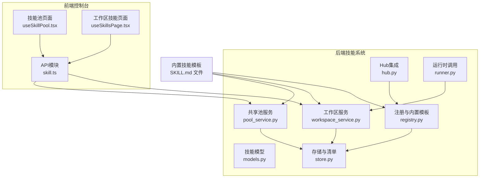
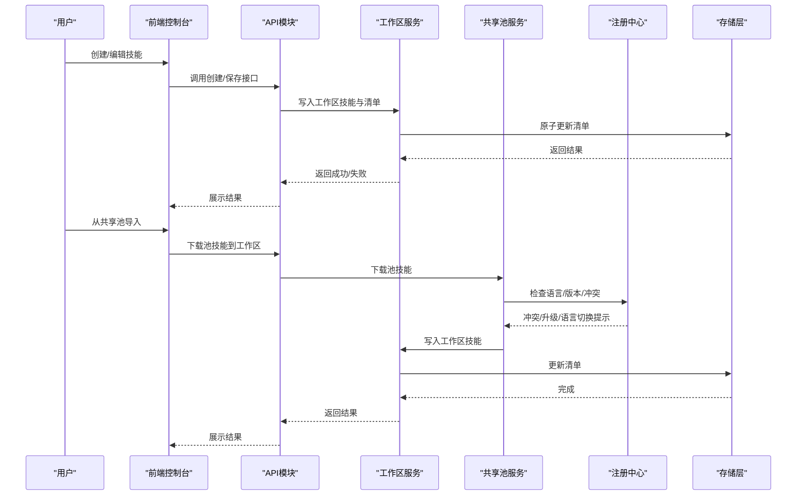
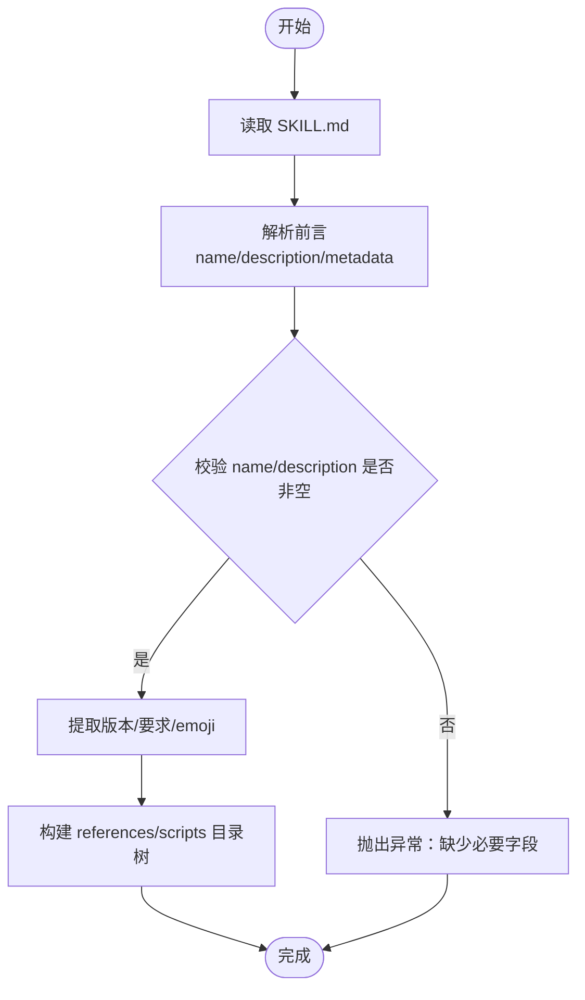
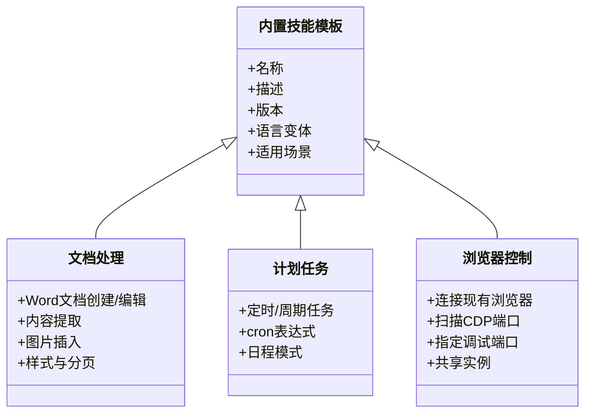
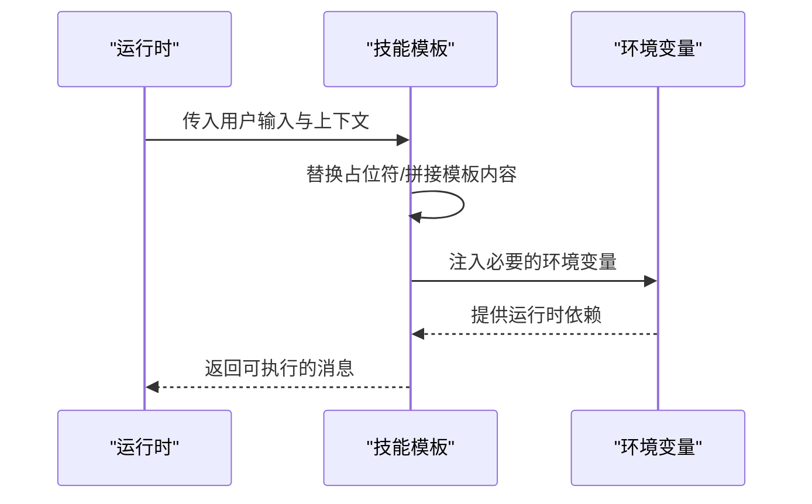
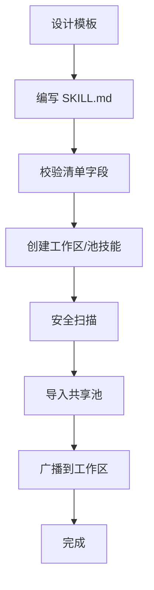
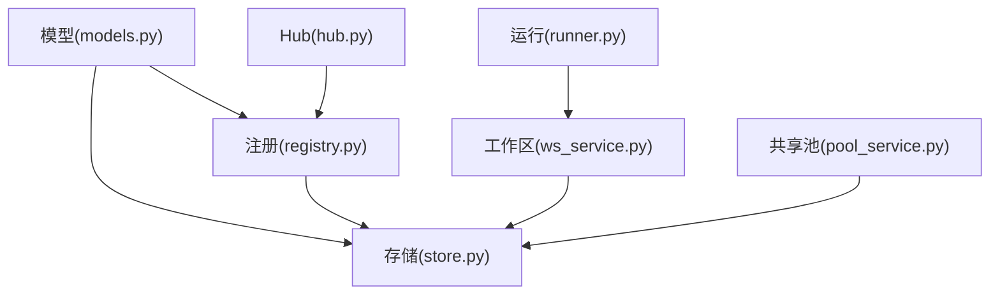

# 技能模板系统

<cite>
**本文档引用的文件**
- [src/qwenpaw/agents/skill_system/__init__.py](file://src/qwenpaw/agents/skill_system/__init__.py)
- [src/qwenpaw/agents/skill_system/models.py](file://src/qwenpaw/agents/skill_system/models.py)
- [src/qwenpaw/agents/skill_system/registry.py](file://src/qwenpaw/agents/skill_system/registry.py)
- [src/qwenpaw/agents/skill_system/store.py](file://src/qwenpaw/agents/skill_system/store.py)
- [src/qwenpaw/agents/skill_system/workspace_service.py](file://src/qwenpaw/agents/skill_system/workspace_service.py)
- [src/qwenpaw/agents/skill_system/pool_service.py](file://src/qwenpaw/agents/skill_system/pool_service.py)
- [src/qwenpaw/agents/skill_system/hub.py](file://src/qwenpaw/agents/skill_system/hub.py)
- [src/qwenpaw/agents/skill_system/runner.py](file://src/qwenpaw/agents/skill_system/runner.py)
- [src/qwenpaw/agents/skills/docx-en/SKILL.md](file://src/qwenpaw/agents/skills/docx-en/SKILL.md)
- [src/qwenpaw/agents/skills/cron-en/SKILL.md](file://src/qwenpaw/agents/skills/cron-en/SKILL.md)
- [src/qwenpaw/agents/skills/browser_cdp-en/SKILL.md](file://src/qwenpaw/agents/skills/browser_cdp-en/SKILL.md)
- [console/src/pages/Settings/SkillPool/useSkillPool.tsx](file://console/src/pages/Settings/SkillPool/useSkillPool.tsx)
- [console/src/pages/Agent/Skills/useSkillsPage.tsx](file://console/src/pages/Agent/Skills/useSkillsPage.tsx)
- [console/src/api/modules/skill.ts](file://console/src/api/modules/skill.ts)
</cite>

## 目录
1. [简介](#简介)
2. [项目结构](#项目结构)
3. [核心组件](#核心组件)
4. [架构总览](#架构总览)
5. [详细组件分析](#详细组件分析)
6. [依赖关系分析](#依赖关系分析)
7. [性能考虑](#性能考虑)
8. [故障排除指南](#故障排除指南)
9. [结论](#结论)
10. [附录](#附录)

## 简介
本文件为 QwenPaw 技能模板系统的完整技术文档，面向开发者与高级用户，系统性阐述技能模板的结构、分类、参数化机制、动态内容生成、条件渲染、继承与复用、版本管理与兼容性策略，并提供从设计到代码生成的全流程实践指南。文档同时覆盖内置技能模板的分类与适用场景，以及通过控制台进行模板创建、导入、广播与版本管理的操作方法。

## 项目结构
技能模板系统由三层协作构成：
- 后端技能系统：负责技能目录结构、清单解析（SKILL.md）、元数据构建、工作区与共享池的生命周期管理、内置模板同步与语言偏好处理。
- 前端控制台：提供技能模板的可视化编辑、批量操作、导入内置模板、广播到工作区等功能。
- 运行时集成：在聊天会话中通过命令触发技能执行，将用户输入与模板内容合并后注入到运行上下文。

**图表来源**
- [src/qwenpaw/agents/skill_system/models.py:45-77](file://src/qwenpaw/agents/skill_system/models.py#L45-L77)
- [src/qwenpaw/agents/skill_system/registry.py:1-120](file://src/qwenpaw/agents/skill_system/registry.py#L1-L120)
- [src/qwenpaw/agents/skill_system/store.py:56-101](file://src/qwenpaw/agents/skill_system/store.py#L56-L101)
- [src/qwenpaw/agents/skill_system/workspace_service.py:40-95](file://src/qwenpaw/agents/skill_system/workspace_service.py#L40-L95)
- [src/qwenpaw/agents/skill_system/pool_service.py:45-81](file://src/qwenpaw/agents/skill_system/pool_service.py#L45-L81)
- [src/qwenpaw/agents/skill_system/hub.py:1228-1289](file://src/qwenpaw/agents/skill_system/hub.py#L1228-L1289)
- [src/qwenpaw/agents/skill_system/runner.py:243-277](file://src/qwenpaw/agents/skill_system/runner.py#L243-L277)
- [console/src/pages/Settings/SkillPool/useSkillPool.tsx:82-109](file://console/src/pages/Settings/SkillPool/useSkillPool.tsx#L82-L109)
- [console/src/pages/Agent/Skills/useSkillsPage.tsx:42-736](file://console/src/pages/Agent/Skills/useSkillsPage.tsx#L42-L736)
- [console/src/api/modules/skill.ts:1-48](file://console/src/api/modules/skill.ts#L1-L48)

**章节来源**
- [src/qwenpaw/agents/skill_system/__init__.py:1-41](file://src/qwenpaw/agents/skill_system/__init__.py#L1-L41)
- [src/qwenpaw/agents/skill_system/models.py:1-77](file://src/qwenpaw/agents/skill_system/models.py#L1-L77)
- [src/qwenpaw/agents/skill_system/registry.py:1-120](file://src/qwenpaw/agents/skill_system/registry.py#L1-L120)
- [src/qwenpaw/agents/skill_system/store.py:56-101](file://src/qwenpaw/agents/skill_system/store.py#L56-L101)
- [src/qwenpaw/agents/skill_system/workspace_service.py:40-95](file://src/qwenpaw/agents/skill_system/workspace_service.py#L40-L95)
- [src/qwenpaw/agents/skill_system/pool_service.py:45-81](file://src/qwenpaw/agents/skill_system/pool_service.py#L45-L81)
- [src/qwenpaw/agents/skill_system/hub.py:1228-1289](file://src/qwenpaw/agents/skill_system/hub.py#L1228-L1289)
- [src/qwenpaw/agents/skill_system/runner.py:243-277](file://src/qwenpaw/agents/skill_system/runner.py#L243-L277)
- [console/src/pages/Settings/SkillPool/useSkillPool.tsx:82-109](file://console/src/pages/Settings/SkillPool/useSkillPool.tsx#L82-L109)
- [console/src/pages/Agent/Skills/useSkillsPage.tsx:42-736](file://console/src/pages/Agent/Skills/useSkillsPage.tsx#L42-L736)
- [console/src/api/modules/skill.ts:1-48](file://console/src/api/modules/skill.ts#L1-L48)

## 核心组件
- 技能模型与常量：定义技能信息、需求声明、冲突错误等基础类型。
- 注册与内置模板：内置模板发现、语言偏好、变体选择、导入候选构建与冲突检测。
- 存储与清单：路径解析、清单读写、原子写入、元数据提取、冲突建议。
- 工作区服务：工作区内技能的创建、保存、启用/禁用、通道设置、标签设置、文件读取。
- 共享池服务：共享池内技能的创建、导入、删除、上传/下载、重命名与保存。
- Hub集成：从远程仓库解析 SKILL.md、分支选择、规范化匹配。
- 运行时调用：将用户输入与模板内容合并，生成可执行消息。

**章节来源**
- [src/qwenpaw/agents/skill_system/models.py:45-77](file://src/qwenpaw/agents/skill_system/models.py#L45-L77)
- [src/qwenpaw/agents/skill_system/registry.py:121-230](file://src/qwenpaw/agents/skill_system/registry.py#L121-L230)
- [src/qwenpaw/agents/skill_system/store.py:56-101](file://src/qwenpaw/agents/skill_system/store.py#L56-L101)
- [src/qwenpaw/agents/skill_system/workspace_service.py:97-195](file://src/qwenpaw/agents/skill_system/workspace_service.py#L97-L195)
- [src/qwenpaw/agents/skill_system/pool_service.py:83-155](file://src/qwenpaw/agents/skill_system/pool_service.py#L83-L155)
- [src/qwenpaw/agents/skill_system/hub.py:1228-1289](file://src/qwenpaw/agents/skill_system/hub.py#L1228-L1289)
- [src/qwenpaw/agents/skill_system/runner.py:243-277](file://src/qwenpaw/agents/skill_system/runner.py#L243-L277)

## 架构总览
技能模板系统采用“工作区-共享池-内置模板”三层结构：
- 工作区：每个工作区维护自己的技能清单与状态，支持启用/禁用、通道范围、自定义配置与标签。
- 共享池：跨工作区共享的技能集合，支持从工作区上传、从池下载、内置模板导入与版本管理。
- 内置模板：打包在安装包内的模板，按语言变体组织，支持自动导入与语言偏好切换。

**图表来源**
- [console/src/pages/Agent/Skills/useSkillsPage.tsx:390-559](file://console/src/pages/Agent/Skills/useSkillsPage.tsx#L390-L559)
- [console/src/pages/Settings/SkillPool/useSkillPool.tsx:374-547](file://console/src/pages/Settings/SkillPool/useSkillPool.tsx#L374-L547)
- [src/qwenpaw/agents/skill_system/workspace_service.py:490-588](file://src/qwenpaw/agents/skill_system/workspace_service.py#L490-L588)
- [src/qwenpaw/agents/skill_system/pool_service.py:743-800](file://src/qwenpaw/agents/skill_system/pool_service.py#L743-L800)
- [src/qwenpaw/agents/skill_system/registry.py:657-791](file://src/qwenpaw/agents/skill_system/registry.py#L657-L791)

## 详细组件分析

### 技能模板结构与清单文件（SKILL.md）
- 结构组成
  - 清单文件：SKILL.md，采用 YAML 前言（frontmatter）定义 name、description、metadata 等关键字段；正文用于模板说明、前置条件、使用示例与注意事项。
  - 参考文件：references 目录，存放模板引用的静态资源或辅助文件。
  - 脚本文件：scripts 目录，存放可执行脚本或工具函数。
- 解析与校验
  - 通过 frontmatter 解析获取模板元信息；校验 name 与 description 非空以确保清单完整性。
  - 提取版本号与要求项（如二进制依赖、环境变量），用于运行时注入与扫描。
- 动态内容与条件渲染
  - 模板正文支持多段落、列表、表格与代码块，便于展示不同场景下的操作步骤与最佳实践。
  - 运行时可通过参数化占位符实现动态内容生成（例如在实际调用中替换目标用户、时间、渠道等）。

**图表来源**
- [src/qwenpaw/agents/skill_system/store.py:688-732](file://src/qwenpaw/agents/skill_system/store.py#L688-L732)
- [src/qwenpaw/agents/skills/docx-en/SKILL.md:1-40](file://src/qwenpaw/agents/skills/docx-en/SKILL.md#L1-L40)
- [src/qwenpaw/agents/skills/cron-en/SKILL.md:1-10](file://src/qwenpaw/agents/skills/cron-en/SKILL.md#L1-L10)
- [src/qwenpaw/agents/skills/browser_cdp-en/SKILL.md:1-10](file://src/qwenpaw/agents/skills/browser_cdp-en/SKILL.md#L1-L10)

**章节来源**
- [src/qwenpaw/agents/skill_system/store.py:688-745](file://src/qwenpaw/agents/skill_system/store.py#L688-L745)
- [src/qwenpaw/agents/skills/docx-en/SKILL.md:1-40](file://src/qwenpaw/agents/skills/docx-en/SKILL.md#L1-L40)
- [src/qwenpaw/agents/skills/cron-en/SKILL.md:1-10](file://src/qwenpaw/agents/skills/cron-en/SKILL.md#L1-L10)
- [src/qwenpaw/agents/skills/browser_cdp-en/SKILL.md:1-10](file://src/qwenpaw/agents/skills/browser_cdp-en/SKILL.md#L1-L10)

### 内置技能模板分类与适用场景
- 文档处理类：如 docx-en，适用于 Word 文档创建、编辑、转换与导出，涵盖内容提取、图片插入、样式与分页等高级用法。
- 计划任务类：如 cron-en，适用于定时/周期性任务管理，支持 cron 表达式与日程模式两种调度方式。
- 浏览器控制类：如 browser_cdp-en，适用于连接本地浏览器、扫描 CDP 端口、指定调试端口与共享浏览器实例等场景。

**图表来源**
- [src/qwenpaw/agents/skills/docx-en/SKILL.md:1-40](file://src/qwenpaw/agents/skills/docx-en/SKILL.md#L1-L40)
- [src/qwenpaw/agents/skills/cron-en/SKILL.md:1-40](file://src/qwenpaw/agents/skills/cron-en/SKILL.md#L1-L40)
- [src/qwenpaw/agents/skills/browser_cdp-en/SKILL.md:1-40](file://src/qwenpaw/agents/skills/browser_cdp-en/SKILL.md#L1-L40)

**章节来源**
- [src/qwenpaw/agents/skills/docx-en/SKILL.md:1-40](file://src/qwenpaw/agents/skills/docx-en/SKILL.md#L1-L40)
- [src/qwenpaw/agents/skills/cron-en/SKILL.md:1-40](file://src/qwenpaw/agents/skills/cron-en/SKILL.md#L1-L40)
- [src/qwenpaw/agents/skills/browser_cdp-en/SKILL.md:1-40](file://src/qwenpaw/agents/skills/browser_cdp-en/SKILL.md#L1-L40)

### 参数化机制与动态内容生成
- 参数化占位符：在模板正文中使用占位符表示动态值（如用户输入、目标对象、时间戳等），运行时由调用方替换。
- 环境变量注入：通过注册中心将技能配置映射为环境变量，满足运行时对二进制依赖与外部工具的要求。
- 条件渲染：根据渠道、工作区状态或用户意图，决定是否启用某段模板内容或跳过特定步骤。

**图表来源**
- [src/qwenpaw/agents/skill_system/registry.py:243-300](file://src/qwenpaw/agents/skill_system/registry.py#L243-L300)
- [src/qwenpaw/agents/skill_system/runner.py:243-277](file://src/qwenpaw/agents/skill_system/runner.py#L243-L277)

**章节来源**
- [src/qwenpaw/agents/skill_system/registry.py:243-300](file://src/qwenpaw/agents/skill_system/registry.py#L243-L300)
- [src/qwenpaw/agents/skill_system/runner.py:243-277](file://src/qwenpaw/agents/skill_system/runner.py#L243-L277)

### 模板继承与复用最佳实践
- 继承策略：通过共享池统一维护通用模板，工作区仅保留差异化配置与标签；需要变更时优先在池中更新再广播到各工作区。
- 复用策略：将公共逻辑抽取为独立脚本（scripts），在多个模板中复用；通过 references 引用共享资源，避免重复维护。
- 版本管理：利用 metadata 中的版本字段与内置模板版本号，确保升级路径清晰；遇到语言切换或内置升级冲突时，遵循提示进行确认与回填。

**章节来源**
- [src/qwenpaw/agents/skill_system/pool_service.py:555-623](file://src/qwenpaw/agents/skill_system/pool_service.py#L555-L623)
- [src/qwenpaw/agents/skill_system/registry.py:794-800](file://src/qwenpaw/agents/skill_system/registry.py#L794-L800)

### 创建流程：从设计到代码生成
- 设计阶段：明确模板用途、目标用户、前置条件与边界；规划 references 与 scripts 的组织结构。
- 编写 SKILL.md：完善 frontmatter 与正文，确保 name/description 非空并通过校验。
- 代码生成：通过工作区服务或共享池服务创建技能，写入目录并生成清单条目；必要时进行扫描与安全检查。
- 导入与广播：将模板导入共享池，或从池广播到多个工作区；处理冲突与语言偏好问题。

**图表来源**
- [src/qwenpaw/agents/skill_system/workspace_service.py:97-195](file://src/qwenpaw/agents/skill_system/workspace_service.py#L97-L195)
- [src/qwenpaw/agents/skill_system/pool_service.py:83-155](file://src/qwenpaw/agents/skill_system/pool_service.py#L83-L155)
- [console/src/pages/Settings/SkillPool/useSkillPool.tsx:549-626](file://console/src/pages/Settings/SkillPool/useSkillPool.tsx#L549-L626)

**章节来源**
- [src/qwenpaw/agents/skill_system/workspace_service.py:97-195](file://src/qwenpaw/agents/skill_system/workspace_service.py#L97-L195)
- [src/qwenpaw/agents/skill_system/pool_service.py:83-155](file://src/qwenpaw/agents/skill_system/pool_service.py#L83-L155)
- [console/src/pages/Settings/SkillPool/useSkillPool.tsx:549-626](file://console/src/pages/Settings/SkillPool/useSkillPool.tsx#L549-L626)

### 常用模板使用示例与修改指南
- 文档处理模板（docx-en）：适用于生成 Word 报告、插入图片、设置样式与分页；注意页面尺寸与表格宽度的 DXA 单位一致性。
- 计划任务模板（cron-en）：适用于定时提醒、周期性通知与代理问答；需显式传递 agent-id 并选择合适的调度模式。
- 浏览器控制模板（browser_cdp-en）：适用于连接现有浏览器、扫描端口与共享实例；注意隐私与端口冲突策略。

**章节来源**
- [src/qwenpaw/agents/skills/docx-en/SKILL.md:1-40](file://src/qwenpaw/agents/skills/docx-en/SKILL.md#L1-L40)
- [src/qwenpaw/agents/skills/cron-en/SKILL.md:1-40](file://src/qwenpaw/agents/skills/cron-en/SKILL.md#L1-L40)
- [src/qwenpaw/agents/skills/browser_cdp-en/SKILL.md:1-40](file://src/qwenpaw/agents/skills/browser_cdp-en/SKILL.md#L1-L40)

### 版本管理与兼容性处理
- 版本识别：从 frontmatter 的 metadata 或版本字段提取版本号，用于内置模板版本对比与升级提示。
- 冲突检测：当工作区与池中的模板版本不一致或语言变体不匹配时，返回冲突详情并允许用户确认覆盖或回填语言信息。
- 兼容性策略：优先保持 name 作为稳定标识，避免因 frontmatter 变更导致的运行时定位问题；通过保护字段与原子写入保证清单一致性。

**章节来源**
- [src/qwenpaw/agents/skill_system/store.py:194-204](file://src/qwenpaw/agents/skill_system/store.py#L194-L204)
- [src/qwenpaw/agents/skill_system/pool_service.py:625-722](file://src/qwenpaw/agents/skill_system/pool_service.py#L625-L722)
- [src/qwenpaw/agents/skill_system/registry.py:794-800](file://src/qwenpaw/agents/skill_system/registry.py#L794-L800)

## 依赖关系分析
技能系统内部组件高度解耦，通过统一的存储与注册中心协调工作区与共享池的行为。

**图表来源**
- [src/qwenpaw/agents/skill_system/models.py:45-77](file://src/qwenpaw/agents/skill_system/models.py#L45-L77)
- [src/qwenpaw/agents/skill_system/registry.py:1-120](file://src/qwenpaw/agents/skill_system/registry.py#L1-L120)
- [src/qwenpaw/agents/skill_system/store.py:56-101](file://src/qwenpaw/agents/skill_system/store.py#L56-L101)
- [src/qwenpaw/agents/skill_system/workspace_service.py:40-95](file://src/qwenpaw/agents/skill_system/workspace_service.py#L40-L95)
- [src/qwenpaw/agents/skill_system/pool_service.py:45-81](file://src/qwenpaw/agents/skill_system/pool_service.py#L45-L81)
- [src/qwenpaw/agents/skill_system/hub.py:1228-1289](file://src/qwenpaw/agents/skill_system/hub.py#L1228-L1289)
- [src/qwenpaw/agents/skill_system/runner.py:243-277](file://src/qwenpaw/agents/skill_system/runner.py#L243-L277)

**章节来源**
- [src/qwenpaw/agents/skill_system/models.py:45-77](file://src/qwenpaw/agents/skill_system/models.py#L45-L77)
- [src/qwenpaw/agents/skill_system/registry.py:1-120](file://src/qwenpaw/agents/skill_system/registry.py#L1-L120)
- [src/qwenpaw/agents/skill_system/store.py:56-101](file://src/qwenpaw/agents/skill_system/store.py#L56-L101)
- [src/qwenpaw/agents/skill_system/workspace_service.py:40-95](file://src/qwenpaw/agents/skill_system/workspace_service.py#L40-L95)
- [src/qwenpaw/agents/skill_system/pool_service.py:45-81](file://src/qwenpaw/agents/skill_system/pool_service.py#L45-L81)
- [src/qwenpaw/agents/skill_system/hub.py:1228-1289](file://src/qwenpaw/agents/skill_system/hub.py#L1228-L1289)
- [src/qwenpaw/agents/skill_system/runner.py:243-277](file://src/qwenpaw/agents/skill_system/runner.py#L243-L277)

## 性能考虑
- 原子写入与文件锁：清单更新采用原子写入与跨进程文件锁，避免并发写入导致的数据损坏。
- 缓存与增量刷新：前端 API 模块提供缓存与失效机制，减少重复请求；后端清单读取基于 mtime 缓存，降低频繁 IO。
- 扫描与安全：导入与保存流程包含安全扫描与冲突检测，避免恶意内容进入生产环境。

**章节来源**
- [src/qwenpaw/agents/skill_system/store.py:249-320](file://src/qwenpaw/agents/skill_system/store.py#L249-L320)
- [console/src/api/modules/skill.ts:17-48](file://console/src/api/modules/skill.ts#L17-L48)
- [src/qwenpaw/agents/skill_system/workspace_service.py:401-486](file://src/qwenpaw/agents/skill_system/workspace_service.py#L401-L486)

## 故障排除指南
- 清单字段缺失：当 SKILL.md 的 name 或 description 为空时，创建/保存将失败；请补全 frontmatter。
- 冲突与重名：导入或保存时若发生冲突，系统会提供重命名建议；可选择覆盖或使用建议名称。
- 语言切换与内置升级：当工作区与池中的语言变体不一致或版本不匹配时，系统会提示升级或语言切换；确认后方可继续。
- 端口冲突（浏览器控制）：指定固定 CDP 端口时若被占用会报错；请更换端口或停止旧进程后再试。

**章节来源**
- [src/qwenpaw/agents/skill_system/store.py:734-745](file://src/qwenpaw/agents/skill_system/store.py#L734-L745)
- [src/qwenpaw/agents/skill_system/pool_service.py:625-722](file://src/qwenpaw/agents/skill_system/pool_service.py#L625-L722)
- [src/qwenpaw/agents/skill_system/workspace_service.py:197-247](file://src/qwenpaw/agents/skill_system/workspace_service.py#L197-L247)
- [src/qwenpaw/agents/skills/browser_cdp-en/SKILL.md:107-131](file://src/qwenpaw/agents/skills/browser_cdp-en/SKILL.md#L107-L131)

## 结论
QwenPaw 技能模板系统通过标准化的 SKILL.md 清单、严格的校验与扫描机制、灵活的参数化与条件渲染能力，以及完善的共享池与内置模板体系，实现了从设计到落地的一体化工作流。结合前端控制台提供的可视化编辑与批量操作，用户可以高效地创建、维护与复用技能模板，并在多工作区间实现版本与语言的统一管理。

## 附录
- 前端 API 缓存与失效：提供统一的缓存 TTL 与按需失效机制，提升交互响应速度。
- 运行时调用：将用户输入与模板内容合并，生成可执行消息，支持多渠道路由与权限控制。

**章节来源**
- [console/src/api/modules/skill.ts:17-48](file://console/src/api/modules/skill.ts#L17-L48)
- [src/qwenpaw/agents/skill_system/runner.py:243-277](file://src/qwenpaw/agents/skill_system/runner.py#L243-L277)