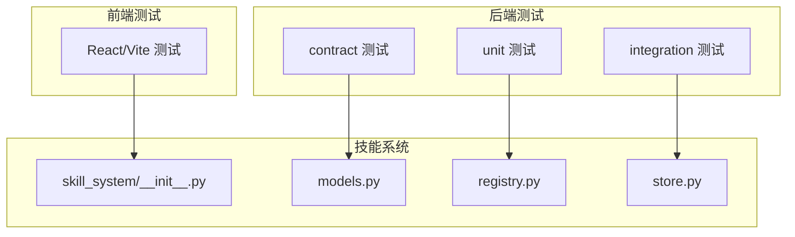
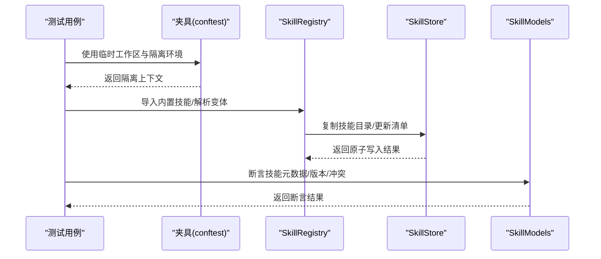
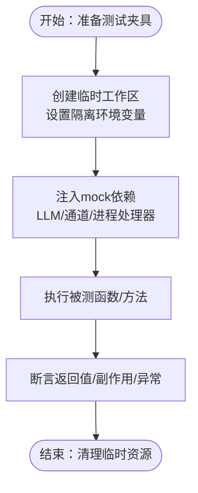
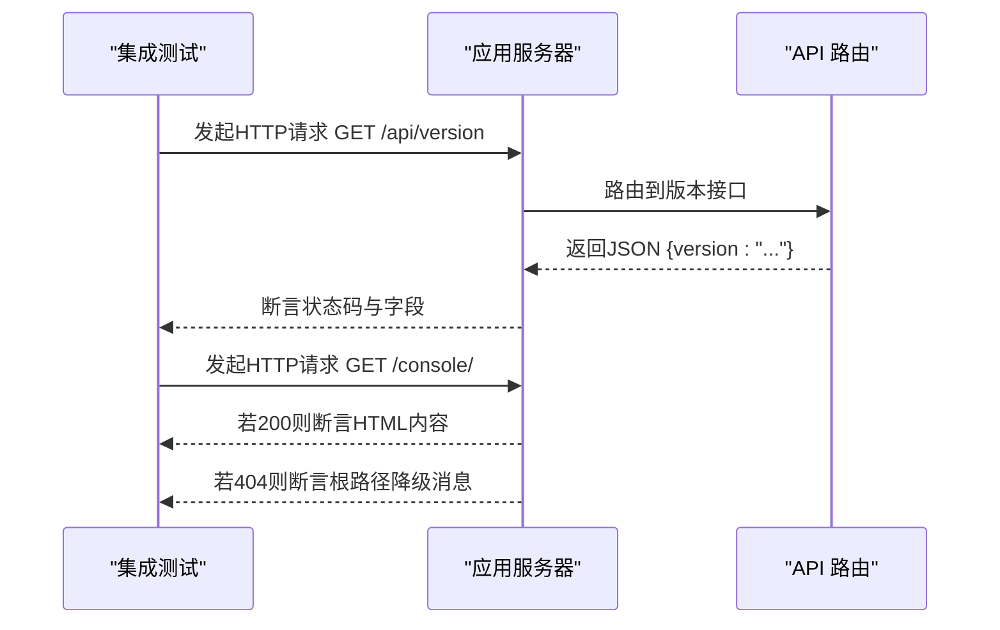
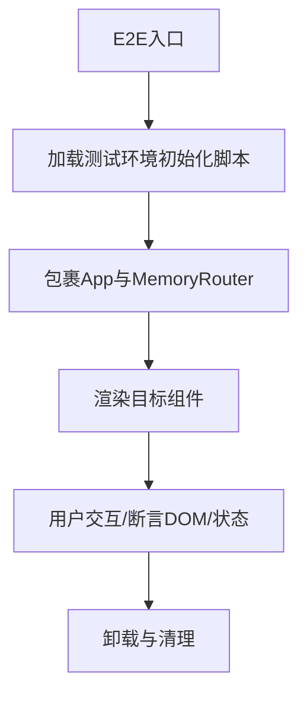
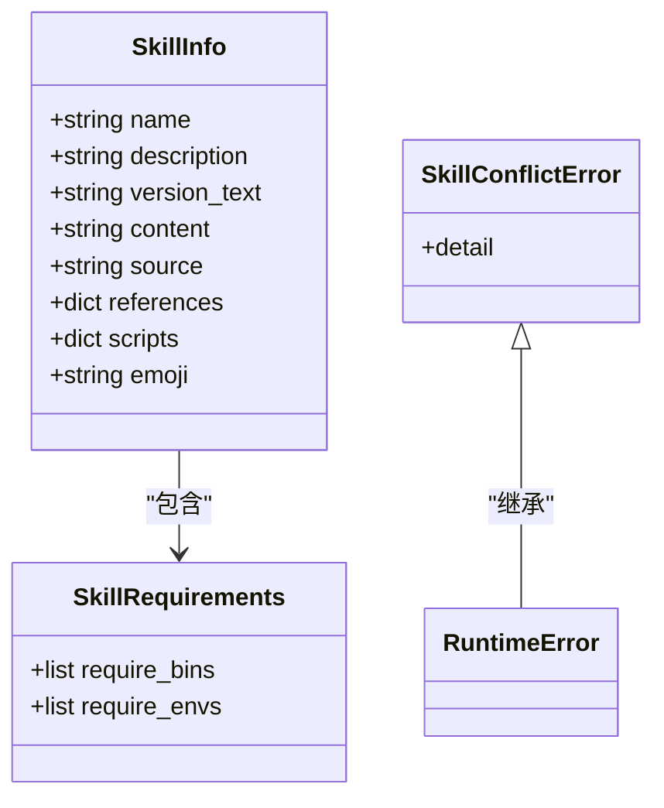
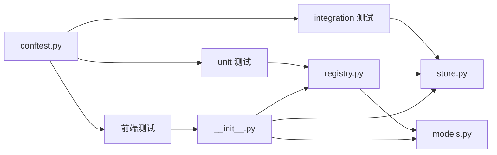

# 技能测试与调试

<cite>
**本文引用的文件**
- [README.md](file://README.md)
- [CONTRIBUTING.md](file://CONTRIBUTING.md)
- [tests/conftest.py](file://tests/conftest.py)
- [tests/unit/agents/test_command_handler.py](file://tests/unit/agents/test_command_handler.py)
- [tests/integration/test_app_startup.py](file://tests/integration/test_app_startup.py)
- [console/src/test/common_setup.tsx](file://console/src/test/common_setup.tsx)
- [console/src/test/setup.ts](file://console/src/test/setup.ts)
- [src/qwenpaw/agents/skill_system/__init__.py](file://src/qwenpaw/agents/skill_system/__init__.py)
- [src/qwenpaw/agents/skill_system/models.py](file://src/qwenpaw/agents/skill_system/models.py)
- [src/qwenpaw/agents/skill_system/registry.py](file://src/qwenpaw/agents/skill_system/registry.py)
- [src/qwenpaw/agents/skill_system/store.py](file://src/qwenpaw/agents/skill_system/store.py)
</cite>

## 目录
1. [引言](#引言)
2. [项目结构](#项目结构)
3. [核心组件](#核心组件)
4. [架构总览](#架构总览)
5. [详细组件分析](#详细组件分析)
6. [依赖关系分析](#依赖关系分析)
7. [性能考虑](#性能考虑)
8. [故障排查指南](#故障排查指南)
9. [结论](#结论)
10. [附录](#附录)

## 引言
本指南面向QwenPaw技能的测试与调试，目标是帮助开发者建立完善的测试体系（单元测试、集成测试、端到端测试），掌握调试工具（日志、断点、性能分析），设计覆盖正常场景、边界条件与异常处理的测试用例，并规范测试环境搭建与模拟数据准备流程。同时，文档涵盖性能测试、压力测试与稳定性测试的实施要点，以及常见问题的诊断与修复建议，并给出测试自动化的配置思路与持续集成实践。

## 项目结构
QwenPaw采用前后端分离与多语言混合的工程组织方式：后端以Python为主，前端基于React/Vite；测试体系覆盖Python后端与前端控制台两部分。仓库中已内置pytest与Vitest测试框架的基础配置与通用夹具，便于快速开展各类测试。

- 后端测试目录：tests
  - unit：单测模块，覆盖agents、app、channels、providers等子系统
  - integration：集成测试，验证应用启动、路由与基础功能
  - contract：通道契约测试，确保消息格式与行为符合约定
- 前端测试目录：console/src/test
  - 提供统一渲染与环境初始化脚本，便于在React组件层面进行单元与集成测试
- 技能系统核心代码：src/qwenpaw/agents/skill_system
  - 暴露技能注册、存储、工作区管理等能力，是技能测试与调试的关键对象

图表来源
- [tests/unit/agents/test_command_handler.py:1-33](file://tests/unit/agents/test_command_handler.py#L1-L33)
- [tests/integration/test_app_startup.py:1-36](file://tests/integration/test_app_startup.py#L1-L36)
- [console/src/test/common_setup.tsx:1-38](file://console/src/test/common_setup.tsx#L1-L38)
- [console/src/test/setup.ts:1-27](file://console/src/test/setup.ts#L1-L27)
- [src/qwenpaw/agents/skill_system/__init__.py:1-41](file://src/qwenpaw/agents/skill_system/__init__.py#L1-L41)
- [src/qwenpaw/agents/skill_system/models.py:1-77](file://src/qwenpaw/agents/skill_system/models.py#L1-L77)
- [src/qwenpaw/agents/skill_system/registry.py:1-800](file://src/qwenpaw/agents/skill_system/registry.py#L1-L800)
- [src/qwenpaw/agents/skill_system/store.py:1-800](file://src/qwenpaw/agents/skill_system/store.py#L1-L800)

章节来源
- [README.md: 444-466:444-466](file://README.md#L444-L466)
- [CONTRIBUTING.md: 68-86:68-86](file://CONTRIBUTING.md#L68-L86)

## 核心组件
- 技能系统导出接口：提供技能池服务、工作区服务、注册与存储能力的统一入口，便于在测试中按需注入与替换
- 技能模型与常量：定义技能信息、需求声明、冲突错误类型等，支撑测试对技能元数据与版本状态的断言
- 注册与解析：实现内置技能语言偏好、变体选择、导入候选构建、冲突检测与导入执行等逻辑，是技能加载与运行期行为的核心
- 存储与清单：负责技能目录复制、跨进程锁、原子写入、清单读取与变更、安全校验（如zip解压限制、路径安全）等，保障测试环境隔离与一致性

章节来源
- [src/qwenpaw/agents/skill_system/__init__.py: 1-41:1-41](file://src/qwenpaw/agents/skill_system/__init__.py#L1-L41)
- [src/qwenpaw/agents/skill_system/models.py: 1-77:1-77](file://src/qwenpaw/agents/skill_system/models.py#L1-L77)
- [src/qwenpaw/agents/skill_system/registry.py: 1-800:1-800](file://src/qwenpaw/agents/skill_system/registry.py#L1-L800)
- [src/qwenpaw/agents/skill_system/store.py: 1-800:1-800](file://src/qwenpaw/agents/skill_system/store.py#L1-L800)

## 架构总览
下图展示技能系统在测试中的关键交互：测试通过夹具构造隔离环境，调用技能系统API进行导入、解析与运行时注入，最终验证行为与状态。

图表来源
- [tests/conftest.py: 41-118:41-118](file://tests/conftest.py#L41-L118)
- [src/qwenpaw/agents/skill_system/registry.py: 657-792:657-792](file://src/qwenpaw/agents/skill_system/registry.py#L657-L792)
- [src/qwenpaw/agents/skill_system/store.py: 220-320:220-320](file://src/qwenpaw/agents/skill_system/store.py#L220-L320)
- [src/qwenpaw/agents/skill_system/models.py: 45-77:45-77](file://src/qwenpaw/agents/skill_system/models.py#L45-L77)

## 详细组件分析

### 单元测试策略与示例
- 设计原则
  - 隔离性：使用临时工作区与环境变量夹具，避免跨用例污染
  - 可控性：通过mock提供稳定的外部依赖（LLM、通道、进程处理器）
  - 可重复性：固定最小配置，确保测试可稳定复现
- 典型用例
  - 命令处理器：验证清除历史命令触发清理内存与元数据返回
  - 技能导入：验证导入候选构建、冲突检测与导入执行流程
  - 清单读取：验证跨进程锁与原子写入的一致性

图表来源
- [tests/conftest.py: 41-118:41-118](file://tests/conftest.py#L41-L118)
- [tests/conftest.py: 125-240:125-240](file://tests/conftest.py#L125-L240)
- [tests/unit/agents/test_command_handler.py: 23-33:23-33](file://tests/unit/agents/test_command_handler.py#L23-L33)

章节来源
- [tests/conftest.py: 41-118:41-118](file://tests/conftest.py#L41-L118)
- [tests/conftest.py: 125-240:125-240](file://tests/conftest.py#L125-L240)
- [tests/unit/agents/test_command_handler.py: 1-33:1-33](file://tests/unit/agents/test_command_handler.py#L1-L33)

### 集成测试策略与示例
- 设计原则
  - 端口与路由：验证应用启动后API端点可用性与返回格式
  - 控制台回退：在无预编译前端时，根路径应返回清晰的降级提示
- 典型用例
  - 版本接口：确认返回版本字符串且非空
  - 控制台入口：验证HTML响应或明确降级消息

图表来源
- [tests/integration/test_app_startup.py: 6-36:6-36](file://tests/integration/test_app_startup.py#L6-L36)

章节来源
- [tests/integration/test_app_startup.py: 1-36:1-36](file://tests/integration/test_app_startup.py#L1-L36)

### 端到端测试策略
- 设计原则
  - 前端渲染：使用统一的Provider包装与路由初始化，保证组件在真实DOM中渲染
  - 环境适配：补齐matchMedia与ResizeObserver等浏览器兼容性API
  - 场景覆盖：从聊天页面到设置页，覆盖常用交互链路
- 典型用例
  - 统一渲染器：在MemoryRouter与Ant Design App Provider中渲染组件
  - 环境初始化：挂载全局matchMedia与ResizeObserver，避免第三方库报错

图表来源
- [console/src/test/common_setup.tsx: 10-38:10-38](file://console/src/test/common_setup.tsx#L10-L38)
- [console/src/test/setup.ts: 1-27:1-27](file://console/src/test/setup.ts#L1-L27)

章节来源
- [console/src/test/common_setup.tsx: 1-38:1-38](file://console/src/test/common_setup.tsx#L1-L38)
- [console/src/test/setup.ts: 1-27:1-27](file://console/src/test/setup.ts#L1-L27)

### 技能系统测试要点
- 注册与解析
  - 内置技能语言偏好与变体选择：断言不同UI语言下的默认选择与回退策略
  - 导入候选构建：断言未知/不支持的导入请求抛出异常
  - 冲突检测：断言同名技能的语言切换或版本过期状态
- 存储与清单
  - 目录复制：断言忽略平台无关缓存文件，保留用户dotfiles
  - 原子写入：断言并发写入时的锁机制与版本号递增
  - 安全校验：断言zip大小限制、路径遍历与符号链接禁止

图表来源
- [src/qwenpaw/agents/skill_system/models.py: 45-77:45-77](file://src/qwenpaw/agents/skill_system/models.py#L45-L77)

章节来源
- [src/qwenpaw/agents/skill_system/registry.py: 177-231:177-231](file://src/qwenpaw/agents/skill_system/registry.py#L177-L231)
- [src/qwenpaw/agents/skill_system/registry.py: 554-575:554-575](file://src/qwenpaw/agents/skill_system/registry.py#L554-L575)
- [src/qwenpaw/agents/skill_system/store.py: 220-320:220-320](file://src/qwenpaw/agents/skill_system/store.py#L220-L320)
- [src/qwenpaw/agents/skill_system/store.py: 401-443:401-443](file://src/qwenpaw/agents/skill_system/store.py#L401-L443)

## 依赖关系分析
- 测试夹具依赖
  - 临时工作区与HOME/COPAW_HOME隔离，确保测试互不影响
  - 敏感环境变量清理，避免意外API调用
  - mock提供LLM、通道与进程处理器接口，降低外部依赖耦合
- 技能系统内部依赖
  - registry依赖store进行清单读写与目录复制
  - models为registry与store提供数据结构约束
  - __init__统一导出，便于测试按需引入

图表来源
- [tests/conftest.py: 1-431:1-431](file://tests/conftest.py#L1-L431)
- [src/qwenpaw/agents/skill_system/__init__.py: 1-41:1-41](file://src/qwenpaw/agents/skill_system/__init__.py#L1-L41)
- [src/qwenpaw/agents/skill_system/models.py: 1-77:1-77](file://src/qwenpaw/agents/skill_system/models.py#L1-L77)
- [src/qwenpaw/agents/skill_system/registry.py: 1-800:1-800](file://src/qwenpaw/agents/skill_system/registry.py#L1-L800)
- [src/qwenpaw/agents/skill_system/store.py: 1-800:1-800](file://src/qwenpaw/agents/skill_system/store.py#L1-L800)

章节来源
- [tests/conftest.py: 1-431:1-431](file://tests/conftest.py#L1-L431)
- [src/qwenpaw/agents/skill_system/__init__.py: 1-41:1-41](file://src/qwenpaw/agents/skill_system/__init__.py#L1-L41)

## 性能考虑
- 测试并发与隔离
  - 使用跨进程锁与原子写入，避免并发写入导致的数据竞争
  - 在测试中尽量缩短mock响应时间，减少等待开销
- 前端测试优化
  - 避免在每个用例中重复初始化Provider，可在beforeEach中共享setup
  - 对于重渲染场景，优先使用轻量级断言（如存在性断言）而非深度快照
- 技能导入与解析
  - 批量导入时合并请求，减少多次磁盘操作
  - 利用缓存与LRU机制，避免重复解析同一技能内容

## 故障排查指南
- 常见问题与定位
  - 环境变量污染：检查是否残留敏感令牌或路径变量，使用clean_env夹具清理
  - 并发写入冲突：确认清单写入使用原子写入与锁文件，避免竞态
  - zip导入失败：检查大小限制、路径合法性与符号链接禁止规则
- 调试技巧
  - 日志：在关键路径添加结构化日志，输出输入参数、中间状态与异常栈
  - 断点：在registry与store的关键分支设置断点，观察变体选择与冲突检测流程
  - 性能分析：对导入/解析耗时进行采样，识别瓶颈（磁盘IO、正则匹配、文件扫描）

章节来源
- [tests/conftest.py: 288-310:288-310](file://tests/conftest.py#L288-L310)
- [src/qwenpaw/agents/skill_system/store.py: 249-320:249-320](file://src/qwenpaw/agents/skill_system/store.py#L249-L320)
- [src/qwenpaw/agents/skill_system/store.py: 401-443:401-443](file://src/qwenpaw/agents/skill_system/store.py#L401-L443)

## 结论
通过建立以夹具为中心的隔离测试环境、以mock为核心的可控依赖注入、以原子写入与锁机制保障的并发安全，QwenPaw的技能测试与调试可以覆盖从单元到端到端的全链路场景。配合统一的前端测试初始化与断点/日志/性能分析手段，能够高效定位问题并持续提升系统稳定性与可维护性。

## 附录
- 测试自动化与持续集成建议
  - 规范化提交信息与PR标题，遵循约定式提交，便于CI与发布追踪
  - 在CI中分层执行：先跑unit，再跑integration，最后跑前端测试与contract测试
  - 将测试覆盖率纳入门禁，结合静态检查与格式化工具，确保质量门槛

章节来源
- [CONTRIBUTING.md: 23-67:23-67](file://CONTRIBUTING.md#L23-L67)
- [CONTRIBUTING.md: 68-86:68-86](file://CONTRIBUTING.md#L68-L86)