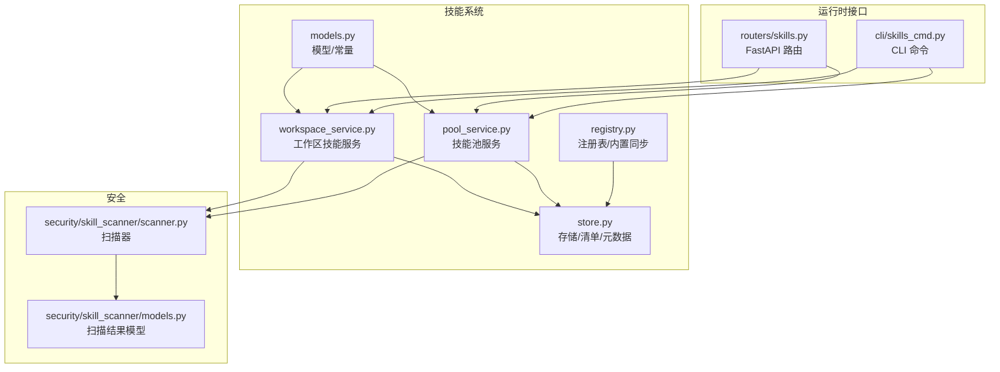
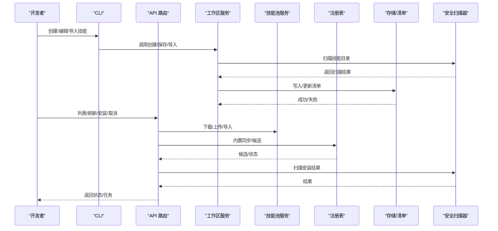
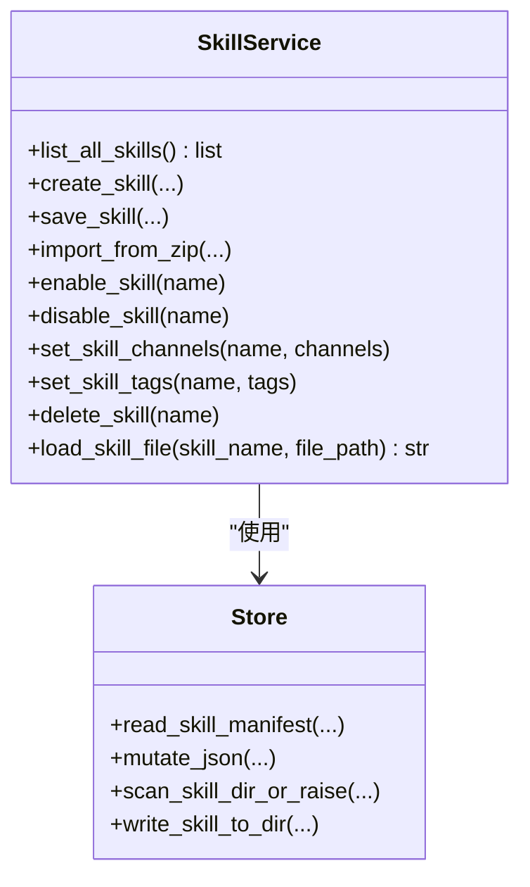
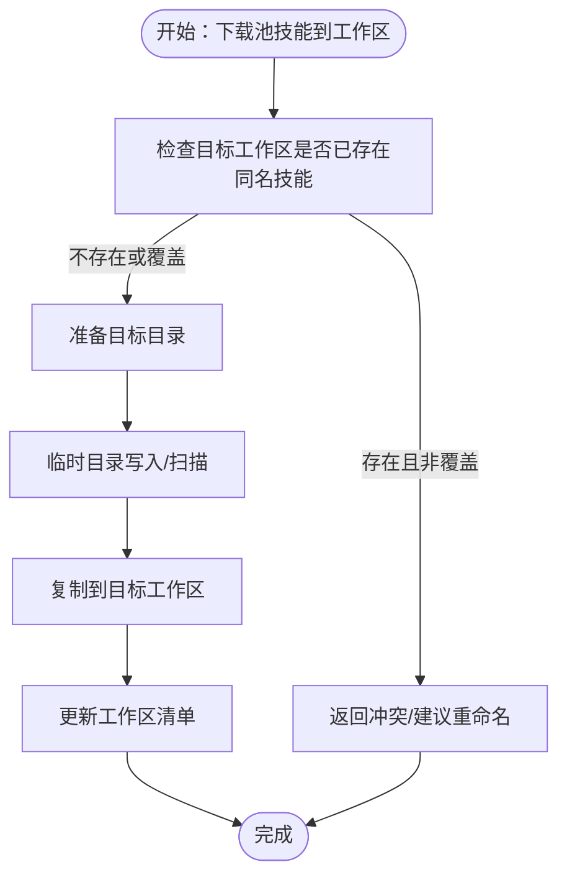
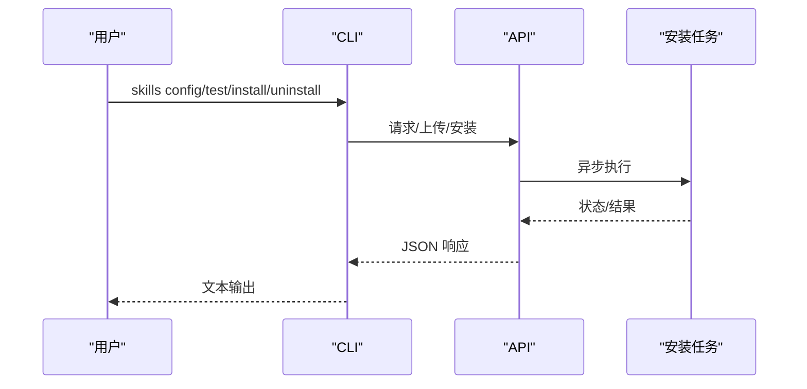
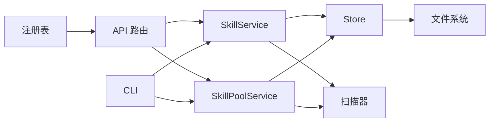

# 自定义技能开发

<cite>
**本文引用的文件**
- [src/qwenpaw/agents/skill_system/__init__.py](file://src/qwenpaw/agents/skill_system/__init__.py)
- [src/qwenpaw/agents/skill_system/models.py](file://src/qwenpaw/agents/skill_system/models.py)
- [src/qwenpaw/agents/skill_system/registry.py](file://src/qwenpaw/agents/skill_system/registry.py)
- [src/qwenpaw/agents/skill_system/store.py](file://src/qwenpaw/agents/skill_system/store.py)
- [src/qwenpaw/agents/skill_system/workspace_service.py](file://src/qwenpaw/agents/skill_system/workspace_service.py)
- [src/qwenpaw/agents/skill_system/pool_service.py](file://src/qwenpaw/agents/skill_system/pool_service.py)
- [src/qwenpaw/app/routers/skills.py](file://src/qwenpaw/app/routers/skills.py)
- [src/qwenpaw/cli/skills_cmd.py](file://src/qwenpaw/cli/skills_cmd.py)
- [src/qwenpaw/security/skill_scanner/scanner.py](file://src/qwenpaw/security/skill_scanner/scanner.py)
- [src/qwenpaw/security/skill_scanner/models.py](file://src/qwenpaw/security/skill_scanner/models.py)
- [src/qwenpaw/agents/skills/QA_source_index-en/SKILL.md](file://src/qwenpaw/agents/skills/QA_source_index-en/SKILL.md)
- [src/qwenpaw/agents/utils/file_handling.py](file://src/qwenpaw/agents/utils/file_handling.py)
</cite>

## 目录
1. [简介](#简介)
2. [项目结构](#项目结构)
3. [核心组件](#核心组件)
4. [架构总览](#架构总览)
5. [详细组件分析](#详细组件分析)
6. [依赖分析](#依赖分析)
7. [性能考虑](#性能考虑)
8. [故障排查指南](#故障排查指南)
9. [结论](#结论)
10. [附录](#附录)

## 简介
本指南面向希望在 QwenPaw 中开发“自定义技能”的工程师与产品人员。内容覆盖技能开发框架、模板系统与工具链，提供从需求分析到测试发布的一体化流程；详解技能清单（manifest）的编写规范、参数与依赖声明；文档化代码结构、接口规范与最佳实践；说明测试、调试与性能评估方法；给出打包、分发与版本管理方案；并涵盖安全审查、权限控制与错误处理要点。

## 项目结构
QwenPaw 的技能体系由“工作区技能”和“共享技能池”两部分构成，并通过统一的注册表与存储层进行协调。前端控制台与后端 API 路由共同提供可视化与自动化能力；CLI 提供交互式配置与批量操作；安全扫描器贯穿导入与启用流程，确保合规与安全。

图表来源
- [src/qwenpaw/agents/skill_system/workspace_service.py:40-718](file://src/qwenpaw/agents/skill_system/workspace_service.py#L40-L718)
- [src/qwenpaw/agents/skill_system/pool_service.py:45-866](file://src/qwenpaw/agents/skill_system/pool_service.py#L45-L866)
- [src/qwenpaw/agents/skill_system/registry.py:1-800](file://src/qwenpaw/agents/skill_system/registry.py#L1-L800)
- [src/qwenpaw/agents/skill_system/store.py:1-852](file://src/qwenpaw/agents/skill_system/store.py#L1-L852)
- [src/qwenpaw/agents/skill_system/models.py:1-77](file://src/qwenpaw/agents/skill_system/models.py#L1-L77)
- [src/qwenpaw/app/routers/skills.py:1-800](file://src/qwenpaw/app/routers/skills.py#L1-L800)
- [src/qwenpaw/cli/skills_cmd.py:1-561](file://src/qwenpaw/cli/skills_cmd.py#L1-L561)
- [src/qwenpaw/security/skill_scanner/scanner.py:1-319](file://src/qwenpaw/security/skill_scanner/scanner.py#L1-L319)
- [src/qwenpaw/security/skill_scanner/models.py:1-235](file://src/qwenpaw/security/skill_scanner/models.py#L1-L235)

章节来源
- [src/qwenpaw/agents/skill_system/__init__.py:1-41](file://src/qwenpaw/agents/skill_system/__init__.py#L1-L41)

## 核心组件
- 技能模型与常量：定义技能清单字段、路由通道白名单、冲突错误类型等。
- 存储与清单：负责路径解析、文件读写、原子 JSON 操作、元数据构建、冲突建议等。
- 注册表：内置技能语言偏好、变体选择、导入候选、内置同步状态与通知。
- 工作区技能服务：创建/编辑/导入/启用/禁用/删除/文件读取等生命周期管理。
- 技能池服务：共享技能的创建/导入/上传/下载/重命名/保存等。
- API 路由：对外暴露技能列表、安装任务、导入/导出、刷新、标签与配置管理等。
- CLI：交互式配置、列出/信息/安装/卸载、本地测试等。
- 安全扫描器：模式匹配扫描器，聚合发现结果，支持策略与去重。

章节来源
- [src/qwenpaw/agents/skill_system/models.py:1-77](file://src/qwenpaw/agents/skill_system/models.py#L1-L77)
- [src/qwenpaw/agents/skill_system/store.py:1-852](file://src/qwenpaw/agents/skill_system/store.py#L1-L852)
- [src/qwenpaw/agents/skill_system/registry.py:1-800](file://src/qwenpaw/agents/skill_system/registry.py#L1-L800)
- [src/qwenpaw/agents/skill_system/workspace_service.py:40-718](file://src/qwenpaw/agents/skill_system/workspace_service.py#L40-L718)
- [src/qwenpaw/agents/skill_system/pool_service.py:45-866](file://src/qwenpaw/agents/skill_system/pool_service.py#L45-L866)
- [src/qwenpaw/app/routers/skills.py:1-800](file://src/qwenpaw/app/routers/skills.py#L1-L800)
- [src/qwenpaw/cli/skills_cmd.py:1-561](file://src/qwenpaw/cli/skills_cmd.py#L1-L561)
- [src/qwenpaw/security/skill_scanner/scanner.py:1-319](file://src/qwenpaw/security/skill_scanner/scanner.py#L1-L319)
- [src/qwenpaw/security/skill_scanner/models.py:1-235](file://src/qwenpaw/security/skill_scanner/models.py#L1-L235)

## 架构总览
技能系统围绕“工作区技能目录 + 技能清单 + 技能池目录 + 共享清单”的双轨结构运作。工作区清单决定启用状态、渠道范围、用户标签与配置；技能池用于共享与复用，支持从内置包导入与多工作区下载。

图表来源
- [src/qwenpaw/cli/skills_cmd.py:1-561](file://src/qwenpaw/cli/skills_cmd.py#L1-L561)
- [src/qwenpaw/app/routers/skills.py:1-800](file://src/qwenpaw/app/routers/skills.py#L1-L800)
- [src/qwenpaw/agents/skill_system/workspace_service.py:40-718](file://src/qwenpaw/agents/skill_system/workspace_service.py#L40-L718)
- [src/qwenpaw/agents/skill_system/pool_service.py:45-866](file://src/qwenpaw/agents/skill_system/pool_service.py#L45-L866)
- [src/qwenpaw/agents/skill_system/registry.py:1-800](file://src/qwenpaw/agents/skill_system/registry.py#L1-L800)
- [src/qwenpaw/agents/skill_system/store.py:1-852](file://src/qwenpaw/agents/skill_system/store.py#L1-L852)
- [src/qwenpaw/security/skill_scanner/scanner.py:1-319](file://src/qwenpaw/security/skill_scanner/scanner.py#L1-L319)

## 详细组件分析

### 组件A：技能清单与模板系统
- 清单字段
  - 必填：name、description（来自 SKILL.md frontmatter）
  - 可选：version、metadata（如 qwenpaw.emoji、requires）、tags、config、channels、enabled 等
- 模板与目录
  - 技能根目录包含 SKILL.md（frontmatter + 内容），可选 references/ 与 scripts/ 子目录
  - 支持从 zip 导入，自动解析技能名与内容
- 元数据与版本
  - 通过 frontmatter 提取版本文本与描述，构建元数据条目
  - 冲突重命名采用时间戳后缀策略
- 依赖声明
  - metadata.qwenpaw.requires 或 metadata.openclaw.*.requires 支持 bins/env 列表
- 语言与内置
  - 内置技能按 en/zh 语言变体组织，可通过注册表选择与导入

章节来源
- [src/qwenpaw/agents/skill_system/store.py:555-792](file://src/qwenpaw/agents/skill_system/store.py#L555-L792)
- [src/qwenpaw/agents/skill_system/models.py:45-77](file://src/qwenpaw/agents/skill_system/models.py#L45-L77)
- [src/qwenpaw/agents/skill_system/registry.py:121-230](file://src/qwenpaw/agents/skill_system/registry.py#L121-L230)
- [src/qwenpaw/agents/skills/QA_source_index-en/SKILL.md:1-52](file://src/qwenpaw/agents/skills/QA_source_index-en/SKILL.md#L1-L52)

### 组件B：工作区技能服务（SkillService）
- 生命周期
  - 创建：校验 frontmatter、扫描、落盘、写入工作区清单
  - 编辑/重命名：原地或复制重命名，保持源类型与元数据
  - 导入：支持 zip 解压与冲突检测
  - 启用/禁用：变更清单中的 enabled 字段
  - 删除：仅允许未启用且存在时删除
  - 文件读取：受路径安全限制，仅允许 references/scripts 子树
- 配置与标签
  - 支持 per-skill config 与 tags
- 并发与一致性
  - 使用原子 JSON 写入与文件锁，避免并发冲突

图表来源
- [src/qwenpaw/agents/skill_system/workspace_service.py:40-718](file://src/qwenpaw/agents/skill_system/workspace_service.py#L40-L718)
- [src/qwenpaw/agents/skill_system/store.py:1-852](file://src/qwenpaw/agents/skill_system/store.py#L1-L852)

章节来源
- [src/qwenpaw/agents/skill_system/workspace_service.py:40-718](file://src/qwenpaw/agents/skill_system/workspace_service.py#L40-L718)

### 组件C：技能池服务（SkillPoolService）
- 共享能力
  - 在 skill_pool 目录下创建/导入/删除/重命名/保存
  - 将工作区技能上传至池，或将池技能下载到一个或多个工作区
- 冲突与回退
  - 下载前检查内置版本/语言一致性，必要时提示语言切换或冲突
  - 提供快照回滚以保障清单一致性
- 配置与标签
  - 与工作区一致的 config/tags 管理

图表来源
- [src/qwenpaw/agents/skill_system/pool_service.py:743-866](file://src/qwenpaw/agents/skill_system/pool_service.py#L743-L866)

章节来源
- [src/qwenpaw/agents/skill_system/pool_service.py:45-866](file://src/qwenpaw/agents/skill_system/pool_service.py#L45-L866)

### 组件D：注册表与内置技能
- 内置技能语言偏好与变体选择
  - 优先级：显式配置 > UI 语言 > 英文
  - 通过 packaged builtin 目录扫描与 frontmatter 版本提取
- 导入候选与冲突
  - 列出可导入的内置技能及其语言状态
  - 支持语言切换与版本差异提示
- 同步状态与更新通知
  - 计算指纹与变更集合，提供可操作技能列表

章节来源
- [src/qwenpaw/agents/skill_system/registry.py:64-230](file://src/qwenpaw/agents/skill_system/registry.py#L64-L230)
- [src/qwenpaw/agents/skill_system/registry.py:554-792](file://src/qwenpaw/agents/skill_system/registry.py#L554-L792)

### 组件E：API 路由与 CLI
- API 路由
  - 列表/刷新、工作区/池技能查询、Hub 安装任务（异步）、上传 zip、设置标签/配置、渠道范围等
  - 安全扫描失败返回结构化 422 响应
- CLI
  - 交互式配置、列出/信息、安装/卸载、本地测试
  - 冲突与扫描异常的用户友好提示

图表来源
- [src/qwenpaw/cli/skills_cmd.py:217-308](file://src/qwenpaw/cli/skills_cmd.py#L217-L308)
- [src/qwenpaw/app/routers/skills.py:657-715](file://src/qwenpaw/app/routers/skills.py#L657-L715)

章节来源
- [src/qwenpaw/app/routers/skills.py:1-800](file://src/qwenpaw/app/routers/skills.py#L1-L800)
- [src/qwenpaw/cli/skills_cmd.py:1-561](file://src/qwenpaw/cli/skills_cmd.py#L1-L561)

### 组件F：安全扫描器
- 扫描流程
  - 文件发现（排除软链、跳过过大/不支持扩展名）
  - 多分析器运行（默认模式匹配）
  - 去重与聚合，生成 ScanResult
- 结果模型
  - Severity/ThreatCategory/Finding/ScanResult
- 集成点
  - 创建/导入/下载/Hub 安装均触发扫描，失败时阻断并返回结构化错误

章节来源
- [src/qwenpaw/security/skill_scanner/scanner.py:148-242](file://src/qwenpaw/security/skill_scanner/scanner.py#L148-L242)
- [src/qwenpaw/security/skill_scanner/models.py:168-235](file://src/qwenpaw/security/skill_scanner/models.py#L168-L235)

## 依赖分析
- 组件耦合
  - SkillService 与 SkillPoolService 共享 store 层（读写清单、扫描、写盘）
  - API 路由与 CLI 均依赖服务层与注册表
  - 安全扫描器作为横切关注点，被多处调用
- 外部依赖
  - frontmatter 解析、文件系统、进程间锁（fcntl/msvcrt）
  - FastAPI 路由与 CLI click

图表来源
- [src/qwenpaw/agents/skill_system/workspace_service.py:1-718](file://src/qwenpaw/agents/skill_system/workspace_service.py#L1-L718)
- [src/qwenpaw/agents/skill_system/pool_service.py:1-866](file://src/qwenpaw/agents/skill_system/pool_service.py#L1-L866)
- [src/qwenpaw/app/routers/skills.py:1-800](file://src/qwenpaw/app/routers/skills.py#L1-L800)
- [src/qwenpaw/cli/skills_cmd.py:1-561](file://src/qwenpaw/cli/skills_cmd.py#L1-L561)
- [src/qwenpaw/agents/skill_system/store.py:1-852](file://src/qwenpaw/agents/skill_system/store.py#L1-L852)
- [src/qwenpaw/security/skill_scanner/scanner.py:1-319](file://src/qwenpaw/security/skill_scanner/scanner.py#L1-L319)

章节来源
- [src/qwenpaw/agents/skill_system/store.py:1-852](file://src/qwenpaw/agents/skill_system/store.py#L1-L852)

## 性能考虑
- 文件扫描限额
  - 默认最大文件数与单文件大小限制，避免大体积技能导致扫描耗时过长
- 原子写入与锁
  - 清单写入采用临时文件替换与跨进程锁，减少竞态与损坏风险
- 缓存与去重
  - 清单读取基于 mtime 缓存，扫描结果可按规则去重
- I/O 优化
  - 复制技能目录时过滤平台无关缓存与隐藏文件，保证跨平台一致性

章节来源
- [src/qwenpaw/security/skill_scanner/scanner.py:70-134](file://src/qwenpaw/security/skill_scanner/scanner.py#L70-L134)
- [src/qwenpaw/agents/skill_system/store.py:269-320](file://src/qwenpaw/agents/skill_system/store.py#L269-L320)
- [src/qwenpaw/agents/skill_system/store.py:632-671](file://src/qwenpaw/agents/skill_system/store.py#L632-L671)

## 故障排查指南
- 常见错误类型
  - 冲突：同名技能或语言切换冲突，系统会返回建议名称或冲突详情
  - 扫描失败：返回结构化扫描结果，包含最高严重级别与具体发现
  - 权限/路径：路径越界、绝对路径、空文件等会被拒绝
- 排查步骤
  - 使用 CLI test 对本地技能进行验证与扫描
  - 查看 API 返回的扫描错误详情，定位高危威胁类别
  - 检查工作区/池清单中 enabled/channels/tags/config 是否符合预期
  - 若启用后异常，使用快照回滚恢复
- 日志与可观测性
  - 扫描器记录发现与失败分析器
  - API 路由对异常进行结构化响应，便于前端展示

章节来源
- [src/qwenpaw/cli/skills_cmd.py:137-158](file://src/qwenpaw/cli/skills_cmd.py#L137-L158)
- [src/qwenpaw/app/routers/skills.py:75-116](file://src/qwenpaw/app/routers/skills.py#L75-L116)
- [src/qwenpaw/agents/skill_system/pool_service.py:298-347](file://src/qwenpaw/agents/skill_system/pool_service.py#L298-L347)

## 结论
QwenPaw 的技能系统通过“工作区技能 + 技能池 + 注册表 + 安全扫描”的组合，提供了从创建、导入、启用、配置到分发与版本管理的完整闭环。依托统一的清单与原子写入机制，配合严格的路径与扫描策略，既保证了灵活性，也确保了安全性与一致性。开发者可据此快速构建高质量、可复用的自定义技能。

## 附录

### A. 技能开发流程（从需求到发布）
- 需求分析
  - 明确输入/输出、前置条件、依赖（bin/env）、渠道范围
- 模板与清单
  - 编写 SKILL.md frontmatter（name/description/version/metadata.requires）
  - 准备 references/scripts 子目录（如有）
- 本地开发与测试
  - 使用 CLI skills test 进行本地验证与扫描
  - 在工作区创建/编辑技能，设置 channels/tags/config
- 安全与合规
  - 通过安全扫描器，修复高危项
- 分发与版本
  - 上传至技能池或 Hub，或打包为 zip 分发
  - 使用内置同步功能跟踪版本与语言变体
- 发布与回滚
  - 通过 API/CLI 安装到目标工作区
  - 如需回滚，使用快照回滚机制

章节来源
- [src/qwenpaw/cli/skills_cmd.py:548-561](file://src/qwenpaw/cli/skills_cmd.py#L548-L561)
- [src/qwenpaw/app/routers/skills.py:657-715](file://src/qwenpaw/app/routers/skills.py#L657-L715)
- [src/qwenpaw/agents/skill_system/pool_service.py:298-347](file://src/qwenpaw/agents/skill_system/pool_service.py#L298-L347)

### B. 技能清单（manifest）编写规范
- 必填字段
  - name、description（来自 SKILL.md frontmatter）
- 可选字段
  - version、metadata（含 qwenpaw.emoji、requires）、tags、config、channels、enabled
- 依赖声明
  - metadata.qwenpaw.requires 或 metadata.openclaw.*.requires
- 语言与内置
  - 内置技能按 en/zh 变体组织，可通过注册表选择

章节来源
- [src/qwenpaw/agents/skill_system/store.py:555-580](file://src/qwenpaw/agents/skill_system/store.py#L555-L580)
- [src/qwenpaw/agents/skill_system/models.py:64-77](file://src/qwenpaw/agents/skill_system/models.py#L64-L77)
- [src/qwenpaw/agents/skill_system/registry.py:121-230](file://src/qwenpaw/agents/skill_system/registry.py#L121-L230)

### C. 接口规范与最佳实践
- API
  - 使用 /skills 列表、刷新、上传、安装任务、标签/配置管理
  - 安装失败返回结构化扫描错误
- CLI
  - 交互式配置、列出/信息/安装/卸载、本地测试
- 最佳实践
  - 始终先扫描再启用
  - 合理使用 channels/tags/config 控制生效范围
  - 使用池共享通用技能，避免重复维护

章节来源
- [src/qwenpaw/app/routers/skills.py:608-727](file://src/qwenpaw/app/routers/skills.py#L608-L727)
- [src/qwenpaw/cli/skills_cmd.py:310-372](file://src/qwenpaw/cli/skills_cmd.py#L310-L372)

### D. 测试、调试与性能评估
- 测试
  - CLI skills test：校验 frontmatter、执行扫描
  - API 安装任务：异步执行，支持取消与回滚
- 调试
  - 查看扫描器日志与失败分析器
  - 使用工作区/池清单比对实际状态
- 性能
  - 控制 zip 体积与文件数量
  - 合理拆分 references/scripts，避免单文件过大

章节来源
- [src/qwenpaw/cli/skills_cmd.py:137-158](file://src/qwenpaw/cli/skills_cmd.py#L137-L158)
- [src/qwenpaw/security/skill_scanner/scanner.py:248-299](file://src/qwenpaw/security/skill_scanner/scanner.py#L248-L299)

### E. 打包、分发与版本管理
- 打包
  - 支持 zip 导入，自动解析技能名与内容
- 分发
  - 技能池共享、Hub 安装、多工作区下载
- 版本管理
  - 内置技能版本提取与比较，语言变体识别
  - 更新通知与指纹对比

章节来源
- [src/qwenpaw/agents/skill_system/store.py:794-852](file://src/qwenpaw/agents/skill_system/store.py#L794-L852)
- [src/qwenpaw/agents/skill_system/registry.py:223-230](file://src/qwenpaw/agents/skill_system/registry.py#L223-L230)
- [src/qwenpaw/agents/skill_system/registry.py:736-758](file://src/qwenpaw/agents/skill_system/registry.py#L736-L758)

### F. 安全审查、权限控制与错误处理
- 安全审查
  - 扫描器默认启用模式匹配分析，支持策略与去重
  - 安装/导入/下载均强制扫描，失败返回 422
- 权限控制
  - 路径安全：禁止绝对路径、越界访问、软链
  - 清单写入原子化，失败自动回滚
- 错误处理
  - 冲突返回建议名称
  - 扫描失败返回结构化错误，包含最高严重级别与发现列表

章节来源
- [src/qwenpaw/security/skill_scanner/scanner.py:148-242](file://src/qwenpaw/security/skill_scanner/scanner.py#L148-L242)
- [src/qwenpaw/agents/skill_system/store.py:424-443](file://src/qwenpaw/agents/skill_system/store.py#L424-L443)
- [src/qwenpaw/app/routers/skills.py:75-116](file://src/qwenpaw/app/routers/skills.py#L75-L116)