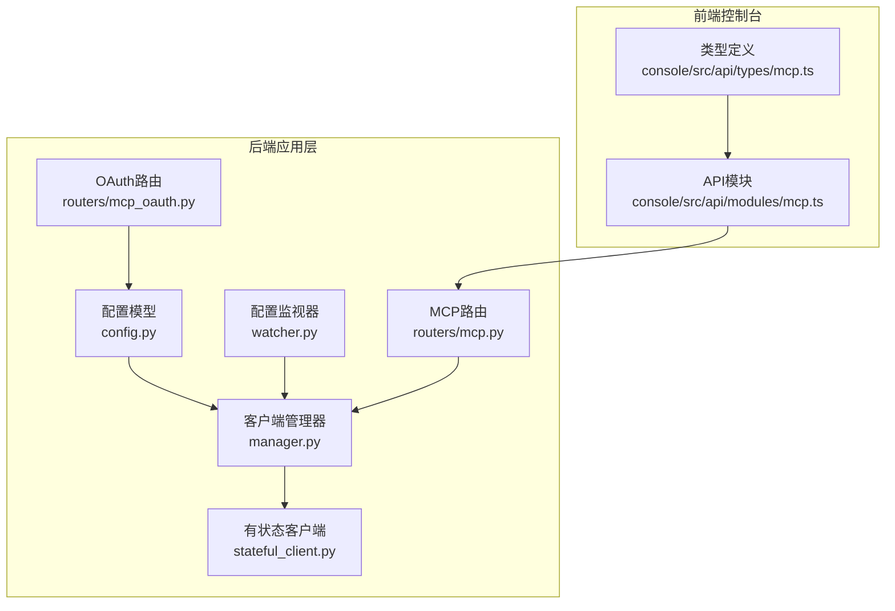
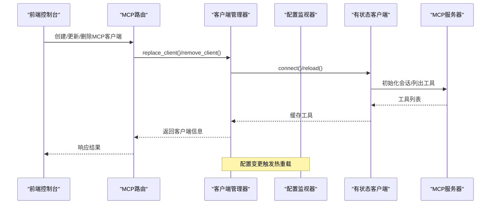
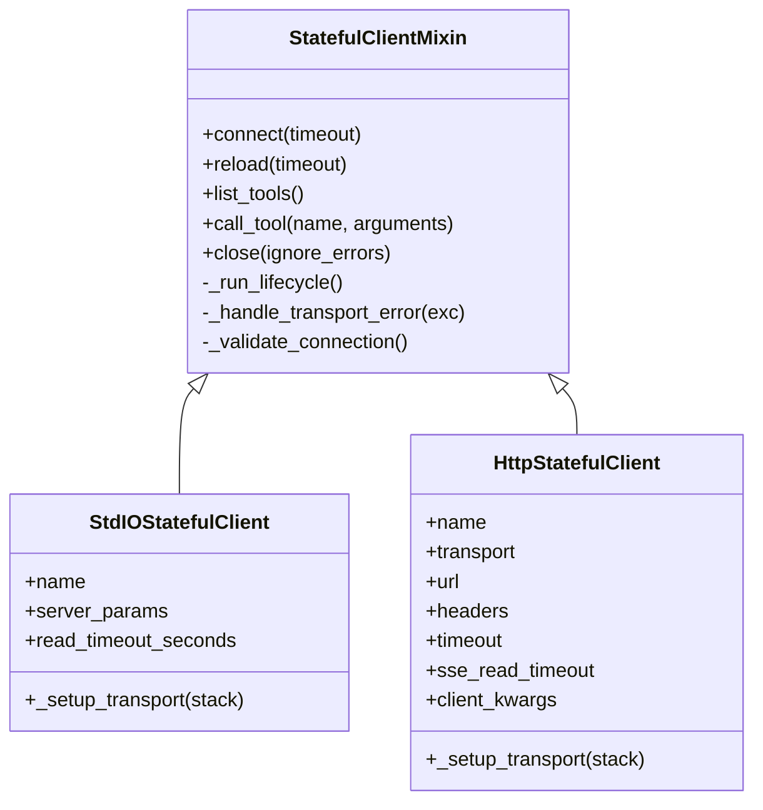
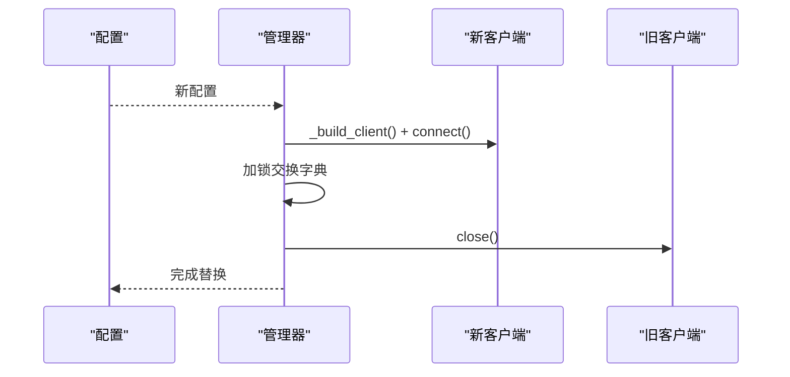
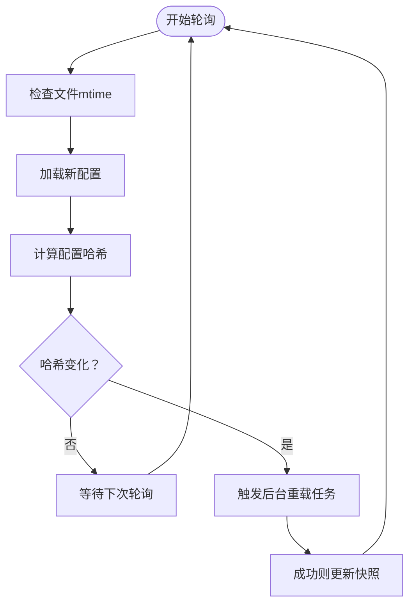
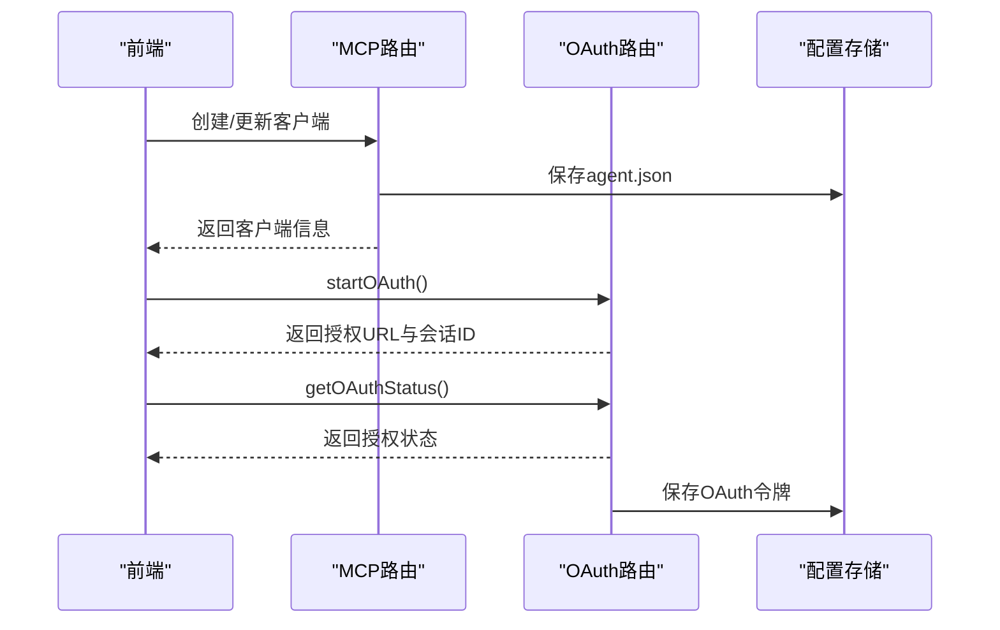
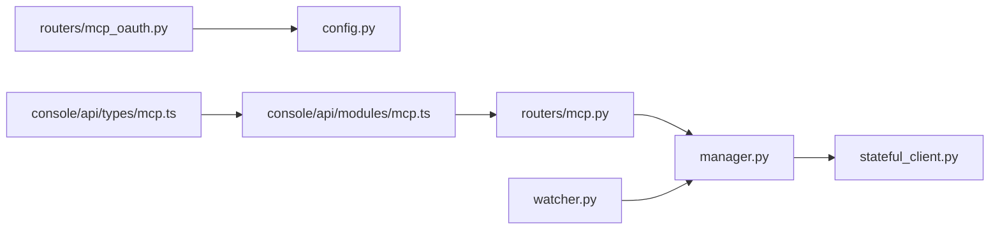

# MCP协议支持

<cite>
**本文档引用的文件**
- [src/qwenpaw/app/mcp/stateful_client.py](file://src/qwenpaw/app/mcp/stateful_client.py)
- [src/qwenpaw/app/mcp/manager.py](file://src/qwenpaw/app/mcp/manager.py)
- [src/qwenpaw/app/mcp/watcher.py](file://src/qwenpaw/app/mcp/watcher.py)
- [src/qwenpaw/app/routers/mcp.py](file://src/qwenpaw/app/routers/mcp.py)
- [src/qwenpaw/app/routers/mcp_oauth.py](file://src/qwenpaw/app/routers/mcp_oauth.py)
- [src/qwenpaw/config/config.py](file://src/qwenpaw/config/config.py)
- [console/src/api/modules/mcp.ts](file://console/src/api/modules/mcp.ts)
- [console/src/api/types/mcp.ts](file://console/src/api/types/mcp.ts)
- [website/public/docs/mcp.en.md](file://website/public/docs/mcp.en.md)
</cite>

## 目录
1. [简介](#简介)
2. [项目结构](#项目结构)
3. [核心组件](#核心组件)
4. [架构总览](#架构总览)
5. [详细组件分析](#详细组件分析)
6. [依赖关系分析](#依赖关系分析)
7. [性能考虑](#性能考虑)
8. [故障排除指南](#故障排除指南)
9. [结论](#结论)
10. [附录](#附录)

## 简介
本文件面向QwenPaw的MCP（Multimodal Communication Protocol）协议支持，系统性阐述MCP协议的实现原理、工作机制与应用场景。重点覆盖以下方面：
- StatefulClient（有状态客户端）的设计与生命周期管理，包括连接建立、会话管理与状态同步
- MCP在插件系统中的角色：工具调用、消息传递与状态管理
- 配置方法与参数说明：认证方式、超时设置与重连策略
- 调试工具使用与常见问题排查
- 扩展开发指南与最佳实践

## 项目结构
围绕MCP功能的相关模块分布于后端应用层与前端控制台之间，形成“配置-管理-路由-前端”的完整链路。

**图表来源**
- [src/qwenpaw/config/config.py:1226-1425](file://src/qwenpaw/config/config.py#L1226-L1425)
- [src/qwenpaw/app/mcp/manager.py:23-287](file://src/qwenpaw/app/mcp/manager.py#L23-L287)
- [src/qwenpaw/app/mcp/stateful_client.py:127-710](file://src/qwenpaw/app/mcp/stateful_client.py#L127-L710)
- [src/qwenpaw/app/mcp/watcher.py:24-332](file://src/qwenpaw/app/mcp/watcher.py#L24-L332)
- [src/qwenpaw/app/routers/mcp.py:17-519](file://src/qwenpaw/app/routers/mcp.py#L17-L519)
- [src/qwenpaw/app/routers/mcp_oauth.py:31-704](file://src/qwenpaw/app/routers/mcp_oauth.py#L31-L704)
- [console/src/api/modules/mcp.ts:1-94](file://console/src/api/modules/mcp.ts#L1-L94)
- [console/src/api/types/mcp.ts:1-67](file://console/src/api/types/mcp.ts#L1-L67)

**章节来源**
- [src/qwenpaw/app/mcp/stateful_client.py:1-710](file://src/qwenpaw/app/mcp/stateful_client.py#L1-L710)
- [src/qwenpaw/app/mcp/manager.py:1-287](file://src/qwenpaw/app/mcp/manager.py#L1-L287)
- [src/qwenpaw/app/mcp/watcher.py:1-332](file://src/qwenpaw/app/mcp/watcher.py#L1-L332)
- [src/qwenpaw/app/routers/mcp.py:1-519](file://src/qwenpaw/app/routers/mcp.py#L1-L519)
- [src/qwenpaw/app/routers/mcp_oauth.py:1-704](file://src/qwenpaw/app/routers/mcp_oauth.py#L1-L704)
- [src/qwenpaw/config/config.py:1226-1425](file://src/qwenpaw/config/config.py#L1226-L1425)
- [console/src/api/modules/mcp.ts:1-94](file://console/src/api/modules/mcp.ts#L1-L94)
- [console/src/api/types/mcp.ts:1-67](file://console/src/api/types/mcp.ts#L1-L67)

## 核心组件
- 有状态客户端（StatefulClient）
  - 提供统一的工具列表查询与工具调用能力
  - 支持stdio与HTTP/SSE两种传输模式
  - 内置生命周期任务与事件驱动的重载/停止机制
- 客户端管理器（MCPClientManager）
  - 负责客户端的初始化、替换、移除与关闭
  - 提供运行时热重载能力，避免重启应用
- 配置监视器（MCPConfigWatcher）
  - 周期性检查配置变更并触发客户端热重载
  - 具备失败重试跟踪与并发重载保护
- 路由接口（FastAPI）
  - 提供MCP客户端的增删改查、工具列表查询与OAuth授权流程
- 配置模型（Pydantic）
  - 定义MCP客户端、OAuth配置与MCP整体配置的数据结构与校验规则

**章节来源**
- [src/qwenpaw/app/mcp/stateful_client.py:127-710](file://src/qwenpaw/app/mcp/stateful_client.py#L127-L710)
- [src/qwenpaw/app/mcp/manager.py:23-287](file://src/qwenpaw/app/mcp/manager.py#L23-L287)
- [src/qwenpaw/app/mcp/watcher.py:24-332](file://src/qwenpaw/app/mcp/watcher.py#L24-L332)
- [src/qwenpaw/app/routers/mcp.py:17-519](file://src/qwenpaw/app/routers/mcp.py#L17-L519)
- [src/qwenpaw/app/routers/mcp_oauth.py:31-704](file://src/qwenpaw/app/routers/mcp_oauth.py#L31-L704)
- [src/qwenpaw/config/config.py:1226-1425](file://src/qwenpaw/config/config.py#L1226-L1425)

## 架构总览
下图展示了从配置到客户端管理再到API路由的整体交互流程。

**图表来源**
- [src/qwenpaw/app/mcp/manager.py:90-152](file://src/qwenpaw/app/mcp/manager.py#L90-L152)
- [src/qwenpaw/app/mcp/stateful_client.py:181-250](file://src/qwenpaw/app/mcp/stateful_client.py#L181-L250)
- [src/qwenpaw/app/routers/mcp.py:359-461](file://src/qwenpaw/app/routers/mcp.py#L359-L461)
- [src/qwenpaw/app/mcp/watcher.py:190-231](file://src/qwenpaw/app/mcp/watcher.py#L190-L231)

## 详细组件分析

### 有状态客户端（StatefulClient）工作原理
- 生命周期管理
  - 在专用后台任务中运行连接生命周期，确保进入/退出上下文在同一任务内，避免跨任务取消异常
  - 使用事件信号（reload/stop/ready）协调重载与停止
- 连接与会话
  - 支持stdio子进程与HTTP/SSE远程服务两种传输
  - 初始化ClientSession并执行initialize，建立稳定会话
- 工具调用与错误处理
  - list_tools/call_tool封装MCP工具访问
  - 对传输错误进行识别与自动重连，提升鲁棒性
- 状态同步
  - is_connected与session状态保持一致
  - 工具列表缓存减少重复查询

**图表来源**
- [src/qwenpaw/app/mcp/stateful_client.py:127-710](file://src/qwenpaw/app/mcp/stateful_client.py#L127-L710)

**章节来源**
- [src/qwenpaw/app/mcp/stateful_client.py:181-250](file://src/qwenpaw/app/mcp/stateful_client.py#L181-L250)
- [src/qwenpaw/app/mcp/stateful_client.py:435-483](file://src/qwenpaw/app/mcp/stateful_client.py#L435-L483)
- [src/qwenpaw/app/mcp/stateful_client.py:503-596](file://src/qwenpaw/app/mcp/stateful_client.py#L503-L596)
- [src/qwenpaw/app/mcp/stateful_client.py:598-710](file://src/qwenpaw/app/mcp/stateful_client.py#L598-L710)

### 客户端管理器（MCPClientManager）
- 初始化与热重载
  - 从配置批量初始化客户端，支持超时与异常清理
  - replace_client采用“先连接新实例→原子交换→再关闭旧实例”的顺序，避免阻塞读取
- 并发与一致性
  - 使用锁保护字典操作，确保get_clients/get_client等读取接口的线程安全
- OAuth集成
  - 注入Bearer令牌到HTTP请求头，自动跳过已过期令牌
  - 构建客户端时注入重建信息以便后续热重载

**图表来源**
- [src/qwenpaw/app/mcp/manager.py:90-152](file://src/qwenpaw/app/mcp/manager.py#L90-L152)
- [src/qwenpaw/app/mcp/manager.py:246-287](file://src/qwenpaw/app/mcp/manager.py#L246-L287)

**章节来源**
- [src/qwenpaw/app/mcp/manager.py:39-152](file://src/qwenpaw/app/mcp/manager.py#L39-L152)
- [src/qwenpaw/app/mcp/manager.py:219-244](file://src/qwenpaw/app/mcp/manager.py#L219-L244)

### 配置监视器（MCPConfigWatcher）
- 变更检测
  - 基于文件mtime与配置哈希快速判断是否需要重载
  - 支持独立于主配置监视器运行
- 重载策略
  - 避免并发重载任务堆积，失败客户端进行重试计数与上限控制
  - 成功后才更新快照，保证幂等性

**图表来源**
- [src/qwenpaw/app/mcp/watcher.py:140-213](file://src/qwenpaw/app/mcp/watcher.py#L140-L213)

**章节来源**
- [src/qwenpaw/app/mcp/watcher.py:149-231](file://src/qwenpaw/app/mcp/watcher.py#L149-L231)
- [src/qwenpaw/app/mcp/watcher.py:282-317](file://src/qwenpaw/app/mcp/watcher.py#L282-L317)

### API路由与前端交互
- 客户端管理API
  - 列表/详情/创建/更新/切换启用/删除
  - 查询已连接客户端可用工具
- OAuth授权流程
  - 启动授权（PKCE）、轮询状态、回调处理与令牌保存
- 前端对接
  - 控制台通过API模块发起请求，类型定义确保前后端契约一致

**图表来源**
- [src/qwenpaw/app/routers/mcp.py:359-461](file://src/qwenpaw/app/routers/mcp.py#L359-L461)
- [src/qwenpaw/app/routers/mcp_oauth.py:587-595](file://src/qwenpaw/app/routers/mcp_oauth.py#L587-L595)
- [console/src/api/modules/mcp.ts:12-94](file://console/src/api/modules/mcp.ts#L12-L94)
- [console/src/api/types/mcp.ts:16-67](file://console/src/api/types/mcp.ts#L16-L67)

**章节来源**
- [src/qwenpaw/app/routers/mcp.py:255-314](file://src/qwenpaw/app/routers/mcp.py#L255-L314)
- [src/qwenpaw/app/routers/mcp_oauth.py:31-200](file://src/qwenpaw/app/routers/mcp_oauth.py#L31-L200)
- [console/src/api/modules/mcp.ts:12-94](file://console/src/api/modules/mcp.ts#L12-L94)
- [console/src/api/types/mcp.ts:16-67](file://console/src/api/types/mcp.ts#L16-L67)

## 依赖关系分析
- 组件耦合
  - Manager依赖StatefulClient构建与连接；Watcher依赖Manager进行热重载
  - 路由层依赖Agent上下文与配置存储，间接依赖Manager
- 外部依赖
  - mcp库用于ClientSession与传输适配
  - httpx用于HTTP/SSE客户端
  - FastAPI用于路由与响应

**图表来源**
- [src/qwenpaw/app/mcp/manager.py:15-18](file://src/qwenpaw/app/mcp/manager.py#L15-L18)
- [src/qwenpaw/app/mcp/stateful_client.py:25-31](file://src/qwenpaw/app/mcp/stateful_client.py#L25-L31)
- [src/qwenpaw/app/routers/mcp.py:9-13](file://src/qwenpaw/app/routers/mcp.py#L9-L13)
- [src/qwenpaw/app/routers/mcp_oauth.py:26-27](file://src/qwenpaw/app/routers/mcp_oauth.py#L26-L27)
- [console/src/api/modules/mcp.ts:1-10](file://console/src/api/modules/mcp.ts#L1-L10)

**章节来源**
- [src/qwenpaw/app/mcp/stateful_client.py:19-31](file://src/qwenpaw/app/mcp/stateful_client.py#L19-L31)
- [src/qwenpaw/app/mcp/manager.py:15-18](file://src/qwenpaw/app/mcp/manager.py#L15-L18)
- [src/qwenpaw/app/routers/mcp.py:9-13](file://src/qwenpaw/app/routers/mcp.py#L9-L13)

## 性能考虑
- 连接与重连
  - 生命周期任务避免跨任务资源清理问题，降低CPU泄漏风险
  - 传输错误自动标记断开并触发重连，减少长时间挂起
- 并发与锁
  - 管理器对字典操作加锁，读取路径使用异步锁，避免阻塞
- I/O与超时
  - HTTP客户端超时分段配置（连接/读/写/池），SSE读超时可单独设置
- 热重载
  - 替换流程先外部连接新客户端，再原子交换，最后外部关闭旧客户端，避免阻塞读取

[本节为通用性能讨论，不直接分析具体文件]

## 故障排除指南
- 常见问题与定位
  - 连接超时：检查connect()超时参数与网络可达性
  - 401未授权：确认OAuth令牌有效或启动授权流程
  - 传输错误：如EOF/BrokenPipeError/ClosedResourceError，客户端会自动重连
  - 配置未生效：确认配置监视器轮询间隔与文件mtime变化
- 排查步骤
  - 查看客户端连接状态与工具列表
  - 检查OAuth状态与令牌有效期
  - 观察日志输出，定位生命周期任务与重载过程
  - 使用API测试工具验证路由行为

**章节来源**
- [src/qwenpaw/app/mcp/stateful_client.py:106-125](file://src/qwenpaw/app/mcp/stateful_client.py#L106-L125)
- [src/qwenpaw/app/mcp/stateful_client.py:227-249](file://src/qwenpaw/app/mcp/stateful_client.py#L227-L249)
- [src/qwenpaw/app/mcp/watcher.py:149-188](file://src/qwenpaw/app/mcp/watcher.py#L149-L188)
- [src/qwenpaw/app/routers/mcp.py:255-314](file://src/qwenpaw/app/routers/mcp.py#L255-L314)

## 结论
QwenPaw的MCP支持以“配置-管理-路由-前端”为主线，实现了：
- 稳健的有状态客户端生命周期管理与自动重连
- 支持多种传输的工具调用与消息传递
- 完整的OAuth授权与令牌管理
- 热重载与并发安全的客户端管理
- 清晰的API与前端交互契约

该方案既满足本地stdio工具与远程HTTP/SSE服务的接入需求，又为扩展新的MCP服务器与工具提供了良好的基础。

[本节为总结性内容，不直接分析具体文件]

## 附录

### MCP协议配置方法与参数说明
- 配置位置与格式
  - 支持标准mcpServers格式、直接键值格式与单客户端格式
  - 自动检测transport类型（有command→stdio；有url→http/sse）
- 关键字段
  - name/description/enabled：客户端标识与启用状态
  - transport/url/headers：HTTP/SSE传输配置
  - command/args/env/cwd：stdio传输配置
  - oauth：OAuth 2.1配置（client_id/scope/access_token/expires_at等）

**章节来源**
- [website/public/docs/mcp.en.md:53-188](file://website/public/docs/mcp.en.md#L53-L188)
- [src/qwenpaw/config/config.py:1244-1319](file://src/qwenpaw/config/config.py#L1244-L1319)

### 认证方式与OAuth流程
- OAuth 2.1 PKCE
  - 前端发起startOAuth，返回授权URL与会话ID
  - 前端轮询getOAuthStatus，直到授权完成
  - 回调处理保存令牌并触发配置热重载
- 令牌注入
  - 管理器在HTTP请求头中注入Bearer令牌（忽略过期令牌）

**章节来源**
- [src/qwenpaw/app/routers/mcp_oauth.py:31-200](file://src/qwenpaw/app/routers/mcp_oauth.py#L31-L200)
- [src/qwenpaw/app/routers/mcp_oauth.py:587-595](file://src/qwenpaw/app/routers/mcp_oauth.py#L587-L595)
- [src/qwenpaw/app/mcp/manager.py:219-244](file://src/qwenpaw/app/mcp/manager.py#L219-L244)
- [console/src/api/modules/mcp.ts:65-93](file://console/src/api/modules/mcp.ts#L65-L93)

### 超时设置与重连策略
- 连接超时：connect()默认超时参数
- 重连策略：传输错误自动标记断开并触发重连
- SSE读超时：可独立配置，避免长时间阻塞

**章节来源**
- [src/qwenpaw/app/mcp/stateful_client.py:251-302](file://src/qwenpaw/app/mcp/stateful_client.py#L251-L302)
- [src/qwenpaw/app/mcp/stateful_client.py:435-483](file://src/qwenpaw/app/mcp/stateful_client.py#L435-L483)
- [src/qwenpaw/app/mcp/stateful_client.py:670-710](file://src/qwenpaw/app/mcp/stateful_client.py#L670-L710)

### 插件系统中的MCP作用
- 工具注册
  - 连接的MCP服务器会向Agent注册可用工具
- 消息传递
  - 通过ClientSession与MCP服务器进行消息交互
- 状态管理
  - is_connected与session状态同步，工具列表缓存减少重复查询

**章节来源**
- [src/qwenpaw/app/mcp/stateful_client.py:340-380](file://src/qwenpaw/app/mcp/stateful_client.py#L340-L380)
- [src/qwenpaw/app/mcp/stateful_client.py:484-501](file://src/qwenpaw/app/mcp/stateful_client.py#L484-L501)

### 调试工具使用方法
- API测试
  - 使用控制台API模块进行客户端增删改查与工具查询
- 日志观察
  - 关注MCP客户端连接、重载与错误日志
- OAuth调试
  - 通过startOAuth与getOAuthStatus验证授权流程

**章节来源**
- [console/src/api/modules/mcp.ts:12-94](file://console/src/api/modules/mcp.ts#L12-L94)
- [src/qwenpaw/app/routers/mcp.py:255-314](file://src/qwenpaw/app/routers/mcp.py#L255-L314)

### 扩展开发指南与最佳实践
- 新增MCP服务器
  - 选择合适transport（stdio/local或HTTP/SSE/remote）
  - 正确配置命令/参数/环境变量或URL/Headers
- 安全建议
  - 使用OAuth 2.1 PKCE保护令牌
  - 避免在配置中硬编码敏感信息，优先使用环境变量
- 性能优化
  - 合理设置超时与SSE读超时
  - 利用工具列表缓存减少重复查询
- 可靠性
  - 监控传输错误并利用自动重连
  - 使用配置监视器实现热重载，避免停机

**章节来源**
- [website/public/docs/mcp.en.md:162-188](file://website/public/docs/mcp.en.md#L162-L188)
- [src/qwenpaw/app/mcp/stateful_client.py:670-710](file://src/qwenpaw/app/mcp/stateful_client.py#L670-L710)
- [src/qwenpaw/app/mcp/watcher.py:282-317](file://src/qwenpaw/app/mcp/watcher.py#L282-L317)