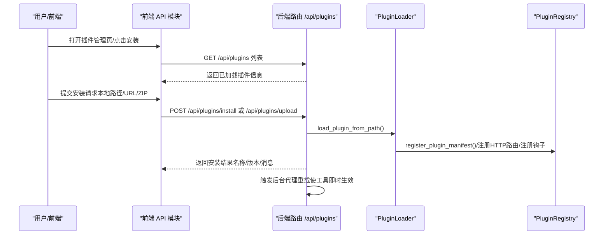
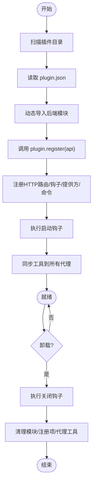
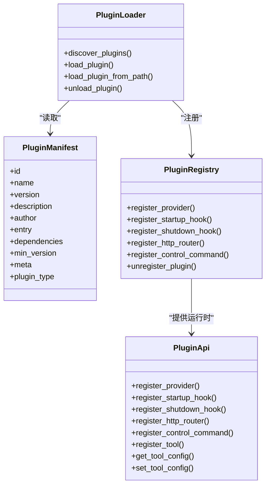

# 插件市场与分发

<cite>
**本文引用的文件**
- [src/qwenpaw/plugins/__init__.py](file://src/qwenpaw/plugins/__init__.py)
- [src/qwenpaw/plugins/api.py](file://src/qwenpaw/plugins/api.py)
- [src/qwenpaw/plugins/architecture.py](file://src/qwenpaw/plugins/architecture.py)
- [src/qwenpaw/plugins/loader.py](file://src/qwenpaw/plugins/loader.py)
- [src/qwenpaw/plugins/registry.py](file://src/qwenpaw/plugins/registry.py)
- [src/qwenpaw/plugins/runtime.py](file://src/qwenpaw/plugins/runtime.py)
- [src/qwenpaw/cli/plugin_commands.py](file://src/qwenpaw/cli/plugin_commands.py)
- [src/qwenpaw/app/routers/plugins.py](file://src/qwenpaw/app/routers/plugins.py)
- [console/src/api/modules/plugin.ts](file://console/src/api/modules/plugin.ts)
- [console/src/pages/Settings/PluginManager/index.tsx](file://console/src/pages/Settings/PluginManager/index.tsx)
- [plugins/tool/gpt-image2/plugin.json](file://plugins/tool/gpt-image2/plugin.json)
- [plugins/tool/qwen-image/plugin.json](file://plugins/tool/qwen-image/plugin.json)
- [plugins/tool/wan27/plugin.json](file://plugins/tool/wan27/plugin.json)
- [website/public/docs/plugins.en.md](file://website/public/docs/plugins.en.md)
- [src/qwenpaw/app/approvals/service.py](file://src/qwenpaw/app/approvals/service.py)
</cite>

## 目录
1. [简介](#简介)
2. [项目结构](#项目结构)
3. [核心组件](#核心组件)
4. [架构总览](#架构总览)
5. [详细组件分析](#详细组件分析)
6. [依赖关系分析](#依赖关系分析)
7. [性能考量](#性能考量)
8. [故障排查指南](#故障排查指南)
9. [结论](#结论)
10. [附录](#附录)

## 简介
本指南面向使用者与开发者，系统性阐述 QwenPaw 的插件市场与分发体系：涵盖插件浏览、搜索、安装与卸载的完整流程；解析插件包格式（plugin.json）与版本管理策略；说明插件分发机制与依赖声明；梳理插件审核与安全控制；给出插件市场 API 接口规范；并提供插件开发者发布、版本更新与用户支持的最佳实践。

## 项目结构
QwenPaw 插件系统由“后端加载器/注册表/路由”、“前端管理界面”、“CLI 安装工具”以及“示例插件”构成。后端负责插件发现、动态加载、运行时集成与生命周期管理；前端提供插件列表、安装入口与状态查看；CLI 支持离线安装与在线下载安装；示例插件展示工具型插件的配置字段与元数据。

```mermaid
graph TB
subgraph "后端"
Loader["PluginLoader<br/>发现/加载插件"]
Registry["PluginRegistry<br/>注册中心/路由挂载"]
Routers["/api/plugins 路由<br/>安装/卸载/状态"]
Approve["ApprovalService<br/>审批服务"]
end
subgraph "前端"
UI["插件管理页面<br/>列表/安装/状态"]
API["前端 API 模块<br/>fetchPlugins/installPlugin/uninstallPlugin"]
end
subgraph "CLI"
CLI["qwenpaw plugin 命令<br/>install/list/info/uninstall"]
end
subgraph "示例插件"
Img["gpt-image2/plugin.json"]
QwenImg["qwen-image/plugin.json"]
Wan27["wan27/plugin.json"]
end
UI --> API
API --> Routers
CLI --> Routers
Routers --> Loader
Loader --> Registry
Registry --> Routers
UI --> Approve
Img --> Loader
QwenImg --> Loader
Wan27 --> Loader
```

图表来源
- [src/qwenpaw/plugins/loader.py:23-628](file://src/qwenpaw/plugins/loader.py#L23-L628)
- [src/qwenpaw/plugins/registry.py:95-598](file://src/qwenpaw/plugins/registry.py#L95-L598)
- [src/qwenpaw/app/routers/plugins.py:441-776](file://src/qwenpaw/app/routers/plugins.py#L441-L776)
- [console/src/api/modules/plugin.ts:1-139](file://console/src/api/modules/plugin.ts#L1-L139)
- [console/src/pages/Settings/PluginManager/index.tsx:1-161](file://console/src/pages/Settings/PluginManager/index.tsx#L1-L161)
- [src/qwenpaw/cli/plugin_commands.py:495-919](file://src/qwenpaw/cli/plugin_commands.py#L495-L919)
- [plugins/tool/gpt-image2/plugin.json:1-89](file://plugins/tool/gpt-image2/plugin.json#L1-L89)
- [plugins/tool/qwen-image/plugin.json:1-129](file://plugins/tool/qwen-image/plugin.json#L1-L129)
- [plugins/tool/wan27/plugin.json:1-122](file://plugins/tool/wan27/plugin.json#L1-L122)

章节来源
- [src/qwenpaw/plugins/__init__.py:1-17](file://src/qwenpaw/plugins/__init__.py#L1-L17)
- [website/public/docs/plugins.en.md:1-200](file://website/public/docs/plugins.en.md#L1-L200)

## 核心组件
- 插件清单与类型定义：定义插件清单结构、入口点与类型枚举，用于识别插件能力（工具、提供方、钩子、命令、前端、通用）。
- 插件加载器：扫描目录、读取清单、动态导入后端模块、执行注册回调、安装依赖、挂载 HTTP 路由、注册启动/关闭钩子等。
- 注册中心：集中管理提供方、控制命令、HTTP 路由、启动/关闭钩子、插件清单与运行时助手，并在卸载时清理。
- 后端路由：提供插件列表、热安装/上传、卸载与状态查询接口，支持强制重装与后台代理刷新。
- 前端 API 模块：封装 GET/POST/DELETE 请求，对接后端 /api/plugins。
- CLI 插件命令：支持本地路径、URL 与 ZIP 文件安装，离线验证与依赖安装，同步工具到所有代理。
- 示例插件：展示工具型插件的多工具声明、配置字段与元数据。

章节来源
- [src/qwenpaw/plugins/architecture.py:10-142](file://src/qwenpaw/plugins/architecture.py#L10-L142)
- [src/qwenpaw/plugins/loader.py:23-628](file://src/qwenpaw/plugins/loader.py#L23-L628)
- [src/qwenpaw/plugins/registry.py:95-598](file://src/qwenpaw/plugins/registry.py#L95-L598)
- [src/qwenpaw/app/routers/plugins.py:441-776](file://src/qwenpaw/app/routers/plugins.py#L441-L776)
- [console/src/api/modules/plugin.ts:1-139](file://console/src/api/modules/plugin.ts#L1-L139)
- [src/qwenpaw/cli/plugin_commands.py:495-919](file://src/qwenpaw/cli/plugin_commands.py#L495-L919)
- [plugins/tool/gpt-image2/plugin.json:1-89](file://plugins/tool/gpt-image2/plugin.json#L1-L89)

## 架构总览
下图展示从用户操作到后端处理、再到插件加载与运行时集成的关键交互。



图表来源
- [console/src/pages/Settings/PluginManager/index.tsx:1-161](file://console/src/pages/Settings/PluginManager/index.tsx#L1-L161)
- [console/src/api/modules/plugin.ts:51-139](file://console/src/api/modules/plugin.ts#L51-L139)
- [src/qwenpaw/app/routers/plugins.py:497-713](file://src/qwenpaw/app/routers/plugins.py#L497-L713)
- [src/qwenpaw/plugins/loader.py:406-485](file://src/qwenpaw/plugins/loader.py#L406-L485)
- [src/qwenpaw/plugins/registry.py:141-214](file://src/qwenpaw/plugins/registry.py#L141-L214)

## 详细组件分析

### 插件包格式与版本管理
- 清单字段：id、name、version、description、author、entry（backend/frontend）、dependencies、min_version、meta、type。
- 元数据与工具声明：meta.tools 支持多工具声明，含名称、描述、图标、是否需要配置、配置字段（名称、标签、类型、必填、默认值、范围、帮助文本等）。
- 版本与兼容：min_version 字段用于最小兼容版本约束；type 字段显式声明插件类型，缺失时通过 meta 与入口点推断。
- 依赖声明：requirements.txt 与 plugin.json 中的 dependencies 共同决定安装时的依赖解析与安装策略。

章节来源
- [plugins/tool/gpt-image2/plugin.json:1-89](file://plugins/tool/gpt-image2/plugin.json#L1-L89)
- [plugins/tool/qwen-image/plugin.json:1-129](file://plugins/tool/qwen-image/plugin.json#L1-L129)
- [plugins/tool/wan27/plugin.json:1-122](file://plugins/tool/wan27/plugin.json#L1-L122)
- [src/qwenpaw/plugins/architecture.py:44-142](file://src/qwenpaw/plugins/architecture.py#L44-L142)

### 插件加载与生命周期
- 发现与加载：扫描插件目录，读取 plugin.json，动态导入后端模块，调用 plugin.register(api) 完成注册。
- 运行时集成：注册提供方、控制命令、HTTP 路由；执行启动钩子；将工具同步至所有代理配置。
- 卸载与清理：执行关闭钩子，移除模块与注册项，清理代理工具配置，可选删除磁盘文件。



图表来源
- [src/qwenpaw/plugins/loader.py:36-262](file://src/qwenpaw/plugins/loader.py#L36-L262)
- [src/qwenpaw/plugins/registry.py:141-503](file://src/qwenpaw/plugins/registry.py#L141-L503)
- [src/qwenpaw/app/routers/plugins.py:128-212](file://src/qwenpaw/app/routers/plugins.py#L128-L212)

章节来源
- [src/qwenpaw/plugins/loader.py:88-238](file://src/qwenpaw/plugins/loader.py#L88-L238)
- [src/qwenpaw/plugins/registry.py:249-503](file://src/qwenpaw/plugins/registry.py#L249-L503)

### 插件市场 API 接口规范
- 获取插件列表
  - 方法：GET
  - 路径：/api/plugins
  - 响应：插件数组，包含 id、name、version、description、author、enabled、loaded、plugin_type、frontend_entry
- 热安装插件（本地或 URL）
  - 方法：POST
  - 路径：/api/plugins/install
  - 请求体：{ source: string, force?: boolean }
  - 响应：安装结果对象（id/name/version/description/author/loaded/message）
- 上传 ZIP 安装
  - 方法：POST
  - 路径：/api/plugins/upload?force=false
  - 表单字段：file（.zip）
  - 响应：安装结果对象
- 卸载插件
  - 方法：DELETE
  - 路径：/api/plugins/{plugin_id}
  - 响应：{ id, message }
- 查询插件状态
  - 方法：GET
  - 路径：/api/plugins/{plugin_id}/status
  - 响应：{ id, loaded, enabled, version? }

章节来源
- [src/qwenpaw/app/routers/plugins.py:441-776](file://src/qwenpaw/app/routers/plugins.py#L441-L776)
- [console/src/api/modules/plugin.ts:51-139](file://console/src/api/modules/plugin.ts#L51-L139)

### 前端插件管理与安装
- 插件管理页面：展示插件列表、类型标签、启用状态与操作按钮；支持打开安装模态框。
- 安装方式：支持本地目录路径、HTTP(S) URL 与 ZIP 文件上传；安装成功后自动刷新列表。
- 状态查询：按需获取单个插件的运行时状态。

章节来源
- [console/src/pages/Settings/PluginManager/index.tsx:1-161](file://console/src/pages/Settings/PluginManager/index.tsx#L1-L161)
- [console/src/api/modules/plugin.ts:1-139](file://console/src/api/modules/plugin.ts#L1-L139)

### CLI 插件管理
- 安装：支持本地路径、URL 与 ZIP；当应用运行时走热安装（无需重启），未运行时进行离线复制与依赖安装。
- 列表：扫描插件目录，输出已安装插件清单。
- 详情：读取 plugin.json 输出插件元信息与依赖。
- 卸载：支持通过 ID 或插件目录路径卸载，内部解析 ID 并执行卸载。

章节来源
- [src/qwenpaw/cli/plugin_commands.py:495-919](file://src/qwenpaw/cli/plugin_commands.py#L495-L919)

### 审核流程与质量保证
- 工具调用审批：敏感工具调用前进入审批队列，等待用户在聊天界面通过 /approval 命令批准；超时自动拒绝；支持按会话/根会话/代理聚合查询。
- 审批服务：全局单例，维护待审批记录、Future 结果、超时与垃圾回收策略；支持取消过期或重复审批。
- 风险控制：审批超时与拒绝自动阻断潜在风险；审批卡片提供类型、优先级与时间信息，便于快速处置。

章节来源
- [src/qwenpaw/app/approvals/service.py:64-438](file://src/qwenpaw/app/approvals/service.py#L64-L438)

### 示例插件与配置字段
- 多工具声明：每个插件可声明多个工具，分别具备名称、描述、图标、是否需要配置与配置字段集合。
- 配置字段：支持密码、文本、数字、选择框等类型，可设置占位符、帮助文本、最小/最大值与默认值。
- 元数据：提供 API Key 获取链接与模型文档链接，便于用户快速配置。

章节来源
- [plugins/tool/gpt-image2/plugin.json:13-87](file://plugins/tool/gpt-image2/plugin.json#L13-L87)
- [plugins/tool/qwen-image/plugin.json:12-127](file://plugins/tool/qwen-image/plugin.json#L12-L127)
- [plugins/tool/wan27/plugin.json:12-120](file://plugins/tool/wan27/plugin.json#L12-L120)

## 依赖关系分析
- 插件类型与入口点：通过 PluginType 与 PluginEntryPoints 统一建模，支持前端/后端双入口与类型推断。
- 加载器与注册表：Loader 负责发现与动态导入，Registry 负责集中注册与清理；两者协作完成插件生命周期管理。
- 路由挂载：注册表将插件 HTTP 路由挂载到 FastAPI 应用，确保在 SPA 路由之前匹配。
- 前后端交互：前端 API 模块与后端路由一一对应，提供一致的插件管理体验。



图表来源
- [src/qwenpaw/plugins/architecture.py:44-142](file://src/qwenpaw/plugins/architecture.py#L44-L142)
- [src/qwenpaw/plugins/loader.py:36-262](file://src/qwenpaw/plugins/loader.py#L36-L262)
- [src/qwenpaw/plugins/registry.py:95-503](file://src/qwenpaw/plugins/registry.py#L95-L503)
- [src/qwenpaw/plugins/api.py:48-401](file://src/qwenpaw/plugins/api.py#L48-L401)

章节来源
- [src/qwenpaw/plugins/architecture.py:10-142](file://src/qwenpaw/plugins/architecture.py#L10-L142)
- [src/qwenpaw/plugins/loader.py:23-628](file://src/qwenpaw/plugins/loader.py#L23-L628)
- [src/qwenpaw/plugins/registry.py:95-598](file://src/qwenpaw/plugins/registry.py#L95-L598)
- [src/qwenpaw/plugins/api.py:48-401](file://src/qwenpaw/plugins/api.py#L48-L401)

## 性能考量
- 异步加载与事件循环：插件依赖安装采用 to_thread 避免阻塞事件循环；HTTP 安装/上传使用异步下载与解压。
- 路由挂载顺序：将插件路由插入 SPA 路由之前，避免冲突并减少匹配失败的开销。
- 后台代理重载：安装/卸载后批量调度代理重载，避免逐个手动触发带来的延迟。
- 垃圾回收：审批服务对待审批记录设定超时与上限，防止内存膨胀。

## 故障排查指南
- 安装失败
  - 现象：安装返回错误或依赖安装超时。
  - 排查：确认 plugin.json 结构与字段完整；检查 requirements.txt 与依赖版本；若 pip 不可用，尝试 uv；关注日志中的异常堆栈。
- 热安装冲突
  - 现象：提示插件已加载，无法重新安装。
  - 排查：使用强制重装参数或先卸载再安装；确认目标插件 ID 与现有记录一致。
- 卸载不彻底
  - 现象：插件仍出现在列表或工具未消失。
  - 排查：确认卸载成功响应；检查代理重载是否完成；必要时手动触发重载。
- 审批超时
  - 现象：工具调用长时间等待，最终超时拒绝。
  - 排查：检查审批队列与超时设置；确认用户及时在聊天界面执行 /approval 命令。

章节来源
- [src/qwenpaw/plugins/loader.py:295-405](file://src/qwenpaw/plugins/loader.py#L295-L405)
- [src/qwenpaw/app/routers/plugins.py:518-592](file://src/qwenpaw/app/routers/plugins.py#L518-L592)
- [src/qwenpaw/app/approvals/service.py:292-344](file://src/qwenpaw/app/approvals/service.py#L292-L344)

## 结论
QwenPaw 的插件市场与分发体系以清晰的清单格式、完善的加载与注册机制、前后端一体化的管理界面以及严格的审批与安全控制为核心，既满足用户便捷的插件浏览、安装与卸载需求，也为开发者提供了标准化的发布与分发路径。通过版本与依赖管理、热安装与后台代理重载、以及工具调用审批机制，系统在易用性与安全性之间取得良好平衡。

## 附录

### 插件开发者分发指南
- 清单编写：明确 id、name、version、description、author、entry、dependencies、min_version、meta 与 type。
- 工具声明：在 meta.tools 中声明一个或多个工具，提供名称、描述、图标与配置字段。
- 提供方与命令：如需扩展提供方或控制命令，使用 PluginApi.register_provider/register_control_command。
- HTTP 路由：通过 register_http_router 在 /api 下暴露 REST 接口。
- 发布与更新：遵循版本号语义化；更新时保持兼容性；提供变更说明与迁移指引。
- 用户支持：在 meta.api_key_url 与 meta.model_url 提供官方文档与密钥申请链接；在配置字段中提供帮助文本与默认值。

章节来源
- [website/public/docs/plugins.en.md:71-200](file://website/public/docs/plugins.en.md#L71-L200)
- [src/qwenpaw/plugins/api.py:81-221](file://src/qwenpaw/plugins/api.py#L81-L221)
- [plugins/tool/gpt-image2/plugin.json:13-87](file://plugins/tool/gpt-image2/plugin.json#L13-L87)