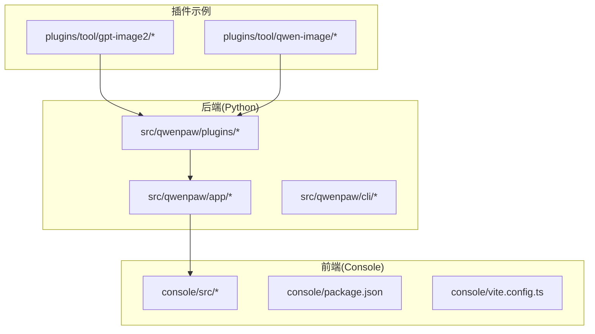
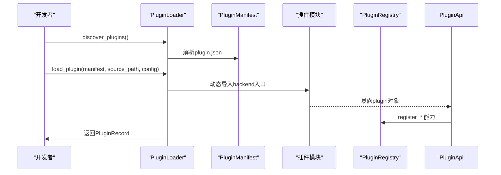
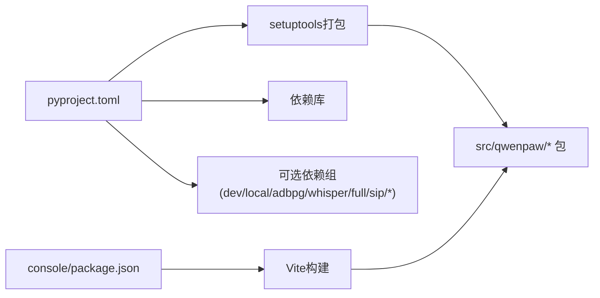

# 开发环境搭建

<cite>
**本文档引用的文件**
- [README.md](file://README.md)
- [pyproject.toml](file://pyproject.toml)
- [setup.py](file://setup.py)
- [src/qwenpaw/plugins/__init__.py](file://src/qwenpaw/plugins/__init__.py)
- [src/qwenpaw/plugins/loader.py](file://src/qwenpaw/plugins/loader.py)
- [src/qwenpaw/plugins/registry.py](file://src/qwenpaw/plugins/registry.py)
- [src/qwenpaw/plugins/api.py](file://src/qwenpaw/plugins/api.py)
- [src/qwenpaw/plugins/architecture.py](file://src/qwenpaw/plugins/architecture.py)
- [plugins/tool/gpt-image2/plugin.json](file://plugins/tool/gpt-image2/plugin.json)
- [plugins/tool/qwen-image/plugin.json](file://plugins/tool/qwen-image/plugin.json)
- [console/package.json](file://console/package.json)
- [console/eslint.config.js](file://console/eslint.config.js)
- [console/tsconfig.json](file://console/tsconfig.json)
- [console/vite.config.ts](file://console/vite.config.ts)
- [.pre-commit-config.yaml](file://.pre-commit-config.yaml)
</cite>

## 目录
1. [简介](#简介)
2. [项目结构](#项目结构)
3. [核心组件](#核心组件)
4. [架构总览](#架构总览)
5. [详细组件分析](#详细组件分析)
6. [依赖关系分析](#依赖关系分析)
7. [性能考虑](#性能考虑)
8. [故障排除指南](#故障排除指南)
9. [结论](#结论)
10. [附录](#附录)

## 简介
本指南面向希望在QwenPaw中开发插件的开发者，提供从环境准备到插件开发、构建与验证的完整流程。内容涵盖：
- 前置要求（Python版本、开发工具、依赖）
- 插件开发目录结构与配置文件组织
- 工具链配置（IDE、代码格式化、调试）
- 环境验证与常见问题排查

## 项目结构
QwenPaw采用前后端分离与插件化架构：
- 后端基于Python，使用setuptools打包，前端位于console目录，使用Vite+React+TypeScript
- 插件系统通过manifest驱动，支持工具型、提供方、钩子、命令、前端等类型
- 插件安装与加载由插件加载器负责，注册表集中管理插件能力

图表来源
- [src/qwenpaw/plugins/__init__.py:1-17](file://src/qwenpaw/plugins/__init__.py#L1-L17)
- [console/package.json:1-79](file://console/package.json#L1-L79)
- [plugins/tool/gpt-image2/plugin.json:1-89](file://plugins/tool/gpt-image2/plugin.json#L1-L89)
- [plugins/tool/qwen-image/plugin.json:1-129](file://plugins/tool/qwen-image/plugin.json#L1-L129)

章节来源
- [README.md: 安装与开发说明:444-466](file://README.md#L444-L466)
- [pyproject.toml: 依赖与打包配置:1-152](file://pyproject.toml#L1-L152)

## 核心组件
- 插件架构定义：类型枚举、清单模型、入口点与记录对象
- 插件API：提供注册能力（提供方、启动/关闭钩子、HTTP路由、控制命令、工具函数）的统一接口
- 插件注册表：集中管理插件清单、提供方、钩子、控制命令、HTTP路由等
- 插件加载器：发现与加载插件，处理依赖安装与动态导入

章节来源
- [src/qwenpaw/plugins/architecture.py: 架构定义:1-142](file://src/qwenpaw/plugins/architecture.py#L1-L142)
- [src/qwenpaw/plugins/api.py: 插件API:1-401](file://src/qwenpaw/plugins/api.py#L1-L401)
- [src/qwenpaw/plugins/registry.py: 注册表:1-598](file://src/qwenpaw/plugins/registry.py#L1-L598)
- [src/qwenpaw/plugins/loader.py: 加载器:1-628](file://src/qwenpaw/plugins/loader.py#L1-L628)

## 架构总览
下图展示插件从发现到加载的关键流程，以及与注册表、HTTP路由的关系。

图表来源
- [src/qwenpaw/plugins/loader.py: 发现与加载:36-262](file://src/qwenpaw/plugins/loader.py#L36-L262)
- [src/qwenpaw/plugins/api.py: 能力注册:81-243](file://src/qwenpaw/plugins/api.py#L81-L243)
- [src/qwenpaw/plugins/registry.py: 注册表管理:95-598](file://src/qwenpaw/plugins/registry.py#L95-L598)

## 详细组件分析

### 插件清单与目录结构
- 清单文件：每个插件根目录需包含plugin.json，描述插件标识、名称、版本、类型、入口点、依赖、最低版本与元信息
- 入口点：支持后端入口（backend）与前端入口（frontend），后端入口用于动态导入插件逻辑
- 示例清单：参考gpt-image2与qwen-image插件的清单字段与工具配置项

章节来源
- [plugins/tool/gpt-image2/plugin.json: 清单示例:1-89](file://plugins/tool/gpt-image2/plugin.json#L1-L89)
- [plugins/tool/qwen-image/plugin.json: 清单示例:1-129](file://plugins/tool/qwen-image/plugin.json#L1-L129)
- [src/qwenpaw/plugins/architecture.py: 清单模型:44-131](file://src/qwenpaw/plugins/architecture.py#L44-L131)

### 插件加载器与依赖安装
- 发现机制：遍历插件目录，查找plugin.json并解析清单
- 动态导入：根据后端入口路径动态加载模块，要求导出plugin对象与register方法
- 依赖安装：优先使用当前Python环境的pip；若不可用则尝试uv；超时或失败时抛出错误
- 运行时复制：支持从任意路径复制到目标插件目录并重新加载

章节来源
- [src/qwenpaw/plugins/loader.py: 发现与加载:36-262](file://src/qwenpaw/plugins/loader.py#L36-L262)
- [src/qwenpaw/plugins/loader.py: 依赖安装:295-405](file://src/qwenpaw/plugins/loader.py#L295-L405)
- [src/qwenpaw/plugins/loader.py: 复制与重载:406-485](file://src/qwenpaw/plugins/loader.py#L406-L485)

### 插件API与注册表
- 插件API：提供注册提供方、启动/关闭钩子、HTTP路由、控制命令、工具函数的能力，并支持读取/保存工具配置
- 注册表：集中存储插件清单、提供方、钩子、控制命令、HTTP路由前缀冲突检测与挂载顺序控制

章节来源
- [src/qwenpaw/plugins/api.py: API能力:48-401](file://src/qwenpaw/plugins/api.py#L48-L401)
- [src/qwenpaw/plugins/registry.py: 注册表:95-598](file://src/qwenpaw/plugins/registry.py#L95-L598)

### 插件类型与入口点
- 类型枚举：tool、provider、hook、command、frontend、general
- 入口点：后端入口（默认兼容旧版entry_point字段），前端入口（可选）

章节来源
- [src/qwenpaw/plugins/architecture.py: 类型与入口点:10-42](file://src/qwenpaw/plugins/architecture.py#L10-L42)

### 前端开发工具链（Console）
- 包管理与脚本：使用npm管理依赖，提供开发、构建、预览、测试、格式化、检查等脚本
- TypeScript配置：多引用tsconfig组合
- Vite配置：开发服务器、别名、测试环境、构建分包策略、CSS模块与预处理器
- ESLint配置：TypeScript推荐规则、React Hooks与刷新规则

章节来源
- [console/package.json: 依赖与脚本:1-79](file://console/package.json#L1-L79)
- [console/tsconfig.json: 配置引用:1-8](file://console/tsconfig.json#L1-L8)
- [console/vite.config.ts: Vite配置:1-167](file://console/vite.config.ts#L1-L167)
- [console/eslint.config.js: ESLint配置:1-29](file://console/eslint.config.js#L1-L29)

## 依赖关系分析
- Python后端依赖：通过pyproject.toml声明，包含第三方库与可选依赖组（dev、local、adbpg、whisper、full、sip、sip-livekit）
- 打包与脚本：setup.py委托setuptools，pyproject.toml定义动态版本、包数据与脚本入口
- 前端依赖：console/package.json声明React生态与UI库，Vite配置输出至后端资源目录

图表来源
- [pyproject.toml: 项目与依赖:1-152](file://pyproject.toml#L1-L152)
- [setup.py: 打包入口:1-5](file://setup.py#L1-L5)
- [console/package.json: 前端依赖:1-79](file://console/package.json#L1-L79)

章节来源
- [pyproject.toml: 项目与依赖:1-152](file://pyproject.toml#L1-L152)
- [setup.py: 打包入口:1-5](file://setup.py#L1-L5)

## 性能考虑
- 前端构建分包：Vite按依赖特征拆分vendor包，减少重复与体积
- 依赖安装超时：加载器对pip与uv安装设置超时限制，避免阻塞事件循环
- 测试内存：Vitest运行时增大堆内存以避免大包测试OOM

章节来源
- [console/vite.config.ts: 构建分包与优化:99-163](file://console/vite.config.ts#L99-L163)
- [src/qwenpaw/plugins/loader.py: 依赖安装超时:323-404](file://src/qwenpaw/plugins/loader.py#L323-L404)
- [console/package.json: 测试内存参数:18-19](file://console/package.json#L18-L19)

## 故障排除指南
- Python版本不符
  - 现象：安装或运行时报错
  - 排查：确认Python版本满足3.10~<3.14的要求
  - 参考：[README.md: 安装与开发说明:444-466](file://README.md#L444-L466)、[pyproject.toml: requires-python](file://pyproject.toml#L6)

- 前端依赖缺失或版本冲突
  - 现象：npm install失败、构建报错
  - 排查：使用npm ci安装依赖；检查Vite别名与CSS处理
  - 参考：[console/package.json:1-79](file://console/package.json#L1-L79)、[console/vite.config.ts:1-167](file://console/vite.config.ts#L1-L167)

- 插件依赖安装失败
  - 现象：加载插件时报依赖安装错误或超时
  - 排查：确保当前Python环境有pip；如无pip，安装uv并确保在PATH中；检查网络与超时设置
  - 参考：[src/qwenpaw/plugins/loader.py: 依赖安装:295-405](file://src/qwenpaw/plugins/loader.py#L295-L405)

- 插件入口点未找到
  - 现象：找不到后端或前端入口文件
  - 排查：确认plugin.json中的entry.backend或entry.frontend路径正确且文件存在
  - 参考：[src/qwenpaw/plugins/loader.py: 入口点校验:115-144](file://src/qwenpaw/plugins/loader.py#L115-L144)

- HTTP路由前缀冲突
  - 现象：注册HTTP路由时报前缀冲突
  - 排查：修改插件前缀，确保唯一性
  - 参考：[src/qwenpaw/plugins/registry.py: 前缀冲突检测:170-186](file://src/qwenpaw/plugins/registry.py#L170-L186)

- 工具配置无法读取
  - 现象：get_tool_config返回None
  - 排查：确认当前代理上下文存在agent_id；检查工具是否已在插件启动钩子中注册
  - 参考：[src/qwenpaw/plugins/api.py: get_tool_config:10-46](file://src/qwenpaw/plugins/api.py#L10-L46)

## 结论
通过遵循本指南，您可以完成QwenPaw插件开发环境的搭建与验证。建议：
- 使用推荐的Python版本与依赖管理工具
- 严格遵循插件清单与目录结构规范
- 利用前端工具链进行本地开发与测试
- 在加载器与注册表的约束下实现插件能力注册

## 附录

### 开发环境前置要求
- Python版本：3.10 ≤ 版本 < 3.14
- 包管理：pip或uv（加载器会优先尝试pip，否则回退uv）
- 前端：Node.js与npm（用于console构建）

章节来源
- [pyproject.toml: requires-python](file://pyproject.toml#L6)
- [README.md: 安装与开发说明:444-466](file://README.md#L444-L466)

### 插件开发目录结构
- 插件根目录
  - plugin.json：插件清单
  - backend入口文件：如gpt_image2.py（对应清单entry.backend）
  - requirements.txt（可选）：插件依赖
- 源代码与配置
  - 插件逻辑文件放置于插件根目录
  - 清单中声明的入口点需与实际文件一致

章节来源
- [plugins/tool/gpt-image2/plugin.json: 清单字段:1-89](file://plugins/tool/gpt-image2/plugin.json#L1-L89)
- [plugins/tool/qwen-image/plugin.json: 清单字段:1-129](file://plugins/tool/qwen-image/plugin.json#L1-L129)
- [src/qwenpaw/plugins/loader.py: 入口点解析:115-144](file://src/qwenpaw/plugins/loader.py#L115-L144)

### 工具链配置
- IDE设置
  - Python：启用类型检查与格式化（black/flake8/pylint）
  - 前端：VS Code推荐扩展（TypeScript、ESLint、Prettier）
- 代码格式化
  - Python：black、flake8、pylint、pre-commit
  - 前端：ESLint、Prettier
- 调试环境
  - 后端：使用pip安装开发依赖组，运行qwenpaw应用
  - 前端：使用npm run dev启动Vite开发服务器

章节来源
- [.pre-commit-config.yaml: 提交前检查:1-121](file://.pre-commit-config.yaml#L1-L121)
- [console/package.json: 脚本与依赖:1-79](file://console/package.json#L1-L79)
- [console/eslint.config.js: ESLint规则:1-29](file://console/eslint.config.js#L1-L29)

### 环境验证步骤
- 后端
  - 安装开发依赖：pip install -e ".[dev,full]"
  - 初始化配置：qwenpaw init --defaults
  - 启动应用：qwenpaw app
- 前端
  - 在console目录执行：npm ci && npm run build
  - 将构建产物复制到后端资源目录（README已说明）
- 插件验证
  - 在插件目录放置plugin.json与后端入口文件
  - 通过加载器发现并加载插件，观察日志输出
  - 若插件含工具，确认工具已在代理工具集中可用

章节来源
- [README.md: 安装与开发说明:444-466](file://README.md#L444-L466)
- [src/qwenpaw/plugins/loader.py: 发现与加载:36-262](file://src/qwenpaw/plugins/loader.py#L36-L262)