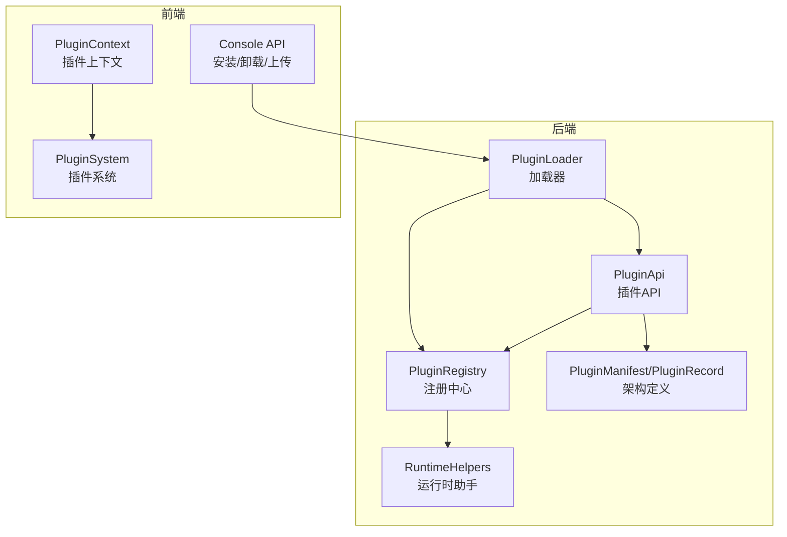
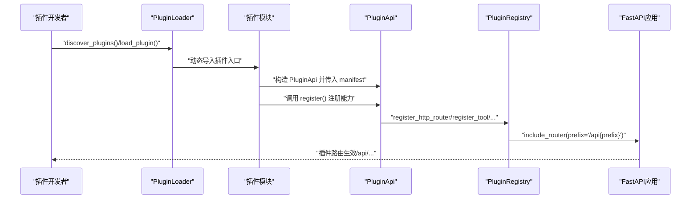
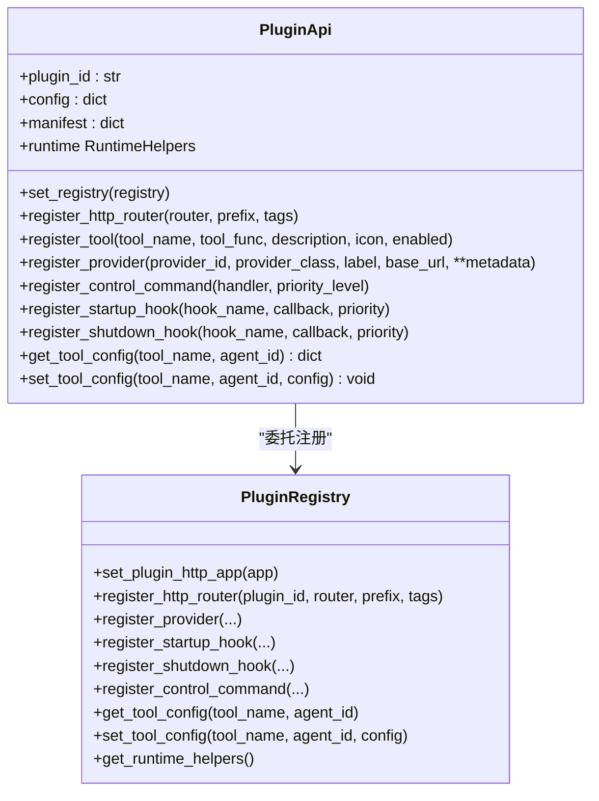
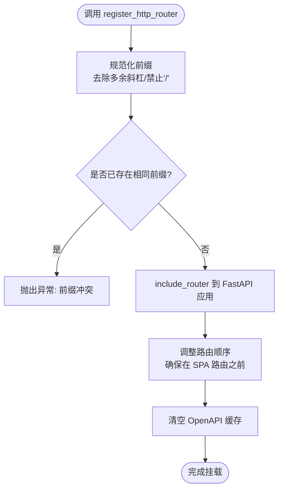
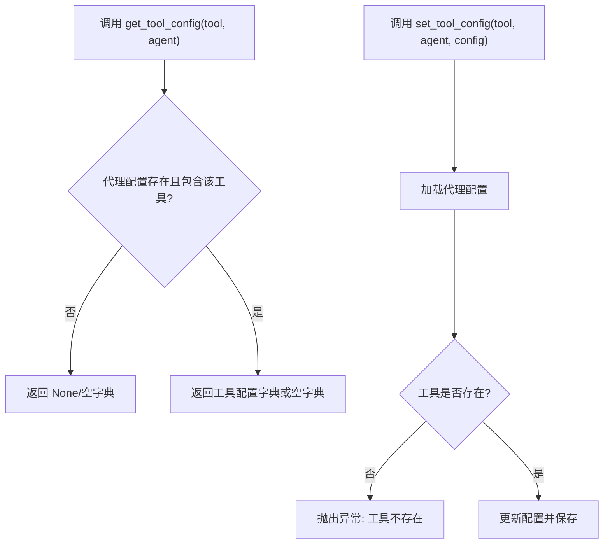
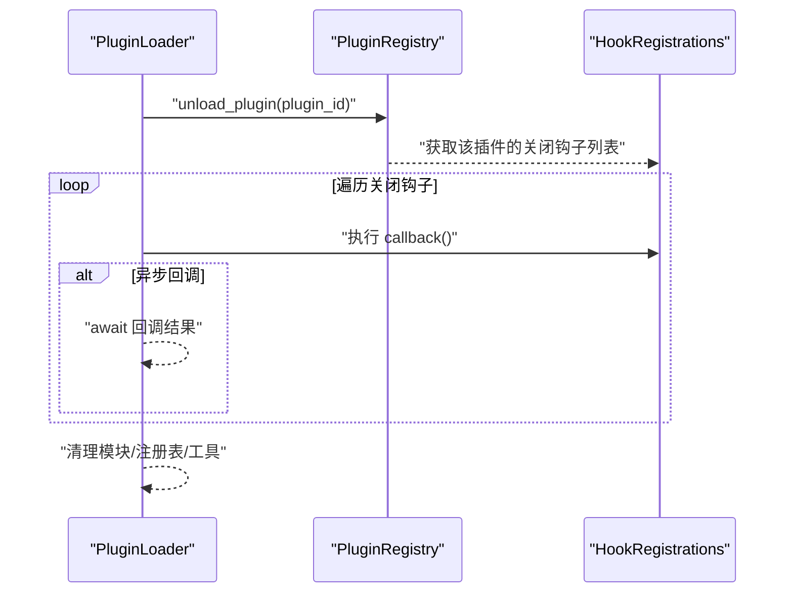
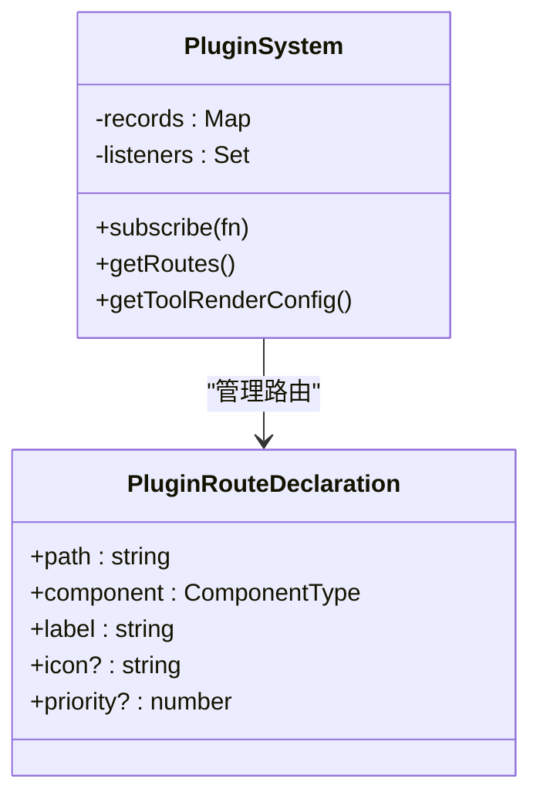
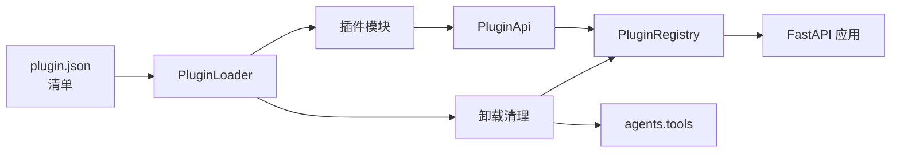

# 插件API实现

<cite>
**本文档引用的文件**
- [src/qwenpaw/plugins/api.py](file://src/qwenpaw/plugins/api.py)
- [src/qwenpaw/plugins/registry.py](file://src/qwenpaw/plugins/registry.py)
- [src/qwenpaw/plugins/loader.py](file://src/qwenpaw/plugins/loader.py)
- [src/qwenpaw/plugins/architecture.py](file://src/qwenpaw/plugins/architecture.py)
- [src/qwenpaw/plugins/runtime.py](file://src/qwenpaw/plugins/runtime.py)
- [console/src/plugins/PluginContext.tsx](file://console/src/plugins/PluginContext.tsx)
- [console/src/plugins/hostExternals.ts](file://console/src/plugins/hostExternals.ts)
- [console/src/api/modules/plugin.ts](file://console/src/api/modules/plugin.ts)
- [website/public/docs/plugins.en.md](file://website/public/docs/plugins.en.md)
- [plugins/tool/gpt-image2/plugin.json](file://plugins/tool/gpt-image2/plugin.json)
- [plugins/tool/gpt-image2/gpt_image2.py](file://plugins/tool/gpt-image2/gpt_image2.py)
- [plugins/tool/qwen-image/plugin.json](file://plugins/tool/qwen-image/plugin.json)
- [plugins/tool/qwen-image/qwen_image.py](file://plugins/tool/qwen-image/qwen_image.py)
</cite>

## 目录
1. [简介](#简介)
2. [项目结构](#项目结构)
3. [核心组件](#核心组件)
4. [架构总览](#架构总览)
5. [详细组件分析](#详细组件分析)
6. [依赖关系分析](#依赖关系分析)
7. [性能考虑](#性能考虑)
8. [故障排查指南](#故障排查指南)
9. [结论](#结论)
10. [附录](#附录)

## 简介
本指南面向插件开发者，系统性讲解 QwenPaw 插件 API 的实现与使用方法，重点覆盖以下主题：
- PluginApi 类的功能与用法：API 对象创建、配置管理、能力注册（HTTP 路由、工具、提供者、控制命令、生命周期钩子）
- 插件如何通过 API 暴露 HTTP 接口：路由定义、请求处理、响应格式与 OpenAPI 标签
- 插件工具函数的实现：工具注册、参数校验与执行流程
- 插件配置管理：配置读取、验证与动态更新
- 插件生命周期钩子：启动钩子、关闭钩子与事件处理
- 实战示例与最佳实践

## 项目结构
QwenPaw 插件系统由后端 Python 代码与前端 TypeScript/React 配合构成：
- 后端核心模块
  - 插件 API：PluginApi（对外接口）、PluginRegistry（注册中心）、PluginLoader（加载器）、RuntimeHelpers（运行时助手）、PluginManifest/PluginRecord（架构定义）
- 前端集成模块
  - PluginContext/PluginSystem：前端插件路由与工具渲染器的注册与订阅
  - 控制台 API 模块：安装/卸载/上传插件等操作的前端调用封装



**图表来源**
- [src/qwenpaw/plugins/api.py:48-401](file://src/qwenpaw/plugins/api.py#L48-L401)
- [src/qwenpaw/plugins/registry.py:95-598](file://src/qwenpaw/plugins/registry.py#L95-L598)
- [src/qwenpaw/plugins/loader.py:23-628](file://src/qwenpaw/plugins/loader.py#L23-L628)
- [src/qwenpaw/plugins/runtime.py:10-68](file://src/qwenpaw/plugins/runtime.py#L10-L68)
- [console/src/plugins/PluginContext.tsx:31-122](file://console/src/plugins/PluginContext.tsx#L31-L122)
- [console/src/plugins/hostExternals.ts:34-122](file://console/src/plugins/hostExternals.ts#L34-L122)
- [console/src/api/modules/plugin.ts:56-139](file://console/src/api/modules/plugin.ts#L56-L139)

**章节来源**
- [src/qwenpaw/plugins/api.py:1-401](file://src/qwenpaw/plugins/api.py#L1-L401)
- [src/qwenpaw/plugins/registry.py:1-598](file://src/qwenpaw/plugins/registry.py#L1-L598)
- [src/qwenpaw/plugins/loader.py:1-628](file://src/qwenpaw/plugins/loader.py#L1-L628)
- [src/qwenpaw/plugins/runtime.py:1-68](file://src/qwenpaw/plugins/runtime.py#L1-L68)
- [console/src/plugins/PluginContext.tsx:1-122](file://console/src/plugins/PluginContext.tsx#L1-L122)
- [console/src/plugins/hostExternals.ts:1-122](file://console/src/plugins/hostExternals.ts#L1-L122)
- [console/src/api/modules/plugin.ts:1-139](file://console/src/api/modules/plugin.ts#L1-L139)

## 核心组件
- PluginApi：插件开发者的统一入口，提供注册 HTTP 路由、工具、提供者、控制命令、生命周期钩子的能力，并支持工具配置读写与运行时助手访问。
- PluginRegistry：单例注册中心，集中管理插件提供的能力（HTTP 路由、工具配置、提供者、钩子、控制命令），并负责在 FastAPI 应用中挂载插件路由。
- PluginLoader：扫描并加载插件，动态导入插件模块，调用其 register 方法完成注册，并处理依赖安装与卸载清理。
- RuntimeHelpers：向插件暴露运行时辅助函数（如获取/列举提供者、日志记录）。
- 架构定义：PluginManifest/PluginRecord 定义插件清单与加载记录，支持多类型插件（工具、提供者、钩子、命令、前端等）。

**章节来源**
- [src/qwenpaw/plugins/api.py:48-401](file://src/qwenpaw/plugins/api.py#L48-L401)
- [src/qwenpaw/plugins/registry.py:95-598](file://src/qwenpaw/plugins/registry.py#L95-L598)
- [src/qwenpaw/plugins/loader.py:23-628](file://src/qwenpaw/plugins/loader.py#L23-L628)
- [src/qwenpaw/plugins/runtime.py:10-68](file://src/qwenpaw/plugins/runtime.py#L10-L68)
- [src/qwenpaw/plugins/architecture.py:10-142](file://src/qwenpaw/plugins/architecture.py#L10-L142)

## 架构总览
下图展示从插件加载到 HTTP 路由挂载的关键流程，以及前后端协作点：



**图表来源**
- [src/qwenpaw/plugins/loader.py:88-238](file://src/qwenpaw/plugins/loader.py#L88-L238)
- [src/qwenpaw/plugins/api.py:191-244](file://src/qwenpaw/plugins/api.py#L191-L244)
- [src/qwenpaw/plugins/registry.py:141-214](file://src/qwenpaw/plugins/registry.py#L141-L214)

## 详细组件分析

### PluginApi 组件分析
PluginApi 是插件开发的核心接口，提供以下能力：
- 设置注册中心引用（供内部调用）
- 注册 HTTP 路由（基于 FastAPI APIRouter）
- 注册工具函数（自动注入到 agents.tools 并写入代理配置）
- 注册提供者（LLM Provider）
- 注册控制命令处理器
- 生命周期钩子注册（启动/关闭）
- 工具配置读取/保存
- 运行时助手访问



**图表来源**
- [src/qwenpaw/plugins/api.py:48-401](file://src/qwenpaw/plugins/api.py#L48-L401)
- [src/qwenpaw/plugins/registry.py:95-598](file://src/qwenpaw/plugins/registry.py#L95-L598)

**章节来源**
- [src/qwenpaw/plugins/api.py:48-401](file://src/qwenpaw/plugins/api.py#L48-L401)

### HTTP 路由注册与请求处理
- 插件通过 API 将 FastAPI 的 APIRouter 挂载到应用根路径下的 /api 前缀空间，确保在控制台 SPA 路由之前被匹配。
- 路由前缀规范化处理（去除多余斜杠、禁止单独“/”），并避免重复注册。
- 自动刷新 OpenAPI Schema，使新路由出现在 /openapi.json 中。
- 响应格式遵循 FastAPI 默认约定，可结合 Pydantic Model 定义返回模型。



**图表来源**
- [src/qwenpaw/plugins/registry.py:141-214](file://src/qwenpaw/plugins/registry.py#L141-L214)
- [src/qwenpaw/plugins/registry.py:29-52](file://src/qwenpaw/plugins/registry.py#L29-L52)

**章节来源**
- [src/qwenpaw/plugins/registry.py:141-214](file://src/qwenpaw/plugins/registry.py#L141-L214)

### 工具函数注册与执行流程
- 插件通过 API.register_tool 注册工具函数，内部会：
  - 将函数动态注入到 agents.tools 模块，并维护 __all__
  - 在当前代理配置中添加 BuiltinToolConfig（默认禁用，便于用户显式启用）
  - 使用启动钩子在应用初始化完成后执行注册，保证上下文就绪
- 执行时，插件可通过 get_tool_config 或 api.get_tool_config 获取代理级工具配置（如 API Key、Endpoint、超时等）。

```mermaid
sequenceDiagram
participant Plugin as "插件"
participant API as "PluginApi"
participant Startup as "启动钩子"
participant Tools as "agents.tools"
participant Config as "代理配置"
Plugin->>API : "register_tool(name, func, ...)"
API->>Startup : "schedule startup hook(priority=50)"
Startup->>Tools : "setattr(name, func); append __all__"
Startup->>Config : "写入 BuiltinToolConfig(enabled=false)"
Note over Startup,Config : "等待应用初始化完成后再执行"
```

**图表来源**
- [src/qwenpaw/plugins/api.py:287-401](file://src/qwenpaw/plugins/api.py#L287-L401)

**章节来源**
- [src/qwenpaw/plugins/api.py:256-401](file://src/qwenpaw/plugins/api.py#L256-L401)

### 插件配置管理
- 读取：PluginRegistry.get_tool_config(tool_name, agent_id) 从代理配置中读取工具配置字典；若未配置则返回 None。
- 写入：PluginRegistry.set_tool_config(tool_name, agent_id, config) 更新并持久化代理配置。
- 辅助：PluginApi.get_tool_config(tool_name, agent_id) 提供便捷方法；同时提供 get_tool_config(tool_name) 作为工具函数内的快捷入口。
- 动态更新：通过 set_tool_config 即时生效；前端可通过控制台 API 触发插件状态查询与安装/卸载。



**图表来源**
- [src/qwenpaw/plugins/registry.py:530-598](file://src/qwenpaw/plugins/registry.py#L530-L598)
- [src/qwenpaw/plugins/api.py:10-46](file://src/qwenpaw/plugins/api.py#L10-L46)
- [src/qwenpaw/plugins/api.py:256-286](file://src/qwenpaw/plugins/api.py#L256-L286)

**章节来源**
- [src/qwenpaw/plugins/registry.py:530-598](file://src/qwenpaw/plugins/registry.py#L530-L598)
- [src/qwenpaw/plugins/api.py:10-46](file://src/qwenpaw/plugins/api.py#L10-L46)
- [src/qwenpaw/plugins/api.py:256-286](file://src/qwenpaw/plugins/api.py#L256-L286)

### 生命周期钩子与事件处理
- 启动钩子：PluginApi.register_startup_hook(hook_name, callback, priority)，按优先级升序执行。
- 关闭钩子：PluginApi.register_shutdown_hook(hook_name, callback, priority)，按优先级升序执行。
- 插件卸载时，加载器会遍历并执行对应插件的所有关闭钩子，确保资源清理。
- 运行时助手：通过 PluginApi.runtime 访问 RuntimeHelpers，提供日志与提供者查询等能力。



**图表来源**
- [src/qwenpaw/plugins/loader.py:487-560](file://src/qwenpaw/plugins/loader.py#L487-L560)
- [src/qwenpaw/plugins/registry.py:354-382](file://src/qwenpaw/plugins/registry.py#L354-L382)

**章节来源**
- [src/qwenpaw/plugins/loader.py:487-560](file://src/qwenpaw/plugins/loader.py#L487-L560)
- [src/qwenpaw/plugins/registry.py:325-382](file://src/qwenpaw/plugins/registry.py#L325-L382)
- [src/qwenpaw/plugins/runtime.py:10-68](file://src/qwenpaw/plugins/runtime.py#L10-L68)

### 前端集成与插件路由
- 前端通过 PluginSystem 维护每个插件的路由声明与工具渲染器映射，并提供订阅机制以响应插件注册变更。
- 控制台 API 模块提供安装/卸载/上传插件的前端调用封装，底层仍由后端 PluginLoader 完成实际加载与卸载。



**图表来源**
- [console/src/plugins/hostExternals.ts:34-122](file://console/src/plugins/hostExternals.ts#L34-L122)
- [console/src/plugins/PluginContext.tsx:31-122](file://console/src/plugins/PluginContext.tsx#L31-L122)
- [console/src/api/modules/plugin.ts:56-139](file://console/src/api/modules/plugin.ts#L56-L139)

**章节来源**
- [console/src/plugins/hostExternals.ts:34-122](file://console/src/plugins/hostExternals.ts#L34-L122)
- [console/src/plugins/PluginContext.tsx:31-122](file://console/src/plugins/PluginContext.tsx#L31-L122)
- [console/src/api/modules/plugin.ts:56-139](file://console/src/api/modules/plugin.ts#L56-L139)

## 依赖关系分析
- 插件加载依赖于插件清单（plugin.json）中的入口点与类型字段，支持后向兼容的元数据推断。
- 插件路由挂载依赖于 PluginRegistry.set_plugin_http_app(app) 的前置设置。
- 插件卸载会清理注册表、模块缓存与 agents.tools 中的工具属性。



**图表来源**
- [src/qwenpaw/plugins/loader.py:36-238](file://src/qwenpaw/plugins/loader.py#L36-L238)
- [src/qwenpaw/plugins/architecture.py:44-142](file://src/qwenpaw/plugins/architecture.py#L44-L142)
- [src/qwenpaw/plugins/registry.py:130-214](file://src/qwenpaw/plugins/registry.py#L130-L214)

**章节来源**
- [src/qwenpaw/plugins/loader.py:36-238](file://src/qwenpaw/plugins/loader.py#L36-L238)
- [src/qwenpaw/plugins/architecture.py:44-142](file://src/qwenpaw/plugins/architecture.py#L44-L142)
- [src/qwenpaw/plugins/registry.py:130-214](file://src/qwenpaw/plugins/registry.py#L130-L214)

## 性能考虑
- 路由挂载顺序与 OpenAPI 缓存：每次新增插件路由都会重置 FastAPI 的 OpenAPI 缓存，频繁变更会影响首次 /openapi.json 请求的生成开销。建议在批量注册后统一触发一次刷新。
- 工具注册延迟：通过启动钩子延迟注册工具，避免在应用未完全初始化时访问全局状态。
- 卸载清理：卸载时移除模块缓存与注册表项，防止内存泄漏与重复加载问题。

[本节为通用指导，不直接分析具体文件]

## 故障排查指南
- HTTP 路由冲突：当多个插件尝试注册相同的 /api 前缀时会抛出异常。请检查前缀是否唯一。
- FastAPI 应用未设置：在调用 register_http_router 前必须先调用 set_plugin_http_app(app)。
- 插件未找到：动态导入失败或插件模块未导出 plugin 对象，检查插件入口与导出命名。
- 工具配置缺失：get_tool_config 返回 None 表示代理配置中未包含该工具，需先通过 register_tool 注册并在代理配置中启用。
- 卸载失败：若插件未加载或已卸载，unload_plugin 会抛出异常；确认插件 ID 正确。

**章节来源**
- [src/qwenpaw/plugins/registry.py:163-214](file://src/qwenpaw/plugins/registry.py#L163-L214)
- [src/qwenpaw/plugins/loader.py:108-238](file://src/qwenpaw/plugins/loader.py#L108-L238)
- [src/qwenpaw/plugins/registry.py:530-598](file://src/qwenpaw/plugins/registry.py#L530-L598)

## 结论
QwenPaw 插件 API 通过 PluginApi 提供统一的注册入口，配合 PluginRegistry 实现集中化管理与 FastAPI 应用集成，支持工具、提供者、HTTP 路由、控制命令与生命周期钩子的完整插件生态。借助 RuntimeHelpers 与前端 PluginSystem，插件可在前后端协同下实现灵活的能力扩展与动态更新。

[本节为总结性内容，不直接分析具体文件]

## 附录

### 实战示例与最佳实践
- HTTP 接口示例：参考网站文档中的 Pet API 插件示例，展示如何构建 APIRouter 并通过 PluginApi.register_http_router 挂载到 /api/pets。
- 工具插件示例：
  - GPT Image 2 工具插件：在 plugin.json 的 meta.tools 中声明工具清单，通过 gpt_image2.py 的 register 方法调用 api.register_tool 注册工具。
  - Qwen-Image 工具插件：类似地在 plugin.json 中声明工具与配置字段，在 qwen_image.py 中注册工具。
- 最佳实践：
  - 工具默认禁用：在 register_tool 中将 enabled 设为 False，让用户显式启用。
  - 配置字段标准化：在 plugin.json 的 meta.tools[].config_fields 中定义必填/可选字段与范围约束，便于前端渲染与校验。
  - 前缀规范：register_http_router 的 prefix 必须以 “/” 开头且不能为 “/”，避免冲突与错误。
  - 日志与错误处理：使用 RuntimeHelpers.log_* 与标准日志记录，捕获异常并返回明确的错误信息。

**章节来源**
- [website/public/docs/plugins.en.md:934-1027](file://website/public/docs/plugins.en.md#L934-L1027)
- [plugins/tool/gpt-image2/plugin.json:1-89](file://plugins/tool/gpt-image2/plugin.json#L1-L89)
- [plugins/tool/gpt-image2/gpt_image2.py:27-64](file://plugins/tool/gpt-image2/gpt_image2.py#L27-L64)
- [plugins/tool/qwen-image/plugin.json:1-129](file://plugins/tool/qwen-image/plugin.json#L1-L129)
- [plugins/tool/qwen-image/qwen_image.py:27-63](file://plugins/tool/qwen-image/qwen_image.py#L27-L63)