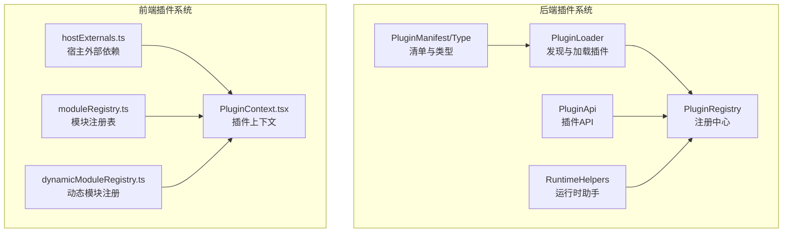
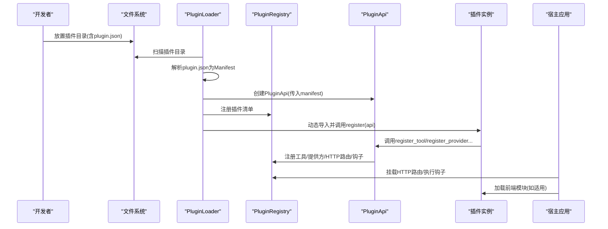
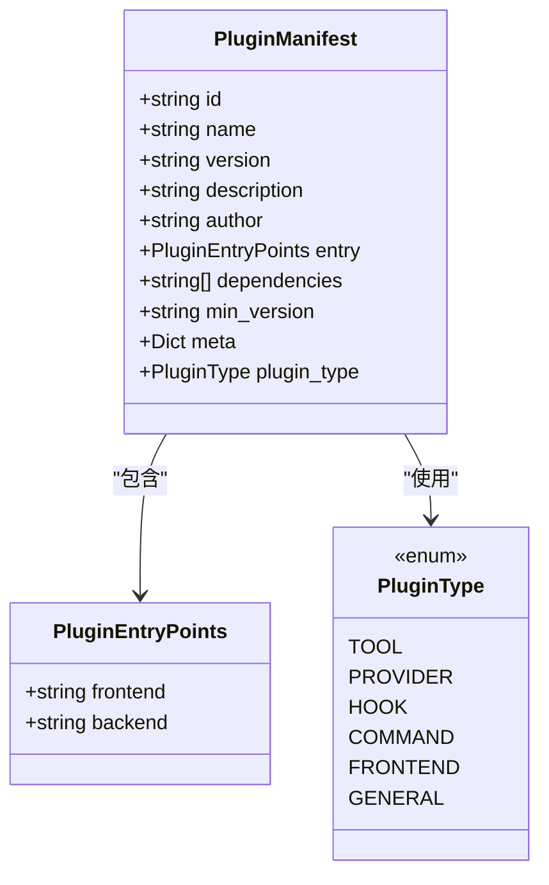
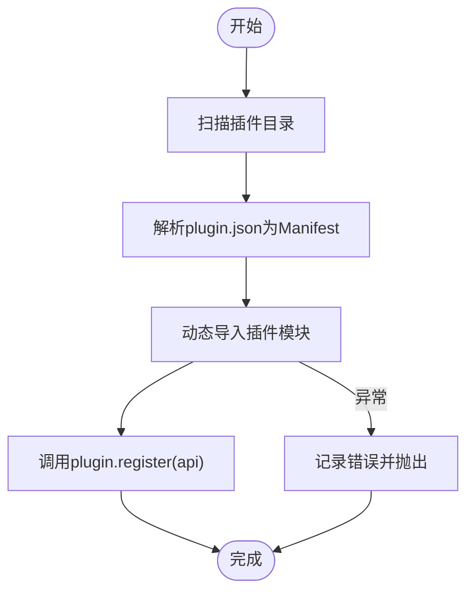
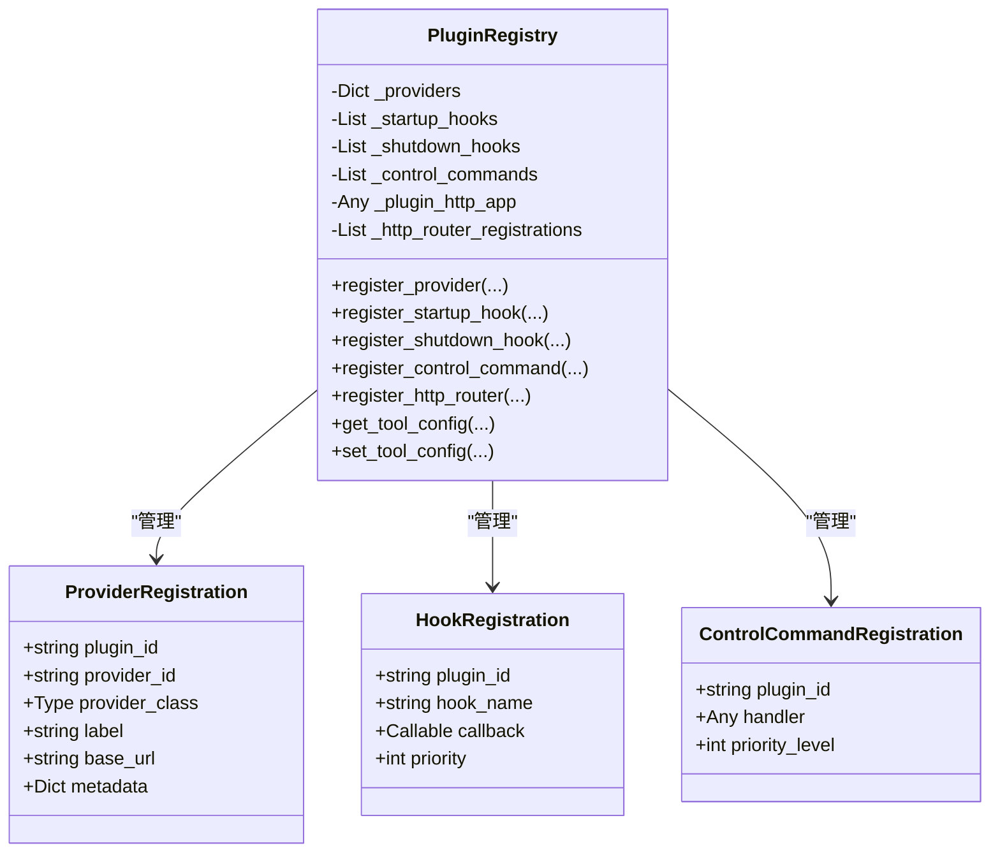
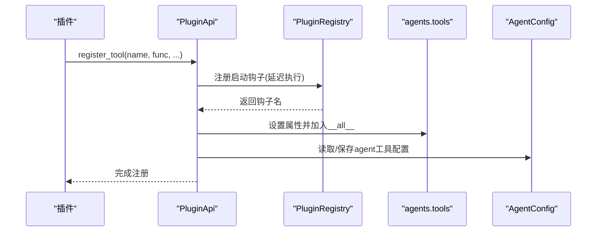
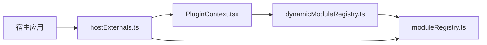
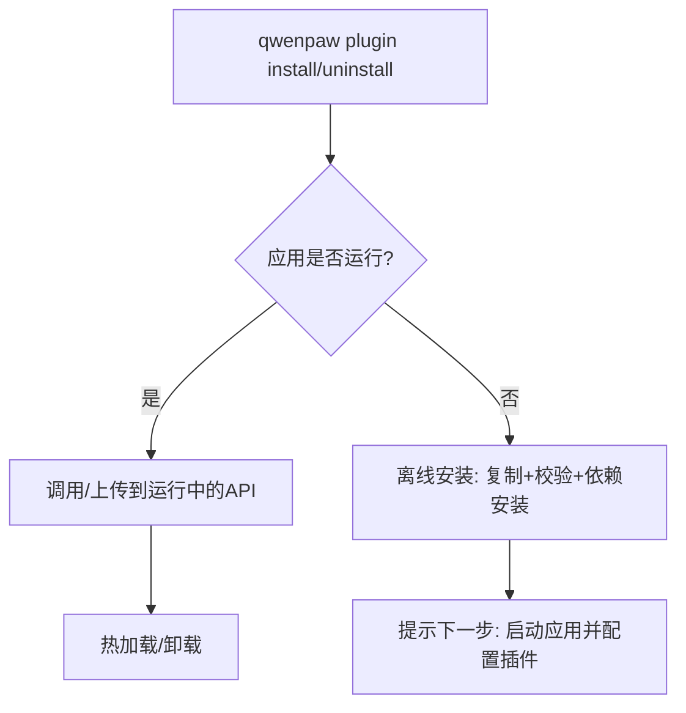
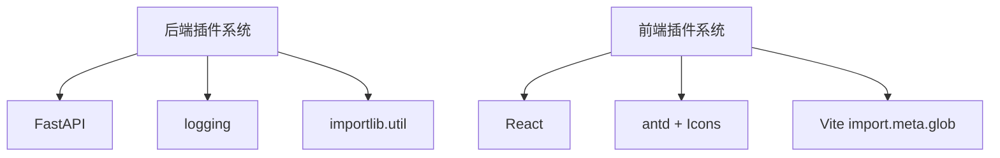

# 插件开发指南

<cite>
**本文档引用的文件**
- [src/qwenpaw/plugins/__init__.py](file://src/qwenpaw/plugins/__init__.py)
- [src/qwenpaw/plugins/api.py](file://src/qwenpaw/plugins/api.py)
- [src/qwenpaw/plugins/architecture.py](file://src/qwenpaw/plugins/architecture.py)
- [src/qwenpaw/plugins/loader.py](file://src/qwenpaw/plugins/loader.py)
- [src/qwenpaw/plugins/registry.py](file://src/qwenpaw/plugins/registry.py)
- [src/qwenpaw/plugins/runtime.py](file://src/qwenpaw/plugins/runtime.py)
- [src/qwenpaw/cli/plugin_commands.py](file://src/qwenpaw/cli/plugin_commands.py)
- [plugins/tool/gpt-image2/plugin.json](file://plugins/tool/gpt-image2/plugin.json)
- [plugins/tool/gpt-image2/gpt_image2.py](file://plugins/tool/gpt-image2/gpt_image2.py)
- [plugins/tool/qwen-image/plugin.json](file://plugins/tool/qwen-image/plugin.json)
- [console/src/plugins/moduleRegistry.ts](file://console/src/plugins/moduleRegistry.ts)
- [console/src/plugins/dynamicModuleRegistry.ts](file://console/src/plugins/dynamicModuleRegistry.ts)
- [console/src/plugins/hostExternals.ts](file://console/src/plugins/hostExternals.ts)
- [console/src/plugins/PluginContext.tsx](file://console/src/plugins/PluginContext.tsx)
- [scripts/pack/build_common.py](file://scripts/pack/build_common.py)
</cite>

## 目录
1. [简介](#简介)
2. [项目结构](#项目结构)
3. [核心组件](#核心组件)
4. [架构总览](#架构总览)
5. [详细组件分析](#详细组件分析)
6. [依赖关系分析](#依赖关系分析)
7. [性能考虑](#性能考虑)
8. [故障排除指南](#故障排除指南)
9. [结论](#结论)
10. [附录](#附录)

## 简介
本指南面向希望在QwenPaw平台上开发插件的开发者，覆盖从开发环境搭建、依赖管理、调试到插件API实现、打包发布的完整流程。文档基于仓库中的插件系统源码与示例插件，提供可操作的开发框架、最佳实践与常见问题解决方案。

## 项目结构
QwenPaw插件系统由后端Python插件框架与前端插件运行时两部分组成：
- 后端：插件发现、加载、注册中心、HTTP路由挂载、启动/关闭钩子、工具配置管理等
- 前端：模块注册表、动态模块发现、宿主外部依赖注入、插件上下文与路由渲染

图表来源
- [src/qwenpaw/plugins/loader.py:23-628](file://src/qwenpaw/plugins/loader.py#L23-L628)
- [src/qwenpaw/plugins/registry.py:95-598](file://src/qwenpaw/plugins/registry.py#L95-L598)
- [src/qwenpaw/plugins/api.py:48-401](file://src/qwenpaw/plugins/api.py#L48-L401)
- [src/qwenpaw/plugins/runtime.py:10-68](file://src/qwenpaw/plugins/runtime.py#L10-L68)
- [src/qwenpaw/plugins/architecture.py:10-142](file://src/qwenpaw/plugins/architecture.py#L10-L142)
- [console/src/plugins/hostExternals.ts:1-192](file://console/src/plugins/hostExternals.ts#L1-L192)
- [console/src/plugins/moduleRegistry.ts:1-138](file://console/src/plugins/moduleRegistry.ts#L1-L138)
- [console/src/plugins/dynamicModuleRegistry.ts:1-117](file://console/src/plugins/dynamicModuleRegistry.ts#L1-L117)
- [console/src/plugins/PluginContext.tsx:1-96](file://console/src/plugins/PluginContext.tsx#L1-L96)

章节来源
- [src/qwenpaw/plugins/__init__.py:1-17](file://src/qwenpaw/plugins/__init__.py#L1-L17)
- [src/qwenpaw/plugins/architecture.py:10-142](file://src/qwenpaw/plugins/architecture.py#L10-L142)
- [console/src/plugins/hostExternals.ts:1-192](file://console/src/plugins/hostExternals.ts#L1-L192)

## 核心组件
- 插件清单与类型：定义插件元数据、入口点、类型（工具、提供方、钩子、命令、前端、通用）
- 插件加载器：扫描目录、解析清单、动态导入、安装依赖、加载插件实例
- 注册中心：集中管理提供方、启动/关闭钩子、控制命令、HTTP路由、工具配置
- 插件API：供插件开发者注册能力（工具、提供方、HTTP路由、控制命令、钩子）
- 运行时助手：提供日志、提供商访问、列表查询等
- 前端插件运行时：模块注册表、动态模块发现、宿主外部依赖注入、插件上下文

章节来源
- [src/qwenpaw/plugins/architecture.py:10-142](file://src/qwenpaw/plugins/architecture.py#L10-L142)
- [src/qwenpaw/plugins/loader.py:23-628](file://src/qwenpaw/plugins/loader.py#L23-L628)
- [src/qwenpaw/plugins/registry.py:95-598](file://src/qwenpaw/plugins/registry.py#L95-L598)
- [src/qwenpaw/plugins/api.py:48-401](file://src/qwenpaw/plugins/api.py#L48-L401)
- [src/qwenpaw/plugins/runtime.py:10-68](file://src/qwenpaw/plugins/runtime.py#L10-L68)
- [console/src/plugins/moduleRegistry.ts:1-138](file://console/src/plugins/moduleRegistry.ts#L1-L138)
- [console/src/plugins/dynamicModuleRegistry.ts:1-117](file://console/src/plugins/dynamicModuleRegistry.ts#L1-L117)
- [console/src/plugins/hostExternals.ts:1-192](file://console/src/plugins/hostExternals.ts#L1-L192)
- [console/src/plugins/PluginContext.tsx:1-96](file://console/src/plugins/PluginContext.tsx#L1-L96)

## 架构总览
下图展示插件从发现到运行的关键交互路径，包括后端加载与前端上下文集成。

图表来源
- [src/qwenpaw/plugins/loader.py:88-238](file://src/qwenpaw/plugins/loader.py#L88-L238)
- [src/qwenpaw/plugins/registry.py:141-214](file://src/qwenpaw/plugins/registry.py#L141-L214)
- [src/qwenpaw/plugins/api.py:81-221](file://src/qwenpaw/plugins/api.py#L81-L221)
- [console/src/plugins/PluginContext.tsx:47-80](file://console/src/plugins/PluginContext.tsx#L47-L80)

## 详细组件分析

### 插件清单与类型系统
- 清单字段：id、name、version、description、author、entry(backend/frontend)、dependencies、min_version、meta、type
- 类型枚举：tool/provider/hook/command/frontend/general
- 兼容性：支持从meta推断类型，确保旧清单可用

图表来源
- [src/qwenpaw/plugins/architecture.py:44-131](file://src/qwenpaw/plugins/architecture.py#L44-L131)

章节来源
- [src/qwenpaw/plugins/architecture.py:10-142](file://src/qwenpaw/plugins/architecture.py#L10-L142)

### 插件加载器与依赖安装
- 发现：遍历插件目录，读取plugin.json生成清单
- 动态导入：使用importlib.spec_from_file_location，支持相对导入
- 依赖安装：优先使用当前Python环境pip，若缺失则尝试uv；超时保护
- 运行时复制：支持从任意路径复制到目标插件目录并加载

图表来源
- [src/qwenpaw/plugins/loader.py:36-238](file://src/qwenpaw/plugins/loader.py#L36-L238)

章节来源
- [src/qwenpaw/plugins/loader.py:23-628](file://src/qwenpaw/plugins/loader.py#L23-L628)

### 注册中心与HTTP路由挂载
- 提供方注册：去重校验、存储元数据
- 钩子注册：按优先级排序，分别维护启动/关闭钩子
- 控制命令：注册处理器并记录优先级
- HTTP路由：在FastAPI应用中挂载，保证在SPA路由之前，支持标签与前缀冲突检测

图表来源
- [src/qwenpaw/plugins/registry.py:95-598](file://src/qwenpaw/plugins/registry.py#L95-L598)

章节来源
- [src/qwenpaw/plugins/registry.py:95-598](file://src/qwenpaw/plugins/registry.py#L95-L598)

### 插件API：工具、提供方、HTTP路由与钩子
- 工具注册：自动注入到agents.tools模块，更新agent配置中的builtin_tools
- 提供方注册：合并manifest元数据与自定义元数据
- HTTP路由：通过FastAPI Router挂载至/api前缀，支持标签与冲突检测
- 钩子：启动/关闭钩子，支持优先级
- 控制命令：注册命令处理器

图表来源
- [src/qwenpaw/plugins/api.py:287-400](file://src/qwenpaw/plugins/api.py#L287-L400)

章节来源
- [src/qwenpaw/plugins/api.py:48-401](file://src/qwenpaw/plugins/api.py#L48-L401)

### 前端插件运行时
- 宿主外部依赖：统一暴露React、antd、API辅助函数，避免插件重复打包
- 模块注册表：安全拷贝宿主模块导出，支持插件修改与获取
- 动态模块注册：Vite import.meta.glob自动发现页面模块
- 插件上下文：订阅插件系统变化，聚合工具渲染器与页面路由

图表来源
- [console/src/plugins/hostExternals.ts:1-192](file://console/src/plugins/hostExternals.ts#L1-L192)
- [console/src/plugins/PluginContext.tsx:1-96](file://console/src/plugins/PluginContext.tsx#L1-L96)
- [console/src/plugins/dynamicModuleRegistry.ts:1-117](file://console/src/plugins/dynamicModuleRegistry.ts#L1-L117)
- [console/src/plugins/moduleRegistry.ts:1-138](file://console/src/plugins/moduleRegistry.ts#L1-L138)

章节来源
- [console/src/plugins/hostExternals.ts:1-192](file://console/src/plugins/hostExternals.ts#L1-L192)
- [console/src/plugins/moduleRegistry.ts:1-138](file://console/src/plugins/moduleRegistry.ts#L1-L138)
- [console/src/plugins/dynamicModuleRegistry.ts:1-117](file://console/src/plugins/dynamicModuleRegistry.ts#L1-L117)
- [console/src/plugins/PluginContext.tsx:1-96](file://console/src/plugins/PluginContext.tsx#L1-L96)

### CLI插件管理
- 热安装/卸载：运行时通过HTTP API进行热加载与卸载
- 离线安装：校验清单、复制文件、安装依赖、同步工具到所有代理
- 下载与解压：安全解压，防止Zip Slip攻击
- 依赖安装：优先pip，不可用时回退uv

图表来源
- [src/qwenpaw/cli/plugin_commands.py:500-800](file://src/qwenpaw/cli/plugin_commands.py#L500-L800)

章节来源
- [src/qwenpaw/cli/plugin_commands.py:1-919](file://src/qwenpaw/cli/plugin_commands.py#L1-L919)

## 依赖关系分析
- 后端依赖：FastAPI用于HTTP路由挂载；Python标准库与importlib用于动态导入；logging用于日志
- 前端依赖：React、antd及其图标；Vite import.meta.glob用于模块发现
- 插件间耦合：通过注册中心集中管理，降低直接耦合；前端通过宿主外部依赖共享库

图表来源
- [src/qwenpaw/plugins/registry.py:9-11](file://src/qwenpaw/plugins/registry.py#L9-L11)
- [console/src/plugins/hostExternals.ts:11-15](file://console/src/plugins/hostExternals.ts#L11-L15)
- [console/src/plugins/dynamicModuleRegistry.ts:24-39](file://console/src/plugins/dynamicModuleRegistry.ts#L24-L39)

章节来源
- [src/qwenpaw/plugins/registry.py:9-11](file://src/qwenpaw/plugins/registry.py#L9-L11)
- [console/src/plugins/hostExternals.ts:11-15](file://console/src/plugins/hostExternals.ts#L11-L15)
- [console/src/plugins/dynamicModuleRegistry.ts:24-39](file://console/src/plugins/dynamicModuleRegistry.ts#L24-L39)

## 性能考虑
- 异步加载：插件依赖安装通过异步线程执行，避免阻塞事件循环
- 路由挂载优化：在FastAPI中插入路由并调整顺序，确保API优先于SPA捕获
- 模块注册表：惰性加载与安全拷贝，减少内存占用与副作用
- 钩子优先级：按优先级排序执行，避免不必要的等待

## 故障排除指南
- 依赖安装失败
  - 症状：pip不可用或超时
  - 处理：检查uv是否存在；查看超时日志；手动安装requirements.txt
  - 参考：[依赖安装逻辑:295-404](file://src/qwenpaw/plugins/loader.py#L295-L404)，[CLI依赖安装:217-302](file://src/qwenpaw/cli/plugin_commands.py#L217-L302)
- HTTP路由冲突
  - 症状：前缀重复导致注册失败
  - 处理：修改插件前缀；确认已移除旧路由
  - 参考：[HTTP路由注册:141-214](file://src/qwenpaw/plugins/registry.py#L141-L214)
- 插件未加载
  - 症状：plugin.json缺失或格式错误
  - 处理：检查清单字段；确认后端入口存在；查看加载日志
  - 参考：[加载流程:88-238](file://src/qwenpaw/plugins/loader.py#L88-L238)
- 前端模块无法访问
  - 症状：window.QwenPaw.modules为空或属性不可访问
  - 处理：确认宿主初始化了hostExternals；检查模块键名与导出
  - 参考：[模块注册表:1-138](file://console/src/plugins/moduleRegistry.ts#L1-L138)，[宿主外部依赖:152-191](file://console/src/plugins/hostExternals.ts#L152-L191)

章节来源
- [src/qwenpaw/plugins/loader.py:295-404](file://src/qwenpaw/plugins/loader.py#L295-L404)
- [src/qwenpaw/cli/plugin_commands.py:217-302](file://src/qwenpaw/cli/plugin_commands.py#L217-L302)
- [src/qwenpaw/plugins/registry.py:141-214](file://src/qwenpaw/plugins/registry.py#L141-L214)
- [console/src/plugins/moduleRegistry.ts:1-138](file://console/src/plugins/moduleRegistry.ts#L1-L138)
- [console/src/plugins/hostExternals.ts:152-191](file://console/src/plugins/hostExternals.ts#L152-L191)

## 结论
QwenPaw插件系统提供了清晰的后端与前端扩展机制：后端以清单驱动、动态加载、集中注册为核心，前端以宿主外部依赖与模块注册表实现灵活集成。遵循本文档的开发规范与最佳实践，可高效构建工具、提供方、钩子、命令与前端插件，并通过CLI实现热安装与离线部署。

## 附录

### 开发环境搭建与调试
- 安装依赖：确保pip可用；若不可用，安装uv并确保在PATH中
- 运行时调试：通过CLI查看插件状态与信息；必要时重启应用观察日志
- 前端调试：确认宿主初始化hostExternals；使用动态模块注册表验证模块发现

章节来源
- [src/qwenpaw/plugins/loader.py:264-294](file://src/qwenpaw/plugins/loader.py#L264-L294)
- [src/qwenpaw/cli/plugin_commands.py:672-760](file://src/qwenpaw/cli/plugin_commands.py#L672-L760)
- [console/src/plugins/hostExternals.ts:152-191](file://console/src/plugins/hostExternals.ts#L152-L191)

### 插件开发框架与最佳实践
- 清单编写：严格填写id/name/version/type/entry/meta；提供最小版本与依赖
- 工具插件：使用PluginApi.register_tool；默认禁用，让用户显式启用
- 提供方插件：使用PluginApi.register_provider；合并manifest元数据
- HTTP插件：使用PluginApi.register_http_router；前缀不以/结尾且非/
- 钩子插件：使用register_startup_hook/register_shutdown_hook；合理设置优先级
- 前端插件：通过宿主外部依赖共享React/antd；使用模块注册表访问宿主模块

章节来源
- [src/qwenpaw/plugins/api.py:81-221](file://src/qwenpaw/plugins/api.py#L81-L221)
- [src/qwenpaw/plugins/api.py:287-400](file://src/qwenpaw/plugins/api.py#L287-L400)
- [console/src/plugins/hostExternals.ts:23-51](file://console/src/plugins/hostExternals.ts#L23-L51)

### 插件API实现要点
- 工具函数：返回值与错误处理；通过get_tool_config读取用户配置
- HTTP接口：使用FastAPI Router；注意前缀与标签；与SPA路由顺序
- 配置管理：通过PluginRegistry.get/set_tool_config；Agent级别持久化

章节来源
- [src/qwenpaw/plugins/api.py:10-46](file://src/qwenpaw/plugins/api.py#L10-L46)
- [src/qwenpaw/plugins/registry.py:530-598](file://src/qwenpaw/plugins/registry.py#L530-L598)

### 打包发布流程
- 清单与版本：确保version与min_version正确；dependencies完整
- 前端打包：使用宿主外部依赖，避免重复打包第三方库
- 后端打包：使用wheel_build脚本生成wheel；打包时注意conda-unpack相关包的修复
- 发布渠道：通过CLI离线安装或在线安装；热安装需应用运行

章节来源
- [plugins/tool/gpt-image2/plugin.json:1-89](file://plugins/tool/gpt-image2/plugin.json#L1-L89)
- [plugins/tool/qwen-image/plugin.json:1-129](file://plugins/tool/qwen-image/plugin.json#L1-L129)
- [scripts/pack/build_common.py:28-31](file://scripts/pack/build_common.py#L28-L31)
- [src/qwenpaw/cli/plugin_commands.py:500-670](file://src/qwenpaw/cli/plugin_commands.py#L500-L670)

### 示例插件开发场景
- 工具插件：参考gpt-image2与qwen-image插件，包含多工具、配置字段与依赖声明
- 提供方插件：通过register_provider注册自定义LLM提供方
- 命令插件：通过register_control_command注册控制命令处理器
- 前端插件：通过hostExternals与moduleRegistry扩展UI与工具渲染

章节来源
- [plugins/tool/gpt-image2/gpt_image2.py:27-64](file://plugins/tool/gpt-image2/gpt_image2.py#L27-L64)
- [plugins/tool/gpt-image2/plugin.json:13-87](file://plugins/tool/gpt-image2/plugin.json#L13-L87)
- [plugins/tool/qwen-image/plugin.json:12-127](file://plugins/tool/qwen-image/plugin.json#L12-L127)
- [console/src/plugins/hostExternals.ts:1-192](file://console/src/plugins/hostExternals.ts#L1-L192)
- [console/src/plugins/moduleRegistry.ts:1-138](file://console/src/plugins/moduleRegistry.ts#L1-L138)