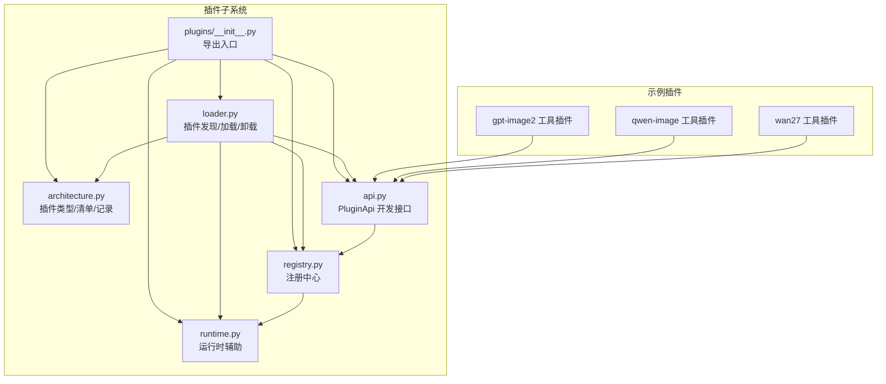
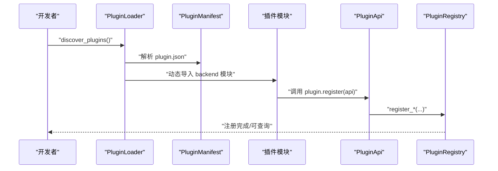
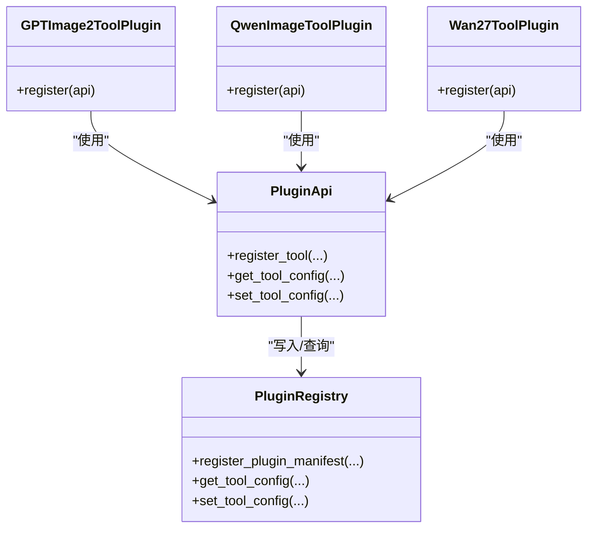
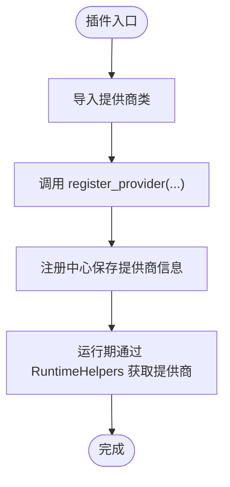
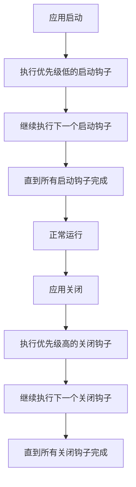
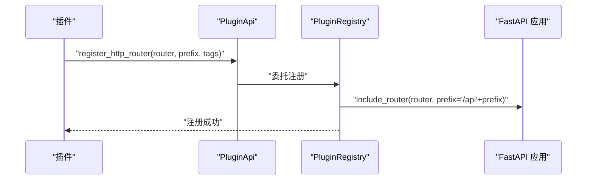
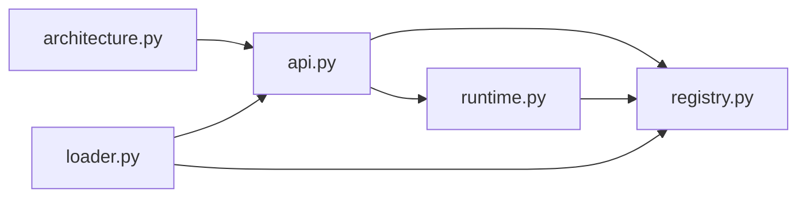

# 插件开发示例与教程

<cite>
**本文引用的文件**
- [src/qwenpaw/plugins/__init__.py](file://src/qwenpaw/plugins/__init__.py)
- [src/qwenpaw/plugins/api.py](file://src/qwenpaw/plugins/api.py)
- [src/qwenpaw/plugins/architecture.py](file://src/qwenpaw/plugins/architecture.py)
- [src/qwenpaw/plugins/loader.py](file://src/qwenpaw/plugins/loader.py)
- [src/qwenpaw/plugins/registry.py](file://src/qwenpaw/plugins/registry.py)
- [src/qwenpaw/plugins/runtime.py](file://src/qwenpaw/plugins/runtime.py)
- [plugins/tool/gpt-image2/plugin.json](file://plugins/tool/gpt-image2/plugin.json)
- [plugins/tool/gpt-image2/gpt_image2.py](file://plugins/tool/gpt-image2/gpt_image2.py)
- [plugins/tool/qwen-image/plugin.json](file://plugins/tool/qwen-image/plugin.json)
- [plugins/tool/qwen-image/qwen_image.py](file://plugins/tool/qwen-image/qwen_image.py)
- [plugins/tool/wan27/plugin.json](file://plugins/tool/wan27/plugin.json)
- [plugins/tool/wan27/wan27.py](file://plugins/tool/wan27/wan27.py)
</cite>

## 目录
1. [引言](#引言)
2. [项目结构](#项目结构)
3. [核心组件](#核心组件)
4. [架构总览](#架构总览)
5. [详细组件分析](#详细组件分析)
6. [依赖分析](#依赖分析)
7. [性能考虑](#性能考虑)
8. [故障排查指南](#故障排查指南)
9. [结论](#结论)
10. [附录](#附录)

## 引言
本教程面向希望在 QwenPaw 平台上开发插件的开发者，提供从入门到进阶的完整学习路径。内容覆盖工具插件、服务插件（提供者）、控制命令插件以及前端插件等类型，结合仓库中的真实插件示例，系统讲解插件的开发流程、关键设计点、最佳实践与常见陷阱，并给出调试与测试建议。

## 项目结构
QwenPaw 的插件体系由“架构定义 + 注册中心 + 加载器 + API 接口 + 运行时辅助”构成，同时提供多个官方工具型插件作为参考实现。下图展示了插件子系统的核心模块及其职责：

图表来源
- [src/qwenpaw/plugins/architecture.py:10-142](file://src/qwenpaw/plugins/architecture.py#L10-L142)
- [src/qwenpaw/plugins/api.py:48-401](file://src/qwenpaw/plugins/api.py#L48-L401)
- [src/qwenpaw/plugins/registry.py:95-598](file://src/qwenpaw/plugins/registry.py#L95-L598)
- [src/qwenpaw/plugins/loader.py:23-628](file://src/qwenpaw/plugins/loader.py#L23-L628)
- [src/qwenpaw/plugins/runtime.py:10-68](file://src/qwenpaw/plugins/runtime.py#L10-L68)
- [src/qwenpaw/plugins/__init__.py:9-16](file://src/qwenpaw/plugins/__init__.py#L9-L16)

章节来源
- [src/qwenpaw/plugins/__init__.py:1-17](file://src/qwenpaw/plugins/__init__.py#L1-L17)
- [src/qwenpaw/plugins/architecture.py:10-142](file://src/qwenpaw/plugins/architecture.py#L10-L142)
- [src/qwenpaw/plugins/api.py:48-401](file://src/qwenpaw/plugins/api.py#L48-L401)
- [src/qwenpaw/plugins/registry.py:95-598](file://src/qwenpaw/plugins/registry.py#L95-L598)
- [src/qwenpaw/plugins/loader.py:23-628](file://src/qwenpaw/plugins/loader.py#L23-L628)
- [src/qwenpaw/plugins/runtime.py:10-68](file://src/qwenpaw/plugins/runtime.py#L10-L68)

## 核心组件
- 插件类型与清单：定义插件类型枚举、清单结构与推断逻辑，支持从旧版元数据兼容推断。
- 插件 API：为插件开发者提供统一接口，包括注册工具、提供者、HTTP 路由、控制命令、启动/关闭钩子等。
- 注册中心：集中管理提供者、钩子、控制命令、HTTP 路由与插件清单，支持查询与清理。
- 插件加载器：扫描目录、解析清单、动态导入后端模块、安装依赖、执行注册回调。
- 运行时辅助：提供日志、提供商访问、列表等能力，供插件在运行期使用。

章节来源
- [src/qwenpaw/plugins/architecture.py:10-142](file://src/qwenpaw/plugins/architecture.py#L10-L142)
- [src/qwenpaw/plugins/api.py:48-401](file://src/qwenpaw/plugins/api.py#L48-L401)
- [src/qwenpaw/plugins/registry.py:95-598](file://src/qwenpaw/plugins/registry.py#L95-L598)
- [src/qwenpaw/plugins/loader.py:23-628](file://src/qwenpaw/plugins/loader.py#L23-L628)
- [src/qwenpaw/plugins/runtime.py:10-68](file://src/qwenpaw/plugins/runtime.py#L10-L68)

## 架构总览
下图展示插件从发现到加载、注册、运行的全链路流程：

图表来源
- [src/qwenpaw/plugins/loader.py:36-238](file://src/qwenpaw/plugins/loader.py#L36-L238)
- [src/qwenpaw/plugins/api.py:48-401](file://src/qwenpaw/plugins/api.py#L48-L401)
- [src/qwenpaw/plugins/registry.py:141-598](file://src/qwenpaw/plugins/registry.py#L141-L598)

章节来源
- [src/qwenpaw/plugins/loader.py:36-238](file://src/qwenpaw/plugins/loader.py#L36-L238)
- [src/qwenpaw/plugins/registry.py:141-598](file://src/qwenpaw/plugins/registry.py#L141-L598)

## 详细组件分析

### 组件一：工具插件（以图像/视频生成为例）
工具插件通过注册工具函数，使智能体可在推理过程中调用这些函数完成具体任务。仓库提供了三个典型工具插件：GPT Image 2、Qwen-Image、Wan 2.7 视频生成。

- 开发要点
  - 在插件清单中声明工具元数据（名称、描述、图标、配置字段等）。
  - 在后端入口模块中导入工具模块并通过 PluginApi.register_tool 注册工具。
  - 使用 get_tool_config 或 PluginApi.get_tool_config 获取当前智能体的工具配置。
  - 在工具函数内部进行参数校验、调用外部服务、返回标准化结果。

- 关键实现路径
  - 清单定义与工具元数据：[plugins/tool/gpt-image2/plugin.json:1-89](file://plugins/tool/gpt-image2/plugin.json#L1-L89)、[plugins/tool/qwen-image/plugin.json:1-129](file://plugins/tool/qwen-image/plugin.json#L1-L129)、[plugins/tool/wan27/plugin.json:1-122](file://plugins/tool/wan27/plugin.json#L1-L122)
  - 入口模块注册工具：[plugins/tool/gpt-image2/gpt_image2.py:27-64](file://plugins/tool/gpt-image2/gpt_image2.py#L27-L64)、[plugins/tool/qwen-image/qwen_image.py:27-63](file://plugins/tool/qwen-image/qwen_image.py#L27-L63)、[plugins/tool/wan27/wan27.py:27-70](file://plugins/tool/wan27/wan27.py#L27-L70)
  - 工具配置读取：[src/qwenpaw/plugins/api.py:10-46](file://src/qwenpaw/plugins/api.py#L10-L46)、[src/qwenpaw/plugins/registry.py:530-559](file://src/qwenpaw/plugins/registry.py#L530-L559)

- 类关系示意

图表来源
- [src/qwenpaw/plugins/api.py:287-401](file://src/qwenpaw/plugins/api.py#L287-L401)
- [src/qwenpaw/plugins/registry.py:431-598](file://src/qwenpaw/plugins/registry.py#L431-L598)
- [plugins/tool/gpt-image2/gpt_image2.py:27-64](file://plugins/tool/gpt-image2/gpt_image2.py#L27-L64)
- [plugins/tool/qwen-image/qwen_image.py:27-63](file://plugins/tool/qwen-image/qwen_image.py#L27-L63)
- [plugins/tool/wan27/wan27.py:27-70](file://plugins/tool/wan27/wan27.py#L27-L70)

- 实战步骤（以 GPT Image 2 为例）
  1) 在 plugin.json 中声明工具元数据与配置字段。
  2) 在入口模块中导入工具模块并调用 api.register_tool 注册工具。
  3) 在工具函数中使用 get_tool_config 获取配置，发起外部请求并返回结果。
  4) 可选：在插件清单中声明依赖与最小版本，确保环境兼容性。

章节来源
- [plugins/tool/gpt-image2/plugin.json:1-89](file://plugins/tool/gpt-image2/plugin.json#L1-L89)
- [plugins/tool/gpt-image2/gpt_image2.py:27-64](file://plugins/tool/gpt-image2/gpt_image2.py#L27-L64)
- [plugins/tool/qwen-image/plugin.json:1-129](file://plugins/tool/qwen-image/plugin.json#L1-L129)
- [plugins/tool/qwen-image/qwen_image.py:27-63](file://plugins/tool/qwen-image/qwen_image.py#L27-L63)
- [plugins/tool/wan27/plugin.json:1-122](file://plugins/tool/wan27/plugin.json#L1-L122)
- [plugins/tool/wan27/wan27.py:27-70](file://plugins/tool/wan27/wan27.py#L27-L70)
- [src/qwenpaw/plugins/api.py:10-46](file://src/qwenpaw/plugins/api.py#L10-L46)
- [src/qwenpaw/plugins/registry.py:530-559](file://src/qwenpaw/plugins/registry.py#L530-L559)

### 组件二：服务插件（提供者）
服务插件用于注册自定义 LLM 提供商，使智能体能够通过统一接口调用不同模型供应商的服务。

- 开发要点
  - 使用 PluginApi.register_provider 注册提供商，传入提供商类、标识、显示名、基础 URL 与元数据。
  - 提供商类需遵循框架约定（例如继承基类、实现特定方法），并在元数据中标注模型能力。
  - 通过 RuntimeHelpers 或注册中心查询可用提供商，按需切换或组合。

- 关键实现路径
  - 注册提供者接口：[src/qwenpaw/plugins/api.py:81-126](file://src/qwenpaw/plugins/api.py#L81-L126)
  - 注册中心存储与查询：[src/qwenpaw/plugins/registry.py:249-308](file://src/qwenpaw/plugins/registry.py#L249-L308)
  - 运行时辅助：[src/qwenpaw/plugins/runtime.py:21-42](file://src/qwenpaw/plugins/runtime.py#L21-L42)

- 流程示意

图表来源
- [src/qwenpaw/plugins/api.py:81-126](file://src/qwenpaw/plugins/api.py#L81-L126)
- [src/qwenpaw/plugins/registry.py:249-308](file://src/qwenpaw/plugins/registry.py#L249-L308)
- [src/qwenpaw/plugins/runtime.py:21-42](file://src/qwenpaw/plugins/runtime.py#L21-L42)

章节来源
- [src/qwenpaw/plugins/api.py:81-126](file://src/qwenpaw/plugins/api.py#L81-L126)
- [src/qwenpaw/plugins/registry.py:249-308](file://src/qwenpaw/plugins/registry.py#L249-L308)
- [src/qwenpaw/plugins/runtime.py:21-42](file://src/qwenpaw/plugins/runtime.py#L21-L42)

### 组件三：控制命令插件
控制命令插件允许插件注册 / 开头的控制命令处理器，用于在应用层接收并处理命令请求。

- 开发要点
  - 使用 PluginApi.register_control_command 注册命令处理器实例。
  - 处理器需实现命令名与优先级，以便在全局命令分发中排序执行。
  - 建议在注册中心统一收集并按优先级调度。

- 关键实现路径
  - 注册控制命令接口：[src/qwenpaw/plugins/api.py:222-244](file://src/qwenpaw/plugins/api.py#L222-L244)
  - 注册中心收集与查询：[src/qwenpaw/plugins/registry.py:399-430](file://src/qwenpaw/plugins/registry.py#L399-L430)

章节来源
- [src/qwenpaw/plugins/api.py:222-244](file://src/qwenpaw/plugins/api.py#L222-L244)
- [src/qwenpaw/plugins/registry.py:399-430](file://src/qwenpaw/plugins/registry.py#L399-L430)

### 组件四：前端插件
前端插件通过在清单中声明前端入口点，动态加载前端资源包，扩展控制台界面功能。

- 开发要点
  - 在 plugin.json 的 entry.frontend 指向打包后的前端入口。
  - 确保前端构建产物与清单路径一致，加载器会据此挂载前端模块。
  - 前端插件通常与后端配合，通过 HTTP 路由提供数据或交互能力。

- 关键实现路径
  - 清单入口点解析：[src/qwenpaw/plugins/architecture.py:44-64](file://src/qwenpaw/plugins/architecture.py#L44-L64)
  - 加载器对前端入口的处理：[src/qwenpaw/plugins/loader.py:115-152](file://src/qwenpaw/plugins/loader.py#L115-L152)

章节来源
- [src/qwenpaw/plugins/architecture.py:44-64](file://src/qwenpaw/plugins/architecture.py#L44-L64)
- [src/qwenpaw/plugins/loader.py:115-152](file://src/qwenpaw/plugins/loader.py#L115-L152)

### 组件五：钩子插件（启动/关闭）
钩子插件在应用生命周期的关键节点执行自定义逻辑，如初始化 SDK、清理资源等。

- 开发要点
  - 使用 PluginApi.register_startup_hook 与 register_shutdown_hook 注册钩子。
  - 指定钩子名称与优先级，低优先级先执行；在卸载时逆序执行关闭钩子。
  - 注意异步/同步回调的兼容处理。

- 关键实现路径
  - 启动/关闭钩子注册接口：[src/qwenpaw/plugins/api.py:127-189](file://src/qwenpaw/plugins/api.py#L127-L189)
  - 注册中心排序与执行：[src/qwenpaw/plugins/registry.py:325-397](file://src/qwenpaw/plugins/registry.py#L325-L397)

- 执行顺序示意

图表来源
- [src/qwenpaw/plugins/api.py:127-189](file://src/qwenpaw/plugins/api.py#L127-L189)
- [src/qwenpaw/plugins/registry.py:325-397](file://src/qwenpaw/plugins/registry.py#L325-L397)

章节来源
- [src/qwenpaw/plugins/api.py:127-189](file://src/qwenpaw/plugins/api.py#L127-L189)
- [src/qwenpaw/plugins/registry.py:325-397](file://src/qwenpaw/plugins/registry.py#L325-L397)

### 组件六：HTTP 路由插件
后端插件可通过 APIRouter 暴露 REST 接口，挂载在 /api 前缀下，供前端或其他组件调用。

- 开发要点
  - 使用 PluginApi.register_http_router 传入 APIRouter、前缀与标签。
  - 前缀必须以斜杠开头且不为 “/”，否则抛出异常。
  - 注册中心会将路由插入到控制台 SPA 路由之前，保证正确匹配。

- 关键实现路径
  - 注册 HTTP 路由接口：[src/qwenpaw/plugins/api.py:191-221](file://src/qwenpaw/plugins/api.py#L191-L221)
  - 注册中心挂载与冲突检测：[src/qwenpaw/plugins/registry.py:141-214](file://src/qwenpaw/plugins/registry.py#L141-L214)

- 路由挂载示意

图表来源
- [src/qwenpaw/plugins/api.py:191-221](file://src/qwenpaw/plugins/api.py#L191-L221)
- [src/qwenpaw/plugins/registry.py:141-214](file://src/qwenpaw/plugins/registry.py#L141-L214)

章节来源
- [src/qwenpaw/plugins/api.py:191-221](file://src/qwenpaw/plugins/api.py#L191-L221)
- [src/qwenpaw/plugins/registry.py:141-214](file://src/qwenpaw/plugins/registry.py#L141-L214)

## 依赖分析
- 插件类型与清单
  - 插件类型枚举涵盖工具、提供者、钩子、命令、前端与通用类型。
  - 清单结构包含标识、名称、版本、描述、作者、入口点、依赖、最小版本与元数据。
  - 支持从旧版元数据推断插件类型，保证兼容性。

- 插件 API 与注册中心
  - PluginApi 将注册操作委托给 PluginRegistry，后者集中维护提供者、钩子、命令、HTTP 路由与插件清单。
  - 注册中心提供查询与清理能力，便于诊断与卸载。

- 加载器与运行时
  - PluginLoader 负责扫描、解析、动态导入与依赖安装，支持运行时复制与加载。
  - RuntimeHelpers 提供日志与提供商访问能力，简化插件开发。

图表来源
- [src/qwenpaw/plugins/architecture.py:10-142](file://src/qwenpaw/plugins/architecture.py#L10-L142)
- [src/qwenpaw/plugins/api.py:48-401](file://src/qwenpaw/plugins/api.py#L48-L401)
- [src/qwenpaw/plugins/registry.py:95-598](file://src/qwenpaw/plugins/registry.py#L95-L598)
- [src/qwenpaw/plugins/loader.py:23-628](file://src/qwenpaw/plugins/loader.py#L23-L628)
- [src/qwenpaw/plugins/runtime.py:10-68](file://src/qwenpaw/plugins/runtime.py#L10-L68)

章节来源
- [src/qwenpaw/plugins/architecture.py:10-142](file://src/qwenpaw/plugins/architecture.py#L10-L142)
- [src/qwenpaw/plugins/api.py:48-401](file://src/qwenpaw/plugins/api.py#L48-L401)
- [src/qwenpaw/plugins/registry.py:95-598](file://src/qwenpaw/plugins/registry.py#L95-L598)
- [src/qwenpaw/plugins/loader.py:23-628](file://src/qwenpaw/plugins/loader.py#L23-L628)
- [src/qwenpaw/plugins/runtime.py:10-68](file://src/qwenpaw/plugins/runtime.py#L10-L68)

## 性能考虑
- 事件循环与阻塞操作
  - 依赖安装采用线程池异步执行，避免阻塞事件循环。
  - 钩子执行按优先级排序，建议将耗时任务放入后台或异步执行。
- 资源管理
  - 卸载插件时清理模块缓存、注册表项与工具函数，防止内存泄漏。
  - HTTP 路由卸载时移除路由并刷新 OpenAPI 缓存。
- 配置与缓存
  - 工具配置按智能体隔离存储，避免跨智能体污染。
  - 提供商列表与实例通过运行时辅助统一访问，减少重复初始化。

章节来源
- [src/qwenpaw/plugins/loader.py:295-405](file://src/qwenpaw/plugins/loader.py#L295-L405)
- [src/qwenpaw/plugins/loader.py:487-560](file://src/qwenpaw/plugins/loader.py#L487-L560)
- [src/qwenpaw/plugins/registry.py:219-248](file://src/qwenpaw/plugins/registry.py#L219-L248)
- [src/qwenpaw/plugins/registry.py:530-559](file://src/qwenpaw/plugins/registry.py#L530-L559)
- [src/qwenpaw/plugins/runtime.py:21-42](file://src/qwenpaw/plugins/runtime.py#L21-L42)

## 故障排查指南
- 常见问题与解决
  - 插件未加载：检查 plugin.json 是否存在、入口文件是否正确、依赖是否安装。
  - 工具未出现在智能体工具箱：确认已通过 register_tool 注册并在启动钩子中执行。
  - HTTP 路由冲突：检查前缀是否唯一、是否以 “/” 开头且不为 “/”。
  - 卸载失败：确认插件已加载、模块缓存已被清理、工具函数已从 agents.tools 移除。
- 日志与诊断
  - 使用 RuntimeHelpers.log_* 输出调试信息。
  - 通过注册中心查询插件清单、提供商、钩子与 HTTP 路由注册情况。
- 最佳实践
  - 明确区分“默认禁用”的工具，让用户显式启用。
  - 对外部服务调用设置合理的超时与重试策略。
  - 在插件清单中声明最小版本与依赖，避免环境不兼容。

章节来源
- [src/qwenpaw/plugins/loader.py:115-152](file://src/qwenpaw/plugins/loader.py#L115-L152)
- [src/qwenpaw/plugins/api.py:287-401](file://src/qwenpaw/plugins/api.py#L287-L401)
- [src/qwenpaw/plugins/registry.py:141-214](file://src/qwenpaw/plugins/registry.py#L141-L214)
- [src/qwenpaw/plugins/loader.py:487-560](file://src/qwenpaw/plugins/loader.py#L487-L560)
- [src/qwenpaw/plugins/runtime.py:44-67](file://src/qwenpaw/plugins/runtime.py#L44-L67)

## 结论
QwenPaw 的插件系统以清晰的架构与完善的 API 设计，为开发者提供了强大的扩展能力。通过工具插件、服务插件、控制命令插件与前端插件等多种类型，开发者可以围绕智能体工作流构建丰富的生态。建议从工具插件入手，逐步掌握配置管理、外部服务集成与生命周期钩子，再拓展到提供者与前端插件，最终形成可维护、可测试、可诊断的高质量插件。

## 附录
- 渐进式学习路径
  - 第一步：阅读并运行官方工具插件示例，理解清单、入口与工具注册流程。
  - 第二步：实现一个简单的工具插件，添加配置字段与错误处理。
  - 第三步：注册一个提供者，接入第三方模型服务。
  - 第四步：添加控制命令与 HTTP 路由，完善前后端交互。
  - 第五步：编写钩子完成初始化与清理，优化性能与稳定性。
- 实际应用场景
  - 图像/视频生成：参考 GPT Image 2、Qwen-Image、Wan 2.7 插件的工具注册与配置管理。
  - 智能体编排：通过控制命令与 HTTP 路由实现多智能体协作与状态管理。
  - 数据集成：通过提供者与 HTTP 路由对接企业内部系统或第三方 API。