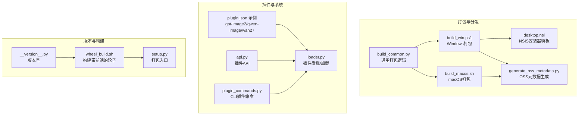
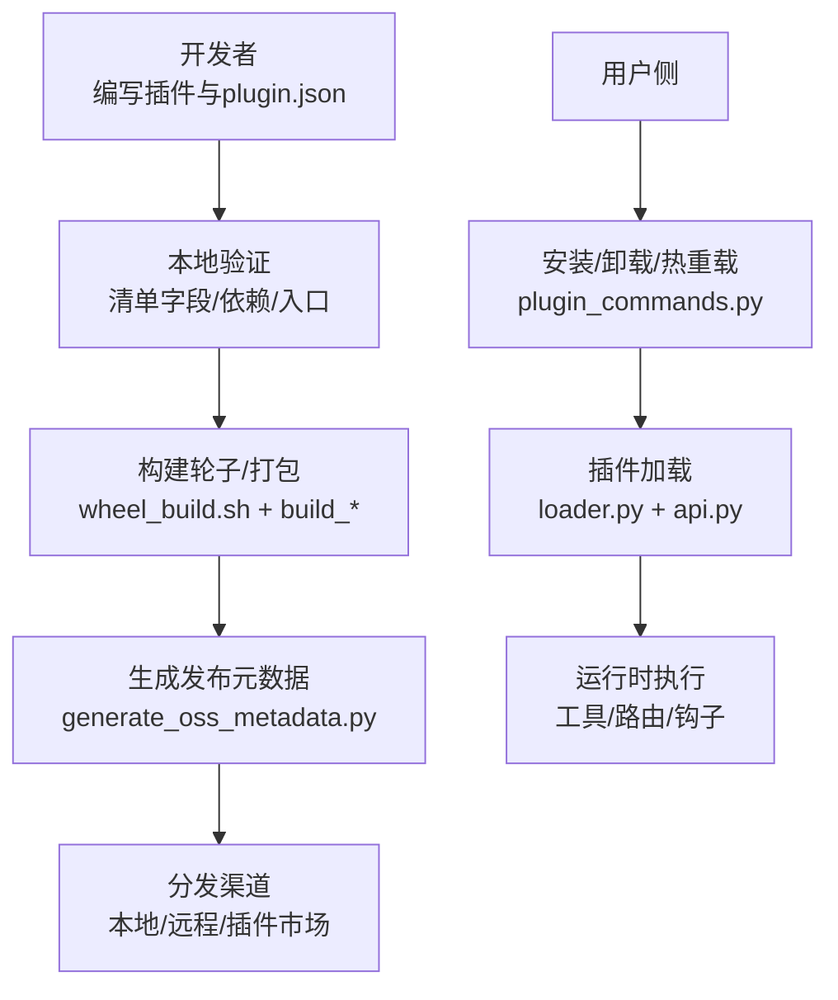
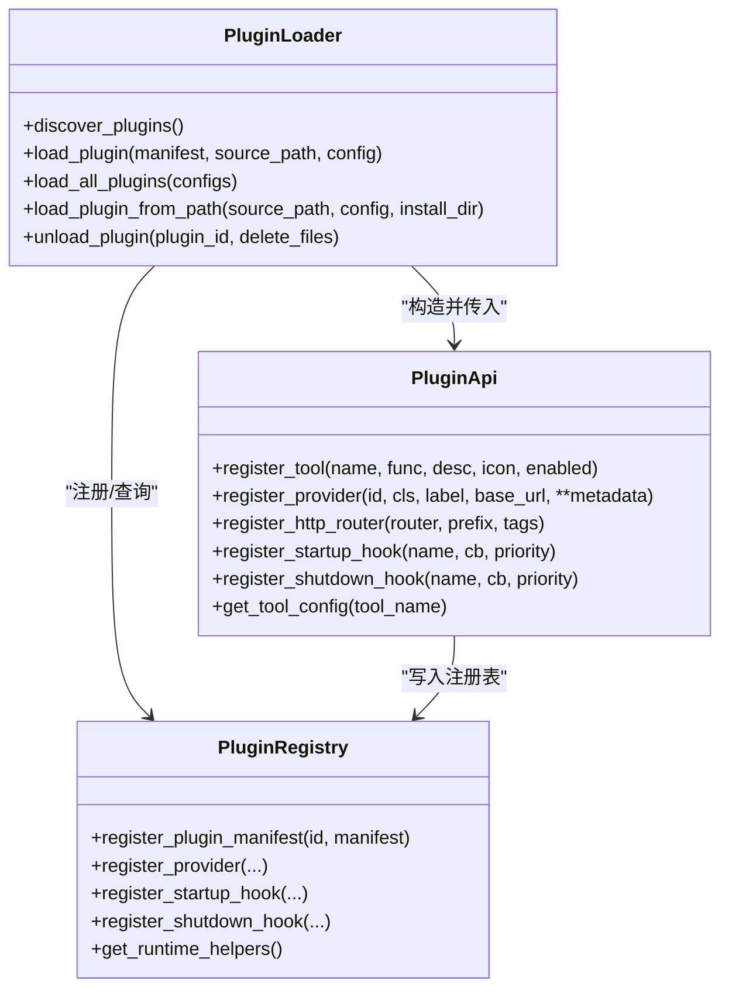
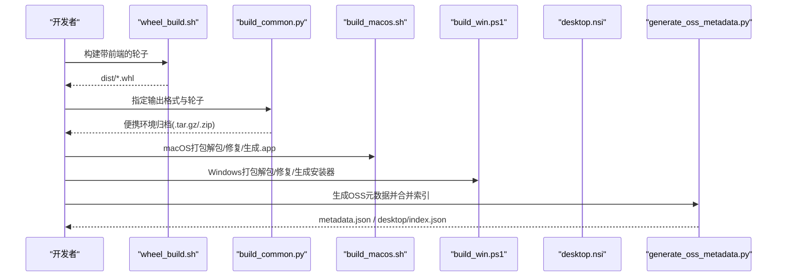
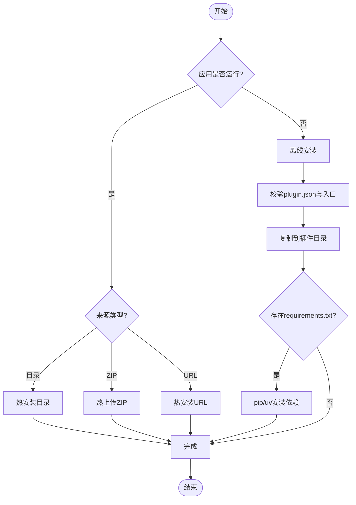
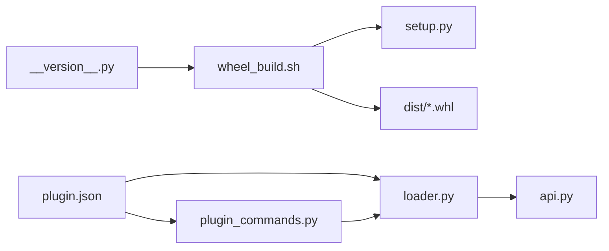

# 插件打包与发布

<cite>
**本文引用的文件**
- [scripts/pack/build_common.py](file://scripts/pack/build_common.py)
- [scripts/pack/build_macos.sh](file://scripts/pack/build_macos.sh)
- [scripts/pack/build_win.ps1](file://scripts/pack/build_win.ps1)
- [scripts/pack/desktop.nsi](file://scripts/pack/desktop.nsi)
- [scripts/pack/generate_oss_metadata.py](file://scripts/pack/generate_oss_metadata.py)
- [scripts/wheel_build.sh](file://scripts/wheel_build.sh)
- [plugins/tool/gpt-image2/plugin.json](file://plugins/tool/gpt-image2/plugin.json)
- [plugins/tool/qwen-image/plugin.json](file://plugins/tool/qwen-image/plugin.json)
- [plugins/tool/wan27/plugin.json](file://plugins/tool/wan27/plugin.json)
- [src/qwenpaw/__version__.py](file://src/qwenpaw/__version__.py)
- [src/qwenpaw/plugins/api.py](file://src/qwenpaw/plugins/api.py)
- [src/qwenpaw/plugins/loader.py](file://src/qwenpaw/plugins/loader.py)
- [src/qwenpaw/cli/plugin_commands.py](file://src/qwenpaw/cli/plugin_commands.py)
- [setup.py](file://setup.py)
</cite>

## 目录
1. [简介](#简介)
2. [项目结构](#项目结构)
3. [核心组件](#核心组件)
4. [架构总览](#架构总览)
5. [详细组件分析](#详细组件分析)
6. [依赖关系分析](#依赖关系分析)
7. [性能考量](#性能考量)
8. [故障排查指南](#故障排查指南)
9. [结论](#结论)
10. [附录](#附录)

## 简介
本指南面向希望在QwenPaw平台上开发、打包与发布的插件作者，覆盖从文件整理、依赖管理到压缩打包、清单校验与优化、版本管理策略、多渠道发布（本地安装、远程分发、插件市场）、测试与质量保障以及发布后的维护与更新策略。文档基于仓库中的打包脚本、插件清单样例与插件系统实现进行归纳总结，帮助你构建稳定可靠的插件交付流程。

## 项目结构
围绕插件打包与发布的关键目录与文件如下：
- 打包与分发脚本：scripts/pack 下的跨平台打包与元数据生成脚本
- 轮子构建：scripts/wheel_build.sh 将前端产物打包进后端轮子
- 插件示例清单：plugins/tool/*/plugin.json 提供标准字段与配置项参考
- 插件系统：src/qwenpaw/plugins/* 提供插件发现、加载、注册与运行时API
- CLI插件管理：src/qwenpaw/cli/plugin_commands.py 提供安装/卸载/列表等命令
- 版本号：src/qwenpaw/__version__.py 统一版本来源
- 构建入口：setup.py 委托 setuptools 进行打包

图表来源
- [scripts/pack/build_common.py:1-246](file://scripts/pack/build_common.py#L1-L246)
- [scripts/pack/build_macos.sh:1-185](file://scripts/pack/build_macos.sh#L1-L185)
- [scripts/pack/build_win.ps1:1-337](file://scripts/pack/build_win.ps1#L1-L337)
- [scripts/pack/desktop.nsi:1-57](file://scripts/pack/desktop.nsi#L1-L57)
- [scripts/pack/generate_oss_metadata.py:1-211](file://scripts/pack/generate_oss_metadata.py#L1-L211)
- [scripts/wheel_build.sh:1-35](file://scripts/wheel_build.sh#L1-L35)
- [plugins/tool/gpt-image2/plugin.json:1-89](file://plugins/tool/gpt-image2/plugin.json#L1-L89)
- [plugins/tool/qwen-image/plugin.json:1-129](file://plugins/tool/qwen-image/plugin.json#L1-L129)
- [plugins/tool/wan27/plugin.json:1-122](file://plugins/tool/wan27/plugin.json#L1-L122)
- [src/qwenpaw/plugins/loader.py:1-628](file://src/qwenpaw/plugins/loader.py#L1-L628)
- [src/qwenpaw/plugins/api.py:1-401](file://src/qwenpaw/plugins/api.py#L1-L401)
- [src/qwenpaw/cli/plugin_commands.py:1-919](file://src/qwenpaw/cli/plugin_commands.py#L1-L919)
- [src/qwenpaw/__version__.py:1-3](file://src/qwenpaw/__version__.py#L1-L3)
- [setup.py:1-5](file://setup.py#L1-L5)

章节来源
- [scripts/pack/build_common.py:1-246](file://scripts/pack/build_common.py#L1-L246)
- [scripts/pack/build_macos.sh:1-185](file://scripts/pack/build_macos.sh#L1-L185)
- [scripts/pack/build_win.ps1:1-337](file://scripts/pack/build_win.ps1#L1-L337)
- [scripts/pack/desktop.nsi:1-57](file://scripts/pack/desktop.nsi#L1-L57)
- [scripts/pack/generate_oss_metadata.py:1-211](file://scripts/pack/generate_oss_metadata.py#L1-L211)
- [scripts/wheel_build.sh:1-35](file://scripts/wheel_build.sh#L1-L35)
- [plugins/tool/gpt-image2/plugin.json:1-89](file://plugins/tool/gpt-image2/plugin.json#L1-L89)
- [plugins/tool/qwen-image/plugin.json:1-129](file://plugins/tool/qwen-image/plugin.json#L1-L129)
- [plugins/tool/wan27/plugin.json:1-122](file://plugins/tool/wan27/plugin.json#L1-L122)
- [src/qwenpaw/plugins/loader.py:1-628](file://src/qwenpaw/plugins/loader.py#L1-L628)
- [src/qwenpaw/plugins/api.py:1-401](file://src/qwenpaw/plugins/api.py#L1-L401)
- [src/qwenpaw/cli/plugin_commands.py:1-919](file://src/qwenpaw/cli/plugin_commands.py#L1-L919)
- [src/qwenpaw/__version__.py:1-3](file://src/qwenpaw/__version__.py#L1-L3)
- [setup.py:1-5](file://setup.py#L1-L5)

## 核心组件
- 插件清单（plugin.json）：定义插件标识、名称、版本、类型、描述、作者、入口、依赖、最低宿主版本、元信息（工具定义、配置字段、API文档链接等）。示例见三款工具插件清单。
- 插件系统：通过 PluginLoader 发现并加载插件；PluginApi 提供注册能力（工具、HTTP路由、启动/关闭钩子等）；支持动态安装/卸载与依赖安装。
- 打包脚本：build_common.py 抽象出 conda-pack 的环境打包流程；build_macos.sh 与 build_win.ps1 分别完成 macOS App 与 Windows 安装器的构建；generate_oss_metadata.py 生成发布元数据。
- 轮子构建：wheel_build.sh 在构建轮子前先编译前端静态资源并复制到后端包内，确保桌面版可直接运行。
- CLI 插件命令：提供安装、卸载、列出、查看插件详情等能力，并支持热安装/上传。

章节来源
- [plugins/tool/gpt-image2/plugin.json:1-89](file://plugins/tool/gpt-image2/plugin.json#L1-L89)
- [plugins/tool/qwen-image/plugin.json:1-129](file://plugins/tool/qwen-image/plugin.json#L1-L129)
- [plugins/tool/wan27/plugin.json:1-122](file://plugins/tool/wan27/plugin.json#L1-L122)
- [src/qwenpaw/plugins/loader.py:1-628](file://src/qwenpaw/plugins/loader.py#L1-L628)
- [src/qwenpaw/plugins/api.py:1-401](file://src/qwenpaw/plugins/api.py#L1-L401)
- [scripts/pack/build_common.py:1-246](file://scripts/pack/build_common.py#L1-L246)
- [scripts/pack/build_macos.sh:1-185](file://scripts/pack/build_macos.sh#L1-L185)
- [scripts/pack/build_win.ps1:1-337](file://scripts/pack/build_win.ps1#L1-L337)
- [scripts/pack/generate_oss_metadata.py:1-211](file://scripts/pack/generate_oss_metadata.py#L1-L211)
- [scripts/wheel_build.sh:1-35](file://scripts/wheel_build.sh#L1-L35)
- [src/qwenpaw/cli/plugin_commands.py:1-919](file://src/qwenpaw/cli/plugin_commands.py#L1-L919)

## 架构总览
下图展示了插件从开发到发布的整体流程：开发者编写插件与清单 → 本地验证 → 打包构建 → 生成元数据 → 多渠道分发 → 用户侧安装/卸载与热重载。

图表来源
- [scripts/wheel_build.sh:1-35](file://scripts/wheel_build.sh#L1-L35)
- [scripts/pack/build_common.py:1-246](file://scripts/pack/build_common.py#L1-L246)
- [scripts/pack/build_macos.sh:1-185](file://scripts/pack/build_macos.sh#L1-L185)
- [scripts/pack/build_win.ps1:1-337](file://scripts/pack/build_win.ps1#L1-L337)
- [scripts/pack/generate_oss_metadata.py:1-211](file://scripts/pack/generate_oss_metadata.py#L1-L211)
- [src/qwenpaw/cli/plugin_commands.py:1-919](file://src/qwenpaw/cli/plugin_commands.py#L1-L919)
- [src/qwenpaw/plugins/loader.py:1-628](file://src/qwenpaw/plugins/loader.py#L1-L628)
- [src/qwenpaw/plugins/api.py:1-401](file://src/qwenpaw/plugins/api.py#L1-L401)

## 详细组件分析

### 插件清单（plugin.json）字段与最佳实践
- 必填字段：id、name、version、entry.backend 或 entry.frontend
- 可选字段：description、author、dependencies、min_version、meta
- 元信息（meta）：tools 数组定义工具函数名、描述、图标、是否需要配置、配置字段（名称、标签、类型、必填、占位符、取值范围、帮助文本等）
- API 文档链接：api_key_url、api_key_hint、model_url
- 最低宿主版本：min_version 用于控制兼容性
- 依赖声明：dependencies 用于安装期依赖解析

清单校验建议：
- 使用最小化字段集，仅声明必要项
- 配置字段使用明确的类型与范围约束，便于UI渲染与校验
- 为每个工具提供清晰的图标与描述
- 明确 API Key 获取路径与模型文档链接

章节来源
- [plugins/tool/gpt-image2/plugin.json:1-89](file://plugins/tool/gpt-image2/plugin.json#L1-L89)
- [plugins/tool/qwen-image/plugin.json:1-129](file://plugins/tool/qwen-image/plugin.json#L1-L129)
- [plugins/tool/wan27/plugin.json:1-122](file://plugins/tool/wan27/plugin.json#L1-L122)

### 插件系统与运行时API
- PluginLoader：扫描插件目录，读取 plugin.json，动态导入后端模块，调用 plugin.register(api)，注册到 PluginRegistry
- PluginApi：提供 register_tool/register_provider/register_http_router/register_startup_hook/register_shutdown_hook 等能力
- 支持 requirements.txt 自动安装（pip/uv回退），支持热安装/卸载与工具清理

图表来源
- [src/qwenpaw/plugins/loader.py:1-628](file://src/qwenpaw/plugins/loader.py#L1-L628)
- [src/qwenpaw/plugins/api.py:1-401](file://src/qwenpaw/plugins/api.py#L1-L401)

章节来源
- [src/qwenpaw/plugins/loader.py:1-628](file://src/qwenpaw/plugins/loader.py#L1-L628)
- [src/qwenpaw/plugins/api.py:1-401](file://src/qwenpaw/plugins/api.py#L1-L401)

### 打包与分发流程（macOS/Windows）
- 通用打包：build_common.py 创建临时 conda 环境，安装 qwenpaw[full]，使用 conda-pack 导出便携环境
- macOS：build_macos.sh 调用 build_common.py，解包到 .app/Contents，修复路径（conda-unpack），生成 Info.plist，可选打包为 zip
- Windows：build_win.ps1 调用 build_common.py，解包后执行 conda-unpack 并修复特定包的路径替换问题，预编译字节码，生成 .bat/.vbs 启动器与 NSIS 安装器
- OSS元数据：generate_oss_metadata.py 计算 SHA256、文件大小、语言化名称/描述，支持合并到 desktop/index.json

图表来源
- [scripts/wheel_build.sh:1-35](file://scripts/wheel_build.sh#L1-L35)
- [scripts/pack/build_common.py:1-246](file://scripts/pack/build_common.py#L1-L246)
- [scripts/pack/build_macos.sh:1-185](file://scripts/pack/build_macos.sh#L1-L185)
- [scripts/pack/build_win.ps1:1-337](file://scripts/pack/build_win.ps1#L1-L337)
- [scripts/pack/desktop.nsi:1-57](file://scripts/pack/desktop.nsi#L1-L57)
- [scripts/pack/generate_oss_metadata.py:1-211](file://scripts/pack/generate_oss_metadata.py#L1-L211)

章节来源
- [scripts/wheel_build.sh:1-35](file://scripts/wheel_build.sh#L1-L35)
- [scripts/pack/build_common.py:1-246](file://scripts/pack/build_common.py#L1-L246)
- [scripts/pack/build_macos.sh:1-185](file://scripts/pack/build_macos.sh#L1-L185)
- [scripts/pack/build_win.ps1:1-337](file://scripts/pack/build_win.ps1#L1-L337)
- [scripts/pack/desktop.nsi:1-57](file://scripts/pack/desktop.nsi#L1-L57)
- [scripts/pack/generate_oss_metadata.py:1-211](file://scripts/pack/generate_oss_metadata.py#L1-L211)

### CLI 插件管理与热重载
- 安装：支持本地目录、本地ZIP、远程URL三种来源；若应用运行中则走API热安装，否则离线拷贝至插件目录
- 卸载：删除插件目录并清理已注册工具
- 列表/详情：读取插件目录下的 plugin.json 输出
- 依赖安装：优先使用 pip，若缺失则尝试 uv 回退

图表来源
- [src/qwenpaw/cli/plugin_commands.py:1-919](file://src/qwenpaw/cli/plugin_commands.py#L1-L919)
- [src/qwenpaw/plugins/loader.py:1-628](file://src/qwenpaw/plugins/loader.py#L1-L628)

章节来源
- [src/qwenpaw/cli/plugin_commands.py:1-919](file://src/qwenpaw/cli/plugin_commands.py#L1-L919)
- [src/qwenpaw/plugins/loader.py:1-628](file://src/qwenpaw/plugins/loader.py#L1-L628)

## 依赖关系分析
- 版本来源：统一由 src/qwenpaw/__version__.py 提供，打包脚本与轮子构建均读取该版本以确保一致性
- 构建入口：setup.py 委托 setuptools，wheel_build.sh 负责将前端静态资源注入后端包
- 插件依赖：插件自身通过 requirements.txt 声明，打包阶段由打包脚本或插件CLI自动安装
- 兼容性：插件清单中的 min_version 字段用于限制最低宿主版本，loader 在加载时会结合宿主版本进行兼容判断

图表来源
- [src/qwenpaw/__version__.py:1-3](file://src/qwenpaw/__version__.py#L1-L3)
- [scripts/wheel_build.sh:1-35](file://scripts/wheel_build.sh#L1-L35)
- [setup.py:1-5](file://setup.py#L1-L5)
- [plugins/tool/gpt-image2/plugin.json:1-89](file://plugins/tool/gpt-image2/plugin.json#L1-L89)
- [src/qwenpaw/plugins/loader.py:1-628](file://src/qwenpaw/plugins/loader.py#L1-L628)
- [src/qwenpaw/plugins/api.py:1-401](file://src/qwenpaw/plugins/api.py#L1-L401)
- [src/qwenpaw/cli/plugin_commands.py:1-919](file://src/qwenpaw/cli/plugin_commands.py#L1-L919)

章节来源
- [src/qwenpaw/__version__.py:1-3](file://src/qwenpaw/__version__.py#L1-L3)
- [scripts/wheel_build.sh:1-35](file://scripts/wheel_build.sh#L1-L35)
- [setup.py:1-5](file://setup.py#L1-L5)
- [plugins/tool/gpt-image2/plugin.json:1-89](file://plugins/tool/gpt-image2/plugin.json#L1-L89)
- [src/qwenpaw/plugins/loader.py:1-628](file://src/qwenpaw/plugins/loader.py#L1-L628)
- [src/qwenpaw/plugins/api.py:1-401](file://src/qwenpaw/plugins/api.py#L1-L401)
- [src/qwenpaw/cli/plugin_commands.py:1-919](file://src/qwenpaw/cli/plugin_commands.py#L1-L919)

## 性能考量
- Windows 路径修复：conda-unpack 对 Windows 路径替换存在语法错误风险，脚本在解包后重新安装受影响包以修复
- 预编译字节码：Windows 打包阶段对环境内所有 Python 文件进行并行编译，减少首次启动编译开销
- 依赖安装并发：打包与CLI均采用 pip/uv 回退策略，避免阻塞事件循环
- 前端资源注入：wheel_build.sh 在构建轮子前复制最新前端产物，避免运行时额外下载

章节来源
- [scripts/pack/build_win.ps1:1-337](file://scripts/pack/build_win.ps1#L1-L337)
- [scripts/pack/build_common.py:1-246](file://scripts/pack/build_common.py#L1-L246)
- [scripts/wheel_build.sh:1-35](file://scripts/wheel_build.sh#L1-L35)

## 故障排查指南
常见问题与定位要点：
- 插件未加载
  - 检查 plugin.json 是否存在且字段完整（id/name/entry）
  - 确认 entry.backend 或 entry.frontend 指向的实际文件存在
  - 若为工具插件，确认 register_tool 注册流程是否触发
- 依赖安装失败
  - 若当前环境无 pip，尝试 uv；若两者都不可用，按提示手动安装 requirements.txt
  - 注意超时时间（约300秒），网络不稳定时可重试
- Windows 启动异常
  - 确认 conda-unpack 已执行并修复了受影响包
  - 检查 SSL 证书路径设置（通过打包脚本导出的 certifi 路径）
- 热重载无效
  - 应用需处于运行状态，使用 CLI 安装时选择 URL/目录/ZIP 三种来源之一
  - 卸载时注意是否同时删除磁盘文件

章节来源
- [src/qwenpaw/plugins/loader.py:1-628](file://src/qwenpaw/plugins/loader.py#L1-L628)
- [src/qwenpaw/cli/plugin_commands.py:1-919](file://src/qwenpaw/cli/plugin_commands.py#L1-L919)
- [scripts/pack/build_win.ps1:1-337](file://scripts/pack/build_win.ps1#L1-L337)

## 结论
通过标准化的插件清单字段、完善的插件系统与自动化打包脚本，QwenPaw 为插件的开发、验证、打包、分发与运行提供了清晰的路径。遵循本文档的流程与最佳实践，可显著提升插件质量与用户体验，并降低发布与维护成本。

## 附录

### 插件打包与发布流程清单
- 准备阶段
  - 编写/更新 plugin.json，确保字段完整、依赖与入口正确
  - 在本地完成功能与兼容性测试
- 构建阶段
  - 运行 wheel_build.sh 生成带前端的轮子
  - 使用 build_common.py 打包便携环境（macOS/Windows）
  - 生成 OSS 元数据并合并索引
- 分发阶段
  - 本地安装：将插件目录复制到插件目录或使用 CLI 安装
  - 远程分发：提供 ZIP 包或 URL，用户可通过 CLI 或 API 热安装
  - 插件市场：按平台要求提交元数据与安装包
- 维护与更新
  - 严格遵循版本号规范与兼容性声明
  - 发布后持续收集反馈，定期更新依赖与修复问题

章节来源
- [scripts/wheel_build.sh:1-35](file://scripts/wheel_build.sh#L1-L35)
- [scripts/pack/build_common.py:1-246](file://scripts/pack/build_common.py#L1-L246)
- [scripts/pack/build_macos.sh:1-185](file://scripts/pack/build_macos.sh#L1-L185)
- [scripts/pack/build_win.ps1:1-337](file://scripts/pack/build_win.ps1#L1-L337)
- [scripts/pack/generate_oss_metadata.py:1-211](file://scripts/pack/generate_oss_metadata.py#L1-L211)
- [src/qwenpaw/cli/plugin_commands.py:1-919](file://src/qwenpaw/cli/plugin_commands.py#L1-L919)