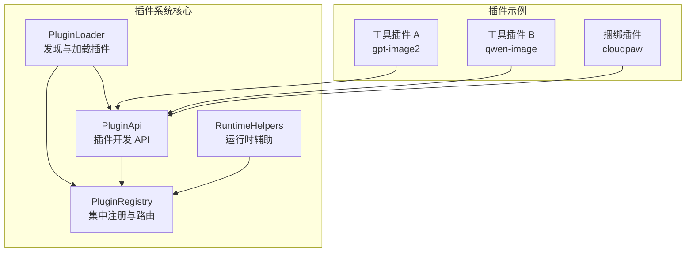
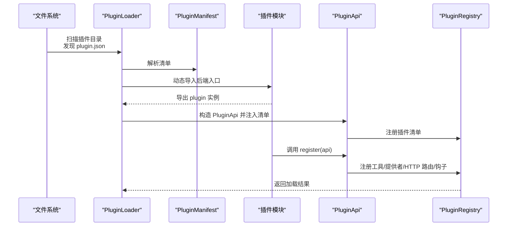
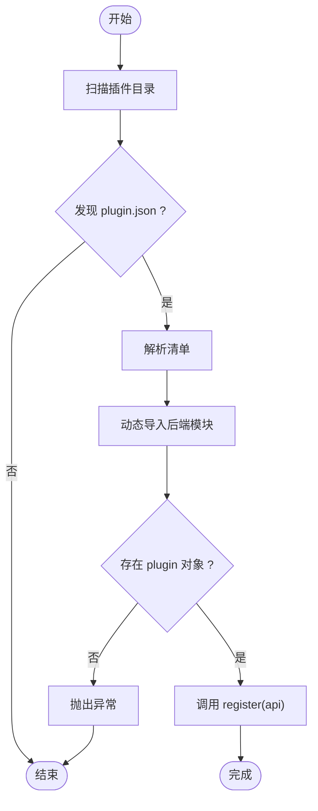
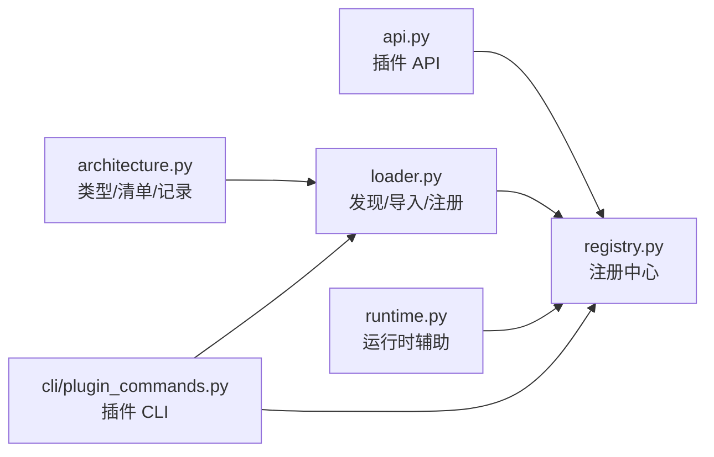
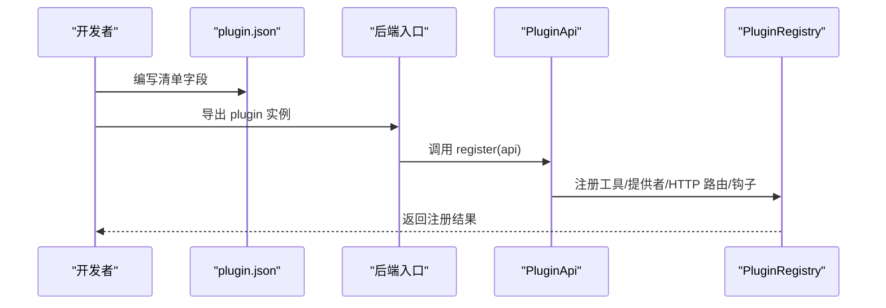

# 插件模板与开发框架

<cite>
**本文引用的文件**
- [src/qwenpaw/plugins/__init__.py](file://src/qwenpaw/plugins/__init__.py)
- [src/qwenpaw/plugins/architecture.py](file://src/qwenpaw/plugins/architecture.py)
- [src/qwenpaw/plugins/loader.py](file://src/qwenpaw/plugins/loader.py)
- [src/qwenpaw/plugins/registry.py](file://src/qwenpaw/plugins/registry.py)
- [src/qwenpaw/plugins/api.py](file://src/qwenpaw/plugins/api.py)
- [src/qwenpaw/plugins/runtime.py](file://src/qwenpaw/plugins/runtime.py)
- [src/qwenpaw/cli/plugin_commands.py](file://src/qwenpaw/cli/plugin_commands.py)
- [plugins/tool/gpt-image2/plugin.json](file://plugins/tool/gpt-image2/plugin.json)
- [plugins/tool/qwen-image/plugin.json](file://plugins/tool/qwen-image/plugin.json)
- [plugins/tool/wan27/plugin.json](file://plugins/tool/wan27/plugin.json)
- [plugins/tool/gpt-image2/gpt_image2.py](file://plugins/tool/gpt-image2/gpt_image2.py)
- [plugins/tool/qwen-image/qwen_image.py](file://plugins/tool/qwen-image/qwen_image.py)
- [plugins/bundle/cloudpaw/plugin.py](file://plugins/bundle/cloudpaw/plugin.py)
</cite>

## 目录
1. [简介](#简介)
2. [项目结构](#项目结构)
3. [核心组件](#核心组件)
4. [架构总览](#架构总览)
5. [详细组件分析](#详细组件分析)
6. [依赖分析](#依赖分析)
7. [性能考虑](#性能考虑)
8. [故障排查指南](#故障排查指南)
9. [结论](#结论)
10. [附录](#附录)

## 简介
本指南面向希望在 QwenPaw 平台上开发与集成插件的开发者，系统性介绍插件模板结构、清单文件字段、核心框架（加载器、注册表、API）、生命周期管理、最佳实践以及完整示例。通过遵循本文档，您可以快速构建工具型、提供者型、钩子型等不同类型的插件，并将其安全、稳定地集成到系统中。

## 项目结构
QwenPaw 的插件体系由后端 Python 加载器、注册表、插件 API 与 CLI 管理命令构成；同时包含若干内置插件示例，涵盖工具型（图像生成/视频生成）与捆绑型（CloudPaw 部署编排）两类。

图表来源
- [src/qwenpaw/plugins/loader.py:23-628](file://src/qwenpaw/plugins/loader.py#L23-L628)
- [src/qwenpaw/plugins/registry.py:95-598](file://src/qwenpaw/plugins/registry.py#L95-L598)
- [src/qwenpaw/plugins/api.py:48-401](file://src/qwenpaw/plugins/api.py#L48-L401)
- [src/qwenpaw/plugins/runtime.py:10-68](file://src/qwenpaw/plugins/runtime.py#L10-L68)
- [plugins/tool/gpt-image2/gpt_image2.py:27-64](file://plugins/tool/gpt-image2/gpt_image2.py#L27-L64)
- [plugins/tool/qwen-image/qwen_image.py:27-63](file://plugins/tool/qwen-image/qwen_image.py#L27-L63)
- [plugins/bundle/cloudpaw/plugin.py:292-370](file://plugins/bundle/cloudpaw/plugin.py#L292-L370)

章节来源
- [src/qwenpaw/plugins/__init__.py:1-17](file://src/qwenpaw/plugins/__init__.py#L1-L17)
- [src/qwenpaw/plugins/loader.py:23-628](file://src/qwenpaw/plugins/loader.py#L23-L628)
- [src/qwenpaw/plugins/registry.py:95-598](file://src/qwenpaw/plugins/registry.py#L95-L598)
- [src/qwenpaw/plugins/api.py:48-401](file://src/qwenpaw/plugins/api.py#L48-L401)
- [src/qwenpaw/plugins/runtime.py:10-68](file://src/qwenpaw/plugins/runtime.py#L10-L68)

## 核心组件
- 插件清单与类型：通过 plugin.json 定义插件元数据、入口点、依赖与类型，支持自动推断类型。
- 插件加载器：扫描插件目录，解析清单，动态导入后端模块，调用插件注册方法。
- 注册表：集中管理提供者、启动/关闭钩子、控制命令、HTTP 路由与插件清单。
- 插件 API：为插件开发者提供注册工具、提供者、HTTP 路由、控制命令、运行时访问等能力。
- 运行时辅助：提供日志、提供商查询、列表等便捷方法。
- CLI 插件管理：支持离线安装、在线热装、卸载、列出与信息查看。

章节来源
- [src/qwenpaw/plugins/architecture.py:10-142](file://src/qwenpaw/plugins/architecture.py#L10-L142)
- [src/qwenpaw/plugins/loader.py:23-628](file://src/qwenpaw/plugins/loader.py#L23-L628)
- [src/qwenpaw/plugins/registry.py:95-598](file://src/qwenpaw/plugins/registry.py#L95-L598)
- [src/qwenpaw/plugins/api.py:48-401](file://src/qwenpaw/plugins/api.py#L48-L401)
- [src/qwenpaw/plugins/runtime.py:10-68](file://src/qwenpaw/plugins/runtime.py#L10-L68)
- [src/qwenpaw/cli/plugin_commands.py:495-919](file://src/qwenpaw/cli/plugin_commands.py#L495-L919)

## 架构总览
下图展示了从发现到加载再到注册的完整流程，以及插件如何通过 API 向系统注册能力。

图表来源
- [src/qwenpaw/plugins/loader.py:36-238](file://src/qwenpaw/plugins/loader.py#L36-L238)
- [src/qwenpaw/plugins/api.py:48-286](file://src/qwenpaw/plugins/api.py#L48-L286)
- [src/qwenpaw/plugins/registry.py:431-504](file://src/qwenpaw/plugins/registry.py#L431-L504)

## 详细组件分析

### 插件清单（plugin.json）字段说明
- id：插件唯一标识符（建议使用短横线分隔的小写形式）
- name：插件显示名称
- version：插件版本号（语义化版本）
- type：插件类型（tool/provider/hook/command/frontend/general），可省略由 meta 推断
- description/author：描述与作者
- entry.backend/frontend：后端或前端入口文件路径（若仅前端可省略 backend）
- dependencies：Python 依赖列表（如需安装）
- min_version：兼容的最低系统版本
- meta：扩展元数据，用于工具插件时描述工具数组、配置字段、API 文档链接等

章节来源
- [plugins/tool/gpt-image2/plugin.json:1-89](file://plugins/tool/gpt-image2/plugin.json#L1-L89)
- [plugins/tool/qwen-image/plugin.json:1-129](file://plugins/tool/qwen-image/plugin.json#L1-L129)
- [plugins/tool/wan27/plugin.json:1-122](file://plugins/tool/wan27/plugin.json#L1-L122)
- [src/qwenpaw/plugins/architecture.py:44-130](file://src/qwenpaw/plugins/architecture.py#L44-L130)

### 插件类型与入口点
- 类型枚举：tool（工具）、provider（提供者）、hook（启动/关闭钩子）、command（控制命令）、frontend（前端包）、general（通用）
- 入口点：后端入口默认兼容旧版 entry_point 字段；新清单推荐使用 entry.backend/entry.frontend

章节来源
- [src/qwenpaw/plugins/architecture.py:10-42](file://src/qwenpaw/plugins/architecture.py#L10-L42)

### 插件加载器（PluginLoader）
- 发现：遍历插件目录，定位 plugin.json 并解析清单
- 动态导入：基于清单中的后端入口文件进行 importlib.spec_from_file_location 导入
- 注册：调用插件实例的 register(api) 方法，支持同步与异步
- 依赖安装：支持 requirements.txt 自动安装（优先 pip，失败回退 uv）

图表来源
- [src/qwenpaw/plugins/loader.py:36-238](file://src/qwenpaw/plugins/loader.py#L36-L238)

章节来源
- [src/qwenpaw/plugins/loader.py:23-628](file://src/qwenpaw/plugins/loader.py#L23-L628)

### 插件注册表（PluginRegistry）
- 提供者注册：避免重复注册，统一管理提供商元数据
- 钩子注册：按优先级排序的启动/关闭钩子
- 控制命令：注册命令处理器
- HTTP 路由：挂载 APIRouter 到 /api 前缀，保证在 SPA 路由之前
- 工具配置：读取/保存特定代理的工具配置

章节来源
- [src/qwenpaw/plugins/registry.py:95-598](file://src/qwenpaw/plugins/registry.py#L95-L598)

### 插件 API（PluginApi）
- 注册工具：将函数注册到 agents.tools 模块，创建 BuiltinToolConfig 并保存到当前代理配置
- 注册提供者：合并 manifest.meta 与自定义元数据
- 注册钩子：启动/关闭钩子，支持优先级
- 注册 HTTP 路由：挂载 FastAPI 路由器
- 注册控制命令：注册命令处理器
- 访问运行时：通过 runtime 获取日志、提供商等

章节来源
- [src/qwenpaw/plugins/api.py:48-401](file://src/qwenpaw/plugins/api.py#L48-L401)

### 运行时辅助（RuntimeHelpers）
- 提供者查询与列表
- 日志接口（info/error/debug）

章节来源
- [src/qwenpaw/plugins/runtime.py:10-68](file://src/qwenpaw/plugins/runtime.py#L10-L68)

### CLI 插件管理
- 在线热装：向运行中的 API 发送安装/上传请求
- 离线安装：校验清单、拷贝文件、安装依赖、同步工具到代理
- 卸载：删除插件目录并清理注册表与工具
- 列表/信息：读取已安装插件清单并展示

章节来源
- [src/qwenpaw/cli/plugin_commands.py:495-919](file://src/qwenpaw/cli/plugin_commands.py#L495-L919)

## 依赖分析
- 插件清单依赖：requirements.txt 中声明的 Python 包会在加载前安装
- 运行时依赖：插件通过 PluginApi 访问 ProviderManager 与注册表
- 组件耦合：Loader 依赖 Architecture 与 API；Registry 作为中心枢纽被 API 注入；Runtime 通过 Registry 暴露运行时能力

图表来源
- [src/qwenpaw/plugins/architecture.py:10-142](file://src/qwenpaw/plugins/architecture.py#L10-L142)
- [src/qwenpaw/plugins/loader.py:23-628](file://src/qwenpaw/plugins/loader.py#L23-L628)
- [src/qwenpaw/plugins/registry.py:95-598](file://src/qwenpaw/plugins/registry.py#L95-L598)
- [src/qwenpaw/plugins/api.py:48-401](file://src/qwenpaw/plugins/api.py#L48-L401)
- [src/qwenpaw/plugins/runtime.py:10-68](file://src/qwenpaw/plugins/runtime.py#L10-L68)
- [src/qwenpaw/cli/plugin_commands.py:495-919](file://src/qwenpaw/cli/plugin_commands.py#L495-L919)

章节来源
- [src/qwenpaw/plugins/architecture.py:10-142](file://src/qwenpaw/plugins/architecture.py#L10-L142)
- [src/qwenpaw/plugins/loader.py:23-628](file://src/qwenpaw/plugins/loader.py#L23-L628)
- [src/qwenpaw/plugins/registry.py:95-598](file://src/qwenpaw/plugins/registry.py#L95-L598)
- [src/qwenpaw/plugins/api.py:48-401](file://src/qwenpaw/plugins/api.py#L48-L401)
- [src/qwenpaw/plugins/runtime.py:10-68](file://src/qwenpaw/plugins/runtime.py#L10-L68)
- [src/qwenpaw/cli/plugin_commands.py:495-919](file://src/qwenpaw/cli/plugin_commands.py#L495-L919)

## 性能考虑
- 异步加载：register(api) 支持异步，可在启动钩子中执行耗时初始化
- 事件循环：依赖安装通过 asyncio.to_thread 避免阻塞
- 路由挂载：HTTP 路由插入顺序受 SPA 路由影响，注册时会调整顺序以确保匹配优先级
- 日志：使用结构化日志输出，便于问题定位与性能观测

[本节为通用指导，不直接分析具体文件]

## 故障排查指南
- 清单解析失败：检查 plugin.json 是否符合 schema，字段是否齐全
- 入口点缺失：确认 entry.backend 或 entry.frontend 文件存在且可导入
- 依赖安装失败：确认 pip/uv 可用，网络可达；必要时手动安装 requirements.txt
- 已加载插件重装：卸载后再安装，避免冲突
- 工具未出现在代理中：确认通过 PluginApi.register_tool 注册并在启动钩子中生效

章节来源
- [src/qwenpaw/plugins/loader.py:88-238](file://src/qwenpaw/plugins/loader.py#L88-L238)
- [src/qwenpaw/plugins/registry.py:467-504](file://src/qwenpaw/plugins/registry.py#L467-L504)
- [src/qwenpaw/cli/plugin_commands.py:507-670](file://src/qwenpaw/cli/plugin_commands.py#L507-L670)

## 结论
QwenPaw 的插件框架提供了清晰的生命周期、强大的注册机制与完善的开发 API。通过标准化的清单与入口约定，开发者可以快速实现工具、提供者、钩子与前端包等多种类型的插件，并借助 CLI 与运行时能力实现热插拔与可观测性。

[本节为总结性内容，不直接分析具体文件]

## 附录

### 插件模板结构与必需文件
- 必备文件
  - plugin.json：插件清单
  - 后端入口文件（如 plugin.py 或自定义名称）：导出 plugin 实例
  - requirements.txt（可选）：Python 依赖
- 目录布局示例
  - plugins/tool/<your-plugin>/plugin.json
  - plugins/tool/<your-plugin>/<backend_entry>.py
  - plugins/tool/<your-plugin>/requirements.txt（可选）

章节来源
- [plugins/tool/gpt-image2/plugin.json:1-89](file://plugins/tool/gpt-image2/plugin.json#L1-L89)
- [plugins/tool/gpt-image2/gpt_image2.py:27-64](file://plugins/tool/gpt-image2/gpt_image2.py#L27-L64)
- [plugins/tool/qwen-image/qwen_image.py:27-63](file://plugins/tool/qwen-image/qwen_image.py#L27-L63)

### 插件类定义与注册方法
- 插件类应实现 register(self, api: PluginApi) 方法
- 在 register 中调用 api.register_* 完成能力注册
- 若为工具插件，使用 api.register_tool 注册函数与配置项

章节来源
- [plugins/tool/gpt-image2/gpt_image2.py:27-64](file://plugins/tool/gpt-image2/gpt_image2.py#L27-L64)
- [plugins/tool/qwen-image/qwen_image.py:27-63](file://plugins/tool/qwen-image/qwen_image.py#L27-L63)
- [plugins/bundle/cloudpaw/plugin.py:292-370](file://plugins/bundle/cloudpaw/plugin.py#L292-L370)

### 生命周期管理
- 启动钩子：在应用启动阶段执行初始化逻辑
- 关闭钩子：在应用关闭阶段执行清理逻辑
- HTTP 路由：在 /api 下挂载 REST 接口
- 控制命令：注册 /slash 命令处理器

章节来源
- [src/qwenpaw/plugins/api.py:127-244](file://src/qwenpaw/plugins/api.py#L127-L244)
- [src/qwenpaw/plugins/registry.py:141-214](file://src/qwenpaw/plugins/registry.py#L141-L214)

### 最佳实践
- 清单字段完整：明确 id/name/version/type/description/author/entry/meta
- 依赖最小化：仅声明必要依赖，避免版本过严
- 错误处理：在 register 与工具函数中捕获异常并记录日志
- 日志规范：使用 api.runtime.log_* 输出调试/错误信息
- 配置持久化：通过 PluginApi.set_tool_config 保存用户配置
- 前后端分离：前端插件仅提供静态资源，后端负责业务逻辑

章节来源
- [src/qwenpaw/plugins/api.py:256-286](file://src/qwenpaw/plugins/api.py#L256-L286)
- [src/qwenpaw/plugins/runtime.py:44-67](file://src/qwenpaw/plugins/runtime.py#L44-L67)

### 完整开发示例（工具插件）
- 示例一：GPT Image 2 工具插件
  - 清单字段：id/name/version/type/entry/meta
  - 后端入口：导出 plugin 实例，调用 api.register_tool 注册两个工具函数
- 示例二：Qwen-Image 工具插件
  - 清单字段：id/name/version/entry/meta（含多模型选项）
  - 后端入口：导出 plugin 实例，注册生成与编辑两类工具
- 示例三：CloudPaw 捆绑插件
  - 使用启动/关闭钩子完成环境变量、技能池、API 路由与 A2A 管理器初始化

图表来源
- [plugins/tool/gpt-image2/plugin.json:1-89](file://plugins/tool/gpt-image2/plugin.json#L1-L89)
- [plugins/tool/gpt-image2/gpt_image2.py:27-64](file://plugins/tool/gpt-image2/gpt_image2.py#L27-L64)
- [plugins/tool/qwen-image/plugin.json:1-129](file://plugins/tool/qwen-image/plugin.json#L1-L129)
- [plugins/tool/qwen-image/qwen_image.py:27-63](file://plugins/tool/qwen-image/qwen_image.py#L27-L63)
- [plugins/bundle/cloudpaw/plugin.py:292-370](file://plugins/bundle/cloudpaw/plugin.py#L292-L370)

章节来源
- [plugins/tool/gpt-image2/plugin.json:1-89](file://plugins/tool/gpt-image2/plugin.json#L1-L89)
- [plugins/tool/gpt-image2/gpt_image2.py:27-64](file://plugins/tool/gpt-image2/gpt_image2.py#L27-L64)
- [plugins/tool/qwen-image/plugin.json:1-129](file://plugins/tool/qwen-image/plugin.json#L1-L129)
- [plugins/tool/qwen-image/qwen_image.py:27-63](file://plugins/tool/qwen-image/qwen_image.py#L27-L63)
- [plugins/bundle/cloudpaw/plugin.py:292-370](file://plugins/bundle/cloudpaw/plugin.py#L292-L370)