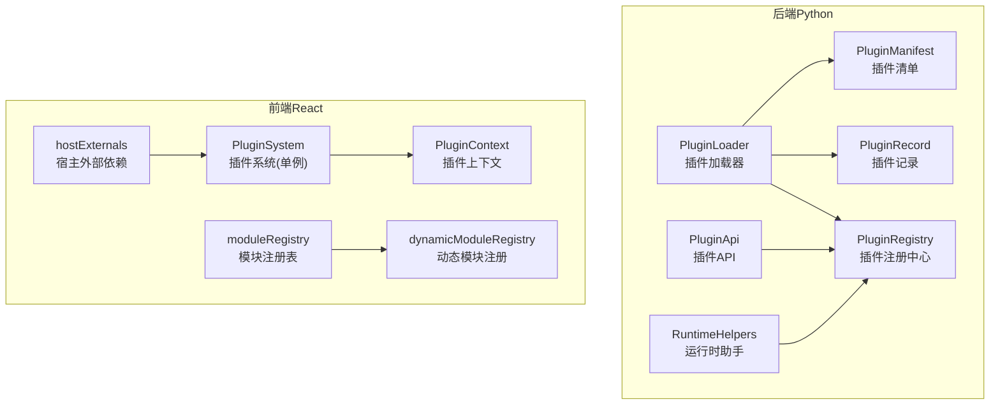
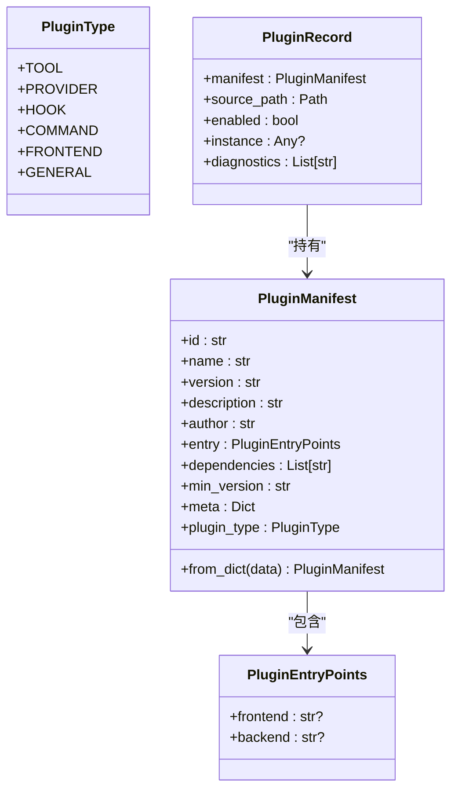
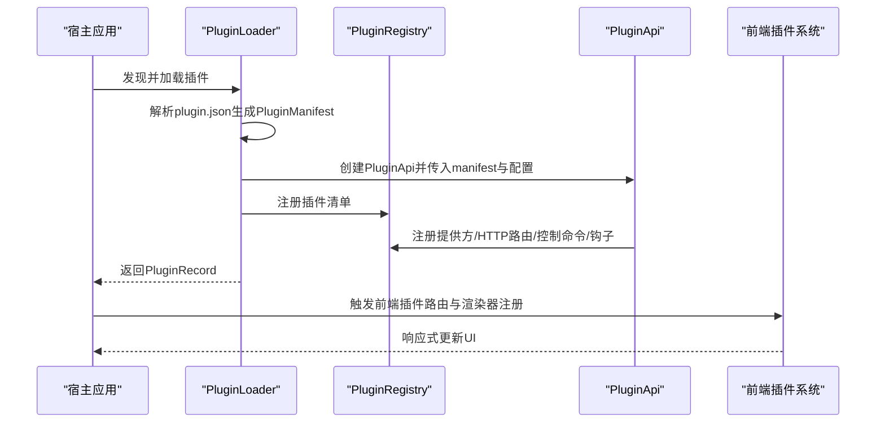
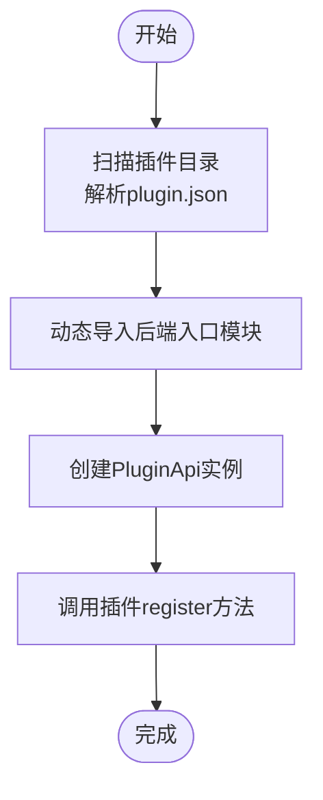
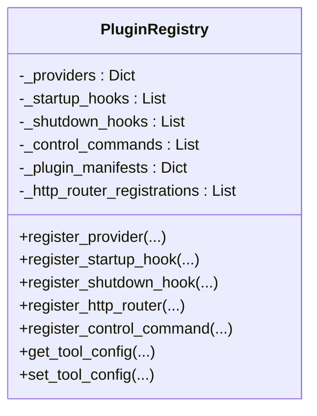
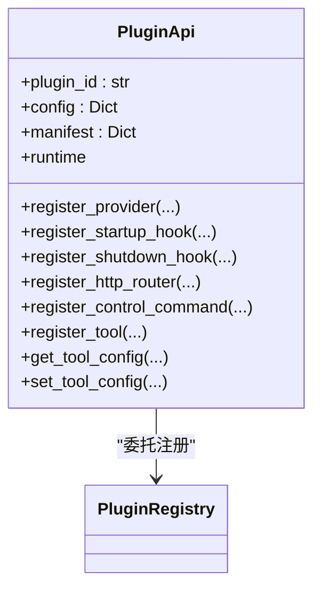
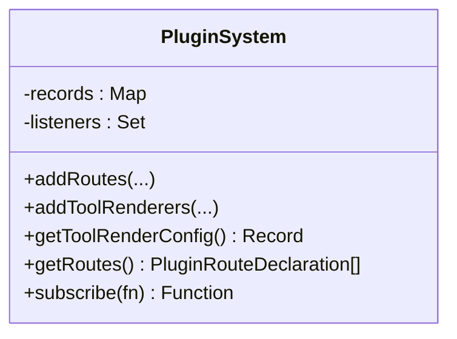
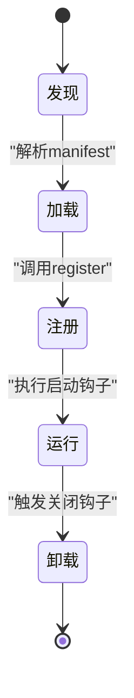
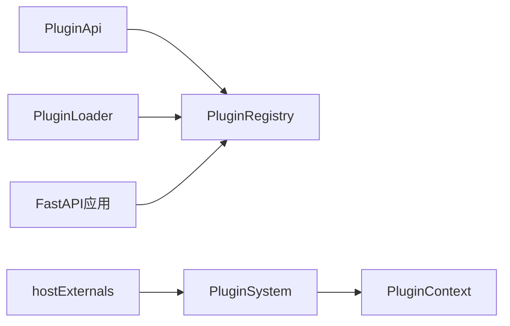

# 插件架构设计

<cite>
**本文档引用的文件**
- [architecture.py](file://src/qwenpaw/plugins/architecture.py)
- [loader.py](file://src/qwenpaw/plugins/loader.py)
- [registry.py](file://src/qwenpaw/plugins/registry.py)
- [api.py](file://src/qwenpaw/plugins/api.py)
- [runtime.py](file://src/qwenpaw/plugins/runtime.py)
- [hostExternals.ts](file://console/src/plugins/hostExternals.ts)
- [PluginContext.tsx](file://console/src/plugins/PluginContext.tsx)
- [dynamicModuleRegistry.ts](file://console/src/plugins/dynamicModuleRegistry.ts)
- [moduleRegistry.ts](file://console/src/plugins/moduleRegistry.ts)
- [plugins.py](file://src/qwenpaw/app/routers/plugins.py)
</cite>

## 目录
1. [简介](#简介)
2. [项目结构](#项目结构)
3. [核心组件](#核心组件)
4. [架构总览](#架构总览)
5. [详细组件分析](#详细组件分析)
6. [依赖关系分析](#依赖关系分析)
7. [性能考虑](#性能考虑)
8. [故障排除指南](#故障排除指南)
9. [结论](#结论)

## 简介
本文件面向QwenPaw插件系统的架构设计与实现，重点阐述后端Python插件框架与前端React插件生态的协同机制。内容涵盖：
- 插件清单（PluginManifest）与插件记录（PluginRecord）的数据结构设计
- 插件生命周期管理（发现、加载、注册、卸载）
- 插件间依赖关系处理与隔离机制
- 关键设计模式的应用（工厂模式、观察者模式等）
- 架构扩展性与性能优化策略
- 组件交互关系图与数据流图，帮助开发者快速理解技术决策

## 项目结构
QwenPaw的插件体系由后端Python框架与前端React宿主应用共同组成：
- 后端：负责插件发现、动态加载、注册中心、运行时工具与HTTP路由挂载
- 前端：负责插件路由注册、工具渲染器注册、模块注册表与宿主外部依赖共享

**图表来源**
- [loader.py:23-628](file://src/qwenpaw/plugins/loader.py#L23-L628)
- [registry.py:95-598](file://src/qwenpaw/plugins/registry.py#L95-L598)
- [architecture.py:44-142](file://src/qwenpaw/plugins/architecture.py#L44-L142)
- [api.py:48-401](file://src/qwenpaw/plugins/api.py#L48-L401)
- [runtime.py:10-68](file://src/qwenpaw/plugins/runtime.py#L10-L68)
- [hostExternals.ts:57-192](file://console/src/plugins/hostExternals.ts#L57-L192)
- [PluginContext.tsx:47-96](file://console/src/plugins/PluginContext.tsx#L47-L96)
- [moduleRegistry.ts:39-138](file://console/src/plugins/moduleRegistry.ts#L39-L138)
- [dynamicModuleRegistry.ts:22-117](file://console/src/plugins/dynamicModuleRegistry.ts#L22-L117)

**章节来源**
- [loader.py:23-628](file://src/qwenpaw/plugins/loader.py#L23-L628)
- [registry.py:95-598](file://src/qwenpaw/plugins/registry.py#L95-L598)
- [architecture.py:44-142](file://src/qwenpaw/plugins/architecture.py#L44-L142)
- [hostExternals.ts:57-192](file://console/src/plugins/hostExternals.ts#L57-L192)

## 核心组件
本节聚焦于插件系统的核心数据结构与类，解释其职责与协作方式。

- 插件类型枚举（PluginType）
  - 定义了工具（tool）、提供方（provider）、钩子（hook）、控制命令（command）、前端（frontend）、通用（general）等类型，用于区分插件能力类别。
- 插件入口点（PluginEntryPoints）
  - 指定前端与后端入口文件路径，支持遗留字段兼容。
- 插件清单（PluginManifest）
  - 描述插件元信息（id、name、version、description、author、entry、dependencies、min_version、meta、plugin_type），并提供从字典构建实例的方法，包含类型推断逻辑以兼容旧版清单。
- 插件记录（PluginRecord）
  - 记录已加载插件的清单、源路径、启用状态、实例对象与诊断信息，作为内存中插件状态的快照。

**图表来源**
- [architecture.py:10-142](file://src/qwenpaw/plugins/architecture.py#L10-L142)

**章节来源**
- [architecture.py:44-142](file://src/qwenpaw/plugins/architecture.py#L44-L142)

## 架构总览
QwenPaw插件架构采用“后端Python框架 + 前端React宿主”的双层设计：
- 后端负责插件生命周期与能力注册（提供方、HTTP路由、控制命令、启动/关闭钩子、工具函数）
- 前端负责页面路由与工具渲染器的注册，并通过单例插件系统进行响应式更新
- 两者通过统一的注册中心进行协调，确保插件能力在前后端正确暴露与生效

**图表来源**
- [loader.py:88-238](file://src/qwenpaw/plugins/loader.py#L88-L238)
- [api.py:48-286](file://src/qwenpaw/plugins/api.py#L48-L286)
- [registry.py:130-214](file://src/qwenpaw/plugins/registry.py#L130-L214)
- [hostExternals.ts:152-192](file://console/src/plugins/hostExternals.ts#L152-L192)

**章节来源**
- [loader.py:88-238](file://src/qwenpaw/plugins/loader.py#L88-L238)
- [api.py:48-286](file://src/qwenpaw/plugins/api.py#L48-L286)
- [registry.py:130-214](file://src/qwenpaw/plugins/registry.py#L130-L214)
- [hostExternals.ts:152-192](file://console/src/plugins/hostExternals.ts#L152-L192)

## 详细组件分析

### 后端插件系统（Python）

#### 插件加载器（PluginLoader）
- 职责
  - 扫描插件目录，解析plugin.json生成清单
  - 动态导入后端入口模块，调用插件的register方法完成能力注册
  - 处理依赖安装（pip/uv），支持异步事件循环不阻塞
  - 提供卸载插件功能，清理模块缓存、注册中心与工具列表
- 关键流程
  - 发现插件：遍历插件目录，读取plugin.json
  - 加载插件：动态导入模块，构造PluginApi并调用register
  - 卸载插件：执行关闭钩子、移除sys.modules、清理注册中心

**图表来源**
- [loader.py:36-238](file://src/qwenpaw/plugins/loader.py#L36-L238)

**章节来源**
- [loader.py:23-628](file://src/qwenpaw/plugins/loader.py#L23-L628)

#### 插件注册中心（PluginRegistry）
- 职责
  - 统一管理提供方、启动/关闭钩子、控制命令、HTTP路由、插件清单
  - 保证HTTP路由挂载顺序（在SPA路由之前）
  - 提供工具配置读写接口，支持按代理维度管理工具参数
- 关键能力
  - HTTP路由注册：校验前缀唯一性，插入到FastAPI路由表
  - 钩子管理：按优先级排序，支持启动与关闭阶段执行
  - 工具配置：从代理配置中读取/保存工具参数

**图表来源**
- [registry.py:95-598](file://src/qwenpaw/plugins/registry.py#L95-L598)

**章节来源**
- [registry.py:95-598](file://src/qwenpaw/plugins/registry.py#L95-L598)

#### 插件API（PluginApi）
- 职责
  - 为插件开发者提供统一的能力注册接口（提供方、HTTP路由、控制命令、钩子、工具）
  - 提供运行时助手访问（日志、提供商查询、提供商列表）
  - 提供工具配置读写便捷方法
- 设计要点
  - 将插件清单与元数据合并传递给注册中心
  - 工具注册通过启动钩子延迟执行，确保上下文就绪

**图表来源**
- [api.py:48-401](file://src/qwenpaw/plugins/api.py#L48-L401)

**章节来源**
- [api.py:48-401](file://src/qwenpaw/plugins/api.py#L48-L401)

#### 运行时助手（RuntimeHelpers）
- 职责
  - 提供日志接口与提供商查询/列举能力
  - 通过注册中心获取运行时助手实例

**章节来源**
- [runtime.py:10-68](file://src/qwenpaw/plugins/runtime.py#L10-L68)

### 前端插件系统（React）

#### 插件系统单例（PluginSystem）
- 职责
  - 接收插件注册的页面路由与工具渲染器
  - 维护内部记录并通知订阅者（PluginContext）
- 关键接口
  - 添加路由与工具渲染器
  - 获取合并后的工具渲染配置与排序后的路由列表
  - 订阅变更并触发UI更新

**图表来源**
- [hostExternals.ts:57-118](file://console/src/plugins/hostExternals.ts#L57-L118)

**章节来源**
- [hostExternals.ts:57-192](file://console/src/plugins/hostExternals.ts#L57-L192)

#### 插件上下文（PluginContext）
- 职责
  - 订阅PluginSystem变化，同步工具渲染配置与插件路由
  - 初始化加载所有插件，处理失败情况
- 使用方式
  - 通过Provider包裹应用根节点
  - 通过自定义hook usePlugins获取当前状态

**章节来源**
- [PluginContext.tsx:47-96](file://console/src/plugins/PluginContext.tsx#L47-L96)

#### 模块注册表（moduleRegistry）与动态注册（dynamicModuleRegistry）
- 职责
  - 在宿主应用启动时动态发现并注册模块
  - 通过window.QwenPaw.modules暴露模块，供插件修改宿主导出
- 特性
  - 支持惰性加载与预加载两种模式
  - 自动排除测试文件，保持构建整洁

**章节来源**
- [moduleRegistry.ts:39-138](file://console/src/plugins/moduleRegistry.ts#L39-L138)
- [dynamicModuleRegistry.ts:22-117](file://console/src/plugins/dynamicModuleRegistry.ts#L22-L117)

### 插件生命周期管理
- 发现阶段：扫描插件目录，读取plugin.json
- 加载阶段：动态导入后端入口模块，调用register
- 注册阶段：通过PluginApi向PluginRegistry注册各类能力
- 运行阶段：执行启动钩子，暴露HTTP路由与工具
- 卸载阶段：执行关闭钩子，清理模块缓存与注册中心条目

**图表来源**
- [loader.py:88-238](file://src/qwenpaw/plugins/loader.py#L88-L238)
- [registry.py:325-397](file://src/qwenpaw/plugins/registry.py#L325-L397)

**章节来源**
- [loader.py:88-238](file://src/qwenpaw/plugins/loader.py#L88-L238)
- [registry.py:325-397](file://src/qwenpaw/plugins/registry.py#L325-L397)

### 插件间依赖关系处理与隔离机制
- 依赖声明：在清单中声明dependencies，便于后续版本化管理
- 依赖安装：通过pip或uv自动安装requirements.txt
- 模块隔离：动态导入时设置唯一的模块名与包路径，避免全局污染
- 卸载清理：删除sys.modules中对应前缀的模块，确保下次导入获得全新实例
- HTTP路由隔离：每个插件的路由前缀必须唯一，防止冲突

**章节来源**
- [loader.py:155-178](file://src/qwenpaw/plugins/loader.py#L155-L178)
- [loader.py:531-540](file://src/qwenpaw/plugins/loader.py#L531-L540)
- [registry.py:170-214](file://src/qwenpaw/plugins/registry.py#L170-L214)

### 关键设计模式
- 工厂模式
  - PluginLoader根据清单动态创建PluginApi实例，调用插件register方法，形成“插件工厂”
- 观察者模式
  - PluginSystem维护监听者集合，当插件注册路由或工具渲染器时通知订阅者，实现UI响应式更新
- 单例模式
  - PluginRegistry与PluginSystem均为单例，保证全局一致性

**章节来源**
- [loader.py:188-218](file://src/qwenpaw/plugins/loader.py#L188-L218)
- [hostExternals.ts:97-114](file://console/src/plugins/hostExternals.ts#L97-L114)
- [registry.py:104-108](file://src/qwenpaw/plugins/registry.py#L104-L108)

## 依赖关系分析
后端与前端插件系统通过统一的注册中心进行耦合：
- 后端通过PluginApi向PluginRegistry注册能力
- 前端通过window.QwenPaw.registerRoutes/registerToolRender向PluginSystem注册能力
- 宿主应用在启动时挂载HTTP路由，确保插件路由在SPA路由之前

**图表来源**
- [api.py:191-243](file://src/qwenpaw/plugins/api.py#L191-L243)
- [registry.py:130-214](file://src/qwenpaw/plugins/registry.py#L130-L214)
- [hostExternals.ts:152-192](file://console/src/plugins/hostExternals.ts#L152-L192)

**章节来源**
- [api.py:191-243](file://src/qwenpaw/plugins/api.py#L191-L243)
- [registry.py:130-214](file://src/qwenpaw/plugins/registry.py#L130-L214)
- [hostExternals.ts:152-192](file://console/src/plugins/hostExternals.ts#L152-L192)

## 性能考虑
- 异步加载与事件循环
  - 依赖安装通过异步线程执行，避免阻塞事件循环
- 惰性模块注册
  - 前端使用Vite的import.meta.glob进行惰性加载，减少初始包体积
- 路由挂载优化
  - HTTP路由插入到SPA路由之前，避免重复匹配与错误重定向
- 工具配置缓存
  - 通过注册中心集中管理工具配置，减少重复IO

**章节来源**
- [loader.py:295-404](file://src/qwenpaw/plugins/loader.py#L295-L404)
- [dynamicModuleRegistry.ts:22-71](file://console/src/plugins/dynamicModuleRegistry.ts#L22-L71)
- [registry.py:194-213](file://src/qwenpaw/plugins/registry.py#L194-L213)

## 故障排除指南
- 插件未找到入口点
  - 检查plugin.json中的entry字段是否正确，确认后端或前端入口文件存在
- 依赖安装失败
  - 确认pip可用；若不可用，检查uv是否安装并可执行
- HTTP路由冲突
  - 检查插件路由前缀是否唯一，避免与现有路由重复
- 工具配置读取失败
  - 确认当前代理上下文存在且工具已在代理配置中注册

**章节来源**
- [loader.py:126-144](file://src/qwenpaw/plugins/loader.py#L126-L144)
- [loader.py:323-404](file://src/qwenpaw/plugins/loader.py#L323-L404)
- [registry.py:170-186](file://src/qwenpaw/plugins/registry.py#L170-L186)
- [api.py:10-46](file://src/qwenpaw/plugins/api.py#L10-L46)

## 结论
QwenPaw插件架构通过清晰的数据结构（PluginManifest/PluginRecord）、完善的生命周期管理（发现/加载/注册/卸载）以及前后端协同的注册中心，实现了高扩展性与强隔离性的插件生态。设计中广泛采用工厂与观察者模式，结合异步与模块化机制，既保证了开发体验，也兼顾了运行时性能与稳定性。未来可在依赖解析与热重载方面进一步增强，以提升插件开发与运维效率。