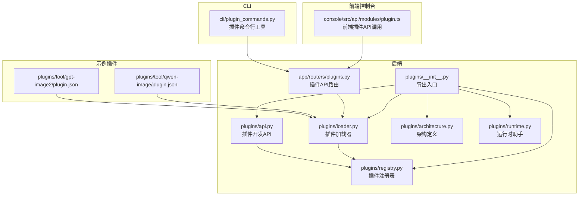
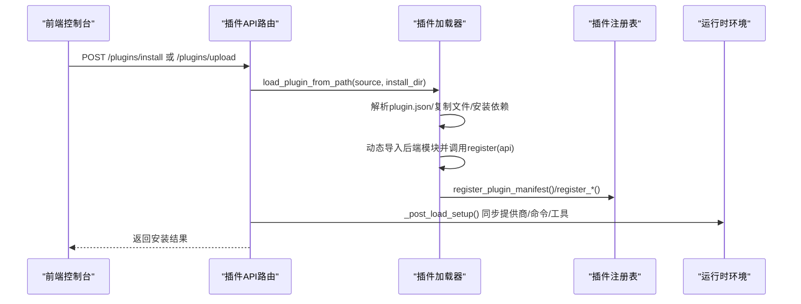
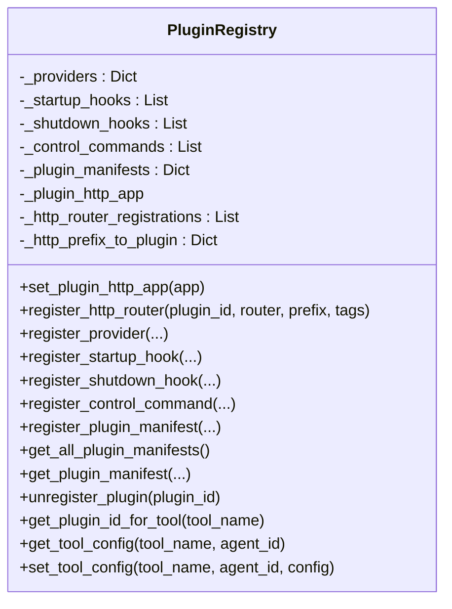
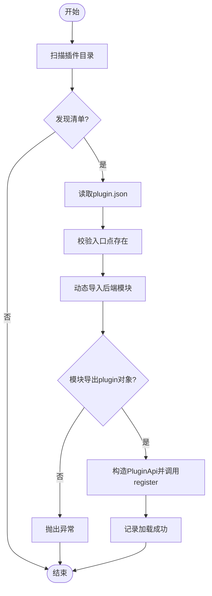
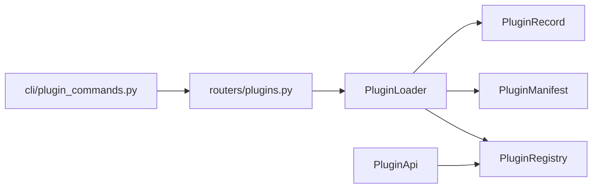

# 插件注册与管理

<cite>
**本文档引用的文件**
- [src/qwenpaw/plugins/__init__.py](file://src/qwenpaw/plugins/__init__.py)
- [src/qwenpaw/plugins/registry.py](file://src/qwenpaw/plugins/registry.py)
- [src/qwenpaw/plugins/loader.py](file://src/qwenpaw/plugins/loader.py)
- [src/qwenpaw/plugins/api.py](file://src/qwenpaw/plugins/api.py)
- [src/qwenpaw/plugins/architecture.py](file://src/qwenpaw/plugins/architecture.py)
- [src/qwenpaw/plugins/runtime.py](file://src/qwenpaw/plugins/runtime.py)
- [src/qwenpaw/app/routers/plugins.py](file://src/qwenpaw/app/routers/plugins.py)
- [src/qwenpaw/cli/plugin_commands.py](file://src/qwenpaw/cli/plugin_commands.py)
- [plugins/tool/qwen-image/plugin.json](file://plugins/tool/qwen-image/plugin.json)
- [plugins/tool/gpt-image2/plugin.json](file://plugins/tool/gpt-image2/plugin.json)
</cite>

## 目录
1. [简介](#简介)
2. [项目结构](#项目结构)
3. [核心组件](#核心组件)
4. [架构总览](#架构总览)
5. [详细组件分析](#详细组件分析)
6. [依赖分析](#依赖分析)
7. [性能考虑](#性能考虑)
8. [故障排查指南](#故障排查指南)
9. [结论](#结论)
10. [附录](#附录)

## 简介
本文件系统化阐述 QwenPaw 的插件注册与管理系统，覆盖插件注册表（PluginRegistry）的工作原理、插件加载器（PluginLoader）的实现细节、插件生命周期管理、状态监控与健康检查、冲突检测与版本兼容性校验、以及插件管理的 API 接口与使用示例。目标是帮助开发者与运维人员快速理解并高效使用插件体系。

## 项目结构
插件子系统位于后端 Python 包 src/qwenpaw/plugins 下，前端控制台通过 API 路由进行插件安装、卸载与状态查询；CLI 提供离线安装与信息展示能力；示例插件位于 plugins/tool 目录下。

图表来源
- [src/qwenpaw/plugins/__init__.py:1-17](file://src/qwenpaw/plugins/__init__.py#L1-L17)
- [src/qwenpaw/plugins/registry.py:95-128](file://src/qwenpaw/plugins/registry.py#L95-L128)
- [src/qwenpaw/plugins/loader.py:23-35](file://src/qwenpaw/plugins/loader.py#L23-L35)
- [src/qwenpaw/plugins/api.py:48-80](file://src/qwenpaw/plugins/api.py#L48-L80)
- [src/qwenpaw/plugins/architecture.py:36-64](file://src/qwenpaw/plugins/architecture.py#L36-L64)
- [src/qwenpaw/plugins/runtime.py:10-20](file://src/qwenpaw/plugins/runtime.py#L10-L20)
- [src/qwenpaw/app/routers/plugins.py:25-26](file://src/qwenpaw/app/routers/plugins.py#L25-L26)
- [src/qwenpaw/cli/plugin_commands.py:495-498](file://src/qwenpaw/cli/plugin_commands.py#L495-L498)
- [plugins/tool/qwen-image/plugin.json:1-129](file://plugins/tool/qwen-image/plugin.json#L1-L129)
- [plugins/tool/gpt-image2/plugin.json:1-89](file://plugins/tool/gpt-image2/plugin.json#L1-L89)

章节来源
- [src/qwenpaw/plugins/__init__.py:1-17](file://src/qwenpaw/plugins/__init__.py#L1-L17)
- [src/qwenpaw/app/routers/plugins.py:25-26](file://src/qwenpaw/app/routers/plugins.py#L25-L26)

## 核心组件
- 插件注册表（PluginRegistry）：集中管理插件的 HTTP 路由、提供商、启动/关闭钩子、控制命令、清单与运行时助手，并提供查询接口与注销能力。
- 插件加载器（PluginLoader）：负责扫描插件目录、解析 plugin.json、动态导入后端模块、执行插件注册、安装依赖、热加载/卸载插件。
- 插件开发 API（PluginApi）：为插件开发者提供注册提供商、注册钩子、注册 HTTP 路由、注册控制命令、注册工具函数等能力。
- 架构定义（architecture）：定义插件类型、入口点、清单模型与记录模型。
- 运行时助手（RuntimeHelpers）：向插件暴露运行时能力（如获取提供商、日志等）。
- 插件 API 路由（routers/plugins.py）：提供列表、安装、上传、卸载、状态查询等 HTTP 接口。
- CLI 插件命令（cli/plugin_commands.py）：支持离线安装、在线热安装、列出与卸载插件。

章节来源
- [src/qwenpaw/plugins/registry.py:95-598](file://src/qwenpaw/plugins/registry.py#L95-L598)
- [src/qwenpaw/plugins/loader.py:23-628](file://src/qwenpaw/plugins/loader.py#L23-L628)
- [src/qwenpaw/plugins/api.py:48-401](file://src/qwenpaw/plugins/api.py#L48-L401)
- [src/qwenpaw/plugins/architecture.py:36-142](file://src/qwenpaw/plugins/architecture.py#L36-L142)
- [src/qwenpaw/plugins/runtime.py:10-68](file://src/qwenpaw/plugins/runtime.py#L10-L68)
- [src/qwenpaw/app/routers/plugins.py:25-914](file://src/qwenpaw/app/routers/plugins.py#L25-L914)
- [src/qwenpaw/cli/plugin_commands.py:495-919](file://src/qwenpaw/cli/plugin_commands.py#L495-L919)

## 架构总览
插件系统采用“清单驱动 + 动态加载 + 注册表统一管理”的架构。前端通过 API 路由进行热安装/卸载，后端在运行时动态导入插件模块并调用其注册方法，将插件能力注入到全局注册表中，再同步到运行时环境（如提供商、控制命令、工具配置）。

图表来源
- [src/qwenpaw/app/routers/plugins.py:497-604](file://src/qwenpaw/app/routers/plugins.py#L497-L604)
- [src/qwenpaw/plugins/loader.py:406-485](file://src/qwenpaw/plugins/loader.py#L406-L485)
- [src/qwenpaw/plugins/registry.py:431-466](file://src/qwenpaw/plugins/registry.py#L431-L466)

## 详细组件分析

### 插件注册表（PluginRegistry）
- 职责
  - 统一注册与查询插件能力：提供商、启动/关闭钩子、控制命令、HTTP 路由、插件清单。
  - 管理运行时助手与 HTTP 应用上下文，确保路由挂载顺序正确。
  - 提供注销能力，清理内存中的注册项与 HTTP 路由。
- 关键接口
  - set_plugin_http_app：绑定 FastAPI 应用以挂载插件 HTTP 路由。
  - register_http_router：注册 APIRouter，保证在 SPA 捕获路由之前插入。
  - register_provider/register_startup_hook/register_shutdown_hook/register_control_command：注册各类能力。
  - register_plugin_manifest/get_plugin_manifest/get_all_plugin_manifests：管理插件清单。
  - unregister_plugin：按插件 ID 清理所有注册项。
  - get_plugin_id_for_tool/get_tool_config/set_tool_config：工具定位与配置读写。
- 设计要点
  - 单例模式，避免重复初始化。
  - HTTP 路由插入时通过索引调整，确保优先级。
  - 对重复前缀与重复提供商 ID 进行校验，防止冲突。

图表来源
- [src/qwenpaw/plugins/registry.py:95-598](file://src/qwenpaw/plugins/registry.py#L95-L598)

章节来源
- [src/qwenpaw/plugins/registry.py:95-598](file://src/qwenpaw/plugins/registry.py#L95-L598)

### 插件加载器（PluginLoader）
- 职责
  - 发现插件：扫描插件目录，读取 plugin.json。
  - 加载插件：动态导入后端模块，调用插件的 register(api) 方法。
  - 依赖管理：自动安装 requirements.txt，支持 pip 与 uv 双通道。
  - 热加载/卸载：支持从路径或 URL 安装，支持强制重装；卸载时执行关闭钩子并清理模块与注册表。
- 关键流程
  - discover_plugins：遍历插件目录，收集清单。
  - load_plugin：校验入口点、动态导入、构造 PluginApi 并注册清单与能力。
  - load_plugin_from_path：复制到目标目录、安装依赖、重新加载清单并加载。
  - unload_plugin：执行关闭钩子、移除 sys.modules 中的模块、清理注册表与工具。
- 错误处理
  - 入口点缺失、模块未导出 plugin 对象、register 缺失等抛出异常。
  - 依赖安装超时或失败时抛出异常并回滚临时目录。

图表来源
- [src/qwenpaw/plugins/loader.py:36-238](file://src/qwenpaw/plugins/loader.py#L36-L238)

章节来源
- [src/qwenpaw/plugins/loader.py:23-628](file://src/qwenpaw/plugins/loader.py#L23-L628)

### 插件开发 API（PluginApi）
- 能力
  - register_provider：注册自定义提供商。
  - register_startup_hook/register_shutdown_hook：注册启动/关闭钩子。
  - register_http_router：注册 HTTP 路由（/api 前缀）。
  - register_control_command：注册控制命令处理器。
  - register_tool：注册工具函数（延迟到启动钩子执行），并写入代理工具配置。
  - runtime：访问运行时助手（日志、提供商列表等）。
  - get_tool_config/set_tool_config：读写工具配置。
- 设计要点
  - 将注册请求转发至 PluginRegistry，保持统一入口。
  - 工具注册通过启动钩子延后执行，确保应用与代理上下文已就绪。

章节来源
- [src/qwenpaw/plugins/api.py:48-401](file://src/qwenpaw/plugins/api.py#L48-L401)

### 架构定义（architecture）
- 插件类型（PluginType）：tool、provider、hook、command、frontend、general。
- 插件入口点（PluginEntryPoints）：前端与后端入口文件名。
- 插件清单（PluginManifest）：从 plugin.json 解析而来，支持从 meta 推断类型。
- 插件记录（PluginRecord）：加载后的插件实例记录，包含源路径、启用状态与实例。

章节来源
- [src/qwenpaw/plugins/architecture.py:10-142](file://src/qwenpaw/plugins/architecture.py#L10-L142)

### 运行时助手（RuntimeHelpers）
- 能力
  - 获取提供商实例与列表。
  - 日志记录（info/debug/error）。
- 用途
  - 通过 PluginApi.runtime 暴露给插件使用，便于插件在运行时访问系统能力。

章节来源
- [src/qwenpaw/plugins/runtime.py:10-68](file://src/qwenpaw/plugins/runtime.py#L10-L68)

### 插件 API 路由（routers/plugins.py）
- 能力
  - GET /plugins：返回已加载插件列表（若加载器未就绪则回退到磁盘扫描）。
  - POST /plugins/install：从本地路径或 URL 热安装插件。
  - POST /plugins/upload：上传 ZIP 文件热安装插件。
  - DELETE /plugins/{plugin_id}：卸载插件（可选删除磁盘文件）。
  - GET /plugins/{plugin_id}/status：查询插件运行时状态。
- 后置处理
  - 安装后：注册提供商、控制命令、执行启动钩子、同步工具到所有代理、调度代理重载。
  - 卸载后：清理提供商与命令、移除工具、调度代理重载。

章节来源
- [src/qwenpaw/app/routers/plugins.py:25-914](file://src/qwenpaw/app/routers/plugins.py#L25-L914)

### CLI 插件命令（cli/plugin_commands.py）
- 能力
  - qwenpaw plugin install：支持本地路径、ZIP 文件、URL；当服务运行时走热安装 API，否则离线安装。
  - qwenpaw plugin list/info/uninstall：列出、查看详情、卸载插件。
- 安全与兼容
  - ZIP 安全解压（防 Zip Slip）。
  - 依赖安装优先 pip，不可用时回退 uv。
  - 强制重装时先卸载同 ID 插件。

章节来源
- [src/qwenpaw/cli/plugin_commands.py:495-919](file://src/qwenpaw/cli/plugin_commands.py#L495-L919)

## 依赖分析
- 组件耦合
  - PluginLoader 依赖 PluginRegistry 与 PluginApi，负责动态导入与注册。
  - PluginApi 依赖 PluginRegistry，提供注册门面。
  - routers/plugins.py 依赖 PluginLoader 与注册表，提供 HTTP 接口。
  - CLI 通过 HTTP 请求与 API 路由交互，实现热安装/卸载。
- 外部依赖
  - Python 包管理：pip 与 uv。
  - FastAPI：APIRouter 路由挂载与 OpenAPI 重建。
  - 前端：通过 console/src/api/modules/plugin.ts 调用后端 API。

图表来源
- [src/qwenpaw/plugins/loader.py:23-35](file://src/qwenpaw/plugins/loader.py#L23-L35)
- [src/qwenpaw/plugins/registry.py:95-128](file://src/qwenpaw/plugins/registry.py#L95-L128)
- [src/qwenpaw/plugins/api.py:48-80](file://src/qwenpaw/plugins/api.py#L48-L80)
- [src/qwenpaw/app/routers/plugins.py:25-26](file://src/qwenpaw/app/routers/plugins.py#L25-L26)
- [src/qwenpaw/cli/plugin_commands.py:495-498](file://src/qwenpaw/cli/plugin_commands.py#L495-L498)

## 性能考虑
- 异步加载：PluginLoader 使用 asyncio.to_thread 执行依赖安装，避免阻塞事件循环。
- 路由插入优化：通过计算 SPA 捕获路由索引，将插件路由插入其之前，减少路由匹配开销。
- 清单回退：前端首次请求时，若加载器未就绪，后端直接扫描磁盘返回清单，降低等待时间。
- 配置同步：安装/卸载后批量调度代理重载，避免逐个重载带来的抖动。

## 故障排查指南
- 无法加载插件
  - 检查 plugin.json 是否存在且格式正确。
  - 确认后端入口文件存在且模块导出 plugin 对象。
  - 查看后端日志中的 ImportError/AttributeError。
- 依赖安装失败
  - 若 pip 不可用，确认 uv 是否安装并可被找到。
  - 检查 requirements.txt 内容与网络可达性。
- 路由冲突
  - HTTP 前缀冲突会触发 ValueError，需修改插件前缀。
- 卸载失败
  - 确认插件已加载；卸载时会执行关闭钩子，注意钩子内部异常会被记录但不阻断卸载流程。
- 前端状态异常
  - 使用 GET /plugins/{plugin_id}/status 查询运行时状态；若加载器未就绪，会回退到磁盘状态。

章节来源
- [src/qwenpaw/plugins/loader.py:323-404](file://src/qwenpaw/plugins/loader.py#L323-L404)
- [src/qwenpaw/plugins/registry.py:163-186](file://src/qwenpaw/plugins/registry.py#L163-L186)
- [src/qwenpaw/app/routers/plugins.py:725-775](file://src/qwenpaw/app/routers/plugins.py#L725-L775)

## 结论
QwenPaw 的插件系统以清单驱动为核心，结合动态加载与统一注册表，实现了对提供商、工具、HTTP 路由与控制命令的集中管理。通过 API 路由与 CLI 支持热安装/卸载，配合运行时助手与钩子机制，既保证了灵活性，也兼顾了安全性与可观测性。建议在开发新插件时严格遵循清单字段与注册流程，并在生产环境中关注依赖安装与路由冲突的预防。

## 附录

### 插件清单字段与示例
- 字段说明（节选）
  - id/name/version/description/author：插件标识与元信息。
  - entry.backend/frontend：后端/前端入口文件。
  - dependencies/min_version：依赖与最低版本要求。
  - meta：插件功能元数据（如工具列表、配置字段、API 文档链接等）。
- 示例
  - [plugins/tool/qwen-image/plugin.json:1-129](file://plugins/tool/qwen-image/plugin.json#L1-L129)
  - [plugins/tool/gpt-image2/plugin.json:1-89](file://plugins/tool/gpt-image2/plugin.json#L1-L89)

章节来源
- [plugins/tool/qwen-image/plugin.json:1-129](file://plugins/tool/qwen-image/plugin.json#L1-L129)
- [plugins/tool/gpt-image2/plugin.json:1-89](file://plugins/tool/gpt-image2/plugin.json#L1-L89)

### 插件管理 API 接口文档
- 列出插件
  - 方法：GET
  - 路径：/plugins
  - 响应：插件列表（已加载时含启用状态与类型）
- 热安装插件（路径或 URL）
  - 方法：POST
  - 路径：/plugins/install
  - 请求体：{ source: string, force?: boolean }
  - 响应：安装结果与消息
- 上传 ZIP 安装
  - 方法：POST
  - 路径：/plugins/upload?force=false
  - 请求体：multipart/form-data，字段 file
  - 响应：安装结果
- 卸载插件
  - 方法：DELETE
  - 路径：/plugins/{plugin_id}
  - 响应：卸载成功消息
- 查询插件状态
  - 方法：GET
  - 路径：/plugins/{plugin_id}/status
  - 响应：加载状态、启用状态与版本

章节来源
- [src/qwenpaw/app/routers/plugins.py:441-775](file://src/qwenpaw/app/routers/plugins.py#L441-L775)

### 使用示例（基于现有插件）
- 安装示例插件
  - 使用前端控制台或 CLI 安装 qwen-image 或 gpt-image2 插件。
  - 在设置页面配置插件所需的 API Key、模型与超时参数。
- 开发者示例（概念性步骤）
  - 创建 plugin.json，声明 entry.backend 与 meta.tools。
  - 实现后端模块并导出 plugin 对象，其中包含 register(api)。
  - 在 register 中调用 api.register_tool/api.register_http_router 等完成注册。
  - 通过 /plugins/install 或 /plugins/upload 安装并验证。

章节来源
- [plugins/tool/qwen-image/plugin.json:1-129](file://plugins/tool/qwen-image/plugin.json#L1-L129)
- [plugins/tool/gpt-image2/plugin.json:1-89](file://plugins/tool/gpt-image2/plugin.json#L1-L89)
- [src/qwenpaw/plugins/api.py:287-400](file://src/qwenpaw/plugins/api.py#L287-L400)