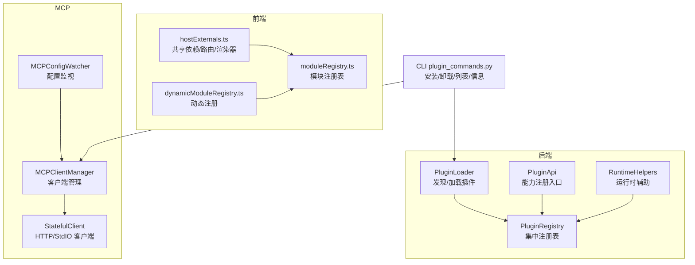
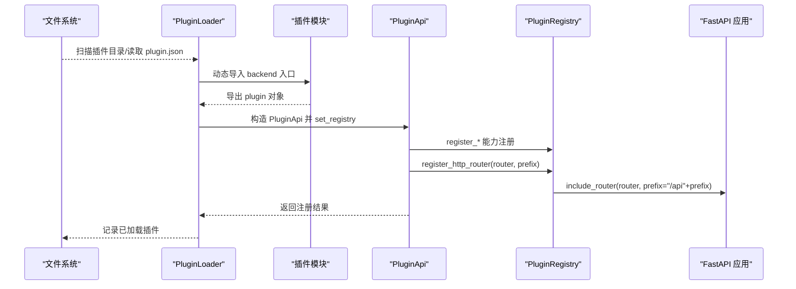
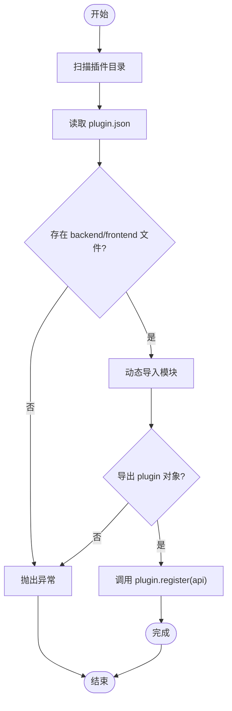
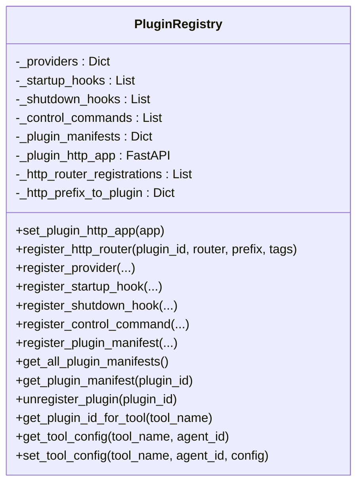
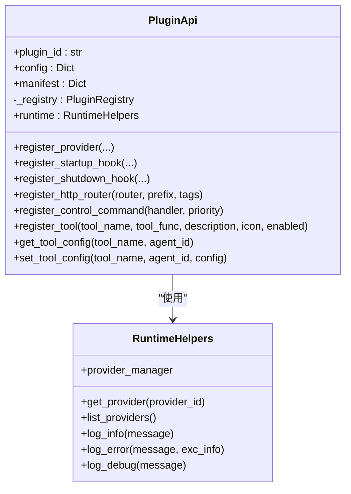
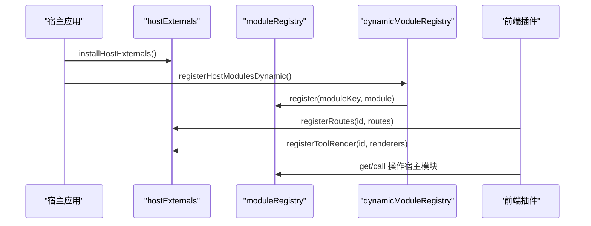
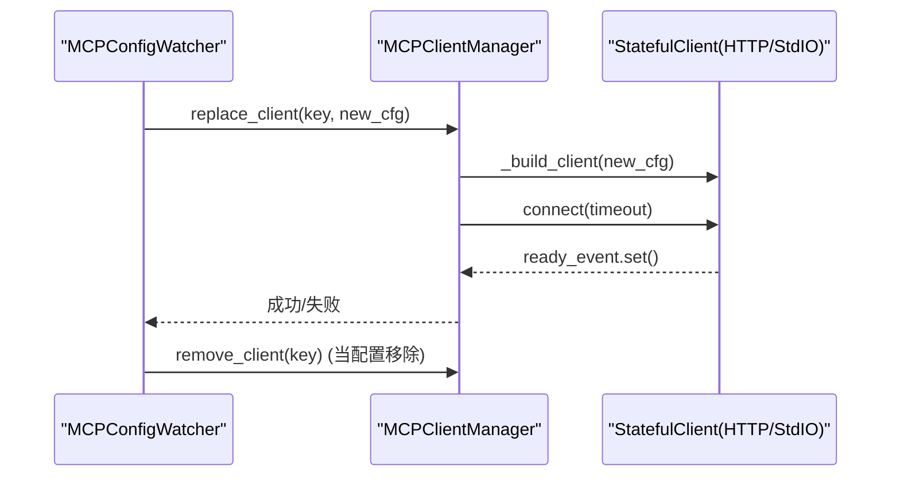
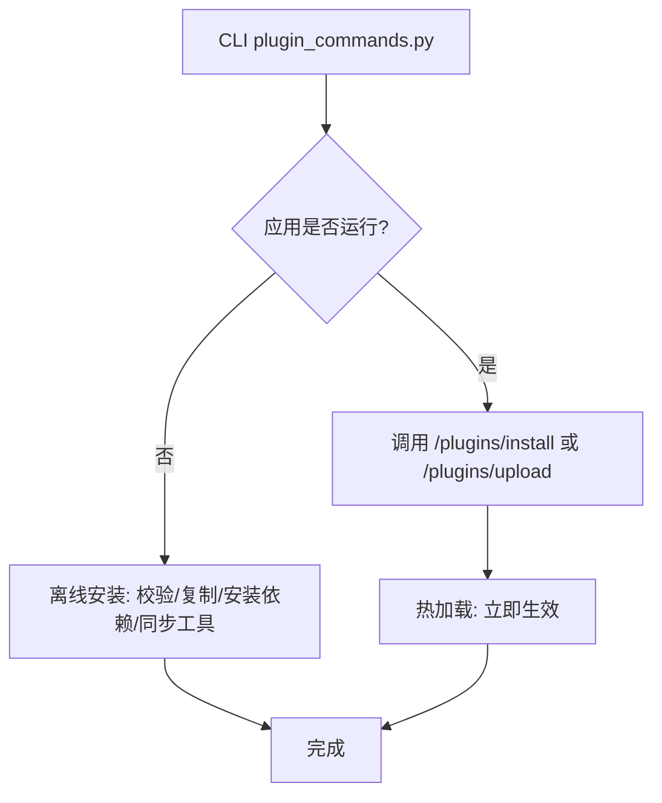
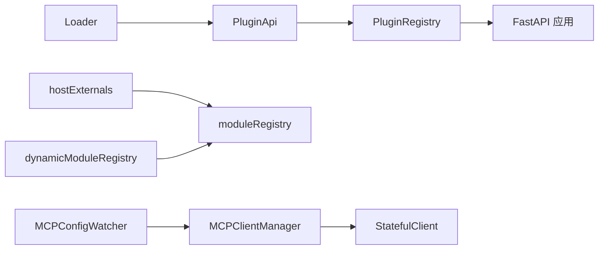

# 插件系统

<cite>
**本文引用的文件**
- [src/qwenpaw/plugins/__init__.py](file://src/qwenpaw/plugins/__init__.py)
- [src/qwenpaw/plugins/architecture.py](file://src/qwenpaw/plugins/architecture.py)
- [src/qwenpaw/plugins/loader.py](file://src/qwenpaw/plugins/loader.py)
- [src/qwenpaw/plugins/registry.py](file://src/qwenpaw/plugins/registry.py)
- [src/qwenpaw/plugins/api.py](file://src/qwenpaw/plugins/api.py)
- [src/qwenpaw/plugins/runtime.py](file://src/qwenpaw/plugins/runtime.py)
- [console/src/plugins/moduleRegistry.ts](file://console/src/plugins/moduleRegistry.ts)
- [console/src/plugins/dynamicModuleRegistry.ts](file://console/src/plugins/dynamicModuleRegistry.ts)
- [console/src/plugins/hostExternals.ts](file://console/src/plugins/hostExternals.ts)
- [src/qwenpaw/app/mcp/manager.py](file://src/qwenpaw/app/mcp/manager.py)
- [src/qwenpaw/app/mcp/stateful_client.py](file://src/qwenpaw/app/mcp/stateful_client.py)
- [src/qwenpaw/app/mcp/watcher.py](file://src/qwenpaw/app/mcp/watcher.py)
- [src/qwenpaw/cli/plugin_commands.py](file://src/qwenpaw/cli/plugin_commands.py)
- [plugins/tool/gpt-image2/plugin.json](file://plugins/tool/gpt-image2/plugin.json)
- [plugins/tool/gpt-image2/gpt_image2.py](file://plugins/tool/gpt-image2/gpt_image2.py)
- [website/public/docs/plugins.en.md](file://website/public/docs/plugins.en.md)
</cite>

## 目录
1. [简介](#简介)
2. [项目结构](#项目结构)
3. [核心组件](#核心组件)
4. [架构总览](#架构总览)
5. [详细组件分析](#详细组件分析)
6. [依赖关系分析](#依赖关系分析)
7. [性能考量](#性能考量)
8. [故障排查指南](#故障排查指南)
9. [结论](#结论)
10. [附录](#附录)

## 简介
本文件面向开发者与运维人员，系统化阐述 QwenPaw 的插件系统：从架构设计、动态加载机制、API 暴露方式，到插件开发框架（模板、规范、调试与测试）、MCP 协议支持、插件注册表管理与生命周期控制，再到插件市场与安装管理、版本兼容策略与安全考虑。文档同时提供可直接落地的开发步骤、示例与最佳实践。

## 项目结构
QwenPaw 插件系统由“后端插件框架 + 前端插件框架 + MCP 支持 + CLI 安装管理”四部分组成：
- 后端插件：通过 Manifest 驱动发现与加载，动态导入后端入口模块，调用插件的 register 方法完成能力注册（提供者、钩子、HTTP 路由、控制命令、工具等）。
- 前端插件：通过 window.QwenPaw.host 暴露共享依赖，提供路由注册与工具渲染器注册；模块注册表支持对宿主内部模块进行行为扩展。
- MCP：提供热重载的客户端生命周期管理，支持 HTTP/SSE 与 StdIO 两种传输，配置变更自动检测并替换连接。
- CLI：提供离线/在线安装、卸载、列表、信息查看等能力，支持本地目录、URL 与 ZIP 包安装。

图示来源
- [src/qwenpaw/plugins/loader.py:23-628](file://src/qwenpaw/plugins/loader.py#L23-L628)
- [src/qwenpaw/plugins/registry.py:95-598](file://src/qwenpaw/plugins/registry.py#L95-L598)
- [src/qwenpaw/plugins/api.py:48-401](file://src/qwenpaw/plugins/api.py#L48-L401)
- [src/qwenpaw/plugins/runtime.py:10-68](file://src/qwenpaw/plugins/runtime.py#L10-L68)
- [console/src/plugins/hostExternals.ts:57-192](file://console/src/plugins/hostExternals.ts#L57-L192)
- [console/src/plugins/moduleRegistry.ts:39-138](file://console/src/plugins/moduleRegistry.ts#L39-L138)
- [console/src/plugins/dynamicModuleRegistry.ts:22-117](file://console/src/plugins/dynamicModuleRegistry.ts#L22-L117)
- [src/qwenpaw/app/mcp/manager.py:23-287](file://src/qwenpaw/app/mcp/manager.py#L23-L287)
- [src/qwenpaw/app/mcp/watcher.py:24-332](file://src/qwenpaw/app/mcp/watcher.py#L24-L332)
- [src/qwenpaw/app/mcp/stateful_client.py:127-710](file://src/qwenpaw/app/mcp/stateful_client.py#L127-L710)
- [src/qwenpaw/cli/plugin_commands.py:495-919](file://src/qwenpaw/cli/plugin_commands.py#L495-L919)

章节来源
- [src/qwenpaw/plugins/__init__.py:1-17](file://src/qwenpaw/plugins/__init__.py#L1-L17)
- [src/qwenpaw/plugins/architecture.py:10-142](file://src/qwenpaw/plugins/architecture.py#L10-L142)
- [src/qwenpaw/plugins/loader.py:23-628](file://src/qwenpaw/plugins/loader.py#L23-L628)
- [src/qwenpaw/plugins/registry.py:95-598](file://src/qwenpaw/plugins/registry.py#L95-L598)
- [src/qwenpaw/plugins/api.py:48-401](file://src/qwenpaw/plugins/api.py#L48-L401)
- [src/qwenpaw/plugins/runtime.py:10-68](file://src/qwenpaw/plugins/runtime.py#L10-L68)
- [console/src/plugins/hostExternals.ts:57-192](file://console/src/plugins/hostExternals.ts#L57-L192)
- [console/src/plugins/moduleRegistry.ts:39-138](file://console/src/plugins/moduleRegistry.ts#L39-L138)
- [console/src/plugins/dynamicModuleRegistry.ts:22-117](file://console/src/plugins/dynamicModuleRegistry.ts#L22-L117)
- [src/qwenpaw/app/mcp/manager.py:23-287](file://src/qwenpaw/app/mcp/manager.py#L23-L287)
- [src/qwenpaw/app/mcp/watcher.py:24-332](file://src/qwenpaw/app/mcp/watcher.py#L24-L332)
- [src/qwenpaw/app/mcp/stateful_client.py:127-710](file://src/qwenpaw/app/mcp/stateful_client.py#L127-L710)
- [src/qwenpaw/cli/plugin_commands.py:495-919](file://src/qwenpaw/cli/plugin_commands.py#L495-L919)

## 核心组件
- 插件类型与清单
  - 类型枚举：tool、provider、hook、command、frontend、general。
  - 清单字段：id、name、version、description、author、entry、dependencies、min_version、meta、plugin_type。
  - 兼容性：支持从 meta 推断类型，保证旧清单可用。
- 加载器
  - 发现：扫描插件目录，读取 plugin.json 构造清单。
  - 动态导入：按清单 entry.backend 或 entry.frontend 导入模块，要求导出 plugin 对象或类，包含 register(api) 方法。
  - 依赖安装：优先使用当前 Python -m pip，若缺失则尝试 uv pip install。
  - 生命周期：支持卸载时清理模块、注销注册表、移除工具。
- 注册表
  - 提供者注册：provider_id 唯一性校验，合并元数据。
  - 钩子注册：启动/关闭钩子，带优先级排序。
  - HTTP 路由注册：挂载 APIRouter 到 /api 前缀，确保在 SPA catch-all 前插入，避免覆盖。
  - 控制命令注册：注册 /slash 命令处理器。
  - 工具配置：读取/保存 agent 的工具配置。
- 插件 API
  - 能力注册：register_provider、register_startup_hook、register_shutdown_hook、register_http_router、register_control_command、register_tool。
  - 运行时访问：runtime 提供 provider 管理器访问与日志。
  - 工具配置：get/set 工具配置。
- 前端插件框架
  - hostExternals：在 window.QwenPaw.host 暴露 React、antd、API 辅助函数；提供 registerRoutes/registerToolRender。
  - moduleRegistry：模块注册表，支持获取/调用/替换宿主内部模块导出。
  - dynamicModuleRegistry：基于 Vite import.meta.glob 自动发现 pages 下模块。
- MCP 支持
  - 客户端管理：MCPClientManager 统一管理客户端生命周期，支持热替换与关闭。
  - 配置监视：MCPConfigWatcher 周期轮询配置变化，触发替换或移除。
  - 客户端实现：HTTP/SSE 与 StdIO 两种传输，解决跨任务生命周期问题，避免 CPU 泄漏与僵尸进程。
- CLI 插件管理
  - 在线/离线安装：支持本地路径、URL、ZIP 包；在线通过 API 实现热加载。
  - 卸载/列表/信息：提供插件全生命周期管理。

章节来源
- [src/qwenpaw/plugins/architecture.py:10-142](file://src/qwenpaw/plugins/architecture.py#L10-L142)
- [src/qwenpaw/plugins/loader.py:23-628](file://src/qwenpaw/plugins/loader.py#L23-L628)
- [src/qwenpaw/plugins/registry.py:95-598](file://src/qwenpaw/plugins/registry.py#L95-L598)
- [src/qwenpaw/plugins/api.py:48-401](file://src/qwenpaw/plugins/api.py#L48-L401)
- [console/src/plugins/hostExternals.ts:57-192](file://console/src/plugins/hostExternals.ts#L57-L192)
- [console/src/plugins/moduleRegistry.ts:39-138](file://console/src/plugins/moduleRegistry.ts#L39-L138)
- [console/src/plugins/dynamicModuleRegistry.ts:22-117](file://console/src/plugins/dynamicModuleRegistry.ts#L22-L117)
- [src/qwenpaw/app/mcp/manager.py:23-287](file://src/qwenpaw/app/mcp/manager.py#L23-L287)
- [src/qwenpaw/app/mcp/watcher.py:24-332](file://src/qwenpaw/app/mcp/watcher.py#L24-L332)
- [src/qwenpaw/app/mcp/stateful_client.py:127-710](file://src/qwenpaw/app/mcp/stateful_client.py#L127-L710)
- [src/qwenpaw/cli/plugin_commands.py:495-919](file://src/qwenpaw/cli/plugin_commands.py#L495-L919)

## 架构总览
下图展示后端插件系统的核心交互：Loader 发现并加载插件，调用 register(api)，PluginApi 将能力注册到 PluginRegistry，HTTP 路由挂载到 FastAPI 应用，工具注册通过启动钩子延迟到应用上下文就绪后执行。

图示来源
- [src/qwenpaw/plugins/loader.py:88-238](file://src/qwenpaw/plugins/loader.py#L88-L238)
- [src/qwenpaw/plugins/api.py:191-243](file://src/qwenpaw/plugins/api.py#L191-L243)
- [src/qwenpaw/plugins/registry.py:141-214](file://src/qwenpaw/plugins/registry.py#L141-L214)

## 详细组件分析

### 后端插件加载与生命周期
- 发现与加载
  - 遍历插件目录，读取 plugin.json，构造 PluginManifest。
  - 若声明了 backend 或 frontend，检查入口文件是否存在；不存在则抛出异常。
  - 使用 importlib.spec_from_file_location 动态导入，设置 __package__/__path__ 支持相对导入。
  - 要求模块导出 plugin 对象，且包含 register(api) 方法。
- 依赖安装
  - 优先使用当前 Python -m pip 安装 requirements.txt；若提示缺少 pip，则尝试 uv pip install。
  - 超时控制与错误回退，失败时删除目标目录并抛出异常。
- 卸载流程
  - 执行注册的关闭钩子；从 sys.modules 移除插件及其子模块；清理注册表；移除 agents.tools 中的工具；可选删除磁盘文件。

图示来源
- [src/qwenpaw/plugins/loader.py:36-238](file://src/qwenpaw/plugins/loader.py#L36-L238)

章节来源
- [src/qwenpaw/plugins/loader.py:23-628](file://src/qwenpaw/plugins/loader.py#L23-L628)

### 插件注册表与 HTTP 路由挂载
- 注册表职责
  - 提供者：唯一性校验，合并元数据，记录标签、基础 URL、附加信息。
  - 钩子：按优先级排序，分别维护启动/关闭钩子。
  - HTTP 路由：在 FastAPI 应用中 include_router，并将路由插入到 SPA catch-all 之前，确保不被覆盖。
  - 控制命令：注册 /slash 命令处理器。
  - 工具配置：读取/保存 agent 的工具配置。
- 路由挂载细节
  - 校验前缀合法性（必须以 / 开头，不可仅为 /；末尾去除多余斜杠）。
  - 前缀冲突检测，重复注册报错。
  - 挂载后清空 OpenAPI 缓存，以便下次请求生成最新 schema。

图示来源
- [src/qwenpaw/plugins/registry.py:95-598](file://src/qwenpaw/plugins/registry.py#L95-L598)

章节来源
- [src/qwenpaw/plugins/registry.py:95-598](file://src/qwenpaw/plugins/registry.py#L95-L598)

### 插件 API 设计与工具注册
- 能力注册
  - register_provider：注册自定义 LLM Provider。
  - register_startup_hook/register_shutdown_hook：注册启动/关闭钩子，支持优先级。
  - register_http_router：挂载 APIRouter 到 /api 前缀。
  - register_control_command：注册 /slash 命令处理器。
  - register_tool：注册工具函数到 agents.tools，自动写入 agent 的工具配置（默认禁用，用户可启用）。
- 工具配置
  - get_tool_config：从当前 agent 的配置中读取工具配置。
  - set_tool_config：保存工具配置到 agent 配置。

图示来源
- [src/qwenpaw/plugins/api.py:48-401](file://src/qwenpaw/plugins/api.py#L48-L401)
- [src/qwenpaw/plugins/runtime.py:10-68](file://src/qwenpaw/plugins/runtime.py#L10-L68)

章节来源
- [src/qwenpaw/plugins/api.py:48-401](file://src/qwenpaw/plugins/api.py#L48-L401)
- [src/qwenpaw/plugins/runtime.py:10-68](file://src/qwenpaw/plugins/runtime.py#L10-L68)

### 前端插件框架与模块注册
- hostExternals
  - 在 window.QwenPaw.host 暴露 React、antd、API 辅助函数。
  - 提供 registerRoutes 与 registerToolRender，用于注册页面路由与工具渲染器。
- moduleRegistry
  - 提供 register/get/call/keys/getModule 等接口，安全复制模块导出，避免 ES Module 特殊属性影响。
  - 通过 Proxy 暴露 window.QwenPaw.modules，确保插件始终获取最新模块状态。
- dynamicModuleRegistry
  - 使用 import.meta.glob 动态发现 src/pages 下模块，排除测试文件，懒加载注册。

图示来源
- [console/src/plugins/hostExternals.ts:152-192](file://console/src/plugins/hostExternals.ts#L152-L192)
- [console/src/plugins/moduleRegistry.ts:39-138](file://console/src/plugins/moduleRegistry.ts#L39-L138)
- [console/src/plugins/dynamicModuleRegistry.ts:22-117](file://console/src/plugins/dynamicModuleRegistry.ts#L22-L117)

章节来源
- [console/src/plugins/hostExternals.ts:57-192](file://console/src/plugins/hostExternals.ts#L57-L192)
- [console/src/plugins/moduleRegistry.ts:39-138](file://console/src/plugins/moduleRegistry.ts#L39-L138)
- [console/src/plugins/dynamicModuleRegistry.ts:22-117](file://console/src/plugins/dynamicModuleRegistry.ts#L22-L117)

### MCP 协议支持与热重载
- 客户端管理
  - MCPClientManager：统一管理客户端生命周期，支持初始化、替换、移除、关闭。
  - 替换流程：在锁外连接新客户端 → 锁内原子交换 → 锁外关闭旧客户端，避免阻塞查询。
- 配置监视
  - MCPConfigWatcher：周期轮询配置文件或内存配置，计算哈希判断变更，触发替换或移除。
  - 失败重试保护：跟踪每个客户端失败次数与配置哈希，超过阈值停止自动重试。
- 客户端实现
  - StatefulClientMixin：统一工具调用、生命周期与传输错误处理。
  - HTTP/SSE：streamable_http_client 与 sse_client；StdIO：stdio_client。
  - 解决跨任务生命周期问题：在单一后台任务中运行整个生命周期，避免 anyio CancelScope 跨任务退出导致的泄漏。

图示来源
- [src/qwenpaw/app/mcp/watcher.py:140-332](file://src/qwenpaw/app/mcp/watcher.py#L140-L332)
- [src/qwenpaw/app/mcp/manager.py:90-152](file://src/qwenpaw/app/mcp/manager.py#L90-L152)
- [src/qwenpaw/app/mcp/stateful_client.py:181-430](file://src/qwenpaw/app/mcp/stateful_client.py#L181-L430)

章节来源
- [src/qwenpaw/app/mcp/manager.py:23-287](file://src/qwenpaw/app/mcp/manager.py#L23-L287)
- [src/qwenpaw/app/mcp/stateful_client.py:127-710](file://src/qwenpaw/app/mcp/stateful_client.py#L127-L710)
- [src/qwenpaw/app/mcp/watcher.py:24-332](file://src/qwenpaw/app/mcp/watcher.py#L24-L332)

### CLI 插件管理
- 在线安装
  - 通过 API /plugins/install 或 /plugins/upload，支持本地目录与 ZIP 包；URL 直接传递给 API。
  - 热加载：无需重启即可生效。
- 离线安装
  - 校验 plugin.json 结构与后端入口；复制到插件目录；安装依赖；同步工具到所有 agent。
- 卸载/列表/信息
  - 卸载：删除目录并清理 agent 配置中的工具项。
  - 列表：遍历插件目录读取 plugin.json。
  - 信息：读取指定插件目录的 plugin.json 并输出详情。

图示来源
- [src/qwenpaw/cli/plugin_commands.py:500-670](file://src/qwenpaw/cli/plugin_commands.py#L500-L670)

章节来源
- [src/qwenpaw/cli/plugin_commands.py:495-919](file://src/qwenpaw/cli/plugin_commands.py#L495-L919)

## 依赖关系分析
- 后端插件系统内部耦合度低，Loader 仅负责发现与导入，能力注册集中在 PluginApi 与 PluginRegistry。
- 前端插件通过 window.QwenPaw.host 与 moduleRegistry 与宿主解耦，避免打包 React/antd。
- MCP 子系统独立于主应用，通过 ConfigWatcher 与 Manager 解耦，便于替换与扩展。

图示来源
- [src/qwenpaw/plugins/loader.py:23-628](file://src/qwenpaw/plugins/loader.py#L23-L628)
- [src/qwenpaw/plugins/api.py:48-401](file://src/qwenpaw/plugins/api.py#L48-L401)
- [src/qwenpaw/plugins/registry.py:95-598](file://src/qwenpaw/plugins/registry.py#L95-L598)
- [console/src/plugins/hostExternals.ts:152-192](file://console/src/plugins/hostExternals.ts#L152-L192)
- [console/src/plugins/moduleRegistry.ts:39-138](file://console/src/plugins/moduleRegistry.ts#L39-L138)
- [console/src/plugins/dynamicModuleRegistry.ts:22-117](file://console/src/plugins/dynamicModuleRegistry.ts#L22-L117)
- [src/qwenpaw/app/mcp/watcher.py:24-332](file://src/qwenpaw/app/mcp/watcher.py#L24-L332)
- [src/qwenpaw/app/mcp/manager.py:23-287](file://src/qwenpaw/app/mcp/manager.py#L23-L287)
- [src/qwenpaw/app/mcp/stateful_client.py:127-710](file://src/qwenpaw/app/mcp/stateful_client.py#L127-L710)

章节来源
- [src/qwenpaw/plugins/loader.py:23-628](file://src/qwenpaw/plugins/loader.py#L23-L628)
- [src/qwenpaw/plugins/registry.py:95-598](file://src/qwenpaw/plugins/registry.py#L95-L598)
- [console/src/plugins/hostExternals.ts:57-192](file://console/src/plugins/hostExternals.ts#L57-L192)
- [console/src/plugins/moduleRegistry.ts:39-138](file://console/src/plugins/moduleRegistry.ts#L39-L138)
- [console/src/plugins/dynamicModuleRegistry.ts:22-117](file://console/src/plugins/dynamicModuleRegistry.ts#L22-L117)
- [src/qwenpaw/app/mcp/manager.py:23-287](file://src/qwenpaw/app/mcp/manager.py#L23-L287)
- [src/qwenpaw/app/mcp/watcher.py:24-332](file://src/qwenpaw/app/mcp/watcher.py#L24-L332)
- [src/qwenpaw/app/mcp/stateful_client.py:127-710](file://src/qwenpaw/app/mcp/stateful_client.py#L127-L710)

## 性能考量
- 异步与事件驱动
  - 插件加载与依赖安装通过 asyncio.to_thread 非阻塞执行，避免阻塞事件循环。
  - MCP 客户端生命周期在单一后台任务中运行，避免跨任务取消导致的资源泄漏。
- 路由挂载优化
  - 通过在 SPA catch-all 前插入路由，减少路由匹配开销与覆盖风险。
- 模块注册表
  - 动态发现采用 import.meta.glob 懒加载，减少初始包体积与构建时间。
- 配置监视
  - 哈希快速比较与失败重试保护，避免频繁无效重连。

## 故障排查指南
- 插件未加载
  - 检查 plugin.json 是否存在、字段是否完整；确认 backend/entry 是否正确。
  - 查看日志中“Failed to load plugin”与“Failed to load manifest”相关错误。
- 依赖安装失败
  - 当前 Python 环境缺少 pip 时会尝试 uv；若仍失败，请手动安装 requirements.txt。
- HTTP 路由未生效
  - 检查 prefix 是否以 / 开头且非 “/”；确认未与其他插件冲突。
  - 观察 FastAPI OpenAPI schema 是否更新（挂载后会清空缓存）。
- 工具未出现在 UI
  - 确认工具已在 PluginApi.register_tool 中注册；默认禁用，需在 UI 中启用。
  - 检查 agent 的工具配置是否已写入。
- MCP 客户端无法连接
  - 检查配置文件权限与网络；关注 401 错误并进行 OAuth 授权。
  - 查看生命周期任务是否正常退出或卡住；必要时强制关闭并重新连接。
- 前端插件样式或功能异常
  - 确保使用 window.QwenPaw.host 暴露的 React/antd；避免重复打包。
  - 使用 moduleRegistry.get/call 获取宿主模块导出，避免直接访问内部结构。

章节来源
- [src/qwenpaw/plugins/loader.py:295-405](file://src/qwenpaw/plugins/loader.py#L295-L405)
- [src/qwenpaw/plugins/registry.py:141-214](file://src/qwenpaw/plugins/registry.py#L141-L214)
- [src/qwenpaw/app/mcp/stateful_client.py:251-335](file://src/qwenpaw/app/mcp/stateful_client.py#L251-L335)
- [console/src/plugins/hostExternals.ts:152-192](file://console/src/plugins/hostExternals.ts#L152-L192)

## 结论
QwenPaw 插件系统通过清晰的类型与清单、可靠的动态加载与依赖安装、完善的注册表与 API、以及前后端解耦的扩展点，提供了高可扩展性与易用性的平台。结合 MCP 的热重载能力与 CLI 的安装管理，开发者可以高效地构建、分发与维护插件生态。建议在开发过程中遵循本文档的规范与最佳实践，确保安全性、兼容性与可维护性。

## 附录

### 插件开发指南（后端）
- 目录结构
  - 至少包含 plugin.json 与 backend 入口文件（如 plugin.py）。
  - 可选 README.md、requirements.txt。
- plugin.json 字段
  - id、name、version、description、author、entry、dependencies、min_version、meta、type。
  - type 可省略，系统会根据 meta 与 entry 推断。
- 后端入口
  - 导出 plugin 对象，包含 register(api) 方法。
  - 在 register 中调用 api.register_* 完成能力注册。
- 示例参考
  - 工具插件示例：gpt-image2，包含两个工具函数与对应的配置字段。

章节来源
- [plugins/tool/gpt-image2/plugin.json:1-89](file://plugins/tool/gpt-image2/plugin.json#L1-L89)
- [plugins/tool/gpt-image2/gpt_image2.py:27-64](file://plugins/tool/gpt-image2/gpt_image2.py#L27-L64)
- [website/public/docs/plugins.en.md:71-138](file://website/public/docs/plugins.en.md#L71-L138)

### 插件开发指南（前端）
- 目录结构
  - plugin.json + src/index.tsx + package.json + tsconfig.json + vite.config.ts。
- 前端入口
  - 通过 window.QwenPaw.host 获取共享依赖；使用 registerRoutes/registerToolRender 注册页面与渲染器。
  - 使用 window.QwenPaw.modules 访问与修改宿主内部模块导出。
- 构建与安装
  - 使用 classic JSX 与外部化 React/ReactDOM；构建产物复制到 ~/.qwenpaw/plugins/<plugin-id>/。
- 示例参考
  - 前端页面插件与工具渲染器示例。

章节来源
- [website/public/docs/plugins.en.md:139-262](file://website/public/docs/plugins.en.md#L139-L262)

### 插件市场与安装管理
- 在线安装
  - 支持本地目录、URL 与 ZIP 包；通过 API 实现热加载。
- 离线安装
  - 校验清单与入口；复制到插件目录；安装依赖；同步工具到所有 agent。
- 卸载/列表/信息
  - 卸载时清理 agent 配置中的工具项；列出与显示插件详情。

章节来源
- [src/qwenpaw/cli/plugin_commands.py:500-800](file://src/qwenpaw/cli/plugin_commands.py#L500-L800)

### 版本兼容性与安全考虑
- 版本兼容
  - 通过 min_version 字段约束最低版本；插件类型可从 meta 推断，保证旧清单兼容。
- 安全
  - 依赖安装优先使用当前 Python 环境；若缺失 pip，尝试 uv；失败时提示手动安装。
  - ZIP 包下载与解压进行 Zip Slip 防护。
  - 前端插件禁止打包 React/antd，统一从 hostExternals 获取。
  - 工具配置保存在 agent 配置中，避免硬编码敏感信息。

章节来源
- [src/qwenpaw/plugins/architecture.py:65-130](file://src/qwenpaw/plugins/architecture.py#L65-L130)
- [src/qwenpaw/cli/plugin_commands.py:316-335](file://src/qwenpaw/cli/plugin_commands.py#L316-L335)
- [console/src/plugins/hostExternals.ts:23-32](file://console/src/plugins/hostExternals.ts#L23-L32)