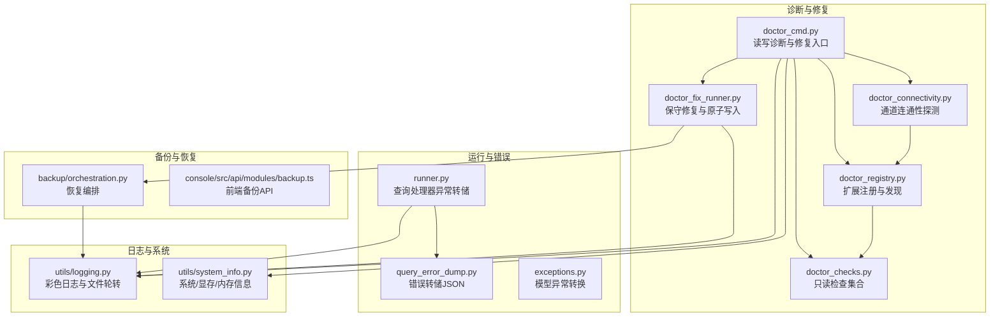
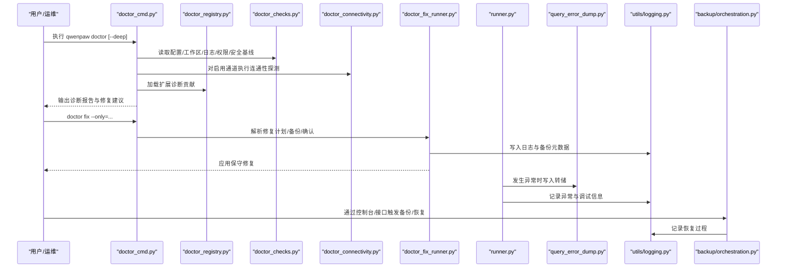
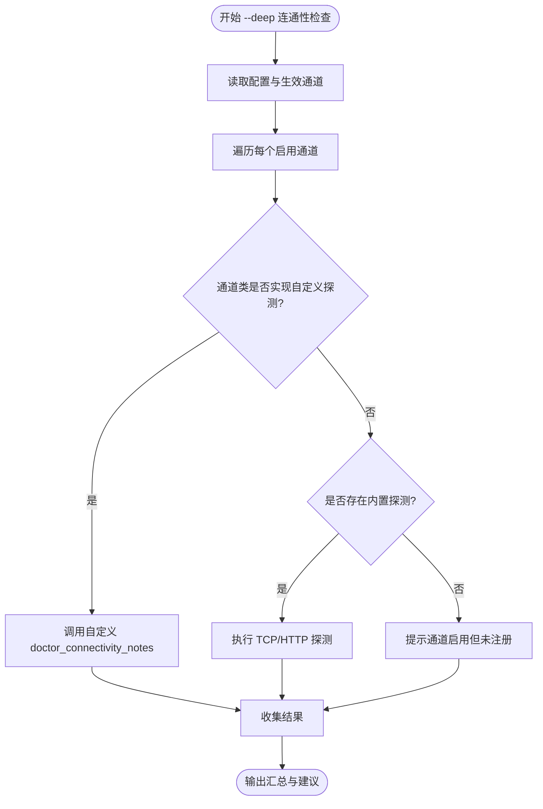
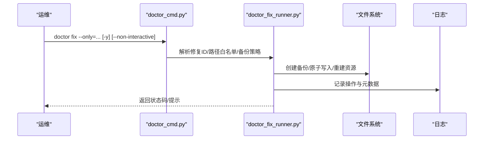
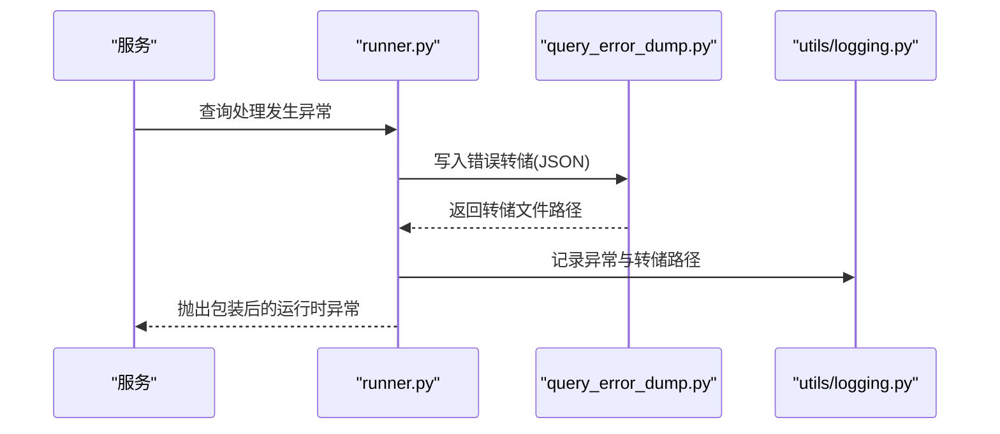
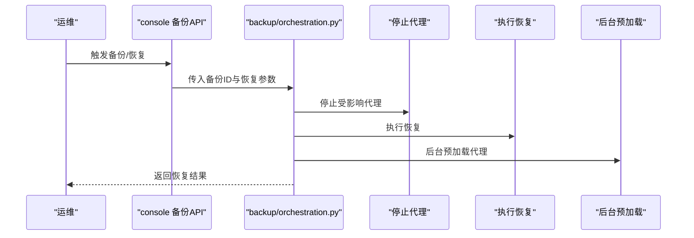
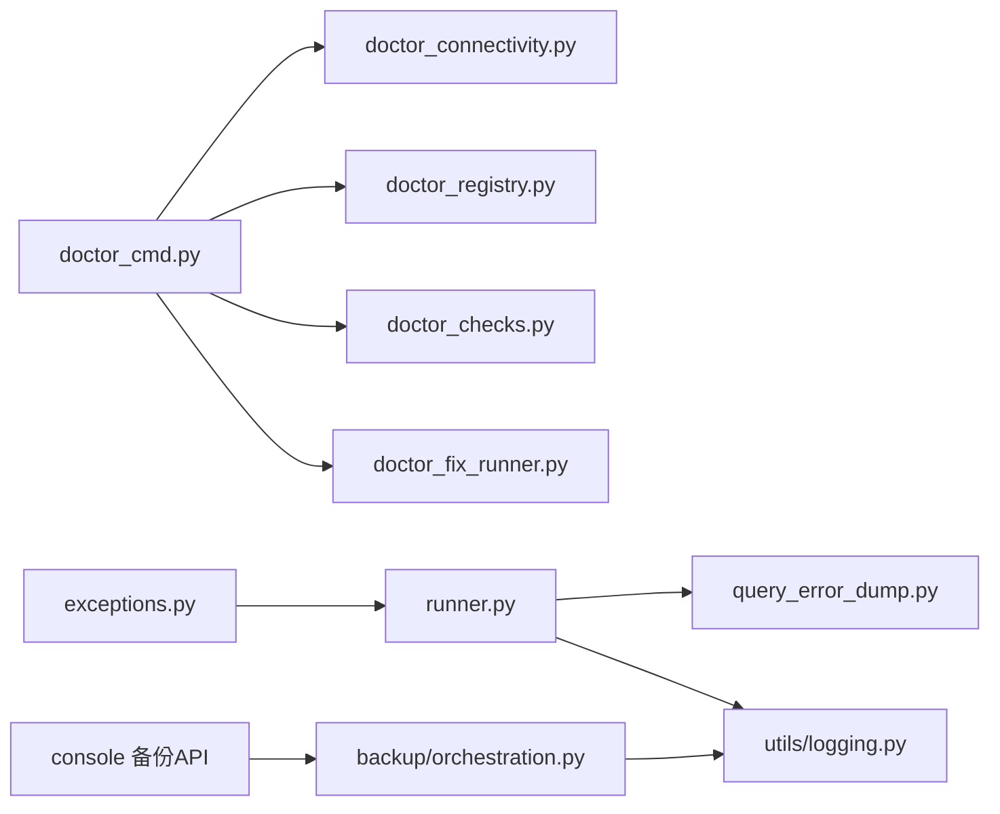

# 故障排除

<cite>
**本文引用的文件**
- [src/qwenpaw/cli/doctor_cmd.py](file://src/qwenpaw/cli/doctor_cmd.py)
- [src/qwenpaw/cli/doctor_connectivity.py](file://src/qwenpaw/cli/doctor_connectivity.py)
- [src/qwenpaw/cli/doctor_fix_runner.py](file://src/qwenpaw/cli/doctor_fix_runner.py)
- [src/qwenpaw/cli/doctor_registry.py](file://src/qwenpaw/cli/doctor_registry.py)
- [src/qwenpaw/cli/doctor_checks.py](file://src/qwenpaw/cli/doctor_checks.py)
- [src/qwenpaw/app/runner/query_error_dump.py](file://src/qwenpaw/app/runner/query_error_dump.py)
- [src/qwenpaw/app/runner/runner.py](file://src/qwenpaw/app/runner/runner.py)
- [src/qwenpaw/utils/logging.py](file://src/qwenpaw/utils/logging.py)
- [src/qwenpaw/utils/system_info.py](file://src/qwenpaw/utils/system_info.py)
- [src/qwenpaw/exceptions.py](file://src/qwenpaw/exceptions.py)
- [src/qwenpaw/backup/orchestration.py](file://src/qwenpaw/backup/orchestration.py)
- [src/qwenpaw/backup/_ops/storage.py](file://src/qwenpaw/backup/_ops/storage.py)
- [src/qwenpaw/backup/_ops/create.py](file://src/qwenpaw/backup/_ops/create.py)
- [src/qwenpaw/backup/_ops/restore.py](file://src/qwenpaw/backup/_ops/restore.py)
- [src/qwenpaw/backup/_utils/meta.py](file://src/qwenpaw/backup/_utils/meta.py)
- [src/qwenpaw/backup/_utils/constants.py](file://src/qwenpaw/backup/_utils/constants.py)
- [src/qwenpaw/backup/_utils/safe_swap.py](file://src/qwenpaw/backup/_utils/safe_swap.py)
- [src/qwenpaw/backup/_utils/_mount_swap.py](file://src/qwenpaw/backup/_utils/_mount_swap.py)
- [console/src/api/modules/backup.ts](file://console/src/api/modules/backup.ts)
- [console/src/api/modules/mcp.ts](file://console/src/api/modules/mcp.ts)
- [console/src/utils/error.ts](file://console/src/utils/error.ts)
- [scripts/startup_profile/tracer.py](file://scripts/startup_profile/tracer.py)
- [scripts/startup_profile/viewer.html](file://scripts/startup_profile/viewer.html)
- [SECURITY.md](file://SECURITY.md)
- [.github/ISSUE_TEMPLATE/config.yml](file://.github/ISSUE_TEMPLATE/config.yml)
</cite>

## 目录
1. [简介](#简介)
2. [项目结构](#项目结构)
3. [核心组件](#核心组件)
4. [架构总览](#架构总览)
5. [详细组件分析](#详细组件分析)
6. [依赖关系分析](#依赖关系分析)
7. [性能考量](#性能考量)
8. [故障排除指南](#故障排除指南)
9. [结论](#结论)
10. [附录](#附录)

## 简介
本指南面向运维与技术支持人员，系统化梳理 QwenPaw 在运行期可能出现的网络连接、权限配置、性能瓶颈、依赖冲突、配置错误等问题，并提供可操作的诊断流程、工具使用方法、日志分析技巧与恢复方案。同时给出紧急处理流程、系统恢复与数据修复方法，以及社区支持渠道与问题反馈路径。

## 项目结构
围绕故障排除的关键代码分布在 CLI 诊断工具、应用运行器、备份与恢复、日志与系统信息采集、前端错误解析与 API 调用等模块中。下图展示与故障排除直接相关的子系统与交互：

**图表来源**
- [src/qwenpaw/cli/doctor_cmd.py:377-800](file://src/qwenpaw/cli/doctor_cmd.py#L377-L800)
- [src/qwenpaw/cli/doctor_connectivity.py:248-331](file://src/qwenpaw/cli/doctor_connectivity.py#L248-L331)
- [src/qwenpaw/cli/doctor_registry.py:102-126](file://src/qwenpaw/cli/doctor_registry.py#L102-L126)
- [src/qwenpaw/cli/doctor_checks.py:90-184](file://src/qwenpaw/cli/doctor_checks.py#L90-L184)
- [src/qwenpaw/cli/doctor_fix_runner.py:687-848](file://src/qwenpaw/cli/doctor_fix_runner.py#L687-L848)
- [src/qwenpaw/app/runner/runner.py:801-835](file://src/qwenpaw/app/runner/runner.py#L801-L835)
- [src/qwenpaw/app/runner/query_error_dump.py:48-105](file://src/qwenpaw/app/runner/query_error_dump.py#L48-L105)
- [src/qwenpaw/utils/logging.py:154-226](file://src/qwenpaw/utils/logging.py#L154-L226)
- [src/qwenpaw/utils/system_info.py:135-144](file://src/qwenpaw/utils/system_info.py#L135-L144)
- [src/qwenpaw/backup/orchestration.py:44-147](file://src/qwenpaw/backup/orchestration.py#L44-L147)
- [console/src/api/modules/backup.ts:1-39](file://console/src/api/modules/backup.ts#L1-L39)

**章节来源**
- [src/qwenpaw/cli/doctor_cmd.py:377-800](file://src/qwenpaw/cli/doctor_cmd.py#L377-L800)
- [src/qwenpaw/cli/doctor_connectivity.py:248-331](file://src/qwenpaw/cli/doctor_connectivity.py#L248-L331)
- [src/qwenpaw/cli/doctor_registry.py:102-126](file://src/qwenpaw/cli/doctor_registry.py#L102-L126)
- [src/qwenpaw/cli/doctor_checks.py:90-184](file://src/qwenpaw/cli/doctor_checks.py#L90-L184)
- [src/qwenpaw/cli/doctor_fix_runner.py:687-848](file://src/qwenpaw/cli/doctor_fix_runner.py#L687-L848)
- [src/qwenpaw/app/runner/runner.py:801-835](file://src/qwenpaw/app/runner/runner.py#L801-L835)
- [src/qwenpaw/app/runner/query_error_dump.py:48-105](file://src/qwenpaw/app/runner/query_error_dump.py#L48-L105)
- [src/qwenpaw/utils/logging.py:154-226](file://src/qwenpaw/utils/logging.py#L154-L226)
- [src/qwenpaw/utils/system_info.py:135-144](file://src/qwenpaw/utils/system_info.py#L135-L144)
- [src/qwenpaw/backup/orchestration.py:44-147](file://src/qwenpaw/backup/orchestration.py#L44-L147)
- [console/src/api/modules/backup.ts:1-39](file://console/src/api/modules/backup.ts#L1-L39)

## 核心组件
- 诊断命令与修复引擎
  - doctor_cmd：集中式读写诊断与修复入口，输出环境、配置、工作目录、日志、浏览器自动化、安全基线、内存嵌入、工作区整洁度、计划任务等检查项；支持 --deep 连通性探测与扩展贡献。
  - doctor_connectivity：内置通道连通性探测（TCP/HTTP），覆盖 MQTT、Mattermost、Matrix、Telegram、Discord、OneBot、飞书、钉钉、QQ、企业微信、Voice(Twilio)、小艺、微信等。
  - doctor_registry：支持插件以 entry-points 或手动注册的方式扩展诊断。
  - doctor_fix_runner：保守修复与原子写入，包含备份策略、路径白名单、只读校验、工作区技能清单同步、jobs.json 规范化、控制台静态资源重建等。
- 运行期错误与异常
  - runner：捕获查询处理器异常，生成调试转储并记录日志，附带会话状态与请求上下文。
  - query_error_dump：将异常堆栈、请求信息、代理状态等序列化到临时 JSON 文件，便于离线分析。
  - exceptions：将模型相关异常映射为统一的运行时异常，便于前端与日志识别。
- 日志与系统信息
  - logging：彩色终端输出、安全轮转文件处理器、访问日志过滤、命名空间隔离。
  - system_info：系统/架构/CUDA/内存/显存信息采集，辅助性能与硬件适配诊断。
- 备份与恢复
  - backup/orchestration：恢复编排，先停止受影响代理再恢复，最后后台预加载，保证服务自愈。
  - console 备份 API：流式备份/进度事件、列表/详情/导入导出等接口封装。

**章节来源**
- [src/qwenpaw/cli/doctor_cmd.py:377-800](file://src/qwenpaw/cli/doctor_cmd.py#L377-L800)
- [src/qwenpaw/cli/doctor_connectivity.py:248-331](file://src/qwenpaw/cli/doctor_connectivity.py#L248-L331)
- [src/qwenpaw/cli/doctor_registry.py:102-126](file://src/qwenpaw/cli/doctor_registry.py#L102-L126)
- [src/qwenpaw/cli/doctor_fix_runner.py:687-848](file://src/qwenpaw/cli/doctor_fix_runner.py#L687-L848)
- [src/qwenpaw/app/runner/runner.py:801-835](file://src/qwenpaw/app/runner/runner.py#L801-L835)
- [src/qwenpaw/app/runner/query_error_dump.py:48-105](file://src/qwenpaw/app/runner/query_error_dump.py#L48-L105)
- [src/qwenpaw/utils/logging.py:154-226](file://src/qwenpaw/utils/logging.py#L154-L226)
- [src/qwenpaw/utils/system_info.py:135-144](file://src/qwenpaw/utils/system_info.py#L135-L144)
- [src/qwenpaw/backup/orchestration.py:44-147](file://src/qwenpaw/backup/orchestration.py#L44-L147)
- [console/src/api/modules/backup.ts:1-39](file://console/src/api/modules/backup.ts#L1-L39)

## 架构总览
下图展示从 CLI 到后端服务、再到备份与恢复的整体链路，以及关键错误转储与日志落盘路径：

**图表来源**
- [src/qwenpaw/cli/doctor_cmd.py:377-800](file://src/qwenpaw/cli/doctor_cmd.py#L377-L800)
- [src/qwenpaw/cli/doctor_connectivity.py:248-331](file://src/qwenpaw/cli/doctor_connectivity.py#L248-L331)
- [src/qwenpaw/cli/doctor_registry.py:102-126](file://src/qwenpaw/cli/doctor_registry.py#L102-L126)
- [src/qwenpaw/cli/doctor_fix_runner.py:687-848](file://src/qwenpaw/cli/doctor_fix_runner.py#L687-L848)
- [src/qwenpaw/app/runner/runner.py:801-835](file://src/qwenpaw/app/runner/runner.py#L801-L835)
- [src/qwenpaw/app/runner/query_error_dump.py:48-105](file://src/qwenpaw/app/runner/query_error_dump.py#L48-L105)
- [src/qwenpaw/utils/logging.py:154-226](file://src/qwenpaw/utils/logging.py#L154-L226)
- [src/qwenpaw/backup/orchestration.py:44-147](file://src/qwenpaw/backup/orchestration.py#L44-L147)

## 详细组件分析

### 组件A：网络连通性探测（doctor_connectivity）
- 功能要点
  - 针对已启用通道逐一进行 TCP/HTTP 探测，内置覆盖主流 IM/语音通道。
  - 支持自定义通道类重载 doctor_connectivity_notes 提供更细粒度提示。
  - 对未知通道或未注册通道给出“启用但未注册”的提示，避免误判。
- 典型问题
  - 防火墙阻断、域名解析失败、证书错误、端口不可达、反向 WS 未启动。
- 诊断建议
  - 使用 --deep 选项进行深入探测；结合通道配置中的主机/端口/URL 字段逐项核对。
  - 若通道类提供自定义探测，优先参考其返回的提示。

**图表来源**
- [src/qwenpaw/cli/doctor_connectivity.py:248-331](file://src/qwenpaw/cli/doctor_connectivity.py#L248-L331)

**章节来源**
- [src/qwenpaw/cli/doctor_connectivity.py:248-331](file://src/qwenpaw/cli/doctor_connectivity.py#L248-L331)

### 组件B：诊断命令与修复（doctor_cmd / doctor_fix_runner）
- 功能要点
  - doctor_cmd：环境摘要、配置校验、工作区/日志/权限/浏览器/安全基线/内存嵌入/工作区整洁度/计划任务/通道连通性/--deep 扩展诊断。
  - doctor_fix_runner：安全修复集（创建工作目录/工作区目录）、只读校验（jobs.json）、技能清单同步、jobs.json 规范化、控制台静态资源重建、原子写入与备份。
- 修复策略
  - 严格路径白名单（仅允许在 WORKING_DIR 下写入）。
  - 采用原子写入（临时文件+替换）降低损坏风险。
  - 生成备份会话目录，包含元数据与受影响文件快照。
  - 非交互模式仅允许安全与只读修复，避免高风险变更。

**图表来源**
- [src/qwenpaw/cli/doctor_cmd.py:329-362](file://src/qwenpaw/cli/doctor_cmd.py#L329-L362)
- [src/qwenpaw/cli/doctor_fix_runner.py:687-848](file://src/qwenpaw/cli/doctor_fix_runner.py#L687-L848)

**章节来源**
- [src/qwenpaw/cli/doctor_cmd.py:329-362](file://src/qwenpaw/cli/doctor_cmd.py#L329-L362)
- [src/qwenpaw/cli/doctor_fix_runner.py:687-848](file://src/qwenpaw/cli/doctor_fix_runner.py#L687-L848)

### 组件C：运行期异常转储与日志（runner / query_error_dump / logging）
- 功能要点
  - runner 捕获查询处理器异常，生成调试转储文件路径并记录日志。
  - query_error_dump 将请求上下文、异常堆栈、代理状态等序列化到临时 JSON，便于离线分析。
  - logging 提供彩色终端输出、安全轮转文件处理器、访问日志过滤、命名空间隔离。
- 诊断建议
  - 出错时关注日志末尾的调试转储路径提示，打开该 JSON 文件定位请求与代理状态。
  - 结合 exceptions 中的模型异常映射，快速识别鉴权、配额、超时、上下文长度等问题类别。

**图表来源**
- [src/qwenpaw/app/runner/runner.py:801-835](file://src/qwenpaw/app/runner/runner.py#L801-L835)
- [src/qwenpaw/app/runner/query_error_dump.py:48-105](file://src/qwenpaw/app/runner/query_error_dump.py#L48-L105)
- [src/qwenpaw/utils/logging.py:154-226](file://src/qwenpaw/utils/logging.py#L154-L226)

**章节来源**
- [src/qwenpaw/app/runner/runner.py:801-835](file://src/qwenpaw/app/runner/runner.py#L801-L835)
- [src/qwenpaw/app/runner/query_error_dump.py:48-105](file://src/qwenpaw/app/runner/query_error_dump.py#L48-L105)
- [src/qwenpaw/utils/logging.py:154-226](file://src/qwenpaw/utils/logging.py#L154-L226)
- [src/qwenpaw/exceptions.py:165-254](file://src/qwenpaw/exceptions.py#L165-L254)

### 组件D：备份与恢复编排（backup/orchestration）
- 功能要点
  - 恢复前停止受影响代理，避免文件句柄占用导致目录重命名失败（尤其 Windows）。
  - 支持“全量恢复”与“自定义恢复”，前者完全替换当前实例，后者按模块/代理选择性恢复。
  - 恢复完成后后台预加载受影响代理，保证服务自愈。
- 适用场景
  - 配置/密钥/技能池/工作区损坏或丢失。
  - 升级迁移失败需要回滚。
  - 数据被意外覆盖或删除。

**图表来源**
- [src/qwenpaw/backup/orchestration.py:44-147](file://src/qwenpaw/backup/orchestration.py#L44-L147)
- [console/src/api/modules/backup.ts:1-39](file://console/src/api/modules/backup.ts#L1-L39)

**章节来源**
- [src/qwenpaw/backup/orchestration.py:44-147](file://src/qwenpaw/backup/orchestration.py#L44-L147)
- [console/src/api/modules/backup.ts:1-39](file://console/src/api/modules/backup.ts#L1-L39)

## 依赖关系分析
- 诊断与修复
  - doctor_cmd 依赖 doctor_connectivity、doctor_registry、doctor_checks、doctor_fix_runner。
  - doctor_registry 提供扩展点，doctor_checks 提供只读检查，doctor_fix_runner 提供保守修复。
- 运行期与日志
  - runner 依赖 query_error_dump 与 logging；exceptions 为模型异常提供统一映射。
- 备份与恢复
  - console 备份 API 与 backup/orchestration 协同，后者负责停机/恢复/重启的编排。

**图表来源**
- [src/qwenpaw/cli/doctor_cmd.py:377-800](file://src/qwenpaw/cli/doctor_cmd.py#L377-L800)
- [src/qwenpaw/cli/doctor_connectivity.py:248-331](file://src/qwenpaw/cli/doctor_connectivity.py#L248-L331)
- [src/qwenpaw/cli/doctor_registry.py:102-126](file://src/qwenpaw/cli/doctor_registry.py#L102-L126)
- [src/qwenpaw/cli/doctor_fix_runner.py:687-848](file://src/qwenpaw/cli/doctor_fix_runner.py#L687-L848)
- [src/qwenpaw/app/runner/runner.py:801-835](file://src/qwenpaw/app/runner/runner.py#L801-L835)
- [src/qwenpaw/app/runner/query_error_dump.py:48-105](file://src/qwenpaw/app/runner/query_error_dump.py#L48-L105)
- [src/qwenpaw/utils/logging.py:154-226](file://src/qwenpaw/utils/logging.py#L154-L226)
- [src/qwenpaw/exceptions.py:165-254](file://src/qwenpaw/exceptions.py#L165-L254)
- [console/src/api/modules/backup.ts:1-39](file://console/src/api/modules/backup.ts#L1-L39)
- [src/qwenpaw/backup/orchestration.py:44-147](file://src/qwenpaw/backup/orchestration.py#L44-L147)

**章节来源**
- [src/qwenpaw/cli/doctor_cmd.py:377-800](file://src/qwenpaw/cli/doctor_cmd.py#L377-L800)
- [src/qwenpaw/cli/doctor_connectivity.py:248-331](file://src/qwenpaw/cli/doctor_connectivity.py#L248-L331)
- [src/qwenpaw/cli/doctor_registry.py:102-126](file://src/qwenpaw/cli/doctor_registry.py#L102-L126)
- [src/qwenpaw/cli/doctor_fix_runner.py:687-848](file://src/qwenpaw/cli/doctor_fix_runner.py#L687-L848)
- [src/qwenpaw/app/runner/runner.py:801-835](file://src/qwenpaw/app/runner/runner.py#L801-L835)
- [src/qwenpaw/app/runner/query_error_dump.py:48-105](file://src/qwenpaw/app/runner/query_error_dump.py#L48-L105)
- [src/qwenpaw/utils/logging.py:154-226](file://src/qwenpaw/utils/logging.py#L154-L226)
- [src/qwenpaw/exceptions.py:165-254](file://src/qwenpaw/exceptions.py#L165-L254)
- [console/src/api/modules/backup.ts:1-39](file://console/src/api/modules/backup.ts#L1-L39)
- [src/qwenpaw/backup/orchestration.py:44-147](file://src/qwenpaw/backup/orchestration.py#L44-L147)

## 性能考量
- 启动性能剖析
  - 提供启动剖析脚本与可视化页面，可查看模块导入耗时、函数调用序列与性能等级，辅助定位启动慢点。
- 系统资源采集
  - system_info 提供 OS/架构/CUDA/内存/显存信息，用于判断本地模型运行环境是否满足要求。
- 日志轮转与 IO
  - logging 使用安全轮转文件处理器，避免 Windows 文件锁导致的旋转失败；同时提供访问日志过滤，减少噪声。

**章节来源**
- [scripts/startup_profile/tracer.py:82-108](file://scripts/startup_profile/tracer.py#L82-L108)
- [scripts/startup_profile/viewer.html:736-1112](file://scripts/startup_profile/viewer.html#L736-L1112)
- [src/qwenpaw/utils/system_info.py:135-144](file://src/qwenpaw/utils/system_info.py#L135-L144)
- [src/qwenpaw/utils/logging.py:88-106](file://src/qwenpaw/utils/logging.py#L88-L106)

## 故障排除指南

### 一、网络连接问题
- 症状
  - 通道消息发送失败、回调超时、IM 无法接收推送。
- 诊断步骤
  - 使用 doctor --deep 检查各启用通道的 TCP/HTTP 可达性。
  - 核对通道配置中的主机、端口、URL、鉴权参数。
  - 若通道类提供自定义探测，优先参考其提示。
- 常见原因
  - 防火墙/代理阻断、DNS 解析失败、证书链不完整、反向 WebSocket 未监听、第三方 API 限流/配额。
- 处理建议
  - 开放必要端口、配置代理透传、确保证书有效、检查反向 WS 进程状态、降级或切换备用通道。

**章节来源**
- [src/qwenpaw/cli/doctor_connectivity.py:248-331](file://src/qwenpaw/cli/doctor_connectivity.py#L248-L331)
- [src/qwenpaw/cli/doctor_cmd.py:537-551](file://src/qwenpaw/cli/doctor_cmd.py#L537-L551)

### 二、权限配置问题
- 症状
  - 工作区目录不可写、日志文件无法追加、文件操作抛出权限错误。
- 诊断步骤
  - 使用 doctor 检查工作目录与日志文件可写性。
  - 检查工作区目录权限与所有者，确保运行用户具备写权限。
- 常见原因
  - 工作目录不存在或权限不足、日志目录无写权限、容器内非特权用户。
- 处理建议
  - 通过 doctor fix 重建工作目录与工作区目录；修正文件系统权限；在容器中以正确用户运行。

**章节来源**
- [src/qwenpaw/cli/doctor_checks.py:90-142](file://src/qwenpaw/cli/doctor_checks.py#L90-L142)
- [src/qwenpaw/cli/doctor_fix_runner.py:322-346](file://src/qwenpaw/cli/doctor_fix_runner.py#L322-L346)

### 三、性能问题
- 症状
  - 启动缓慢、推理延迟高、CPU/GPU 利用率异常。
- 诊断步骤
  - 使用启动剖析工具查看模块导入耗时与热点函数。
  - 采集系统信息（内存/显存/CUDA 版本）评估硬件适配。
- 常见原因
  - 启动模块过多、第三方库初始化开销大、显存不足、CUDA 版本不匹配。
- 处理建议
  - 合理拆分模块、延迟初始化重型组件、升级/降级 CUDA 版本、增加系统内存或显存。

**章节来源**
- [scripts/startup_profile/tracer.py:82-108](file://scripts/startup_profile/tracer.py#L82-L108)
- [scripts/startup_profile/viewer.html:736-1112](file://scripts/startup_profile/viewer.html#L736-L1112)
- [src/qwenpaw/utils/system_info.py:135-144](file://src/qwenpaw/utils/system_info.py#L135-L144)

### 四、依赖冲突与配置错误
- 症状
  - doctor 报告配置无效、未知字段、jobs.json 格式错误、工作区技能清单不一致。
- 诊断步骤
  - 使用 doctor 校验根配置与 jobs.json；查看未知键提示。
  - 使用 doctor fix 的只读校验与技能清单同步修复。
- 常见原因
  - 配置 schema 变更遗留旧键、jobs.json 字段格式不规范、工作区技能目录与清单不同步。
- 处理建议
  - 保留备份后执行规范化修复；同步技能清单；清理未知键。

**章节来源**
- [src/qwenpaw/cli/doctor_cmd.py:423-441](file://src/qwenpaw/cli/doctor_cmd.py#L423-L441)
- [src/qwenpaw/cli/doctor_cmd.py:618-636](file://src/qwenpaw/cli/doctor_cmd.py#L618-L636)
- [src/qwenpaw/cli/doctor_fix_runner.py:505-528](file://src/qwenpaw/cli/doctor_fix_runner.py#L505-L528)

### 五、运行期异常与错误定位
- 症状
  - 查询处理报错、模型调用失败、鉴权/配额/超时/上下文长度异常。
- 诊断步骤
  - 查看日志末尾的调试转储路径，打开 JSON 文件定位请求与代理状态。
  - 结合 exceptions 的模型异常映射，识别错误类别并采取相应措施。
- 常见原因
  - API 鉴权失败、请求频率过高、Token 数超限、上下文过长。
- 处理建议
  - 补充或更换 API Key、调整速率限制、缩短上下文或分段处理、优化提示词。

**章节来源**
- [src/qwenpaw/app/runner/runner.py:801-835](file://src/qwenpaw/app/runner/runner.py#L801-L835)
- [src/qwenpaw/app/runner/query_error_dump.py:48-105](file://src/qwenpaw/app/runner/query_error_dump.py#L48-L105)
- [src/qwenpaw/exceptions.py:165-254](file://src/qwenpaw/exceptions.py#L165-L254)

### 六、系统资源不足
- 症状
  - 写入失败、磁盘空间不足、显存溢出。
- 诊断步骤
  - 使用 doctor 检查其他卷的剩余空间；采集系统/显存信息。
- 处理建议
  - 清理磁盘、扩容存储、释放显存、降低模型批大小或精度。

**章节来源**
- [src/qwenpaw/cli/doctor_checks.py:144-183](file://src/qwenpaw/cli/doctor_checks.py#L144-L183)
- [src/qwenpaw/utils/system_info.py:97-133](file://src/qwenpaw/utils/system_info.py#L97-L133)

### 七、备份与恢复
- 症状
  - 配置/密钥/技能池/工作区损坏或丢失。
- 诊断步骤
  - 列表备份、选择目标备份、确认恢复范围（全量/自定义）。
- 恢复流程
  - 全量恢复：完全替换当前实例。
  - 自定义恢复：按模块/代理选择性恢复。
  - 恢复前自动创建当前状态快照，失败可一键回滚。
- 注意事项
  - 备份文件包含敏感凭证，妥善保管；恢复后需重启服务使新配置生效。

**章节来源**
- [src/qwenpaw/backup/orchestration.py:44-147](file://src/qwenpaw/backup/orchestration.py#L44-L147)
- [console/src/api/modules/backup.ts:1-39](file://console/src/api/modules/backup.ts#L1-L39)

### 八、前端错误解析与 MCP OAuth
- 前端错误解析
  - console/src/utils/error.ts 支持从错误消息中解析 JSON 明细，便于前端展示结构化错误。
- MCP OAuth
  - console/src/api/modules/mcp.ts 提供工具列表、OAuth 启动、状态查询与撤销接口，便于排查 MCP 客户端认证问题。

**章节来源**
- [console/src/utils/error.ts:1-24](file://console/src/utils/error.ts#L1-L24)
- [console/src/api/modules/mcp.ts:58-93](file://console/src/api/modules/mcp.ts#L58-L93)

### 九、紧急处理流程
- 立即行动
  - 停止服务或隔离受影响代理，防止进一步损坏。
  - 备份当前状态（全量或自定义）。
  - 使用 doctor fix 执行只读校验与安全修复。
- 恢复与验证
  - 选择合适恢复模式（全量/自定义），执行恢复。
  - 重启受影响代理，验证功能正常。
- 文档与日志
  - 记录转储文件路径与日志位置，作为后续分析依据。

**章节来源**
- [src/qwenpaw/backup/orchestration.py:44-147](file://src/qwenpaw/backup/orchestration.py#L44-L147)
- [src/qwenpaw/app/runner/query_error_dump.py:48-105](file://src/qwenpaw/app/runner/query_error_dump.py#L48-L105)

### 十、社区支持与问题反馈
- 社区渠道
  - GitHub Discussions：提问、分享想法与讨论。
  - 文档站点：查看官方文档与指南。
- 问题模板
  - 按模板填写版本、系统、复现步骤、实际/预期结果、日志或截图，有助于快速定位。
- 国际化建议
  - 建议使用英文提交 issue，便于全球开发者参与讨论与贡献。

**章节来源**
- [.github/ISSUE_TEMPLATE/config.yml:6-12](file://.github/ISSUE_TEMPLATE/config.yml#L6-L12)

## 结论
通过 doctor 诊断工具、运行期异常转储、日志与系统信息采集、备份与恢复编排，QwenPaw 提供了从网络连通性、权限配置、性能瓶颈到依赖冲突与配置错误的全链路故障排除能力。建议在日常运维中定期执行 doctor 检查，建立备份与恢复演练，确保在紧急情况下能够快速定位、修复与恢复。

## 附录
- 常用命令速查
  - qwenpaw doctor [--deep]
  - qwenpaw doctor fix --only=... [-y] [--non-interactive]
  - qwenpaw --version
- 关键日志与转储
  - 应用日志：位于工作目录下的日志文件，支持彩色输出与安全轮转。
  - 查询错误转储：异常发生时生成的临时 JSON 文件，包含请求上下文与代理状态。