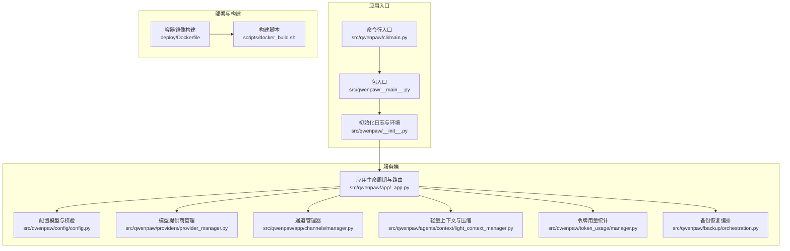
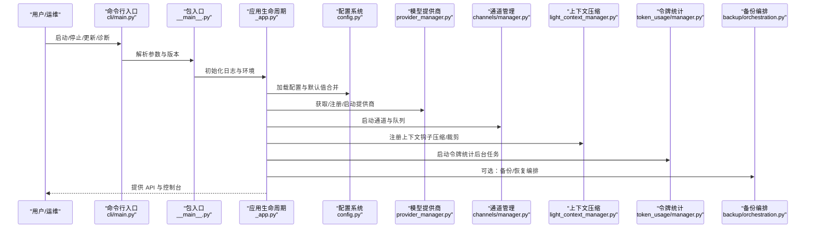
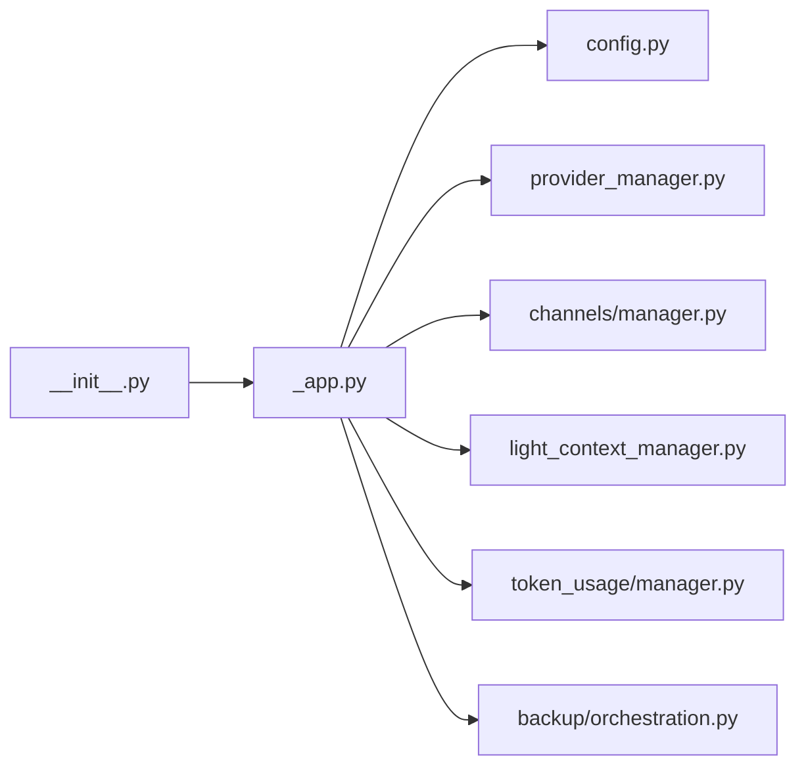

# 最佳实践

<cite>
**本文引用的文件**
- [README.md](file://README.md)
- [CONTRIBUTING.md](file://CONTRIBUTING.md)
- [SECURITY.md](file://SECURITY.md)
- [src/qwenpaw/__init__.py](file://src/qwenpaw/__init__.py)
- [src/qwenpaw/__main__.py](file://src/qwenpaw/__main__.py)
- [src/qwenpaw/config/config.py](file://src/qwenpaw/config/config.py)
- [src/qwenpaw/app/_app.py](file://src/qwenpaw/app/_app.py)
- [src/qwenpaw/cli/main.py](file://src/qwenpaw/cli/main.py)
- [src/qwenpaw/providers/provider_manager.py](file://src/qwenpaw/providers/provider_manager.py)
- [src/qwenpaw/app/channels/manager.py](file://src/qwenpaw/app/channels/manager.py)
- [src/qwenpaw/agents/context/light_context_manager.py](file://src/qwenpaw/agents/context/light_context_manager.py)
- [src/qwenpaw/token_usage/manager.py](file://src/qwenpaw/token_usage/manager.py)
- [src/qwenpaw/backup/orchestration.py](file://src/qwenpaw/backup/orchestration.py)
- [deploy/Dockerfile](file://deploy/Dockerfile)
- [scripts/docker_build.sh](file://scripts/docker_build.sh)
</cite>

## 目录
1. [简介](#简介)
2. [项目结构](#项目结构)
3. [核心组件](#核心组件)
4. [架构总览](#架构总览)
5. [详细组件分析](#详细组件分析)
6. [依赖关系分析](#依赖关系分析)
7. [性能考虑](#性能考虑)
8. [故障排查指南](#故障排查指南)
9. [结论](#结论)
10. [附录](#附录)

## 简介
本指南面向生产部署与扩展开发，围绕 QwenPaw 的生产环境配置、性能优化、安全加固、运维管理、故障预防、架构优化、资源与成本控制、功能开发规范、代码质量与测试覆盖、用户体验与稳定性提升等方面，提供可操作的实施标准与最佳实践。内容基于仓库现有实现与文档进行提炼，并结合行业标准与合规要求给出落地建议。

## 项目结构
QwenPaw 采用前后端分离与多进程/多代理协同的架构：后端以 FastAPI 提供统一 API 与控制面，前端控制台通过静态资源提供交互；运行时通过多代理管理器支持多 Agent 并行与隔离；通道层抽象统一消息接入；提供层统一模型能力；上下文与记忆模块负责对话状态与长期记忆；备份与恢复提供数据保护；容器化与脚本提供一键构建与发布。

图示来源
- [src/qwenpaw/cli/main.py:95-173](file://src/qwenpaw/cli/main.py#L95-L173)
- [src/qwenpaw/__main__.py:1-7](file://src/qwenpaw/__main__.py#L1-L7)
- [src/qwenpaw/__init__.py:1-33](file://src/qwenpaw/__init__.py#L1-L33)
- [src/qwenpaw/app/_app.py:547-719](file://src/qwenpaw/app/_app.py#L547-L719)
- [src/qwenpaw/config/config.py:1-800](file://src/qwenpaw/config/config.py#L1-L800)
- [src/qwenpaw/providers/provider_manager.py:1-800](file://src/qwenpaw/providers/provider_manager.py#L1-L800)
- [src/qwenpaw/app/channels/manager.py:1-800](file://src/qwenpaw/app/channels/manager.py#L1-L800)
- [src/qwenpaw/agents/context/light_context_manager.py:1-800](file://src/qwenpaw/agents/context/light_context_manager.py#L1-L800)
- [src/qwenpaw/token_usage/manager.py:1-285](file://src/qwenpaw/token_usage/manager.py#L1-L285)
- [src/qwenpaw/backup/orchestration.py:1-147](file://src/qwenpaw/backup/orchestration.py#L1-L147)
- [deploy/Dockerfile:1-105](file://deploy/Dockerfile#L1-L105)
- [scripts/docker_build.sh:1-32](file://scripts/docker_build.sh#L1-L32)

章节来源
- [README.md:118-384](file://README.md#L118-L384)
- [src/qwenpaw/app/_app.py:547-719](file://src/qwenpaw/app/_app.py#L547-L719)
- [src/qwenpaw/config/config.py:1-800](file://src/qwenpaw/config/config.py#L1-L800)

## 核心组件
- 应用生命周期与路由：FastAPI 应用在 lifespan 中完成启动阶段的清理、迁移、后台加载与插件注册，以及优雅关闭时的钩子执行与资源回收。
- 配置系统：集中定义模型槽位、通道配置、心跳、上下文压缩、工具结果裁剪、嵌入与向量存储等，使用 Pydantic 进行强类型校验与默认值合并。
- 模型提供商管理：内置多家云模型与本地模型提供方，统一接口与能力探测，支持加密密钥存储与连接检查。
- 通道管理：统一队列与消费模型，支持批量合并、优先级与会话隔离，具备健康检查与动态替换能力。
- 轻量上下文与压缩：对工具结果进行裁剪与落盘，按阈值触发上下文压缩，保障长对话与高吞吐场景的稳定性。
- 令牌用量统计：缓冲区聚合写入，支持按日期/模型/提供商汇总查询，便于成本控制与审计。
- 备份与恢复：编排停止代理 → 执行恢复 → 后台预热重启，确保原子性与可恢复性。
- 容器化与构建：多阶段构建前端静态资源，安装运行时依赖，注入 Supervisor 管理进程，暴露端口并提供入口脚本。

章节来源
- [src/qwenpaw/app/_app.py:220-545](file://src/qwenpaw/app/_app.py#L220-L545)
- [src/qwenpaw/config/config.py:42-800](file://src/qwenpaw/config/config.py#L42-L800)
- [src/qwenpaw/providers/provider_manager.py:1-800](file://src/qwenpaw/providers/provider_manager.py#L1-L800)
- [src/qwenpaw/app/channels/manager.py:68-800](file://src/qwenpaw/app/channels/manager.py#L68-L800)
- [src/qwenpaw/agents/context/light_context_manager.py:47-800](file://src/qwenpaw/agents/context/light_context_manager.py#L47-L800)
- [src/qwenpaw/token_usage/manager.py:61-285](file://src/qwenpaw/token_usage/manager.py#L61-L285)
- [src/qwenpaw/backup/orchestration.py:44-147](file://src/qwenpaw/backup/orchestration.py#L44-L147)
- [deploy/Dockerfile:1-105](file://deploy/Dockerfile#L1-L105)

## 架构总览
下图展示从 CLI 到应用生命周期、配置、通道、上下文、令牌统计与备份恢复的整体调用链路与职责边界。

图示来源
- [src/qwenpaw/cli/main.py:95-173](file://src/qwenpaw/cli/main.py#L95-L173)
- [src/qwenpaw/__main__.py:1-7](file://src/qwenpaw/__main__.py#L1-L7)
- [src/qwenpaw/__init__.py:1-33](file://src/qwenpaw/__init__.py#L1-L33)
- [src/qwenpaw/app/_app.py:220-545](file://src/qwenpaw/app/_app.py#L220-L545)
- [src/qwenpaw/config/config.py:1-800](file://src/qwenpaw/config/config.py#L1-L800)
- [src/qwenpaw/providers/provider_manager.py:1-800](file://src/qwenpaw/providers/provider_manager.py#L1-L800)
- [src/qwenpaw/app/channels/manager.py:1-800](file://src/qwenpaw/app/channels/manager.py#L1-L800)
- [src/qwenpaw/agents/context/light_context_manager.py:1-800](file://src/qwenpaw/agents/context/light_context_manager.py#L1-L800)
- [src/qwenpaw/token_usage/manager.py:1-285](file://src/qwenpaw/token_usage/manager.py#L1-L285)
- [src/qwenpaw/backup/orchestration.py:1-147](file://src/qwenpaw/backup/orchestration.py#L1-L147)

## 详细组件分析

### 生产环境配置与部署
- 端口与网络
  - 默认监听 127.0.0.1:8088，可通过环境变量覆盖；容器内暴露 8088，支持通过 -p 或 -e QWENPAW_PORT 自定义。
  - 支持 CORS 配置，按需设置允许源列表。
- 工作目录与持久化
  - 工作目录、密钥目录、备份目录通过环境变量配置，容器中默认挂载卷路径已预设。
- 渠道启用策略
  - 通过 QWENPAW_DISABLED_CHANNELS 或 QWENPAW_ENABLED_CHANNELS 控制渠道白/黑名单，减少不必要的进程与资源占用。
- 容器化与构建
  - 多阶段构建前端静态资源，使用 uv 提升安装速度；Supervisor 管理主进程；Chromium 无沙箱模式用于容器运行。
- 安全加固
  - 建议在容器中以非 root 用户运行；只读根文件系统与最小权限挂载；限制 Capabilities。

章节来源
- [src/qwenpaw/app/_app.py:547-719](file://src/qwenpaw/app/_app.py#L547-L719)
- [deploy/Dockerfile:14-105](file://deploy/Dockerfile#L14-L105)
- [scripts/docker_build.sh:1-32](file://scripts/docker_build.sh#L1-L32)

### 性能优化与资源管理
- 上下文压缩与工具结果裁剪
  - 在轻量上下文管理器中，按阈值触发压缩，保留最近片段，避免上下文过长导致延迟与成本上升。
  - 对工具结果进行字节级裁剪，超限自动落盘并保留路径提示，降低内存与传输压力。
- 令牌用量统计
  - 使用缓冲区聚合写入，定期 flush，支持按日期/模型/提供商汇总，便于成本归集与异常监控。
- 通道队列与批处理
  - 统一队列与消费者循环，支持同键合并与优先级调度，降低并发竞争与抖动。
- 启动与后台任务
  - FastAPI lifespan 将重任务异步后台启动，缩短首启时间；后台任务包括代理启动、插件加载、启动钩子、令牌统计等。

章节来源
- [src/qwenpaw/agents/context/light_context_manager.py:201-335](file://src/qwenpaw/agents/context/light_context_manager.py#L201-L335)
- [src/qwenpaw/agents/context/light_context_manager.py:386-644](file://src/qwenpaw/agents/context/light_context_manager.py#L386-L644)
- [src/qwenpaw/token_usage/manager.py:72-136](file://src/qwenpaw/token_usage/manager.py#L72-L136)
- [src/qwenpaw/app/channels/manager.py:365-461](file://src/qwenpaw/app/channels/manager.py#L365-L461)
- [src/qwenpaw/app/_app.py:315-466](file://src/qwenpaw/app/_app.py#L315-L466)

### 安全配置与合规
- 多层安全机制
  - 工具守卫、文件访问控制、技能安全扫描、本地部署与可选 Web 认证。
- 密钥与敏感信息
  - 通过加密字段与密钥存储模块管理提供商密钥；避免将密钥写入工作目录或可被技能访问的路径。
- 信任模型与边界
  - 单操作者信任模型，共享实例中的多用户应通过独立配置/用户/主机隔离；通道与用户白名单、最少权限与沙箱是关键。
- 披露与响应
  - 私有漏洞披露流程与报告模板，明确所需要素与验收门槛，避免误报与重复。

章节来源
- [README.md:388-398](file://README.md#L388-L398)
- [SECURITY.md:53-158](file://SECURITY.md#L53-L158)

### 扩展开发与运维管理
- 插件体系
  - 插件加载器与运行时助手，支持注册插件提供方、控制命令与启动/关闭钩子；插件控制命令通过命令注册表管理优先级。
- 通道扩展
  - 基于 BaseChannel 子类实现新通道，注册到通道注册表；支持自定义通道从工作目录加载。
- 模型提供商扩展
  - 新增 Provider 实例并注册到 ProviderManager；提供模型列表与能力标签，增强用户体验。
- 运维命令
  - CLI 提供 app、channels、daemon、cron、env、init、models、skills、uninstall、desktop、update、shutdown、auth、agents、plugin、task、doctor 等命令，支持快速诊断与维护。

章节来源
- [src/qwenpaw/app/_app.py:325-431](file://src/qwenpaw/app/_app.py#L325-L431)
- [src/qwenpaw/app/channels/manager.py:101-216](file://src/qwenpaw/app/channels/manager.py#L101-L216)
- [src/qwenpaw/providers/provider_manager.py:680-800](file://src/qwenpaw/providers/provider_manager.py#L680-L800)
- [src/qwenpaw/cli/main.py:95-173](file://src/qwenpaw/cli/main.py#L95-L173)

### 故障预防与恢复
- 启停与优雅退出
  - 生命周期中注册启动/关闭钩子，有序停止本地模型服务器、多代理管理器、令牌统计与浏览器实例。
- 备份与恢复编排
  - 停止受影响代理 → 执行恢复 → 后台预热重启，确保文件句柄释放与服务恢复。
- 启动清理
  - 启动前清理恢复残留产物，避免并发恢复导致的数据不一致。

章节来源
- [src/qwenpaw/app/_app.py:476-545](file://src/qwenpaw/app/_app.py#L476-L545)
- [src/qwenpaw/backup/orchestration.py:44-147](file://src/qwenpaw/backup/orchestration.py#L44-L147)

### 功能开发规范与测试覆盖
- 提交与分支
  - 遵循约定式提交；PR 标题与描述清晰；变更需通过本地门禁（pre-commit、pytest）。
- 文档同步
  - 用户行为变更需同步更新文档与 README。
- 测试范围
  - 单元测试、集成测试、端到端测试与契约测试覆盖关键路径；平台兼容性测试覆盖主流操作系统。

章节来源
- [CONTRIBUTING.md:23-86](file://CONTRIBUTING.md#L23-L86)
- [CONTRIBUTING.md:114-147](file://CONTRIBUTING.md#L114-L147)
- [CONTRIBUTING.md:186-196](file://CONTRIBUTING.md#L186-L196)

## 依赖关系分析
- 包初始化与日志
  - 包入口在初始化阶段加载持久化环境变量并设置日志级别，失败时记录警告，避免影响启动。
- 应用生命周期
  - FastAPI 应用在 lifespan 中完成启动清理、配置迁移、代理与插件后台加载、令牌统计任务启动；关闭时执行钩子与资源回收。
- 配置与运行时
  - 配置模型集中定义运行期参数，避免循环导入；运行时通过配置加载器读取并合并默认值。
- 通道与队列
  - 通道管理器统一队列与消费者，支持批量合并、优先级与会话隔离，具备健康检查与动态替换。
- 提供商与模型
  - 提供商管理器内置多家云与本地模型，统一接口与能力探测，支持加密密钥存储与连接检查。
- 上下文与压缩
  - 轻量上下文管理器在推理前/推理中分别进行记忆检索与上下文压缩，保障长对话稳定性。
- 令牌统计
  - 令牌用量管理器以缓冲区聚合写入，支持按日期/模型/提供商汇总查询。
- 备份与恢复
  - 编排器协调停止/恢复/重启流程，确保原子性与可恢复性。

图示来源
- [src/qwenpaw/__init__.py:1-33](file://src/qwenpaw/__init__.py#L1-L33)
- [src/qwenpaw/app/_app.py:220-545](file://src/qwenpaw/app/_app.py#L220-L545)
- [src/qwenpaw/config/config.py:1-800](file://src/qwenpaw/config/config.py#L1-L800)
- [src/qwenpaw/providers/provider_manager.py:1-800](file://src/qwenpaw/providers/provider_manager.py#L1-L800)
- [src/qwenpaw/app/channels/manager.py:1-800](file://src/qwenpaw/app/channels/manager.py#L1-L800)
- [src/qwenpaw/agents/context/light_context_manager.py:1-800](file://src/qwenpaw/agents/context/light_context_manager.py#L1-L800)
- [src/qwenpaw/token_usage/manager.py:1-285](file://src/qwenpaw/token_usage/manager.py#L1-L285)
- [src/qwenpaw/backup/orchestration.py:1-147](file://src/qwenpaw/backup/orchestration.py#L1-L147)

章节来源
- [src/qwenpaw/__init__.py:1-33](file://src/qwenpaw/__init__.py#L1-L33)
- [src/qwenpaw/app/_app.py:220-545](file://src/qwenpaw/app/_app.py#L220-L545)

## 性能考虑
- 启动阶段优化
  - 将重任务放入后台任务，缩短首启时间；仅在必要时加载插件与通道。
- 上下文与工具结果
  - 合理设置上下文压缩阈值与保留比例，避免过度压缩导致信息丢失；对工具结果进行字节级裁剪与落盘。
- 令牌统计
  - 调整 flush 间隔与缓冲区大小，平衡写入开销与查询实时性。
- 通道与队列
  - 合理设置队列最大长度与超时保护，避免阻塞；根据业务特征调整优先级与批处理策略。
- 容器与资源
  - 限制容器 CPU/内存配额；使用只读根文件系统与最小权限挂载；合理设置 Chromium 无沙箱参数以适配容器环境。

## 故障排查指南
- 启动失败
  - 检查启动清理是否成功（恢复残留产物）；查看生命周期日志与后台任务错误；确认配置文件与环境变量。
- 通道异常
  - 使用通道健康检查接口定位问题；检查通道配置与鉴权；确认网络连通与代理设置。
- 令牌统计异常
  - 检查缓冲区文件是否存在与权限；确认 flush 间隔与磁盘空间；核对日期分区与过滤条件。
- 备份恢复
  - 确认备份文件存在；检查受影响代理与运行中代理集合；确保文件句柄释放后再执行目录重命名。
- 日志与诊断
  - 使用 /api/doctor/runtime 获取运行时诊断信息；在调试模式下查看详细日志。

章节来源
- [src/qwenpaw/app/_app.py:232-242](file://src/qwenpaw/app/_app.py#L232-L242)
- [src/qwenpaw/app/channels/manager.py:549-578](file://src/qwenpaw/app/channels/manager.py#L549-L578)
- [src/qwenpaw/token_usage/manager.py:137-235](file://src/qwenpaw/token_usage/manager.py#L137-L235)
- [src/qwenpaw/backup/orchestration.py:81-147](file://src/qwenpaw/backup/orchestration.py#L81-L147)

## 结论
通过标准化的生产环境配置、严格的性能与安全基线、完善的扩展与运维流程、稳健的备份恢复机制，QwenPaw 可在多场景下稳定运行并持续演进。建议在上线前完成端到端演练与压测，建立监控与告警体系，并将本文最佳实践纳入日常开发与运维流程。

## 附录
- 快速开始与安装
  - 支持 pip 安装、脚本安装、Docker 与桌面应用等多种方式；容器镜像默认排除 imessage，可通过构建参数调整。
- 文档与社区
  - 官方文档站点与多语言文档；社区交流渠道与贡献指南。

章节来源
- [README.md:118-384](file://README.md#L118-L384)
- [scripts/docker_build.sh:7-11](file://scripts/docker_build.sh#L7-L11)