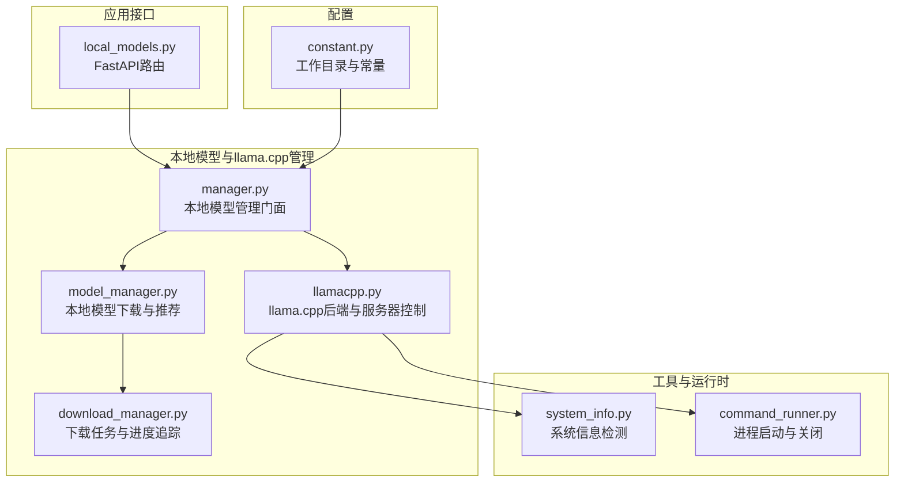
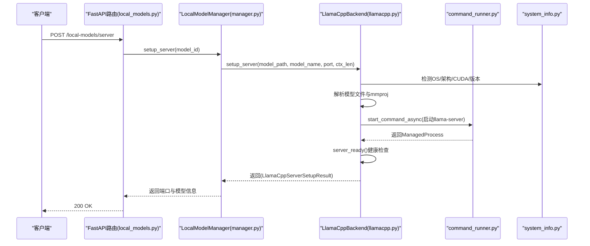
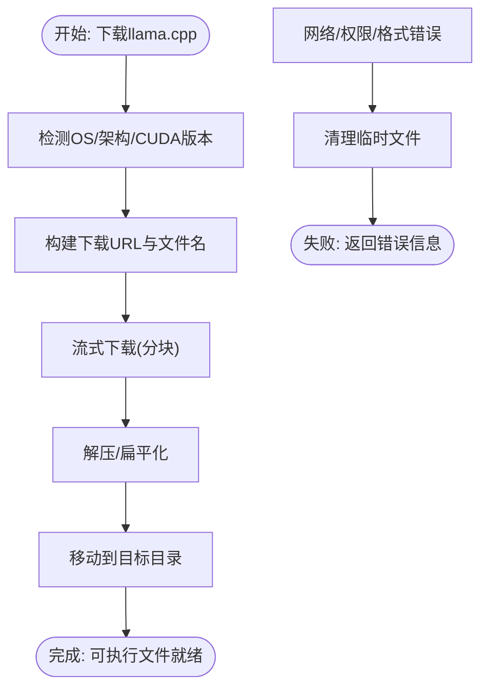
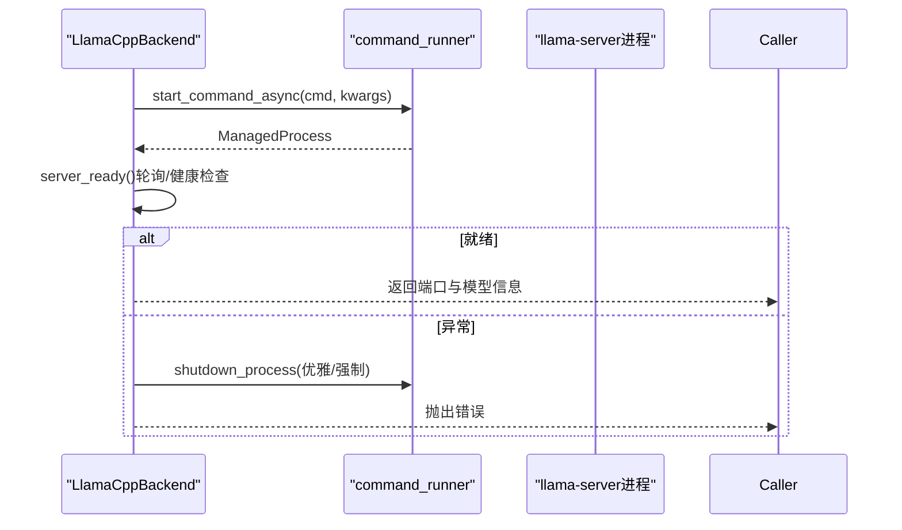
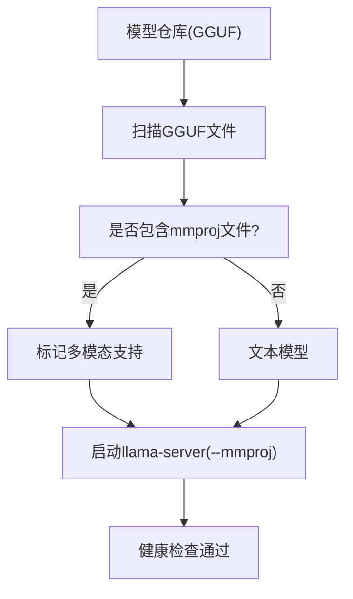
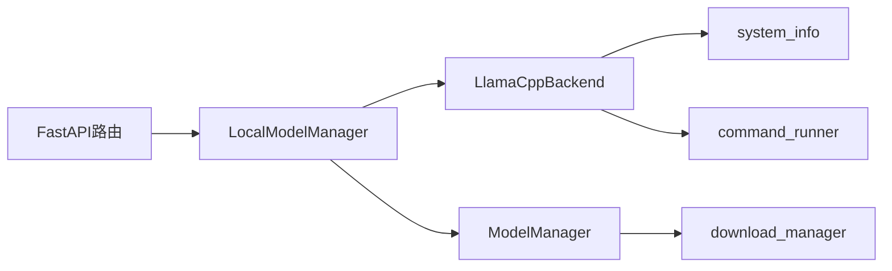

# llama.cpp后端集成

<cite>
**本文档引用的文件**
- [llamacpp.py](file://src/qwenpaw/local_models/llamacpp.py)
- [manager.py](file://src/qwenpaw/local_models/manager.py)
- [model_manager.py](file://src/qwenpaw/local_models/model_manager.py)
- [download_manager.py](file://src/qwenpaw/local_models/download_manager.py)
- [system_info.py](file://src/qwenpaw/utils/system_info.py)
- [command_runner.py](file://src/qwenpaw/utils/command_runner.py)
- [local_models.py](file://src/qwenpaw/app/routers/local_models.py)
- [constant.py](file://src/qwenpaw/constant.py)
- [test_llamacpp_backend.py](file://tests/unit/local_models/test_llamacpp_backend.py)
</cite>

## 目录
1. [简介](#简介)
2. [项目结构](#项目结构)
3. [核心组件](#核心组件)
4. [架构总览](#架构总览)
5. [详细组件分析](#详细组件分析)
6. [依赖关系分析](#依赖关系分析)
7. [性能考虑](#性能考虑)
8. [故障排除指南](#故障排除指南)
9. [结论](#结论)

## 简介
本文件面向QwenPaw项目中的llama.cpp后端集成，系统化阐述从二进制下载、安装与版本管理，到服务器启动、端口管理与进程控制，再到模型加载、内存分配与GPU加速支持的完整技术路径。同时提供参数配置、性能调优、资源监控方法，以及跨平台兼容性、依赖库管理与环境检测的实现细节，并附带常见问题的故障排除与优化建议。

## 项目结构
llama.cpp后端集成主要分布在以下模块：
- 本地模型与llama.cpp管理：local_models子包（llamacpp.py、manager.py、model_manager.py、download_manager.py）
- 工具与运行时：utils子包（system_info.py、command_runner.py）
- 应用接口：app/routers/local_models.py
- 常量与工作目录：constant.py
- 单元测试：tests/unit/local_models/test_llamacpp_backend.py

**图表来源**
- [llamacpp.py:51-926](file://src/qwenpaw/local_models/llamacpp.py#L51-L926)
- [manager.py:41-244](file://src/qwenpaw/local_models/manager.py#L41-L244)
- [model_manager.py:63-654](file://src/qwenpaw/local_models/model_manager.py#L63-L654)
- [download_manager.py:25-599](file://src/qwenpaw/local_models/download_manager.py#L25-L599)
- [system_info.py:44-253](file://src/qwenpaw/utils/system_info.py#L44-L253)
- [command_runner.py:127-578](file://src/qwenpaw/utils/command_runner.py#L127-L578)
- [local_models.py:1-496](file://src/qwenpaw/app/routers/local_models.py#L1-L496)
- [constant.py:89-136](file://src/qwenpaw/constant.py#L89-L136)

**章节来源**
- [llamacpp.py:51-926](file://src/qwenpaw/local_models/llamacpp.py#L51-L926)
- [manager.py:41-244](file://src/qwenpaw/local_models/manager.py#L41-L244)
- [model_manager.py:63-654](file://src/qwenpaw/local_models/model_manager.py#L63-L654)
- [download_manager.py:25-599](file://src/qwenpaw/local_models/download_manager.py#L25-L599)
- [system_info.py:44-253](file://src/qwenpaw/utils/system_info.py#L44-L253)
- [command_runner.py:127-578](file://src/qwenpaw/utils/command_runner.py#L127-L578)
- [local_models.py:1-496](file://src/qwenpaw/app/routers/local_models.py#L1-L496)
- [constant.py:89-136](file://src/qwenpaw/constant.py#L89-L136)

## 核心组件
- LlamaCppBackend：负责llama.cpp二进制下载、安装、版本检查、服务器启动/停止、端口选择、设备列表与版本查询等。
- LocalModelManager：对外统一入口，协调llama.cpp后端与本地模型下载器，持久化本地运行配置（如上下文长度、端口）。
- ModelManager：下载HuggingFace或ModelScope上的GGUF模型仓库，支持进度追踪、取消、大小估算与校验。
- DownloadProgressTracker/ProcessDownloadController：通用下载状态机与控制器，支持多进程下载、进度计算与结果归并。
- system_info：系统信息探测（OS、架构、CUDA版本、内存/GPU显存），用于环境兼容性判断与下载包命名。
- command_runner：跨平台进程管理（启动、优雅/强制终止、等待退出、进程组支持）。
- FastAPI路由：提供REST接口用于检查服务器状态、下载llama.cpp、启动/停止服务器、配置本地模型参数等。

**章节来源**
- [llamacpp.py:51-926](file://src/qwenpaw/local_models/llamacpp.py#L51-L926)
- [manager.py:41-244](file://src/qwenpaw/local_models/manager.py#L41-L244)
- [model_manager.py:63-654](file://src/qwenpaw/local_models/model_manager.py#L63-L654)
- [download_manager.py:198-599](file://src/qwenpaw/local_models/download_manager.py#L198-L599)
- [system_info.py:44-253](file://src/qwenpaw/utils/system_info.py#L44-L253)
- [command_runner.py:127-578](file://src/qwenpaw/utils/command_runner.py#L127-L578)
- [local_models.py:1-496](file://src/qwenpaw/app/routers/local_models.py#L1-L496)

## 架构总览
下图展示从API请求到llama.cpp服务器启动的全链路：

**图表来源**
- [local_models.py:294-324](file://src/qwenpaw/app/routers/local_models.py#L294-L324)
- [manager.py:214-230](file://src/qwenpaw/local_models/manager.py#L214-L230)
- [llamacpp.py:217-312](file://src/qwenpaw/local_models/llamacpp.py#L217-L312)
- [command_runner.py:280-351](file://src/qwenpaw/utils/command_runner.py#L280-L351)
- [system_info.py:44-144](file://src/qwenpaw/utils/system_info.py#L44-L144)

## 详细组件分析

### LlamaCppBackend：二进制下载、安装与版本管理
- 下载与安装
  - 支持按OS/架构/CUDA版本生成对应下载包名，自动拼接URL并发起下载。
  - 使用多进程下载控制器，支持断点续传式流式写入、进度上报、错误映射与最终归并。
  - 安装阶段解压归档、扁平化目录结构、移动至目标目录，失败时回滚清理。
- 版本管理
  - 通过命令行输出解析版本号；支持检查是否有新版本可用。
- 环境检测与兼容性
  - macOS版本最低要求校验；Windows仅在检测到CUDA时启用GPU后端；其他平台默认CPU后端。
  - 通过system_info获取OS、架构、CUDA版本、内存与显存信息，用于下载包选择与运行参数推断。
- 进程控制与健康检查
  - 启动时设置日志文件、绑定127.0.0.1与自动端口选择；支持固定端口但需确保可用。
  - 提供server_ready()健康检查（轮询/HTTP 5xx视为未就绪），异常时自动关停并抛出错误。
  - 提供优雅/强制终止流程，配合日志输出流异步消费。

**图表来源**
- [llamacpp.py:146-216](file://src/qwenpaw/local_models/llamacpp.py#L146-L216)
- [llamacpp.py:551-624](file://src/qwenpaw/local_models/llamacpp.py#L551-L624)
- [llamacpp.py:778-834](file://src/qwenpaw/local_models/llamacpp.py#L778-L834)
- [system_info.py:84-94](file://src/qwenpaw/utils/system_info.py#L84-L94)

**章节来源**
- [llamacpp.py:90-145](file://src/qwenpaw/local_models/llamacpp.py#L90-L145)
- [llamacpp.py:146-216](file://src/qwenpaw/local_models/llamacpp.py#L146-L216)
- [llamacpp.py:551-624](file://src/qwenpaw/local_models/llamacpp.py#L551-L624)
- [llamacpp.py:778-834](file://src/qwenpaw/local_models/llamacpp.py#L778-L834)
- [system_info.py:84-94](file://src/qwenpaw/utils/system_info.py#L84-L94)

### 服务器启动流程、端口管理与进程控制
- 端口管理
  - 自动寻找空闲端口；Windows使用独占地址绑定策略；可指定固定端口但必须可用。
- 进程控制
  - 跨平台启动：Windows事件循环不支持时回退线程模式；支持start_new_session以创建独立会话。
  - 健康检查：定期访问/health端点，忽略5xx类错误；超时则报错。
  - 日志流：异步读取stdout并记录，便于排障。
  - 关闭流程：先优雅终止，超时后强制kill；同步路径用于进程退出时快速清理。

**图表来源**
- [llamacpp.py:354-408](file://src/qwenpaw/local_models/llamacpp.py#L354-L408)
- [llamacpp.py:695-730](file://src/qwenpaw/local_models/llamacpp.py#L695-L730)
- [command_runner.py:280-491](file://src/qwenpaw/utils/command_runner.py#L280-L491)

**章节来源**
- [llamacpp.py:686-693](file://src/qwenpaw/local_models/llamacpp.py#L686-L693)
- [llamacpp.py:354-408](file://src/qwenpaw/local_models/llamacpp.py#L354-L408)
- [llamacpp.py:695-730](file://src/qwenpaw/local_models/llamacpp.py#L695-L730)
- [command_runner.py:280-491](file://src/qwenpaw/utils/command_runner.py#L280-L491)

### 模型加载、内存分配与GPU加速
- 模型加载
  - 支持单文件.GGUF或包含多个GGUF的仓库；自动识别mmproj文件以启用多模态能力。
  - 通过--model与--mmproj参数传递给llama-server；--alias用于服务别名。
- 内存与显存
  - 通过system_info优先检测GPU显存，否则回退系统内存，作为推荐模型选择依据。
  - llama.cpp侧采用--gpu-layers auto策略，结合CUDA版本与硬件能力进行推理层调度。
- 多模态支持
  - 若仓库包含mmproj前缀的GGUF文件，则认为支持图像输入，模型能力标记为多模态。

**图表来源**
- [llamacpp.py:445-491](file://src/qwenpaw/local_models/llamacpp.py#L445-L491)
- [model_manager.py:519-524](file://src/qwenpaw/local_models/model_manager.py#L519-L524)

**章节来源**
- [llamacpp.py:445-491](file://src/qwenpaw/local_models/llamacpp.py#L445-L491)
- [model_manager.py:519-524](file://src/qwenpaw/local_models/model_manager.py#L519-L524)

### 参数配置、性能调优与资源监控
- 配置项
  - 上下文长度：影响--ctx-size参数，默认持久化存储于配置文件。
  - 固定端口：可选，避免动态端口带来的外部配置复杂度。
  - 生成参数：通过ProviderManager更新qwenpaw-local提供者的生成参数。
- 性能调优
  - GPU层分配：--gpu-layers auto由llama.cpp根据硬件能力自动决策。
  - 上下文长度：适当增大可提升长文本效果，但会增加显存占用。
  - 端口与网络：仅监听127.0.0.1，避免外网暴露风险。
- 资源监控
  - 日志文件：--log-file输出到DEFAULT_LOCAL_PROVIDER_DIR/logs/llama-server.log。
  - 健康检查：/health端点轮询，便于外部监控系统接入。
  - 进程状态：通过get_server_status返回运行状态、端口、模型名与PID。

**章节来源**
- [manager.py:23-39](file://src/qwenpaw/local_models/manager.py#L23-L39)
- [manager.py:109-124](file://src/qwenpaw/local_models/manager.py#L109-L124)
- [llamacpp.py:364-392](file://src/qwenpaw/local_models/llamacpp.py#L364-L392)
- [local_models.py:455-483](file://src/qwenpaw/app/routers/local_models.py#L455-L483)

### 跨平台兼容性、依赖库与环境检测
- 平台与架构
  - 支持Windows/Linux/macOS；架构支持x64/arm64。
  - Windows仅在检测到CUDA时启用GPU后端；macOS对最低版本有要求。
- 依赖与探测
  - CUDA版本：nvidia-smi/nvcc输出解析；显存大小查询。
  - 系统内存：不同平台通过sysconf/sysctl/proc/sys实现。
  - 下载包命名：基于OS/架构/CUDA版本生成，避免不匹配。
- 运行时兼容
  - Windows事件循环限制下的进程启动回退；进程组支持跨平台差异处理。

**章节来源**
- [llamacpp.py:846-926](file://src/qwenpaw/local_models/llamacpp.py#L846-L926)
- [system_info.py:84-144](file://src/qwenpaw/utils/system_info.py#L84-L144)
- [command_runner.py:280-380](file://src/qwenpaw/utils/command_runner.py#L280-L380)

### API与前端交互
- 路由功能
  - 检查服务器状态、更新可用性、下载与取消下载、启动/停止服务器、删除模型、配置持久化等。
  - 启动服务器后自动更新ProviderManager，将qwenpaw-local提供者指向本地端口与模型信息。
- 错误处理
  - 对下载失败、服务器启动失败、端口不可用等情况返回HTTP 400/409等状态码。

**章节来源**
- [local_models.py:151-343](file://src/qwenpaw/app/routers/local_models.py#L151-L343)
- [local_models.py:455-495](file://src/qwenpaw/app/routers/local_models.py#L455-L495)

## 依赖关系分析
- 组件耦合
  - LocalModelManager聚合LlamaCppBackend与ModelManager，提供单一入口；耦合度低，职责清晰。
  - LlamaCppBackend依赖system_info与command_runner，形成“探测—执行—监控”的闭环。
  - 下载子系统通过download_manager抽象出统一的任务生命周期与进度追踪。
- 外部依赖
  - llama.cpp二进制（按平台/架构/CUDA打包）。
  - HuggingFace/ModelScope模型仓库（GGUF）。
  - nvidia-smi/nvcc（Windows/CUDA环境探测）。

**图表来源**
- [manager.py:53-60](file://src/qwenpaw/local_models/manager.py#L53-L60)
- [llamacpp.py:59-77](file://src/qwenpaw/local_models/llamacpp.py#L59-L77)
- [model_manager.py:66-76](file://src/qwenpaw/local_models/model_manager.py#L66-L76)
- [download_manager.py:368-381](file://src/qwenpaw/local_models/download_manager.py#L368-L381)
- [local_models.py:26-33](file://src/qwenpaw/app/routers/local_models.py#L26-L33)

**章节来源**
- [manager.py:53-60](file://src/qwenpaw/local_models/manager.py#L53-L60)
- [llamacpp.py:59-77](file://src/qwenpaw/local_models/llamacpp.py#L59-L77)
- [model_manager.py:66-76](file://src/qwenpaw/local_models/model_manager.py#L66-L76)
- [download_manager.py:368-381](file://src/qwenpaw/local_models/download_manager.py#L368-L381)
- [local_models.py:26-33](file://src/qwenpaw/app/routers/local_models.py#L26-L33)

## 性能考虑
- 显存与上下文长度
  - 上下文长度越大，显存占用越高；建议根据GPU显存大小合理设置。
- 端口与并发
  - 仅监听127.0.0.1，避免外部网络开销；若需外部访问，建议通过反向代理或隧道。
- 进程与日志
  - 异步读取日志流，避免阻塞；日志文件便于离线分析。
- 下载与安装
  - 断点续传式下载与进度上报，减少网络波动影响；安装阶段最小化磁盘操作与权限变更。

[本节为通用指导，无需特定文件引用]

## 故障排除指南
- 无法安装llama.cpp
  - 检查环境兼容性（macOS版本、CUDA版本、架构）；确认下载URL可达且返回200。
  - 查看下载错误映射：404/403/5xx分别提示版本不存在、权限不足或服务器异常。
- 服务器启动失败
  - 查看/health轮询结果与日志文件；确认端口未被占用；检查模型路径与.GGUF文件完整性。
  - Windows事件循环限制导致启动失败时，回退线程模式已内置处理。
- 模型加载异常
  - 确认仓库包含至少一个.GGUF文件；多模态模型需同时存在mmproj文件。
- 端口冲突
  - 使用自动端口或确保固定端口可用；Windows使用独占绑定策略。
- 进程无法正常退出
  - 先尝试优雅终止，超时后强制kill；必要时检查进程是否存在。

**章节来源**
- [test_llamacpp_backend.py:611-721](file://tests/unit/local_models/test_llamacpp_backend.py#L611-L721)
- [test_llamacpp_backend.py:1156-1168](file://tests/unit/local_models/test_llamacpp_backend.py#L1156-L1168)
- [test_llamacpp_backend.py:1218-1266](file://tests/unit/local_models/test_llamacpp_backend.py#L1218-L1266)
- [llamacpp.py:626-659](file://src/qwenpaw/local_models/llamacpp.py#L626-L659)
- [llamacpp.py:1156-1168](file://src/qwenpaw/local_models/llamacpp.py#L1156-L1168)
- [command_runner.py:382-491](file://src/qwenpaw/utils/command_runner.py#L382-L491)

## 结论
QwenPaw对llama.cpp后端的集成实现了从二进制下载、安装、版本管理到服务器启动、端口管理与进程控制的全链路自动化。通过system_info与command_runner保障跨平台一致性，download_manager提供稳定的下载体验，FastAPI路由将本地能力无缝暴露给上层应用。结合合理的参数配置与资源监控，可在不同硬件环境下获得稳定可靠的本地推理体验。