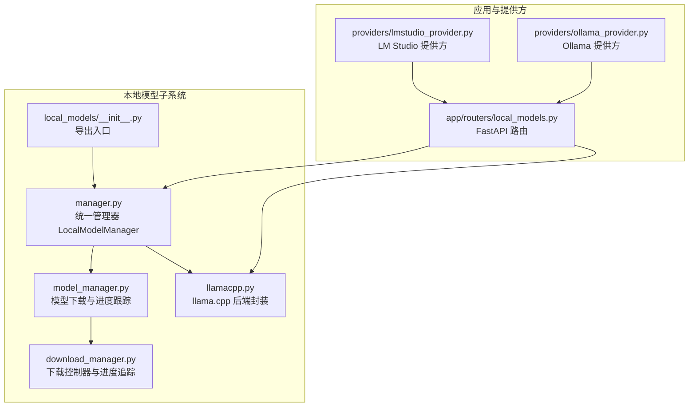
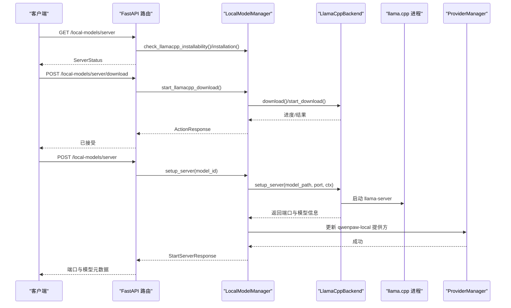
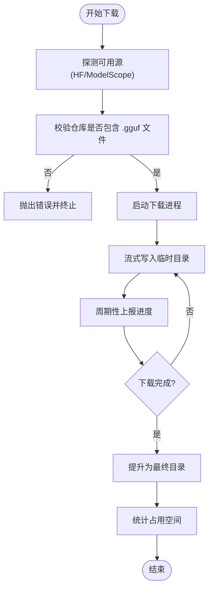
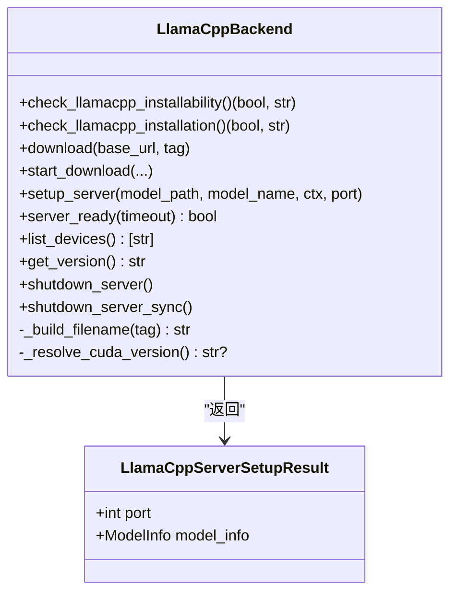
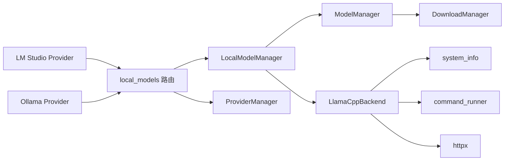

# 本地模型支持

<cite>
**本文引用的文件**
- [src/qwenpaw/local_models/__init__.py](file://src/qwenpaw/local_models/__init__.py)
- [src/qwenpaw/local_models/manager.py](file://src/qwenpaw/local_models/manager.py)
- [src/qwenpaw/local_models/model_manager.py](file://src/qwenpaw/local_models/model_manager.py)
- [src/qwenpaw/local_models/download_manager.py](file://src/qwenpaw/local_models/download_manager.py)
- [src/qwenpaw/local_models/llamacpp.py](file://src/qwenpaw/local_models/llamacpp.py)
- [src/qwenpaw/app/routers/local_models.py](file://src/qwenpaw/app/routers/local_models.py)
- [src/qwenpaw/providers/lmstudio_provider.py](file://src/qwenpaw/providers/lmstudio_provider.py)
- [src/qwenpaw/providers/ollama_provider.py](file://src/qwenpaw/providers/ollama_provider.py)
- [src/qwenpaw/constant.py](file://src/qwenpaw/constant.py)
- [tests/unit/local_models/test_llamacpp_backend.py](file://tests/unit/local_models/test_llamacpp_backend.py)
- [tests/unit/local_models/test_model_manager.py](file://tests/unit/local_models/test_model_manager.py)
</cite>

## 目录
1. [简介](#简介)
2. [项目结构](#项目结构)
3. [核心组件](#核心组件)
4. [架构总览](#架构总览)
5. [组件详解](#组件详解)
6. [依赖关系分析](#依赖关系分析)
7. [性能与优化](#性能与优化)
8. [故障排除与排障指南](#故障排除与排障指南)
9. [结论](#结论)
10. [附录：配置与操作指南](#附录配置与操作指南)

## 简介
本文件系统化阐述 QwenPaw 的本地模型支持能力，覆盖本地推理后端（llama.cpp）、模型下载与管理、服务生命周期控制、与 LM Studio、Ollama 等外部平台的对接方式，以及性能优化、并发与资源管理策略。读者无需深入源码即可按步骤完成本地模型的安装、启动、切换与维护。

## 项目结构
本地模型相关代码集中在 src/qwenpaw/local_models 目录，配合应用层路由与提供方适配模块，形成“下载管理—后端控制—服务暴露—前端配置”的闭环。

图示来源
- [src/qwenpaw/local_models/__init__.py:1-17](file://src/qwenpaw/local_models/__init__.py#L1-L17)
- [src/qwenpaw/local_models/manager.py:41-244](file://src/qwenpaw/local_models/manager.py#L41-L244)
- [src/qwenpaw/local_models/model_manager.py:63-654](file://src/qwenpaw/local_models/model_manager.py#L63-L654)
- [src/qwenpaw/local_models/download_manager.py:25-599](file://src/qwenpaw/local_models/download_manager.py#L25-L599)
- [src/qwenpaw/local_models/llamacpp.py:51-926](file://src/qwenpaw/local_models/llamacpp.py#L51-L926)
- [src/qwenpaw/app/routers/local_models.py:1-496](file://src/qwenpaw/app/routers/local_models.py#L1-L496)
- [src/qwenpaw/providers/lmstudio_provider.py:1-20](file://src/qwenpaw/providers/lmstudio_provider.py#L1-L20)
- [src/qwenpaw/providers/ollama_provider.py:1-73](file://src/qwenpaw/providers/ollama_provider.py#L1-L73)

章节来源
- [src/qwenpaw/local_models/__init__.py:1-17](file://src/qwenpaw/local_models/__init__.py#L1-L17)
- [src/qwenpaw/local_models/manager.py:41-244](file://src/qwenpaw/local_models/manager.py#L41-L244)
- [src/qwenpaw/local_models/model_manager.py:63-654](file://src/qwenpaw/local_models/model_manager.py#L63-L654)
- [src/qwenpaw/local_models/download_manager.py:25-599](file://src/qwenpaw/local_models/download_manager.py#L25-L599)
- [src/qwenpaw/local_models/llamacpp.py:51-926](file://src/qwenpaw/local_models/llamacpp.py#L51-L926)
- [src/qwenpaw/app/routers/local_models.py:1-496](file://src/qwenpaw/app/routers/local_models.py#L1-L496)
- [src/qwenpaw/providers/lmstudio_provider.py:1-20](file://src/qwenpaw/providers/lmstudio_provider.py#L1-L20)
- [src/qwenpaw/providers/ollama_provider.py:1-73](file://src/qwenpaw/providers/ollama_provider.py#L1-L73)

## 核心组件
- 统一管理器 LocalModelManager：聚合下载管理与 llama.cpp 后端控制，提供配置持久化、服务器启停、状态查询与更新检测。
- 模型管理器 ModelManager：负责推荐模型、下载进度、多源下载（HF/ModelScope）、目录清理与校验。
- 下载控制器/进度追踪：基于进程的后台下载任务、队列消息与进度快照，支持取消与失败回退。
- llama.cpp 后端 LlamaCppBackend：封装二进制下载、解压、安装、进程启动、健康检查、日志采集与关闭。
- 应用路由 local_models：对外暴露 HTTP 接口，连接管理器与提供方，实现“下载/启动/停止/配置”一体化。
- 提供方适配：LM Studio 与 Ollama 基于 OpenAI 兼容接口进行模型发现与连接校验。

章节来源
- [src/qwenpaw/local_models/manager.py:41-244](file://src/qwenpaw/local_models/manager.py#L41-L244)
- [src/qwenpaw/local_models/model_manager.py:63-654](file://src/qwenpaw/local_models/model_manager.py#L63-L654)
- [src/qwenpaw/local_models/download_manager.py:25-599](file://src/qwenpaw/local_models/download_manager.py#L25-L599)
- [src/qwenpaw/local_models/llamacpp.py:51-926](file://src/qwenpaw/local_models/llamacpp.py#L51-L926)
- [src/qwenpaw/app/routers/local_models.py:1-496](file://src/qwenpaw/app/routers/local_models.py#L1-L496)
- [src/qwenpaw/providers/lmstudio_provider.py:1-20](file://src/qwenpaw/providers/lmstudio_provider.py#L1-L20)
- [src/qwenpaw/providers/ollama_provider.py:1-73](file://src/qwenpaw/providers/ollama_provider.py#L1-L73)

## 架构总览
下图展示从 API 到后端的调用链路与职责边界：

图示来源
- [src/qwenpaw/app/routers/local_models.py:150-344](file://src/qwenpaw/app/routers/local_models.py#L150-L344)
- [src/qwenpaw/local_models/manager.py:133-231](file://src/qwenpaw/local_models/manager.py#L133-L231)
- [src/qwenpaw/local_models/llamacpp.py:217-313](file://src/qwenpaw/local_models/llamacpp.py#L217-L313)

## 组件详解

### 统一管理器 LocalModelManager
- 职责
  - 维护本地运行配置（上下文窗口、端口），并持久化到工作目录下的 config.json。
  - 协调 llama.cpp 二进制下载与安装、服务器启动/停止、健康检查与状态查询。
  - 暴露模型下载管理接口（开始/取消/进度/删除）并与下载控制器交互。
- 关键点
  - 使用 asyncio.Lock 串行化服务器生命周期变更，避免竞态。
  - 通过 ProviderManager 将本地服务注册为 qwenpaw-local 提供方，便于后续模型选择与调用。
  - 支持检查更新（基于版本号比较）。

章节来源
- [src/qwenpaw/local_models/manager.py:41-244](file://src/qwenpaw/local_models/manager.py#L41-L244)

### 模型下载与进度追踪 ModelManager 与 DownloadManager
- 职责
  - 推荐适合当前硬件的本地模型（依据内存/显存估算）。
  - 多源下载：优先 HuggingFace，不可达时回退至 ModelScope；或显式指定源。
  - 进度追踪：基于进程内队列与进度探测函数，周期性上报已下载字节与速率。
  - 完成后将临时目录提升为最终模型目录，计算实际占用空间。
- 并发与健壮性
  - 使用独立进程承载阻塞式下载，避免阻塞主线程。
  - 支持取消：通过进程优雅退出与超时强制终止。
  - 异常捕获与错误消息序列化，便于前端展示。

图示来源
- [src/qwenpaw/local_models/model_manager.py:181-251](file://src/qwenpaw/local_models/model_manager.py#L181-L251)
- [src/qwenpaw/local_models/download_manager.py:368-599](file://src/qwenpaw/local_models/download_manager.py#L368-L599)

章节来源
- [src/qwenpaw/local_models/model_manager.py:63-654](file://src/qwenpaw/local_models/model_manager.py#L63-L654)
- [src/qwenpaw/local_models/download_manager.py:25-599](file://src/qwenpaw/local_models/download_manager.py#L25-L599)

### llama.cpp 后端 LlamaCppBackend
- 职责
  - 解析系统信息（OS/架构/CUDA 版本），生成对应包名并下载/解压到目标目录。
  - 启动 llama-server 进程，自动选择空闲端口，记录日志并进行健康检查。
  - 提供设备列表查询、版本查询、服务器关闭与异常清理。
- 平台差异
  - macOS：要求最低版本；仅 CPU 后端。
  - Windows：若检测到 CUDA，则使用 CUDA 后端；否则 CPU。
  - Linux：CPU 后端。
- 错误映射
  - 对 HTTP 状态码进行用户友好提示（如 404/403/5xx）。

图示来源
- [src/qwenpaw/local_models/llamacpp.py:51-926](file://src/qwenpaw/local_models/llamacpp.py#L51-L926)

章节来源
- [src/qwenpaw/local_models/llamacpp.py:51-926](file://src/qwenpaw/local_models/llamacpp.py#L51-L926)

### 应用路由与提供方对接
- 路由层
  - 提供服务器状态、更新检测、二进制下载与取消、模型下载与取消、删除模型、配置读写等接口。
  - 启动服务器后，将本地服务注册为 qwenpaw-local 提供方，并激活对应模型。
- 提供方适配
  - LM Studio：继承 OpenAIProvider，通过 /v1/models 检查模型是否存在。
  - Ollama：兼容 OpenAI 风格 base_url，自动规范化末尾斜杠与 /v1 后缀，支持环境变量默认地址。

章节来源
- [src/qwenpaw/app/routers/local_models.py:1-496](file://src/qwenpaw/app/routers/local_models.py#L1-L496)
- [src/qwenpaw/providers/lmstudio_provider.py:1-20](file://src/qwenpaw/providers/lmstudio_provider.py#L1-L20)
- [src/qwenpaw/providers/ollama_provider.py:1-73](file://src/qwenpaw/providers/ollama_provider.py#L1-L73)

## 依赖关系分析
- 内部耦合
  - LocalModelManager 依赖 ModelManager 与 LlamaCppBackend，负责编排与持久化。
  - ModelManager 依赖 DownloadManager 与系统信息工具，实现跨平台下载。
  - LlamaCppBackend 依赖命令执行工具与系统信息，负责进程生命周期与健康检查。
- 外部依赖
  - HTTP 客户端（httpx）用于下载与健康检查。
  - 进程/线程用于异步下载与日志采集。
  - 提供方依赖 OpenAI 兼容接口（LM Studio/Ollama）。

图示来源
- [src/qwenpaw/local_models/manager.py:41-244](file://src/qwenpaw/local_models/manager.py#L41-L244)
- [src/qwenpaw/local_models/model_manager.py:63-654](file://src/qwenpaw/local_models/model_manager.py#L63-L654)
- [src/qwenpaw/local_models/download_manager.py:25-599](file://src/qwenpaw/local_models/download_manager.py#L25-L599)
- [src/qwenpaw/local_models/llamacpp.py:51-926](file://src/qwenpaw/local_models/llamacpp.py#L51-L926)
- [src/qwenpaw/app/routers/local_models.py:1-496](file://src/qwenpaw/app/routers/local_models.py#L1-L496)
- [src/qwenpaw/providers/lmstudio_provider.py:1-20](file://src/qwenpaw/providers/lmstudio_provider.py#L1-L20)
- [src/qwenpaw/providers/ollama_provider.py:1-73](file://src/qwenpaw/providers/ollama_provider.py#L1-L73)

章节来源
- [src/qwenpaw/local_models/manager.py:41-244](file://src/qwenpaw/local_models/manager.py#L41-L244)
- [src/qwenpaw/local_models/model_manager.py:63-654](file://src/qwenpaw/local_models/model_manager.py#L63-L654)
- [src/qwenpaw/local_models/download_manager.py:25-599](file://src/qwenpaw/local_models/download_manager.py#L25-L599)
- [src/qwenpaw/local_models/llamacpp.py:51-926](file://src/qwenpaw/local_models/llamacpp.py#L51-L926)
- [src/qwenpaw/app/routers/local_models.py:1-496](file://src/qwenpaw/app/routers/local_models.py#L1-L496)
- [src/qwenpaw/providers/lmstudio_provider.py:1-20](file://src/qwenpaw/providers/lmstudio_provider.py#L1-L20)
- [src/qwenpaw/providers/ollama_provider.py:1-73](file://src/qwenpaw/providers/ollama_provider.py#L1-L73)

## 性能与优化
- 上下文窗口与显存占用
  - 通过 LocalModelManager 的配置项 max_context_length 控制 llama.cpp 的 --ctx-size，合理设置可降低显存占用但可能影响长文本效果。
- 端口与并发
  - 服务器自动选择空闲端口；如需固定端口，可在配置中设置 port 字段。
- 下载与磁盘 IO
  - 下载采用分块流式写入与临时目录提升策略，减少碎片与锁竞争。
  - 建议在有足够磁盘空间的路径上存放模型与下载缓存。
- 进程与日志
  - 后台下载与服务器日志分离，避免阻塞主事件循环；日志文件保存在本地提供目录的日志子目录中。
- 平台后端选择
  - Windows 若具备合适 CUDA 版本则使用 CUDA 后端；否则回退 CPU；macOS/Linux 默认 CPU 后端。

章节来源
- [src/qwenpaw/local_models/manager.py:23-38](file://src/qwenpaw/local_models/manager.py#L23-L38)
- [src/qwenpaw/local_models/llamacpp.py:354-408](file://src/qwenpaw/local_models/llamacpp.py#L354-L408)
- [src/qwenpaw/local_models/llamacpp.py:878-926](file://src/qwenpaw/local_models/llamacpp.py#L878-L926)

## 故障排除与排障指南
- 无法安装/启动 llama.cpp
  - 检查环境可安装性（macOS 版本、CUDA 版本、架构支持）。
  - 查看下载进度与错误消息，确认网络可达与权限正确。
- 服务器启动后无响应
  - 使用健康检查接口定位问题；查看日志文件；确认端口未被占用。
- 模型下载失败
  - 确认仓库包含 .gguf 文件；检查源可达性；必要时切换到另一源。
- 删除模型失败
  - 若模型正在被服务器使用，需先停止服务器再删除。
- 提供方连接问题
  - LM Studio/Ollama 需确保提供方 base_url 正确且模型已在远端可用。

章节来源
- [src/qwenpaw/local_models/llamacpp.py:695-731](file://src/qwenpaw/local_models/llamacpp.py#L695-L731)
- [src/qwenpaw/local_models/llamacpp.py:626-659](file://src/qwenpaw/local_models/llamacpp.py#L626-L659)
- [src/qwenpaw/app/routers/local_models.py:432-452](file://src/qwenpaw/app/routers/local_models.py#L432-L452)
- [src/qwenpaw/providers/lmstudio_provider.py:10-20](file://src/qwenpaw/providers/lmstudio_provider.py#L10-L20)
- [src/qwenpaw/providers/ollama_provider.py:51-73](file://src/qwenpaw/providers/ollama_provider.py#L51-L73)

## 结论
QwenPaw 的本地模型支持以 LocalModelManager 为核心，结合 ModelManager 与 LlamaCppBackend 实现了从模型下载、安装、服务启动到提供方注册的全链路能力。通过 HTTP 路由对外暴露统一接口，配合 LM Studio 与 Ollama 的提供方适配，满足多后端场景需求。建议在生产环境中合理设置上下文窗口、固定端口与生成参数，并关注下载与日志路径的磁盘空间与权限。

## 附录：配置与操作指南

### 目录与工作区
- 默认本地提供目录：工作区下的 local_models 子目录，包含 bin、models、tmp、logs 等子目录。
- 目录位置受环境变量与迁移逻辑影响，可通过常量模块查看默认路径。

章节来源
- [src/qwenpaw/constant.py:134-136](file://src/qwenpaw/constant.py#L134-L136)

### 本地模型配置
- 可配置项
  - max_context_length：上下文窗口大小（整数，最小阈值见模型配置定义）。
  - port：固定端口（可为空表示自动分配）。
  - generate_kwargs：额外生成参数（透传给提供方）。
- 操作流程
  - 通过 PUT /local-models/config 更新配置。
  - 通过 GET /local-models/config 获取当前配置。
  - 通过 POST /local-models/server 启动服务器并激活模型。

章节来源
- [src/qwenpaw/local_models/manager.py:23-38](file://src/qwenpaw/local_models/manager.py#L23-L38)
- [src/qwenpaw/app/routers/local_models.py:455-496](file://src/qwenpaw/app/routers/local_models.py#L455-L496)

### 模型下载与管理
- 推荐模型
  - 根据系统内存/显存估算推荐模型列表，包含模型 ID、名称、大小与来源。
- 下载
  - 通过 POST /local-models/models/download 开始下载；支持取消与进度查询。
- 删除
  - 通过 DELETE /local-models/models/{model_id} 删除已下载模型；若模型正被服务器使用会拒绝删除。

章节来源
- [src/qwenpaw/local_models/model_manager.py:78-135](file://src/qwenpaw/local_models/model_manager.py#L78-L135)
- [src/qwenpaw/app/routers/local_models.py:368-452](file://src/qwenpaw/app/routers/local_models.py#L368-L452)

### llama.cpp 二进制管理
- 下载与安装
  - 通过 POST /local-models/server/download 触发下载；支持取消与进度查询。
  - 自动解析平台与 CUDA 版本，生成对应包名并解压到 bin 目录。
- 服务器启停
  - 通过 POST /local-models/server 启动；DELETE /local-models/server 停止。
  - 健康检查与日志采集，异常时自动清理。

章节来源
- [src/qwenpaw/local_models/llamacpp.py:146-216](file://src/qwenpaw/local_models/llamacpp.py#L146-L216)
- [src/qwenpaw/local_models/llamacpp.py:217-313](file://src/qwenpaw/local_models/llamacpp.py#L217-L313)
- [src/qwenpaw/app/routers/local_models.py:239-344](file://src/qwenpaw/app/routers/local_models.py#L239-L344)

### 与 LM Studio、Ollama 的集成
- LM Studio
  - 基于 OpenAI 兼容接口，通过 /v1/models 检查模型存在性。
- Ollama
  - 自动规范化 base_url，支持环境变量默认地址；通过 /v1 路径兼容 OpenAI 客户端。

章节来源
- [src/qwenpaw/providers/lmstudio_provider.py:1-20](file://src/qwenpaw/providers/lmstudio_provider.py#L1-L20)
- [src/qwenpaw/providers/ollama_provider.py:1-73](file://src/qwenpaw/providers/ollama_provider.py#L1-L73)

### 测试参考
- llama.cpp 后端测试覆盖：安装可行性、下载错误映射、版本与设备查询、下载与安装流程等。
- 模型管理测试覆盖：下载命令构建、进度快照、源选择、目录清理与流重定向等。

章节来源
- [tests/unit/local_models/test_llamacpp_backend.py:1-800](file://tests/unit/local_models/test_llamacpp_backend.py#L1-L800)
- [tests/unit/local_models/test_model_manager.py:1-414](file://tests/unit/local_models/test_model_manager.py#L1-L414)