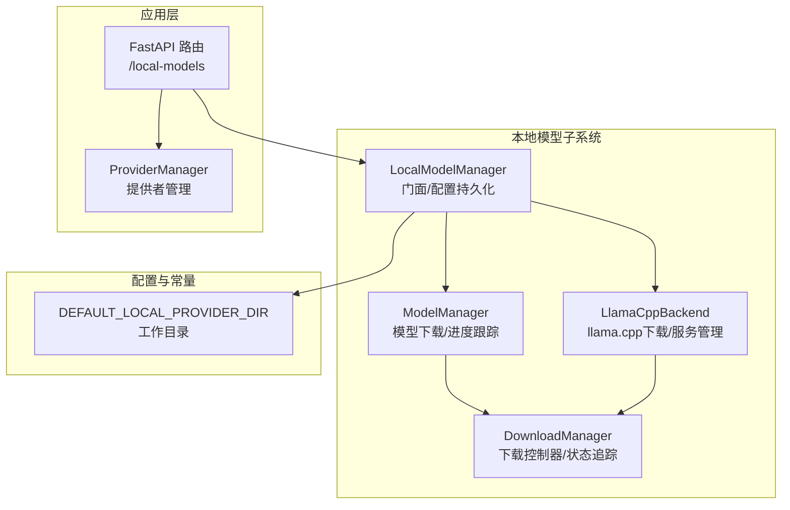
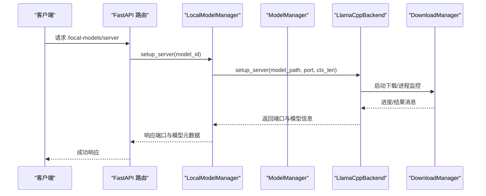
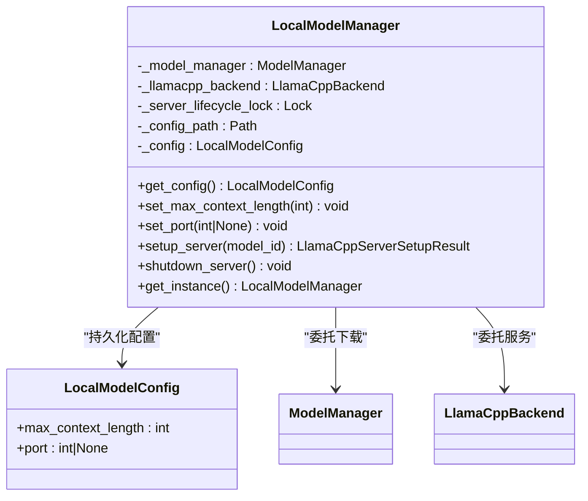
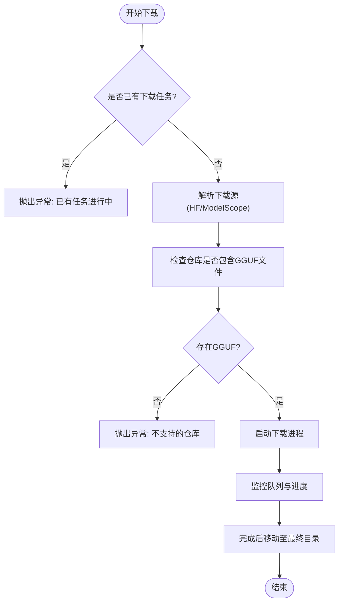
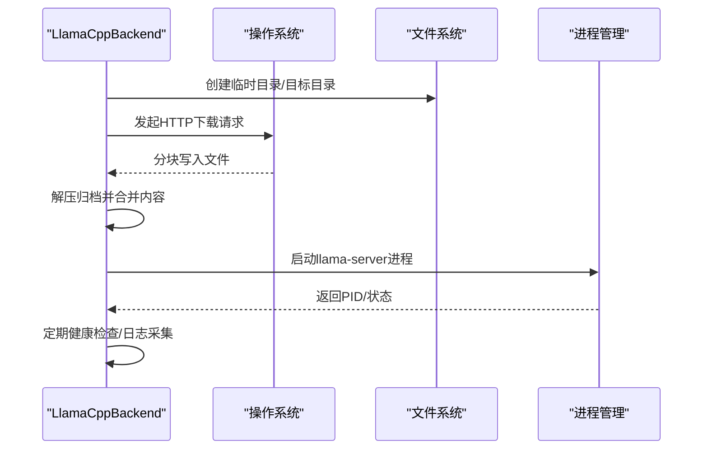
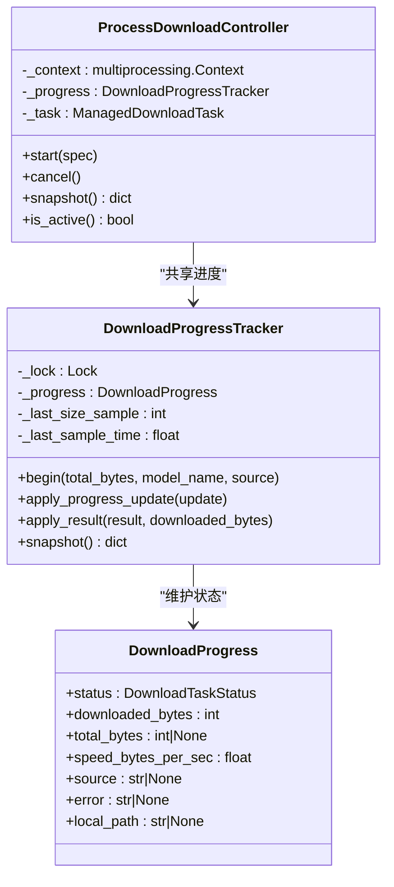
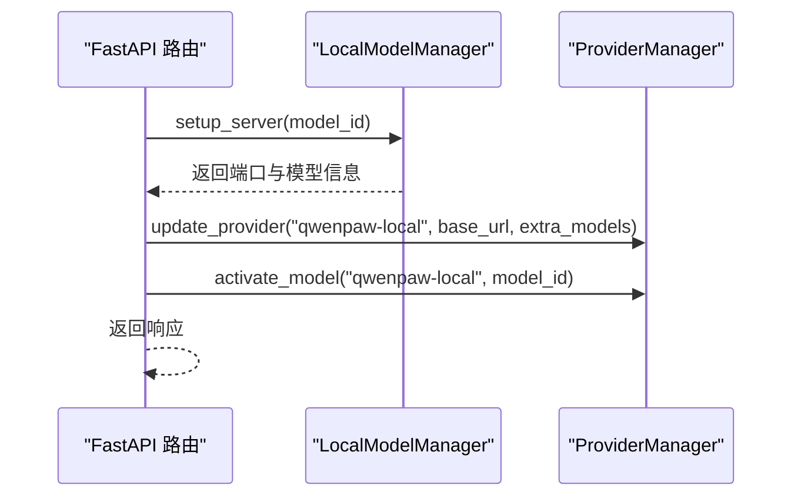
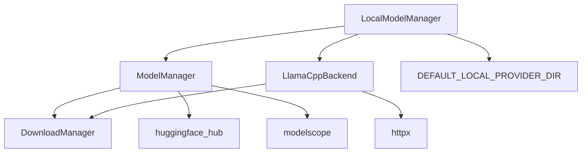

# 本地模型架构设计

<cite>
**本文档引用的文件**
- [manager.py](file://src/qwenpaw/local_models/manager.py)
- [model_manager.py](file://src/qwenpaw/local_models/model_manager.py)
- [llamacpp.py](file://src/qwenpaw/local_models/llamacpp.py)
- [download_manager.py](file://src/qwenpaw/local_models/download_manager.py)
- [__init__.py](file://src/qwenpaw/local_models/__init__.py)
- [local_models.py](file://src/qwenpaw/app/routers/local_models.py)
- [constant.py](file://src/qwenpaw/constant.py)
- [test_local_model_manager.py](file://tests/unit/local_models/test_local_model_manager.py)
- [test_llamacpp_backend.py](file://tests/unit/local_models/test_llamacpp_backend.py)
</cite>

## 目录
1. [简介](#简介)
2. [项目结构](#项目结构)
3. [核心组件](#核心组件)
4. [架构总览](#架构总览)
5. [详细组件分析](#详细组件分析)
6. [依赖关系分析](#依赖关系分析)
7. [性能考虑](#性能考虑)
8. [故障排除指南](#故障排除指南)
9. [结论](#结论)

## 简介

本文件针对 QwenPaw 的本地模型架构设计进行深入技术文档化，重点阐述 LocalModelManager 作为门面模式的实现原理、单例模式的应用与线程安全保证、与 llama.cpp 后端的解耦设计，以及配置持久化的机制。文档通过架构图、组件交互流程和数据流图，系统性地解释各模块间的依赖关系、控制流转和数据传递路径，并提供性能影响与扩展性设计的技术考量。

## 项目结构

本地模型相关的核心代码位于 `src/qwenpaw/local_models/` 目录下，主要包含以下文件：
- `manager.py`: LocalModelManager 门面类，负责统一入口与配置持久化
- `model_manager.py`: 模型下载与管理逻辑，支持多源下载与进度跟踪
- `llamacpp.py`: llama.cpp 后端封装，负责二进制下载、服务器启动与健康检查
- `download_manager.py`: 下载任务的状态追踪、队列通信与进程控制
- `__init__.py`: 导出本地模型相关类型与类
- `local_models.py` (在 `src/qwenpaw/app/routers/`): FastAPI 路由层，对外暴露本地模型管理接口

**图表来源**
- [manager.py:1-244](file://src/qwenpaw/local_models/manager.py#L1-L244)
- [model_manager.py:1-654](file://src/qwenpaw/local_models/model_manager.py#L1-L654)
- [llamacpp.py:1-926](file://src/qwenpaw/local_models/llamacpp.py#L1-L926)
- [download_manager.py:1-599](file://src/qwenpaw/local_models/download_manager.py#L1-L599)
- [local_models.py:1-496](file://src/qwenpaw/app/routers/local_models.py#L1-L496)
- [constant.py:134-135](file://src/qwenpaw/constant.py#L134-L135)

**章节来源**
- [manager.py:1-244](file://src/qwenpaw/local_models/manager.py#L1-L244)
- [model_manager.py:1-654](file://src/qwenpaw/local_models/model_manager.py#L1-L654)
- [llamacpp.py:1-926](file://src/qwenpaw/local_models/llamacpp.py#L1-L926)
- [download_manager.py:1-599](file://src/qwenpaw/local_models/download_manager.py#L1-L599)
- [local_models.py:1-496](file://src/qwenpaw/app/routers/local_models.py#L1-L496)
- [constant.py:134-135](file://src/qwenpaw/constant.py#L134-L135)

## 核心组件

- LocalModelManager（门面/单例）
  - 统一入口：封装模型下载、llama.cpp 二进制下载、服务器生命周期管理
  - 配置持久化：以 JSON 文件形式保存运行时配置（上下文长度、端口等）
  - 线程安全：使用异步锁保护服务器生命周期操作
  - 单例模式：提供静态方法返回全局唯一实例

- ModelManager（模型下载管理）
  - 多源下载：支持 HuggingFace 与 ModelScope，自动探测可达源
  - 进度追踪：基于进程间通信与队列的消息传递
  - 目录管理：推荐模型、已下载模型枚举、删除与清理

- LlamaCppBackend（llama.cpp 后端）
  - 二进制下载：根据平台选择合适的包名，支持断点续传与错误映射
  - 服务器管理：启动/停止进程、健康检查、日志采集、设备列表查询
  - 端口解析：自动分配可用端口或使用固定端口

- DownloadManager（下载基础设施）
  - 任务状态：统一的任务生命周期与状态机
  - 进度计算：基于时间戳的速度计算与字节统计
  - 进程控制：基于 multiprocessing 的后台下载任务与监控线程

**章节来源**
- [manager.py:41-244](file://src/qwenpaw/local_models/manager.py#L41-L244)
- [model_manager.py:63-654](file://src/qwenpaw/local_models/model_manager.py#L63-L654)
- [llamacpp.py:51-926](file://src/qwenpaw/local_models/llamacpp.py#L51-L926)
- [download_manager.py:25-599](file://src/qwenpaw/local_models/download_manager.py#L25-L599)

## 架构总览

LocalModelManager 采用门面模式对外提供统一接口，内部协调 ModelManager 与 LlamaCppBackend 的职责分离，形成“配置持久化 + 下载管理 + 服务器管理”的三层架构。应用层通过 FastAPI 路由调用 LocalModelManager，再由其驱动底层组件完成实际任务。

**图表来源**
- [local_models.py:294-324](file://src/qwenpaw/app/routers/local_models.py#L294-L324)
- [manager.py:214-225](file://src/qwenpaw/local_models/manager.py#L214-L225)
- [llamacpp.py:217-312](file://src/qwenpaw/local_models/llamacpp.py#L217-L312)

## 详细组件分析

### LocalModelManager（门面与单例）

- 设计理念
  - 门面模式：对外暴露统一接口，隐藏内部组件细节
  - 单例模式：通过静态方法确保全局唯一实例，简化依赖注入
  - 配置持久化：以 JSON 文件保存运行时参数，避免重启丢失

- 关键实现要点
  - 异步锁保护：`_server_lifecycle_lock` 保证服务器启动/关闭的互斥
  - 配置加载/写入：从默认工作目录下的 config.json 加载与写回
  - 方法代理：将模型下载、服务器状态查询、下载进度等委托给内部组件

- 线程安全与并发
  - 使用 asyncio.Lock 保护服务器生命周期操作
  - 配置写入通过 asyncio.to_thread 在工作线程执行，避免阻塞事件循环

**图表来源**
- [manager.py:41-244](file://src/qwenpaw/local_models/manager.py#L41-L244)
- [manager.py:23-40](file://src/qwenpaw/local_models/manager.py#L23-L40)

**章节来源**
- [manager.py:41-244](file://src/qwenpaw/local_models/manager.py#L41-L244)
- [test_local_model_manager.py:134-300](file://tests/unit/local_models/test_local_model_manager.py#L134-L300)

### ModelManager（模型下载与管理）

- 功能特性
  - 推荐模型：根据内存容量自动推荐适合的模型
  - 多源下载：优先 HuggingFace，不可达时回退到 ModelScope
  - 进度追踪：通过队列与监控线程实时更新下载进度
  - 目录管理：枚举已下载模型、删除与清理空目录

- 进程化下载
  - 使用 multiprocessing 在独立进程中执行下载，避免阻塞主线程
  - 通过 DownloadProgressTracker 与 DownloadProgressUpdate 统一进度格式

**图表来源**
- [model_manager.py:181-250](file://src/qwenpaw/local_models/model_manager.py#L181-L250)
- [model_manager.py:264-285](file://src/qwenpaw/local_models/model_manager.py#L264-L285)
- [download_manager.py:368-599](file://src/qwenpaw/local_models/download_manager.py#L368-L599)

**章节来源**
- [model_manager.py:63-654](file://src/qwenpaw/local_models/model_manager.py#L63-L654)
- [download_manager.py:198-599](file://src/qwenpaw/local_models/download_manager.py#L198-L599)

### LlamaCppBackend（llama.cpp 后端）

- 二进制下载
  - 平台适配：根据操作系统与架构选择对应包名
  - 错误映射：将 HTTP 状态码映射为用户可读的错误信息
  - 归档处理：解压并合并顶层目录，确保安装路径正确

- 服务器管理
  - 进程启动：构建命令行参数，设置日志文件与 GPU 层数
  - 健康检查：定期轮询 /health 接口判断就绪状态
  - 日志采集：异步读取标准输出，记录调试信息
  - 设备查询：通过命令行参数列出可用设备

**图表来源**
- [llamacpp.py:146-215](file://src/qwenpaw/local_models/llamacpp.py#L146-L215)
- [llamacpp.py:354-408](file://src/qwenpaw/local_models/llamacpp.py#L354-L408)
- [llamacpp.py:695-730](file://src/qwenpaw/local_models/llamacpp.py#L695-L730)

**章节来源**
- [llamacpp.py:51-926](file://src/qwenpaw/local_models/llamacpp.py#L51-L926)
- [test_llamacpp_backend.py:594-721](file://tests/unit/local_models/test_llamacpp_backend.py#L594-L721)

### DownloadManager（下载基础设施）

- 状态机与消息协议
  - DownloadTaskStatus：统一的任务生命周期状态
  - DownloadProgressUpdate/DownloadTaskResult：跨进程边界的消息格式
  - DownloadProgressTracker：线程安全的状态与速度计算

- 进程控制
  - ProcessDownloadController：管理单一下载任务的进程与监控线程
  - 取消与清理：优雅终止进程并释放资源

**图表来源**
- [download_manager.py:198-599](file://src/qwenpaw/local_models/download_manager.py#L198-L599)

**章节来源**
- [download_manager.py:25-599](file://src/qwenpaw/local_models/download_manager.py#L25-L599)

### 应用集成与路由层

- 路由设计
  - /local-models/server：服务器状态检查、下载、启动、停止
  - /local-models/models：模型列表与下载进度
  - /local-models/config：配置读取与更新

- 与 ProviderManager 的协作
  - 启动服务器成功后，更新本地提供者的 base_url 与 extra_models
  - 停止服务器时清理提供者状态

**图表来源**
- [local_models.py:289-324](file://src/qwenpaw/app/routers/local_models.py#L289-L324)

**章节来源**
- [local_models.py:1-496](file://src/qwenpaw/app/routers/local_models.py#L1-L496)

## 依赖关系分析

- 内部依赖
  - LocalModelManager 依赖 ModelManager 与 LlamaCppBackend
  - ModelManager 与 LlamaCppBackend 共同依赖 DownloadManager
  - 所有组件均依赖 DEFAULT_LOCAL_PROVIDER_DIR 作为工作目录

- 外部依赖
  - huggingface_hub 与 modelscope：用于模型仓库下载
  - httpx：网络请求与流式下载
  - multiprocessing：后台下载任务隔离

**图表来源**
- [manager.py:13-17](file://src/qwenpaw/local_models/manager.py#L13-L17)
- [model_manager.py:38-40](file://src/qwenpaw/local_models/model_manager.py#L38-L40)
- [llamacpp.py:16-17](file://src/qwenpaw/local_models/llamacpp.py#L16-L17)
- [constant.py:134-135](file://src/qwenpaw/constant.py#L134-L135)

**章节来源**
- [manager.py:1-244](file://src/qwenpaw/local_models/manager.py#L1-L244)
- [model_manager.py:1-654](file://src/qwenpaw/local_models/model_manager.py#L1-L654)
- [llamacpp.py:1-926](file://src/qwenpaw/local_models/llamacpp.py#L1-L926)
- [constant.py:134-135](file://src/qwenpaw/constant.py#L134-L135)

## 性能考虑

- I/O 与并发
  - 下载与服务器启动均为 I/O 密集型任务，采用异步与进程隔离降低阻塞
  - 进度计算基于时间戳差值，避免频繁磁盘扫描

- 线程安全与锁粒度
  - 服务器生命周期使用细粒度异步锁，减少临界区范围
  - 配置写入通过工作线程执行，避免事件循环阻塞

- 存储与清理
  - 临时目录与最终目录分离，完成后原子移动，减少碎片
  - 删除模型时递归清理空父目录，保持目录树整洁

- 网络与错误处理
  - 下载失败映射为用户可读错误，便于快速定位问题
  - 健康检查超时与重试策略平衡稳定性与响应速度

[本节为通用性能讨论，无需特定文件引用]

## 故障排除指南

- 无法启动服务器
  - 检查环境是否满足安装要求（如 macOS 版本、CUDA 版本）
  - 查看健康检查日志，确认端口占用与进程状态

- 下载失败
  - 检查网络连通性与仓库可用性
  - 查看错误映射信息，确认 HTTP 状态码与权限问题

- 配置不生效
  - 确认配置文件路径与权限
  - 检查持久化写入是否被中断

**章节来源**
- [llamacpp.py:625-659](file://src/qwenpaw/local_models/llamacpp.py#L625-L659)
- [manager.py:65-107](file://src/qwenpaw/local_models/manager.py#L65-L107)
- [test_llamacpp_backend.py:611-721](file://tests/unit/local_models/test_llamacpp_backend.py#L611-L721)

## 结论

LocalModelManager 通过门面模式实现了对本地模型管理的统一入口，结合单例模式与配置持久化，提供了稳定可靠的用户体验。与 llama.cpp 后端的解耦设计使得下载与服务管理职责清晰分离，配合 DownloadManager 的进程化与线程安全机制，整体架构具备良好的扩展性与可维护性。未来可在以下方面进一步优化：
- 提供更细粒度的配置项与校验规则
- 增强断点续传与重试策略
- 支持多服务器并行管理与负载均衡