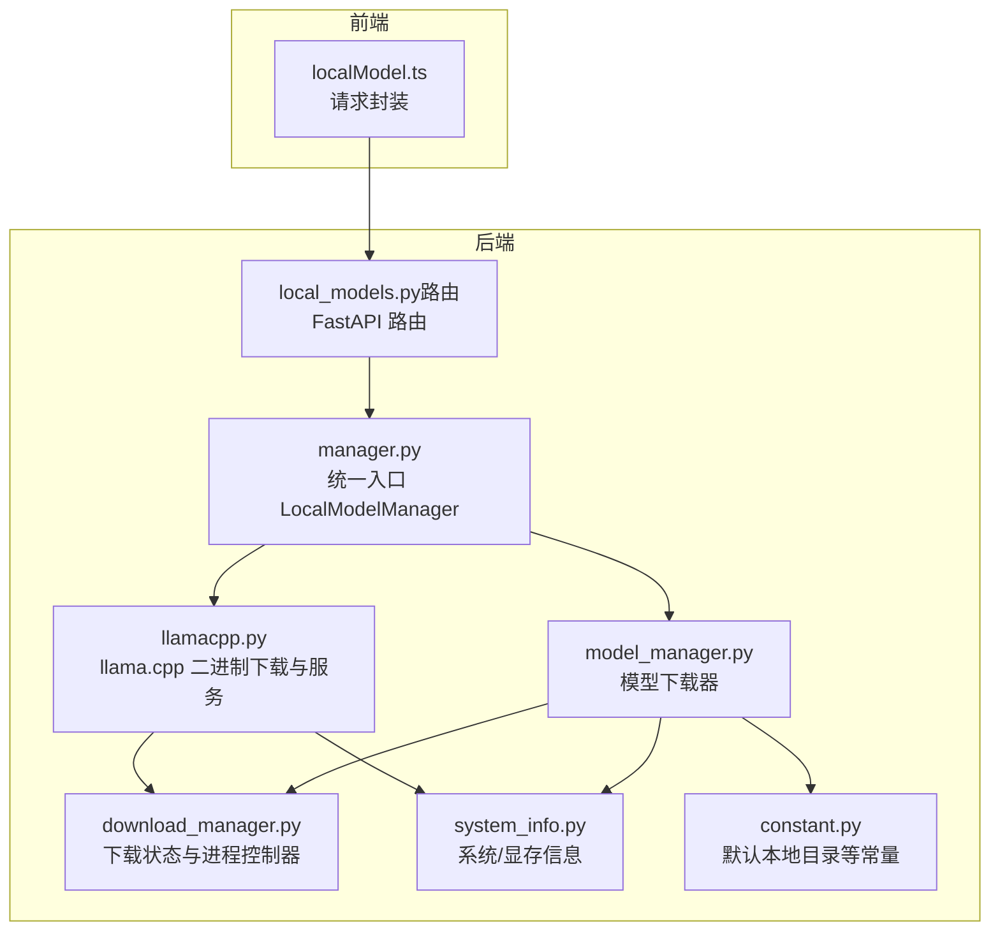
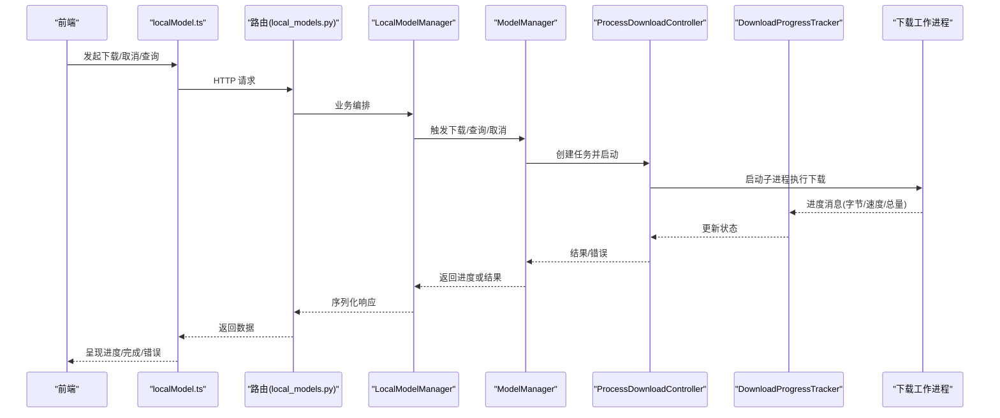
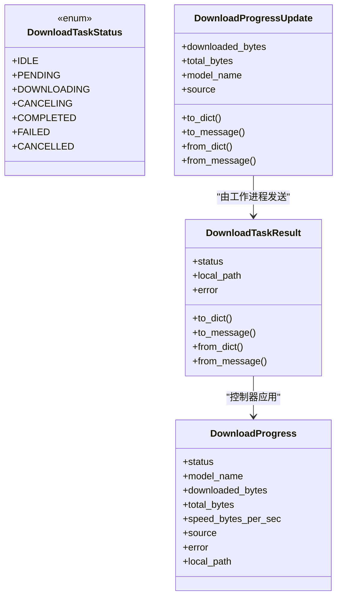
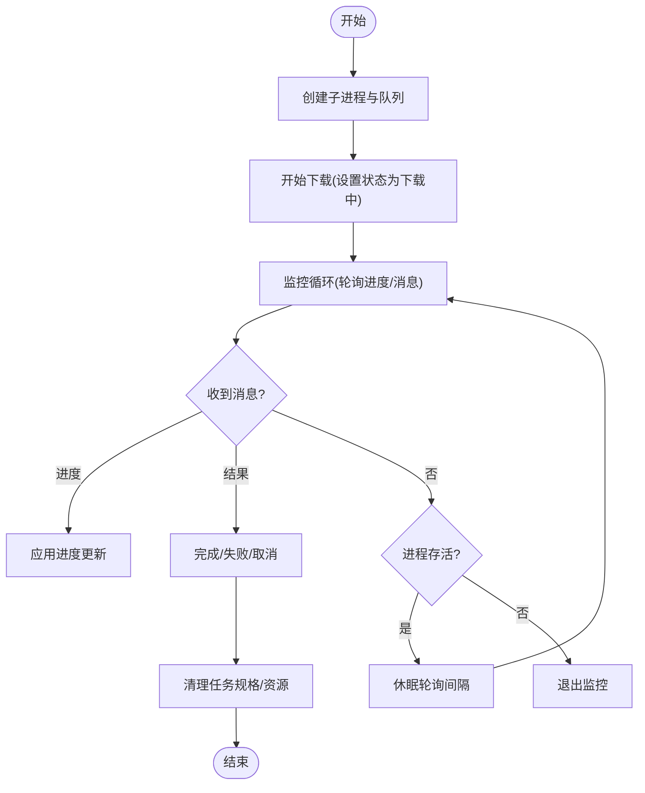
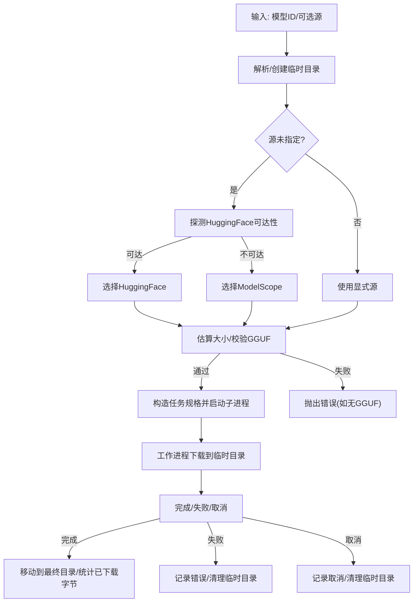
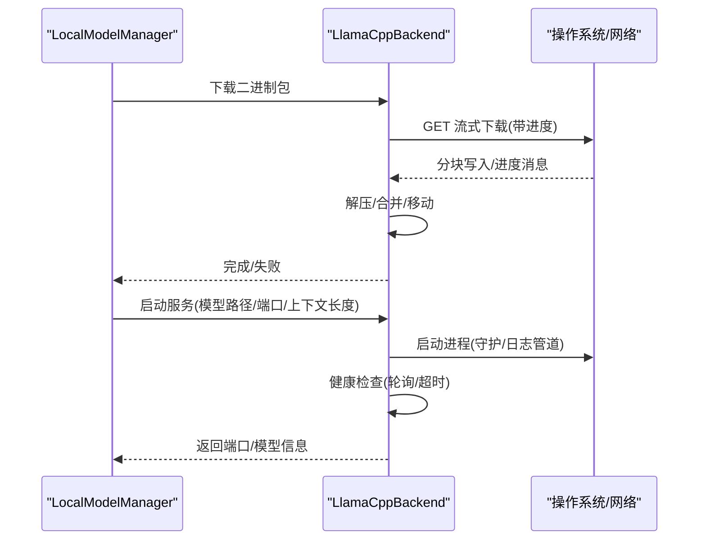
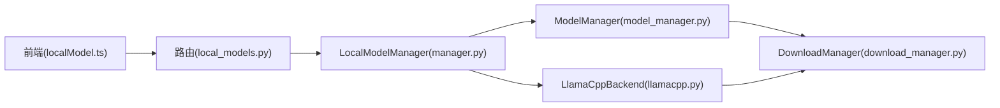
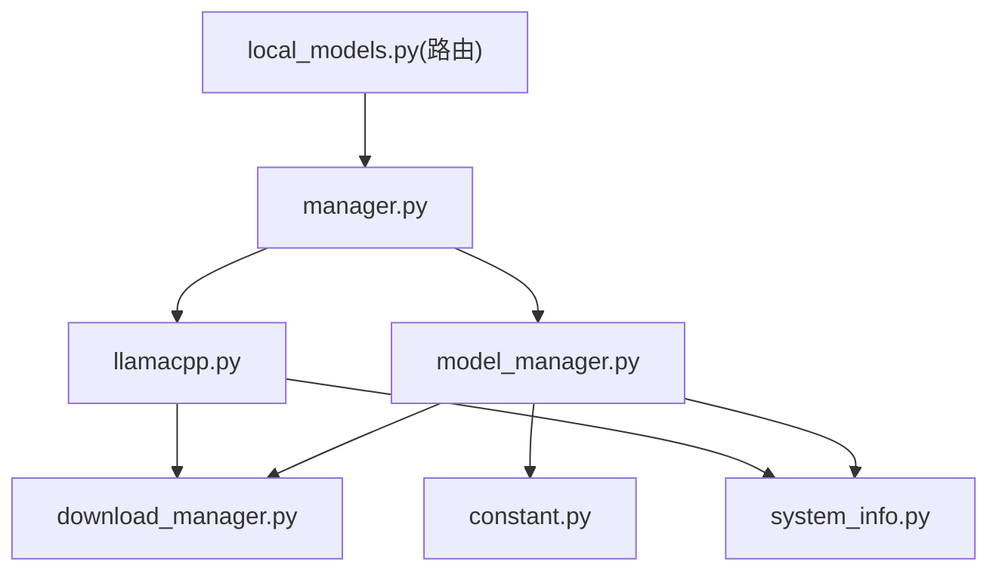

# 模型下载与管理

<cite>
**本文引用的文件**
- [download_manager.py](file://src/qwenpaw/local_models/download_manager.py)
- [model_manager.py](file://src/qwenpaw/local_models/model_manager.py)
- [llamacpp.py](file://src/qwenpaw/local_models/llamacpp.py)
- [local_models.py（路由）](file://src/qwenpaw/app/routers/local_models.py)
- [localModel.ts（前端API封装）](file://console/src/api/modules/localModel.ts)
- [manager.py](file://src/qwenpaw/local_models/manager.py)
- [constant.py](file://src/qwenpaw/constant.py)
- [system_info.py](file://src/qwenpaw/utils/system_info.py)
- [test_download_manager.py](file://tests/unit/local_models/test_download_manager.py)
- [test_model_manager.py](file://tests/unit/local_models/test_model_manager.py)
</cite>

## 目录
1. [简介](#简介)
2. [项目结构](#项目结构)
3. [核心组件](#核心组件)
4. [架构总览](#架构总览)
5. [详细组件分析](#详细组件分析)
6. [依赖分析](#依赖分析)
7. [性能考虑](#性能考虑)
8. [故障排查指南](#故障排查指南)
9. [结论](#结论)
10. [附录：下载源与镜像配置](#附录下载源与镜像配置)

## 简介
本技术文档围绕 QwenPaw 的“本地模型下载与管理”能力，系统阐述以下主题：
- 下载进度跟踪、断点续传与错误重试机制
- 推荐模型列表的生成算法与硬件适配策略
- 多下载源选择策略与镜像服务器配置
- 模型存储结构、文件完整性校验与版本管理
- 下载性能优化、并发控制与资源限制

目标是帮助开发者与运维人员快速理解并扩展该模块，同时为前端与后端集成提供清晰的参考。

## 项目结构
与“模型下载与管理”直接相关的代码主要分布在如下位置：
- 后端核心逻辑：src/qwenpaw/local_models
- 路由接口：src/qwenpaw/app/routers/local_models.py
- 前端 API 封装：console/src/api/modules/localModel.ts
- 公共常量与工作目录：src/qwenpaw/constant.py
- 系统信息探测：src/qwenpaw/utils/system_info.py
- 单元测试：tests/unit/local_models

图表来源
- [download_manager.py:1-599](file://src/qwenpaw/local_models/download_manager.py#L1-L599)
- [model_manager.py:1-654](file://src/qwenpaw/local_models/model_manager.py#L1-L654)
- [manager.py:1-244](file://src/qwenpaw/local_models/manager.py#L1-L244)
- [llamacpp.py:1-926](file://src/qwenpaw/local_models/llamacpp.py#L1-L926)
- [local_models.py（路由）:1-496](file://src/qwenpaw/app/routers/local_models.py#L1-L496)
- [system_info.py:1-228](file://src/qwenpaw/utils/system_info.py#L1-L228)
- [constant.py:1-368](file://src/qwenpaw/constant.py#L1-L368)
- [localModel.ts（前端API封装）:1-68](file://console/src/api/modules/localModel.ts#L1-L68)

章节来源
- [local_models.py（路由）:1-496](file://src/qwenpaw/app/routers/local_models.py#L1-L496)
- [manager.py:1-244](file://src/qwenpaw/local_models/manager.py#L1-L244)
- [model_manager.py:1-654](file://src/qwenpaw/local_models/model_manager.py#L1-L654)
- [download_manager.py:1-599](file://src/qwenpaw/local_models/download_manager.py#L1-L599)
- [llamacpp.py:1-926](file://src/qwenpaw/local_models/llamacpp.py#L1-L926)
- [constant.py:134-135](file://src/qwenpaw/constant.py#L134-L135)
- [system_info.py:135-144](file://src/qwenpaw/utils/system_info.py#L135-L144)
- [localModel.ts（前端API封装）:1-68](file://console/src/api/modules/localModel.ts#L1-L68)

## 核心组件
- 下载状态与消息协议：统一的进度与结果消息类型，支持跨进程传递。
- 进程化下载控制器：以子进程执行阻塞式下载，主线程通过队列与监控线程更新进度。
- 模型下载器：负责推荐模型生成、源探测、大小估算、GGUF 文件存在性检查、分阶段落地与清理。
- llama.cpp 后端：负责二进制包下载、解压、安装、服务启动与健康检查。
- 统一入口管理器：对外暴露统一 API，协调模型下载与 llama.cpp 服务生命周期。
- 路由层：FastAPI 提供 REST 接口，返回标准化响应。
- 前端 API 封装：对后端接口进行调用封装，便于控制台使用。

章节来源
- [download_manager.py:25-128](file://src/qwenpaw/local_models/download_manager.py#L25-L128)
- [model_manager.py:63-135](file://src/qwenpaw/local_models/model_manager.py#L63-L135)
- [llamacpp.py:51-110](file://src/qwenpaw/local_models/llamacpp.py#L51-L110)
- [manager.py:41-244](file://src/qwenpaw/local_models/manager.py#L41-L244)
- [local_models.py（路由）:23-496](file://src/qwenpaw/app/routers/local_models.py#L23-L496)
- [localModel.ts（前端API封装）:1-68](file://console/src/api/modules/localModel.ts#L1-L68)

## 架构总览
整体采用“统一入口 + 进程化下载 + 状态追踪”的架构，保证下载过程可观察、可中断、可恢复。

图表来源
- [local_models.py（路由）:351-420](file://src/qwenpaw/app/routers/local_models.py#L351-L420)
- [manager.py:194-208](file://src/qwenpaw/local_models/manager.py#L194-L208)
- [model_manager.py:181-244](file://src/qwenpaw/local_models/model_manager.py#L181-L244)
- [download_manager.py:368-491](file://src/qwenpaw/local_models/download_manager.py#L368-L491)

## 详细组件分析

### 下载状态与消息协议
- DownloadProgress：统一的进度快照，包含状态、已下载字节、总字节、速度、来源、错误、本地路径等。
- DownloadTaskResult：终端结果，携带最终状态与本地路径或错误信息。
- DownloadProgressUpdate：增量进度更新，用于从工作进程向控制器推送。
- DownloadTaskStatus：生命周期状态机，覆盖空闲、待定、下载中、取消中、已完成、失败、已取消。
- 消息类型：PROGRESS/RESULT，通过队列在进程间传递。

图表来源
- [download_manager.py:25-128](file://src/qwenpaw/local_models/download_manager.py#L25-L128)

章节来源
- [download_manager.py:25-128](file://src/qwenpaw/local_models/download_manager.py#L25-L128)

### 进程化下载控制器
- 使用多进程上下文启动子进程执行阻塞式下载，避免阻塞主线程。
- 监控线程周期轮询进度更新与队列消息，处理终端结果与异常。
- 支持取消：向控制器请求取消，控制器通过设置状态并终止子进程实现优雅停止。
- 资源回收：关闭队列、等待/关闭进程，确保资源释放。

图表来源
- [download_manager.py:368-599](file://src/qwenpaw/local_models/download_manager.py#L368-L599)

章节来源
- [download_manager.py:368-599](file://src/qwenpaw/local_models/download_manager.py#L368-L599)

### 模型下载器（推荐与下载）
- 推荐模型生成：根据系统内存（优先显存）自动匹配适合的模型组合，并标注是否已下载。
- 源探测与选择：优先探测 HuggingFace 可达性，否则回退到 ModelScope；也可显式指定源。
- 大小估算与文件校验：分别从两个源拉取仓库元数据，计算总字节数；检查是否存在至少一个 .gguf 文件。
- 分阶段落地：先写入临时目录，完成后移动至最终目录；失败时清理临时目录。
- 并发与取消：同一时间仅允许一个下载任务；支持取消并清理。

图表来源
- [model_manager.py:181-286](file://src/qwenpaw/local_models/model_manager.py#L181-L286)
- [model_manager.py:287-320](file://src/qwenpaw/local_models/model_manager.py#L287-L320)
- [model_manager.py:474-517](file://src/qwenpaw/local_models/model_manager.py#L474-L517)

章节来源
- [model_manager.py:63-135](file://src/qwenpaw/local_models/model_manager.py#L63-L135)
- [model_manager.py:181-286](file://src/qwenpaw/local_models/model_manager.py#L181-L286)
- [model_manager.py:287-320](file://src/qwenpaw/local_models/model_manager.py#L287-L320)
- [model_manager.py:474-517](file://src/qwenpaw/local_models/model_manager.py#L474-L517)

### llama.cpp 后端（二进制下载与服务）
- 二进制下载：根据平台/架构/显卡版本拼接下载包名，流式下载+进度上报，解压后移动到目标目录。
- 服务启动：解析模型文件（优先 .gguf，支持 mmproj），构建命令行参数，启动本地服务并进行健康检查。
- 版本与更新：支持检测当前版本与最新版本，按需提示更新。
- 端口与日志：自动分配可用端口，异步读取服务日志并记录。

图表来源
- [llamacpp.py:146-215](file://src/qwenpaw/local_models/llamacpp.py#L146-L215)
- [llamacpp.py:217-312](file://src/qwenpaw/local_models/llamacpp.py#L217-L312)
- [llamacpp.py:550-624](file://src/qwenpaw/local_models/llamacpp.py#L550-L624)

章节来源
- [llamacpp.py:51-110](file://src/qwenpaw/local_models/llamacpp.py#L51-L110)
- [llamacpp.py:146-215](file://src/qwenpaw/local_models/llamacpp.py#L146-L215)
- [llamacpp.py:217-312](file://src/qwenpaw/local_models/llamacpp.py#L217-L312)
- [llamacpp.py:550-624](file://src/qwenpaw/local_models/llamacpp.py#L550-L624)

### 统一入口管理器与路由
- LocalModelManager：聚合模型下载与 llama.cpp 服务管理，提供配置持久化、并发锁保护、状态查询与操作。
- 路由层：提供“获取推荐/下载/进度/取消/删除模型”，以及“下载/查询/取消 llama.cpp 二进制”等接口。
- 前端封装：console 端通过 localModel.ts 对应调用后端接口。

图表来源
- [manager.py:41-244](file://src/qwenpaw/local_models/manager.py#L41-L244)
- [local_models.py（路由）:23-496](file://src/qwenpaw/app/routers/local_models.py#L23-L496)
- [localModel.ts（前端API封装）:1-68](file://console/src/api/modules/localModel.ts#L1-L68)

章节来源
- [manager.py:41-244](file://src/qwenpaw/local_models/manager.py#L41-L244)
- [local_models.py（路由）:1-496](file://src/qwenpaw/app/routers/local_models.py#L1-L496)
- [localModel.ts（前端API封装）:1-68](file://console/src/api/modules/localModel.ts#L1-L68)

## 依赖分析
- 内部依赖
  - model_manager 依赖 download_manager（状态追踪/进程控制）、system_info（内存/显存探测）、constant（默认目录）。
  - llamacpp 依赖 download_manager（复用下载框架）、system_info（平台/架构/CUDA）、command_runner（进程管理）。
  - manager 聚合两者，提供统一 API。
  - 路由层依赖 manager 与 provider 管理器，实现服务注册与激活。
- 外部依赖
  - HuggingFace Hub 与 ModelScope SDK（用于仓库元数据与快照下载）。
  - httpx（网络请求与流式下载）。
  - 进程/线程与队列（multiprocessing/queue/threading）。

图表来源
- [model_manager.py:1-654](file://src/qwenpaw/local_models/model_manager.py#L1-L654)
- [llamacpp.py:1-926](file://src/qwenpaw/local_models/llamacpp.py#L1-L926)
- [manager.py:1-244](file://src/qwenpaw/local_models/manager.py#L1-L244)
- [local_models.py（路由）:1-496](file://src/qwenpaw/app/routers/local_models.py#L1-L496)
- [system_info.py:1-228](file://src/qwenpaw/utils/system_info.py#L1-L228)
- [constant.py:134-135](file://src/qwenpaw/constant.py#L134-L135)

章节来源
- [model_manager.py:1-654](file://src/qwenpaw/local_models/model_manager.py#L1-L654)
- [llamacpp.py:1-926](file://src/qwenpaw/local_models/llamacpp.py#L1-L926)
- [manager.py:1-244](file://src/qwenpaw/local_models/manager.py#L1-L244)
- [local_models.py（路由）:1-496](file://src/qwenpaw/app/routers/local_models.py#L1-L496)

## 性能考虑
- 进程隔离与非阻塞：下载在子进程中进行，主线程仅维护进度与状态，避免阻塞。
- 流式下载与进度上报：llama.cpp 下载采用流式分块写入，实时上报进度，降低首屏等待。
- 精准估算与断点续传：通过远程元数据估算总大小，结合临时目录与最终目录的原子移动，实现“类断点续传”（若中断则重新开始，但可复用已存在的部分文件）。
- 并发与资源限制
  - 同一时间仅允许一个下载任务，避免资源争用。
  - 通过系统信息探测（内存/显存）选择合适模型，减少运行期失败概率。
- I/O 与磁盘空间：下载前确保目标目录存在且可写，失败时清理临时目录，避免磁盘碎片与残留。

章节来源
- [download_manager.py:368-599](file://src/qwenpaw/local_models/download_manager.py#L368-L599)
- [llamacpp.py:550-624](file://src/qwenpaw/local_models/llamacpp.py#L550-L624)
- [model_manager.py:181-286](file://src/qwenpaw/local_models/model_manager.py#L181-L286)
- [system_info.py:135-144](file://src/qwenpaw/utils/system_info.py#L135-L144)

## 故障排查指南
- 下载失败
  - 检查网络连通性与源可达性（HuggingFace/ModelScope）。
  - 查看后端日志中的错误消息（包含 HTTP 状态码与格式化错误）。
  - 若为“无 GGUF 文件”，确认仓库包含 .gguf 文件或更换仓库。
- 进度停滞
  - 确认监控线程是否仍在轮询；检查队列是否被关闭或异常。
  - 在 finalize 阶段抛出异常会标记为失败并清理。
- 取消无效
  - 确认当前任务状态为“下载中”；控制器会在下一次轮询中响应取消。
- llama.cpp 启动失败
  - 检查平台/架构/显卡版本是否受支持。
  - 确认端口可用且未被占用；查看健康检查超时与日志输出。

章节来源
- [llamacpp.py:626-659](file://src/qwenpaw/local_models/llamacpp.py#L626-L659)
- [download_manager.py:492-537](file://src/qwenpaw/local_models/download_manager.py#L492-L537)
- [test_download_manager.py:1-260](file://tests/unit/local_models/test_download_manager.py#L1-L260)
- [test_model_manager.py:1-414](file://tests/unit/local_models/test_model_manager.py#L1-L414)

## 结论
该模块通过“统一入口 + 进程化下载 + 状态追踪”的设计，实现了可观察、可中断、可恢复的本地模型下载与 llama.cpp 服务管理。配合硬件感知的推荐算法与多源选择策略，能够在不同环境下稳定地提供高质量的本地推理体验。建议在生产环境中结合日志与健康检查机制，持续优化下载与服务启动的可靠性。

## 附录：下载源与镜像配置
- 默认镜像与版本
  - llama.cpp 二进制默认下载地址与版本可在统一入口中配置，便于集中管理与升级。
- 模型下载源
  - 自动策略：优先 Hugging Face，若不可达则回退到 ModelScope。
  - 显式策略：可通过请求参数指定源，绕过自动探测。
- 模型仓库要求
  - 必须包含至少一个 .gguf 文件，否则拒绝下载。
- 存储布局
  - 默认本地目录位于工作目录下的 local_models，模型文件按仓库 ID 的层级组织，最终目录为只读的最终落地方。
- 版本管理
  - llama.cpp 支持检测当前版本与最新版本，按需提示更新；模型下载不涉及版本号，仅依据仓库内容。

章节来源
- [manager.py:46-50](file://src/qwenpaw/local_models/manager.py#L46-L50)
- [model_manager.py:39-44](file://src/qwenpaw/local_models/model_manager.py#L39-L44)
- [model_manager.py:287-292](file://src/qwenpaw/local_models/model_manager.py#L287-L292)
- [model_manager.py:474-517](file://src/qwenpaw/local_models/model_manager.py#L474-L517)
- [constant.py:134-135](file://src/qwenpaw/constant.py#L134-L135)