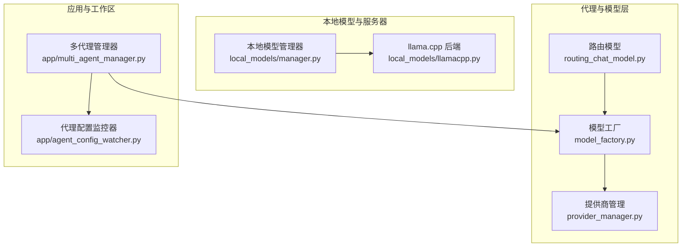
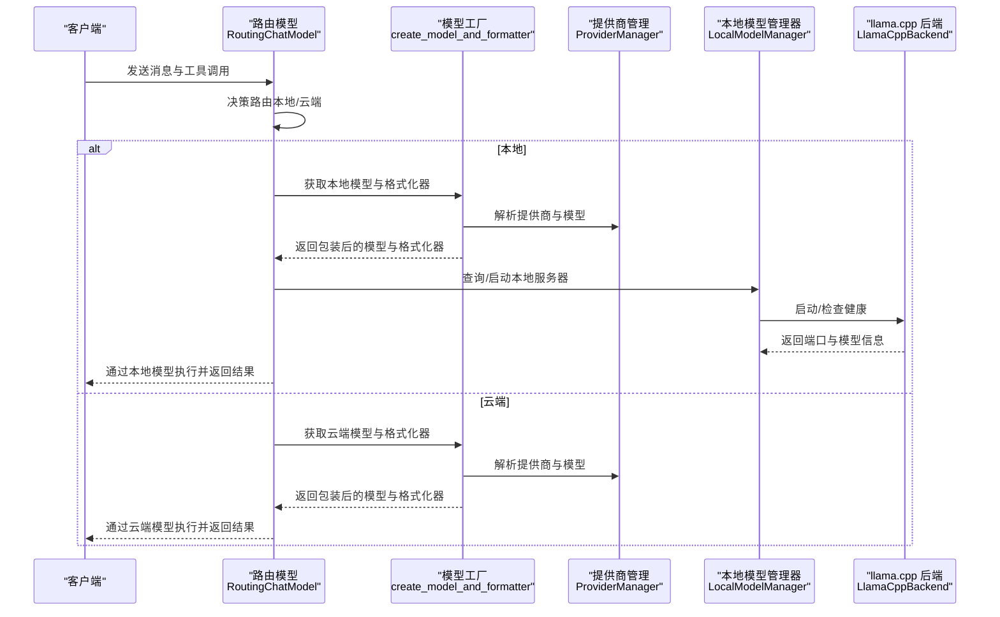
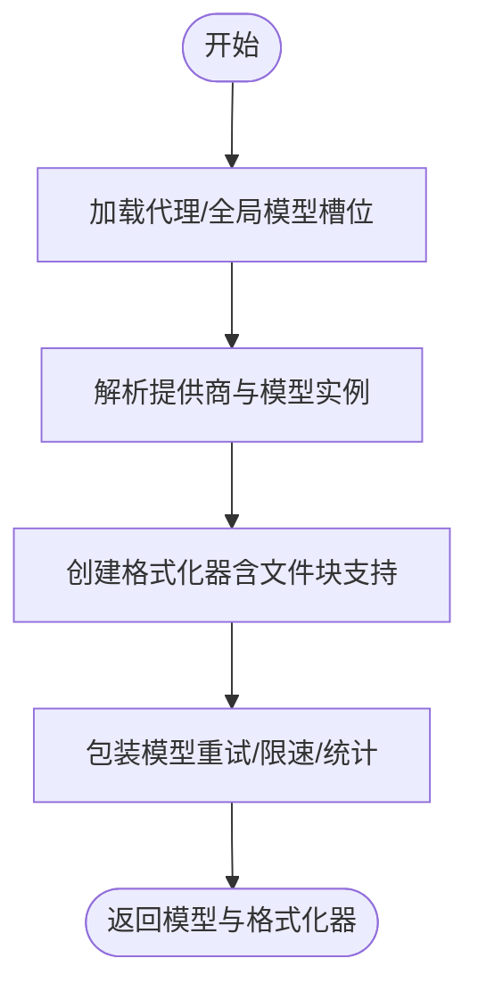
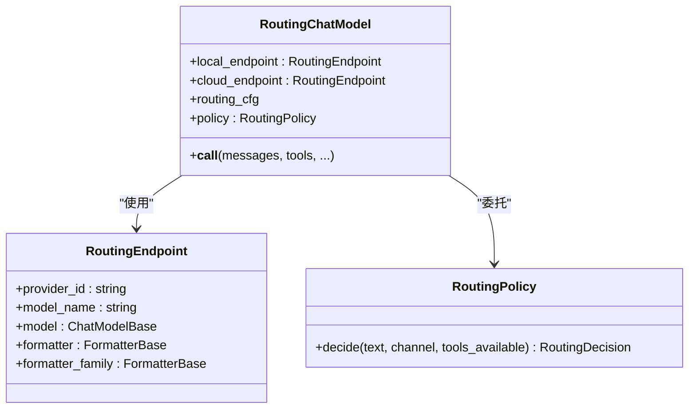
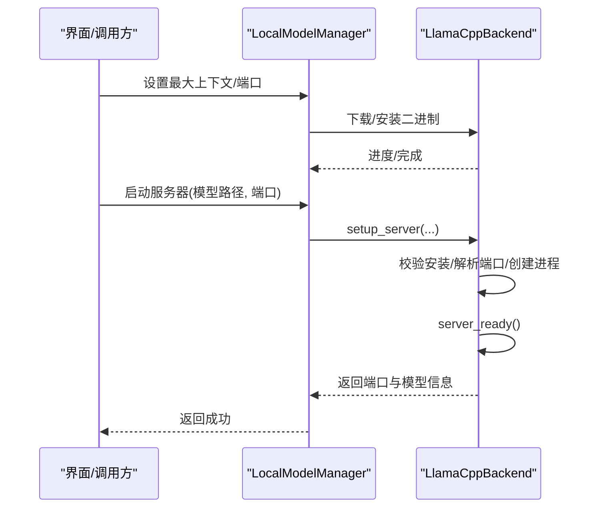
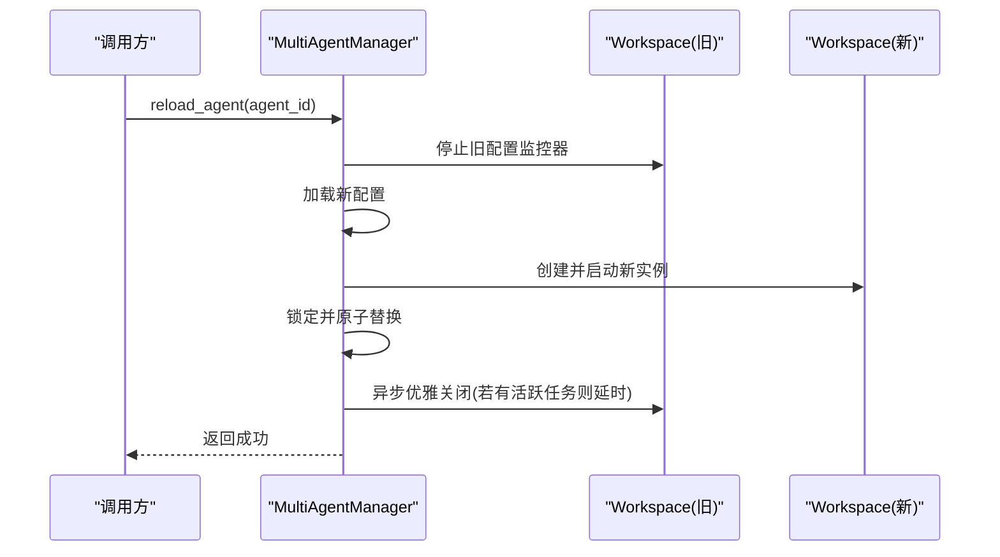
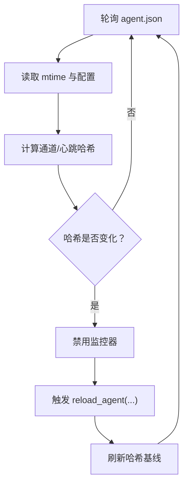
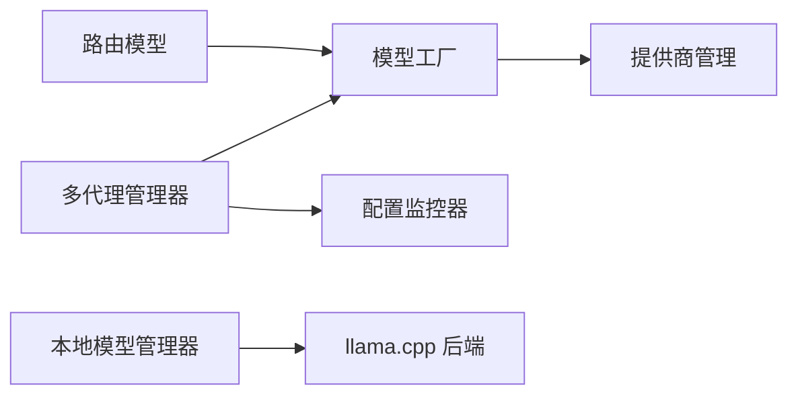

# 模型切换与管理

<cite>
**本文引用的文件**
- [model_factory.py](file://src/qwenpaw/agents/model_factory.py)
- [routing_chat_model.py](file://src/qwenpaw/agents/routing_chat_model.py)
- [manager.py](file://src/qwenpaw/local_models/manager.py)
- [llamacpp.py](file://src/qwenpaw/local_models/llamacpp.py)
- [multi_agent_manager.py](file://src/qwenpaw/app/multi_agent_manager.py)
- [agent_config_watcher.py](file://src/qwenpaw/app/agent_config_watcher.py)
- [provider_manager.py](file://src/qwenpaw/providers/provider_manager.py)
- [LocalModelManageModal.tsx](file://console/src/pages/Settings/Models/components/modals/LocalModelManageModal.tsx)
- [daemon_commands.py](file://src/qwenpaw/app/runner/daemon_commands.py)
- [plugins.py](file://src/qwenpaw/app/routers/plugins.py)
</cite>

## 目录
1. [简介](#简介)
2. [项目结构](#项目结构)
3. [核心组件](#核心组件)
4. [架构总览](#架构总览)
5. [详细组件分析](#详细组件分析)
6. [依赖分析](#依赖分析)
7. [性能考虑](#性能考虑)
8. [故障排查指南](#故障排查指南)
9. [结论](#结论)
10. [附录](#附录)

## 简介
本技术文档围绕 QwenPaw 的“模型切换与管理”能力展开，系统阐述以下主题：
- 模型热切换机制：如何在不中断服务的前提下完成模型实例替换，确保通道、定时任务、MCP 等子系统的连续性。
- 配置变更处理流程：参数调整、重新加载与重启策略，以及配置监控与自动触发。
- 多模型并行运行：本地 llama.cpp 服务器与云端模型的并行部署、资源隔离与端口管理。
- 兼容性与迁移：模型能力探测、版本更新与回滚策略。
- 生命周期管理：自动切换触发条件（如配置变更）与手动干预操作。

## 项目结构
与模型切换与管理直接相关的核心模块分布如下：
- 代理层与模型工厂：负责根据配置选择具体模型与格式化器，并封装重试与令牌统计。
- 路由模型：在本地与云端模型之间进行动态路由。
- 本地模型管理：封装 llama.cpp 下载、安装、服务器启停与状态查询。
- 多代理管理：支持零停机热重载，原子替换旧实例并优雅清理。
- 配置监控：监听 agent.json 变更，触发零停机重载。
- 提供商管理：统一管理内置与自定义提供商及其模型清单。

图示来源
- [model_factory.py](file://src/qwenpaw/agents/model_factory.py)
- [routing_chat_model.py](file://src/qwenpaw/agents/routing_chat_model.py)
- [manager.py](file://src/qwenpaw/local_models/manager.py)
- [llamacpp.py](file://src/qwenpaw/local_models/llamacpp.py)
- [multi_agent_manager.py](file://src/qwenpaw/app/multi_agent_manager.py)
- [agent_config_watcher.py](file://src/qwenpaw/app/agent_config_watcher.py)
- [provider_manager.py](file://src/qwenpaw/providers/provider_manager.py)

章节来源
- [model_factory.py](file://src/qwenpaw/agents/model_factory.py)
- [routing_chat_model.py](file://src/qwenpaw/agents/routing_chat_model.py)
- [manager.py](file://src/qwenpaw/local_models/manager.py)
- [llamacpp.py](file://src/qwenpaw/local_models/llamacpp.py)
- [multi_agent_manager.py](file://src/qwenpaw/app/multi_agent_manager.py)
- [agent_config_watcher.py](file://src/qwenpaw/app/agent_config_watcher.py)
- [provider_manager.py](file://src/qwenpaw/providers/provider_manager.py)

## 核心组件
- 模型工厂与格式化器
  - 基于代理或全局配置选择提供商与模型，创建适配的格式化器，并包裹重试与令牌统计。
  - 支持文件块工具结果输出的增强格式化器，兼容多模态媒体块处理。
- 路由模型
  - 在本地与云端模型之间按策略进行路由，当前策略依据配置模式（本地优先/云端优先）决定默认路径。
- 本地模型管理
  - 封装 llama.cpp 二进制下载、安装、服务器启动/停止、健康检查与状态查询；提供最大上下文长度与端口配置持久化。
- 多代理管理器
  - 实现零停机热重载：先创建新实例，再原子替换旧实例，最后异步优雅关闭旧实例，保证流式/事件连接不中断。
- 配置监控器
  - 定期轮询 agent.json，仅当通道与心跳等关键字段发生有意义变化时触发重载，避免误触发。
- 提供商管理
  - 统一注册内置提供商（如 OpenAI、DashScope、ModelScope 等），并维护模型清单与能力探测。

章节来源
- [model_factory.py](file://src/qwenpaw/agents/model_factory.py)
- [routing_chat_model.py](file://src/qwenpaw/agents/routing_chat_model.py)
- [manager.py](file://src/qwenpaw/local_models/manager.py)
- [llamacpp.py](file://src/qwenpaw/local_models/llamacpp.py)
- [multi_agent_manager.py](file://src/qwenpaw/app/multi_agent_manager.py)
- [agent_config_watcher.py](file://src/qwenpaw/app/agent_config_watcher.py)
- [provider_manager.py](file://src/qwenpaw/providers/provider_manager.py)

## 架构总览
下图展示从请求到模型执行、再到本地/云端路由与热切换的整体流程：

图示来源
- [routing_chat_model.py](file://src/qwenpaw/agents/routing_chat_model.py)
- [model_factory.py](file://src/qwenpaw/agents/model_factory.py)
- [provider_manager.py](file://src/qwenpaw/providers/provider_manager.py)
- [manager.py](file://src/qwenpaw/local_models/manager.py)
- [llamacpp.py](file://src/qwenpaw/local_models/llamacpp.py)

## 详细组件分析

### 模型工厂与格式化器
- 功能要点
  - 优先使用代理特定模型槽位，否则回退到全局活动模型。
  - 基于模型类选择对应格式化器，并增强以支持文件块与多模态媒体块。
  - 包裹重试与速率限制策略，以及令牌用量记录。
- 关键流程
  - 加载代理配置或全局配置，解析提供商与模型名。
  - 创建格式化器类并实例化，随后包装模型以启用重试与统计。
- 并发与线程安全
  - 工厂方法本身无共享状态，但外部配置加载与提供商实例可能涉及并发访问，需结合上层锁与只读配置。

图示来源
- [model_factory.py](file://src/qwenpaw/agents/model_factory.py)

章节来源
- [model_factory.py](file://src/qwenpaw/agents/model_factory.py)

### 路由模型
- 功能要点
  - 根据配置模式（本地优先/云端优先）进行路由决策。
  - 将消息与工具调用转发给选定端点的模型实例。
- 扩展性
  - 可扩展为基于文本复杂度、工具可用性、上下文长度等条件的动态路由策略。

图示来源
- [routing_chat_model.py](file://src/qwenpaw/agents/routing_chat_model.py)

章节来源
- [routing_chat_model.py](file://src/qwenpaw/agents/routing_chat_model.py)

### 本地模型管理（llama.cpp）
- 功能要点
  - 下载与安装：检测环境可安装性、下载压缩包、解压并移动至目标目录。
  - 服务器控制：启动/停止本地 llama.cpp 服务器，健康检查与日志采集。
  - 状态与进度：提供下载进度、服务器状态、是否处于启停过渡中等查询接口。
  - 配置持久化：最大上下文长度与端口等运行时配置写入磁盘。
- 关键流程
  - 启动服务器前校验安装与模型路径，解析可用端口，创建进程并等待健康就绪。
  - 停止服务器采用优雅关闭策略，失败时强制终止并清理状态。
- 并发与锁
  - 服务器生命周期使用互斥锁保护，避免并发启停冲突。

图示来源
- [manager.py](file://src/qwenpaw/local_models/manager.py)
- [llamacpp.py](file://src/qwenpaw/local_models/llamacpp.py)

章节来源
- [manager.py](file://src/qwenpaw/local_models/manager.py)
- [llamacpp.py](file://src/qwenpaw/local_models/llamacpp.py)

### 多代理管理与零停机热重载
- 功能要点
  - 延迟加载：首次请求才创建并启动工作区。
  - 原子替换：创建新实例后，短暂持有锁进行原子替换，最小化阻塞。
  - 优雅关闭：若旧实例仍有活跃任务，则延时清理并在任务完成后停止。
  - 并发启动：并发启动多个代理，提升冷启动效率。
- 关键流程
  - reload_agent 步骤：停止旧配置监控器、加载新配置、创建并启动新实例、原子替换、异步优雅关闭旧实例。

图示来源
- [multi_agent_manager.py](file://src/qwenpaw/app/multi_agent_manager.py)

章节来源
- [multi_agent_manager.py](file://src/qwenpaw/app/multi_agent_manager.py)

### 配置监控与自动触发
- 功能要点
  - 轮询 agent.json，计算通道与心跳等关键段落哈希值，仅在变化时触发重载。
  - 触发前禁用自身，避免重入；重载完成后记录新的基线。
- 与热重载协作
  - 与多代理管理器配合，确保配置变更引发的重载同样走零停机路径。

图示来源
- [agent_config_watcher.py](file://src/qwenpaw/app/agent_config_watcher.py)
- [multi_agent_manager.py](file://src/qwenpaw/app/multi_agent_manager.py)

章节来源
- [agent_config_watcher.py](file://src/qwenpaw/app/agent_config_watcher.py)
- [multi_agent_manager.py](file://src/qwenpaw/app/multi_agent_manager.py)

### 提供商管理与模型清单
- 功能要点
  - 注册内置提供商（OpenAI、DashScope、ModelScope、Zhipu、Gemini 等）及其模型清单。
  - 提供模型能力探测与连接测试（部分提供商支持）。
- 与模型工厂协作
  - 模型工厂通过提供商管理获取具体模型实例与格式化器。

章节来源
- [provider_manager.py](file://src/qwenpaw/providers/provider_manager.py)

### 控制台与手动干预
- 控制台界面
  - 提供本地模型服务器启停、模型切换确认与状态刷新等交互。
- 后台命令
  - 支持零停机重启与配置重载，便于运维与调试。

章节来源
- [LocalModelManageModal.tsx](file://console/src/pages/Settings/Models/components/modals/LocalModelManageModal.tsx)
- [daemon_commands.py](file://src/qwenpaw/app/runner/daemon_commands.py)
- [plugins.py](file://src/qwenpaw/app/routers/plugins.py)

## 依赖分析
- 组件耦合
  - 模型工厂依赖提供商管理器解析模型与格式化器。
  - 路由模型依赖模型工厂产出的模型与格式化器。
  - 本地模型管理器与 llama.cpp 后端相互协作，前者提供高层接口，后者负责底层进程与健康检查。
  - 多代理管理器协调工作区生命周期，与配置监控器协同实现自动重载。
- 外部依赖
  - llama.cpp 二进制下载与安装、进程管理与健康检查。
  - 提供商 API（如 OpenAI、DashScope 等）用于云端模型调用。

图示来源
- [model_factory.py](file://src/qwenpaw/agents/model_factory.py)
- [routing_chat_model.py](file://src/qwenpaw/agents/routing_chat_model.py)
- [manager.py](file://src/qwenpaw/local_models/manager.py)
- [llamacpp.py](file://src/qwenpaw/local_models/llamacpp.py)
- [multi_agent_manager.py](file://src/qwenpaw/app/multi_agent_manager.py)
- [agent_config_watcher.py](file://src/qwenpaw/app/agent_config_watcher.py)
- [provider_manager.py](file://src/qwenpaw/providers/provider_manager.py)

章节来源
- [model_factory.py](file://src/qwenpaw/agents/model_factory.py)
- [routing_chat_model.py](file://src/qwenpaw/agents/routing_chat_model.py)
- [manager.py](file://src/qwenpaw/local_models/manager.py)
- [llamacpp.py](file://src/qwenpaw/local_models/llamacpp.py)
- [multi_agent_manager.py](file://src/qwenpaw/app/multi_agent_manager.py)
- [agent_config_watcher.py](file://src/qwenpaw/app/agent_config_watcher.py)
- [provider_manager.py](file://src/qwenpaw/providers/provider_manager.py)

## 性能考虑
- 零停机重载
  - 通过原子替换与异步清理，最大化减少停机时间，适合高可用场景。
- 并发启动
  - 多代理管理器并发启动多个代理，缩短整体启动时间。
- 本地服务器复用
  - 若请求模型与当前服务器一致且端口匹配，直接复用，避免重复启动。
- 进程与端口管理
  - 自动寻找空闲端口，避免冲突；健康检查超时可控，防止长时间阻塞。

## 故障排查指南
- 本地服务器无法启动
  - 检查二进制是否已安装、模型路径是否存在、端口是否被占用。
  - 查看服务器日志与健康检查返回码，定位具体错误。
- 配置变更未触发重载
  - 确认 agent.json 中通道与心跳等关键字段确实发生变化；监控器仅对这些字段变化敏感。
- 热重载失败
  - 新实例启动失败时会回滚并保留旧实例；查看日志中的异常堆栈，确认是配置问题还是资源不足。
- 零停机效果不明显
  - 若旧实例存在活跃任务，将延时清理；可在任务完成后观察到最终切换完成。

章节来源
- [llamacpp.py](file://src/qwenpaw/local_models/llamacpp.py)
- [agent_config_watcher.py](file://src/qwenpaw/app/agent_config_watcher.py)
- [multi_agent_manager.py](file://src/qwenpaw/app/multi_agent_manager.py)

## 结论
QwenPaw 的模型切换与管理通过“模型工厂+路由模型+本地模型管理+多代理管理+配置监控”的组合，实现了：
- 平滑的零停机热切换，保障通道、定时任务与流式连接的连续性；
- 对配置变更的自动化响应，降低人工干预成本；
- 本地与云端模型的统一接入与路由，满足不同场景需求；
- 明确的错误处理与可观测性，便于运维与排障。

## 附录
- 操作建议
  - 在生产环境优先使用零停机重载；对大规模配置变更建议分批进行。
  - 本地模型切换前进行健康检查与端口可用性验证。
  - 使用后台命令进行快速重启与配置重载，便于调试与应急处置。