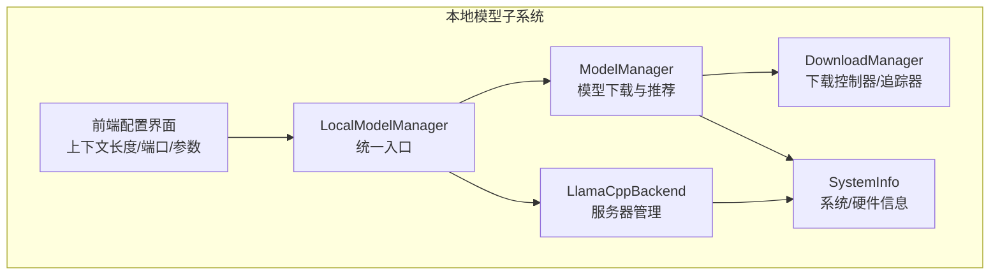
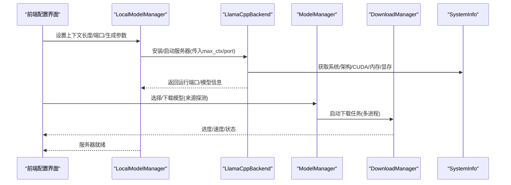
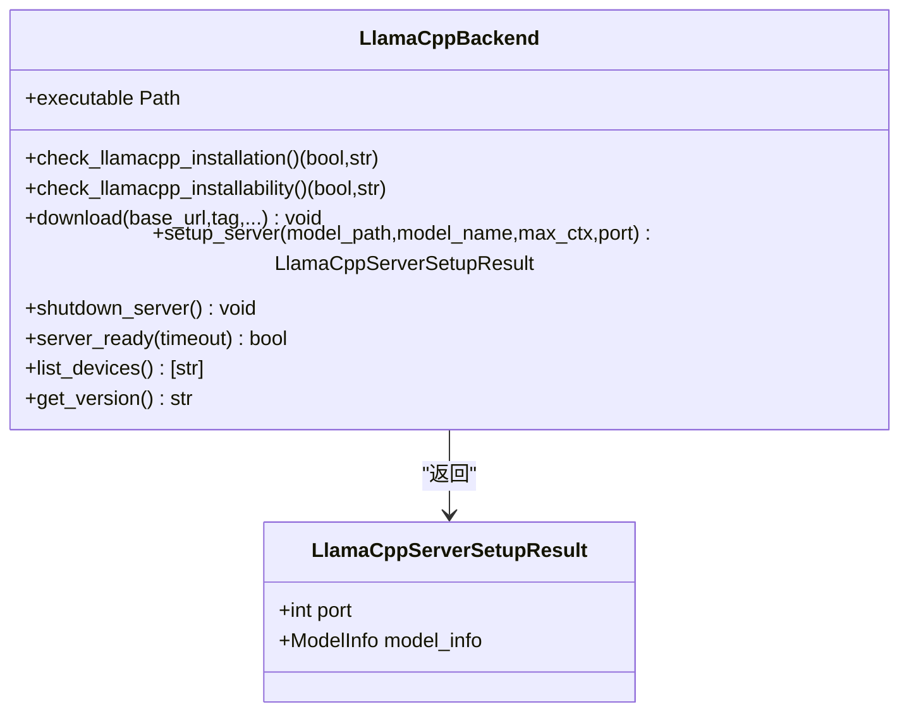
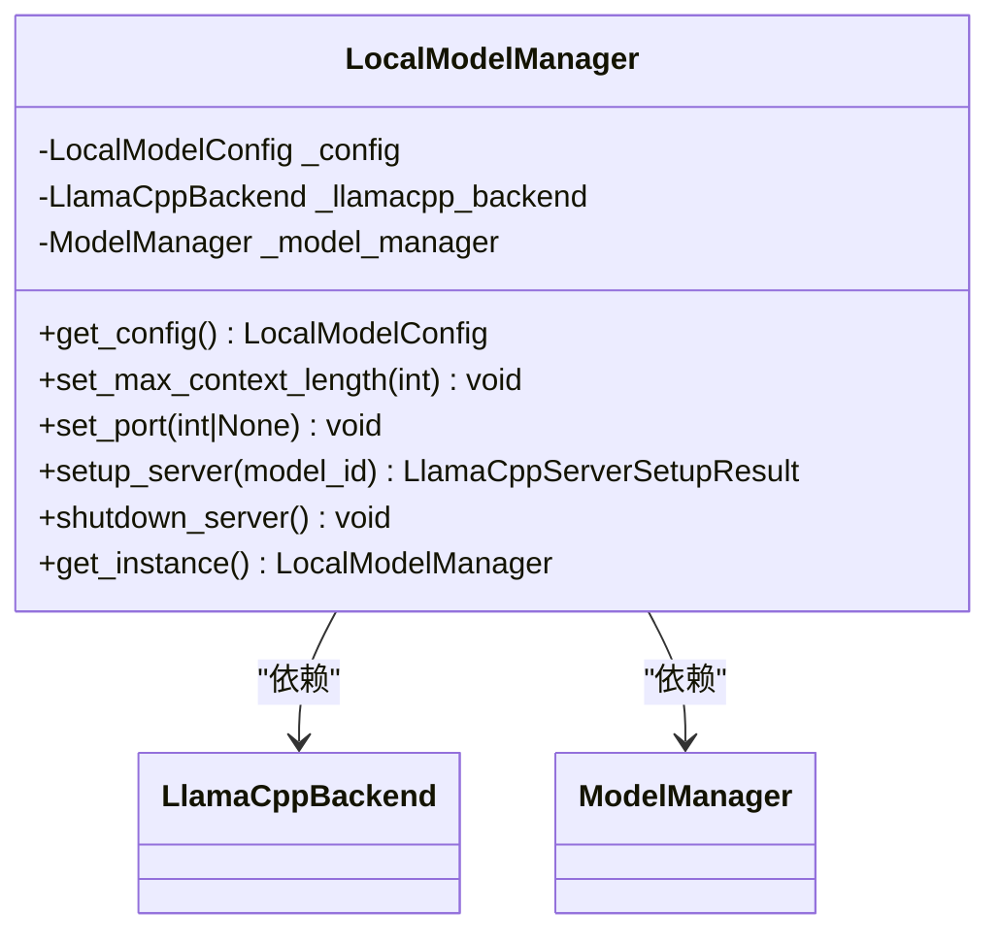
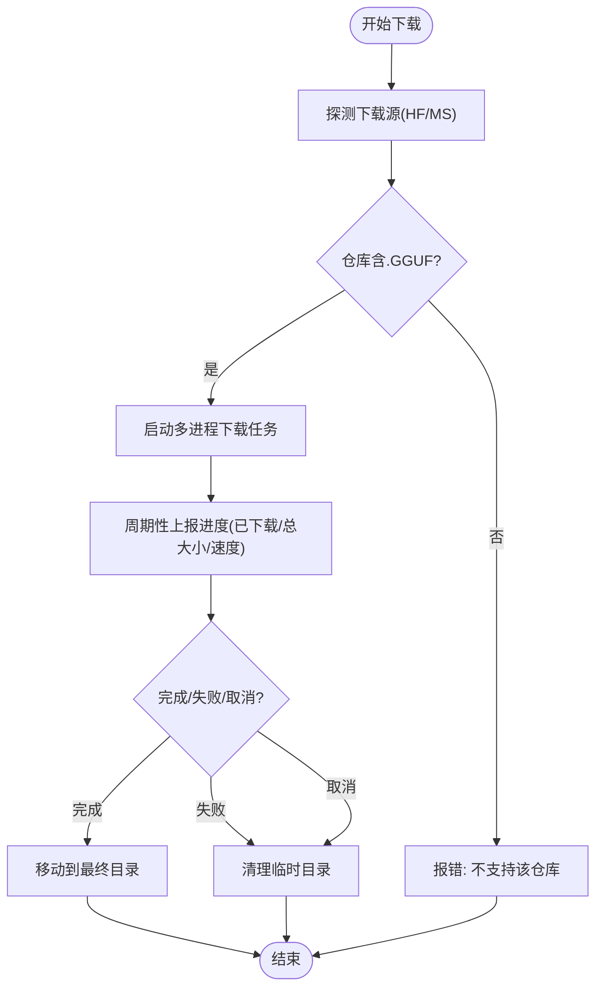
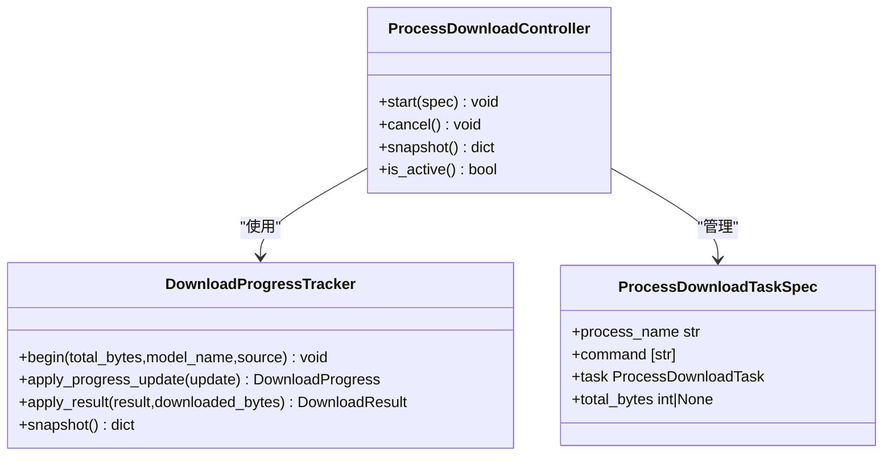
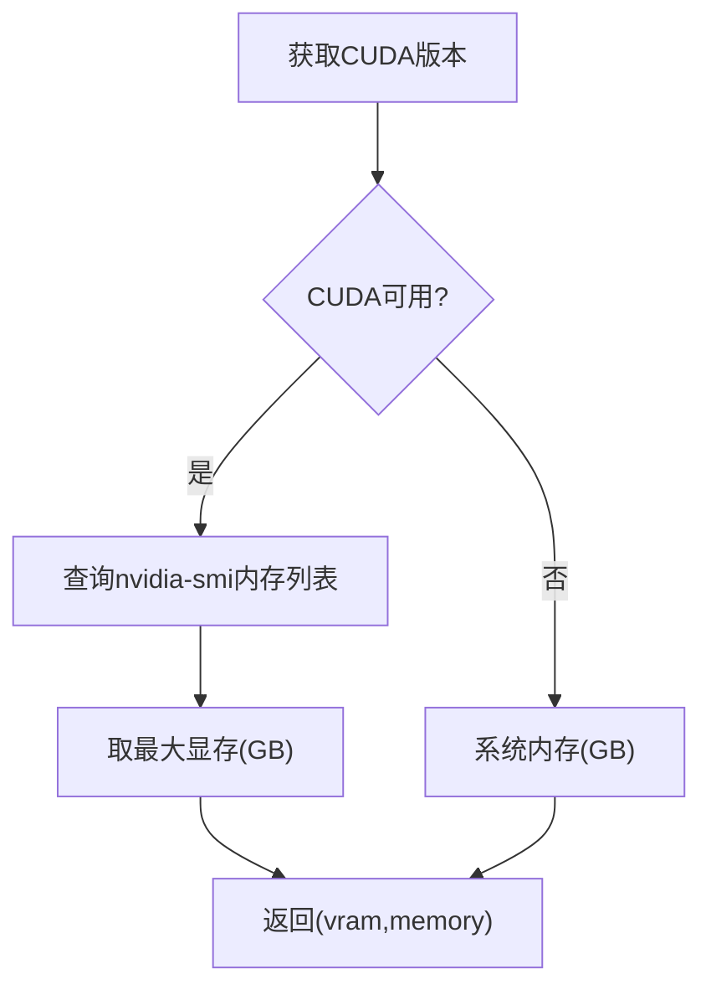
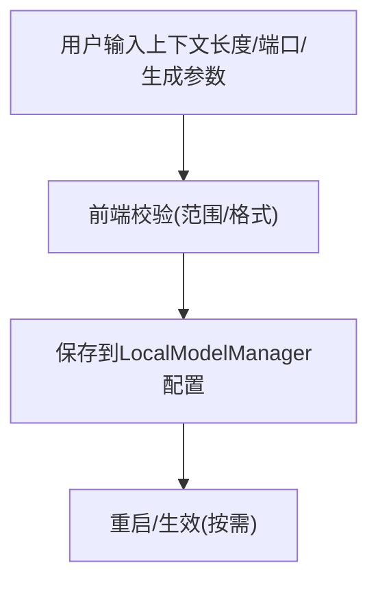
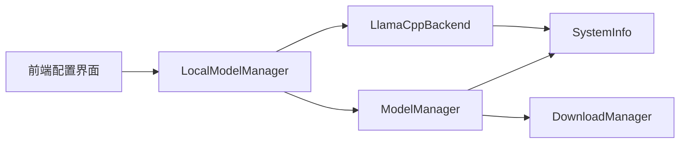

# 模型性能优化

<cite>
**本文引用的文件**
- [src/qwenpaw/local_models/llamacpp.py](file://src/qwenpaw/local_models/llamacpp.py)
- [src/qwenpaw/local_models/manager.py](file://src/qwenpaw/local_models/manager.py)
- [src/qwenpaw/local_models/model_manager.py](file://src/qwenpaw/local_models/model_manager.py)
- [src/qwenpaw/local_models/download_manager.py](file://src/qwenpaw/local_models/download_manager.py)
- [src/qwenpaw/utils/system_info.py](file://src/qwenpaw/utils/system_info.py)
- [src/qwenpaw/utils/command_runner.py](file://src/qwenpaw/utils/command_runner.py)
- [src/qwenpaw/constant.py](file://src/qwenpaw/constant.py)
- [console/src/pages/Settings/Models/components/modals/LocalModelManageModal.tsx](file://console/src/pages/Settings/Models/components/modals/LocalModelManageModal.tsx)
- [tests/unit/local_models/test_llamacpp_backend.py](file://tests/unit/local_models/test_llamacpp_backend.py)
</cite>

## 目录
1. [简介](#简介)
2. [项目结构](#项目结构)
3. [核心组件](#核心组件)
4. [架构总览](#架构总览)
5. [详细组件分析](#详细组件分析)
6. [依赖分析](#依赖分析)
7. [性能考量](#性能考量)
8. [故障排查指南](#故障排查指南)
9. [结论](#结论)
10. [附录](#附录)

## 简介
本文件面向QwenPaw本地模型推理加速与性能优化，系统梳理了以下关键能力与实践：
- 本地推理后端：基于llama.cpp的服务器管理与进程控制
- 下载与安装：多来源模型下载、进度追踪与跨平台二进制分发
- 上下文长度优化：运行时上下文窗口参数传递与限制
- 内存与资源管理：系统资源探测、显存优先与进程生命周期管理
- 批处理与并发：多进程下载与异步健康检查
- 硬件适配：CPU/GPU/专用加速芯片的后端选择与设备枚举
- 用户界面：上下文长度、端口与生成参数的可视化配置入口
- 基准测试与监控：日志采集、错误分类与性能瓶颈定位

## 项目结构
围绕本地模型性能优化的关键模块分布如下：
- 后端管理：本地推理服务器启动、停止、健康检查与日志采集
- 下载与安装：模型与llama.cpp二进制的下载、解压、安装与进度追踪
- 系统信息：操作系统、架构、CUDA版本与内存/显存检测
- 前端配置：上下文长度、端口与生成参数的用户可调界面
- 测试与验证：下载流程、命令行工具与日志输出的单元测试

**图表来源**
- [src/qwenpaw/local_models/manager.py:41-244](file://src/qwenpaw/local_models/manager.py#L41-L244)
- [src/qwenpaw/local_models/llamacpp.py:51-120](file://src/qwenpaw/local_models/llamacpp.py#L51-L120)
- [src/qwenpaw/local_models/model_manager.py:63-136](file://src/qwenpaw/local_models/model_manager.py#L63-L136)
- [src/qwenpaw/local_models/download_manager.py:368-408](file://src/qwenpaw/local_models/download_manager.py#L368-L408)
- [src/qwenpaw/utils/system_info.py:135-144](file://src/qwenpaw/utils/system_info.py#L135-L144)
- [console/src/pages/Settings/Models/components/modals/LocalModelManageModal.tsx:1080-1202](file://console/src/pages/Settings/Models/components/modals/LocalModelManageModal.tsx#L1080-L1202)

**章节来源**
- [src/qwenpaw/local_models/manager.py:41-244](file://src/qwenpaw/local_models/manager.py#L41-L244)
- [src/qwenpaw/local_models/llamacpp.py:51-120](file://src/qwenpaw/local_models/llamacpp.py#L51-L120)
- [src/qwenpaw/local_models/model_manager.py:63-136](file://src/qwenpaw/local_models/model_manager.py#L63-L136)
- [src/qwenpaw/local_models/download_manager.py:368-408](file://src/qwenpaw/local_models/download_manager.py#L368-L408)
- [src/qwenpaw/utils/system_info.py:135-144](file://src/qwenpaw/utils/system_info.py#L135-L144)
- [console/src/pages/Settings/Models/components/modals/LocalModelManageModal.tsx:1080-1202](file://console/src/pages/Settings/Models/components/modals/LocalModelManageModal.tsx#L1080-L1202)

## 核心组件
- LocalModelManager：本地模型统一入口，负责持久化配置、服务器生命周期与下载任务协调
- LlamaCppBackend：llama.cpp服务器的安装、启动、停止、健康检查与日志采集
- ModelManager：模型仓库下载、进度追踪、推荐模型与来源探测
- DownloadManager：多进程下载控制器与进度追踪器，支持取消、完成与失败状态
- SystemInfo：系统/架构/CUDA版本/内存/显存检测，用于硬件适配与容量推荐
- 前端配置界面：上下文长度、端口与生成参数的可视化配置入口

**章节来源**
- [src/qwenpaw/local_models/manager.py:41-244](file://src/qwenpaw/local_models/manager.py#L41-L244)
- [src/qwenpaw/local_models/llamacpp.py:51-120](file://src/qwenpaw/local_models/llamacpp.py#L51-L120)
- [src/qwenpaw/local_models/model_manager.py:63-136](file://src/qwenpaw/local_models/model_manager.py#L63-L136)
- [src/qwenpaw/local_models/download_manager.py:368-408](file://src/qwenpaw/local_models/download_manager.py#L368-L408)
- [src/qwenpaw/utils/system_info.py:135-144](file://src/qwenpaw/utils/system_info.py#L135-L144)
- [console/src/pages/Settings/Models/components/modals/LocalModelManageModal.tsx:1080-1202](file://console/src/pages/Settings/Models/components/modals/LocalModelManageModal.tsx#L1080-L1202)

## 架构总览
本地模型推理优化的总体流程：
- 环境探测：通过SystemInfo获取系统/架构/CUDA/内存/显存信息
- 服务器准备：LocalModelManager加载持久化配置，LlamaCppBackend安装/启动服务器
- 模型准备：ModelManager从HuggingFace/ModelScope下载GGUF模型，支持进度追踪与取消
- 推理调用：通过本地HTTP接口进行推理（由上层应用发起）
- 资源回收：健康检查失败或手动关闭时，清理进程与日志

**图表来源**
- [src/qwenpaw/local_models/manager.py:113-124](file://src/qwenpaw/local_models/manager.py#L113-L124)
- [src/qwenpaw/local_models/llamacpp.py:217-312](file://src/qwenpaw/local_models/llamacpp.py#L217-L312)
- [src/qwenpaw/local_models/model_manager.py:245-250](file://src/qwenpaw/local_models/model_manager.py#L245-L250)
- [src/qwenpaw/local_models/download_manager.py:382-416](file://src/qwenpaw/local_models/download_manager.py#L382-L416)
- [src/qwenpaw/utils/system_info.py:135-144](file://src/qwenpaw/utils/system_info.py#L135-L144)

## 详细组件分析

### 组件A：LlamaCppBackend（本地推理服务器）
职责与特性：
- 安装与校验：下载并解压llama.cpp二进制，校验安装环境（含macOS版本与架构）
- 启停控制：以子进程方式启动/停止服务器，支持固定端口与自动端口分配
- 健康检查：轮询健康接口，超时/异常时自动清理
- 日志采集：异步读取stdout日志，便于问题诊断
- 设备枚举：通过命令行列出可用设备，辅助硬件选择
- 参数透传：将上下文长度、mmproj等参数传递给llama-server

**图表来源**
- [src/qwenpaw/local_models/llamacpp.py:51-120](file://src/qwenpaw/local_models/llamacpp.py#L51-L120)
- [src/qwenpaw/local_models/llamacpp.py:217-312](file://src/qwenpaw/local_models/llamacpp.py#L217-L312)

**章节来源**
- [src/qwenpaw/local_models/llamacpp.py:51-120](file://src/qwenpaw/local_models/llamacpp.py#L51-L120)
- [src/qwenpaw/local_models/llamacpp.py:217-312](file://src/qwenpaw/local_models/llamacpp.py#L217-L312)
- [src/qwenpaw/local_models/llamacpp.py:314-348](file://src/qwenpaw/local_models/llamacpp.py#L314-L348)
- [src/qwenpaw/local_models/llamacpp.py:695-730](file://src/qwenpaw/local_models/llamacpp.py#L695-L730)

### 组件B：LocalModelManager（统一入口）
职责与特性：
- 配置持久化：max_context_length、port等本地运行参数写盘保护
- 生命周期锁：确保服务器启停与配置更新的原子性
- 单例模式：全局唯一实例，避免重复初始化
- 与LlamaCppBackend/ModelManager协作：下载与启动链路的编排

**图表来源**
- [src/qwenpaw/local_models/manager.py:41-124](file://src/qwenpaw/local_models/manager.py#L41-L124)
- [src/qwenpaw/local_models/manager.py:214-234](file://src/qwenpaw/local_models/manager.py#L214-L234)

**章节来源**
- [src/qwenpaw/local_models/manager.py:41-124](file://src/qwenpaw/local_models/manager.py#L41-L124)
- [src/qwenpaw/local_models/manager.py:214-234](file://src/qwenpaw/local_models/manager.py#L214-L234)

### 组件C：ModelManager（模型下载与推荐）
职责与特性：
- 多来源下载：优先HuggingFace，不可达时回退ModelScope
- GGUF校验：确保仓库包含至少一个.GGUF文件
- 推荐模型：根据系统内存/显存容量推荐合适规模的模型
- 进度追踪：多进程下载，实时上报下载字节、总大小与速度
- 取消与清理：支持取消下载并清理临时目录

**图表来源**
- [src/qwenpaw/local_models/model_manager.py:245-250](file://src/qwenpaw/local_models/model_manager.py#L245-L250)
- [src/qwenpaw/local_models/model_manager.py:322-355](file://src/qwenpaw/local_models/model_manager.py#L322-L355)
- [src/qwenpaw/local_models/download_manager.py:382-416](file://src/qwenpaw/local_models/download_manager.py#L382-L416)

**章节来源**
- [src/qwenpaw/local_models/model_manager.py:245-250](file://src/qwenpaw/local_models/model_manager.py#L245-L250)
- [src/qwenpaw/local_models/model_manager.py:322-355](file://src/qwenpaw/local_models/model_manager.py#L322-L355)
- [src/qwenpaw/local_models/download_manager.py:382-416](file://src/qwenpaw/local_models/download_manager.py#L382-L416)

### 组件D：DownloadManager（下载控制器与追踪器）
职责与特性：
- 进度追踪器：记录状态、已下载字节、总大小、速度、错误与本地路径
- 控制器：管理单个下载任务的生命周期，支持取消、完成与失败处理
- 多进程：通过队列与消息机制在子进程中执行下载，并将进度/结果回传

**图表来源**
- [src/qwenpaw/local_models/download_manager.py:198-366](file://src/qwenpaw/local_models/download_manager.py#L198-L366)
- [src/qwenpaw/local_models/download_manager.py:368-408](file://src/qwenpaw/local_models/download_manager.py#L368-L408)
- [src/qwenpaw/local_models/download_manager.py:180-188](file://src/qwenpaw/local_models/download_manager.py#L180-L188)

**章节来源**
- [src/qwenpaw/local_models/download_manager.py:198-366](file://src/qwenpaw/local_models/download_manager.py#L198-L366)
- [src/qwenpaw/local_models/download_manager.py:368-408](file://src/qwenpaw/local_models/download_manager.py#L368-L408)

### 组件E：SystemInfo（系统/硬件信息）
职责与特性：
- 归一化系统信息：操作系统、架构、CUDA版本、内存/显存大小
- 优先级策略：优先使用VRAM（若存在），否则使用系统内存
- 命令行探测：nvidia-smi、nvcc、sw_vers等工具输出解析

**图表来源**
- [src/qwenpaw/utils/system_info.py:84-144](file://src/qwenpaw/utils/system_info.py#L84-L144)

**章节来源**
- [src/qwenpaw/utils/system_info.py:84-144](file://src/qwenpaw/utils/system_info.py#L84-L144)

### 组件F：前端配置界面（上下文长度/端口/生成参数）
职责与特性：
- 上下文长度：支持最小值、步长与占位提示，保存至持久化配置
- 服务器端口：支持固定端口与自动端口，范围约束
- 生成参数：JSON编辑器，保存前进行语法校验

**图表来源**
- [console/src/pages/Settings/Models/components/modals/LocalModelManageModal.tsx:1080-1202](file://console/src/pages/Settings/Models/components/modals/LocalModelManageModal.tsx#L1080-L1202)

**章节来源**
- [console/src/pages/Settings/Models/components/modals/LocalModelManageModal.tsx:1080-1202](file://console/src/pages/Settings/Models/components/modals/LocalModelManageModal.tsx#L1080-L1202)

## 依赖分析
- 组件耦合
  - LocalModelManager对LlamaCppBackend与ModelManager存在直接依赖
  - LlamaCppBackend依赖SystemInfo进行硬件/系统信息探测
  - ModelManager依赖DownloadManager进行下载任务编排
  - 前端通过LocalModelManager间接影响后端行为
- 外部依赖
  - llama.cpp二进制与模型仓库（HF/MS）
  - 系统工具：nvidia-smi、nvcc、sw_vers等
  - Python网络库：httpx用于下载与健康检查
- 潜在环路
  - 当前模块间为单向依赖，未发现循环导入

**图表来源**
- [src/qwenpaw/local_models/manager.py:41-124](file://src/qwenpaw/local_models/manager.py#L41-L124)
- [src/qwenpaw/local_models/llamacpp.py:51-120](file://src/qwenpaw/local_models/llamacpp.py#L51-L120)
- [src/qwenpaw/local_models/model_manager.py:63-136](file://src/qwenpaw/local_models/model_manager.py#L63-L136)
- [src/qwenpaw/local_models/download_manager.py:368-408](file://src/qwenpaw/local_models/download_manager.py#L368-L408)
- [src/qwenpaw/utils/system_info.py:135-144](file://src/qwenpaw/utils/system_info.py#L135-L144)

**章节来源**
- [src/qwenpaw/local_models/manager.py:41-124](file://src/qwenpaw/local_models/manager.py#L41-L124)
- [src/qwenpaw/local_models/llamacpp.py:51-120](file://src/qwenpaw/local_models/llamacpp.py#L51-L120)
- [src/qwenpaw/local_models/model_manager.py:63-136](file://src/qwenpaw/local_models/model_manager.py#L63-L136)
- [src/qwenpaw/local_models/download_manager.py:368-408](file://src/qwenpaw/local_models/download_manager.py#L368-L408)
- [src/qwenpaw/utils/system_info.py:135-144](file://src/qwenpaw/utils/system_info.py#L135-L144)

## 性能考量
- 量化模型支持
  - 通过GGUF格式加载量化权重，减少显存占用与提升推理吞吐
  - 模型仓库必须包含至少一个.GGUF文件，否则不被支持
- 多线程与多进程
  - 下载采用多进程执行，避免阻塞事件循环
  - 服务器以子进程方式运行，支持异步健康检查与日志读取
- 缓存策略
  - 本地工作目录下的模型与二进制缓存，避免重复下载
  - 服务器日志文件落盘，便于后续分析
- 上下文长度优化
  - 通过max_context_length参数传递给llama-server，合理设置可降低显存压力
  - 前端提供最小值、步长与占位提示，便于用户调整
- 内存管理
  - 优先使用VRAM（若存在），否则回退系统内存
  - 服务器启动时自动选择GPU层数量（auto），结合显存大小动态适配
- 批处理机制
  - 通过多进程下载控制器并行处理多个任务
  - 健康检查采用轮询策略，超时即判定失败并清理
- 硬件平台调优
  - macOS/Linux：默认CPU后端
  - Windows：若CUDA可用则选择CUDA后端，否则CPU
  - 支持设备枚举，便于确认可用设备

**章节来源**
- [src/qwenpaw/local_models/model_manager.py:307-320](file://src/qwenpaw/local_models/model_manager.py#L307-L320)
- [src/qwenpaw/local_models/download_manager.py:368-408](file://src/qwenpaw/local_models/download_manager.py#L368-L408)
- [src/qwenpaw/local_models/llamacpp.py:354-408](file://src/qwenpaw/local_models/llamacpp.py#L354-L408)
- [src/qwenpaw/utils/system_info.py:105-144](file://src/qwenpaw/utils/system_info.py#L105-L144)
- [src/qwenpaw/local_models/llamacpp.py:852-886](file://src/qwenpaw/local_models/llamacpp.py#L852-L886)

## 故障排查指南
- 服务器无法启动
  - 检查llama.cpp安装状态与版本
  - 查看健康检查超时与日志输出
  - 确认端口占用与权限
- 下载失败
  - 检查网络连通性与代理设置
  - 查看HTTP状态码与错误信息（404/403/5xx）
  - 确认目标目录权限与磁盘空间
- 上下文长度过大
  - 减小max_context_length参数，观察显存占用变化
  - 若仍失败，考虑切换更小的模型或降低batch
- 显存不足
  - 降低上下文长度或减少并发请求
  - 使用更小的模型（如2B/4B系列）
  - 确认GPU驱动与CUDA版本兼容性
- 进程泄漏与资源未释放
  - 使用生命周期锁确保启停顺序
  - 关闭时主动调用shutdown_server并等待日志任务取消
- 错误分类与恢复
  - 对超时、配额、认证、上下文超限等进行分类处理
  - 提供重试与降级策略（如回退到CPU后端）

**章节来源**
- [src/qwenpaw/local_models/llamacpp.py:695-730](file://src/qwenpaw/local_models/llamacpp.py#L695-L730)
- [src/qwenpaw/local_models/llamacpp.py:626-659](file://src/qwenpaw/local_models/llamacpp.py#L626-L659)
- [src/qwenpaw/local_models/model_manager.py:474-517](file://src/qwenpaw/local_models/model_manager.py#L474-L517)
- [tests/unit/local_models/test_llamacpp_backend.py:371-399](file://tests/unit/local_models/test_llamacpp_backend.py#L371-L399)

## 结论
QwenPaw在本地模型性能优化方面提供了完善的基础设施：
- 通过SystemInfo与硬件探测实现平台自适配
- 通过多进程下载与异步健康检查保障稳定性
- 通过GGUF量化与上下文长度参数实现显存与吞吐的平衡
- 通过统一入口与配置持久化简化运维
建议在生产环境中结合实际硬件与业务负载，持续监控显存/内存/CPU利用率与延迟指标，动态调整上下文长度与并发策略。

## 附录
- 模型选择指南
  - 依据系统内存/显存容量选择合适规模的模型（2B/4B/9B）
  - 优先选择GGUF格式的仓库
- 性能基准测试
  - 建议使用不同上下文长度与并发度组合进行压测
  - 记录吞吐、P95/P99延迟与显存峰值
- 资源使用监控
  - 利用服务器日志与系统工具（nvidia-smi）观测资源占用
  - 结合前端配置界面的参数调整进行A/B对比