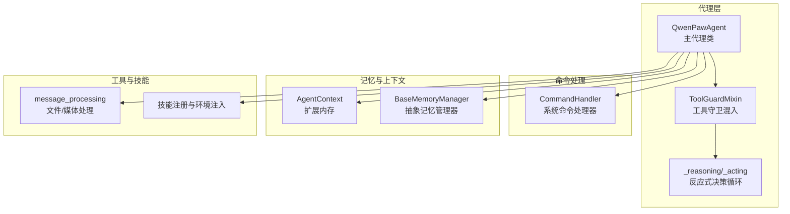
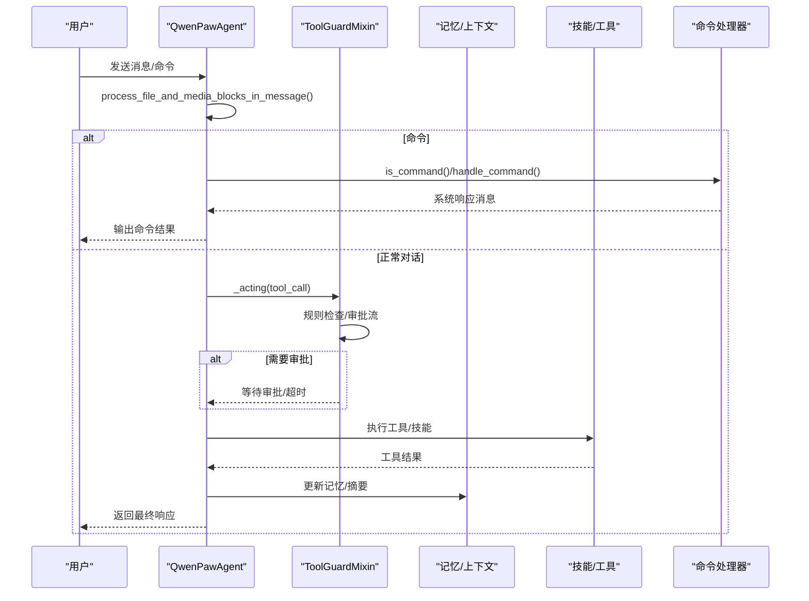
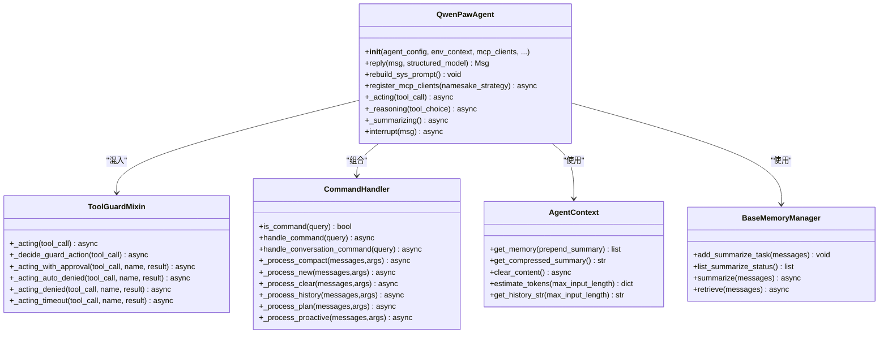
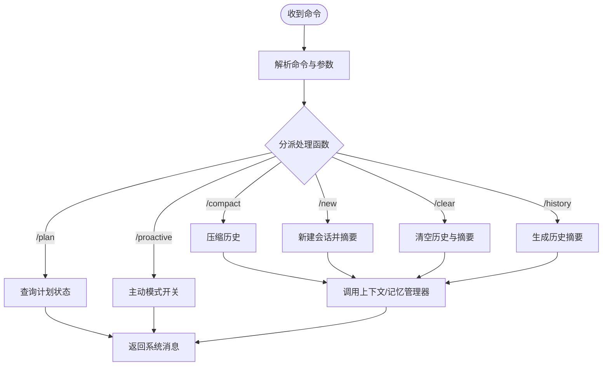
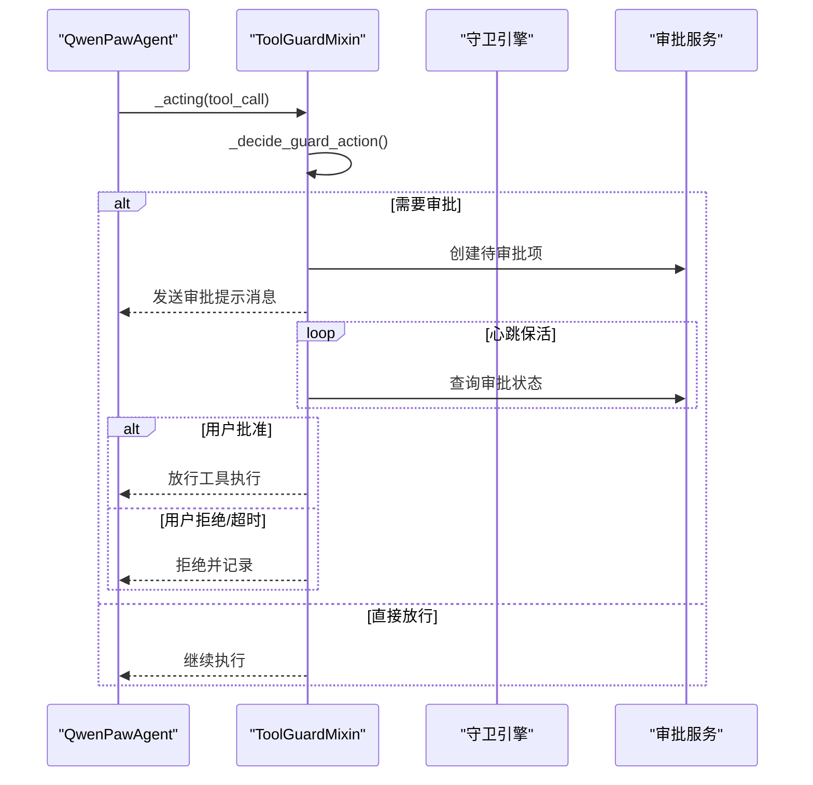
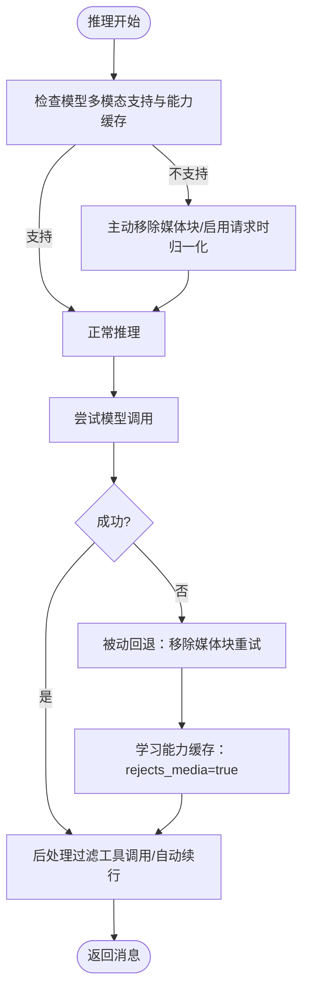
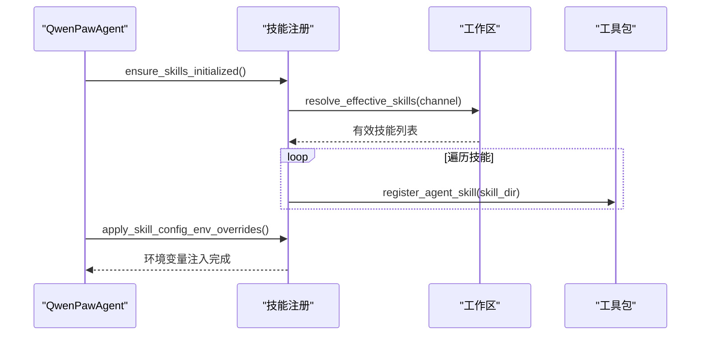
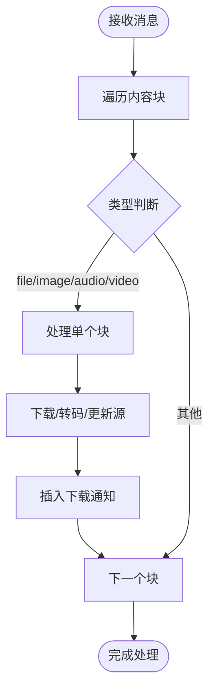
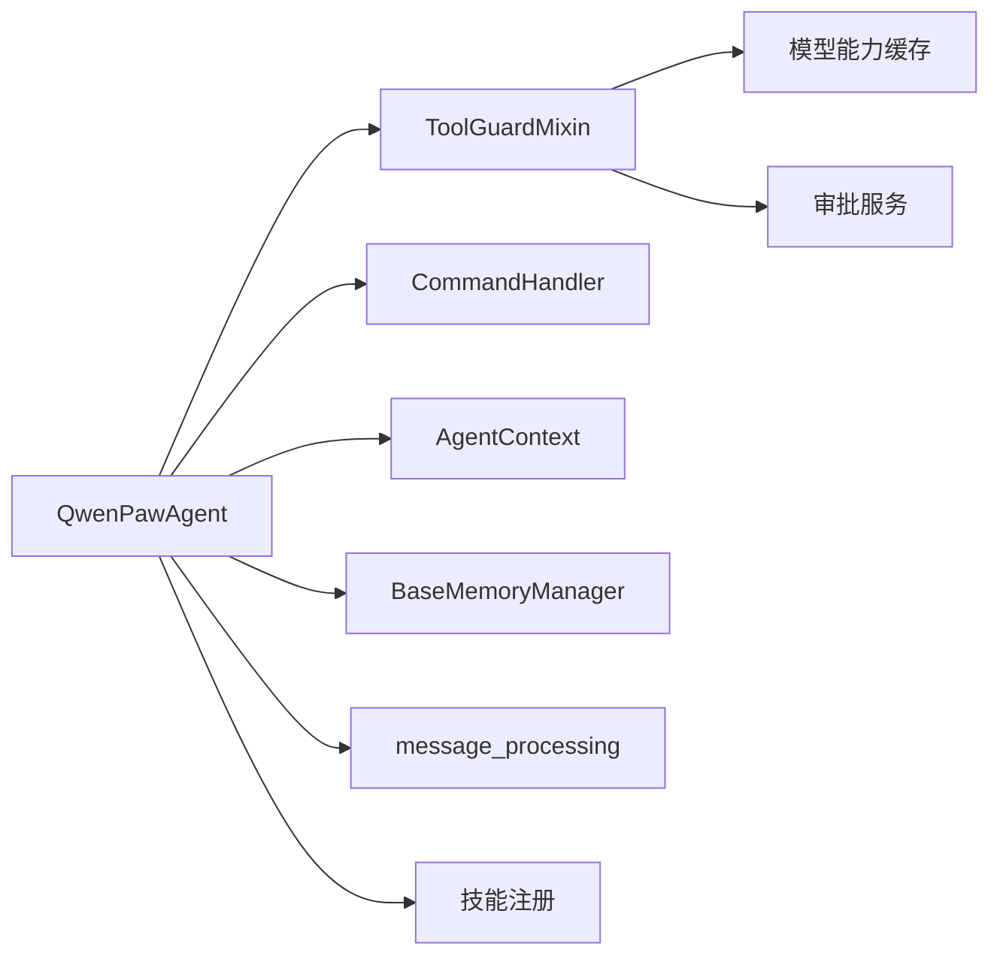

# React代理实现

<cite>
**本文档引用的文件**
- [react_agent.py](file://src/qwenpaw/agents/react_agent.py)
- [command_handler.py](file://src/qwenpaw/agents/command_handler.py)
- [tool_guard_mixin.py](file://src/qwenpaw/agents/tool_guard_mixin.py)
- [agent_context.py](file://src/qwenpaw/agents/context/agent_context.py)
- [base_memory_manager.py](file://src/qwenpaw/agents/memory/base_memory_manager.py)
- [message_processing.py](file://src/qwenpaw/agents/utils/message_processing.py)
- [registry.py](file://src/qwenpaw/agents/skill_system/registry.py)
</cite>

## 目录
1. [简介](#简介)
2. [项目结构](#项目结构)
3. [核心组件](#核心组件)
4. [架构总览](#架构总览)
5. [详细组件分析](#详细组件分析)
6. [依赖关系分析](#依赖关系分析)
7. [性能考虑](#性能考虑)
8. [故障排除指南](#故障排除指南)
9. [结论](#结论)

## 简介
本文件系统性阐述React代理实现的设计架构与核心原理，重点覆盖以下方面：
- 反应式编程模型：基于ReAct（推理-行动）循环的决策与执行机制
- 命令处理机制：系统命令解析、参数校验与执行调度
- 状态管理：记忆与上下文管理、摘要压缩、令牌估算
- 决策循环：推理、行动、自动续行与媒体过滤的闭环
- 多模态支持：图像/音频/视频的预处理、请求时归一化与回退重试
- 安全与合规：工具守卫拦截、审批流与超时处理
- 扩展与定制：技能注册、插件工具集成、MCP客户端接入

该文档既面向初学者解释代理的基本工作原理，也为有经验的开发者提供扩展点、自定义行为与性能优化建议。

## 项目结构
React代理实现位于src/qwenpaw/agents目录，围绕QwenPawAgent主类构建，辅以命令处理器、工具守卫混入、上下文与记忆管理、消息处理工具与技能系统注册等模块。

**图表来源**
- [react_agent.py:80-215](file://src/qwenpaw/agents/react_agent.py#L80-L215)
- [command_handler.py:77-140](file://src/qwenpaw/agents/command_handler.py#L77-L140)
- [tool_guard_mixin.py:79-104](file://src/qwenpaw/agents/tool_guard_mixin.py#L79-L104)
- [agent_context.py:23-45](file://src/qwenpaw/agents/context/agent_context.py#L23-L45)
- [base_memory_manager.py:18-41](file://src/qwenpaw/agents/memory/base_memory_manager.py#L18-L41)
- [message_processing.py:381-425](file://src/qwenpaw/agents/utils/message_processing.py#L381-L425)
- [registry.py:342-387](file://src/qwenpaw/agents/skill_system/registry.py#L342-L387)

**章节来源**
- [react_agent.py:80-215](file://src/qwenpaw/agents/react_agent.py#L80-L215)
- [command_handler.py:77-140](file://src/qwenpaw/agents/command_handler.py#L77-L140)
- [tool_guard_mixin.py:79-104](file://src/qwenpaw/agents/tool_guard_mixin.py#L79-L104)
- [agent_context.py:23-45](file://src/qwenpaw/agents/context/agent_context.py#L23-L45)
- [base_memory_manager.py:18-41](file://src/qwenpaw/agents/memory/base_memory_manager.py#L18-L41)
- [message_processing.py:381-425](file://src/qwenpaw/agents/utils/message_processing.py#L381-L425)
- [registry.py:342-387](file://src/qwenpaw/agents/skill_system/registry.py#L342-L387)

## 核心组件
- QwenPawAgent：继承自ReActAgent，集成工具包、技能系统、记忆管理、命令处理器与安全守卫。负责初始化系统提示、注册工具与技能、处理消息、执行推理与行动、媒体过滤与自动续行。
- CommandHandler：解析并执行系统命令（如/compact、/new、/clear、/history、/plan、/proactive等），并与上下文/记忆管理器协作。
- ToolGuardMixin：在行动前拦截敏感工具调用，执行规则检查、审批流与超时处理，确保安全可控。
- AgentContext：扩展的内存实现，支持摘要前置、持久化对话、令牌估算与历史字符串生成。
- BaseMemoryManager：抽象记忆管理器，提供摘要任务队列、后台工作者、检索与自动记忆抽取接口。
- message_processing：统一处理文件/媒体块（下载、转码、格式化），并按配置模式（自动/原生）决定音频处理策略。
- 技能注册与环境注入：从工作区解析有效技能，注入环境变量，支持多语言内置技能与池化管理。

**章节来源**
- [react_agent.py:80-215](file://src/qwenpaw/agents/react_agent.py#L80-L215)
- [command_handler.py:77-140](file://src/qwenpaw/agents/command_handler.py#L77-L140)
- [tool_guard_mixin.py:79-104](file://src/qwenpaw/agents/tool_guard_mixin.py#L79-L104)
- [agent_context.py:23-45](file://src/qwenpaw/agents/context/agent_context.py#L23-L45)
- [base_memory_manager.py:18-41](file://src/qwenpaw/agents/memory/base_memory_manager.py#L18-L41)
- [message_processing.py:381-425](file://src/qwenpaw/agents/utils/message_processing.py#L381-L425)
- [registry.py:342-387](file://src/qwenpaw/agents/skill_system/registry.py#L342-L387)

## 架构总览
React代理采用“反应式循环 + 多层防护 + 智能记忆”的架构设计。其关键特征：
- 推理-行动循环：_reasoning生成文本/工具调用，_acting执行工具并返回结果
- 媒体过滤双层保障：主动过滤（能力缓存/请求时归一化）+ 被动回退（失败重试）
- 工具守卫：严格/智能/自动/关闭四种执行级别，支持审批超时与心跳保持
- 记忆与上下文：摘要前置、持久化对话、令牌估算、历史导出/导入
- 技能与工具：动态注册、插件工具、MCP客户端接入、环境变量注入

**图表来源**
- [react_agent.py:1366-1427](file://src/qwenpaw/agents/react_agent.py#L1366-L1427)
- [tool_guard_mixin.py:138-176](file://src/qwenpaw/agents/tool_guard_mixin.py#L138-L176)
- [command_handler.py:530-560](file://src/qwenpaw/agents/command_handler.py#L530-L560)
- [message_processing.py:381-425](file://src/qwenpaw/agents/utils/message_processing.py#L381-L425)

**章节来源**
- [react_agent.py:1366-1427](file://src/qwenpaw/agents/react_agent.py#L1366-L1427)
- [tool_guard_mixin.py:138-176](file://src/qwenpaw/agents/tool_guard_mixin.py#L138-L176)
- [command_handler.py:530-560](file://src/qwenpaw/agents/command_handler.py#L530-L560)
- [message_processing.py:381-425](file://src/qwenpaw/agents/utils/message_processing.py#L381-L425)

## 详细组件分析

### QwenPawAgent类实现详解
- 初始化与系统提示构建
  - 从配置加载运行参数、语言设置与模型工厂
  - 创建工具包（内置工具+插件工具），注册技能（工作区有效技能）
  - 构建系统提示（包含记忆引导、多模态提示、环境上下文）
- 记忆与上下文
  - 注册内存工具（来自记忆管理器）
  - 绑定上下文管理器（预推理/预行动/后行动/后回复钩子）
- 命令处理器
  - 初始化CommandHandler，用于处理/compact、/new、/clear、/history、/plan、/proactive等
- 工具守卫
  - 通过ToolGuardMixin实现拦截与审批流
- 媒体与多模态
  - 主动/被动媒体过滤：能力缓存标记拒绝、请求时归一化、失败回退重试
  - 自动续行：当仅返回文本时，注入提示并额外推理直至出现工具调用
- 回复流程
  - 设置工作区与上下文参数（最近字节限制、Shell超时、可执行文件）
  - 处理文件/媒体块
  - 判断是否为系统命令，否则进入标准推理-行动循环

**图表来源**
- [react_agent.py:80-215](file://src/qwenpaw/agents/react_agent.py#L80-L215)
- [tool_guard_mixin.py:79-104](file://src/qwenpaw/agents/tool_guard_mixin.py#L79-L104)
- [command_handler.py:77-140](file://src/qwenpaw/agents/command_handler.py#L77-L140)
- [agent_context.py:23-45](file://src/qwenpaw/agents/context/agent_context.py#L23-L45)
- [base_memory_manager.py:18-41](file://src/qwenpaw/agents/memory/base_memory_manager.py#L18-L41)

**章节来源**
- [react_agent.py:80-215](file://src/qwenpaw/agents/react_agent.py#L80-L215)
- [react_agent.py:1366-1427](file://src/qwenpaw/agents/react_agent.py#L1366-L1427)
- [react_agent.py:967-1084](file://src/qwenpaw/agents/react_agent.py#L967-L1084)
- [react_agent.py:1087-1189](file://src/qwenpaw/agents/react_agent.py#L1087-L1189)

### 命令处理器（CommandHandler）机制
- 命令识别：以/开头且不在保留列表中的bare命令被识别为系统命令
- 解析与路由：根据命令名分派至对应处理函数（/compact、/new、/clear、/history、/compact_str、/summarize_status、/message、/dump_history、/load_history、/plan、/proactive）
- 与上下文/记忆协作：调用AgentContext与BaseMemoryManager完成摘要、清理、历史导出/导入等
- 异步任务：摘要任务通过队列与后台工作者串行执行，支持状态查询

**图表来源**
- [command_handler.py:530-560](file://src/qwenpaw/agents/command_handler.py#L530-L560)
- [command_handler.py:141-203](file://src/qwenpaw/agents/command_handler.py#L141-L203)
- [command_handler.py:205-234](file://src/qwenpaw/agents/command_handler.py#L205-L234)
- [command_handler.py:236-250](file://src/qwenpaw/agents/command_handler.py#L236-L250)
- [command_handler.py:269-294](file://src/qwenpaw/agents/command_handler.py#L269-L294)
- [command_handler.py:562-599](file://src/qwenpaw/agents/command_handler.py#L562-L599)
- [command_handler.py:601-747](file://src/qwenpaw/agents/command_handler.py#L601-L747)

**章节来源**
- [command_handler.py:530-560](file://src/qwenpaw/agents/command_handler.py#L530-L560)
- [command_handler.py:141-203](file://src/qwenpaw/agents/command_handler.py#L141-L203)
- [command_handler.py:205-234](file://src/qwenpaw/agents/command_handler.py#L205-L234)
- [command_handler.py:236-250](file://src/qwenpaw/agents/command_handler.py#L236-L250)
- [command_handler.py:269-294](file://src/qwenpaw/agents/command_handler.py#L269-L294)
- [command_handler.py:562-599](file://src/qwenpaw/agents/command_handler.py#L562-L599)
- [command_handler.py:601-747](file://src/qwenpaw/agents/command_handler.py#L601-L747)

### 工具守卫（ToolGuardMixin）拦截流程
- 决策阶段：根据执行级别（OFF/AUTO/SMART/STRICT）与工具名单决定是否拦截
- 拦截动作：自动拒绝、需要审批、或直接放行
- 审批流：创建待审批项、发送UI提示消息、心跳保活、等待用户批准/拒绝/超时
- 超时与取消：超时自动拒绝；任务取消时自动拒绝并传播取消异常

**图表来源**
- [tool_guard_mixin.py:138-176](file://src/qwenpaw/agents/tool_guard_mixin.py#L138-L176)
- [tool_guard_mixin.py:179-305](file://src/qwenpaw/agents/tool_guard_mixin.py#L179-L305)
- [tool_guard_mixin.py:417-516](file://src/qwenpaw/agents/tool_guard_mixin.py#L417-L516)
- [tool_guard_mixin.py:519-616](file://src/qwenpaw/agents/tool_guard_mixin.py#L519-L616)

**章节来源**
- [tool_guard_mixin.py:138-176](file://src/qwenpaw/agents/tool_guard_mixin.py#L138-L176)
- [tool_guard_mixin.py:179-305](file://src/qwenpaw/agents/tool_guard_mixin.py#L179-L305)
- [tool_guard_mixin.py:417-516](file://src/qwenpaw/agents/tool_guard_mixin.py#L417-L516)
- [tool_guard_mixin.py:519-616](file://src/qwenpaw/agents/tool_guard_mixin.py#L519-L616)

### 媒体与多模态处理
- 主动过滤：若模型不支持多模态或能力缓存标记拒绝，则在推理前移除媒体块或启用请求时归一化
- 被动回退：推理失败且为400类错误或媒体相关错误时，移除媒体块并重试，同时学习到能力缓存
- 总结阶段：在摘要生成时移除工具调用块，避免前端短暂渲染幻影工具调用
- 自动续行：当仅返回文本时，注入提示并最多额外推理若干次直至出现工具调用

**图表来源**
- [react_agent.py:967-1084](file://src/qwenpaw/agents/react_agent.py#L967-L1084)
- [react_agent.py:1087-1189](file://src/qwenpaw/agents/react_agent.py#L1087-L1189)
- [react_agent.py:1191-1236](file://src/qwenpaw/agents/react_agent.py#L1191-L1236)
- [react_agent.py:839-909](file://src/qwenpaw/agents/react_agent.py#L839-L909)

**章节来源**
- [react_agent.py:967-1084](file://src/qwenpaw/agents/react_agent.py#L967-L1084)
- [react_agent.py:1087-1189](file://src/qwenpaw/agents/react_agent.py#L1087-L1189)
- [react_agent.py:1191-1236](file://src/qwenpaw/agents/react_agent.py#L1191-L1236)
- [react_agent.py:839-909](file://src/qwenpaw/agents/react_agent.py#L839-L909)

### 技能系统与工具注册
- 技能发现：从工作区解析有效技能集合，支持多语言内置技能与池化管理
- 环境注入：将技能配置映射为环境变量，按需注入到工具执行上下文
- 动态注册：将技能目录注册到工具包，形成可调用的技能函数
- 插件工具：扫描工具模块的公开导出，按配置启用并注册

**图表来源**
- [react_agent.py:373-408](file://src/qwenpaw/agents/react_agent.py#L373-L408)
- [registry.py:342-387](file://src/qwenpaw/agents/skill_system/registry.py#L342-L387)

**章节来源**
- [react_agent.py:373-408](file://src/qwenpaw/agents/react_agent.py#L373-L408)
- [registry.py:342-387](file://src/qwenpaw/agents/skill_system/registry.py#L342-L387)

### 消息处理与多模态输入
- 文件/媒体块处理：下载base64/url来源的文件，转换音频为WAV，按配置模式（自动/原生）处理
- 文本补充：在消息中插入“文件已下载”通知，便于LLM感知
- 音频模式：自动模式优先语音转写；原生模式直接发送并转换不支持格式

**图表来源**
- [message_processing.py:381-425](file://src/qwenpaw/agents/utils/message_processing.py#L381-L425)
- [message_processing.py:299-379](file://src/qwenpaw/agents/utils/message_processing.py#L299-L379)
- [message_processing.py:224-296](file://src/qwenpaw/agents/utils/message_processing.py#L224-L296)

**章节来源**
- [message_processing.py:381-425](file://src/qwenpaw/agents/utils/message_processing.py#L381-L425)
- [message_processing.py:299-379](file://src/qwenpaw/agents/utils/message_processing.py#L299-L379)
- [message_processing.py:224-296](file://src/qwenpaw/agents/utils/message_processing.py#L224-L296)

## 依赖关系分析
- 组件耦合
  - QwenPawAgent与ToolGuardMixin通过MRO组合，确保拦截逻辑贯穿推理与行动
  - 与CommandHandler、AgentContext、BaseMemoryManager松耦合，通过方法调用与消息传递交互
- 外部依赖
  - 模型能力缓存：记录模型对多模态的支持与拒绝情况，驱动主动/被动过滤
  - 审批服务：提供异步审批与心跳保活，保证长时间等待场景下的用户体验
  - 技能与工具：通过注册表与工具包实现动态扩展

**图表来源**
- [react_agent.py:80-215](file://src/qwenpaw/agents/react_agent.py#L80-L215)
- [tool_guard_mixin.py:91-104](file://src/qwenpaw/agents/tool_guard_mixin.py#L91-L104)
- [command_handler.py:77-140](file://src/qwenpaw/agents/command_handler.py#L77-L140)
- [agent_context.py:23-45](file://src/qwenpaw/agents/context/agent_context.py#L23-L45)
- [base_memory_manager.py:18-41](file://src/qwenpaw/agents/memory/base_memory_manager.py#L18-L41)
- [message_processing.py:381-425](file://src/qwenpaw/agents/utils/message_processing.py#L381-L425)
- [registry.py:342-387](file://src/qwenpaw/agents/skill_system/registry.py#L342-L387)

**章节来源**
- [react_agent.py:80-215](file://src/qwenpaw/agents/react_agent.py#L80-L215)
- [tool_guard_mixin.py:91-104](file://src/qwenpaw/agents/tool_guard_mixin.py#L91-L104)
- [command_handler.py:77-140](file://src/qwenpaw/agents/command_handler.py#L77-L140)
- [agent_context.py:23-45](file://src/qwenpaw/agents/context/agent_context.py#L23-L45)
- [base_memory_manager.py:18-41](file://src/qwenpaw/agents/memory/base_memory_manager.py#L18-L41)
- [message_processing.py:381-425](file://src/qwenpaw/agents/utils/message_processing.py#L381-L425)
- [registry.py:342-387](file://src/qwenpaw/agents/skill_system/registry.py#L342-L387)

## 性能考虑
- 媒体过滤与回退
  - 主动过滤减少无效请求，被动回退避免重复失败
  - 能力缓存学习“拒绝多模态”标志，降低后续调用成本
- 记忆压缩
  - 摘要任务串行执行，避免并发冲突；摘要完成后清理内存并更新压缩摘要
- 自动续行
  - 在文本-only场景下，最多额外推理有限次数，防止无限循环
- 工具执行
  - 并发工具调用时通过锁序列化审批决策，实际执行保持并行以提升吞吐

[本节为通用指导，无需特定文件引用]

## 故障排除指南
- 命令执行失败
  - 检查命令格式与参数，确认命令处理器可用与上下文/记忆管理器启用
  - 查看系统消息返回的失败原因与令牌使用情况
- 工具被拦截
  - 检查工具守卫级别与规则，确认是否需要审批；关注审批超时与取消
  - 若误判，调整执行级别或白名单
- 多模态错误
  - 模型返回400或媒体相关错误时，系统会自动移除媒体块并重试
  - 若持续失败，检查模型能力缓存与请求时归一化设置
- 记忆溢出
  - 使用/compact或/new命令触发摘要与清理；必要时使用/clear清空历史

**章节来源**
- [command_handler.py:141-203](file://src/qwenpaw/agents/command_handler.py#L141-L203)
- [command_handler.py:205-234](file://src/qwenpaw/agents/command_handler.py#L205-L234)
- [command_handler.py:236-250](file://src/qwenpaw/agents/command_handler.py#L236-L250)
- [tool_guard_mixin.py:519-616](file://src/qwenpaw/agents/tool_guard_mixin.py#L519-L616)
- [react_agent.py:1280-1301](file://src/qwenpaw/agents/react_agent.py#L1280-L1301)

## 结论
React代理实现通过“反应式循环 + 多层防护 + 智能记忆 + 多模态适配”的架构，在保证安全性与稳定性的同时，提供了强大的扩展能力与良好的用户体验。开发者可基于此框架：
- 通过技能注册与环境注入扩展代理能力
- 通过命令处理器与记忆管理器定制会话生命周期
- 通过工具守卫与审批流实现安全可控的工具调用
- 通过媒体过滤与自动续行优化多模态输入输出体验