# 代理生命周期管理

<cite>
**本文引用的文件**
- [src/qwenpaw/app/runner/runner.py](file://src/qwenpaw/app/runner/runner.py)
- [src/qwenpaw/app/agent_context.py](file://src/qwenpaw/app/agent_context.py)
- [src/qwenpaw/app/workspace/workspace.py](file://src/qwenpaw/app/workspace/workspace.py)
- [src/qwenpaw/app/workspace/service_manager.py](file://src/qwenpaw/app/workspace/service_manager.py)
- [src/qwenpaw/app/runner/task_tracker.py](file://src/qwenpaw/app/runner/task_tracker.py)
- [src/qwenpaw/app/multi_agent_manager.py](file://src/qwenpaw/app/multi_agent_manager.py)
- [src/qwenpaw/app/runner/daemon_commands.py](file://src/qwenpaw/app/runner/daemon_commands.py)
- [src/qwenpaw/app/crons/manager.py](file://src/qwenpaw/app/crons/manager.py)
- [src/qwenpaw/app/workspace/service_factories.py](file://src/qwenpaw/app/workspace/service_factories.py)
- [src/qwenpaw/app/routers/agent_scoped.py](file://src/qwenpaw/app/routers/agent_scoped.py)
- [src/qwenpaw/app/runner/command_dispatch.py](file://src/qwenpaw/app/runner/command_dispatch.py)
- [src/qwenpaw/app/runner/mission_dispatch.py](file://src/qwenpaw/app/runner/mission_dispatch.py)
- [src/qwenpaw/agents/mission/handler.py](file://src/qwenpaw/agents/mission/handler.py)
</cite>

## 目录
1. [引言](#引言)
2. [项目结构](#项目结构)
3. [核心组件](#核心组件)
4. [架构总览](#架构总览)
5. [详细组件分析](#详细组件分析)
6. [依赖分析](#依赖分析)
7. [性能考虑](#性能考虑)
8. [故障排查指南](#故障排查指南)
9. [结论](#结论)
10. [附录](#附录)

## 引言
本文件系统性阐述代理生命周期管理：从创建、启动、运行、暂停、恢复、停止到清理的全链路流程；深入解析代理运行器（AgentRunner）的任务调度与状态管理、代理上下文（WorkerContext）的传递与保存、以及零停机热重载与优雅关闭策略。文档同时提供关键事件与回调机制说明，帮助初学者理解代理生命周期基本概念，也为有经验的开发者提供扩展运行器功能与自定义生命周期管理的实践指导。

## 项目结构
该系统围绕“工作空间（Workspace）—服务管理（ServiceManager）—运行器（AgentRunner）—上下文（WorkerContext）”构建多代理运行时。每个代理以独立工作空间承载其运行时组件（内存、上下文、通道、计划任务、MCP 客户端、聊天管理等），通过统一的服务注册与生命周期编排实现并发启动、可插拔扩展与热重载。

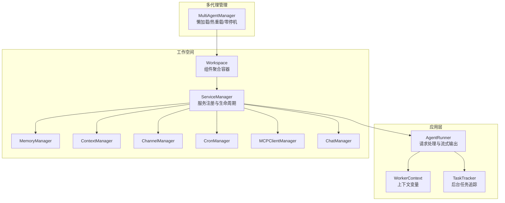

图示来源
- [src/qwenpaw/app/workspace/workspace.py:137-316](file://src/qwenpaw/app/workspace/workspace.py#L137-L316)
- [src/qwenpaw/app/workspace/service_manager.py:76-453](file://src/qwenpaw/app/workspace/service_manager.py#L76-L453)
- [src/qwenpaw/app/runner/runner.py:109-168](file://src/qwenpaw/app/runner/runner.py#L109-L168)
- [src/qwenpaw/app/agent_context.py:15-31](file://src/qwenpaw/app/agent_context.py#L15-L31)
- [src/qwenpaw/app/runner/task_tracker.py:37-50](file://src/qwenpaw/app/runner/task_tracker.py#L37-L50)
- [src/qwenpaw/app/multi_agent_manager.py:22-41](file://src/qwenpaw/app/multi_agent_manager.py#L22-L41)

章节来源
- [src/qwenpaw/app/workspace/workspace.py:38-125](file://src/qwenpaw/app/workspace/workspace.py#L38-L125)
- [src/qwenpaw/app/workspace/service_manager.py:76-171](file://src/qwenpaw/app/workspace/service_manager.py#L76-L171)
- [src/qwenpaw/app/runner/runner.py:109-168](file://src/qwenpaw/app/runner/runner.py#L109-L168)
- [src/qwenpaw/app/agent_context.py:15-31](file://src/qwenpaw/app/agent_context.py#L15-L31)
- [src/qwenpaw/app/runner/task_tracker.py:37-50](file://src/qwenpaw/app/runner/task_tracker.py#L37-L50)
- [src/qwenpaw/app/multi_agent_manager.py:22-41](file://src/qwenpaw/app/multi_agent_manager.py#L22-L41)

## 核心组件
- 工作空间（Workspace）
  - 聚合运行器、内存管理、上下文管理、通道、计划任务、MCP 客户端、聊天管理等组件，按优先级与依赖顺序启动/停止。
- 服务管理（ServiceManager）
  - 统一注册、并发/串行启动、依赖解析、可复用组件保留与热重载支持。
- 运行器（AgentRunner）
  - 请求入口，负责命令解析、会话状态加载/保存、消息流式输出、异常转换与错误转储、任务中断与取消。
- 上下文（WorkerContext）
  - 基于上下文变量的当前代理/会话/根会话标识传递，贯穿异步调用链，支撑跨会话审批与路由。
- 任务追踪（TaskTracker）
  - 后台任务（含外部任务）的注册、订阅、缓冲、全局状态查询与优雅停止。
- 多代理管理（MultiAgentManager）
  - 懒加载、并发启动、原子替换与零停机热重载、延迟清理与后台任务等待。

章节来源
- [src/qwenpaw/app/workspace/workspace.py:38-125](file://src/qwenpaw/app/workspace/workspace.py#L38-L125)
- [src/qwenpaw/app/workspace/service_manager.py:76-171](file://src/qwenpaw/app/workspace/service_manager.py#L76-L171)
- [src/qwenpaw/app/runner/runner.py:109-168](file://src/qwenpaw/app/runner/runner.py#L109-L168)
- [src/qwenpaw/app/agent_context.py:15-31](file://src/qwenpaw/app/agent_context.py#L15-L31)
- [src/qwenpaw/app/runner/task_tracker.py:37-50](file://src/qwenpaw/app/runner/task_tracker.py#L37-L50)
- [src/qwenpaw/app/multi_agent_manager.py:22-41](file://src/qwenpaw/app/multi_agent_manager.py#L22-L41)

## 架构总览
代理生命周期由“请求路由—上下文注入—工作空间获取—运行器处理—状态持久化—优雅关闭/热重载”构成闭环。请求经路由中间件注入代理与会话上下文，由多代理管理器按需懒加载工作空间，运行器在会话状态与请求上下文中执行业务逻辑（含命令、技能、计划、任务与任务流），最终在 finally 中保存会话状态并触碰聊天记录。

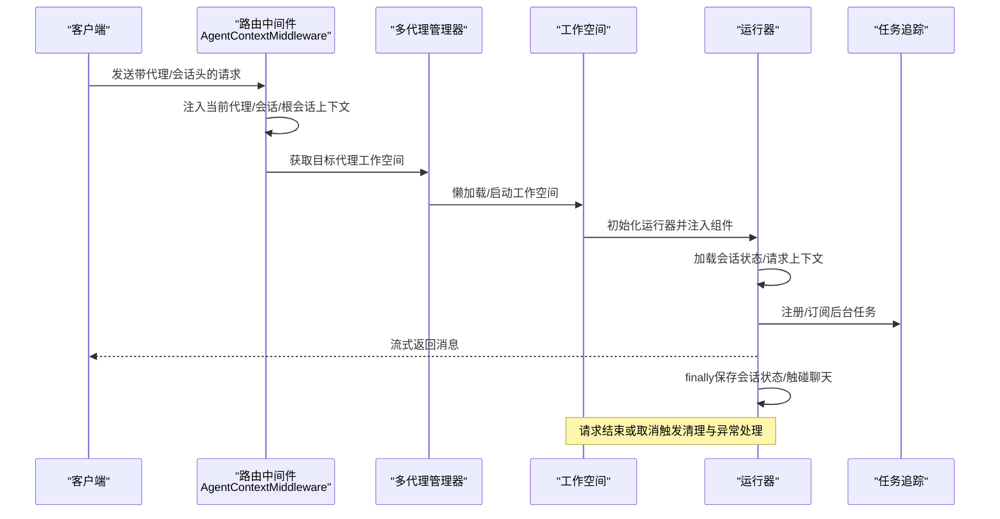

图示来源
- [src/qwenpaw/app/routers/agent_scoped.py:41-63](file://src/qwenpaw/app/routers/agent_scoped.py#L41-L63)
- [src/qwenpaw/app/agent_context.py:34-118](file://src/qwenpaw/app/agent_context.py#L34-L118)
- [src/qwenpaw/app/multi_agent_manager.py:42-136](file://src/qwenpaw/app/multi_agent_manager.py#L42-L136)
- [src/qwenpaw/app/workspace/workspace.py:351-392](file://src/qwenpaw/app/workspace/workspace.py#L351-L392)
- [src/qwenpaw/app/runner/runner.py:304-839](file://src/qwenpaw/app/runner/runner.py#L304-L839)

## 详细组件分析

### 代理运行器（AgentRunner）：任务调度与状态管理
- 职责
  - 解析用户输入与命令，分派至命令处理器或标准对话流程。
  - 构建请求上下文（会话、用户、渠道、根会话），注入环境变量与MCP客户端。
  - 管理会话状态加载/保存、计划模式钩子、任务中断与取消、异常转换与错误转储。
  - 提供流式消息输出，支持取消时的快速中断与清理。
- 关键点
  - 会话状态：在 finally 中保存，避免异常导致状态丢失。
  - 任务中断：捕获取消异常，自动取消待决审批并抛出统一异常。
  - 错误处理：统一转换模型异常，生成调试转储路径并附加到异常对象。
  - 任务追踪：通过运行器持有的 TaskTracker 管理后台任务生命周期。

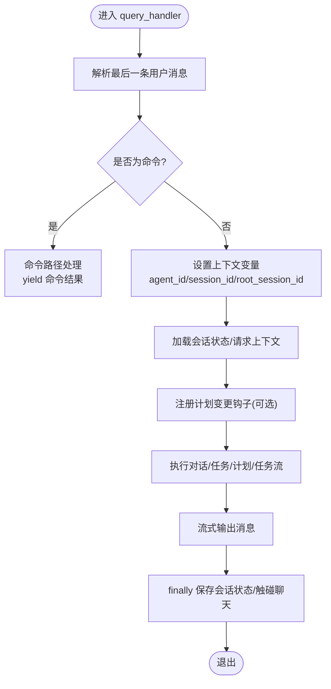

图示来源
- [src/qwenpaw/app/runner/runner.py:304-839](file://src/qwenpaw/app/runner/runner.py#L304-L839)

章节来源
- [src/qwenpaw/app/runner/runner.py:109-168](file://src/qwenpaw/app/runner/runner.py#L109-L168)
- [src/qwenpaw/app/runner/runner.py:304-839](file://src/qwenpaw/app/runner/runner.py#L304-L839)
- [src/qwenpaw/app/runner/command_dispatch.py:94-135](file://src/qwenpaw/app/runner/command_dispatch.py#L94-L135)

### 代理上下文（WorkerContext）：上下文传递与状态保存
- 设计
  - 使用上下文变量存储当前代理ID、会话ID、根会话ID，贯穿异步调用链。
  - 路由中间件从请求头与状态中注入上下文，运行器在处理前设置并使用。
- 作用
  - 支持跨会话审批路由（根会话ID）、令牌用量跟踪（会话ID）、以及命令/任务对当前代理的定位。
- 资源管理
  - 通过运行器在 finally 中保存会话状态，确保上下文状态持久化。

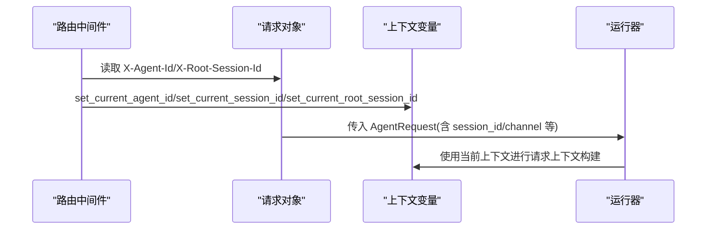

图示来源
- [src/qwenpaw/app/routers/agent_scoped.py:41-63](file://src/qwenpaw/app/routers/agent_scoped.py#L41-L63)
- [src/qwenpaw/app/agent_context.py:134-178](file://src/qwenpaw/app/agent_context.py#L134-L178)
- [src/qwenpaw/app/runner/runner.py:334-441](file://src/qwenpaw/app/runner/runner.py#L334-L441)

章节来源
- [src/qwenpaw/app/agent_context.py:15-31](file://src/qwenpaw/app/agent_context.py#L15-L31)
- [src/qwenpaw/app/agent_context.py:121-178](file://src/qwenpaw/app/agent_context.py#L121-L178)
- [src/qwenpaw/app/routers/agent_scoped.py:41-63](file://src/qwenpaw/app/routers/agent_scoped.py#L41-L63)
- [src/qwenpaw/app/runner/runner.py:334-441](file://src/qwenpaw/app/runner/runner.py#L334-L441)

### 工作空间（Workspace）与服务管理（ServiceManager）
- 工作空间
  - 以服务描述符声明式注册组件（运行器、内存、上下文、通道、计划任务、MCP、聊天、配置监视器等），按优先级与依赖顺序启动/停止。
- 服务管理
  - 并发/串行初始化、依赖解析、可复用组件保留、重启时的 reload_func 回调、统一 stop_all 行为。
- 生命周期
  - start：迁移历史数据、启动所有服务、标记已启动。
  - stop：按逆优先级停止，可选择是否停止可复用组件。

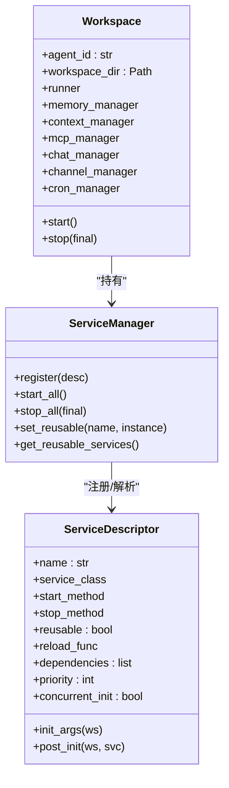

图示来源
- [src/qwenpaw/app/workspace/workspace.py:38-125](file://src/qwenpaw/app/workspace/workspace.py#L38-L125)
- [src/qwenpaw/app/workspace/service_manager.py:32-74](file://src/qwenpaw/app/workspace/service_manager.py#L32-L74)
- [src/qwenpaw/app/workspace/service_manager.py:173-251](file://src/qwenpaw/app/workspace/service_manager.py#L173-L251)

章节来源
- [src/qwenpaw/app/workspace/workspace.py:137-316](file://src/qwenpaw/app/workspace/workspace.py#L137-L316)
- [src/qwenpaw/app/workspace/service_manager.py:173-251](file://src/qwenpaw/app/workspace/service_manager.py#L173-L251)
- [src/qwenpaw/app/workspace/service_manager.py:362-453](file://src/qwenpaw/app/workspace/service_manager.py#L362-L453)

### 多代理管理（MultiAgentManager）：懒加载与零停机热重载
- 懒加载与并发启动
  - 首次请求时创建并启动工作空间，使用事件协调并发请求，避免重复初始化。
- 零停机热重载
  - 先创建新实例并启动，再原子替换旧实例，最后在后台检查并清理旧实例的活动任务。
- 优雅关闭
  - 取消所有延迟清理任务，逐个停止代理实例，保证资源释放。

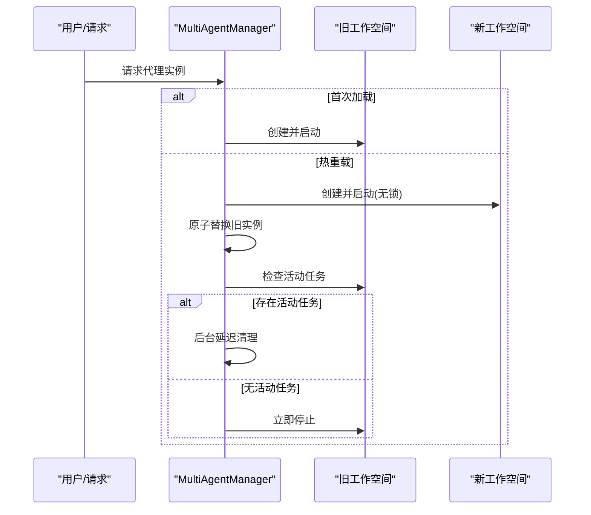

图示来源
- [src/qwenpaw/app/multi_agent_manager.py:42-136](file://src/qwenpaw/app/multi_agent_manager.py#L42-L136)
- [src/qwenpaw/app/multi_agent_manager.py:255-343](file://src/qwenpaw/app/multi_agent_manager.py#L255-L343)
- [src/qwenpaw/app/multi_agent_manager.py:138-200](file://src/qwenpaw/app/multi_agent_manager.py#L138-L200)

章节来源
- [src/qwenpaw/app/multi_agent_manager.py:42-136](file://src/qwenpaw/app/multi_agent_manager.py#L42-L136)
- [src/qwenpaw/app/multi_agent_manager.py:138-200](file://src/qwenpaw/app/multi_agent_manager.py#L138-L200)
- [src/qwenpaw/app/multi_agent_manager.py:255-343](file://src/qwenpaw/app/multi_agent_manager.py#L255-L343)
- [src/qwenpaw/app/multi_agent_manager.py:384-421](file://src/qwenpaw/app/multi_agent_manager.py#L384-L421)

### 计划任务与心跳（CronManager）
- 调度与暂停/恢复
  - 支持心跳任务与定时任务的调度、暂停、恢复与重新调度。
- 心跳回调
  - 在心跳周期内执行一次心跳逻辑，支持取消与异常日志记录。

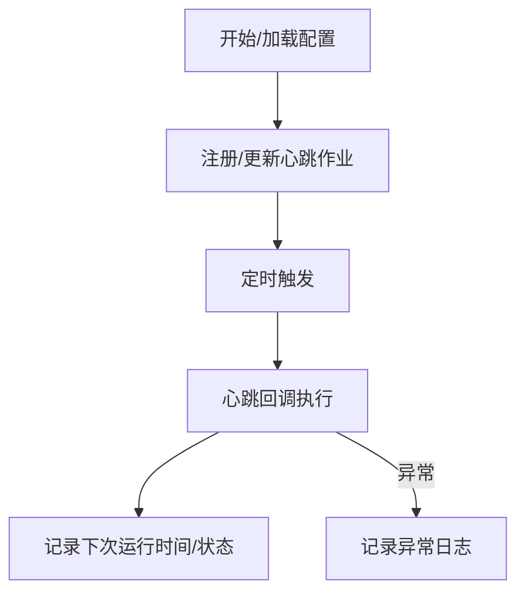

图示来源
- [src/qwenpaw/app/crons/manager.py:106-120](file://src/qwenpaw/app/crons/manager.py#L106-L120)
- [src/qwenpaw/app/crons/manager.py:189-195](file://src/qwenpaw/app/crons/manager.py#L189-L195)
- [src/qwenpaw/app/crons/manager.py:197-215](file://src/qwenpaw/app/crons/manager.py#L197-L215)
- [src/qwenpaw/app/crons/manager.py:466-484](file://src/qwenpaw/app/crons/manager.py#L466-L484)

章节来源
- [src/qwenpaw/app/crons/manager.py:106-120](file://src/qwenpaw/app/crons/manager.py#L106-L120)
- [src/qwenpaw/app/crons/manager.py:189-195](file://src/qwenpaw/app/crons/manager.py#L189-L195)
- [src/qwenpaw/app/crons/manager.py:197-215](file://src/qwenpaw/app/crons/manager.py#L197-L215)
- [src/qwenpaw/app/crons/manager.py:466-484](file://src/qwenpaw/app/crons/manager.py#L466-L484)

### 任务追踪（TaskTracker）：后台任务与流式订阅
- 功能
  - 注册/注销外部任务、查询全局状态、列出活动任务、等待全部完成、请求停止、附加/分离订阅者。
- 流式
  - 为每个 run_key 维护事件缓冲与队列，支持断线重连与哨兵值终止。

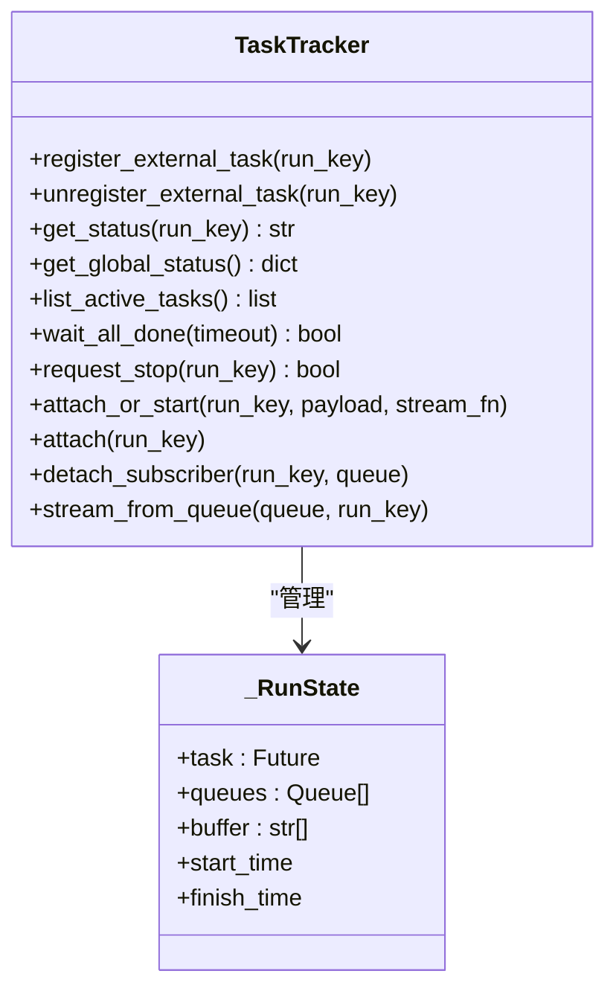

图示来源
- [src/qwenpaw/app/runner/task_tracker.py:37-50](file://src/qwenpaw/app/runner/task_tracker.py#L37-L50)
- [src/qwenpaw/app/runner/task_tracker.py:26-35](file://src/qwenpaw/app/runner/task_tracker.py#L26-L35)
- [src/qwenpaw/app/runner/task_tracker.py:131-187](file://src/qwenpaw/app/runner/task_tracker.py#L131-L187)
- [src/qwenpaw/app/runner/task_tracker.py:248-327](file://src/qwenpaw/app/runner/task_tracker.py#L248-L327)

章节来源
- [src/qwenpaw/app/runner/task_tracker.py:37-50](file://src/qwenpaw/app/runner/task_tracker.py#L37-L50)
- [src/qwenpaw/app/runner/task_tracker.py:131-187](file://src/qwenpaw/app/runner/task_tracker.py#L131-L187)
- [src/qwenpaw/app/runner/task_tracker.py:248-327](file://src/qwenpaw/app/runner/task_tracker.py#L248-L327)

### 命令与守护进程（Daemon Commands）
- 命令解析
  - 将用户输入解析为命令（如 /daemon status/restart/logs/version），并委派给对应处理器。
- 守护进程
  - /daemon restart 触发零停机热重载；/daemon reload-config 重新加载配置；/daemon logs 输出日志尾部内容。

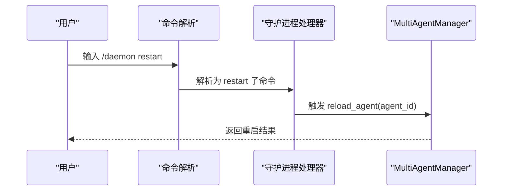

图示来源
- [src/qwenpaw/app/runner/command_dispatch.py:94-135](file://src/qwenpaw/app/runner/command_dispatch.py#L94-L135)
- [src/qwenpaw/app/runner/daemon_commands.py:134-159](file://src/qwenpaw/app/runner/daemon_commands.py#L134-L159)
- [src/qwenpaw/app/multi_agent_manager.py:255-343](file://src/qwenpaw/app/multi_agent_manager.py#L255-L343)

章节来源
- [src/qwenpaw/app/runner/command_dispatch.py:94-135](file://src/qwenpaw/app/runner/command_dispatch.py#L94-L135)
- [src/qwenpaw/app/runner/daemon_commands.py:134-159](file://src/qwenpaw/app/runner/daemon_commands.py#L134-L159)
- [src/qwenpaw/app/multi_agent_manager.py:255-343](file://src/qwenpaw/app/multi_agent_manager.py#L255-L343)

### 任务流与计划模式（Mission Dispatch）
- 任务流
  - 识别 /mission 命令，解析参数与最大迭代次数，进入任务阶段（PRD 审阅/执行）。
- 计划模式
  - 可选启用计划笔记本，注册变更钩子并通过广播通知前端更新。

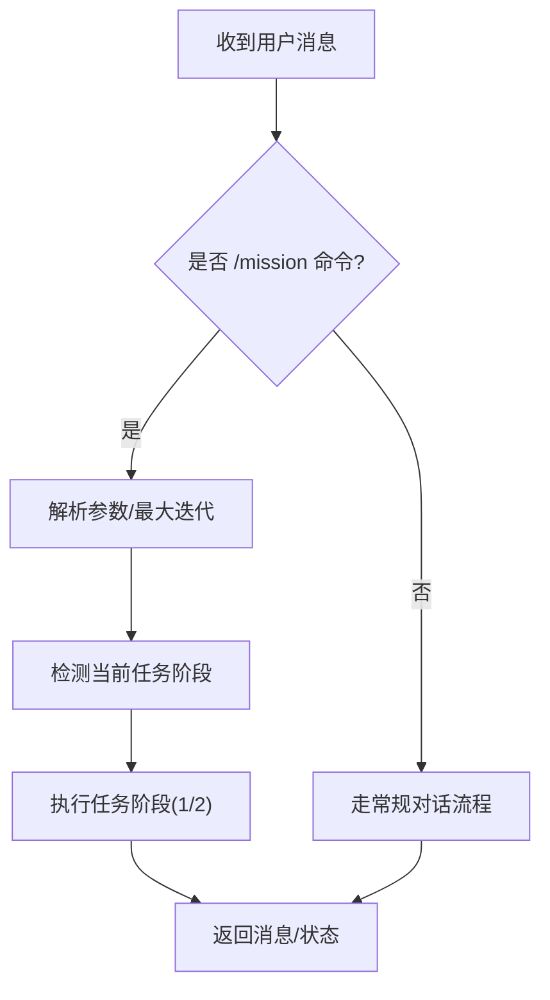

图示来源
- [src/qwenpaw/app/runner/mission_dispatch.py:44-84](file://src/qwenpaw/app/runner/mission_dispatch.py#L44-L84)
- [src/qwenpaw/agents/mission/handler.py:79-193](file://src/qwenpaw/agents/mission/handler.py#L79-L193)

章节来源
- [src/qwenpaw/app/runner/mission_dispatch.py:44-84](file://src/qwenpaw/app/runner/mission_dispatch.py#L44-L84)
- [src/qwenpaw/agents/mission/handler.py:79-193](file://src/qwenpaw/agents/mission/handler.py#L79-L193)

## 依赖分析
- 组件耦合
  - Workspace 通过 ServiceManager 统一管理各子系统，降低模块间直接耦合。
  - AgentRunner 依赖上下文变量、会话状态、任务追踪与命令分发。
  - MultiAgentManager 仅通过 Workspace 抽象与运行器交互，便于热重载。
- 外部依赖
  - agentscope_runtime 的 Runner 接口与消息模型；FastAPI 路由与上下文变量；APScheduler 用于计划任务。

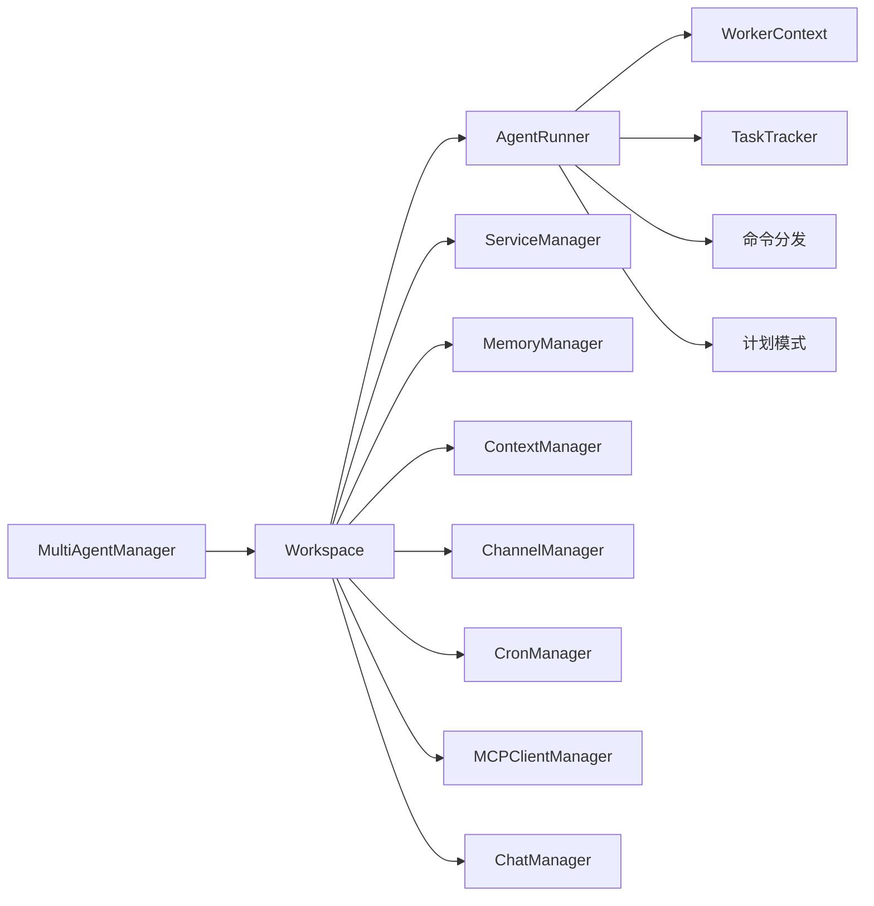

图示来源
- [src/qwenpaw/app/runner/runner.py:109-168](file://src/qwenpaw/app/runner/runner.py#L109-L168)
- [src/qwenpaw/app/workspace/workspace.py:137-316](file://src/qwenpaw/app/workspace/workspace.py#L137-L316)
- [src/qwenpaw/app/multi_agent_manager.py:22-41](file://src/qwenpaw/app/multi_agent_manager.py#L22-L41)

章节来源
- [src/qwenpaw/app/runner/runner.py:109-168](file://src/qwenpaw/app/runner/runner.py#L109-L168)
- [src/qwenpaw/app/workspace/workspace.py:137-316](file://src/qwenpaw/app/workspace/workspace.py#L137-L316)
- [src/qwenpaw/app/multi_agent_manager.py:22-41](file://src/qwenpaw/app/multi_agent_manager.py#L22-L41)

## 性能考虑
- 并发启动
  - ServiceManager 对同优先级服务采用并发初始化，缩短启动时间。
- 懒加载与去重
  - MultiAgentManager 对同一代理的并发请求进行去重，避免重复初始化。
- 事件循环让出
  - ServiceManager 在优先级组之间主动让出事件循环，保障服务器响应。
- 流式输出与中断
  - 运行器使用队列与任务取消机制，确保长连接流式输出可被及时中断。

## 故障排查指南
- 常见问题
  - 代理未找到/禁用：检查配置文件中的代理条目与启用状态。
  - 启动失败：查看 Workspace.start 的异常日志与回滚行为。
  - 会话状态不一致：确认 finally 是否成功保存会话状态。
  - 热重载后旧实例未清理：检查延迟清理任务是否完成或被取消。
- 排查步骤
  - 使用 /daemon logs 查看最近日志。
  - 使用 /daemon status 检查配置与组件状态。
  - 使用 /daemon restart 执行零停机重载并观察提示信息。
  - 检查 TaskTracker 的全局状态与活动任务列表。

章节来源
- [src/qwenpaw/app/agent_context.py:76-118](file://src/qwenpaw/app/agent_context.py#L76-L118)
- [src/qwenpaw/app/workspace/workspace.py:351-392](file://src/qwenpaw/app/workspace/workspace.py#L351-L392)
- [src/qwenpaw/app/runner/runner.py:828-839](file://src/qwenpaw/app/runner/runner.py#L828-L839)
- [src/qwenpaw/app/multi_agent_manager.py:138-200](file://src/qwenpaw/app/multi_agent_manager.py#L138-L200)
- [src/qwenpaw/app/runner/daemon_commands.py:101-131](file://src/qwenpaw/app/runner/daemon_commands.py#L101-L131)
- [src/qwenpaw/app/runner/daemon_commands.py:187-191](file://src/qwenpaw/app/runner/daemon_commands.py#L187-L191)

## 结论
本系统通过“工作空间+服务管理+运行器+上下文”的分层设计，实现了代理生命周期的清晰编排与可观测性。运行器承担请求处理与状态管理的核心职责，上下文确保跨请求的一致性，任务追踪保障后台任务的可控性，多代理管理器提供懒加载与零停机热重载能力。结合命令与守护进程机制，系统在稳定性与可运维性方面具备良好基础。

## 附录
- 启动配置要点
  - 在 Workspace 中注册各服务描述符，设置启动/停止方法与优先级。
  - 在 ServiceFactories 中注入 Runner 与 ChannelManager 的引用。
- 运行监控
  - 通过 TaskTracker 查询全局状态与活动任务，结合日志与守护进程命令进行观测。
- 异常恢复
  - 运行器在 finally 中保存会话状态；命令路径中对 /daemon restart 提前返回提示，确保用户感知。
- 优雅关闭
  - MultiAgentManager 在停止时取消延迟清理任务并逐个停止实例，避免资源泄漏。

章节来源
- [src/qwenpaw/app/workspace/workspace.py:266-303](file://src/qwenpaw/app/workspace/workspace.py#L266-L303)
- [src/qwenpaw/app/workspace/service_factories.py:93-108](file://src/qwenpaw/app/workspace/service_factories.py#L93-L108)
- [src/qwenpaw/app/runner/runner.py:828-839](file://src/qwenpaw/app/runner/runner.py#L828-L839)
- [src/qwenpaw/app/runner/command_dispatch.py:110-135](file://src/qwenpaw/app/runner/command_dispatch.py#L110-L135)
- [src/qwenpaw/app/multi_agent_manager.py:384-421](file://src/qwenpaw/app/multi_agent_manager.py#L384-L421)