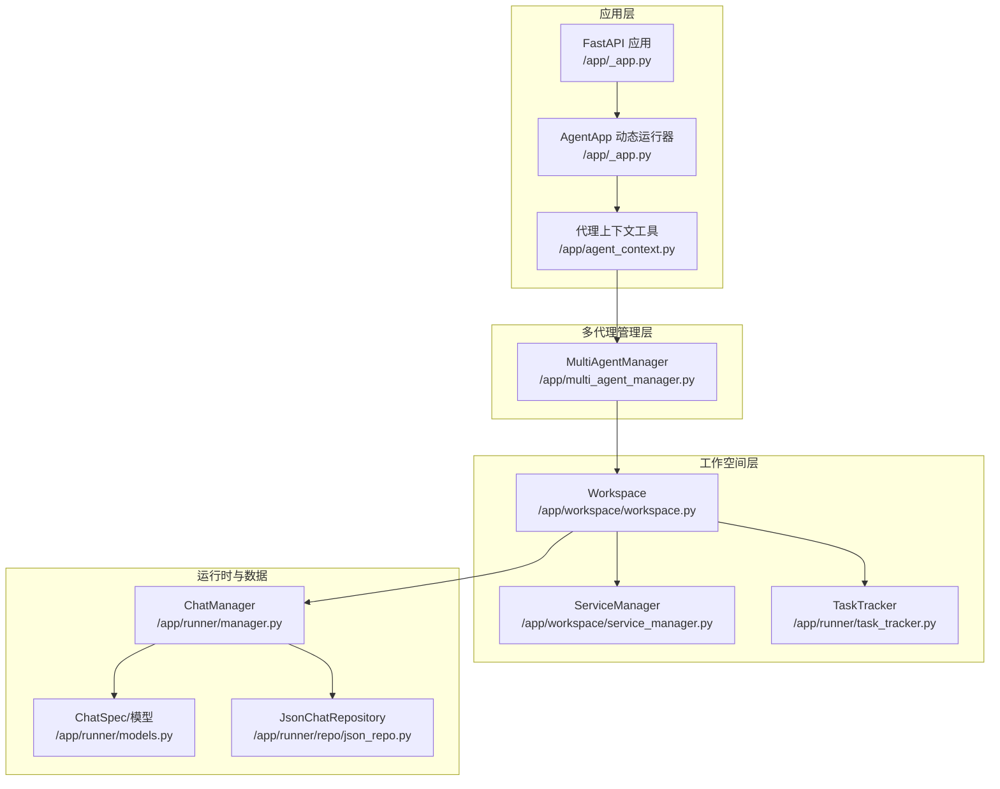
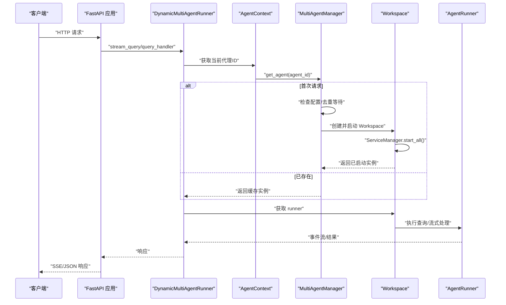
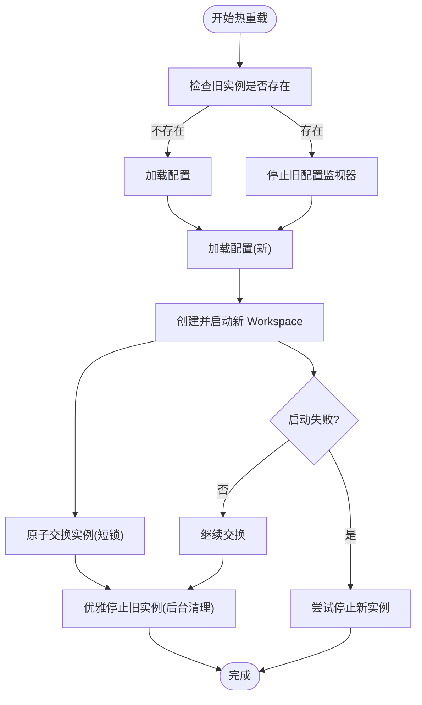
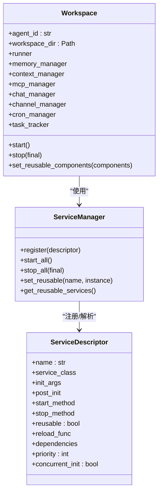
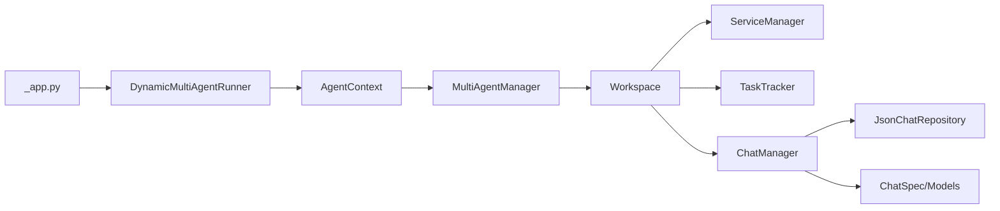

# 代理系统

<cite>
**本文引用的文件**
- [src/qwenpaw/app/multi_agent_manager.py](file://src/qwenpaw/app/multi_agent_manager.py)
- [src/qwenpaw/app/workspace/workspace.py](file://src/qwenpaw/app/workspace/workspace.py)
- [src/qwenpaw/app/workspace/service_manager.py](file://src/qwenpaw/app/workspace/service_manager.py)
- [src/qwenpaw/app/runner/task_tracker.py](file://src/qwenpaw/app/runner/task_tracker.py)
- [src/qwenpaw/app/runner/api.py](file://src/qwenpaw/app/runner/api.py)
- [src/qwenpaw/app/_app.py](file://src/qwenpaw/app/_app.py)
- [src/qwenpaw/app/agent_context.py](file://src/qwenpaw/app/agent_context.py)
- [src/qwenpaw/agents/__init__.py](file://src/qwenpaw/agents/__init__.py)
- [src/qwenpaw/app/runner/manager.py](file://src/qwenpaw/app/runner/manager.py)
- [src/qwenpaw/app/runner/models.py](file://src/qwenpaw/app/runner/models.py)
- [src/qwenpaw/app/runner/repo/json_repo.py](file://src/qwenpaw/app/runner/repo/json_repo.py)
</cite>

## 目录
1. [简介](#简介)
2. [项目结构](#项目结构)
3. [核心组件](#核心组件)
4. [架构总览](#架构总览)
5. [详细组件分析](#详细组件分析)
6. [依赖关系分析](#依赖关系分析)
7. [性能考量](#性能考量)
8. [故障排查指南](#故障排查指南)
9. [结论](#结论)
10. [附录](#附录)

## 简介
本文件系统性阐述 QwenPaw 的代理系统：以 MultiAgentManager 为中心的多代理集中管理、以 Workspace 为单位的工作空间隔离、基于 ServiceManager 的可插拔服务生命周期管理、以及支持零停机热重载与并发启动的运行时能力。文档同时覆盖代理的创建、启动、停止、重启流程，多代理之间的路由与隔离机制，并提供面向初学者的清晰概念解释与面向开发者的实现细节。

## 项目结构
代理系统的关键代码分布在以下模块：
- 应用入口与生命周期：FastAPI 应用、动态路由包装器、生命周期钩子
- 多代理管理：MultiAgentManager（集中管理、懒加载、并发启动、热重载）
- 工作空间：Workspace（独立运行时容器，封装 Runner、内存、通道、MCP、定时任务等）
- 服务管理：ServiceManager（声明式注册、优先级、并发初始化、可复用组件）
- 运行时与任务追踪：TaskTracker（内部流式任务、外部任务注册、全局状态）
- 聊天与会话：ChatManager、ChatSpec、JsonChatRepository（聊天规范与持久化）
- 请求上下文：AgentContext（请求到代理实例的路由）

图表来源
- [src/qwenpaw/app/_app.py:72-217](file://src/qwenpaw/app/_app.py#L72-L217)
- [src/qwenpaw/app/agent_context.py:34-118](file://src/qwenpaw/app/agent_context.py#L34-L118)
- [src/qwenpaw/app/multi_agent_manager.py:22-537](file://src/qwenpaw/app/multi_agent_manager.py#L22-L537)
- [src/qwenpaw/app/workspace/workspace.py:38-467](file://src/qwenpaw/app/workspace/workspace.py#L38-L467)
- [src/qwenpaw/app/workspace/service_manager.py:76-453](file://src/qwenpaw/app/workspace/service_manager.py#L76-L453)
- [src/qwenpaw/app/runner/task_tracker.py:37-350](file://src/qwenpaw/app/runner/task_tracker.py#L37-L350)
- [src/qwenpaw/app/runner/manager.py:17-286](file://src/qwenpaw/app/runner/manager.py#L17-L286)
- [src/qwenpaw/app/runner/models.py:15-89](file://src/qwenpaw/app/runner/models.py#L15-L89)
- [src/qwenpaw/app/runner/repo/json_repo.py:18-149](file://src/qwenpaw/app/runner/repo/json_repo.py#L18-L149)

章节来源
- [src/qwenpaw/app/_app.py:220-475](file://src/qwenpaw/app/_app.py#L220-L475)
- [src/qwenpaw/app/multi_agent_manager.py:22-537](file://src/qwenpaw/app/multi_agent_manager.py#L22-L537)
- [src/qwenpaw/app/workspace/workspace.py:38-467](file://src/qwenpaw/app/workspace/workspace.py#L38-L467)

## 核心组件
- MultiAgentManager：集中管理多个 Workspace 实例，提供懒加载、并发启动、原子替换的零停机热重载、优雅停机与后台清理、统一停止等能力。
- Workspace：单个代理的完整运行时容器，包含 Runner、内存、上下文、MCP 客户端、通道、定时任务等，通过 ServiceManager 统一注册与生命周期管理。
- ServiceManager：声明式服务注册与生命周期编排，支持优先级、并发初始化、可复用组件、依赖解析与重载回调。
- TaskTracker：每个 Workspace 内部的任务追踪器，用于内部流式任务与外部任务的注册、状态查询、等待完成、优雅取消。
- ChatManager/ChatSpec/JsonChatRepository：聊天规范的读写、更新、持久化与迁移。
- AgentContext/DynamicMultiAgentRunner：请求到代理实例的路由与动态分发，支持按请求头或中间件设置的代理标识进行选择。

章节来源
- [src/qwenpaw/app/multi_agent_manager.py:22-537](file://src/qwenpaw/app/multi_agent_manager.py#L22-L537)
- [src/qwenpaw/app/workspace/workspace.py:38-467](file://src/qwenpaw/app/workspace/workspace.py#L38-L467)
- [src/qwenpaw/app/workspace/service_manager.py:76-453](file://src/qwenpaw/app/workspace/service_manager.py#L76-L453)
- [src/qwenpaw/app/runner/task_tracker.py:37-350](file://src/qwenpaw/app/runner/task_tracker.py#L37-L350)
- [src/qwenpaw/app/runner/manager.py:17-286](file://src/qwenpaw/app/runner/manager.py#L17-L286)
- [src/qwenpaw/app/runner/models.py:15-89](file://src/qwenpaw/app/runner/models.py#L15-L89)
- [src/qwenpaw/app/runner/repo/json_repo.py:18-149](file://src/qwenpaw/app/runner/repo/json_repo.py#L18-L149)
- [src/qwenpaw/app/agent_context.py:34-118](file://src/qwenpaw/app/agent_context.py#L34-L118)
- [src/qwenpaw/app/_app.py:72-217](file://src/qwenpaw/app/_app.py#L72-L217)

## 架构总览
下图展示了从 HTTP 请求到具体代理实例的调用链路，以及多代理管理器如何在后台并发启动代理、如何在热重载时实现零停机。

图表来源
- [src/qwenpaw/app/_app.py:128-194](file://src/qwenpaw/app/_app.py#L128-L194)
- [src/qwenpaw/app/agent_context.py:34-118](file://src/qwenpaw/app/agent_context.py#L34-L118)
- [src/qwenpaw/app/multi_agent_manager.py:42-137](file://src/qwenpaw/app/multi_agent_manager.py#L42-L137)
- [src/qwenpaw/app/workspace/workspace.py:351-392](file://src/qwenpaw/app/workspace/workspace.py#L351-L392)

## 详细组件分析

### MultiAgentManager：集中管理与零停机热重载
- 懒加载与去重等待：同一 agent_id 的并发请求仅由首个发起者创建，其余等待 Event；锁仅用于字典检查与状态变更，避免阻塞慢启动。
- 并发启动：start_all_configured_agents 对所有启用的代理并发启动，get_agent 在创建工作实例期间释放锁，确保真正并行。
- 零停机热重载：reload_agent 步骤化原子替换，先创建新实例并启动，再交换旧实例，最后在后台优雅停止旧实例（若仍有活动任务则延后清理）。
- 优雅停机：stop_agent 与 stop_all 支持清理后台延迟任务集合，保证关闭时无悬挂任务。
- 可复用组件：支持在热重载前从旧实例提取可复用组件（如内存、上下文、聊天管理器），减少重建成本。

图表来源
- [src/qwenpaw/app/multi_agent_manager.py:255-382](file://src/qwenpaw/app/multi_agent_manager.py#L255-L382)

章节来源
- [src/qwenpaw/app/multi_agent_manager.py:42-137](file://src/qwenpaw/app/multi_agent_manager.py#L42-L137)
- [src/qwenpaw/app/multi_agent_manager.py:255-382](file://src/qwenpaw/app/multi_agent_manager.py#L255-L382)
- [src/qwenpaw/app/multi_agent_manager.py:409-433](file://src/qwenpaw/app/multi_agent_manager.py#L409-L433)

### Workspace：工作空间隔离与服务编排
- 独立运行时：每个 Workspace 拥有独立的 Runner、内存、上下文、MCP、通道、定时任务等。
- 服务注册：通过 ServiceDescriptor 声明式注册，定义初始化参数、后置初始化、启动/停止方法、是否可复用、依赖与优先级、是否并发初始化。
- 启动流程：加载配置、数据迁移、ServiceManager.start_all（按优先级并发/顺序组合）、标记已启动。
- 停止流程：ServiceManager.stop_all（可选择跳过可复用组件），标记未启动。
- 可复用组件：set_reusable_components 允许在启动前注入旧实例中的可复用组件，配合 reload_func 实现平滑重载。

图表来源
- [src/qwenpaw/app/workspace/workspace.py:38-467](file://src/qwenpaw/app/workspace/workspace.py#L38-L467)
- [src/qwenpaw/app/workspace/service_manager.py:32-158](file://src/qwenpaw/app/workspace/service_manager.py#L32-L158)

章节来源
- [src/qwenpaw/app/workspace/workspace.py:137-392](file://src/qwenpaw/app/workspace/workspace.py#L137-L392)
- [src/qwenpaw/app/workspace/service_manager.py:173-251](file://src/qwenpaw/app/workspace/service_manager.py#L173-L251)
- [src/qwenpaw/app/workspace/service_manager.py:362-453](file://src/qwenpaw/app/workspace/service_manager.py#L362-L453)

### ServiceManager：声明式服务生命周期
- 优先级与并发：按 priority 分组，同组内可并发初始化；顺序服务逐个启动；组间在每次序列化服务后让出事件循环，保障服务器在后台启动期间仍可处理请求。
- 可复用组件：支持标记服务为 reusable，并在新实例中注入旧实例的服务实例，必要时调用 reload_func。
- 启停策略：start 时异步构造（同步构造移至线程池），stop 时按逆优先级并行停止，错误记录但不中断整体流程。

章节来源
- [src/qwenpaw/app/workspace/service_manager.py:173-251](file://src/qwenpaw/app/workspace/service_manager.py#L173-L251)
- [src/qwenpaw/app/workspace/service_manager.py:362-453](file://src/qwenpaw/app/workspace/service_manager.py#L362-L453)

### TaskTracker：内部与外部任务追踪
- 内部流式任务：以 run_key（通常为 ChatSpec.id）跟踪一次运行，维护队列、缓冲区、订阅者断开自动清理。
- 外部任务：register_external_task/unregister_external_task 将外部任务纳入追踪，供 has_active_tasks/wait_all_done 使用。
- 全局状态：提供全局运行状态统计（运行中任务数、最近开始/结束时间）。

章节来源
- [src/qwenpaw/app/runner/task_tracker.py:37-188](file://src/qwenpaw/app/runner/task_tracker.py#L37-L188)
- [src/qwenpaw/app/runner/task_tracker.py:248-350](file://src/qwenpaw/app/runner/task_tracker.py#L248-L350)

### 聊天与会话：ChatManager/ChatSpec/JsonChatRepository
- ChatManager：提供聊天规范的增删改查、自动注册、条件更新（compare-and-set）等操作，所有操作在锁内进行。
- ChatSpec：聊天规范模型，包含 UUID、会话标识、用户标识、渠道、元信息、状态、置顶等字段。
- JsonChatRepository：单文件 JSON 存储，提供原子写入与“weixin”到“wechat”的历史迁移。

章节来源
- [src/qwenpaw/app/runner/manager.py:17-286](file://src/qwenpaw/app/runner/manager.py#L17-L286)
- [src/qwenpaw/app/runner/models.py:15-89](file://src/qwenpaw/app/runner/models.py#L15-L89)
- [src/qwenpaw/app/runner/repo/json_repo.py:18-149](file://src/qwenpaw/app/runner/repo/json_repo.py#L18-L149)

### 请求路由与上下文：AgentContext/DynamicMultiAgentRunner
- AgentContext：从请求中解析代理 ID（优先级：显式参数、中间件设置、请求头、配置默认），并校验代理存在与启用状态。
- DynamicMultiAgentRunner：根据请求动态选择对应 Workspace 的 Runner，将外部任务注册到 TaskTracker，确保热重载时能检测到仍在运行的任务。

章节来源
- [src/qwenpaw/app/agent_context.py:34-118](file://src/qwenpaw/app/agent_context.py#L34-L118)
- [src/qwenpaw/app/_app.py:72-217](file://src/qwenpaw/app/_app.py#L72-L217)

### 代理 API 与聊天接口
- 聊天 API：提供列出、创建、更新、删除、获取聊天详情等接口，结合 TaskTracker 返回聊天状态（idle/running）。
- 会话集成：聊天详情接口从会话存储中读取状态并转换为消息列表。

章节来源
- [src/qwenpaw/app/runner/api.py:65-234](file://src/qwenpaw/app/runner/api.py#L65-L234)

## 依赖关系分析
- MultiAgentManager 依赖 Workspace 与配置加载；Workspace 依赖 ServiceManager 与各类运行时组件。
- DynamicMultiAgentRunner 依赖 AgentContext 获取代理 ID，并委托 MultiAgentManager 获取 Workspace。
- ChatManager 依赖 JsonChatRepository 与会话存储；TaskTracker 由 Workspace 内部持有并在外部任务中被注册。
- FastAPI 应用在 lifespan 中初始化 MultiAgentManager，并在后台任务中并发启动所有代理。

图表来源
- [src/qwenpaw/app/_app.py:220-475](file://src/qwenpaw/app/_app.py#L220-L475)
- [src/qwenpaw/app/_app.py:72-217](file://src/qwenpaw/app/_app.py#L72-L217)
- [src/qwenpaw/app/agent_context.py:34-118](file://src/qwenpaw/app/agent_context.py#L34-L118)
- [src/qwenpaw/app/multi_agent_manager.py:22-537](file://src/qwenpaw/app/multi_agent_manager.py#L22-L537)
- [src/qwenpaw/app/workspace/workspace.py:38-467](file://src/qwenpaw/app/workspace/workspace.py#L38-L467)
- [src/qwenpaw/app/runner/manager.py:17-286](file://src/qwenpaw/app/runner/manager.py#L17-L286)
- [src/qwenpaw/app/runner/repo/json_repo.py:18-149](file://src/qwenpaw/app/runner/repo/json_repo.py#L18-L149)

章节来源
- [src/qwenpaw/app/_app.py:220-475](file://src/qwenpaw/app/_app.py#L220-L475)
- [src/qwenpaw/app/multi_agent_manager.py:22-537](file://src/qwenpaw/app/multi_agent_manager.py#L22-L537)

## 性能考量
- 懒加载与去重：首次访问才创建实例，避免冷启动高峰；并发请求共享等待事件，降低重复初始化。
- 并发启动：后台任务并发启动所有启用代理，缩短可用时间；get_agent 在慢启动阶段释放锁，提升吞吐。
- 服务并发初始化：ServiceManager 按优先级分组，同组并发，显著缩短启动时间。
- 线程池与非阻塞：服务构造与启动方法在需要时移至线程池，避免阻塞事件循环。
- 零停机热重载：最小化锁持有时间，后台优雅清理，确保请求连续性与资源回收。
- TaskTracker：内部流式任务采用队列与缓冲，订阅者断开自动清理，避免泄漏。

## 故障排查指南
- 代理未找到或禁用：检查配置 profiles 中是否存在该 agent_id，确认 enabled 字段；AgentContext 会在找不到或禁用时抛出相应异常。
- 启动失败：MultiAgentManager 在启动失败时会回滚停止部分启动的服务；查看 Workspace.start 的异常日志定位问题。
- 热重载失败：reload_agent 失败时会尝试停止新实例并保留旧实例；检查新实例启动日志与 ServiceManager 的 start_all 结果。
- 后台清理任务未退出：stop_all 会取消并等待所有延迟清理任务；若长时间未完成，检查相关任务是否被取消或卡住。
- 聊天接口异常：ChatManager 所有操作均在锁内执行；若出现超时或阻塞，检查仓库持久化与并发写入情况。

章节来源
- [src/qwenpaw/app/agent_context.py:76-118](file://src/qwenpaw/app/agent_context.py#L76-L118)
- [src/qwenpaw/app/multi_agent_manager.py:345-360](file://src/qwenpaw/app/multi_agent_manager.py#L345-L360)
- [src/qwenpaw/app/workspace/workspace.py:385-392](file://src/qwenpaw/app/workspace/workspace.py#L385-L392)
- [src/qwenpaw/app/runner/manager.py:176-202](file://src/qwenpaw/app/runner/manager.py#L176-L202)

## 结论
QwenPaw 的代理系统通过 MultiAgentManager 提供了集中管理、懒加载、并发启动与零停机热重载的能力；Workspace 与 ServiceManager 将复杂运行时组件解耦并统一编排；TaskTracker 保障内部与外部任务的可观测与可控；AgentContext 与 DynamicMultiAgentRunner 则实现了请求到代理实例的动态路由。整体设计兼顾易用性与扩展性，既适合初学者快速上手，也为高级用户提供充分的定制空间。

## 附录
- 代理配置与启用：在配置文件中定义 agents.profiles，设置每个代理的 workspace_dir 与 enabled 字段；MultiAgentManager 仅启动 enabled=True 的代理。
- 代理预加载：preload_agent 可在启动阶段提前加载指定代理，减少首次请求延迟。
- 聊天与会话：通过 ChatManager 与 JsonChatRepository 管理聊天规范与持久化；TaskTracker 提供运行状态查询与等待完成能力。

章节来源
- [src/qwenpaw/app/multi_agent_manager.py:453-531](file://src/qwenpaw/app/multi_agent_manager.py#L453-L531)
- [src/qwenpaw/app/runner/repo/json_repo.py:78-149](file://src/qwenpaw/app/runner/repo/json_repo.py#L78-L149)
- [src/qwenpaw/app/runner/task_tracker.py:86-129](file://src/qwenpaw/app/runner/task_tracker.py#L86-L129)